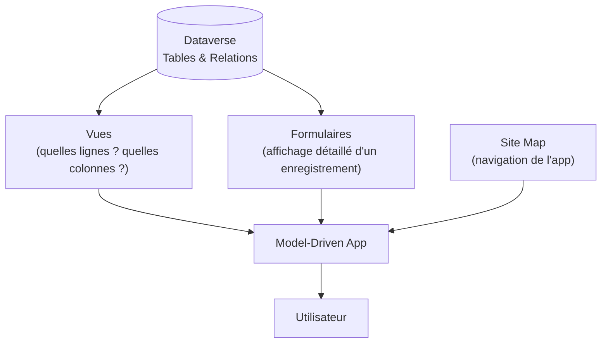

# Premières Model-Driven Apps

## Objectifs pédagogiques

À l'issue de ce module, vous serez capable de :

- Expliquer ce qui différencie une Model-Driven App d'une Canvas App et articuler le raisonnement de choix selon le contexte
- Comprendre le rôle de Dataverse comme fondation structurelle obligatoire d'une Model-Driven App
- Créer une application Model-Driven fonctionnelle à partir d'une table Dataverse existante
- Configurer vues et formulaires pour adapter l'affichage aux besoins métier
- Identifier les limites de l'approche Model-Driven et savoir quand elle devient contre-productive

---

## Mise en situation

Une équipe commerciale gère ses prospects dans un tableur Excel partagé. Le fichier pèse 12 000 lignes, cinq personnes le modifient simultanément, et personne ne sait qui a mis à jour quoi. Le directeur veut un suivi structuré : fiche prospect, historique des contacts, suivi des opportunités.

C'est exactement le terrain des Model-Driven Apps. Pas besoin de dessiner une interface de zéro — vous modélisez les données dans Dataverse, et Power Apps génère une application métier complète, cohérente, responsive, avec navigation intégrée.

Ce module vous accompagne de la première table jusqu'à une application publiée et utilisable — et vous explique aussi quand cette approche *ne convient pas*.

---

## Canvas vs Model-Driven : le raisonnement avant le tableau

La différence entre Canvas et Model-Driven n'est pas une question de puissance. C'est une question de paradigme — et surtout de *qui porte la charge de conception*.

Avec une Canvas App, vous **dessinez** l'écran : chaque bouton, chaque champ, chaque formule qui relie tout ça. La liberté est totale, mais vous êtes responsable de tout : la mise en page, la navigation, la cohérence visuelle, les performances de chargement.

Avec une Model-Driven App, vous **décrivez vos données** dans Dataverse — les tables, les colonnes, les relations — et Power Platform génère l'interface autour de cette structure. Le moteur sait déjà qu'une table doit avoir une vue liste et un formulaire de détail. Il sait naviguer entre les entités liées, afficher une timeline d'activités, gérer la recherche globale.

Avant de choisir, posez-vous ces trois questions :

1. **Mon app ressemble-t-elle à un backoffice ou à un CRM ?** Si oui, Model-Driven. Si l'UI est très spécifique, Canvas.
2. **Mes données vivent-elles dans plusieurs tables reliées ?** Des relations complexes (prospects → entreprises → contacts → opportunités) s'expriment naturellement en Model-Driven. À la main en Canvas, c'est possible mais coûteux.
3. **Ma source est-elle Dataverse ?** Model-Driven n'existe pas sans Dataverse. Si vos données sont dans SharePoint, SQL ou une API externe, Canvas s'impose.

| Dimension | Canvas App | Model-Driven App |
|---|---|---|
| Conception de l'UI | Manuelle, libre | Générée à partir des données |
| Source de données | N'importe quel connecteur | Dataverse (obligatoire) |
| Complexité relationnelle | Gérable à la main | Gérée nativement |
| Adapté pour | Processus ciblé, UI spécifique | Gestion d'entités métier complexes |
| Responsive automatique | Non (à concevoir) | Oui, nativement |
| Courbe de config initiale | Rapide pour app simple | Plus longue (Dataverse à modéliser) |

<!-- snippet
id: mda_canvas_vs_modeldriven_choix
type: concept
tech: Power Apps
level: beginner
importance: high
format: knowledge
tags: model-driven, canvas, choix, dataverse, architecture
title: Canvas App vs Model-Driven App — raisonnement de choix
content: Trois questions décident : (1) L'app ressemble-t-elle à un backoffice ou CRM ? (2) Les données sont-elles dans plusieurs tables reliées ? (3) La source est-elle Dataverse ? Si les trois réponses sont oui → Model-Driven. Si l'UI est très spécifique ou la source n'est pas Dataverse → Canvas. Le critère n'est pas la complexité mais le paradigme : données structurées multi-entités → Model-Driven, UI libre ou source externe → Canvas.
description: Le choix Canvas/Model-Driven se fait sur le paradigme (données vs interface), pas sur la complexité du projet.
-->

### Quand la Model-Driven App devient contre-productive

Il y a des cas où choisir Model-Driven est une erreur — mieux vaut le savoir avant de commencer.

**Tableau de bord analytique très visuel.** Les Model-Driven Apps affichent des graphiques basiques intégrés aux vues, mais elles ne sont pas conçues pour le storytelling data. Si votre besoin central est la visualisation, Power BI est la réponse — éventuellement embarqué dans une Canvas App.

**UI très spécifique ou non standard.** Un configurateur produit avec une interface 3D, une app de terrain avec un workflow très guidé pas à pas, une app grand public avec une expérience très soignée : Model-Driven génère une interface cohérente, pas une interface *sur-mesure*. La marge de personnalisation visuelle reste limitée sans passer par des PCF Controls (traités en niveau 3).

**Volumes très élevés avec requêtes complexes.** Dataverse gère bien les volumes courants (dizaines de milliers d'enregistrements), mais une vue mal configurée sur une table de plusieurs millions de lignes sans index adapté peut devenir lente. Ce n'est pas une limite rédhibitoire, mais c'est un point de vigilance à anticiper dès la modélisation.

**Contexte sans licence Dataverse.** Dataverse est inclus dans certaines licences Power Apps Premium. Si votre organisation n'a que des licences standard, l'accès à Dataverse peut ne pas être disponible — vérifiez avant de vous lancer.

<!-- snippet
id: mda_limites_cas_contre_indication
type: warning
tech: Power Apps
level: beginner
importance: high
format: knowledge
tags: model-driven, limites, canvas, choix, architecture
title: Quand NE PAS choisir une Model-Driven App
content: Éviter Model-Driven dans ces cas : (1) Tableau de bord analytique visuel → préférer Power BI. (2) UI très spécifique ou non standard → Canvas + PCF si nécessaire. (3) Très hauts volumes avec requêtes complexes non indexées → anticiper la modélisation Dataverse. (4) Absence de licence Dataverse dans l'organisation → vérifier avant de démarrer. Model-Driven excelle pour la gestion d'entités structurées, pas pour l'analytique ou les UX sur-mesure.
description: Model-Driven n'est pas la réponse universelle — quatre situations où Canvas ou Power BI sont plus adaptés.
-->

---

## Dataverse au cœur de l'architecture

Une Model-Driven App sans Dataverse n'existe pas — ce n'est pas une contrainte à subir, c'est le principe fondateur. Dataverse fournit le schéma structuré que le moteur de rendu utilise pour générer les formulaires, les vues et la navigation.

Pourquoi Dataverse plutôt qu'une autre base de données ? Parce que Dataverse n'est pas qu'un stockage : c'est un moteur qui comprend vos données. Il sait qu'une table a des colonnes typées, des relations vers d'autres tables, des règles métier, des rôles de sécurité. C'est cette sémantique que le moteur Model-Driven exploite pour générer l'interface sans que vous la dessiniez. Une base SQL ou SharePoint ne fournit pas cette couche de signification — c'est pour ça qu'ils ne peuvent pas alimenter une Model-Driven App.



**Tables** : les objets métier (Prospect, Opportunité, Contact). Chaque table devient une entité navigable dans l'app.

**Vues** : des requêtes sauvegardées qui définissent quelles lignes afficher et dans quel ordre. Une vue "Prospects actifs" filtre par statut. Une vue "Mes prospects" filtre par propriétaire.

**Formulaires** : la mise en page d'un enregistrement individuel. Quels champs sur quelle ligne, quels onglets, quelles sections. Un même enregistrement peut avoir plusieurs formulaires selon le rôle de l'utilisateur.

**Site Map** : le plan de navigation — les zones, groupes et entrées du menu latéral.

<!-- snippet
id: mda_dataverse_obligatoire
type: concept
tech: Power Apps
level: beginner
importance: high
format: knowledge
tags: model-driven, dataverse, prérequis, architecture
title: Pourquoi Dataverse est obligatoire pour les Model-Driven Apps
content: Dataverse n'est pas un simple stockage : c'est un moteur qui comprend la sémantique des données (colonnes typées, relations, règles métier, rôles de sécurité). Le moteur Model-Driven exploite cette sémantique pour générer l'interface automatiquement. SQL ou SharePoint ne fournissent pas cette couche de signification — c'est pourquoi ils ne peuvent pas alimenter une Model-Driven App.
description: Dataverse est obligatoire non par contrainte technique arbitraire, mais parce que sa sémantique est ce que le moteur Model-Driven utilise pour générer l'interface.
-->

<!-- snippet
id: mda_tables_standard_dataverse
type: tip
tech: Power Apps
level: beginner
importance: medium
format: knowledge
tags: dataverse, table-standard, contact, compte, crm
title: Vérifier les tables standard Dataverse avant d'en créer une nouvelle
content: Dataverse inclut des tables standard prêtes à l'emploi : Contact, Compte, Opportunité, Incident (ticket), Tâche, Email. Utiliser une table standard plutôt qu'une table personnalisée donne accès à des fonctionnalités intégrées (timeline, intégration Outlook, connecteurs Dynamics 365). Action : make.powerapps.com → Dataverse → Tables → filtrer "Standard" avant de créer une nouvelle table.
description: Les tables standard Dataverse embarquent des comportements natifs (timeline, intégrations) difficiles à recréer avec une table personnalisée.
-->

---

## Création de l'application : pas à pas

### Étape 1 — Préparer la table dans Dataverse

Avant d'ouvrir Power Apps, votre table doit exister dans Dataverse avec ses colonnes métier. Pour le cas prospects :

```
Dataverse → Tables → + New table
  Nom d'affichage : Prospect
  Colonne principale : Nom du prospect

Colonnes à ajouter :
  - Entreprise          (Texte, une ligne)
  - Email               (Email)
  - Téléphone           (Téléphone)
  - Statut              (Choix : Nouveau / Qualifié / Perdu / Gagné)
  - Date de premier contact (Date uniquement)
  - Propriétaire        (colonne système — Utilisateur)
```

**Un point critique dès l'étape 1 : le type de colonne Statut.** Si vous créez "Statut" en type Texte libre, vous vous retrouverez avec "Nouveau", "nouveau", "NOUVEAU" dans vos données — et vos filtres de vue, vos graphiques, vos automatisations Power Automate seront tous incohérents. Utilisez le type **Choix** (liste fermée) dès la création. C'est une décision qu'on ne peut pas facilement corriger après que des données ont été saisies.

<!-- snippet
id: mda_type_colonne_choix
type: warning
tech: Power Apps
level: beginner
importance: high
format: knowledge
tags: dataverse, colonne, choix, statut, type
title: Utiliser le type Choix pour les statuts, jamais le type Texte
content: Piège : créer une colonne Statut en type Texte libre. Conséquence immédiate : "Nouveau", "nouveau", "NOUVEAU" coexistent dans les données. Conséquences en cascade : filtres de vue incohérents, graphiques faux, automatisations Power Automate qui échouent silencieusement. Correction : utiliser le type Choix (liste fermée) dès la création — cette décision est très coûteuse à corriger après saisie de données.
description: Un statut en texte libre rend filtres, graphiques et automatisations imprévisibles — toujours préférer le type Choix pour toute valeur d'une liste fermée.
-->

### Étape 2 — Créer l'application

```
make.powerapps.com → + Créer → Application pilotée par modèle
  Nom : Suivi Prospects
  → Créer
```

Vous entrez dans le **concepteur d'applications**. À gauche, le panneau de navigation de l'app en construction. Au centre, la surface de travail.

### Étape 3 — Ajouter les pages

```
Concepteur d'app → + Ajouter une page → Vue et formulaire basés sur une table
  → Sélectionner la table : Prospect
  → Ajouter
```

Power Apps génère automatiquement une page avec la vue liste et le formulaire de détail par défaut. C'est votre point de départ — fonctionnel immédiatement, à affiner ensuite.

### Étape 4 — Configurer les vues

Les vues contrôlent ce que l'utilisateur voit dans la liste. Deux opérations essentielles :

**Modifier les colonnes affichées :**
```
Table Prospect → Vues → Vue active : Prospects actifs
  → Modifier les colonnes
  → Ajouter : Entreprise, Statut, Date de premier contact
  → Réordonner par glisser-déposer
  → Sauvegarder et publier
```

**Créer une vue personnalisée :**
```
Table Prospect → Vues → + Nouvelle vue
  Nom : Mes prospects
  → Filtrer par : Propriétaire = Utilisateur connecté
  → Sauvegarder et publier
```

> ⚠️ **Le piège numéro un des débutants — à lire maintenant, pas après.** Les modifications dans l'éditeur de vue ou de formulaire ne sont **pas visibles dans l'application** tant que vous n'avez pas cliqué "Sauvegarder et publier". Sauvegarder seul ne suffit pas. C'est l'erreur la plus fréquente : on modifie, on teste, rien ne change — on pense que ça ne fonctionne pas, on recommence. Terminez systématiquement chaque session d'édition par "Sauvegarder et publier", puis rechargez l'app.

<!-- snippet
id: mda_vue_publication_requise
type: warning
tech: Power Apps
level: beginner
importance: high
format: knowledge
tags: model-driven, vue, formulaire, publication, déploiement
title: Sauvegarder ne suffit pas — toujours publier après modification
content: Piège classique : modifier une vue ou un formulaire, sauvegarder, tester dans l'app → rien ne change. Cause : les personnalisations nécessitent une publication explicite ("Sauvegarder et publier"), pas seulement une sauvegarde. Réflexe à adopter dès l'étape 4 : terminer chaque session d'édition par "Sauvegarder et publier", puis recharger l'app avant de tester.
description: Les personnalisations de vues et formulaires nécessitent une publication explicite — sauvegarder ne suffit pas pour les voir dans l'app.
-->

**Sur la vue de recherche :** La "Vue de recherche" est affichée quand un utilisateur remplit un champ Lookup pointant vers cette table depuis une autre app ou formulaire. Si elle ne contient que l'identifiant interne, l'utilisateur ne peut pas identifier le bon enregistrement. Ajoutez au minimum le nom + une colonne discriminante (Entreprise, Email).

<!-- snippet
id: mda_vue_recherche_colonnes
type: tip
tech: Power Apps
level: beginner
importance: medium
format: knowledge
tags: model-driven, vue, recherche, colonnes, lookup
title: Configurer la vue de recherche avec des colonnes identifiantes
content: La "Vue de recherche" d'une table s'affiche quand un utilisateur remplit un champ Lookup pointant vers cette table. Si elle ne contient que l'identifiant interne, l'utilisateur ne peut pas distinguer les enregistrements. Action : ajouter au minimum le nom + une colonne discriminante (Entreprise, Email) dans la vue de recherche de chaque table exposée via Lookup.
description: La vue de recherche alimente les champs Lookup d'autres tables — sans colonnes identifiantes, les utilisateurs ne peuvent pas distinguer les enregistrements.
-->

### Étape 5 — Configurer le formulaire

Le formulaire détermine comment un enregistrement individuel s'affiche. L'éditeur permet de réorganiser les champs, de les regrouper en sections, d'ajouter des onglets pour les informations secondaires.

```
Table Prospect → Formulaires → Formulaire principal → Modifier
  → + Ajouter un composant → Section
    Nom : Qualification
    → Ajouter les colonnes : Statut, Date de premier contact
  → Sauvegarder et publier
```

Il existe plusieurs types de formulaires par table : *Principal* (la fiche complète — votre priorité), *Création rapide* (popup pour créer rapidement sans ouvrir la fiche), *Carte* (aperçu condensé pour certains composants avancés). Pour commencer, seul le formulaire Principal est indispensable.

<!-- snippet
id: mda_formulaire_types
type: concept
tech: Power Apps
level: beginner
importance: medium
format: knowledge
tags: model-driven, formulaire, principal, creation-rapide, carte
title: Les trois types de formulaires Dataverse à connaître
content: Principal = fiche complète d'un enregistrement (priorité absolue à configurer). Création rapide = popup pour saisie rapide sans ouvrir la fiche complète (doit être activé sur la table). Carte = aperçu condensé utilisé dans certains composants d'affichage avancés. Pour un débutant : configurer uniquement le formulaire Principal. Les deux autres peuvent attendre.
description: Trois types de formulaires coexistent par table — pour un débutant, seul le formulaire Principal est à configurer en priorité.
-->

### Étape 6 — Configurer la navigation

Le Site Map définit ce que l'utilisateur voit dans le menu latéral. Dans le nouveau concepteur, il se configure directement dans le panneau "Navigation".

```
Concepteur d'app → Navigation → Pages
  → Renommer les groupes pour refléter les domaines métier
  → Réordonner les entrées
```

Une table Dataverse non référencée dans le Site Map reste accessible via les Lookups, mais n'apparaît pas dans le menu — l'utilisateur ne peut pas y naviguer directement.

<!-- snippet
id: mda_site_map_navigation
type: concept
tech: Power Apps
level: beginner
importance: medium
format: knowledge
tags: model-driven, site-map, navigation, menu
title: Le Site Map contrôle la navigation visible de l'app
content: Le Site Map définit les zones et entrées du menu latéral. Chaque entrée pointe vers une table (affiche ses vues) ou vers un tableau de bord. Dans le nouveau concepteur, il se configure dans "Navigation → Pages". Les tables Dataverse non référencées restent accessibles via les Lookups mais n'apparaissent pas dans le menu — l'utilisateur ne peut pas y accéder directement.
description: Seules les tables référencées dans le Site Map apparaissent dans le menu — une table non référencée reste invisible pour l'utilisateur sauf via Lookup.
-->

### Étape 7 — Publier et tester

```
Concepteur d'app → Publier
  → Lancer l'app (bouton lecture)
```

L'application s'ouvre dans le navigateur. Créez des enregistrements, testez les vues, naviguez entre les fiches. Si quelque chose ne s'affiche pas comme attendu, vérifiez en premier : avez-vous bien publié la vue ou le formulaire modifié ?

<!-- snippet
id: mda_creation_app_etapes
type: tip
tech: Power Apps
level: beginner
importance: high
format: knowledge
tags: model-driven, creation, concepteur, page, table
title: Séquence minimale pour une Model-Driven App fonctionnelle
content: "1. Créer la table dans Dataverse avec ses colonnes (dont Statut en type Choix). 2. make.powerapps.com → + Créer → Application pilotée par modèle. 3. + Ajouter une page → Vue et formulaire basés sur une table → sélectionner la table. 4. Configurer vues et formulaires dans l'éditeur de table → Sauvegarder et publier à chaque modification. 5. Publier depuis le concepteur d'app. Sans l'étape 5, aucune modification n'est visible dans l'app."
description: Cinq étapes suffisent pour une première Model-Driven App fonctionnelle — la publication finale est l'oubli le plus courant.
-->

---

## Ce que vous obtenez sans rien configurer de plus

C'est souvent la partie la plus surprenante pour quelqu'un qui vient des Canvas Apps : une Model-Driven App de base embarque des fonctionnalités que vous auriez dû coder manuellement ailleurs.

**Timeline :** Chaque enregistrement dispose d'une section activités qui trace automatiquement les emails, appels, tâches et notes associés — sans configuration supplémentaire.

**Filtres rapides :** La vue liste intègre des filtres dynamiques sur les colonnes affichées. L'utilisateur filtre par statut, propriétaire, date directement depuis l'interface.

**Recherche globale :** La barre de recherche en haut interroge toutes les tables exposées dans le Site Map.

**Responsive automatique :** L'interface s'adapte au mobile sans travail supplémentaire.

**Contrôle des accès :** Les droits d'accès aux enregistrements s'appuient sur les rôles de sécurité Dataverse, pas sur une logique à coder dans l'app. Ce point est couvert en détail dans le module suivant.

---

## Cas réel — Support IT interne

Une entreprise de 800 personnes gère ses tickets de support informatique par email. L'équipe IT reçoit 150 demandes par semaine, sans priorisation ni traçabilité.

**Solution déployée :** Une Model-Driven App sur deux tables Dataverse — `Ticket` et `Catégorie`. Trois vues : "Tickets ouverts", "Mes tickets", "Tickets critiques". Formulaire principal avec Timeline pour les échanges utilisateur. Champ Choix `Priorité` (Basse / Normale / Haute / Critique).

**Ce qui a fonctionné immédiatement :** La Timeline a été adoptée sans formation — les techniciens y retrouvaient leurs habitudes email. Les vues filtrées ont remplacé les recherches manuelles dans Excel.

**Ce qui a posé problème le jour J :** Les techniciens ne comprenaient pas qu'après avoir modifié un ticket, il fallait explicitement enregistrer avant de naviguer vers un autre. En Canvas App, certains outils sauvegardent automatiquement — ici, le comportement du formulaire Dataverse est différent. Solution : ajouter un écran d'entraînement de 30 minutes avant le déploiement, centré uniquement sur ce comportement.

**Ajustement post-déploiement :** La vue "Tickets critiques" avait été configurée avec un filtre sur Priorité = Critique, mais personne n'avait défini de processus pour qualifier la priorité à la saisie. Résultat : 80 % des tickets restaient en Basse priorité par défaut. Correction : définir Normale comme valeur par défaut de la colonne Priorité dans Dataverse, et ajouter une règle métier qui bloque la création si Priorité n'a pas été explicitement choisie.

**Résultat global :** Déployé en 3 jours par un consultant junior, utilisable sur mobile par les techniciens en déplacement, zéro ligne de code.

---

## Bonnes pratiques dès le départ

**Nommez vues et formulaires explicitement.** "Vue principale" ne dit rien à un collègue qui rejoint le projet six mois après. "Tickets ouverts — Vue équipe niveau 1" est sans ambiguïté.

**Limitez les colonnes dans les vues.** Une vue avec 12 colonnes est illisible sur un écran standard. 4 à 6 colonnes clés suffisent — les autres sont accessibles dans la fiche détail.

**Ne doublez pas les données.** Si l'information "entreprise" existe déjà dans une table Compte Dataverse, reliez votre table Prospect à Compte via une colonne Recherche — ne recopiez pas le nom en texte libre.

**Définissez des valeurs par défaut sur les colonnes Choix.** Sans valeur par défaut, les utilisateurs laissent souvent le champ vide ou choisissent la première option sans réfléchir. Une valeur par défaut sensée réduit les erreurs de saisie dès le premier jour.

**Anticipez la maintenance.** Une Model-Driven App évolue avec le modèle Dataverse. Si vous ajoutez une colonne dans Dataverse, elle n'apparaît pas automatiquement dans le formulaire — vous devez l'ajouter manuellement et republier. Documentez vos personnalisations pour ne pas perdre le fil.

---

## Résumé

Une Model-Driven App n'est pas une Canvas App simplifiée — c'est un paradigme différent. Vous modélisez vos données dans Dataverse, et l'interface suit. Moins de liberté sur le pixel, mais une cohérence et une productivité sans comparaison pour les cas de gestion d'entités structurées : CRM, tickets, suivi réglementaire, gestion de projets.

Le raisonnement de choix tient en trois questions : est-ce que mes données sont dans Dataverse, est-ce que j'ai plusieurs tables reliées, est-ce que l'app ressemble à un backoffice ? Si oui aux trois, Model-Driven est le bon outil. Si l'UI est très spécifique, si le besoin est analytique, ou si les volumes sont extrêmes sans modélisation adaptée, Canvas ou Power BI seront plus pertinents.

Les trois points à ne pas oublier avant de tester :

1. **Types de colonnes** — Statut en Choix, pas en Texte.
2. **Publication** — Sauvegarder et publier après chaque modification de vue ou formulaire.
3. **Valeurs par défaut** — Définir des valeurs sensées sur les colonnes obligatoires avant déploiement.

Le module suivant couvre les rôles de sécurité Dataverse — la couche qui contrôle qui voit quoi et qui peut faire quoi dans votre application.
