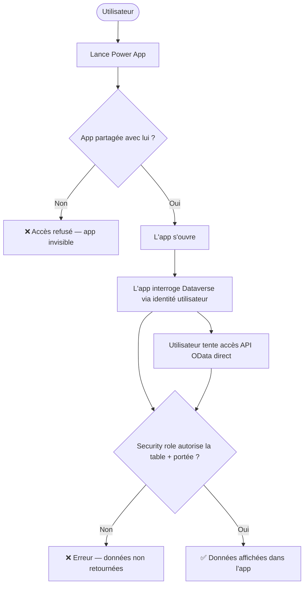

# Sécurité Power Apps — Niveau débutant

## Objectifs pédagogiques

À l'issue de ce module, vous serez capable de :

1. **Identifier** les surfaces d'exposition d'une Power App et les données qu'elle manipule
2. **Configurer** le partage d'une application au bon niveau (utilisateur, groupe, organisation)
3. **Comprendre** comment les security roles Dataverse contrôlent l'accès aux données sous-jacentes
4. **Choisir** la portée d'un security role selon un contexte métier concret et ses compromis
5. **Appliquer** le principe de moindre privilège dans un premier déploiement Power Apps

---

## Mise en situation

En 2022, une collectivité territoriale française déploie une Canvas App interne pour gérer les demandes de congés. L'application est partagée "avec toute l'organisation" pour simplifier le déploiement — un raccourci classique. La source de données est une table Dataverse qui contient, en plus des demandes, les fiches RH complètes des agents : salaires, évaluations, situations personnelles.

Trois semaines après le déploiement, un agent découvre que Power Apps expose une API OData sur la table Dataverse. En inspectant les requêtes réseau dans les DevTools de son navigateur, il reconstruit l'URL de l'endpoint et interroge directement la table — sans passer par l'application. Il récupère 1 400 fiches RH en clair.

**Ce qui a failli :** l'application était bien protégée. La donnée, elle, ne l'était pas. L'app n'est qu'une interface — si le security role Dataverse accorde un accès étendu, n'importe quel client HTTP peut contourner l'interface et interroger la donnée directement.

Ce scénario illustre la règle fondamentale : **sécuriser l'app et sécuriser la donnée sont deux opérations distinctes, toutes les deux obligatoires.**

---

## Surface d'exposition d'une Power App

Avant de configurer quoi que ce soit, il faut savoir ce qui est réellement exposé.

| Vecteur | Ce qui est exposé | Impact potentiel |
|---|---|---|
| Partage de l'application | L'interface utilisateur et les connecteurs configurés | Accès à des fonctions métier non autorisées |
| Security role Dataverse | Les lignes et colonnes de données en base | Lecture/écriture/suppression de données sensibles |
| Connecteurs et sources externes | Credentials implicites dans la connexion | Accès à des systèmes tiers (SharePoint, SQL…) |
| URL de l'app | L'app est accessible à quiconque possède le lien si le partage est mal configuré | Exposition publique involontaire |
| Environnement Power Platform | Toutes les ressources de l'environnement (apps, flows, tables) | Périmètre de compromission si l'environnement est mal isolé |

**Concept clé — L'app n'est pas un proxy de sécurité**

Power Apps ne filtre pas les données côté serveur à votre place. Quand une Canvas App appelle un connecteur Dataverse, c'est l'identité de l'utilisateur connecté qui est utilisée pour interroger la base. Si cet utilisateur a un security role trop permissif, il peut interroger les mêmes données en dehors de l'application — via l'API OData de Dataverse, via Power Automate, via une autre app. Le contrôle d'accès aux données doit donc vivre dans Dataverse, pas dans l'app.

---

## Partage d'une application : trois niveaux, trois risques

### Comment le partage fonctionne

Quand vous partagez une Power App, vous accordez à un utilisateur (ou un groupe) le droit de **lancer l'application**. Ce partage ne touche pas aux données — il contrôle uniquement qui peut ouvrir l'interface.

Chemin dans l'interface :

```
Power Apps (make.powerapps.com) → Apps → [Nom de l'app] → ⋯ → Share
```

Trois options de partage existent :

| Mode | Ce que ça fait | Risque |
|---|---|---|
| Utilisateurs spécifiques / groupes AAD | Seuls les membres du groupe peuvent lancer l'app | ✅ Recommandé |
| Toute l'organisation | N'importe quel compte du tenant peut lancer l'app | ⚠️ Acceptable uniquement si la donnée est réellement publique |
| Lien partageable (preview) | Quiconque possède le lien peut accéder à l'app | 🔴 Éviter en contexte professionnel |

Le bouton "Share with everyone in my org" est à portée de clic. Il est tentant lors d'un déploiement rapide. Mais dans un tenant de 10 000 utilisateurs, ça signifie 10 000 personnes potentiellement autorisées à ouvrir l'app — y compris des prestataires externes, des comptes de service, des comptes inactifs. Correction : créer un groupe de sécurité AAD dédié et partager uniquement avec ce groupe.

### Canvas Apps vs Model-Driven Apps

Le mécanisme de partage diffère selon le type d'app :

- **Canvas App** : partage explicite, utilisateur par utilisateur ou via groupe AAD. L'app est invisible dans l'interface Power Apps tant qu'elle n'est pas partagée avec vous.
- **Model-Driven App** : l'accès est contrôlé par les security roles Dataverse. Si un utilisateur a le bon role dans le bon environnement, il voit l'app. Il n'y a pas de "partage" au sens canvas — la porte d'entrée, c'est le role.

---

## Security roles Dataverse : la vraie ligne de défense

### Mécanisme de base

Les security roles Dataverse définissent ce qu'un utilisateur peut faire sur chaque table : créer, lire, écrire, supprimer, partager, assigner. Chaque permission est croisée avec une **portée** :

```
Utilisateur → Equipe → Unité commerciale → Organisation entière
```

Un utilisateur avec le droit "Read" sur la table "Contact" en portée "Organisation" peut lire **tous les contacts du tenant**, pas seulement les siens. En portée "Utilisateur", il ne lit que les enregistrements qu'il possède. C'est la même permission, mais l'impact est radicalement différent.

### Créer un security role — étapes dans l'Admin Center

```
Power Platform Admin Center (admin.powerplatform.microsoft.com)
  → Environments
  → [Votre environnement]
  → Settings
  → Users + Permissions
  → Security Roles
  → + New role
```

Une fois dans l'éditeur de role, vous configurez les permissions table par table. Exemple pour une app de gestion de demandes de congés :

```
Table : Demande_Congés
  Create   : ● Utilisateur    (l'agent crée ses propres demandes)
  Read     : ● Utilisateur    (l'agent lit ses propres demandes)
  Write    : ○ Aucune         (modification gérée par le flow d'approbation)
  Delete   : ○ Aucune         (suppression interdite)

Table : Référentiel_Types_Congés
  Create   : ○ Aucune
  Read     : ● Organisation   (liste déroulante visible par tous)
  Write    : ○ Aucune
  Delete   : ○ Aucune

Toutes les autres tables : ○ Aucune sur toutes les permissions
```

La logique est toujours la même : partir de zéro et **ajouter** uniquement ce qui est justifié, jamais enlever depuis un role existant large.

### Diagramme — Flux de contrôle d'accès



Le schéma montre que l'API OData passe par **le même contrôle de security role** que l'application. C'est pourquoi le security role est la vraie ligne de défense — pas l'interface de l'app.

---

## Choisir la portée : raisonnement par scénario

La portée n'est pas un réglage technique arbitraire — c'est un choix métier. Voici comment raisonner selon le contexte réel.

### Scénario 1 — Équipe commerciale collaborative (50 commerciaux)

**Contexte :** Les commerciaux partagent leurs opportunités en équipe. Un chef d'équipe doit voir les opportunités de ses membres, mais pas celles des autres équipes.

**Portée recommandée :** `Equipe` sur Read/Write pour la table Opportunity.

**Compromis :** Les membres d'une équipe se voient mutuellement les données. Si un commercial change d'équipe dans AAD, ses enregistrements restent visibles par l'ancienne équipe tant que l'appartenance n'est pas mise à jour dans Dataverse. La gestion des équipes Dataverse demande donc une synchronisation avec les équipes AAD.

### Scénario 2 — Support client (200 agents isolés)

**Contexte :** Chaque agent gère ses propres tickets. Il ne doit pas voir ceux de ses collègues. Le superviseur a un role séparé.

**Portée recommandée :** `Utilisateur` sur Read/Write pour la table Ticket.

**Compromis :** La portée Utilisateur est la plus restrictive, mais elle interdit toute collaboration directe entre agents. Si un agent est absent, un collègue ne peut pas reprendre ses tickets sans une logique de réassignation explicite (changement de propriétaire via flow).

### Scénario 3 — Tableau de bord direction (lecture seule)

**Contexte :** Les directeurs accèdent à un dashboard récapitulatif. Ils doivent lire toutes les données agrégées, mais ne peuvent rien modifier.

**Portée recommandée :** `Organisation` sur Read uniquement, `Aucune` sur Create/Write/Delete.

**Compromis :** C'est le seul scénario où Organisation est justifié — parce que le besoin métier l'exige explicitement. La lecture Organisation sans restriction d'écriture est acceptable si ces directeurs sont peu nombreux et que la donnée n'est pas ultra-sensible (salaires, données personnelles). Pour des données RH, préférer une vue agrégée via Power BI avec RLS plutôt qu'un accès direct à la table.

### Ce que ce raisonnement change

La question n'est pas "quelle est la portée la plus sûre ?" (réponse triviale : Utilisateur). La question est : **quelle est la portée minimale qui permet au métier de fonctionner ?** Sécurité et usabilité s'arbitrent ensemble — une portée trop restrictive génère des contournements (exports Excel manuels, partages informels) qui sont souvent pires que la donnée exposée.

---

## Connexions et credentials : qui s'authentifie réellement ?

### Deux modes de connexion dans une Canvas App

| Mode | Mécanisme | Risque |
|---|---|---|
| **Connexion utilisateur** (User connection) | L'identité AAD de l'utilisateur connecté est propagée. Les permissions Dataverse de cet utilisateur s'appliquent. | Risque limité si les security roles sont bien configurés |
| **Connexion intégrée** (Embedded / Service account) | Un compte de service ou une connexion fixe est intégrée dans l'app. Tous les utilisateurs voient les données à travers ce compte. | 🔴 Tous les utilisateurs héritent des permissions — potentiellement larges — du compte de service |

Une Canvas App connectée à une base SQL Azure avec un compte `sa` ou `admin` expose l'intégralité de la base à tous les utilisateurs de l'app, quel que soit leur rôle réel. Correction : utiliser des comptes SQL à portée limitée, ou basculer vers Dataverse avec des security roles utilisateur.

Pour les Canvas Apps connectées à Dataverse, la connexion utilisateur est activée par défaut et applique les security roles de l'utilisateur réel. C'est la configuration la plus sûre. Ne pas la remplacer par un compte de service sans analyse de risque explicite.

---

## Environnements : le premier niveau d'isolation

Un environnement Power Platform est un conteneur isolé qui regroupe des apps, des flows, une base Dataverse et des connexions. Un utilisateur d'un environnement ne voit pas automatiquement les ressources d'un autre environnement.

L'environnement "Default" d'un tenant est accessible à tous les utilisateurs du tenant par défaut. C'est l'environnement dans lequel tous les nouveaux utilisateurs créent leurs apps s'ils n'en ont pas d'autre. Une app déployée dans Default et partagée avec "tout le monde" est visible de l'ensemble de l'organisation sans restriction supplémentaire.

| Environnement | Usage recommandé | Accès |
|---|---|---|
| Default | Prototypage individuel, tests rapides | Tous les utilisateurs du tenant |
| Développement | Construction des apps | Équipe de développement uniquement |
| Recette / UAT | Tests métier | Équipe projet + utilisateurs clés |
| Production | Usage réel | Utilisateurs finaux via groupes de sécurité AAD |

Les apps sensibles ne doivent jamais être déployées dans Default.

---

## Cas réel : la DRH et les 5 000 fiches

Un groupe industriel déploie une Model-Driven App RH dans l'environnement Default. Le security role attribué aux responsables d'équipe est "Basic User" — un role générique fourni par Microsoft qui inclut, par défaut, un accès en lecture en portée Organisation sur plusieurs tables système.

Un responsable d'équipe curieux ouvre la console développeur de son navigateur pendant qu'il utilise l'app. Il observe les appels XHR, reconstruit l'URL OData, la colle dans un nouvel onglet. Sa session AAD est toujours active. Il obtient 5 000 fiches contacts avec les salaires.

```
https://orgxxxxxxxx.crm.dynamics.com/api/data/v9.2/contacts?$select=firstname,lastname,salary__c&$top=5000
```

**Ce qui manquait :**
- Le role "Basic User" n'avait pas été restreint — lecture Organisation sur Contact était active
- L'environnement Default avait été utilisé — pas d'isolation
- Aucun audit des appels API Dataverse n'était en place

### Comment aurait-on pu faire différemment ?

Le besoin métier était légitime : les responsables d'équipe devaient consulter certaines informations RH de leurs membres directs. Plusieurs configurations auraient permis ce besoin sans exposer les 5 000 fiches :

**Option A — Portée Equipe sur la table Contact**
Créer un security role avec Read en portée `Equipe` sur Contact. Le responsable voit les membres de son équipe Dataverse, pas les autres. Contrainte : les équipes Dataverse doivent correspondre aux équipes organisationnelles réelles et être maintenues à jour.

**Option B — Séparer les tables**
Stocker les informations sensibles (salaire, évaluation) dans une table séparée `FicheRH`, distincte de la table `Contact` générique. Le role responsable d'équipe n'inclut aucun accès à `FicheRH`. Seule la RH centrale a ce role. Avantage : la séparation des tables impose une séparation des droits par conception.

**Option C — Masquer les colonnes sensibles via column-level security**
Dataverse permet de restreindre la visibilité de colonnes spécifiques via des profils de sécurité de colonne. La colonne `salary__c` peut être masquée pour le role responsable même si Read sur Contact est accordé en portée Organisation. C'est une couche supplémentaire, pas un remplacement de la portée.

L'arbitrage final dépend du contexte : combien d'équipes ? Les équipes sont-elles stables ? Y a-t-il plusieurs niveaux de hiérarchie ? L'option A est la plus naturelle pour des équipes stables, l'option B est la plus défensive pour des données très sensibles.

### Superviser les accès Dataverse

Le cas DRH aurait pu être détecté tôt si les logs d'audit avaient été activés. Dataverse propose un audit natif des opérations sur les enregistrements.

**Activer l'audit Dataverse :**

```
Power Platform Admin Center
  → Environments → [Environnement]
  → Settings → Audit and logs → Audit settings
  → ✅ Start auditing
  → ✅ Audit user access
  → Sélectionner les tables à auditer (ex : Contact, FicheRH)
```

Une fois activé, chaque lecture, création, modification ou suppression est tracée avec l'identité de l'utilisateur, l'heure et les données accédées. Les logs sont consultables dans :

```
Power Platform Admin Center → Environments → [Environnement] → Audit logs
```

ou directement dans l'app via la table système `Audit` en Dataverse.

Pour une extraction anormale (appel en masse via OData), chercher : un même utilisateur avec un volume inhabituel de lectures sur une table sensible dans un court laps de temps. Ce pattern est visible dans les logs même sans outil SIEM dédié.

---

## Checklist de durcissement — Power Apps débutant

Ces contrôles sont applicables dès le premier déploiement, sans compétence avancée.

### Partage de l'application

- [ ] L'app est partagée avec un **groupe de sécurité AAD dédié**, pas avec "toute l'organisation"
- [ ] Le groupe AAD contient uniquement les utilisateurs qui ont besoin de l'app
- [ ] L'option "lien partageable" est désactivée (si disponible dans votre tenant)

### Security roles Dataverse

- [ ] Un security role **spécifique à l'application** a été créé (ne pas réutiliser Basic User sans modification)
- [ ] Le nommage suit une convention claire : `App — [NomApp] — [Profil]` (ex : `App — GestionCongés — Responsable`)
- [ ] Chaque permission est configurée avec la **portée minimale nécessaire** selon le scénario métier
- [ ] Les tables non utilisées par l'app ont la permission définie sur **Aucune**
- [ ] Le role a été assigné aux utilisateurs (pas à "Everyone" dans l'environnement)

### Environnement

- [ ] L'app de production est déployée dans un **environnement dédié**, pas dans Default
- [ ] L'accès à l'environnement de production est restreint via **groupes de sécurité AAD**

### Connexions

- [ ] Les connecteurs utilisent la **connexion de l'utilisateur** (identité AAD propagée) quand c'est possible
- [ ] Si un compte de service est utilisé, ses permissions sont **limitées au strict nécessaire**

### Supervision

- [ ] L'audit Dataverse est activé sur les tables contenant des données sensibles
- [ ] Les logs d'accès sont consultés périodiquement (ou exportés vers un outil de monitoring)

---

## Erreurs fréquentes

### 1. Confondre "partage de l'app" et "accès aux données"

**Configuration dangereuse :** App partagée avec 10 utilisateurs, mais le security role Dataverse accorde un accès Organisation à toute la table.  
**Conséquence :** Chacun des 10 utilisateurs peut interroger toute la table via l'API, y compris des données qui ne les concernent pas.  
**Correction :** Restreindre la portée du security role à "Utilisateur" ou "Equipe" selon la logique métier.

### 2. Utiliser Basic User sans l'auditer

**Configuration dangereuse :** Assigner le role "Basic User" fourni par Microsoft tel quel.  
**Conséquence :** Ce role inclut des permissions larges sur des tables système qui ne sont pas nécessaires à votre app.  
**Correction :** Créer un role personnalisé en partant de zéro ou cloner Basic User, supprimer toutes les permissions non justifiées, nommer le clone selon le profil fonctionnel ciblé.

### 3. Déployer en production dans l'environnement Default

**Configuration dangereuse :** App créée et partagée dans l'environnement Default.  
**Conséquence :** N'importe quel utilisateur du tenant peut potentiellement découvrir et tenter d'accéder à l'app.  
**Correction :** Créer un environnement de production dédié avec accès restreint.

### 4. Modifier un role partagé entre plusieurs apps

**Configuration dangereuse :** Un role utilisé par plusieurs apps est modifié pour l'une d'elles.  
**Conséquence :** Les autres apps héritent des nouvelles permissions, potentiellement plus larges.  
**Correction :** Créer un role par application ou par profil fonctionnel clairement défini. Convention : `App — [NomApp] — [Profil]` pour tracer l'origine lors d'un audit.

---

## Résumé

La sécurité d'une Power App repose sur deux mécanismes indépendants qui doivent tous les deux être correctement configurés : le **partage de l'application** (qui peut ouvrir l'interface) et les **security roles Dataverse** (qui peut lire ou modifier les données). Négliger l'un des deux laisse une porte ouverte — l'API OData de Dataverse est accessible à tout utilisateur authentifié qui connaît l'URL, indépendamment de l'application.

Le choix de la portée d'un security role n'est pas purement technique — c'est un arbitrage entre sécurité et usabilité métier. Equipe pour des flux collaboratifs, Utilisateur pour des données individuelles, Organisation uniquement quand le besoin métier l'exige explicitement. L'environnement Default ne doit pas héberger des apps de production. Les connexions intégrées avec des comptes de service à larges permissions sont un vecteur d'escalade silencieux. Et la supervision des accès via l'audit Dataverse complète le dispositif — configurer sans surveiller, c'est sécuriser à moitié.

La suite du parcours (P1-T7) abordera les Canvas Apps connectées à plusieurs sources : Dataverse, SharePoint, SQL et API externes — avec les implications de sécurité propres à chaque connecteur.

---

<!-- snippet
id: powerapps_securite_app_vs_donnee
type: concept
tech: Power Apps
level: beginner
importance: high
format: knowledge
tags: power apps, dataverse, api odata, securite, security role
title: L'app n'est pas un proxy de sécurité — la donnée reste exposée
content: Power Apps ne filtre pas les données côté serveur. L'identité de l'utilisateur connecté interroge Dataverse directement. Un utilisateur avec un security role trop large peut contourner l'interface et interroger l'API OData manuellement pour récupérer toutes les données autorisées par son role, sans passer par l'app. Sécuriser l'interface et sécuriser la donnée sont deux opérations distinctes — l'une n'implique pas l'autre.
description: Sécuriser l'app et sécuriser la donnée Dataverse sont deux opérations distinctes — l'une n'implique pas l'autre.
-->

<!-- snippet
id: powerapps_odata_url_test_acces
type: tip
tech: Power Apps
level: beginner
importance: high
format: knowledge
tags: dataverse, odata, test, api, security role
title: Tester les permissions réelles d'un utilisateur via l'API OData
command: https://<ORG>.crm.dynamics.com/api/data/v9.2/<TABLENAME>?$select=<COL1>,<COL2>&$top=10
example: https://contoso.crm.dynamics.com/api/data/v9.2/contacts?$select=fullname,emailaddress1&$top=10
description: Coller cette URL dans le navigateur avec la session de l'utilisateur cible — si des données s'affichent, le security role est trop large pour ce profil.
-->

<!-- snippet
id: powerapps_creer_security_role_steps
type: tip
tech: Power Apps
level: beginner
importance: high
format: knowledge
tags: dataverse, security role, admin center, configuration
title: Créer un security role Dataverse — navigation dans l'Admin Center
content: (1) Ouvrir admin.powerplatform.microsoft.com. (2) Environments → sélectionner l'environnement cible. (3) Settings → Users + Permissions → Security Roles. (4) Cliquer "+ New role". (5) Nommer le role selon la convention "App — [NomApp] — [Profil]". (6) Pour chaque table utilisée par l'app, définir uniquement les permissions nécessaires avec la portée minimale. (7) Toutes les autres tables : laisser sur "Aucune". (8) Sauvegarder et assigner le role aux utilisateurs ou groupes concernés.
description: Chemin complet pour créer un security role Dataverse depuis l'Admin Center — partir de zéro, ajouter uniquement ce qui est justifié.
-->

<!-- snippet
id: powerapps_portee_scenario_choix
type: concept
tech: Power Apps
level: beginner
importance: high
format: knowledge
tags: dataverse, security role, portée, moindre privilège, scénario
title: Choisir la portée d'un security role selon le scénario métier
content: Utilisateur → l'agent voit uniquement ses propres enregistrements (ex : demandes de congés personnelles). Equipe → les membres d'une équipe Dataverse se voient mutuellement les enregistrements (ex : commerciaux qui partagent leurs opportunités). Organisation → tout le monde voit tout (justifié uniquement pour les lectures de référentiels ou tableaux de bord direction). La portée n'est pas un choix purement technique — c'est un arbitrage entre isolation et usabilité métier.
description: Utilisateur = isolation individuelle, Equipe = collaboration d'équipe, Organisation = accès global — choisir selon le besoin fonctionnel réel, pas par défaut.
-->

<!-- snippet
id: powerapps_partage_organisation_risque
type: warning
tech: Power Apps
level: beginner
importance: high
format: knowledge
tags: power apps, partage, accès, sécurité, dataverse
title: Partager une app avec "Toute l'organisation" — risque concret
content: Partager avec "Toute l'organisation" signifie que tous les comptes du tenant (y compris prestataires, comptes de service, comptes inactifs) peuvent ouvrir l'app. Si le security role Dataverse est trop permissif, chacun peut aussi interroger les données sous-jacentes via l'API OData. Correction : créer un groupe de sécurité AAD dédié (ex : "SG-App-GestionCongés-Prod") et partager uniquement avec ce groupe.
description: Le partage org-wide combiné à un security role large expose les données à l'ensemble du tenant — pas seulement les utilisateurs visés.
-->

<!-- snippet
id: powerapps_security_role_portee_organisation
type: warning
tech: Power Apps
level: beginner
importance: high
format: knowledge
tags: dataverse, security role, portée, moindre privilège
title: Portée "Organisation" sur un security role — impact réel
content: Un droit "Read" en portée Organisation sur la table Contact permet à l'utilisateur de lire TOUS les contacts du tenant, pas seulement les siens. La portée "Utilisateur" restreint la lecture aux enregistrements dont l'utilisateur est propriétaire. Même permission, impact radicalement différent. La portée Organisation n'est justifiée que pour les tables de référentiel (listes de valeurs, catégories) ou les lectures agrégées de direction.
description: La portée amplifie l'impact d'une permission — Organisation = toutes les lignes du tenant, Utilisateur = seulement ses lignes.
-->

<!-- snippet
id: powerapps_basic_user_role_danger
type: warning
tech: Power Apps
level: beginner
importance: high
format: knowledge
tags: dataverse, security role, basic user, permissions
title: Ne pas assigner "Basic User" sans l'auditer au préalable
content: Le role "Basic User" fourni par Microsoft contient des permissions larges sur des tables système Dataverse non nécessaires à la plupart des apps métier. L'assigner tel quel expose des données non prévues. Correction : créer un role custom en partant de zéro, nommer selon la convention "App — [NomApp] — [Profil]" (ex : "App — GestionCongés — Agent"), et n'ajouter que les permissions justifiées table par table.
description: Basic User est un point de départ générique, pas un role de production — auditer et restreindre avant toute assignation.
-->

<!-- snippet
id: powerapps_audit_dataverse_activation
type: tip
tech: Power Apps
level: beginner
importance: high
format: knowledge
tags: dataverse, audit, logs, supervision, sécurité
title: Activer l'audit Dataverse pour superviser les accès aux données
content: (1) Power Platform Admin Center → Environments → [Environnement] → Settings → Audit and logs → Audit settings. (2
