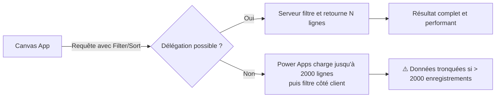
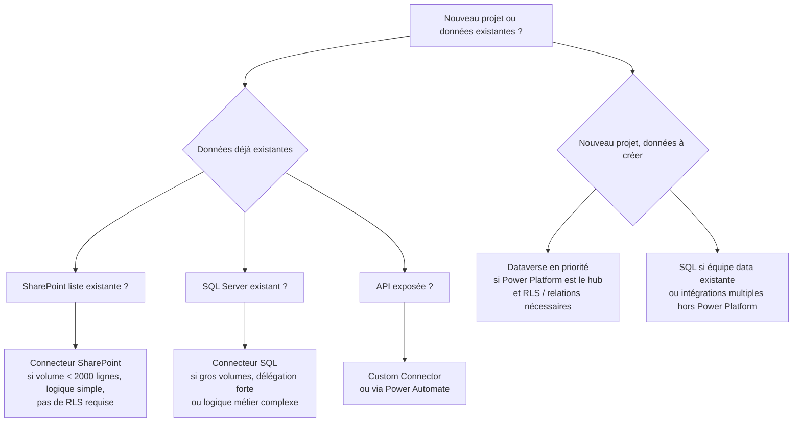

# Canvas Apps connectées à Dataverse, SharePoint, SQL et API

## Objectifs pédagogiques

À l'issue de ce module, tu sauras :

- Choisir le bon connecteur selon la source de données, le volume attendu et les contraintes de coût
- Connecter une Canvas App à Dataverse, SharePoint, SQL Server et une API REST
- Comprendre la délégation et identifier quand elle est cassée — y compris silencieusement
- Gérer les différences de comportement selon la source (colonnes Choice, noms logiques, gateway, ParseJSON)
- Diagnostiquer les problèmes courants en production : troncature de données, timeout gateway, erreurs de typage

---

## Mise en situation

Tu travailles dans une DSI d'une entreprise de 800 personnes. L'équipe métier te demande de construire une application de gestion des demandes d'équipement IT. Les données de référence (types de matériel, fournisseurs) sont dans une liste SharePoint existante. Les employés sont dans Azure AD. Les demandes validées doivent atterrir dans une table SQL hébergée on-premise. Et une API REST interne expose le catalogue du parc actuel.

Quatre sources. Un seul écran Power Apps. Ce module t'explique comment ça s'articule — et surtout quels pièges éviter avant de t'y brûler.

---

## Contexte : pourquoi les connexions de données sont un sujet à part entière

Une Canvas App sans données, c'est une maquette. Dès qu'on branche une source réelle, la complexité monte : les données ne se comportent pas toutes pareil, les filtres ne fonctionnent pas toujours comme attendu, et certaines opérations s'exécutent côté serveur pendant que d'autres restent côté client — avec des conséquences directes sur les performances et les limites de volume.

Power Apps propose aujourd'hui plus de 900 connecteurs. Mais en pratique, quatre d'entre eux concentrent l'essentiel des projets d'entreprise : **Dataverse, SharePoint, SQL Server et les connecteurs HTTP/API REST**. Chacun a ses forces, ses limites, et une façon d'interagir avec le moteur Power Apps qui lui est propre.

---

## Le concept fondamental que tout le reste présuppose : la délégation

Avant d'aller sur les connecteurs eux-mêmes, il faut ancrer un mécanisme qui conditionne tout ce qui suit.

🧠 **La délégation, c'est la capacité d'une formule Power Apps à être exécutée côté serveur, plutôt que côté client.**

Voilà ce que ça change concrètement. Quand tu écris dans une galerie :

```
Filter(MaTable, Statut = "En cours")
```

Power Apps peut soit envoyer cette condition au serveur (qui renvoie uniquement les lignes filtrées), soit rapatrier **toutes** les données côté client, puis filtrer en local. Le premier cas, c'est la délégation. Le second, c'est son absence — et dans ce cas, Power Apps ne chargera jamais plus de **500 lignes** par défaut (configurable jusqu'à 2000).



La délégation n'est pas universelle : elle dépend à la fois du connecteur et de la fonction utilisée. `Filter` avec un champ texte est délégué dans Dataverse, pas forcément dans SharePoint. `Search` n'est pas délégué dans SQL. Ce tableau te servira de référence rapide :

| Fonction | Dataverse | SharePoint | SQL Server |
|---|---|---|---|
| `Filter` (champ simple) | ✅ | ✅ (avec limites) | ✅ |
| `Search` | ✅ | ✅ | ❌ |
| `Sort` | ✅ | ✅ | ✅ |
| `CountRows` | ✅ | ❌ | ✅ |
| `First` / `Last` | ✅ | ❌ | ✅ |
| Colonnes calculées dans `Filter` | ✅ | ❌ | ❌ |

⚠️ Power Apps t'avertit d'un problème de délégation avec un **trait bleu sous la formule** concernée. Ne l'ignore pas — c'est souvent un bug silencieux en production sur des tables de plus de 500 enregistrements. Les données semblent correctes en dev (50 lignes), mais sont tronquées en prod sans qu'aucune erreur ne remonte.

---

## Dataverse — le connecteur natif

Dataverse est la source de données pensée pour Power Apps. La connexion est directe, sans authentification à configurer manuellement, et le connecteur est toujours disponible dans l'environnement.

La relation entre Canvas Apps et Dataverse est de type natif — c'est le même écosystème. Les appels sont optimisés, la délégation fonctionne sur quasiment toutes les opérations courantes, et les types de données complexes (lookup, choix multiple, fichiers) sont gérés nativement.

**Ajouter Dataverse comme source :**

Dans le volet gauche de Power Apps Studio → `Données` → `Ajouter des données` → rechercher le nom de la table Dataverse.

```powerapps
// Récupérer toutes les lignes
ClearCollect(colDemandes, Demandes)

// Filtrer avec délégation complète
Filter(Demandes, statut = "En cours" && priorité = "Haute")

// Écrire une ligne
Patch(Demandes, Defaults(Demandes), {
    titre: TextInput_Titre.Text,
    statut: "Nouveau"
})
```

💡 Les noms de colonnes Dataverse dans les formules utilisent le **nom logique** (souvent préfixé par le publisher, ex. `contoso_statut`), pas le nom d'affichage. Si une formule ne trouve pas ton champ, ouvre la table dans `make.powerapps.com` → Colonnes → vérifie la colonne "Nom" (pas "Nom d'affichage").

**Relations entre tables :** Dataverse gère les relations one-to-many nativement. Tu peux naviguer dans une relation avec la notation pointée :

```powerapps
// Afficher le nom du contact lié à une demande
ThisItem.'Contact (cr5e2_contactid)'.'Full Name'
```

C'est verbeux, mais ça fonctionne sans JOIN manuel — contrairement à SQL.

---

## SharePoint — le connecteur le plus utilisé en réalité

SharePoint est probablement le connecteur le plus déployé en entreprise, pour une raison simple : les listes existent déjà, les équipes les connaissent, et la mise en place ne nécessite aucune licence supplémentaire au-delà de M365.

Une liste SharePoint n'est pas une base de données relationnelle. Elle ressemble à un tableau Excel avec quelques types de champs spéciaux (Lookup, Choice, Person). Cette nature impacte directement ce que tu peux et ne peux pas faire depuis Power Apps.

```powerapps
// Lire les éléments
ClearCollect(colMateriel, Materiel_Liste)

// Filtrer — attention aux champs Choice
Filter(Materiel_Liste, Categorie.Value = "Laptop")

// Créer un élément
Patch(Materiel_Liste, Defaults(Materiel_Liste), {
    Title: "Laptop Dell XPS",
    Categorie: { Value: "Laptop" },
    Quantite: 5
})
```

⚠️ **Les champs Choice dans SharePoint ne sont pas de simples textes.** Ils sont des objets `{ Value: "..." }`. Si tu écris `Filter(Liste, Categorie = "Laptop")` sans le `.Value`, la formule retourne 0 résultat — sans erreur visible. C'est un des pièges les plus fréquents chez les débutants.

**Limites concrètes à anticiper :**

- **Pas de jointure native** : les colonnes Lookup retournent un objet, pas une valeur directe
- **Délégation partielle** : `Filter` fonctionne sur les champs texte, nombre et date — les champs calculés ne sont pas délégués
- **5000 éléments par vue** : SharePoint a sa propre limite d'API, distincte de la limite Power Apps de 2000 lignes
- **Pas de transactions** : deux utilisateurs qui modifient le même élément simultanément peuvent se marcher dessus — Dataverse gère ça avec la concurrence optimiste

**Ce que SharePoint ne fait pas :** les filtres non délégués sur des colonnes calculées ou des colonnes Lookup passent silencieusement en mode client-side. Si ta liste dépasse 2000 lignes et que tu filtres sur une colonne calculée, tu ne le sauras peut-être pas avant que quelqu'un remonte un bug en production.

---

## SQL Server — quand les données métier sont déjà là

Dans beaucoup d'entreprises, les données critiques vivent dans SQL Server — un ERP, un système de gestion, un data warehouse. Power Apps peut s'y connecter, mais la configuration est un peu plus complexe.

**Deux modes de connexion :**

| Scénario | Solution |
|---|---|
| SQL Server Azure (cloud) | Connexion directe via le connecteur SQL Server |
| SQL Server on-premise | Nécessite l'installation d'une **on-premises data gateway** |

La gateway est un agent logiciel installé sur un serveur de ton infrastructure qui fait le pont entre le cloud Microsoft et ton réseau interne. Sans elle, Power Apps ne peut pas atteindre un SQL Server derrière un pare-feu d'entreprise. Et si elle tombe — serveur redémarré, service stoppé, réseau coupé — l'app entière ne peut plus lire ni écrire ses données.

```powerapps
// SQL supporte très bien les filtres numériques et texte
Filter(dbo_Demandes, Statut = "Validé" && DateDemande >= DateAdd(Today(), -30, TimeUnit.Days))

// Patch vers SQL — même syntaxe que Dataverse
Patch(dbo_Demandes, Defaults(dbo_Demandes), {
    Titre: "Nouvelle demande",
    Statut: "En cours",
    DateDemande: Now()
})
```

💡 Le nom de la table dans Power Apps suit la convention `schema_nomtable`, donc `dbo_Employes` pour la table `dbo.Employes`. Si tu travailles avec des schémas personnalisés (`rh.Employes`), la table s'appellera `rh_Employes`.

**Ce que SQL fait mieux que SharePoint :** délégation complète sur `Filter`, `Sort` et les fonctions d'agrégation, gestion des volumes importants, typage fort — pas de problème de champ Choice ou d'objet imbriqué.

**Ce que SQL fait moins bien :** pas de gestion native des pièces jointes, les procédures stockées ne sont pas appelables directement depuis Power Apps (il faut passer par Power Automate), et la gateway on-premise est un point de défaillance potentiel si elle n'est pas redondée.

---

## API REST — le cas le plus flexible et le plus exigeant

Connecter une Canvas App à une API REST, c'est le scénario le plus puissant et le plus libre — mais aussi celui qui demande le plus de rigueur. Il y a deux façons de procéder.

### Option 1 : Connecteur personnalisé (Custom Connector)

C'est la voie recommandée pour une API que tu contrôles ou qui est bien documentée. Tu définis les endpoints, les paramètres et l'authentification une seule fois, puis le connecteur apparaît dans Power Apps comme n'importe quel autre.

La création se fait dans Power Automate ou directement dans Power Apps : `Données` → `Connecteurs personnalisés` → `Nouveau connecteur` → import depuis OpenAPI (Swagger), Postman Collection, ou configuration manuelle.

```powerapps
// Appeler un endpoint GET /catalogue
ClearCollect(colCatalogue, MonAPI.GetCatalogue())

// Appeler un POST avec paramètres
MonAPI.CreerDemande({
    employeId: User().Email,
    materielId: SelectedMateriel.id,
    quantite: Value(TextInput_Qte.Text)
})
```

### Option 2 : HTTP directement via Power Automate

Quand l'API n'a pas de Swagger propre, ou quand l'appel est ponctuel, tu peux déclencher un Power Automate depuis la Canvas App, laisser le flow faire l'appel HTTP, et retourner le résultat.

```powerapps
// Déclencher un flow et récupérer sa réponse
Set(varReponseAPI, MonFlow.Run(TextInput_Recherche.Text))

// Parser le retour JSON du flow
// varRetourAPI vient d'un flow qui a appelé HTTP REST
// Power Automate retourne une chaîne JSON brute, d'où ParseJSON
Set(varResultat, ParseJSON(varReponseAPI.resultat))
Text(varResultat.nomProduit)
```

⚠️ `ParseJSON()` retourne un objet non typé (`UntypedObject`). Pour l'utiliser dans une galerie, tu dois le convertir avec `ForAll` et un typage explicite, sinon la galerie reste vide ou lève une erreur de type :

```powerapps
ForAll(
    ParseJSON(varRetourAPI),
    { id: Text(ThisRecord.id), nom: Text(ThisRecord.nom) }
)
```

**Authentification sur les API externes :**

| Type | Usage typique |
|---|---|
| API Key | APIs simples, catalogue produit |
| OAuth 2.0 | APIs Microsoft, Google, Salesforce |
| Basic Auth | APIs legacy internes |
| Certificate | APIs d'entreprise sécurisées |

---

## Choisir la bonne source selon ton contexte

Ce n'est pas toujours un choix libre — les données existent souvent déjà quelque part. Mais quand tu as la main, le bon connecteur dépend de plusieurs critères qu'il faut peser ensemble : volume de données, fréquence d'écriture, sécurité au niveau ligne, capacités de recherche, et coût.



**Ce que ce diagramme ne dit pas explicitement :**

Choisir SharePoint parce que "c'est déjà là" a un coût caché. Si la liste dépasse 2000 lignes, si les équipes commencent à filtrer sur des colonnes calculées, ou si deux services accèdent aux mêmes données avec des droits différents (RLS), tu vas te retrouver à migrer vers SQL ou Dataverse en urgence — avec une app en production à réécrire. Ce n'est pas une raison de refuser SharePoint systématiquement, mais c'est une raison de poser la question du volume attendu à 12 mois, pas à aujourd'hui.

De la même façon, Dataverse est la meilleure option technique dans presque tous les cas — mais elle implique une licence par utilisateur (Power Apps Per User ou Per App). Pour une app interne utilisée par 50 personnes, le calcul est différent que pour un portail ouvert à 500 employés.

**Grille de décision rapide :**

| Critère | Dataverse | SharePoint | SQL Server | API REST |
|---|---|---|---|---|
| Volume > 10 000 lignes | ✅ | ❌ | ✅ | N/A |
| RLS / sécurité au niveau ligne | ✅ natif | ❌ | ⚠️ via app | ⚠️ via token |
| Relations entre tables | ✅ | ⚠️ Lookup partiel | ✅ JOIN | N/A |
| Délégation complète | ✅ | ⚠️ partielle | ✅ | ❌ |
| Licence additionnelle | ✅ requise | ❌ M365 | ❌ si déjà là | Variable |
| Infrastructure à maintenir | ❌ | ❌ | ⚠️ gateway | ⚠️ auth |
| Pièces jointes / fichiers | ✅ | ✅ | ❌ | Variable |

---

## Cas réel : application de demandes d'équipement multi-sources

Reprenons le scénario d'ouverture. Voici comment l'architecture de données se câble en pratique — du chemin heureux au Patch final avec gestion d'erreur.

**Écran d'accueil — liste des demandes en cours depuis SQL :**

```powerapps
// Dans la propriété Items de la galerie
Filter(
    dbo_Demandes,
    Statut = "En cours",
    EmployeEmail = User().Email
)
```

**Formulaire de création — données de référence depuis SharePoint :**

```powerapps
// Items du ComboBox "Type de matériel"
Sort(
    Filter(Materiel_Liste, Actif.Value = "Oui"),
    Title,
    SortOrder.Ascending
)
```

**Appel API pour le stock disponible :**

```powerapps
// OnChange du ComboBox — appel API catalogue
Set(
    varStock,
    CatalogueAPI.GetStock(ComboBox_Materiel.Selected.Ref_SAP)
)
```

**Soumission finale — bouton Soumettre avec lecture, écriture, gestion d'erreur et notification :**

```powerapps
// Bouton Soumettre — intégration complète
// 1. Écriture dans SQL avec Patch
// 2. Gestion d'erreur explicite avec IfError
// 3. Notification utilisateur selon résultat
// 4. Réinitialisation du formulaire si succès
IfError(
    Patch(
        dbo_Demandes,
        Defaults(dbo_Demandes),
        {
            EmployeEmail: User().Email,
            TypeMateriel: ComboBox_Materiel.Selected.Title,
            RefSAP: ComboBox_Materiel.Selected.Ref_SAP,
            Statut: "Nouveau",
            DateDemande: Now(),
            Commentaire: TextInput_Commentaire.Text
        }
    ),
    // Bloc erreur : affiche le message retourné par SQL
    Notify(
        "Erreur lors de la création : " & FirstError.Message,
        NotificationType.Error
    );
    // Arrêt ici — ne pas continuer si l'écriture a échoué
    Exit(false),
    // Bloc succès : notification + reset formulaire
    Notify("Demande créée avec succès", NotificationType.Success);
    Reset(TextInput_Commentaire);
    Reset(ComboBox_Materiel)
)
```

Ce que ce snippet fait que les exemples précédents ne montraient pas : il capture `FirstError.Message` (le détail retourné par SQL Server — champ requis manquant, contrainte violée, timeout), stoppe l'exécution si l'écriture échoue, et remet le formulaire à zéro uniquement si tout s'est bien passé. En dev sur 10 lignes, tout ça semble superflu. En prod avec 800 utilisateurs, c'est ce qui évite les appels au support.

---

## Pièges de production

C'est la section que la plupart des formations omettent, et c'est là que les projets déraillent.

### Délégation silencieuse qui tronque les données

Le trait bleu sous une formule Power Apps, c'est un avertissement — pas une erreur bloquante. L'app continue de fonctionner. Les données s'affichent. Tout semble normal. Sauf que si la table dépasse 2000 lignes, les enregistrements au-delà sont invisibles — sans message, sans indicateur dans l'interface.

**Comment le détecter :** active l'avertissement dans `Fichier → Paramètres → Général → Limite d'enregistrements de données` et laisse-le à 2000. Charge 3000 lignes en source de dev. Lance le Filter. Si les résultats semblent tronqués, le trait bleu est là.

**Comment le corriger :** réécrire la formule avec une condition délégable. Si le champ ne supporte pas la délégation (colonne calculée SharePoint, `Search` sur SQL), repenser l'architecture — filtrer côté serveur via une colonne indexée, ou passer par un flow qui fait la requête.

### Gateway qui tombe en production

La gateway on-premise est un service Windows sur un serveur de ton réseau. Si ce serveur redémarre, si le service s'arrête, si le réseau entre le serveur et Azure est coupé — la Canvas App affiche une erreur générique de connexion. Les utilisateurs ne savent pas pourquoi. Le support non plus, au début.

**Diagnostic :** dans Power Platform Admin Center → Gateways → vérifier le statut. Si la gateway est offline, redémarrer le service `On-premises data gateway service` sur le serveur hôte.

**En production sérieuse :** configurer une gateway en cluster (deux agents sur deux serveurs différents). La bascule est automatique si un nœud tombe.

### Champ Lookup SharePoint — le `.Value` qui manque

```powerapps
// ❌ Retourne 0 résultat sans erreur
Filter(Materiel_Liste, Categorie = "Laptop")

// ✅ Correct
Filter(Materiel_Liste, Categorie.Value = "Laptop")

// ❌ Patch qui ne persiste pas la valeur
Patch(Materiel_Liste, rec, { Categorie: "Laptop" })

// ✅ Correct
Patch(Materiel_Liste, rec, { Categorie: { Value: "Laptop" } })
```

Le piège est double : ça ne lève pas d'erreur, et ça semble "presque fonctionner" sur les premières lignes si les valeurs par défaut correspondent à ce qu'on attendait.

### ParseJSON sur une réponse API vide ou null

Si le flow Power Automate retourne une chaîne vide (API down, timeout, réponse null), `ParseJSON("")` ne lève pas d'erreur immédiate — mais toute tentative d'accès à une propriété de l'objet retourne `Blank()`. La galerie reste vide sans explication.

```powerapps
// Toujours vérifier avant de parser
If(
    IsBlank(varReponseAPI.resultat) || varReponseAPI.resultat = "{}",
    Notify("Aucune donnée reçue de l'API", NotificationType.Warning),
    Set(varResultat, ParseJSON(varReponseAPI.resultat))
)
```

### FirstError.Message qui n'affiche rien d'utile

Sur certaines sources (notamment SQL Server on-premise via gateway), `FirstError.Message` peut retourner un message technique peu lisible, ou une chaîne vide si l'erreur vient de la couche réseau. Dans ce cas, logguer aussi `FirstError.Kind` (le type d'erreur) et afficher un message générique à l'utilisateur tout en journalisant le détail dans Dataverse ou une collection pour debug.

```powerapps
IfError(
    Patch(dbo_Demandes, ...),
    Collect(
        colErreurs,
        { 
            timestamp: Now(), 
            message: FirstError.Message, 
            kind: Text(FirstError.Kind),
            user: User().Email 
        }
    );
    Notify("Une erreur s'est produite. L'équipe IT a été notifiée.", NotificationType.Error)
)
```

---

## Diagnostiquer les problèmes courants

Cinq cas que tu rencontreras inévitablement :

**1. Trait bleu de délégation → formule non déléguée**
Identifie la fonction concernée. Vérifie dans la documentation si elle est déléguée pour ton connecteur. Si non : cherche une alternative déléguée, ou filtre en amont dans la source (vue filtrée SharePoint, colonne indexée SQL, filtre Dataverse côté serveur).

**2. Timeout ou erreur de connexion sur SQL**
Premier réflexe : vérifier le statut de la gateway dans Admin Center. Deuxième réflexe : tester la connexion depuis Power Automate (même gateway). Si la gateway est OK mais l'erreur persiste, vérifier les credentials de connexion SQL (expiration mot de passe, compte de service désactivé).

**3. Champ SharePoint Choice non rempli dans Patch en ForAll**
Si tu fais un `ForAll` sur une collection pour patcher en masse dans SharePoint, les champs Choice doivent être formatés `{ Value: "..." }` dans chaque objet de la collection. Si l'objet vient d'un `ParseJSON` ou d'une variable non typée, le champ Choice sera envoyé comme texte brut et ignoré silencieusement.

**4. ParseJSON sur une réponse API — galerie vide**
Vérifier que le JSON retourné est bien un tableau (`[{...}, {...}]`), pas un objet wrappé (`{ "items": [{...}] }`). Si c'est un objet wrappé, accéder d'abord à la propriété : `ParseJSON(varReponse).items`.

**5. FirstError.Message dans un Patch qui n'affiche rien**
Ajouter `Text(FirstError.Kind)` pour avoir le type d'erreur. Les valeurs courantes : `ErrorKind.Network` (problème réseau/gateway), `ErrorKind.Validation` (champ requis manquant), `ErrorKind.Conflict` (conflit de concurrence Dataverse). Chacun a une résolution différente.

---

## Coûts réels — ce que le diagramme de décision ne montre pas

Le choix d'un connecteur n'est pas que technique. Voici ce qui change selon la source en termes de coût total de propriété :

**Dataverse** : nécessite une licence Power Apps Per User (~20€/mois/utilisateur) ou Per App (~5€/app/utilisateur/mois). Pour 100 utilisateurs, c'est 500 à 2000€/mois. La valeur ajoutée (RLS, relations, performances) est réelle — mais le calcul doit être fait.

**SharePoint** : inclus dans M365. Zéro surcoût. Mais le coût caché, c'est la maintenance long terme : une liste SharePoint qui grossit, qui commence à avoir des problèmes de délégation, qui nécessite une refactorisation vers SQL ou Dataverse 18 mois plus tard — ça coûte du temps développeur.

**SQL Server on-premise** : le serveur SQL est souvent déjà là. Mais la gateway, c'est un serveur supplémentaire à maintenir, patcher, monitorer. En cas de panne, c'est une intervention infrastructure, pas juste un paramètre Power Apps.

**API REST** : le coût dépend de l'API externe. Certaines ont des quotas d'appels, des latences variables, des plans payants. Un appel API déclenché 500 fois par jour par 100 utilisateurs, c'est 50 000 requêtes/jour — à vérifier dans les conditions du fournisseur.

**Signal d'alerte pour migrer SharePoint → SQL ou Dataverse :** volume qui dépasse 3000 lignes actives, apparition de délégations cassées sur des filtres métier clés, besoin de droits différenciés par utilisateur sur les données, ou problèmes de concurrence lors d'éditions simultanées.

---

## Bonnes pratiques

**Nomme tes sources de façon explicite.** Quand tu ajoutes une table SQL ou une liste SharePoint, Power Apps lui donne un nom automatique. Renomme-la dans le volet Données : `dbo_Demandes` → `DS_Demandes`. Ça compte quand tu relis du code trois mois plus tard.

**Centralise les appels de données dans `App.OnStart` ou `App.OnVisible`.** Charger les données de référence une seule fois au démarrage, stocker dans une collection, éviter de rappeler la source à chaque navigation d'écran.

```powerapps
// App.OnStart
ClearCollect(colMateriel, Filter(Materiel_Liste, Actif.Value = "Oui"));
ClearCollect(colFournisseurs, Fournisseurs_Liste)
```

**Traite les erreurs explicitement sur toutes les opérations d'écriture.** `IfError()` et `FirstError.Message` ne sont pas optionnels. Une app sans gestion d'erreur, c'est une app qui laisse l'utilisateur face à un écran blanc — et le support face à un bug impossible à reproduire.

**Teste la délégation avec du vrai volume dès le début du projet
