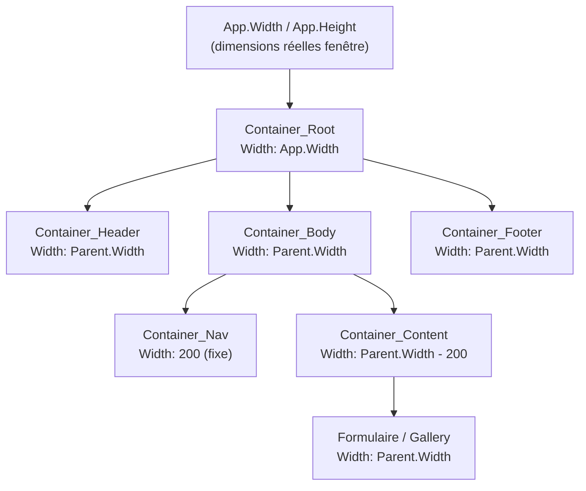

# Responsive design et accessibilité dans Power Apps

## Objectifs pédagogiques

À l'issue de ce module, vous serez capable de :

- Distinguer les deux systèmes de mise en page de Canvas Apps (taille fixe vs flexible) et choisir le bon selon le contexte
- Configurer des conteneurs flexibles pour construire une interface qui s'adapte à différentes résolutions d'écran
- Utiliser les propriétés `App.Width`, `App.Height` et `Parent.Width` pour piloter le positionnement dynamique
- Appliquer les règles d'accessibilité de base : contraste, navigation clavier, labels ARIA, ordre de tabulation
- Identifier et corriger les problèmes relevés par le vérificateur d'accessibilité intégré de Power Apps

---

## Mise en situation

Vous avez construit une application de suivi des demandes RH. Elle fonctionne parfaitement sur votre écran 1920×1080 en plein navigateur. Puis votre collègue l'ouvre sur sa tablette Surface — les boutons se chevauchent, le texte déborde, la barre de navigation disparaît à moitié. Un autre collaborateur, malvoyant, ne peut pas lire les boutons faute de contraste suffisant, et son lecteur d'écran ne lui annonce rien d'utile.

C'est exactement le scénario que ce module vous apprend à éviter. Le responsive design et l'accessibilité ne sont pas des options de finition : ce sont deux contraintes à intégrer dès la conception, pas en bout de course.

---

## Ce que ça change concrètement

Par défaut, une nouvelle Canvas App est en mode **taille fixe** : vous travaillez sur un canevas aux dimensions définies (1366×768 par exemple), et ce que vous voyez en studio est ce que l'utilisateur voit — à la pixe près, sur n'importe quel écran. C'est simple, prévisible, mais cassant dès qu'on sort de la résolution cible.

L'alternative est le mode **responsive** (ou "Scale to fit" désactivé + conteneurs flexibles) : l'interface se reconfigure dynamiquement selon l'espace disponible, comme une page web CSS moderne.

La confusion classique : beaucoup de débutants pensent que désactiver "Scale to fit" suffit pour avoir une app responsive. Non. C'est une condition nécessaire, pas suffisante. Sans conteneurs configurés avec des règles de positionnement dynamique, vous obtenez juste une interface figée qui ne se redimensionne plus du tout.

---

## Les deux systèmes de mise en page

### Mode fixe avec Scale to Fit

Power Apps étire ou réduit l'ensemble du canevas pour qu'il rentre dans la fenêtre, en conservant les proportions. Résultat : vos contrôles ne bougent jamais, mais l'interface peut paraître minuscule sur grand écran ou floue sur mobile.

**Quand l'utiliser ?** Applications internes mono-device, prototypes rapides, dashboards destinés à un seul type d'écran. C'est le mode par défaut — il convient si vous maîtrisez votre parc d'écrans.

### Mode responsive avec conteneurs

Vous désactivez "Scale to fit" dans `Settings → Display → Scale to fit`, et vous construisez votre interface avec des **conteneurs horizontaux et verticaux** dont les propriétés de taille sont exprimées en formules dynamiques plutôt qu'en valeurs fixes.

Le principe ressemble au Flexbox CSS : vous définissez comment l'espace disponible est distribué entre les enfants, et chaque enfant s'y adapte.

```
// Largeur d'un conteneur principal qui prend toute la fenêtre
Width: App.Width

// Un panneau latéral qui occupe 25% de la largeur
Width: Parent.Width * 0.25

// Le contenu principal qui prend le reste
Width: Parent.Width - SidePanel.Width
```

🧠 **Concept clé** — `App.Width` et `App.Height` retournent les dimensions réelles de la fenêtre du navigateur ou de l'application mobile au moment de l'exécution. Ces valeurs changent si l'utilisateur redimensionne sa fenêtre. Vos formules qui en dépendent se recalculent automatiquement.

---

## Construire une mise en page flexible : approche progressive

### 1. Configurer l'application

Avant de placer le moindre contrôle responsive, deux paramètres doivent être ajustés dans `Settings → Display` :

- **Scale to fit** → désactivé
- **Lock aspect ratio** → désactivé
- **Lock orientation** → désactivé (sauf si vous avez une bonne raison de le garder)

Sans ça, vos formules dynamiques n'auront aucun effet visible.

### 2. Structurer avec des conteneurs imbriqués

La mécanique responsive de Power Apps repose sur les conteneurs (introduits en 2021 et maintenant stables). Pensez à eux comme à des `div` flex en HTML.

```
App
└── Container_Root (Vertical, Width: App.Width, Height: App.Height)
    ├── Container_Header (Horizontal, Height: 60)
    │   ├── Image_Logo
    │   └── Label_Title
    ├── Container_Body (Horizontal, flexible)
    │   ├── Container_Nav (Vertical, Width: 200)
    │   └── Container_Content (Vertical, flexible)
    └── Container_Footer (Horizontal, Height: 40)
```

Le diagramme suivant illustre comment les dimensions se propagent :



### 3. La propriété LayoutMode des conteneurs

Chaque conteneur a une propriété `LayoutMode` qui détermine comment ses enfants sont disposés :

| Valeur | Comportement |
|--------|-------------|
| `LayoutMode.Auto` | Les enfants s'empilent verticalement ou horizontalement selon `LayoutDirection` |
| `LayoutMode.Manual` | Positionnement manuel par coordonnées X/Y (mode classique hors conteneur) |

En pratique, pour le responsive, vous utilisez `LayoutMode.Auto` avec `LayoutDirection` défini sur `LayoutDirection.Horizontal` ou `LayoutDirection.Vertical`.

### 4. Gérer les breakpoints

Power Apps ne dispose pas de breakpoints CSS natifs, mais vous pouvez les simuler avec des conditions sur `App.Width` :

```
// Afficher la navigation latérale uniquement sur grand écran
Visible: App.Width > 768

// Passer en layout colonne unique sur mobile
LayoutDirection: If(App.Width < 600, LayoutDirection.Vertical, LayoutDirection.Horizontal)

// Adapter la taille de police
Size: If(App.Width < 600, 14, 16)
```

⚠️ **Erreur fréquente** — Utiliser des valeurs en pixels absolus pour les dimensions (ex: `Width: 400`) à l'intérieur de conteneurs flexibles. Ces valeurs ne s'adaptent pas. Utilisez toujours `Parent.Width * <ratio>` ou `Parent.Width - <valeur_fixe>` pour les dimensions dynamiques.

---

## Accessibilité : pourquoi ce n'est pas optionnel

L'accessibilité dans Power Apps concerne deux réalités distinctes :

1. **Les utilisateurs avec des besoins spécifiques** — malvoyants (lecteurs d'écran comme NVDA ou JAWS), utilisateurs clavier uniquement, daltoniens
2. **Les exigences légales et contractuelles** — de nombreuses organisations publiques et entreprises sont soumises aux standards WCAG 2.1 (niveau AA minimum)

Ignorer l'accessibilité dans un contexte professionnel n'est plus une option raisonnable. Et concrètement, les ajustements nécessaires prennent moins de temps qu'on ne le pense — à condition de les faire au bon moment.

### Le vérificateur d'accessibilité intégré

Power Apps Studio intègre un outil de vérification accessible via `App Checker` (icône en haut à droite du studio, ou `View → App checker`). Il scanne votre application et liste les violations avec leur niveau de sévérité.

Les erreurs les plus fréquentes qu'il remonte :

- Contrôles sans label accessible (`AccessibleLabel` vide)
- Contrôles interactifs sans description pour les lecteurs d'écran
- Contraste de couleur insuffisant
- Images sans texte alternatif

💡 **Astuce** — Lancez l'App Checker avant chaque publication, pas seulement en fin de projet. Corriger 50 contrôles mal labellisés en une fois est bien plus long que de le faire au fil du développement.

### Les propriétés d'accessibilité contrôle par contrôle

Chaque contrôle Power Apps expose un ensemble de propriétés dédiées à l'accessibilité, regroupées sous l'onglet `Accessibility` dans le panneau de propriétés :

| Propriété | Rôle | Exemple |
|-----------|------|---------|
| `AccessibleLabel` | Texte lu par le lecteur d'écran | `"Bouton de soumission du formulaire"` |
| `TabIndex` | Ordre de passage du focus clavier | `0`, `1`, `2`... ou `-1` pour exclure |
| `Live` | Annonce les changements dynamiques | `Live.Polite` pour les messages de statut |
| `Role` | Sémantique du contrôle | `Role.Button`, `Role.Heading` |

```
// Exemple sur un bouton d'action critique
Button_Submit.AccessibleLabel: "Soumettre la demande de congé"
Button_Submit.TabIndex: 5
```

⚠️ **Erreur fréquente** — Laisser `AccessibleLabel` vide et supposer que le lecteur d'écran lira la propriété `Text`. Ce n'est pas garanti pour tous les contrôles, et la propriété `Text` peut contenir une icône ou un emoji illisible. Toujours renseigner `AccessibleLabel` explicitement.

### Contraste et couleurs

Le standard WCAG 2.1 AA exige un ratio de contraste d'au moins **4,5:1** pour le texte normal et **3:1** pour les grands textes (18pt et plus).

Pour vérifier un contraste dans Power Apps, vous ne pouvez pas le faire directement dans le studio. Utilisez un outil externe comme [WebAIM Contrast Checker](https://webaim.org/resources/contrastchecker/) en entrant les valeurs hexadécimales de vos couleurs de texte et de fond.

Quelques pièges courants :

- Texte gris clair sur fond blanc (très fréquent dans les designs "épurés") → souvent insuffisant
- Labels de formulaire en gris `#999999` sur blanc → ratio 2,85:1, non conforme
- Texte blanc sur fond bleu Power Apps `#0078d4` → ratio 4,6:1, juste conforme

🧠 **Concept clé** — Le ratio de contraste n'est pas une perception subjective, c'est un calcul mathématique basé sur la luminance relative des deux couleurs. Un texte peut sembler "lisible" visuellement et être hors standard WCAG.

### Navigation clavier et ordre de tabulation

Par défaut, Power Apps attribue un `TabIndex` basé sur la position des contrôles dans l'arbre. Cet ordre automatique est souvent incohérent, surtout dans les mises en page complexes avec conteneurs imbriqués.

La règle : **l'ordre de tabulation doit suivre l'ordre logique de lecture**, de haut en bas, de gauche à droite. Testez-le vous-même avec la touche `Tab` dans le player.

Pour reconfigurer l'ordre :

```
// Exclure un contrôle décoratif de la navigation clavier
Image_Decoration.TabIndex: -1

// Premier champ du formulaire
TextInput_FirstName.TabIndex: 1
TextInput_LastName.TabIndex: 2
TextInput_Email.TabIndex: 3
Button_Submit.TabIndex: 4
```

💡 **Astuce** — Les images purement décoratives (logos, illustrations de fond) doivent avoir `TabIndex: -1` et un `AccessibleLabel` vide. Sinon, le lecteur d'écran s'y arrête et annonce "image" sans contexte utile, ce qui perturbe la navigation.

---

## Cas réel : refonte d'un formulaire de demande de formation

**Contexte :** Une application Canvas de gestion des demandes de formation, initialement conçue en mode fixe pour desktop (1366×768), doit être accessible depuis les tablettes des managers terrain (768px de large) et passer un audit d'accessibilité interne.

**Problèmes identifiés :**
- Mise en page cassée sur tablette : champs de formulaire débordaient de l'écran
- 23 erreurs dans l'App Checker (principalement des `AccessibleLabel` manquants)
- Navigation clavier incohérente : le focus sautait de façon aléatoire entre les sections

**Actions menées :**

1. **Désactivation de Scale to Fit** et restructuration en conteneurs verticaux/horizontaux imbriqués
2. **Formules dynamiques** sur toutes les largeurs : `Width: Parent.Width * 0.48` pour les champs en deux colonnes, switch vers colonne unique sous 700px
3. **Passage en revue systématique** des 23 erreurs App Checker : ajout des `AccessibleLabel` sur tous les contrôles interactifs
4. **Reconfiguration du TabIndex** : ordre repensé pour suivre le flux naturel du formulaire (nom → prénom → service → formation → justification → bouton soumettre)
5. **Vérification des contrastes** : remplacement du gris label `#767676` par `#595959` pour atteindre le ratio 7:1

**Résultat :** Application fonctionnelle sur tablette, 0 erreur App Checker, navigation clavier linéaire et prévisible.

---

## Bonnes pratiques et pièges à éviter

**Commencez responsive, ne migrez pas après coup.** Transformer une app fixe en app responsive prend 3 à 5 fois plus de temps que de la concevoir responsive dès le départ. Les contrôles positionnés manuellement ont tous des coordonnées absolues à reconfigurer.

**Ne mélangez pas les deux modes dans une même app.** Certains écrans en mode manuel, d'autres en conteneurs flexibles — c'est la recette pour un comportement imprévisible et une maintenance cauchemardesque.

**Testez sur un vrai device, pas juste en redimensionnant le navigateur.** Le comportement tactile, la densité de pixels et le clavier virtuel peuvent révéler des problèmes invisibles en desktop.

**L'accessibilité ne se limite pas à l'App Checker.** Le vérificateur détecte les erreurs techniques (labels manquants, contraste), mais pas les problèmes sémantiques ou de flux. Testez manuellement avec un lecteur d'écran si votre audience inclut des utilisateurs malvoyants.

**Documentez vos breakpoints.** Si vous utilisez `App.Width > 768` comme condition dans 30 endroits de votre app, définissez une variable globale au démarrage : `Set(gIsTablet, App.Width <= 768)`. Ça centralise la logique et simplifie les modifications futures.

⚠️ **Piège critique** — Les conteneurs Power Apps ont un comportement de `Fill` (remplissage de l'espace restant) qui peut entrer en conflit avec des largeurs explicites définies sur les enfants. Si votre mise en page se comporte de façon inattendue, vérifiez la propriété `FillPortions` du conteneur parent — elle distribue l'espace proportionnellement entre les enfants et peut écraser vos `Width` définies.

---

## Résumé

Une Canvas App sans stratégie responsive est une app pour un seul écran. Avec la montée en usage mobile et tablette dans les environnements professionnels, c'est une contrainte incontournable dès la conception. Le mode responsive de Power Apps repose sur deux éléments non négociables : la désactivation de Scale to Fit, et l'utilisation de conteneurs flexibles avec des dimensions exprimées en formules relatives (`App.Width`, `Parent.Width`). Pour simuler des breakpoints, des conditions sur `App.Width` permettent d'adapter le layout, la visibilité et les tailles de texte dynamiquement. Côté accessibilité, le vérificateur intégré est un point de départ, mais l'essentiel reste manuel : renseigner tous les `AccessibleLabel`, contrôler l'ordre de tabulation, et vérifier les ratios de contraste avec des outils dédiés. Ces deux dimensions — responsive et accessibilité — se traitent ensemble dès le début du projet, pas en dernière minute.

---

<!-- snippet
id: powerapps_responsive_scaletofit
type: concept
tech: power-apps
level: intermediate
importance: high
format: knowledge
tags: responsive, mise en page, scale to fit, canvas app
title: Désactiver Scale to Fit ne suffit pas pour un layout responsive
content: "Scale to fit" (Settings → Display) redimensionne l'ensemble du canevas comme une image. Le désactiver est nécessaire pour le responsive, mais sans conteneurs avec des formules dynamiques (Width: App.Width, Width: Parent.Width * ratio), les contrôles restent positionnés de façon absolue et ne s'adaptent pas. Les deux étapes sont indissociables.
description: Désactiver Scale to Fit est requis mais insuffisant — les conteneurs et formules dynamiques sont indispensables pour un vrai comportement responsive.
-->

<!-- snippet
id: powerapps_responsive_appwidth
type: concept
tech: power-apps
level: intermediate
importance: high
format: knowledge
tags: responsive, app.width, app.height, formules dynamiques
title: App.Width et App.Height — dimensions réelles de la fenêtre
content: App.Width et App.Height retournent les dimensions réelles de la fenêtre du navigateur ou de l'app mobile à l'exécution. Ces valeurs se recalculent si la fenêtre est redimensionnée, et toutes les formules qui en dépendent se mettent à jour automatiquement. Utiliser Parent.Width dans un conteneur enfant pour hériter la largeur du parent sans recalcul.
description: App.Width/App.Height sont les sources de vérité du layout responsive — toutes les largeurs dynamiques en découlent directement ou via Parent.Width.
-->

<!-- snippet
id: powerapps_responsive_breakpoint
type: tip
tech: power-apps
level: intermediate
importance: medium
format: knowledge
tags: responsive, breakpoint, variable globale, app.width
title: Centraliser les breakpoints dans une variable globale
content: Plutôt que de répéter If(App.Width <= 768, ...) dans chaque contrôle, définir une variable au démarrage de l'app : Set(gIsTablet, App.Width <= 768). L'utiliser ensuite dans les propriétés LayoutDirection, Visible, Size. Si le seuil change, une seule ligne à modifier au lieu de parcourir toute l'app.
description: Centraliser les breakpoints dans une variable OnStart évite la dispersion des conditions et simplifie la maintenance.
-->

<!-- snippet
id: powerapps_accessible_label
type: warning
tech: power-apps
level: intermediate
importance: high
format: knowledge
tags: accessibilité, accessiblelabel, lecteur d'écran, wcag
title: AccessibleLabel vide — piège silencieux pour les lecteurs d'écran
content: Piège : laisser AccessibleLabel vide en supposant que Text sera lu. Conséquence : le lecteur d'écran annonce "bouton" ou rien, sans contexte. Correction : renseigner explicitement AccessibleLabel sur chaque contrôle interactif avec une description fonctionnelle précise ("Soumettre la demande de congé", pas "Bouton 1").
description: Text n'est pas toujours lu par les lecteurs d'écran — AccessibleLabel doit toujours être renseigné explicitement sur les contrôles interactifs.
-->

<!-- snippet
id: powerapps_accessible_tabindex
type: tip
tech: power-apps
level: intermediate
importance: medium
format: knowledge
tags: accessibilité, tabindex, navigation clavier, ordre de focus
title: TabIndex -1 pour exclure les éléments décoratifs du focus clavier
content: Les images et éléments purement décoratifs (logos, fonds, séparateurs) doivent avoir TabIndex: -1 et AccessibleLabel vide. Sans ça, le lecteur d'écran s'y arrête et annonce "image" sans contexte utile, allongeant la navigation pour les utilisateurs clavier. Appliquer aussi à tous les labels qui doublonnent une information déjà portée par un contrôle adjacent.
description: TabIndex: -1 exclut un contrôle de la navigation clavier — indispensable pour les éléments décoratifs qui pollueraient le parcours d'un utilisateur de lecteur d'écran.
-->

<!-- snippet
id: powerapps_accessible_contrast
type: concept
tech: power-apps
level: intermediate
importance: medium
format: knowledge
tags: accessibilité, contraste, wcag, couleurs
title: Ratio de contraste WCAG 2.1 AA — seuils et vérification
content: WCAG 2.1 AA exige un ratio de contraste de 4,5:1 pour le texte normal et 3:1 pour les grands textes (≥18pt). Power Apps Studio ne vérifie pas les contrastes automatiquement. Utiliser WebAIM Contrast Checker (webaim.org) avec les codes hexadécimaux des couleurs. Cas fréquent hors normes : gris #999999 sur blanc = ratio 2,85:1. Minimum conforme pour gris sur blanc : #767676 (4,54:1).
description: Le ratio de contraste est calculé mathématiquement — un texte peut sembler lisible et être hors WCAG. Vérifier avec WebAIM avant publication.
-->

<!-- snippet
id: powerapps_responsive_fillportions
type: warning
tech: power-apps
level: intermediate
importance: medium
format: knowledge
tags: responsive, conteneur, fillportions, layout
title: FillPortions peut écraser les Width définies sur les enfants
content: Piège : dans un conteneur Power Apps, la propriété FillPortions distribue l'espace disponible proportionnellement entre les enfants, ce qui peut entrer en conflit avec des Width explicites. Conséquence : le layout ne respecte pas les dimensions définies. Correction : vérifier FillPortions sur le conteneur parent et le mettre à 0 pour désactiver la distribution automatique, ou utiliser FillPortions intentionnellement à la place des Width fixes.
description: FillPortions du conteneur parent peut ignorer les Width définis sur les enfants — vérifier ce paramètre en premier si le layout se comporte de façon inattendue.
-->

<!-- snippet
id: powerapps_accessible_appchecker
type: tip
tech: power-apps
level: intermediate
importance: medium
format: knowledge
tags: accessibilité, app checker, vérification, bonne pratique
title: Lancer l'App Checker avant chaque publication, pas en fin de projet
content: L'App Checker (View → App checker dans Power Apps Studio) scanne les violations d'accessibilité : AccessibleLabel manquants, contrastes insuffisants, contrôles sans description. Corriger 50 violations en une fois en fin de projet prend bien plus de temps que de les traiter au fil du développement. Intégrer un passage App Checker comme étape systématique avant chaque merge ou publication.
description: L'App Checker intégré détecte les erreurs techniques d'accessibilité — l'utiliser régulièrement, pas seulement avant la mise en production.
-->
