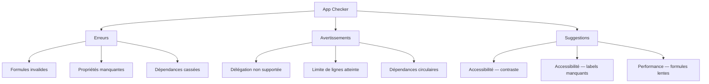
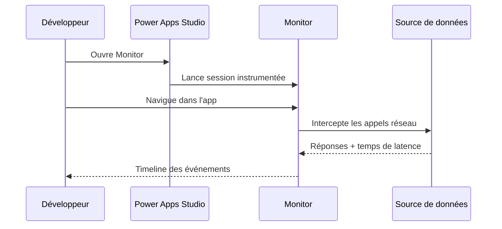

# Tests, qualité et App Checker

## Objectifs pédagogiques

À l'issue de ce module, vous serez capable de :

- Lire et interpréter les résultats de l'App Checker pour qualifier l'état d'une application
- Distinguer les erreurs bloquantes des avertissements et des suggestions d'amélioration
- Identifier les formules problématiques et les corriger avant mise en production
- Auditer une app sur les dimensions performance, accessibilité et fiabilité
- Mettre en place une discipline de test continue pendant le développement

---

## Mise en situation

Vous avez livré une Canvas App à une équipe métier. L'app fonctionne — en apparence. Trois jours plus tard, les retours tombent : le chargement est lent sur mobile, un bouton ne répond pas au clic dans certains cas, et les utilisateurs daltoniens signalent que certains libellés sont illisibles.

Rien de tout cela n'était visible pendant les tests sur votre poste, avec votre compte admin, sur un écran 27 pouces.

C'est exactement pour ce type de situation que Power Apps intègre un outil de diagnostic intégré : l'**App Checker**. Il ne remplace pas le test utilisateur, mais il attrape les problèmes que vous ne verrez pas en testant vous-même — et il le fait avant même que l'app soit publiée.

---

## Ce que détecte l'App Checker (et pourquoi c'est plus subtil qu'un compilateur)

L'App Checker n'est pas un simple vérificateur de syntaxe. Il analyse l'application sur plusieurs niveaux en parallèle : la validité des formules, les risques de performance, la conformité d'accessibilité, et certains patterns d'usage dangereux.

Ce qui le rend utile — et parfois déroutant — c'est qu'il mélange des problèmes de natures très différentes dans une même interface. Une erreur bloquante (formule invalide qui empêche l'app de démarrer) cohabite avec un avertissement d'accessibilité (contraste insuffisant) et une suggestion de performance (requête non déléguée). Ce sont trois types de problèmes, trois niveaux d'urgence, et trois façons différentes de les corriger.



### Les trois catégories en détail

**Les erreurs** sont les seules qui bloquent réellement la publication ou l'exécution. Une erreur signifie qu'une formule référence un contrôle supprimé, qu'une propriété requise est vide, ou qu'une expression est syntaxiquement invalide. Si l'App Checker signale des erreurs, l'app peut s'ouvrir en mode édition mais se comportera de façon imprévisible à l'exécution.

**Les avertissements** n'empêchent pas la publication, mais ils indiquent un comportement potentiellement incorrect. Le cas le plus classique : la délégation. Si vous filtrez une collection Dataverse avec une formule non déléguée sur une table de 50 000 lignes, l'app ne chargera que les 500 premières et filtrera localement — silencieusement. L'utilisateur verra des résultats incomplets sans comprendre pourquoi.

**Les suggestions** concernent principalement l'accessibilité et certains patterns de formules. Elles ne cassent rien, mais les ignorer systématiquement crée une dette technique réelle, surtout si l'app doit être conforme aux standards WCAG ou déployée dans un contexte réglementé.

---

## La délégation : l'avertissement qui fait le plus de dégâts

La délégation mérite un traitement à part, parce que c'est l'avertissement le plus mal compris et le plus négligé.

Le principe : quand vous interrogez une source de données comme Dataverse ou SharePoint, Power Apps peut soit envoyer la requête au serveur (délégation — efficace), soit récupérer un lot de données localement et filtrer ensuite dans l'app (non déléguée — problématique à grande échelle).

Voici le piège concret :

```
// Cette formule SEMBLE fonctionner sur 200 lignes de test
Filter(
    Commandes,
    StartsWith(Référence, TextInput1.Text)
)
```

Si `StartsWith` n'est pas supporté par le connecteur utilisé, Power Apps récupère les 500 premières lignes (limite par défaut), applique le filtre localement, et affiche un résultat partiel. L'App Checker signale cet avertissement avec une icône bleue. En test, avec 200 lignes, tout va bien. En production avec 12 000 commandes, l'utilisateur ne voit jamais les commandes au-delà des 500 premières.

⚠️ **Erreur fréquente** : ignorer les avertissements de délégation parce que "ça marche en test". La limite de 500 lignes (configurable jusqu'à 2 000 dans les paramètres avancés de l'app) masque le problème en développement.

La correction dépend du cas : utiliser une fonction déléguée (`Filter` avec des opérateurs supportés), restructurer la requête, ou passer par une vue Dataverse précalculée.

---

## Accessibilité : ce que l'App Checker vérifie concrètement

L'accessibilité dans Canvas Apps se résume souvent à deux types de problèmes que l'App Checker détecte automatiquement.

**Le contraste des couleurs.** L'outil calcule le ratio de contraste entre la couleur du texte et le fond du contrôle. Le standard WCAG AA exige un ratio de 4,5:1 pour le texte normal. Si votre label gris clair (#AAAAAA) est sur fond blanc (#FFFFFF), le ratio est d'environ 2,3:1 — insuffisant. L'App Checker le signale avec une suggestion et vous indique quel contrôle est concerné.

**Les labels manquants sur les contrôles interactifs.** Chaque bouton, champ de saisie ou icône cliquable devrait avoir une propriété `AccessibleLabel` renseignée. Sans ça, les lecteurs d'écran annoncent "Bouton" ou "Image" — ce qui ne sert à rien. L'App Checker liste les contrôles concernés avec un lien direct vers la propriété à corriger.

💡 **Astuce** : la propriété `AccessibleLabel` accepte des formules dynamiques. Sur un bouton qui change d'état ("Activer" / "Désactiver"), vous pouvez écrire `If(Toggle1.Value, "Désactiver la notification", "Activer la notification")` — le lecteur d'écran s'adapte dynamiquement.

---

## Lire l'App Checker efficacement

L'App Checker s'ouvre via l'icône en forme de badge dans la barre de navigation de Power Apps Studio (en haut à droite de l'écran), ou via **App** → **App Checker** dans le menu. Il se présente sous forme d'un panneau latéral avec des onglets.

Ce qu'il faut savoir sur son fonctionnement :

| Élément | Comportement |
|--------|-------------|
| Actualisation | L'analyse se relance automatiquement à chaque modification de formule |
| Navigation | Cliquer sur un problème sélectionne directement le contrôle concerné dans l'arborescence |
| Filtrage | Vous pouvez filtrer par catégorie (Erreurs / Avertissements / Suggestions) |
| Compteur | L'icône de la barre de navigation affiche le nombre total de problèmes en temps réel |

🧠 **Concept clé** : le chiffre sur l'icône App Checker est votre indicateur de santé en temps réel. Un formateur expérimenté vise zéro erreur et zéro avertissement avant toute démonstration ou publication. Les suggestions peuvent être traitées en phase de finition.

---

## Monitor : quand l'App Checker ne suffit pas

L'App Checker est statique — il analyse le code. Pour les problèmes qui n'apparaissent qu'à l'exécution (temps de réponse d'une source de données, appels redondants, erreurs dans des données spécifiques), il faut aller plus loin avec l'outil **Monitor**.

Monitor s'ouvre depuis Power Apps Studio via **App** → **Monitor**. Il lance l'application dans un contexte instrumenté et enregistre tous les événements en temps réel : chargement d'écran, appels réseau, évaluations de formules, erreurs runtime.



Ce que Monitor révèle et que l'App Checker ne voit pas :

- **Appels OnStart trop lourds** : si l'écran d'accueil met 8 secondes à charger, Monitor montre exactement quelle requête en est responsable
- **Formules qui se recalculent trop souvent** : une galerie liée à une formule complexe peut se réévaluer à chaque frappe clavier si elle dépend d'un TextInput
- **Erreurs sur des données spécifiques** : un enregistrement avec un champ null peut déclencher une erreur que vous n'avez jamais vue en test parce que vos données de test étaient propres

💡 **Astuce** : en session Monitor partagée, vous pouvez envoyer un lien à un utilisateur final pour capturer ses interactions — utile pour reproduire un bug qu'il décrit mais que vous ne voyez pas.

---

## Stratégie de test : construire une discipline, pas une checklist

La vraie valeur de l'App Checker et de Monitor ne vient pas d'une utilisation en fin de projet. Elle vient d'une discipline continue pendant le développement.

Une approche pragmatique en trois temps :

**Pendant le développement** — maintenir le compteur d'erreurs à zéro en permanence. Une erreur non corrigée génère souvent d'autres erreurs en cascade (un contrôle renommé casse toutes les formules qui le référencent). Corriger immédiatement coûte moins cher que corriger en batch.

**Avant la publication** — passer en revue tous les avertissements de délégation. Pour chaque avertissement, décider consciemment : est-ce que le volume de données restera sous la limite ? Si oui, documenter la décision. Si non, corriger. Traiter également les suggestions d'accessibilité si l'app est destinée à un large public.

**Après le déploiement pilote** — utiliser Monitor avec un petit groupe d'utilisateurs réels pour identifier les goulots d'étranglement sur de vraies données. Les performances sur des données de test ne prédisent pas les performances en production.

⚠️ **Erreur fréquente** : tester uniquement avec son propre compte. Les permissions, les données disponibles et les rôles Dataverse diffèrent selon les utilisateurs. Tester avec un compte de profil utilisateur standard, pas admin.

---

## Cas réel : audit d'une app de gestion de congés

Contexte : une app Canvas de gestion de demandes de congés, déployée pour 300 utilisateurs. Les plaintes portent sur la lenteur et des données "manquantes".

**Diagnostic App Checker :**
- 0 erreur
- 3 avertissements de délégation sur la galerie principale (`Filter` avec `Text()` sur une colonne date — non délégué sur SharePoint)
- 12 suggestions d'accessibilité (labels manquants sur les icônes d'état)

**Diagnostic Monitor :**
- OnStart : 4,2 secondes — une requête charge toute la table Utilisateurs (800 lignes) pour alimenter un dropdown
- La galerie se recharge à chaque modification du DatePicker (formule mal structurée)

**Corrections appliquées :**
1. Remplacement du filtre date par une colonne calculée côté SharePoint + filtre sur valeur booléenne (déléguable)
2. Chargement de la table Utilisateurs déplacé dans un `ClearCollect` appelé une seule fois, stocké en collection locale
3. Introduction d'un bouton "Rechercher" pour découpler la saisie du déclenchement de la requête
4. Ajout des `AccessibleLabel` sur les 12 contrôles signalés

**Résultat :** temps de chargement ramené de 4,2s à 0,8s, données complètes affichées, 0 avertissement restant.

---

## Bonnes pratiques à ancrer

Quelques points qui font la différence entre une app qui "marche" et une app qui tient en production :

La délégation n'est pas optionnelle dès que vous dépassez 2 000 enregistrements. Connaître les fonctions déléguées de votre connecteur avant de commencer à coder les formules de filtrage vous évite des refactorisations douloureuses.

Le OnStart est souvent le premier coupable des apps lentes. Tout ce qui n'est pas indispensable au premier écran n'a pas à être chargé au démarrage. Utilisez `Navigate` et chargez les données au moment où l'utilisateur en a besoin.

Les collections locales (`ClearCollect`) sont vos alliées pour les données statiques ou peu changeantes (listes de valeurs, profil utilisateur, paramètres de configuration). Une requête exécutée une fois et mise en cache est toujours préférable à une requête répétée.

L'accessibilité n'est pas un bonus. Dans de nombreuses entreprises, la conformité WCAG est une obligation contractuelle ou réglementaire. Traiter l'App Checker comme un simple style guide vous expose à des refactorisations de dernière minute.

🧠 **Concept clé** : un score App Checker à zéro erreur + zéro avertissement ne garantit pas une bonne app — mais un score non nul garantit presque toujours des problèmes en production. C'est une condition nécessaire, pas suffisante.

---

## Résumé

L'App Checker est l'outil de diagnostic intégré de Power Apps Studio. Il analyse en continu trois dimensions : la validité des formules (erreurs bloquantes), les risques fonctionnels comme la délégation (avertissements), et la qualité long terme comme l'accessibilité (suggestions). Son utilisation en temps réel pendant le développement — et non en fin de projet — est ce qui permet d'éviter les régressions et les bugs discrets en production.

L'outil Monitor complète l'App Checker pour les problèmes qui n'existent qu'à l'exécution : temps de réponse réseau, formules recalculées trop fréquemment, erreurs sur des données réelles. Ensemble, ces deux outils couvrent la majorité des problèmes de qualité d'une Canvas App avant qu'ils n'atteignent les utilisateurs finaux.

Le module suivant abordera l'ALM spécifique à Power Apps — la façon de gérer le cycle de vie d'une application (versioning, environnements, déploiement) — ce qui suppose en prérequis une app déjà qualifiée et stabilisée.

---

<!-- snippet
id: powerapps_checker_categories
type: concept
tech: power-apps
level: intermediate
importance: high
format: knowledge
tags: app-checker, erreurs, avertissements, qualité
title: Les 3 catégories de l'App Checker et leur impact réel
content: L'App Checker distingue Erreurs (bloquent l'exécution — formule invalide, contrôle manquant), Avertissements (app publiable mais comportement incorrect — délégation, données tronquées) et Suggestions (accessibilité, patterns lents). Seules les erreurs empêchent la publication. Les avertissements de délégation sont les plus dangereux : silencieux, ils tronquent les données sans message d'erreur visible.
description: Erreurs = bloquant, Avertissements = comportement incorrect silencieux, Suggestions = dette qualité. Les avertissements de délégation sont les plus piégeux.
-->

<!-- snippet
id: powerapps_delegation_warning
type: warning
tech: power-apps
level: intermediate
importance: high
format: knowledge
tags: délégation, filter, performance, dataverse, sharepoint
title: Avertissement de délégation — données silencieusement tronquées
content: Piège : une formule Filter non déléguée (ex: StartsWith sur SharePoint) récupère les 500 premières lignes, filtre localement, et affiche un résultat incomplet — sans erreur visible. En test avec 200 lignes, tout semble correct. En production avec 12 000 lignes, les données au-delà de 500 sont invisibles. Correction : utiliser une fonction déléguable pour le connecteur cible, ou restructurer la requête côté source.
description: Délégation non supportée → données tronquées à 500 lignes (ou 2000 max) sans aucun message d'erreur pour l'utilisateur.
-->

<!-- snippet
id: powerapps_delegation_limit_config
type: tip
tech: power-apps
level: intermediate
importance: medium
format: knowledge
tags: délégation, limite, paramètres, performance
title: Relever la limite de délégation à 2000 lignes pour les tests
content: Par défaut, Power Apps charge 500 lignes en cas de requête non déléguée. Vous pouvez monter cette limite à 2000 dans File → Settings → General → Data row limit. Utile pour les tests, mais ne résout pas le problème de fond : au-delà de 2000 enregistrements, les données restent tronquées. À utiliser comme diagnostic, pas comme solution permanente.
description: Settings → General → Data row limit → max 2000. Permet de tester avec plus de données, ne remplace pas une vraie correction de délégation.
-->

<!-- snippet
id: powerapps_onstart_performance
type: warning
tech: power-apps
level: intermediate
importance: high
format: knowledge
tags: performance, onstart, chargement, monitor
title: OnStart lent — charger uniquement ce qu'exige le premier écran
content: Piège : placer tous les ClearCollect et requêtes dans OnStart rallonge le temps de démarrage pour l'utilisateur — même pour les données jamais utilisées sur l'écran d'accueil. Correction : ne charger dans OnStart que ce qui est visible immédiatement. Déplacer les autres chargements dans OnVisible des écrans concernés, ou déclencher via un bouton explicite.
description: Chaque requête dans OnStart bloque l'affichage. Déplacer les chargements non urgents dans OnVisible des écrans concernés.
-->

<!-- snippet
id: powerapps_monitor_tool
type: concept
tech: power-apps
level: intermediate
importance: medium
format: knowledge
tags: monitor, debug, performance, runtime
title: Monitor — intercepte les appels réseau et les erreurs runtime
content: Monitor (App → Monitor dans Power Apps Studio) instrumente l'app en cours d'exécution : il capture chaque appel réseau avec sa latence, chaque évaluation de formule déclenchée, et les erreurs sur des données réelles. Contrairement à l'App Checker (analyse statique du code), Monitor détecte les problèmes qui n'existent qu'avec de vraies données — ex: une galerie qui se recharge à chaque frappe clavier, ou un OnStart à 4s à cause d'une seule requête lente.
description: Monitor = analyse dynamique à l'exécution. Indispensable pour diagnostiquer latences réseau, formules recalculées trop souvent, erreurs sur données réelles.
-->

<!-- snippet
id: powerapps_accessible_label
type: tip
tech: power-apps
level: intermediate
importance: medium
format: knowledge
tags: accessibilité, wcag, label, lecteur-écran
title: AccessibleLabel dynamique pour les contrôles à état variable
content: La propriété AccessibleLabel accepte des formules Power Fx. Pour un bouton dont le libellé change selon un état : If(Toggle1.Value, "Désactiver les notifications", "Activer les notifications"). Le lecteur d'écran annonce la valeur recalculée dynamiquement. Sans cette propriété, le lecteur d'écran annonce uniquement "Bouton" — inutilisable pour les utilisateurs malvoyants.
description: AccessibleLabel accepte If() et autres formules. Toujours renseigner sur les boutons, icônes cliquables et champs de saisie pour les lecteurs d'écran.
-->

<!-- snippet
id: powerapps_checker_zero_errors
type: concept
tech: power-apps
level: intermediate
importance: high
format: knowledge
tags: qualité, app-checker, publication, bonnes-pratiques
title: Zéro erreur App Checker — condition nécessaire mais pas suffisante
content: Un score App Checker à 0 erreur + 0 avertissement ne garantit pas une app performante ou fonctionnellement correcte — mais un score non nul garantit presque toujours des problèmes en production. L'App Checker ne teste pas la logique métier ni les cas limites sur de vraies données. Il détecte les patterns problématiques connus. Nécessaire avant publication, insuffisant comme seule validation.
description: 0 erreur + 0 avertissement = condition nécessaire avant publication. Ne remplace pas les tests avec des données réelles et des comptes utilisateur standards.
-->

<!-- snippet
id: powerapps_collection_cache
type: tip
tech: power-apps
level: intermediate
importance: medium
format: knowledge
tags: collection, performance, clearcollect, cache
title: ClearCollect pour les données statiques — une seule requête, zéro rechargement
content: Pour les données peu changeantes (liste de services, profil utilisateur, paramètres de config), charger une fois avec ClearCollect(MaCollection, Source) dans OnStart ou OnVisible, puis utiliser MaCollection comme source dans les galeries et dropdowns. Chaque contrôle lié directement à la source distante déclenche une requête réseau indépendante. La collection locale élimine ces requêtes répétées.
description: ClearCollect en OnStart/OnVisible + collection comme source → une seule requête réseau au lieu d'une par contrôle. Idéal pour listes de référence et profil utilisateur.
-->

<!-- snippet
id: powerapps_monitor_shared_session
type: tip
tech: power-apps
level: intermediate
importance: low
format: knowledge
tags: monitor, debug, utilisateur, session-partagée
title: Session Monitor partagée pour reproduire un bug utilisateur distant
content: Dans Monitor, le bouton "Invite user" génère un lien de session instrumentée. En l'envoyant à un utilisateur final, vous capturez ses interactions en temps réel dans votre session Monitor — appels réseau, erreurs, latences — avec ses propres données et permissions. Utile quand un bug est signalé mais non reproductible avec votre compte admin.
description: App → Monitor → Invite user → lien à envoyer à l'utilisateur. Vous voyez ses appels réseau et erreurs en temps réel, avec ses données et son rôle de sécurité.
-->
