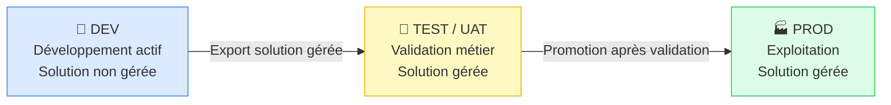

# ALM spécifique Power Apps

## Objectifs pédagogiques

À l'issue de ce module, vous serez capable de :

1. **Structurer** une solution Power Apps dans un schéma d'environnements DEV / TEST / PROD cohérent et justifier ce choix face aux alternatives
2. **Exporter et importer** des solutions gérées et non gérées en comprenant les conséquences concrètes de chaque approche
3. **Utiliser la PAC CLI** pour automatiser les opérations d'empaquetage et de déploiement
4. **Mettre en place un pipeline CI/CD** basique avec Azure DevOps ou GitHub Actions pour déployer une Canvas App ou une Model-Driven App
5. **Identifier et corriger** les problèmes classiques de déploiement : connexions cassées, variables vides, dépendances manquantes

---

## Mise en situation

Vous travaillez dans une équipe de 4 développeurs sur une application de gestion des interventions terrain, construite sur Dataverse avec une Model-Driven App et quelques Canvas Apps embarquées. Pendant 3 mois, tout le monde a travaillé directement dans l'environnement de production. Ça fonctionnait — jusqu'au jour où un collègue a publié une modification non testée qui a cassé le formulaire principal un vendredi à 17h.

L'instinct naturel à ce stade, c'est de faire un export manuel, de renommer le fichier `InterventionApp_v2_FINAL_corrigé.zip` et de le stocker sur SharePoint. Mais cette approche ne tient pas dès qu'on passe à plusieurs développeurs, plusieurs environnements, et des déploiements fréquents.

C'est exactement le problème que l'ALM Power Apps résout — pas comme un luxe réservé aux grandes équipes, mais comme une nécessité dès qu'une app sort du stade prototype.

---

## Contexte : ce que l'ALM change concrètement

L'ALM (Application Lifecycle Management) sur Power Platform répond à des questions très concrètes :

- Comment s'assurer qu'une modification testée en DEV est bien la même qui arrive en PROD ?
- Comment revenir en arrière si un déploiement plante ?
- Comment travailler à plusieurs sans s'écraser mutuellement ?

Le module précédent vous a montré comment diagnostiquer la qualité d'une app avec App Checker. L'ALM prend le relais : une fois que l'app passe les contrôles qualité, comment l'industrialiser ?

La brique centrale de toute stratégie ALM Power Platform, c'est la **Solution**. Tout ce qui ne vit pas dans une solution est, par définition, non déployable proprement.

---

## Architecture des environnements et des solutions

### Les environnements comme frontières d'isolement

Un environnement Power Platform n'est pas juste un espace de travail — c'est une frontière d'isolement complète : données séparées, configurations séparées, sécurité séparée. La topologie classique à trois niveaux reste la référence :



En DEV, la solution est **non gérée** : les développeurs peuvent modifier chaque composant librement. En TEST et PROD, elle devient **gérée** : les composants sont verrouillés et ne peuvent être modifiés que via une nouvelle publication depuis DEV. C'est ce mécanisme qui garantit que ce qui est en PROD correspond exactement à ce qui a été validé.

### Décisions architecturales — DEV/PROD, DEV/TEST/PROD ou plus ?

Avant même d'écrire la moindre ligne de PAC CLI, il faut choisir combien d'environnements mettre en place. Ce choix a des conséquences directes sur les licences, les coûts et la complexité opérationnelle.

| Topologie | Quand la choisir | Risques si ignorée |
|---|---|---|
| **DEV / PROD** | Équipe solo, prototype stable, faible fréquence de release | Pas de filet de sécurité — une erreur va directement en PROD |
| **DEV / TEST / PROD** | Équipe de 2+ personnes, validation métier requise, déploiements réguliers | Sans TEST, le métier valide en PROD — incidents garantis |
| **DEV / TEST / UAT / PROD** | Projet critique, recette utilisateur formelle, cycle de release long | Coût de licences plus élevé, orchestration plus complexe |

La question pratique : un environnement TEST coûte une licence Power Apps par utilisateur actif. Pour une petite équipe de 4 développeurs avec un environnement DEV, TEST et PROD, cela représente environ 3 × 4 × 20 $ = 240 $/mois de licences dédiées aux environnements non-PROD. Ce n'est pas anodin — et c'est pourquoi certaines équipes sautent le TEST. Ce choix est acceptable pour un prototype interne ; il ne l'est pas pour une app de 200 utilisateurs métier.

### Solutions gérées vs non gérées — la distinction qui change tout

| Caractéristique | Non gérée (Unmanaged) | Gérée (Managed) |
|---|---|---|
| Modifiable directement | ✅ Oui | ❌ Non |
| Peut être supprimée proprement | Risqué — composants résiduels | ✅ Suppression nette |
| Usage recommandé | Environnement DEV uniquement | TEST, UAT, PROD |
| Présence dans l'historique Dataverse | Toujours visible | Couche isolée de gestion |

🧠 **Concept clé** — Quand vous importez une solution **non gérée** en PROD, les composants s'ajoutent à la couche "par défaut" de l'environnement. Impossible de désinstaller proprement ensuite sans risquer des effets de bord. Une solution gérée crée une couche isolée que vous pouvez retirer en un clic.

Mais attention : même en DEV, une solution non gérée peut devenir problématique si vous accumulez des composants sans organisation. Le principe "non gérée en DEV uniquement" n'est pas une permission de désordre — c'est une autorisation de modifier librement, pas d'ignorer les conventions.

⚠️ **Erreur fréquente** — Exporter une solution gérée depuis PROD pour la réimporter ailleurs. Une solution gérée ne peut pas être réimportée dans l'environnement où elle a été créée comme non gérée. Le flux va toujours dans un sens : DEV (non gérée) → TEST/PROD (gérée).

### Quand segmenter en plusieurs solutions ?

Une solution unique contenant tout est tentante au démarrage. Elle devient un problème dès que l'équipe grandit ou que les composants évoluent à des rythmes différents.

**Segmenter quand :**
- Des flux "utilitaires" sont partagés entre plusieurs apps — ils méritent leur propre solution pour évoluer indépendamment
- Un composant change très fréquemment (ex : une Canvas App) alors que le schéma Dataverse est stable — inutile de redéployer toutes les tables à chaque release d'app
- Deux équipes travaillent sur des sous-ensembles distincts — une solution par équipe évite les conflits de merge Git

**Risque de sur-segmentation :** chaque solution supplémentaire est une dépendance à gérer. Si la solution A dépend de B qui dépend de C, un déploiement en PROD exige de déployer dans le bon ordre et de maintenir les versions compatibles. Documentez ces dépendances dans un fichier `DEPENDENCIES.md` versionné.

### Composants d'une solution Power Apps typique

| Composant | Rôle |
|---|---|
| Application (Canvas ou MDA) | L'app elle-même |
| Tables Dataverse | Schéma de données |
| Formulaires, vues, graphiques | Composants MDA |
| Rôles de sécurité | Contrôle d'accès |
| Variables d'environnement | Configuration par environnement |
| Connexions de référence | Déclaration des connecteurs utilisés |
| Flux Power Automate liés | Si l'app les déclenche directement |

---

## Variables d'environnement — le pivot d'une solution portable

Les variables d'environnement sont la réponse à un problème récurrent : comment déployer la même solution dans trois environnements qui n'utilisent pas les mêmes URLs, les mêmes comptes de service, les mêmes paramètres ?

Sans elles, les développeurs "hardcodent" des valeurs dans les formules Power Fx ou dans les propriétés des connecteurs — et le déploiement en PROD nécessite des modifications manuelles. C'est là que les erreurs humaines s'introduisent.

Une variable d'environnement se définit dans la solution avec un type (`String`, `Number`, `Boolean`, `JSON`, `Data Source`) et une valeur **par défaut**. Dans chaque environnement cible, on surcharge cette valeur sans toucher à la solution elle-même.

**Créer une variable d'environnement :**
```
make.powerapps.com → Solutions → [Votre solution] → New → More → Environment variable
```

Donnez-lui un nom de schéma explicite : `contoso_ApiUrl`, `contoso_MaxAttachmentSizeMb`. Le préfixe correspond à votre publisher.

**Utilisation dans une Canvas App :**
```
// Accès à la valeur d'une variable d'environnement
Environment.Variables.contoso_ApiUrl
```

**Utilisation dans Power Automate (flow dans la solution) :**
La variable est accessible directement comme valeur dynamique dans les expressions.

⚠️ **Erreur fréquente** — Oublier de définir la valeur de la variable dans l'environnement cible après import. L'app utilise alors la valeur par défaut (celle de DEV), ce qui peut pointer vers des données de test en production. Vérifier systématiquement : **Admin Center → Environments → [Env cible] → Solutions → [Solution] → Environment Variables** après chaque import.

---

## PAC CLI — l'outil qui rend l'ALM scriptable

La Power Apps CLI (`pac`) est l'interface en ligne de commande officielle pour interagir avec Power Platform. Elle permet d'automatiser tout ce qu'on ferait autrement à la main dans le portail.

### Installation

```bash
# Via .NET tool (recommandé)
dotnet tool install --global Microsoft.PowerApps.CLI.Tool

# Vérification
pac --version
```

Sous Windows, l'installeur MSI est disponible sur [aka.ms/PowerAppsCLI](https://aka.ms/PowerAppsCLI). Sur les agents CI/CD, préférer le package NuGet ou l'action GitHub dédiée.

### Authentification et profils

```bash
# Créer un profil d'authentification (ouvre le navigateur)
pac auth create --name DEV --url https://orgxxx.crm.dynamics.com

# Lister les profils disponibles
pac auth list

# Basculer sur un profil
pac auth select --index <INDEX>
```

En CI/CD, on n'utilise pas l'authentification interactive mais un **Service Principal** (Application User dans Power Platform) :

```bash
pac auth create \
  --applicationId <APP_ID> \
  --clientSecret <SECRET> \
  --tenant <TENANT_ID> \
  --url https://<ORG>.crm.dynamics.com
```

Le Service Principal joue ici le rôle d'un compte de service automatisé : il s'authentifie sans intervention humaine, avec des permissions définies précisément dans chaque environnement. Mais l'enregistrement dans Azure AD ne suffit pas — il faut aussi le déclarer comme Application User dans chaque environnement Power Platform cible (voir le snippet dédié).

### Opérations fondamentales sur les solutions

```bash
# Exporter une solution non gérée depuis DEV
pac solution export \
  --name <SOLUTION_NAME> \
  --path ./solutions/<SOLUTION_NAME>.zip \
  --managed false

# Exporter une solution gérée (pour déploiement en TEST/PROD)
pac solution export \
  --name <SOLUTION_NAME> \
  --path ./solutions/<SOLUTION_NAME>_managed.zip \
  --managed true

# Importer une solution dans un environnement cible
pac solution import \
  --path ./solutions/<SOLUTION_NAME>_managed.zip

# Lister les solutions présentes dans l'environnement courant
pac solution list
```

### Dépaqueter une solution pour la mettre sous Git

C'est l'opération la moins connue et la plus utile pour le travail collaboratif. Une solution exportée est un fichier ZIP binaire — impossible à versionner correctement avec Git. La commande `unpack` décompose ce ZIP en fichiers XML et JSON exploitables :

```bash
# Dépaqueter vers un dossier versionnable
pac solution unpack \
  --zipfile ./solutions/<SOLUTION_NAME>.zip \
  --folder ./src/<SOLUTION_NAME> \
  --packagetype Both
```

L'option `--packagetype Both` crée deux sous-dossiers : `managed` et `unmanaged`. Pratique pour maintenir les deux versions depuis une seule source.

### Rempaqueter avant déploiement

```bash
# Rempaqueter depuis les sources (avant import en TEST/PROD)
pac solution pack \
  --zipfile ./solutions/<SOLUTION_NAME>_managed.zip \
  --folder ./src/<SOLUTION_NAME> \
  --packagetype Managed
```

💡 **Astuce** — Ajoutez un `.gitignore` pour exclure les fichiers `.zip` et ne versionner que le dossier `src/`. Les ZIP sont des artefacts de build, pas des sources.

---

## Construction progressive d'un pipeline ALM

### Palier 1 — Manuel structuré (point de départ réaliste)

Même sans CI/CD, ces règles éliminent 80 % des incidents de déploiement :
- Toujours exporter depuis DEV, jamais modifier directement en TEST/PROD
- Nommer les exports avec la version : `InterventionApp_1.2.0_managed.zip`
- Documenter les variables d'environnement dans un `README.md` versionné

### Palier 2 — Pipeline Azure DevOps avec les tâches Power Platform

Microsoft fournit une extension officielle **Power Platform Build Tools** pour Azure DevOps :

```yaml
# azure-pipelines.yml — Pipeline de déploiement vers TEST
trigger:
  branches:
    include:
      - main

pool:
  vmImage: 'windows-latest'

steps:
  - task: PowerPlatformToolInstaller@2
    displayName: 'Install PAC CLI'

  - task: PowerPlatformExportSolution@2
    displayName: 'Export solution from DEV'
    inputs:
      authenticationType: 'PowerPlatformSPN'
      PowerPlatformSPN: '<SERVICE_CONNECTION_DEV>'
      SolutionName: 'InterventionApp'
      SolutionOutputFile: '$(Build.ArtifactStagingDirectory)/InterventionApp.zip'
      Managed: false

  - task: PowerPlatformPackSolution@2
    displayName: 'Pack as Managed'
    inputs:
      SolutionSourceFolder: '$(Build.ArtifactStagingDirectory)/InterventionApp'
      SolutionOutputFile: '$(Build.ArtifactStagingDirectory)/InterventionApp_managed.zip'
      SolutionType: 'Managed'

  - task: PowerPlatformImportSolution@2
    displayName: 'Deploy to TEST'
    inputs:
      authenticationType: 'PowerPlatformSPN'
      PowerPlatformSPN: '<SERVICE_CONNECTION_TEST>'
      SolutionInputFile: '$(Build.ArtifactStagingDirectory)/InterventionApp_managed.zip'
```

### Palier 3 — GitHub Actions

```yaml
# .github/workflows/deploy-to-test.yml
name: Deploy to TEST

on:
  push:
    branches: [main]

jobs:
  deploy:
    runs-on: windows-latest
    steps:
      - uses: actions/checkout@v3

      - name: Install PAC CLI
        uses: microsoft/powerplatform-actions/actions-install@v1

      - name: Export from DEV
        uses: microsoft/powerplatform-actions/export-solution@v1
        with:
          environment-url: ${{ secrets.DEV_URL }}
          app-id: ${{ secrets.APP_ID }}
          client-secret: ${{ secrets.CLIENT_SECRET }}
          tenant-id: ${{ secrets.TENANT_ID }}
          solution-name: InterventionApp
          solution-output-file: InterventionApp.zip
          managed: false

      - name: Import to TEST
        uses: microsoft/powerplatform-actions/import-solution@v1
        with:
          environment-url: ${{ secrets.TEST_URL }}
          app-id: ${{ secrets.APP_ID }}
          client-secret: ${{ secrets.CLIENT_SECRET }}
          tenant-id: ${{ secrets.TENANT_ID }}
          solution-file: InterventionApp_managed.zip
```

🧠 **Concept clé** — Le Service Principal utilisé dans les pipelines doit être enregistré comme **Application User** dans chaque environnement Power Platform cible, avec le rôle **System Administrator**. L'enregistrement Azure AD seul ne suffit pas.

---

## Pièges silencieux — ce que l'import ne signale pas

L'import d'une solution peut réussir sans erreur visible tout en cachant des problèmes qui n'apparaîtront qu'à l'exécution. Voici les plus courants et comment les détecter systématiquement.

| Symptôme à l'exécution | Cause silencieuse | Détection |
|---|---|---|
| Connecteur en erreur alors que l'import a réussi | Connection Reference sans connexion assignée | Vérifier Solutions → [Solution] → Connection References |
| App qui se comporte comme en DEV | Variable d'environnement vide, valeur par défaut utilisée | Admin Center → Environment Variables après chaque import |
| Erreur "Missing dependency" | Table ou rôle absent dans l'env cible | `pac solution check` avant le déploiement |
| Flow désactivé après import | Flow lié à une connexion cassée | Run History du flow — réactiver après réassignation de connexion |
| DLP block inattendu | Politique DLP de l'env cible plus restrictive que DEV | Comparer DLP policies entre environnements avant import |

Le dernier piège est particulièrement traître : un connecteur Premium qui fonctionne en DEV parce que l'admin a autorisé une exception peut être bloqué en PROD où la DLP policy est plus stricte. Ce n'est pas un bug de déploiement — c'est un écart de configuration non documenté. La règle : aligner les DLP policies entre environnements ou documenter explicitement les écarts intentionnels.

---

## Diagnostic — Problèmes classiques de déploiement

### Les connexions cassées après import

**Symptôme :** L'application importe sans erreur, mais les connecteurs affichent une erreur de connexion.

**Cause :** Les connexions Power Platform sont liées à un utilisateur spécifique et ne se transfèrent pas entre environnements. La solution importe les **références de connexion**, pas les connexions elles-mêmes.

**Correction :** Après import, aller dans **Solutions → [Solution] → Connection References** et assigner une connexion valide à chaque référence. Sur un pipeline automatisé, injecter via paramètre de déploiement :

```bash
pac solution import \
  --path ./InterventionApp_managed.zip \
  --connectionReferences ./connection-references.json
```

Le fichier `connection-references.json` mappe chaque référence logique à un ID de connexion existant dans l'environnement cible.

### Les variables d'environnement à valeur vide

**Symptôme :** L'app se comporte comme en DEV, ou retourne des erreurs sur des ressources inexistantes.

**Cause :** La valeur de la variable n'a pas été définie dans l'environnement cible. Power Platform utilise la valeur par défaut (celle de DEV).

**Correction :** Vérifier systématiquement après tout import :
```
Admin Center → Environments → [Env cible] → Solutions → [Solution] → Environment Variables
```

### Composants "manquants" bloquant l'import

**Symptôme :** Erreur à l'import du type `Missing dependency: component [GUID]`.

**Cause :** La solution dépend d'un composant absent dans l'environnement cible.

**Correction :** Utiliser `pac solution check` avant le déploiement, puis déployer la solution dépendante en premier.

```bash
pac solution check --path ./solutions/InterventionApp_managed.zip
```

---

## Cas réel en entreprise

**Contexte :** Une DSI régionale (~200 utilisateurs) déploie une application de gestion des demandes RH construite sur Dataverse + Model-Driven App. L'équipe : 2 développeurs Power Platform, 1 functional consultant, 1 responsable IT.

**Problème initial précis :** En 6 mois de développement direct en PROD, 3 incidents majeurs. Le pire : un formulaire principal cassé un lundi matin, sans possibilité d'identifier qui avait modifié quoi, ni de revenir à une version stable. Le temps de résolution : 4 heures de diagnostic + 2 heures de reconstruction manuelle.

**Trois options envisagées :**

| Option | Avantages | Inconvénients |
|---|---|---|
| **A — DEV / PROD uniquement** | Simple, moins de licences | Aucun filet — tout test va en PROD ; métier valide sur données réelles |
| **B — DEV / TEST / PROD** | Isolation propre, validation métier possible | Coût licences × 3 env ; pipeline plus complexe à maintenir |
| **C — Exports manuels versionnés sans env TEST** | Coût zéro ; traçabilité minimale | Humain = erreur ; pas de validation métier isolée |

L'option A a été rejetée parce que le métier exigeait une recette formelle avant chaque release. L'option C avait été leur pratique pendant 6 mois — les 3 incidents en sont la démonstration. L'équipe a choisi l'option B.

**Ce qui a été mis en place :**
1. Création de 3 environnements (DEV, UAT, PROD) — licences per-app sur UAT et PROD pour les 4 membres de l'équipe de développement, pas pour les 200 utilisateurs finaux (PROD facturé séparément)
2. Migration dans une solution avec publisher `rh_` — décision prise après avoir constaté que changer de publisher en cours de projet sur une solution existante avait cassé 12 références de colonnes dans des formules Canvas
3. 4 variables d'environnement : `rh_ApiUrl`, `rh_ServiceAccountEmail`, `rh_MaxAttachmentMb`, `rh_NotificationGroupId`
4. Pipeline Azure DevOps : push sur `main` → export DEV → pack managed → import UAT automatique → gate de validation manuelle → import PROD

**Résultats mesurables :** Zéro incident de déploiement sur les 4 mois suivants. Temps de déploiement passé de 45 minutes (manuel, avec risque d'erreur) à 8 minutes (automatisé). Deux rollbacks effectués en moins de 5 minutes grâce à l'historique Git et aux artefacts de pipeline conservés.

---

## Bonnes pratiques — avec leur justification

**1. Un publisher, une solution, une équipe.**
Le préfixe publisher est permanent sur les composants existants. Si vous le changez après coup (de `rh_` à `hrm_` par exemple), les tables créées sous `rh_NomTable` gardent ce préfixe — les nouvelles tables prennent `hrm_NomTable`. Les formules Canvas qui référencent `rh_NomTable.NomColonne` cassent silencieusement si la colonne a été recréée sous le nouveau préfixe. Coût si ignoré : migration manuelle de toutes les références, comptez 1 à 2 jours pour une solution de taille moyenne.

**2. Versionnez vos solutions sémantiquement.**
Incrémentez le numéro de version dans les propriétés de la solution (ex : `1.2.0`) à chaque release. Power Platform stocke l'historique des versions importées — c'est votre audit log natif. Coût si ignoré : impossible de savoir quelle version tourne en PROD sans inspecter manuellement chaque composant.

**3. Ne déployez jamais des solutions non gérées en dehors de DEV.**
Même "pour un test rapide". Quand une solution non gérée est importée en PROD, ses composants rejoignent la couche par défaut. Désinstaller ensuite sans effets de bord est impossible — il faut supprimer chaque composant manuellement. Coût constaté : 2 à 3 jours de refactoring pour une solution de taille moyenne.

**4. Documentez les dépendances inter-solutions.**
Un fichier `DEPENDENCIES.md` dans le repo qui liste l'ordre de déploiement suffit. Sans cette documentation, chaque nouveau membre de l'équipe redécouvre les dépendances à ses dépens, en production. Coût si ignoré : erreurs "Missing dependency" répétées + montée en compétence rallongée pour les nouveaux arrivants.

**5. Utilisez `pac solution unpack` dès le premier composant.**
Ne pas attendre d'avoir 50 composants pour commencer à versionner les sources. Intégrer l'unpack dans le workflow dès le premier commit. Coût si ignoré : historique Git inutilisable (ZIPs binaires non différenciables), collaboration multi-développeur impossible proprement.

**6. Testez l'import dans un environnement vierge périodiquement.**
Un environnement de staging propre valide que la solution s'installe sans dépendre d'un historique d'imports précédents. Coût si ignoré : la solution "fonctionne" dans les environnements existants mais plante lors du premier déploiement chez un nouveau client ou dans un nouvel environnement.

**7. Alignez les DLP policies entre environnements.**
Un connecteur qui fonctionne en DEV peut être bloqué en PROD si les règles DLP diffèrent. Documentez les écarts intentionnels. Coût si ignoré : blocage silencieux de flows ou de connecteurs découvert après déploiement en PROD — en heures creuses si vous avez de la chance, en pleine journée sinon.

---

## Résumé

L'ALM Power Apps repose sur trois piliers concrets : **les environnements isolés** (DEV / TEST / PROD), **les solutions gérées** comme unité de déploiement verrouillée, et **la PAC CLI** comme outil de scripting qui rend tout ça reproductible.

Le choix du nombre d'environnements n'est pas neutre — il a un coût de licences direct et un impact sur la complexité opérationnelle. La règle DEV/TEST/PROD est la bonne réponse pour une équipe de 2+ personnes avec des utilisateurs métier qui valident avant mise en production.

Les variables d'environnement et les Connection References sont les deux points de friction systématiques à chaque déploiement. Les connaître à l'avance permet de les gérer proprement plutôt que de les découvrir à 17h un vendredi.

Construire un pipeline CI/CD n'est pas réservé aux grandes équipes : même un pipeline de 10 lignes YAML évite la majorité des incidents humains. Et les pièges silencieux — variables vides, DLP différents, flows désactivés — se détectent tous par une checklist post-import systématique.

Le module suivant ira plus loin dans l'extensibilité avec les PCF Controls, qui s'intègrent dans cette même chaîne ALM.

---

<!-- snippet
id: powerapps_solution_managed_concept
type: concept
tech: power apps
level: intermediate
importance: high
format: knowledge
tags: alm,solution,managed,déploiement,dataverse
title: Solutions gérées vs non gérées — la règle fondamentale
content: Une solution non gérée laisse tous ses composants dans la couche "par défaut" de l'environnement — impossible de la désinstaller proprement. Une solution gérée crée une couche isolée : supprimable en un clic, composants verrouillés contre les modifications directes. Règle : non gérée en DEV uniquement, gérée partout ailleurs. Importer du non-géré en PROD = 2-3 jours de refactoring pour nettoyer.
description: Le type de solution détermine si les composants peuvent être modifiés directement et si la désinstallation est propre — critique avant tout déploiement.
-->

<!-- snippet
id: powerapps_pac_auth_serviceprincipal
type: command
tech: pac cli
level: intermediate
importance: high
format: knowledge
tags: pac,cli,authentification,service-principal,ci-cd
title: Authentification PAC CLI via Service Principal (CI/CD)
command: pac auth create --applicationId <APP_ID> --clientSecret <SECRET> --tenant <TENANT_ID> --url https://<ORG>.crm.dynamics.com
example: pac auth create --applicationId 9f3a1b2c-
