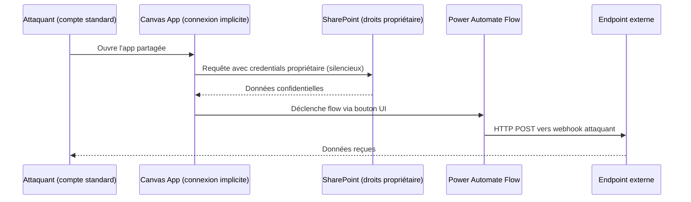
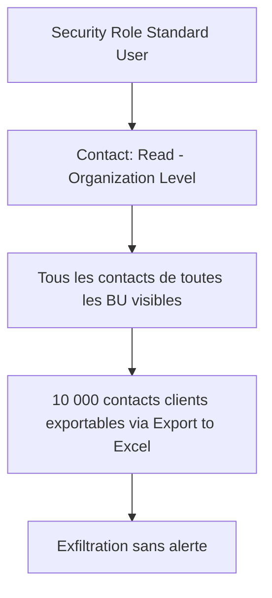

# Sécurité avancée et anti-patterns Power Platform

## Objectifs pédagogiques

À l'issue de ce module, vous serez capable de :

1. **Identifier** les vecteurs d'escalade de privilèges spécifiques à Dataverse et aux Canvas Apps
2. **Diagnostiquer** des configurations DLP et Security Role dangereuses à partir d'un audit réel
3. **Détecter** des flux Power Automate utilisés comme proxy pour contourner des restrictions de données
4. **Analyser** les anti-patterns de gestion des credentials dans les connexions de service
5. **Corriger** les configurations de partage abusif d'apps et de connecteurs non contrôlés

---

## Mise en situation

En mars 2023, une équipe sécurité d'une institution financière européenne détecte une exfiltration de données depuis leur tenant Microsoft 365. Le vecteur ? Un Canvas App interne, partagé avec "Tout le monde dans l'organisation", connecté via une connexion implicite à un compte de service SharePoint ayant des droits full-read sur 47 bibliothèques de documents — dont plusieurs contenant des contrats clients.

L'application avait été créée six mois plus tôt par un Power User sans revue de sécurité. Elle était fonctionnellement correcte. Le problème : quand une app utilise une **connexion implicite**, tous les utilisateurs qui la lancent héritent silencieusement des droits du compte propriétaire — sans que l'UX ne le signale, sans log par utilisateur final dans Azure AD.

L'attaquant n'avait pas besoin de compromettre un compte privilégié. Il lui suffisait d'obtenir un accès utilisateur standard et de trouver l'app dans le catalogue partagé.

Ce scénario illustre un pattern récurrent sur Power Platform : **la friction entre le modèle "maker-first" de la plateforme et les exigences de moindre privilège d'un SI d'entreprise**. Les anti-patterns de sécurité ici ne sont pas des bugs — ce sont des configurations licites, documentées, et massivement utilisées.

---

## Surface d'attaque Power Platform

La surface d'attaque Power Platform est distribuée sur plusieurs couches. Elle ne ressemble pas à celle d'une application web classique — il n'y a pas de code source à auditer directement, mais des configurations, des connexions et des permissions qui interagissent.

| Vecteur | Exposition | Impact potentiel |
|---|---|---|
| Connexion implicite (embedded credentials) | App partagée = credentials partagés silencieusement | Accès non tracé aux données du compte propriétaire |
| Security Role trop permissif (org-level access) | Utilisateur voit tous les enregistrements Dataverse | Exfiltration de données multi-tenants ou multi-BU |
| DLP Policy avec trous dans les connecteurs custom | Connecteur custom peut bypasser les classifications | Exfiltration vers endpoint externe non contrôlé |
| Flow avec trigger HTTP exposé sans auth | Endpoint public sans token → exécution arbitraire | Injection de données, abus de ressources, SSRF interne |
| Partage "Tout le monde" sur une app Canvas | Tout utilisateur M365 peut exécuter l'app | Surface maximale pour toute vulnérabilité dans l'app |
| Variables d'environnement contenant des secrets | Valeur en clair dans l'export de solution | Récupération des credentials lors d'un export non chiffré |
| Accès Maker sans restriction d'environnement | Création de connecteurs custom libres | Exfiltration via un connecteur vers un domaine attaquant |

🧠 **Concept clé** — La surface d'attaque Power Platform est principalement une surface de **mauvaise configuration**, pas une surface de code vulnérable. Un pentester qui cherche des XSS dans une Canvas App perd son temps. Un auditeur qui regarde les Security Roles, les connexions partagées et les flows HTTP non authentifiés trouve en général quelque chose en moins de 30 minutes.

---

## Mécanisme d'attaque : connexions implicites et escalade silencieuse

### Comment ça marche côté attaquant

Quand un maker crée une Canvas App et se connecte à SharePoint ou Dataverse, Power Apps propose deux modes de connexion :

- **Connexion de l'utilisateur** (user's connection) : l'app appelle l'API avec le token de l'utilisateur courant. Moindre privilège respecté.
- **Connexion implicite** (embedded / owner's connection) : l'app embarque la connexion du propriétaire. Tous les utilisateurs de l'app héritent des droits du propriétaire, de façon transparente.

Le mode implicite est le **défaut dans certains scénarios** (notamment pour les connecteurs premium ou les connecteurs custom). Un maker non averti l'active sans en mesurer les conséquences.

Un attaquant qui identifie une app partagée avec connexion implicite peut :

1. Accéder à l'app via son compte standard
2. Appeler des sources de données auxquelles il n'a normalement pas accès
3. Utiliser Power Automate pour créer un flow déclenché depuis l'app, qui exfiltre les données vers un connecteur externe (OneDrive personnel, webhook HTTP, etc.)

Le tout sans jamais avoir besoin d'élever ses droits dans Azure AD.



### Détection de l'escalade

Dans Power Apps Admin Center, aller sur **Environments → [Env] → Apps → [App] → Connections**. Si une connexion affiche "Owner" au lieu de "User", elle est implicite.

Pour un audit à l'échelle du tenant, le module PowerShell Admin permet de lister les apps et leurs connexions :

```powershell
# Lister toutes les apps du tenant avec leur propriétaire
Get-AdminPowerApp -EnvironmentName "<ENV_ID>" |
  Select-Object DisplayName, Owner, @{
    Name="HasConnections";
    Expression={ $_.Internal.properties.connectionReferences -ne $null }
  } | Where-Object { $_.HasConnections -eq $true }
```

Pour identifier précisément les connexions implicites, il faut inspecter le JSON exporté de l'app. Le fichier `Properties/connections` contient un champ `"connectionReferenceType"` — la valeur `"Shared"` indique une connexion implicite (owner's connection).

```powershell
# Exporter une app et inspecter les connexions implicites
$app = Get-AdminPowerApp -AppName "<APP_GUID>" -EnvironmentName "<ENV_ID>"
$exportPath = ".\app_export.zip"
Export-AdminPowerApp -AppName "<APP_GUID>" -EnvironmentName "<ENV_ID>" -Path $exportPath

# Dézipper et lire le manifest pour trouver les connexions Shared
Add-Type -AssemblyName System.IO.Compression.FileSystem
$zip = [System.IO.Compression.ZipFile]::OpenRead($exportPath)
$manifest = $zip.Entries | Where-Object { $_.Name -eq "AppManifest.json" }
$reader = New-Object System.IO.StreamReader($manifest.Open())
$content = $reader.ReadToEnd() | ConvertFrom-Json
$content.properties.connectionReferences | Where-Object {
  $_.connectionReferenceType -eq "Shared"
} | Select-Object id, connectionReferenceType
$zip.Dispose()
```

💡 **Astuce** — Ce script identifie les apps avec connexions implicites. Pour chaque résultat, vérifier quel compte est propriétaire de la connexion et quels droits ce compte possède sur les sources de données concernées.

---

## Mécanisme d'attaque : flows HTTP non authentifiés comme proxy d'exfiltration

### Le vecteur

Power Automate permet de créer des flows avec un **trigger HTTP** qui expose une URL publique sans authentification par défaut :

```
POST https://prod-XX.westeurope.logic.azure.com:443/workflows/<GUID>/triggers/manual/paths/invoke?api-version=2016-06-01&sp=%2Ftriggers%2Fmanual%2Frun&sv=1.0&sig=<SIG>
```

Cette URL contient une signature (`sig`) censée servir de "secret". En pratique :
- La signature ne change jamais sauf si le flow est recréé
- Elle apparaît dans les logs d'accès côté client
- Elle peut être récupérée depuis le code source d'une Canvas App qui appelle le flow

Un attaquant qui récupère cette URL peut déclencher le flow à volonté depuis n'importe où sur internet.

🔴 **Vecteur d'attaque** — Si le flow accède à Dataverse, SharePoint ou Graph API avec les droits du propriétaire, l'attaquant peut déclencher des actions de lecture ou d'écriture sur ces ressources sans aucun compte Azure AD compromis. C'est un **proxy d'accès anonymisé** vers le tenant M365.

Pour auditer les flows HTTP exposés à l'échelle du tenant via Microsoft Graph :

```
GET https://graph.microsoft.com/v1.0/sites/{siteId}/drives
```

Via l'API Power Automate directement (avec token admin) :

```
GET https://api.flow.microsoft.com/providers/Microsoft.ProcessSimple/scopes/admin/environments/<ENV_ID>/flows?$filter=properties/definitionSummary/triggers/any(t:t/type eq 'Request')&api-version=2016-11-01
```

Cette requête retourne tous les flows ayant un trigger de type `Request` (trigger HTTP) dans un environnement donné. Le champ `properties/definitionSummary/triggers` permet de confirmer si le trigger est de type HTTP.

### Le cas encore plus problématique : flows avec input non validé

Un flow HTTP qui accepte un body JSON et utilise les valeurs directement dans des requêtes Dataverse ou vers des services internes est vulnérable à :

- **Injection de paramètres OData** : si la valeur est injectée dans une expression `filter=<input_user>`, un attaquant peut modifier la requête pour accéder à d'autres enregistrements
- **SSRF interne** : si le flow fait un HTTP GET vers une URL passée en paramètre, il peut être utilisé pour scanner des services internes au tenant

---

## Diagnostic : Security Roles et escalade Dataverse

### Comprendre le modèle avant de chercher les failles

Dataverse utilise un modèle de permissions en couches :

1. **Security Role** → définit les opérations (Create/Read/Update/Delete/Append/AppendTo) par entité et par niveau d'accès (User / Business Unit / Parent BU / Organization)
2. **Business Unit (BU)** → structure hiérarchique qui délimite la visibilité des données
3. **Team** → permet de partager des enregistrements entre utilisateurs hors BU
4. **Record-level sharing** → partage ad-hoc d'un enregistrement spécifique

L'anti-pattern le plus courant : **attribuer un accès Organization-level en Read sur des entités sensibles** dans un Security Role "de base" distribué à tous les utilisateurs.



### Audit des Security Roles sur-permissifs

Il n'existe pas d'outil natif de scoring des Security Roles dans Power Platform. L'audit se fait en exportant la définition XML d'un role et en inspectant les niveaux d'accès.

Via l'interface : **make.powerapps.com → Settings → Security Roles → [Role] → Edit**

Chaque entité affiche un niveau d'accès de 0 (aucun) à 4 (org-level). Un accès à 4 sur Contact, Account, ou toute entité métier sensible dans un role distribué largement est à requalifier.

⚠️ **Erreur fréquente** — Copier le Security Role "System Administrator" comme base pour créer un role custom. Le role System Admin a un accès org-level sur tout. Partir de "Basic User" ou d'un role vierge, puis ajouter les permissions nécessaires.

Via Dataverse Web API pour automatiser l'audit :

```
GET https://<ORG>.crm.dynamics.com/api/data/v9.2/roles?$select=name&$expand=roleprivileges_association($select=privilegeid,privilegedepthmask)
```

Le champ `privilegedepthmask` encode le niveau d'accès : `8` = Basic (user), `32` = Local (BU), `256` = Deep (parent BU + BU), `2147483647` = Global (org-level).

🔒 **Contrôle de sécurité** — Pour les entités sensibles, privilégier les niveaux Basic (8) ou Local (32). Un accès Global (2147483647) sur des entités comme `contact`, `account`, `systemuser`, ou toute entité custom contenant des données personnelles doit être justifié et documenté.

---

## Diagnostic : DLP Policies — les trous dans le filet

### Pourquoi les DLP ne suffisent pas seules

Une DLP Policy Power Platform classe les connecteurs en trois buckets :
- **Business** : données sensibles autorisées
- **Non-Business** : usage personnel, isolé de Business
- **Blocked** : interdit

L'erreur classique est de croire que "Blocked" sur les connecteurs grand public (Twitter, Gmail, Dropbox) est suffisant. Il existe trois vecteurs qui contournent les DLP classiques.

**Vecteur 1 — Connecteurs custom non couverts**

Les connecteurs custom ne sont pas classifiés automatiquement. Par défaut, ils tombent dans le bucket défini par la politique `defaultConnectorsClassification`. Si ce champ est `Business`, un connecteur custom pointant vers n'importe quel endpoint externe est autorisé dans les apps et flows Business.

🔴 **Vecteur d'attaque** — Un maker malveillant crée un connecteur custom vers `https://attacker.example.com/collect` et y connecte un flow qui copie les données Dataverse. Si la DLP ne couvre pas explicitement les connecteurs custom, ce flow est licite.

**Vecteur 2 — HTTP avec Azure AD (Premium) mal classifié**

Le connecteur "HTTP with Azure AD" permet d'appeler n'importe quelle API protégée par Azure AD, y compris Microsoft Graph. Si ce connecteur est classifié Business, un flow peut appeler `https://graph.microsoft.com/v1.0/users` sans restriction.

**Vecteur 3 — Power Automate Desktop et RPA**

Les flows Desktop utilisent des actions locales sur le poste de travail. Les DLP Cloud ne s'appliquent pas aux actions Desktop. Un flow Desktop peut lire des fichiers locaux ou extraire des données d'une application web via scraping et les envoyer via une action HTTP sans que la DLP Cloud ne voit quoi que ce soit.

### Configuration DLP durcie

🔒 **Contrôle de sécurité** — Configuration minimale pour un tenant d'entreprise :

| Paramètre | Valeur recommandée | Chemin UI |
|---|---|---|
| `defaultConnectorsClassification` | `Blocked` | Admin Center → Policies → DLP → Edit → Connector classification |
| Connecteurs custom | Classifiés explicitement, jamais par défaut | DLP → Custom connectors → Add pattern |
| HTTP with Azure AD | `Non-Business` ou `Blocked` sauf exception justifiée | DLP → Connectors → HTTP with Azure AD |
| Environnements couverts | Tous les environnements production ET développement | DLP → Scope → Add all environments |
| Tenant isolation | `Inbound + Outbound` bloqué sauf tenants whitelistés | Admin Center → Tenant isolation |

Pour appliquer une DLP durcie par script (utile pour les tenants avec de nombreux environnements), le module PowerShell Power Platform Admin expose `New-DlpPolicy` et `Set-DlpPolicy`. Voici la structure d'une politique durcie ciblant tous les environnements :

```powershell
# Créer une DLP policy durcie sur tous les environnements
# Prérequis : module Microsoft.PowerApps.Administration.PowerShell installé
Import-Module Microsoft.PowerApps.Administration.PowerShell

$policyDefinition = @{
  displayName = "DLP-Production-Durcie"
  defaultConnectorsClassification = "Blocked"
  connectorGroups = @(
    @{
      classification = "Business"
      connectors = @(
        @{ id = "/providers/Microsoft.PowerApps/apis/shared_sharepointonline" },
        @{ id = "/providers/Microsoft.PowerApps/apis/shared_commondataserviceforapps" },
        @{ id = "/providers/Microsoft.PowerApps/apis/shared_office365" }
      )
    },
    @{
      classification = "Blocked"
      connectors = @(
        @{ id = "/providers/Microsoft.PowerApps/apis/shared_http" },
        @{ id = "/providers/Microsoft.PowerApps/apis/shared_webcontents" }
      )
    }
  )
  environmentType = "AllEnvironments"
}

New-DlpPolicy -PolicyDefinition $policyDefinition
```

⚠️ **Erreur fréquente** — Appliquer la DLP durcie uniquement aux environnements de production et laisser les environnements de développement sans politique. Un maker qui crée un connecteur d'exfiltration en dev peut l'inclure dans une solution déployée en prod si le pipeline ALM ne valide pas les connecteurs utilisés.

---

## Mécanisme d'attaque : gestion des credentials dans les solutions

### L'anti-pattern des variables d'environnement "secret"

Power Platform propose depuis 2021 les **variables d'environnement de type Secret**, qui stockent la valeur dans Azure Key Vault. Avant cette fonctionnalité — et encore aujourd'hui dans beaucoup de solutions — les secrets sont stockés en tant que variables d'environnement de type `String`, en clair.

Quand une solution est exportée (`.zip`), le fichier `environmentvariabledefinitions/<name>/environmentvariablevalues.json` contient la valeur en clair si elle a été incluse dans l'export.

Voici ce qu'on trouve concrètement dans un export de solution non sécurisé. Le ZIP contient un répertoire `environmentvariabledefinitions/` — à l'intérieur, chaque variable possède son propre sous-répertoire avec un fichier `environmentvariablevalues.json` :

```
solution.zip
└── environmentvariabledefinitions/
    └── prefix_ApiKey/
        └── environmentvariablevalues.json
```

Contenu du fichier :

```json
{
  "SchemaName": "prefix_ApiKey",
  "value": "sk-prod-4f8a2b1c9d3e7f0a1b2c3d4e5f6a7b8c"
}
```

🔴 **Vecteur d'attaque** — Toute personne ayant accès à un export de solution (ALM, déploiement, backup SharePoint) récupère les secrets. Dans un pipeline DevOps Power Platform naïf qui stocke les exports dans un repo Git, les secrets peuvent se retrouver dans l'historique du repo — y compris après suppression de la variable si le commit n'est pas purgé.

### Variables d'environnement Secret — la bonne config

L'intégration native avec Azure Key Vault requiert :

1. Un Azure Key Vault dans le même tenant
2. Une Managed Identity ou un App Registration avec `Key Vault Secrets User` sur le vault
3. La variable d'environnement référence le secret par son URI, pas sa valeur

```
Secret URI: https://<VAULT_NAME>.vault.azure.net/secrets/<SECRET_NAME>/<VERSION>
```

Lors d'un export, le fichier `environmentvariablevalues.json` ne contiendra que l'URI :

```json
{
  "SchemaName": "prefix_ApiKey",
  "keyVaultReference": {
    "secretUri": "https://myvault.vault.azure.net/secrets/ApiKey/abc123"
  }
}
```

⚠️ **Erreur fréquente** — Utiliser les variables d'environnement Secret mais oublier de révoquer les anciennes variables String qui contenaient les mêmes secrets. Les deux coexistent dans la solution jusqu'à suppression explicite.

---

## Erreurs fréquentes et leurs corrections

### Partage "Run-only" vs partage direct

Un flow Power Automate peut être partagé de deux façons :
- **Owner** : l'autre utilisateur devient co-propriétaire, peut modifier et voir les connexions
- **Run-only** : l'utilisateur peut déclencher le flow mais ne voit pas les connexions ni le contenu

⚠️ **Erreur fréquente** — Partager un flow en mode Owner à des utilisateurs finaux pour "qu'ils puissent l'exécuter". Résultat : ils voient les credentials embarqués dans les connexions et peuvent copier le flow.

**Correction** : partage Run-only systématiquement pour les utilisateurs qui n'ont pas besoin de modifier le flow. Chemin : **flow.microsoft.com → [Flow] → Share → Run only → Add user**.

---

### Environnement Default comme environnement de production

L'environnement Default de Power Platform est partagé par tous les utilisateurs du tenant. Tout utilisateur avec une licence Power Apps peut y créer des apps et des flows. Il n'y a pas de DLP spécifique par défaut, et les Security Roles Dataverse s'appliquent différemment.

⚠️ **Erreur fréquente** — Déployer des apps de production dans l'environnement Default parce que "c'est plus simple".

Conséquences :
- N'importe quel maker peut créer une app qui se connecte aux mêmes sources de données
- Impossible de cloisonner les flux de données entre projets
- Les DLP appliquées à l'environnement Default affectent tous les projets du tenant

**Correction** : Dédier des environnements par projet/domaine métier, avec DLP spécifiques et restriction des makers via Azure AD Security Groups.

---

### Canvas App avec `Navigate` vers des écrans non sécurisés

Dans une Canvas App multi-rôles, le pattern classique consiste à cacher des écrans selon le rôle de l'utilisateur via une variable : `If(userRole = "Admin", Navigate(ScreenAdmin))`.

🔴 **Vecteur d'attaque** — La condition `Navigate` est côté client. Si l'écran existe dans l'app, un utilisateur qui manipule les variables de session dans Power Apps Studio ou qui exploite un bug dans la logique de navigation peut accéder à des écrans qui ne lui sont pas destinés. Les données affichées sur ces écrans sont récupérées avec les droits de la connexion — pas les droits de l'utilisateur.

**Correction** : La sécurité d'accès aux données ne doit jamais reposer sur la navigation dans l'app. Elle doit reposer sur les Security Roles Dataverse, les permissions SharePoint, ou les filtres appliqués côté serveur. L'écran peut être caché pour l'UX, jamais pour la sécurité des données.

---

### Flows avec accès Dataverse en tant que System Administrator

Quand un flow Power Automate utilise le connecteur Dataverse avec l'option **"Connect with service principal or managed identity"**, le service principal doit avoir un Security Role dans Dataverse. Par facilité, beaucoup de makers attribuent le role **System Administrator**.

🔴 **Vecteur d'attaque** — Si le flow est compromis (trigger HTTP sans auth, flow partagé avec co-owner non autorisé), l'attaquant dispose d'un accès System Admin à tout Dataverse. Toutes les entités, tous les enregistrements, toutes les configurations.

**Correction** : Créer un Security Role custom avec uniquement les entités et opérations nécessaires au flow. Voici la structure minimale d'un Security Role custom pour un flow qui ne fait que créer et lire des enregistrements sur deux entités spécifiques :

Via l'interface **make.powerapps.com → Settings → Security Roles → New** :

| Entité | Create | Read | Write | Delete | Append | AppendTo | Niveau |
|---|---|---|---|---|---|---|---|
| `prefix_WorkOrder` | ✅ | ✅ | ❌ | ❌ | ✅ | ❌ | Basic (User) |
| `prefix_WorkOrderLine` | ✅ | ✅ | ❌ | ❌ | ❌ | ✅ | Basic (User) |
| Toutes autres entités | ❌ | ❌ | ❌ | ❌ | ❌ | ❌ | Aucun |

Ce role est ensuite attribué au service principal via **Admin Center → Environments → [Env] → Settings → Users + permissions → Application users → [Service Principal] → Security Roles**.

---

## Cas réel en entreprise

### Exfiltration via Flow HTTP — secteur retail, 2022

Une chaîne de distribution européenne utilise Power Platform pour automatiser la gestion des commandes fournisseurs. Un consultant externe crée un flow de test avec un trigger HTTP pour faciliter les démonstrations. Le flow lit les commandes Dataverse et renvoie le JSON complet en réponse HTTP.

À la fin de la mission, le consultant quitte le projet mais le flow reste actif. L'URL du trigger avait été partagée dans un email d'équipe.

Six mois plus tard, lors d'un audit DLP, l'équipe sécurité constate des appels réguliers vers ce trigger depuis des IP externes inconnues. Le flow avait tourné pendant six mois, répondant à des requêtes non authentifiées avec les données de commandes — incluant les prix négociés, les volumes et les noms des fournisseurs.

**Leçons tirées :**

1. Les flows avec trigger HTTP doivent être inventoriés et audités régulièrement
2. Un offboarding de consultant doit inclure un audit des ressources Power Platform créées
3. Les flows de test ne doivent pas être créés dans des environnements de production
4. Les triggers HTTP doivent être protégés par Azure AD auth ou supprimés

Pour activer l'authentification Azure AD sur un trigger HTTP, le flow doit être configuré pour n'accepter que des tokens émis par Azure AD. Avant / après :

**Avant (trigger sans authentification) :**
```json
{
  "type": "Request",
  "kind": "Http",
  "inputs": {
    "schema": {},
    "method": "POST"
  }
}
```

**Après (trigger avec Azure AD OAuth) :**
```json
{
  "type": "Request",
  "kind": "Http",
  "inputs": {
    "schema": {},
    "method": "POST"
  },
  "authentication": {
    "type": "ActiveDirectoryOAuth",
    "tenant": "<TENANT_ID>",
    "audience": "<APP_ID_URI>",
    "clientId": "<CLIENT_ID>",
    "secret": "@parameters('$connections')['aad']['connectionId']"
  }
}
```

Le champ `audience` doit correspondre à l'App Registration créée pour ce flow. Seuls les tokens émis pour cette audience par le tenant spécifié seront acceptés.

---

## Contrôles de détection

Les mécanismes d'attaque décrits dans ce module sont difficiles à détecter avec les outils SIEM classiques parce que les logs sont distribués entre plusieurs services.

| Signal | Source de log | Ce qu'il indique |
|---|---|---|
| Appels répétés au même trigger HTTP depuis des IP inconnues | Azure Monitor → Logic Apps → Diagnostics | Flow HTTP potentiellement exposé |
| Export de solution contenant des variables String avec secrets | Power Platform Admin Center → Analytics | Fuite potentielle de credentials |
| Utilisateur accédant à des enregistrements hors de sa BU | Dataverse Audit Logs → Read access | Security Role trop permissif ou partage abusif |
| App Canvas partagée avec plus de 100 utilisateurs + connexion implicite | Power Apps Admin Center → Apps | Surface d'attaque élargie |
| Nouveau connecteur custom créé dans un environnement prod | Power Platform Admin Center → Connectors | DLP potentiellement contournée |

Pour activer les logs d'audit Dataverse :

**make.powerapps.com → Settings → Audit and logs → Audit settings → Start auditing**

Sélectionner au minimum : **Read logs** (désactivé par défaut, coût de stockage à anticiper) et **User access audit**.

💡 **Astuce** — Les logs Dataverse sont exportables vers Azure Log Analytics via **Dataverse Audit Export**. Une fois dans Log Analytics, vous pouvez créer des alertes sur des patterns comme `Operation == "RetrieveMultiple" AND RecordCount > 500 AND UserId NOT IN (allowlist)`.

---

## Défense en couches : ce que ça donne en pratique

Les vecteurs décrits dans ce module n'existent pas en isolation. Un tenant bien configuré s'attaque à tous simultanément, pas un par un.

| Couche | Contrôle | Ce que ça bloque |
|---|---|---|
| Identité | Connexion "User's connection" obligatoire + no sharing implicite | Escalade silencieuse connexions implicites |
| Données |
