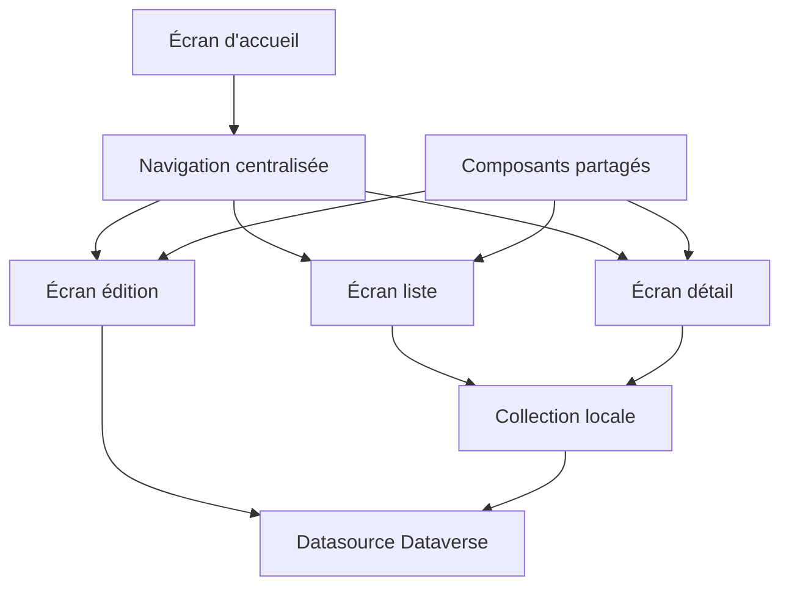
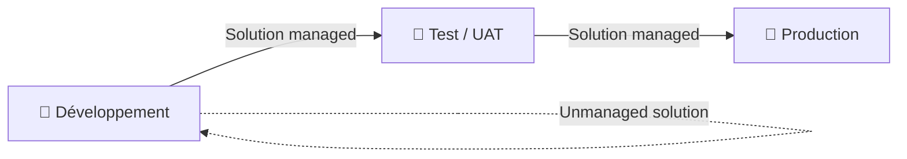

# Architecture Power Apps production

## Objectifs pédagogiques

À l'issue de ce module, tu seras capable de :

- Identifier les choix d'architecture structurants d'une Power App destinée à la production
- Distinguer les patterns adaptés aux Canvas Apps et aux Model-Driven Apps selon les contraintes métier
- Concevoir une stratégie de découpage applicatif cohérente (composants, collections, sources de données)
- Anticiper les goulots d'étranglement liés aux délégations, au chargement des données et à la connectivité
- Intégrer une Power App dans un écosystème ALM : environnements, solutions, dépendances

---

## Mise en situation

Imagine qu'on te confie une application Canvas App déjà en production. Elle a été bâtie en quelques semaines par un consultant fonctionnel motivé — ça fonctionne, mais dès que 30 utilisateurs s'y connectent simultanément, les temps de chargement explosent. Les formules dans `OnStart` durent 8 secondes. Il n'y a qu'un seul environnement. Les données proviennent de 4 sources différentes dont deux listes SharePoint et un Excel partagé sur OneDrive.

Le tableau de bord Power BI du directeur ne se met plus à jour correctement parce que quelqu'un a modifié une colonne dans la liste SharePoint. Et personne ne sait vraiment quelle version de l'app est en production.

Ce module t'apprend à éviter cette situation dès la conception — et à diagnostiquer les symptômes quand tu arrives après coup.

---

## Ce que c'est et pourquoi ça compte

Une Power App en production, ce n'est pas une app qui "tourne" — c'est une app qui tourne **de manière prévisible, pour N utilisateurs simultanés, maintenable par une équipe, déployable sans prise de risque**.

La plupart des projets Power Apps démarrent vite (c'est la promesse), mais entrent en friction avec la réalité opérationnelle au moment où :
- la base d'utilisateurs dépasse 20-30 personnes,
- l'app s'intègre à d'autres systèmes (SAP, Dynamics, APIs maison),
- l'équipe tourne et quelqu'un doit reprendre le code d'un autre,
- une mise à jour fonctionnelle doit être déployée sans couper les utilisateurs.

L'architecture Power Apps production, c'est l'ensemble des **décisions structurantes prises en amont** (et parfois rectifiées en cours de route) qui permettent d'éviter ces frottements.

🧠 **Concept clé** — Power Apps n'est pas un outil "no-ops". Il y a bien une couche d'infrastructure derrière : des environnements, des connecteurs, des limites de requêtes, une gestion des versions. L'ignorer, c'est reporter les problèmes à plus tard — avec intérêts.

---

## Les deux grands modèles et leur logique d'architecture

Avant toute décision de découpage, il faut être clair sur le type d'app qu'on construit. Ce n'est pas qu'une question de UI.

### Canvas App : liberté totale, responsabilité totale

Une Canvas App te donne un canevas vide. Tu décides de tout : la navigation, le layout, le flux de données, les formules. C'est puissant, et c'est précisément là que les architectures dérivent.

Le modèle mental d'une Canvas App bien architecturée ressemble à ceci :



La **navigation centralisée** (via un composant ou un écran de dispatch) évite la duplication de logique d'autorisation. Les **collections locales** absorbent les données une fois chargées et servent de cache applicatif pour les lectures répétées. La **datasource** n'est interrogée que pour les écritures ou les actualisations explicites.

### Model-Driven App : structure imposée, cohérence garantie

Une Model-Driven App est construite *à partir du modèle de données Dataverse*. Tu n'as pas à gérer la navigation ou les formulaires de A à Z — ils sont générés à partir des entités, vues et formulaires que tu configures.

C'est le bon choix quand :
- le workflow métier est centré sur des entités (leads, tickets, commandes),
- plusieurs rôles accèdent aux mêmes données avec des vues différentes,
- tu veux profiter du moteur de sécurité Dataverse (rôles, unités commerciales) sans le recoder.

⚠️ **Erreur fréquente** — choisir une Canvas App "parce qu'on a plus de contrôle" pour un use case CRM ou gestion de tickets. On finit par recoder à la main ce que la Model-Driven App aurait fourni gratuitement (navigation entité-vue-formulaire, audit trail, recherche full-text, relations 1:N affichées automatiquement).

---

## Stratégie de données : le vrai centre de gravité

C'est ici que la majorité des problèmes de performance et de maintenabilité prennent racine.

### Dataverse vs connecteurs externes

| Critère | Dataverse | SharePoint / SQL / API externe |
|---|---|---|
| Performance de requête | Optimisée, déléguée nativement | Variable, souvent limitée |
| Sécurité granulaire | Rôles Dataverse natifs | Héritée du connecteur |
| Relations entre entités | Tables reliées, jointures | Manuellement gérées dans les formules |
| Limites de délégation | Quasi absentes sur Dataverse | 500 / 2000 lignes selon le connecteur |
| Coût | Licence Premium | Inclus Standard (SharePoint) |
| ALM (transport via solution) | Natif | Non géré |

Dataverse n'est pas toujours justifié — mais pour une app qui va gérer des volumes > 2000 enregistrements, des relations entre entités, ou des accès multi-rôles, c'est rarement optionnel.

### La délégation : comprendre la limite structurelle

Power Apps envoie des formules de filtrage à la source de données. Si la source *ne sait pas exécuter* cette formule, Power Apps la rapatrie entièrement et filtre localement — avec un plafond configurable (par défaut 500, max 2000).

```
// ✅ Déléguée sur Dataverse ou SQL
Filter(Commandes, Statut = "En cours" && MontantTotal > 1000)

// ❌ Non déléguée : Lower() n'est pas supporté par SharePoint
Filter(Produits, Lower(Nom) = Lower(rechercheTexte))
```

Le problème n'est pas que la formule "ne marche pas" — c'est qu'elle marche *silencieusement* sur 500 lignes seulement. L'utilisateur ne voit pas d'erreur, mais il voit des données incomplètes.

🧠 **Concept clé** — La délégation n'est pas une option à activer. C'est une propriété de chaque paire (connecteur, fonction). Power Apps Studio affiche un avertissement jaune, mais ne bloque pas. En production avec des milliers de lignes, ignorer ces warnings revient à concevoir délibérément un bug de troncature.

💡 **Astuce** — Pour les recherches texte sur SharePoint, utilise `Search()` plutôt que `Filter() + Lower()`. `Search()` est déléguée sur les colonnes indexées SharePoint. Pour SQL, `StartsWith()` est déléguée, `Contains()` ne l'est pas.

---

## Découpage applicatif : composants, collections, OnStart

### Le problème du `OnStart` monolithique

Il est tentant de tout charger au démarrage : collections de référence, données utilisateur, configurations. Le résultat : 5 à 12 secondes de chargement à chaque ouverture, quel que soit l'écran utilisé.

Le pattern production consiste à **charger les données au plus près de leur utilisation** :

```
// ❌ Anti-pattern : tout charger dans OnStart
OnStart:
  ClearCollect(colProduits, Produits);
  ClearCollect(colFournisseurs, Fournisseurs);
  ClearCollect(colCommandes, Commandes);
  Set(varUtilisateur, LookUp(Utilisateurs, Email = User().Email))

// ✅ Pattern : OnStart minimal + chargement différé par écran
OnStart:
  Set(varUtilisateur, LookUp(Utilisateurs, Email = User().Email))

// Sur OnVisible de l'écran Commandes :
  ClearCollect(colCommandes, Filter(Commandes, AssignéÀ = varUtilisateur.Id))
```

### Composants : réutilisabilité et encapsulation

Un composant Canvas App est une unité réutilisable avec ses propres propriétés d'entrée/sortie. En architecture production, ils servent à trois choses distinctes :

1. **Encapsuler la navigation** (header, menu latéral) — évite de répliquer la logique d'autorisation sur chaque écran
2. **Standardiser les formulaires de saisie** — un composant "champ de saisie validé" plutôt que 40 `TextInput` avec les mêmes règles de validation copiées-collées
3. **Isoler les dépendances aux sources de données** — un composant peut exposer une propriété `Items` qu'on lui passe depuis l'écran, plutôt qu'interroger directement la source

⚠️ **Erreur fréquente** — créer des composants qui interrogent directement Dataverse à l'intérieur. Ça rend les composants difficiles à tester, impossible à réutiliser dans d'autres contextes, et multiplie les appels réseau.

### Collections comme cache local

Une collection est une table en mémoire. Son rôle architectural : **absorber les lectures répétées** sur des données qui ne changent pas dans la session (listes de référence, configuration, données de l'utilisateur courant).

```
// Charger une fois, utiliser partout dans la session
ClearCollect(colTypesContrats, TypesContrats);

// Tous les combos de l'app utilisent colTypesContrats, pas TypesContrats directement
```

La contrepartie : une collection est **volatile** (perdue à la fermeture de l'app) et **non synchronisée** (si un autre utilisateur modifie les données pendant la session, la collection ne le sait pas). Pour les données critiques à forte fréquence de modification, il faut soit rafraîchir explicitement, soit ne pas mettre en collection.

---

## Intégration dans l'écosystème ALM

Une app en production sans ALM, c'est une app où personne n'ose déployer une mise à jour parce que personne ne sait ce que ça va casser.

### Les trois environnements minimaux



- **Développement** : solution *non managée*, les développeurs modifient les composants librement
- **Test / UAT** : solution *managée* importée — les utilisateurs métier valident, on ne modifie pas ici
- **Production** : solution *managée* — même package que celui validé en UAT

La distinction managée/non managée est structurante : une solution managée empêche les modifications directes dans l'environnement cible. C'est une contrainte délibérée qui garantit que ce qui tourne en prod est exactement ce qui a été validé.

💡 **Astuce** — Configure les **variables d'environnement** dans ta solution pour externaliser les URLs, les IDs de configuration et les paramètres qui changent entre environnements. Elles sont transportées avec la solution et leur valeur peut être surchargée à l'import — sans modifier l'app elle-même.

### Dépendances et périmètre de solution

Une solution Power Apps en production doit embarquer **toutes ses dépendances** :
- les tables Dataverse utilisées
- les flux Power Automate déclenchés par l'app
- les rôles de sécurité
- les variables d'environnement
- les composants partagés (Component Libraries)

Oublier une dépendance, c'est s'exposer à un import qui "réussit" mais produit une app cassée dans l'environnement cible.

🧠 **Concept clé** — Le **Solution Checker** analyse ta solution avant export et signale les dépendances manquantes, les violations de bonnes pratiques, et les composants obsolètes. L'intégrer dans ton pipeline de déploiement (GitHub Actions, Azure DevOps via Power Platform CLI) transforme ce contrôle en gate automatique plutôt qu'en vérification manuelle oubliée.

---

## Gouvernance de la performance : les leviers concrets

### Limite de requêtes et connecteurs Premium

Power Platform impose des limites de requêtes API par utilisateur et par jour (Power Platform Request limits). En production, avec une app sollicitant Dataverse sur chaque interaction, un utilisateur intensif peut atteindre ces seuils — déclenchant des ralentissements ou des erreurs 429.

Les leviers à ta disposition :

| Levier | Effet | Quand l'activer |
|---|---|---|
| Collections locales | Réduit les appels lecture | Données de référence stables |
| `Concurrent()` | Parallélise plusieurs ClearCollect | OnStart avec plusieurs collections indépendantes |
| Pagination explicite | Charge N enregistrements à la demande | Listes longues > 500 items |
| Délégation correcte | Filtre côté serveur, moins de données transportées | Toujours |
| Views Dataverse | Pré-filtre les colonnes et lignes serveur | Remplacer Filter() côté client |

```
// Concurrent() : charge 3 collections en parallèle au lieu de séquentiellement
Concurrent(
    ClearCollect(colProduits, Produits),
    ClearCollect(colClients, Clients),
    ClearCollect(colStatuts, Statuts)
);
```

### Moniteur Power Apps : ton meilleur allié de diagnostic

L'outil **Monitor** (accessible depuis Power Apps Studio → … → Moniteur) trace en temps réel chaque appel réseau effectué par l'app pendant une session de test. Il affiche :
- la durée de chaque requête
- le nombre de lignes retournées
- les formules déléguées vs non déléguées
- les erreurs de connecteur

C'est l'équivalent des DevTools réseau d'un navigateur, appliqué à Power Apps. Avant tout déploiement en production, une session Monitor avec un utilisateur métier en UAT devrait être la norme — pas l'exception.

---

## Cas réel : refonte d'une app de gestion de visites terrain

**Contexte** — Application utilisée par 80 techniciens terrain pour consigner des visites chez des clients. Données dans 3 listes SharePoint. Temps de chargement initial : 11 secondes. Crashes aléatoires sur mobiles 4G. Aucun environnement de test.

**Diagnostic initial (Monitor + revue du code)** :
- `OnStart` chargeait 3 listes complètes (~4 000 lignes chacune) en séquentiel
- Plusieurs `Filter()` avec `Lower()` non déléguées → résultats tronqués silencieusement
- Aucune gestion d'erreur sur les appels Dataverse (une connectivité 4G fragile générait des erreurs non catchées)

**Actions menées** :

1. **Migration vers Dataverse** — Les 3 listes SharePoint ont été migrées. Résultat immédiat : délégation complète des filtres, disparition des troncatures.

2. **Refactoring OnStart** — Seule la collection de configuration (20 lignes) reste dans `OnStart`. Les données de visite sont chargées sur `OnVisible` de l'écran liste, filtrées par technicien connecté.

3. **Concurrent() + pagination** — Les 2 collections de référence restantes sont chargées en parallèle. La liste des visites passe en pagination explicite (25 par page).

4. **Gestion d'erreur explicite** — Chaque `Patch()` est wrappé dans un `IfError()` qui stocke l'erreur dans une collection locale et propose une resynchronisation différée.

5. **Mise en place des 3 environnements** — DEV / UAT / PROD avec variables d'environnement pour les IDs Dataverse.

**Résultats** :
- Temps de chargement initial : 11s → 2,3s
- Zéro erreur de troncature reportée depuis le déploiement
- Premier déploiement en production via solution managée : 40 minutes, zéro régression

---

## Bonnes pratiques — ce qui fait la différence en production

**Sur la source de données :**
Toujours évaluer les limites de délégation de ton connecteur *avant* de commencer à coder. Si tu sais que tu vas dépasser 2 000 enregistrements et que tu utilises SharePoint, le problème architectural est posé dès le premier jour.

**Sur les composants :**
Un composant ne devrait jamais appeler directement une source de données. Il reçoit ses données via une propriété d'entrée `Items`. Ça le rend testable, réutilisable, et ça centralise la gestion des erreurs réseau dans l'écran parent.

**Sur la gestion d'erreur :**
`IfError()` autour de chaque `Patch()` et `ClearCollect()` critique. En production mobile (4G, tunnels, zones blanches), les erreurs réseau ne sont pas des cas limites — c'est la réalité quotidienne.

**Sur l'ALM :**
Ne jamais modifier directement en production. Même une correction d'une virgule. Toujours passer par le pipeline DEV → UAT → PROD. La première fois qu'une correction "urgente" en prod crée une régression sur 80 utilisateurs, la discipline ALM devient une évidence.

**Sur le Monitor :**
Pas une option de debug — une étape systématique avant tout déploiement majeur. Cherche les appels > 2 secondes, les requêtes qui retournent > 500 lignes côté client, et les appels répétés identiques (signe d'une collection non utilisée correctement).

💡 **Astuce** — Nomme tes écrans, contrôles et collections avec un préfixe de type : `scr_` pour les écrans, `gal_` pour les galeries, `col_` pour les collections, `var_` pour les variables, `lbl_` pour les labels. Ce n'est pas une convention cosmétique : quand une formule complexe référence `gal_Visites.Selected.Statut`, tu comprends immédiatement de quoi il s'agit, six mois plus tard, sans relire tout l'écran.

---

## Résumé

Une Power App en production repose sur quatre piliers qui se renforcent mutuellement. Le **choix du modèle** (Canvas vs Model-Driven) détermine la quantité de logique que tu dois écrire et maintenir toi-même. La **stratégie de données** — notamment le choix de Dataverse et la maîtrise de la délégation — conditionne la performance à l'échelle. Le **découpage applicatif** (composants encapsulés, collections comme cache, chargement différé) évite les anti-patterns de monolithe qui rendent les apps lentes et fragiles. Enfin, l'**intégration ALM** avec solutions managées, environnements distincts et variables d'environnement transforme un prototype fonctionnel en produit déployable de manière répétable et sécurisée. Ces décisions se prennent idéalement au démarrage du projet — mais peuvent être corrigées progressivement, comme le montre le cas terrain, avec des gains mesurables et rapides.

---

<!-- snippet
id: powerapps_delegation_warning
type: warning
tech: power apps
level: intermediate
importance: high
format: knowledge
tags: delegation,sharepoint,filter,performance,canvas
title: Délégation silencieuse — troncature invisible des données
content: Piège : Filter() avec Lower() sur SharePoint n'est pas déléguée. Power Apps filtre localement sur 500 lignes max (configurable à 2000). Aucune erreur affichée — juste des données manquantes. Correction : utiliser Search() sur colonnes indexées (déléguée sur SharePoint), ou migrer vers Dataverse.
description: Filter+Lower sur SharePoint tronque silencieusement à 500 lignes. Utiliser Search() ou Dataverse pour éviter ce bug invisible en production.
-->

<!-- snippet
id: powerapps_onstart_pattern
type: tip
tech: power apps
level: intermediate
importance: high
format: knowledge
tags: onstart,performance,collections,chargement,canvas
title: OnStart minimal — charger les données au plus près de leur écran
content: Ne charger dans OnStart que les données vraiment nécessaires avant le premier affichage (config utilisateur, liste de référence < 50 lignes). Tout le reste se charge dans OnVisible de l'écran qui l'utilise. Résultat typique : temps de démarrage divisé par 3 à 5 sur une app avec plusieurs entités.
description: OnStart ne doit contenir que le minimum vital. Chaque ClearCollect supplémentaire au démarrage coûte 0.5 à 3s de latence perçue par l'utilisateur.
-->

<!-- snippet
id: powerapps_concurrent_collections
type: command
tech: power apps
level: intermediate
importance: medium
format: knowledge
tags: concurrent,performance,onstart,collections,canvas
title: Concurrent() — charger plusieurs collections en parallèle
command: Concurrent(ClearCollect(<COL1>, <TABLE1>), ClearCollect(<COL2>, <TABLE2>), ClearCollect(<COL3>, <TABLE3>))
example: Concurrent(ClearCollect(colProduits, Produits), ClearCollect(colClients, Clients), ClearCollect(colStatuts, Statuts))
description: Parallel au lieu de séquentiel pour les ClearCollect indépendants. Sur 3 collections de ~200 lignes, économie typique de 1 à 2 secondes au chargement.
-->

<!-- snippet
id: powerapps_component_no_datasource
type: warning
tech: power apps
level: advanced
importance: high
format: knowledge
tags: composants,architecture,datasource,canvas,reutilisabilite
title: Composant Canvas — ne jamais appeler la datasource depuis l'intérieur
content: Piège : un composant qui appelle directement Dataverse ou SharePoint est non testable, non réutilisable, et multiplie les appels réseau. Correction : le composant expose une propriété d'entrée Items (type Table). L'écran parent lui passe les données. La logique réseau reste dans l'écran, pas dans le composant.
description: Un composant doit recevoir ses données via une propriété Input, pas les chercher lui-même. Cela centralise la gestion des erreurs réseau et rend le composant réutilisable.
-->

<!-- snippet
id: powerapps_managed_solution_alm
type: concept
tech: power apps
level: advanced
importance: high
format: knowledge
tags: alm,solution,managed,environnements,deploiement
title: Solution managée — mécanisme de verrouillage en environnement cible
content: Une solution managée importe les composants en lecture seule dans l'environnement cible. Toute modification directe en UAT ou PROD est bloquée. Les mises à jour passent obligatoirement par un nouvel import depuis DEV. Conséquence : ce qui tourne en PROD est exactement ce qui a été validé en UAT — aucune dérive possible entre environnements.
description: Solution managée = verrouillage des modifications en cible. Garantit que PROD = UAT validé. Toute correction passe par le pipeline DEV → UAT → PROD.
-->

<!-- snippet
id: powerapps_env_variables
type: tip
tech: power apps
level: advanced
importance: medium
format: knowledge
tags: variables-environnement,alm,solution,configuration,deploiement
title: Variables d'environnement — externaliser les paramètres par environnement
content: Créer une variable d'environnement dans la solution pour chaque valeur qui change entre DEV/UAT/PROD (URL d'API, ID de configuration, adresse email d'alerte). À l'import de la solution managée, Power Platform propose de surcharger la valeur sans modifier l'app. Chemin : Solution → Nouveau → Variable d'environnement → type Texte ou Source de données.
description: Variables d'environnement = paramètres externalisés transportés avec la solution. Valeur surchargeable à l'import sans toucher au code de l'app.
-->

<!-- snippet
id: powerapps_monitor_tool
type: tip
tech: power apps
level: intermediate
importance: medium
format: knowledge
tags: monitor,debug,performance,diagnostic,canvas
title: Monitor Power Apps — tracer tous les appels réseau en session
content: Accès : Power Apps Studio → icône … → Moniteur → Démarrer le moniteur, puis tester l'app dans le volet de prévisualisation. Le Monitor affiche chaque requête avec sa durée, le nombre de lignes retournées, et si la requête a été déléguée. Chercher : requêtes > 2s, réponses > 500 lignes, appels identiques répétés en boucle.
description: Le Monitor trace en temps réel chaque appel connecteur. À utiliser systématiquement avant tout déploiement majeur pour identifier les requêtes lentes ou non déléguées.
-->

<!-- snippet
id: powerapps_naming_convention
type: tip
tech: power apps
level: beginner
importance: medium
format: knowledge
tags: convention,nommage,lisibilite,maintenance,canvas
title: Convention de nommage — préfixes par type de contrôle
content: Appliquer systématiquement : scr_ (écrans), gal_ (galeries), col_ (collections), var_ (variables), lbl_ (labels), txt_ (TextInput), btn_ (boutons), frm_ (formulaires). Dans une formule complexe, gal_Visites.Selected.Statut est immédiatement lisible sans contexte. Sans convention, une app de 15 écrans devient illisible en 3 mois.
description: Préfixes de nommage : scr_, gal_, col_, var_, lbl_, txt_, btn_, frm_. Indispensable pour la maintenance et la reprise de code par un tiers.
-->

<!-- snippet
id: powerapps_iferror_patch
type: warning
tech: power apps
level: intermediate
importance: high
format: knowledge
tags: erreur,patch,iferror,resilience,mobile
title: Patch sans IfError — erreurs silencieuses sur mobile
content: Piège : Patch(Table, defaults, {champ: valeur}) sans gestion d'erreur. Sur 4G ou connectivité dégradée, l'erreur réseau est ignorée, l'utilisateur pense avoir sauvegardé alors que rien n'a été écrit. Correction : IfError(Patch(...), Notify("Erreur de sauvegarde — réessayez", NotificationType.Error)). Pour les apps critiques, stocker l'erreur dans une collection et proposer une resynchronisation.
description: Toujours wrapper Patch() dans IfError(). Sur mobile, les erreurs réseau sont fréquentes — sans cette protection, les données semblent sauvegardées mais ne le sont pas.
-->

<!-- snippet
id: powerapps_canvas_vs_modeldriven
type: concept
tech: power apps
level: intermediate
importance: high
format: knowledge
tags: canvas,model-driven,choix,architecture,dataverse
title: Canvas vs Model-Driven — critère de choix structurant
content: Model-Driven génère automatiquement navigation, formulaires, vues et relations depuis le modèle Dataverse. Canvas donne un canevas vide avec contrôle total. Règle pratique : si le use case est centré sur des entités avec relations (tickets, leads, contrats), Model-Driven évite de recoder ce que Dataverse fournit nativement. Canvas est justifié pour les interfaces mobiles custom, les workflows visuels non standard, ou les intégrations multi-sources complexes.
description: Model-Driven = génération automatique depuis Dataverse (formulaires, vues, relations). Canvas = liberté totale mais tout à coder. Choisir Model-Driven quand le cœur est une entité Dataverse.
-->
