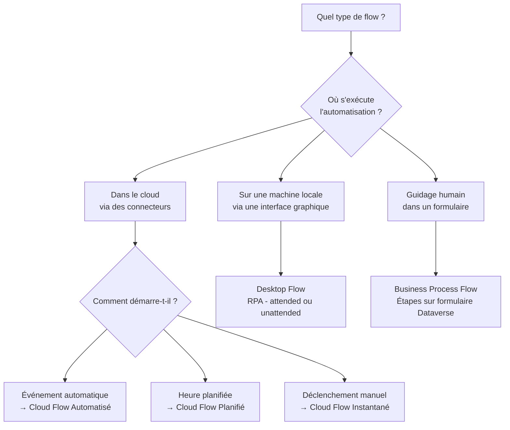

# Types de flows Power Automate

## Objectifs pédagogiques

À l'issue de ce module, vous serez capable de :

- Identifier les trois grandes familles de flows et leur domaine d'application respectif
- Choisir le bon type de flow selon le déclencheur et l'environnement cible
- Distinguer un Cloud Flow d'un Desktop Flow sans confondre leurs usages
- Comprendre le rôle des flows dans une solution Power Platform sans les isoler du reste

---

## Mise en situation

Votre responsable vous demande d'automatiser trois choses en même temps : envoyer un email quand une commande arrive dans Dataverse, extraire des données d'un logiciel interne qui n'a pas d'API, et générer un rapport chaque lundi matin à 8h00.

Trois scénarios, trois types de flows différents. Si vous ne savez pas les distinguer, vous allez soit chercher la mauvaise solution, soit vous retrouver bloqué au bout de dix minutes devant un déclencheur qui n'existe pas.

Ce module vous donne la carte avant de prendre la route.

---

## Pourquoi plusieurs types de flows ?

Power Automate ne gère pas un seul monde : il doit opérer dans le cloud (services connectés, APIs, données), sur des machines locales (applications legacy, interfaces graphiques), et selon des déclencheurs très différents — un événement, une heure fixe, un clic humain, ou un appel depuis une autre application.

Un seul type de flow ne peut pas couvrir tous ces cas sans devenir incontrôlable. Microsoft a donc découpé l'outil en familles cohérentes, chacune optimisée pour un contexte précis.

🧠 **Concept clé** — Le type de flow détermine **où** il s'exécute (cloud / machine locale), **comment** il démarre (automatique / manuel / planifié), et **quels connecteurs ou technologies** il peut utiliser. Ces trois dimensions sont liées.

---

## Les trois familles

### Cloud Flows — l'automatisation connectée

Un Cloud Flow s'exécute entièrement dans l'infrastructure Microsoft. Il n'a pas besoin d'une machine allumée chez vous. Il réagit à des événements venus de connecteurs (SharePoint, Teams, Outlook, Dataverse, Salesforce…), tourne à heure fixe, ou démarre quand quelqu'un appuie sur un bouton dans une app.

C'est la famille la plus utilisée, et de loin. Trois sous-types la composent :

| Sous-type | Comment il démarre | Exemple typique |
|---|---|---|
| **Automatisé** | Un événement se produit dans un connecteur | Un fichier est déposé dans SharePoint → notification Teams |
| **Planifié** | Une heure / fréquence définie | Chaque lundi à 8h → extraction de données vers Excel |
| **Instantané** | Un humain (ou une app) l'appelle manuellement | Bouton dans Power Apps → envoi d'un bon de commande |

💡 **Astuce** — La distinction entre ces trois sous-types est uniquement dans le **déclencheur** (trigger). La logique interne du flow (actions, conditions, boucles) est identique dans les trois cas. Vous n'apprendrez pas trois outils différents — vous apprendrez à choisir le bon point d'entrée.

---

### Desktop Flows — l'automatisation de l'interface graphique

Là où les Cloud Flows travaillent avec des APIs et des connecteurs, les Desktop Flows travaillent avec ce qu'un humain voit à l'écran. Ils enregistrent et rejouent des interactions sur une application Windows, un site web, un logiciel SAP, un formulaire Excel local — tout ce qui n'a pas d'API accessible.

On parle de **RPA** : Robotic Process Automation. Le flow simule les clics, les saisies clavier, les navigations dans des menus, comme si un utilisateur fantôme opérait à votre place.

⚠️ **Erreur fréquente** — Beaucoup de débutants essaient d'automatiser une application métier legacy avec un Cloud Flow, puis s'étonnent qu'aucun connecteur n'existe. Si le système cible n'a pas d'API, la réponse est presque toujours un Desktop Flow — pas un connecteur personnalisé.

Deux modes d'exécution coexistent :

- **Assisté** (*attended*) : l'utilisateur est présent, l'automatisation tourne au premier plan sur sa session
- **Non assisté** (*unattended*) : la machine exécute le flow en arrière-plan, sans personne connectée (nécessite une licence premium et une machine dédiée)

---

### Business Process Flows — guider les humains, pas les machines

Le troisième type est fondamentalement différent des deux premiers. Il n'automatise pas des tâches — il **structure la progression humaine** dans un processus.

Concrètement : un Business Process Flow affiche une barre d'étapes en haut d'un formulaire Dataverse. À chaque étape, certains champs sont requis avant de passer à la suivante. C'est la différence entre laisser un commercial remplir une opportunité dans n'importe quel ordre, et s'assurer qu'il complète la qualification avant de passer à la négociation.

```
Qualification → Proposition → Négociation → Clôture
     ✓                ▶
```

🧠 **Concept clé** — Un Business Process Flow ne s'exécute pas en arrière-plan. Il n'envoie pas d'emails, ne crée pas de records, ne calcule rien. Son seul rôle est de guider et contraindre la saisie humaine. Si vous avez besoin d'actions automatiques à chaque étape, vous combinerez un BPF avec un Cloud Flow déclenché sur changement de statut.

---

## Vue d'ensemble comparative



---

## Tableau de décision

Plutôt qu'une liste de critères abstraits, voici comment raisonner en pratique :

| Situation | Type recommandé | Pourquoi |
|---|---|---|
| Réagir à un nouvel enregistrement Dataverse | Cloud Flow Automatisé | Déclencheur natif Dataverse disponible |
| Envoyer un rapport hebdomadaire | Cloud Flow Planifié | Fréquence fixe, pas d'événement déclencheur |
| Bouton "Approuver" dans une Power App | Cloud Flow Instantané | Déclenchement humain depuis une app |
| Remplir un formulaire dans SAP | Desktop Flow (attended) | SAP sans API accessible |
| Traitement nocturne sur une machine serveur | Desktop Flow (unattended) | Pas d'utilisateur présent, machine dédiée |
| Assurer qu'un dossier CRM suit des étapes | Business Process Flow | Contrainte de processus humain, pas d'automatisation |

⚠️ **Erreur fréquente** — Un Desktop Flow ne peut pas "écouter" un événement cloud tout seul. Pour déclencher un Desktop Flow depuis un événement SharePoint ou Dataverse, vous créez un Cloud Flow qui l'appelle. Les deux types se combinent — ils ne se remplacent pas.

---

## Cas réel — Onboarding RH automatisé

Une équipe RH gère l'onboarding de nouveaux collaborateurs. Avant Power Automate, le processus était manuel : email oublié, compte IT créé en retard, badge non commandé.

La solution mise en place combine deux types :

1. **Business Process Flow** sur l'enregistrement "Nouveau collaborateur" dans Dataverse : oblige le manager à renseigner le poste, la date d'arrivée et le responsable IT avant de passer à l'étape suivante.

2. **Cloud Flow Automatisé** déclenché quand le BPF passe à l'étape "Validation manager" : envoie automatiquement la demande de création de compte à l'IT, crée la tâche dans Planner, et notifie les Facilities pour le badge.

Résultat concret : délai moyen de mise en place d'un accès IT passé de 3 jours à 4 heures. Zéro oubli d'étape depuis le déploiement.

Ce cas illustre un principe important : **les types de flows se complètent**. Le BPF structure l'humain, le Cloud Flow prend le relais dès que l'humain a validé.

---

## Bonnes pratiques

Quelques points à garder en tête dès maintenant, avant même de créer votre premier flow :

**Choisir le bon type dès le départ.** Il est possible de modifier un flow, mais changer son déclencheur fondamental (passer d'automatisé à planifié) demande parfois de le recréer partiellement. Dix secondes de réflexion sur le déclencheur évitent vingt minutes de correction.

**Ne pas sur-utiliser les Desktop Flows.** Ils sont puissants mais fragiles : si l'interface de l'application cible change (mise à jour, redimensionnement de fenêtre, texte de bouton modifié), le flow casse. Privilégiez toujours un connecteur ou une API quand ils existent.

**Les Business Process Flows ne remplacent pas la validation de données.** Ils guident, mais un utilisateur motivé peut contourner ou remplir des champs avec n'importe quoi. Pour des règles métier strictes, combinez-les avec des règles de colonnes Dataverse.

💡 **Astuce** — Lors d'un atelier de recueil de besoins, posez systématiquement deux questions : *"Qui déclenche cette action — un humain ou un système ?"* et *"L'outil cible a-t-il une API ?"*. Ces deux réponses suffisent dans 80% des cas à identifier le bon type de flow.

---

## Résumé

Power Automate s'organise en trois familles. Les **Cloud Flows** — automatisés, planifiés, ou instantanés — couvrent l'automatisation de services connectés dans le cloud. Les **Desktop Flows** prennent le relais quand il faut interagir avec des interfaces graphiques locales, en mode RPA. Les **Business Process Flows** ne sont pas des flows d'automatisation à proprement parler : ils encadrent la progression humaine dans un processus Dataverse étape par étape.

La clé du choix est simple : identifier où s'exécute l'automatisation (cloud vs local), comment elle démarre (événement, heure, humain), et si la cible est une machine ou un être humain. Dans la pratique, les trois types se combinent fréquemment — un Cloud Flow peut déclencher un Desktop Flow, et un BPF peut lancer un Cloud Flow au changement d'étape.

Le module suivant entre dans la pratique : vous créerez votre premier Cloud Flow de bout en bout.

---

<!-- snippet
id: pa_cloudflow_subtypes
type: concept
tech: power-automate
level: beginner
importance: high
format: knowledge
tags: cloud flow, trigger, automatise, planifie, instantane
title: Les 3 sous-types de Cloud Flow et leur déclencheur
content: Un Cloud Flow Automatisé démarre sur un événement (nouveau record, email reçu). Un Cloud Flow Planifié démarre à heure fixe (ex : chaque lundi à 8h). Un Cloud Flow Instantané démarre sur appel humain ou depuis une app. La logique interne (actions, conditions) est identique dans les trois — seul le trigger diffère.
description: Le choix entre les 3 sous-types repose uniquement sur le déclencheur, pas sur la complexité du flow.
-->

<!-- snippet
id: pa_desktopflow_rpa_definition
type: concept
tech: power-automate
level: beginner
importance: high
format: knowledge
tags: desktop flow, rpa, interface graphique, legacy, attended
title: Desktop Flow = RPA — quand l'API n'existe pas
content: Un Desktop Flow enregistre et rejoue des interactions sur une interface graphique (clics, saisies, navigation). Il s'utilise quand l'application cible n'a pas d'API accessible (SAP, logiciel legacy, formulaire Windows). Deux modes : attended (utilisateur présent) et unattended (machine dédiée, sans session active, licence premium requise).
description: À choisir uniquement si aucun connecteur ni API n'est disponible — plus fragile qu'un Cloud Flow.
-->

<!-- snippet
id: pa_bpf_role_definition
type: concept
tech: power-automate
level: beginner
importance: high
format: knowledge
tags: business process flow, bpf, dataverse, etapes, processus humain
title: Business Process Flow — guider l'humain, pas automatiser
content: Un BPF affiche une barre d'étapes sur un formulaire Dataverse et oblige à compléter certains champs avant de passer à l'étape suivante. Il ne s'exécute pas en arrière-plan, n'envoie pas d'emails et ne crée pas de données. Pour déclencher des actions à chaque étape, combiner avec un Cloud Flow sur changement de statut.
description: Le BPF structure la saisie humaine — les actions automatiques associées sont dans un Cloud Flow séparé.
-->

<!-- snippet
id: pa_desktopflow_fragility_warning
type: warning
tech: power-automate
level: beginner
importance: high
format: knowledge
tags: desktop flow, rpa, fragilite, maintenance, ui
title: Desktop Flow fragile si l'UI de l'application cible change
content: Piège : le Desktop Flow identifie les éléments par leur position, texte ou sélecteur. Si l'application cible est mise à jour (bouton renommé, fenêtre redimensionnée, nouvelle version), le flow casse silencieusement ou lève une erreur. Correction : privilégier un connecteur ou une API quand ils existent, et documenter les sélecteurs utilisés pour faciliter la maintenance.
description: Toujours vérifier l'existence d'un connecteur avant de créer un Desktop Flow — plus robuste à long terme.
-->

<!-- snippet
id: pa_cloudflow_trigger_desktop_combination
type: tip
tech: power-automate
level: beginner
importance: medium
format: knowledge
tags: cloud flow, desktop flow, combinaison, declencheur, integration
title: Déclencher un Desktop Flow depuis un Cloud Flow
content: Un Desktop Flow seul ne peut pas écouter un événement cloud (SharePoint, Dataverse…). Pour l'intégrer dans une automatisation end-to-end : créer un Cloud Flow avec le trigger souhaité, puis ajouter l'action "Exécuter un flux de bureau" (Run a desktop flow) dans les actions. Le Cloud Flow orchestre, le Desktop Flow opère sur la machine locale.
description: Les deux types sont complémentaires — le Cloud Flow déclenche, le Desktop Flow agit sur l'interface locale.
-->

<!-- snippet
id: pa_flow_type_decision_questions
type: tip
tech: power-automate
level: beginner
importance: medium
format: knowledge
tags: choix, decision, type de flow, methodologie, atelier
title: 2 questions pour choisir le bon type de flow
content: Question 1 : "Qui ou quoi déclenche l'action — un humain, une heure fixe, ou un événement système ?" → détermine le sous-type de Cloud Flow ou si c'est un BPF. Question 2 : "L'outil cible a-t-il une API ou un connecteur Power Automate ?" → si non, Desktop Flow. Ces deux questions couvrent 80% des cas en atelier de recueil de besoins.
description: Poser ces questions systématiquement avant de créer un flow évite de reconstruire depuis le mauvais type.
-->

<!-- snippet
id: pa_bpf_not_data_validation
type: warning
tech: power-automate
level: beginner
importance: medium
format: knowledge
tags: bpf, validation, dataverse, regles metier, contournement
title: Un BPF guide mais ne valide pas les données métier
content: Piège : penser qu'un Business Process Flow garantit la qualité des données. Il oblige à remplir les champs requis à chaque étape, mais pas à y saisir des valeurs cohérentes. Pour des règles métier strictes (montant > 0, date postérieure à aujourd'hui), utiliser les règles de colonnes Dataverse ou des validations dans le Cloud Flow associé.
description: BPF = progression guidée, pas validation métier — combiner avec les contraintes de colonnes Dataverse.
-->
