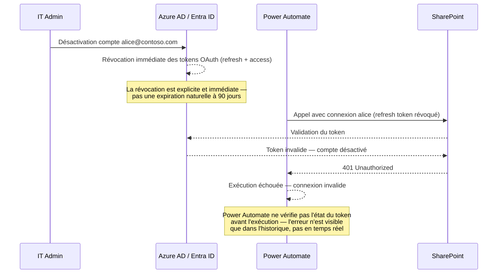
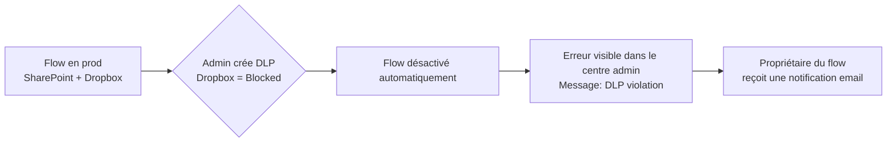

# Sécurité et propriété des flows

## Objectifs pédagogiques

À l'issue de ce module, vous serez capable de :

1. **Identifier** les risques liés à la propriété d'un flow et à ses connexions imbriquées
2. **Configurer** le partage d'un flow en distinguant co-propriétaire, exécutant seul et compte de service
3. **Analyser** l'impact d'une politique DLP sur un flow existant avant de la publier
4. **Choisir** le bon modèle de propriété selon le contexte (taille d'équipe, criticité, budget, turn-over)
5. **Détecter** les erreurs de configuration fréquentes qui exposent des données ou compromettent la continuité de service

---

## Mise en situation

Un développeur Power Automate quitte l'entreprise. Son manager IT désactive son compte M365. Le lendemain matin, vingt alertes s'accumulent dans le centre d'administration : des flows critiques — synchronisation CRM, envoi de rappels clients, archivage de contrats — sont en erreur 401. La raison : toutes les connexions SharePoint, Outlook et SQL étaient enregistrées **sous le compte personnel du développeur**. En désactivant le compte, l'entreprise a silencieusement coupé ces connexions.

Ce scénario se reproduit plusieurs fois par an dans les organisations qui déploient Power Automate sans gouvernance. Ce n'est pas une attaque externe — c'est une mauvaise gestion de la propriété et des connexions qui produit le même effet qu'une panne de service.

Ce module couvre exactement ce sujet : comment un flow "appartient" techniquement à quelqu'un, ce que ça implique en termes de sécurité et de continuité, et comment le configurer correctement dès le départ.

---

## Comment un flow "appartient" techniquement

### Le propriétaire n'est pas juste un nom dans une interface

Dans Power Automate, chaque flow a un **propriétaire** (owner). Ce propriétaire n'est pas une métadonnée cosmétique : c'est l'identité sous laquelle les **connexions** du flow sont créées et exécutées.

Quand un flow se déclenche et appelle SharePoint ou Outlook, il n'agit pas "en tant que flow". Il utilise une connexion OAuth stockée au nom d'un utilisateur spécifique. Cette connexion contient un **refresh token** lié à ce compte — un jeton de longue durée (typiquement 90 jours glissants) qui permet de renouveler l'accès sans nouvelle authentification interactive. Si le compte est désactivé ou si le token est révoqué, le flow échoue.

```
Flow "Archivage contrats"
│
├── Connexion SharePoint → compte: alice@contoso.com
├── Connexion Outlook   → compte: alice@contoso.com
└── Connexion SQL       → compte: alice@contoso.com (SQL auth)
```

Si Alice quitte l'entreprise et que son compte est désactivé, les trois connexions deviennent invalides simultanément.

### Ce qui se passe réellement lors du départ d'un utilisateur

La désactivation d'un compte Azure AD déclenche une révocation des tokens OAuth qui lui sont associés. Il ne s'agit pas d'une expiration naturelle : c'est une invalidation explicite et immédiate. Contrairement à une expiration normale (où le token survit jusqu'à 90 jours), la révocation est quasi-instantanée côté Azure AD — mais Power Automate ne sait pas que le token est invalide avant d'essayer de l'utiliser.



Ce mécanisme a une implication pratique importante : **il est impossible de vérifier proactivement si une connexion est valide** sans tenter une exécution. Power Automate ne détecte pas la révocation — il découvre l'invalidité au moment de l'appel. D'où l'importance de la surveillance et des alertes d'échec.

⚠️ **Point souvent mal compris** — La désactivation d'un compte ne désactive pas les flows. Ils restent actifs, continuent de se déclencher selon leur planification, et échouent en silence jusqu'à ce que quelqu'un consulte les logs.

---

## Surface d'exposition d'un flow

Avant de configurer quoi que ce soit, il faut cartographier ce qu'un flow expose réellement.

| Vecteur | Exposition | Impact potentiel |
|---|---|---|
| Connexions personnelles | Credentials liés à un compte utilisateur | Perte de service au départ du propriétaire |
| Partage "co-propriétaire" | L'invité peut modifier et exécuter le flow | Exfiltration de données, modification de logique |
| Partage "exécutant seul" | L'invité peut déclencher mais pas modifier | Risque de déclenchement non autorisé si le trigger est manuel |
| Webhook entrant | URL publique non authentifiée | N'importe qui connaissant l'URL peut déclencher le flow |
| Variables de configuration codées en dur | Credentials, tokens dans les actions | Exposition si le flow est partagé ou exporté |
| DLP non configurée | Connecteurs sensibles accessibles | Exfiltration possible vers des services non approuvés |

---

## Propriété, co-propriété et partage : les trois cas à comprendre

### Cas 1 — Le flow appartient à un utilisateur individuel

C'est le cas par défaut. L'utilisateur crée le flow, toutes les connexions sont sous son nom. Aucun autre utilisateur n'a accès, sauf partage explicite.

**Risque principal :** dépendance critique à un compte individuel.

### Cas 2 — Co-propriétaire (co-owner)

Un co-propriétaire peut :
- Modifier le flow
- Ajouter ou supprimer des connexions
- Supprimer le flow
- Voir l'historique complet d'exécution, y compris les données traitées

🔴 **Vecteur d'attaque** — Un co-propriétaire malveillant ou compromis peut modifier un flow pour exfiltrer les données vers un connecteur externe (HTTP, OneDrive personnel, email externe). L'audit trail dans le centre d'administration enregistre les modifications, mais l'alerte n'est pas temps réel par défaut.

### Cas 3 — Exécutant seul (run-only user)

L'utilisateur peut déclencher le flow (via bouton ou Power Apps) mais ne peut pas le modifier ni voir les données traitées dans les étapes intermédiaires. Les connexions restent celles du propriétaire — l'exécutant n'a pas besoin de ses propres connexions SharePoint ou SQL.

🔒 **Contrôle de sécurité** — Pour un flow de bouton déclenché par des collaborateurs terrain, privilégier le mode "run-only". Ils exécutent sans voir la logique interne ni les données des autres exécutions.

### Configurer le partage — chemin dans l'interface

```
Power Automate → Mes flows → [sélectionner le flow]
→ Partager (icône en haut à droite)
→ "Inviter des personnes" → choisir le rôle
   ├── Co-propriétaire : peut modifier
   └── Exécutant seul  : peut déclencher uniquement
```

Pour les flows de bouton, l'écran de partage propose une section supplémentaire **"Connexions utilisées"** qui permet de choisir si l'exécutant utilise les connexions du propriétaire ou fournit les siennes.

---

## Le problème des connexions imbriquées

### Ce que "connexion" signifie concrètement

Une connexion Power Automate est un objet OAuth stocké dans l'environnement Power Platform. Elle contient :
- Le type de connecteur (SharePoint, Outlook, SQL…)
- L'identité du compte authentifié
- Un refresh token (durée de vie de 90 jours glissants dans la majorité des configurations M365)

Un flow peut utiliser plusieurs connexions simultanément. Chaque connexion appartient à la personne qui l'a créée — pas au flow.

Une précision importante sur la **distinction entre "connexion créée par X" et "connexion utilisée par le flow"** : quand Alice crée une connexion SharePoint dans le cadre d'un flow qu'elle partage avec Bob, Bob peut utiliser cette connexion dans ce flow précis. Mais il ne peut pas voir les credentials, ne peut pas réutiliser la connexion dans un autre flow, et n'a aucun moyen de savoir si le token est encore valide. La connexion est liée au compte d'Alice — pas à la collaboration entre Alice et Bob.

### Connexions de service vs connexions personnelles

Pour les flows de production, l'approche recommandée est d'utiliser un **compte de service** (service account) dédié, pas un compte utilisateur nominal.

| Caractéristique | Compte utilisateur | Compte de service |
|---|---|---|
| Impact départ employé | Connexion coupée | Aucun impact |
| Licences nécessaires | Licence M365 utilisateur | Licence M365 dédiée ou Power Automate per-flow |
| Visibilité dans les logs | Actions tracées sous le nom nominatif | Actions tracées sous le nom du service account |
| Risque MFA / Conditional Access | MFA personnel ou CA peut invalider le refresh token | MFA et CA gérés séparément, adaptés au compte de service |

⚠️ **Erreur fréquente** — Utiliser son propre compte pour créer des connexions sur des flows partagés en production. Si vous changez votre mot de passe ou si une politique de Conditional Access modifie les conditions d'accès, le refresh token peut être invalidé et le flow tombe.

---

## Raisonnement décisionnel — Quel modèle de propriété choisir

Il n'existe pas de réponse universelle. Le bon modèle dépend du contexte. Voici une matrice de décision pragmatique :

| Contexte | Modèle recommandé | Pourquoi |
|---|---|---|
| Flow personnel, usage individuel | Propriétaire individuel | Pas de risque opérationnel partagé, coût minimal |
| Flow d'équipe, faible criticité, équipe stable | Co-propriétaire entre 2–3 membres | Simple à gérer, risque de turn-over faible |
| Flow de production, criticité élevée | Compte de service dédié | Continuité garantie, traçabilité claire |
| Flow déclenché par des utilisateurs non-techniques | Run-only users + propriétaire ou service account | Séparation stricte exécution/maintenance |
| Équipe avec fort turn-over ou contractors | Compte de service obligatoire | Turn-over fréquent = risque élevé sur connexions nominatives |

### Le coût réel du compte de service

Un compte de service n'est pas gratuit. Il nécessite une licence M365 (pour accéder à SharePoint, Outlook, Teams) ou une licence Power Automate per-flow si le flow est le seul usage. À mettre en balance avec le coût d'une interruption.

**Exemple concret :** un flow d'onboarding RH qui tombe un lundi matin mobilise typiquement 2 à 4 heures d'intervention IT (diagnostic, transfert de propriété, recréation des connexions, tests), plus le retard sur les accès des nouveaux arrivants. À 80 €/h chargé en IT, c'est 160 à 320 € d'incident — sans compter l'impact métier. Une licence M365 Business Basic coûte environ 6 €/mois. Le calcul est rapide.

**Alternatives si le budget est contraint :**
- Co-propriétaire entre deux membres IT stables (acceptable pour des flows non critiques)
- Documenter systématiquement les connexions et planifier le transfert en amont des départs connus
- Utiliser des flows de solution avec environment variables pour faciliter la migration des connexions

---

## Politiques DLP — ce qu'elles font concrètement à vos flows

### Mécanisme de la DLP dans Power Platform

Une politique DLP (Data Loss Prevention) classe les connecteurs en trois buckets :

- **Business** — connecteurs approuvés pour les données d'entreprise
- **Non-Business** — connecteurs approuvés mais isolés (ne peuvent pas coexister dans le même flow avec des connecteurs Business)
- **Blocked** — connecteurs entièrement bloqués dans l'environnement

La règle fondamentale de la DLP est la **séparation des flux de données** : un connecteur classé "Business" et un connecteur classé "Non-Business" ne peuvent pas exister dans le même flow. C'est le mécanisme qui empêche qu'un flow lise des données SharePoint (Business) et les envoie vers un service tiers non approuvé (Non-Business).

### Ce qui arrive à un flow existant quand une DLP change

C'est le point que beaucoup de formateurs ne mentionnent pas : **une politique DLP peut désactiver rétroactivement un flow déjà en production**.



Le flow ne plante pas en cours d'exécution — il est désactivé avant de pouvoir s'exécuter. L'erreur est lisible dans **Admin Center → Environments → [env] → Resources → Flows**.

### Comment vérifier l'impact d'une DLP avant de la déployer

Chemin : `Power Platform Admin Center → Policies → Data policies → [politique] → Edit → Impact analysis`

L'outil "impact analysis" liste tous les flows et Power Apps de l'environnement qui seraient affectés par la politique avant qu'elle soit publiée. À utiliser systématiquement avant tout changement de DLP en production.

### DLP stricte vs DLP permissive — les trade-offs réels

Choisir le niveau de rigueur d'une DLP est un arbitrage opérationnel, pas une décision purement technique.

| Critère | DLP stricte | DLP permissive |
|---|---|---|
| Sécurité des données | Élevée — cloisonnement fort | Faible — risques d'exfiltration non contrôlée |
| Agilité des makers | Faible — chaque nouveau connecteur nécessite une validation admin | Élevée — les makers créent librement |
| Charge admin | Élevée — gestion des exceptions fréquente | Faible — peu d'incidents à traiter |
| Risque de shadow IT | Faible | Élevé — les makers contournent via HTTP ou outils externes |
| Contexte adapté | Secteurs réglementés, données sensibles, grands tenants | Environnements de développement, équipes techniques matures |

**Recommandation pragmatique :** appliquer une DLP stricte sur les environnements de production et Default, et une DLP plus permissive sur les environnements de développement sandbox dédiés aux makers. Cette séparation permet l'agilité sans exposer la production.

🔒 **Contrôle de sécurité** — Avant de modifier une DLP existante, exporter la liste des flows impactés, notifier les propriétaires, et prévoir une fenêtre de migration. Une DLP appliquée sans analyse préalable peut désactiver des flows de production sans préavis.

---

## Hardening — configurations concrètes à appliquer

### 1. Transférer la propriété d'un flow avant un départ

```
Power Automate Admin Center
→ Environments → [env] → Resources → Cloud flows
→ Sélectionner le flow → "Assign new owner"
→ Saisir le nouveau propriétaire
```

⚠️ Transférer la propriété ne transfère pas les connexions. Le nouveau propriétaire devra recréer les connexions sous son propre compte (ou sous le compte de service). Faire ce transfert **avant** la désactivation du compte source — après, le flow est déjà en erreur.

### 2. Activer les alertes sur les flows partagés

```
Power Automate → Mes flows → [flow]
→ Gérer → Notifications
→ Activer "Envoyer un email quand ce flow échoue"
```

Ce n'est pas suffisant pour la sécurité, mais c'est le minimum pour détecter une défaillance liée à une connexion révoquée. Pour une alerte plus robuste, configurer également une surveillance via Power Platform Admin Center ou via un flow de monitoring dédié qui interroge l'API d'historique d'exécution.

Pour configurer une alerte d'échec via PowerShell (utile pour automatiser la configuration sur un parc de flows) :

```powershell
# Activer les notifications d'échec sur un flow spécifique
Set-AdminFlowOwnerRole -EnvironmentName <ENV_NAME> `
  -FlowName <FLOW_GUID> `
  -RoleName "Owner" `
  -PrincipalType "User" `
  -PrincipalObjectId <USER_OBJECT_ID>
```

La notification d'échec par email s'active dans l'interface pour chaque flow individuellement. Pour un parc important, préférer un flow de monitoring centralisé qui interroge l'historique via l'action "Get flow run history" et alerte sur les runs en erreur récurrents.

### 3. Auditer les connexions utilisées par un flow

Il n'y a pas d'interface directe pour voir toutes les connexions d'un environnement avec leur compte propriétaire. La méthode la plus rapide en prod est via PowerShell :

```powershell
# Connexion à l'environnement Power Platform
Connect-PowerPlatformAdminCenter

# Lister les connexions d'un environnement et filtrer par propriétaire
Get-AdminPowerAppConnection -EnvironmentName <ENV_NAME> | 
  Where-Object { $_.CreatedBy.userPrincipalName -eq '<USER_EMAIL>' } |
  Select-Object DisplayName, ConnectorName, CreatedBy | 
  Format-Table -AutoSize
```

Le filtre sur `CreatedBy` est l'usage le plus courant : identifier toutes les connexions appartenant à un utilisateur sur le départ, avant de désactiver son compte.

### 4. Restreindre le partage des flows dans un environnement

```
Power Platform Admin Center
→ Environments → [env] → Settings → Features
→ "Limit sharing" → Activer
→ Configurer : partage autorisé uniquement vers des groupes de sécurité définis
```

Cette option empêche un utilisateur de partager un flow avec n'importe qui dans le tenant — le partage est restreint aux groupes de sécurité autorisés par l'admin.

---

## Contrôles de détection

### Logs à surveiller

Les événements Power Automate sont enregistrés dans **Microsoft Purview Compliance Portal** sous les activités Power Automate.

Événements critiques à surveiller :

| Événement | Signification |
|---|---|
| `FlowCreated` | Nouveau flow créé — vérifier le connecteur utilisé |
| `FlowModified` | Modification d'un flow existant — qui a modifié et quoi |
| `FlowPermissionsGranted` | Nouveau co-propriétaire ajouté |
| `FlowConnectionCreated` | Nouvelle connexion créée — sous quel compte |
| `FlowSuspended` | Flow désactivé (souvent par violation DLP) |

### Chemin d'accès aux logs

```
Microsoft Purview → Audit → Nouvelle recherche
→ Activités : filtrer sur "Power Automate activities"
→ Plage de dates → Utilisateurs concernés → Rechercher
```

💡 **Astuce** — Pour un audit de gouvernance trimestriel, exporter les logs `FlowPermissionsGranted` sur les 90 derniers jours. Tout co-propriétaire ajouté qui n'est plus dans l'équipe est un accès résiduel à révoquer.

**Limite importante de Purview pour ce cas d'usage :** la recherche d'audit est ponctuelle — vous interrogez le passé, vous ne surveillez pas le présent. Pour une détection continue des modifications non autorisées, il faut compléter avec une solution de monitoring active : soit un flow planifié qui interroge l'API d'audit, soit une intégration avec Microsoft Sentinel si l'organisation dispose de la capacité.

---

## Erreurs fréquentes

### Erreur 1 — Créer les connexions de production avec son compte perso

**Configuration dangereuse :** Flow de production avec connexions SharePoint et SQL sous `developer.john@contoso.com`  
**Conséquence :** Départ, changement de mot de passe, réinitialisation MFA, ou politique de Conditional Access modifiée → refresh token invalidé → 401 sur tous les appels → flow en erreur  
**Correction :** Créer un compte de service `svc-flows@contoso.com`, lui attribuer les licences et permissions nécessaires, recréer les connexions sous ce compte

### Erreur 2 — Partager un flow en co-propriétaire par défaut pour "éviter les complications"

**Configuration dangereuse :** Donner le rôle co-propriétaire à tous les membres de l'équipe pour qu'ils puissent déclencher le flow  
**Conséquence :** Chaque co-propriétaire peut voir les données traitées dans l'historique, modifier la logique, et même supprimer le flow  
**Correction :** Utiliser le rôle "run-only" pour les déclencheurs manuels ; réserver co-propriétaire aux développeurs qui maintiennent le flow

### Erreur 3 — Ne jamais vérifier l'impact d'une DLP avant de la publier

**Configuration dangereuse :** Appliquer une nouvelle politique DLP directement en production sans analyse préalable  
**Conséquence :** Des flows de production sont désactivés immédiatement, sans notification des propriétaires si les alertes ne sont pas configurées  
**Correction :** Utiliser l'outil "impact analysis" du portail admin avant toute modification, notifier les propriétaires concernés, prévoir une fenêtre de migration

### Erreur 4 — Stocker des credentials en dur dans les actions d'un flow

**Configuration dangereuse :** Action HTTP avec un header `Authorization: Bearer eyJhbG...` codé en dur dans le champ de l'action  
**Conséquence :** Le token est visible par tout co-propriétaire du flow et apparaît en clair dans l'export JSON du flow (fichier .zip téléchargeable)  
**Correction :** Utiliser une connexion nommée ou une variable d'environnement (dans les flows de solution) — ne jamais saisir un token ou un mot de passe directement dans une action

---

## Cas réel en entreprise

### Contexte

Une PME de 200 personnes utilise Power Automate depuis deux ans. Aucune politique de gouvernance formalisée. Les flows ont été créés par les utilisateurs métier eux-mêmes.

### Incident

Le responsable RH qui avait créé un flow d'onboarding (création compte, envoi email, notification Teams) quitte l'entreprise. Son compte est désactivé un vendredi soir. Le lundi suivant, cinq nouveaux arrivants ne reçoivent pas leurs accès — le flow a échoué en silence pendant tout le week-end.

### Analyse post-incident

- 14 flows critiques dépendaient de connexions appartenant à cet utilisateur
- Aucun compte de service n'existait
- Aucune alerte d'échec n'était configurée
- Le centre d'administration n'avait jamais été consulté

**Coût estimé de l'incident :**
- 3 heures d'intervention IT à 80 €/h chargé = 240 €
- 5 nouveaux arrivants bloqués 1 journée chacun = perte de productivité de 5 × 350 € = 1 750 € (estimation conservative)
- Total incident : environ 2 000 € pour une PME de 200 personnes

**Ce qu'aurait coûté la prévention :**
- Un compte de service M365 Business Basic : 6 €/mois
- 2 heures de configuration initiale (connexions + alertes) : 160 €

L'écart entre prévention et correction parle de lui-même.

### Décisions alternatives analysées rétrospectivement

L'équipe IT a évalué trois options lors du post-incident :

| Option | Coût | Complexité | Continuité |
|---|---|---|---|
| Compte de service dédié (`svc-automate-rh@`) | 6 €/mois + licence | Faible | Garantie |
| Co-propriété entre 2 membres IT stables | 0 € | Faible | Bonne si turn-over faible |
| Connection references + environment variables | 0 € de licence | Moyenne | Bonne, mais migration manuelle à chaque départ |

L'organisation a choisi le compte de service pour les flows critiques, et la co-propriété IT pour les flows secondaires.

### Actions mises en place

1. Création de deux comptes de service (`svc-automate-hr@` et `svc-automate-ops@`)
2. Migration des connexions des flows critiques vers ces comptes
3. Activation des alertes d'échec sur tous les flows de production
4. Audit trimestriel des connexions via PowerShell planifié dans le calendrier IT

**Leçon principale :** La sécurité des flows n'est pas un sujet de développement — c'est un sujet d'opérations IT. Le problème n'était pas technique, il était organisationnel.

---

## Résumé

Un flow Power Automate n'est pas une entité autonome : il s'exécute sous l'identité des connexions de son propriétaire. Ces connexions reposent sur des refresh tokens OAuth dont la durée de vie est de 90 jours glissants — mais qui sont révoqués immédiatement et explicitement si le compte associé est désactivé. Power Automate ne détecte cette invalidation qu'au moment de l'exécution, pas avant : sans alerte configurée, les erreurs s'accumulent en silence.

Le premier contrôle à mettre en place est le choix délibéré du modèle de propriété — individuel, co-propriétaire ou compte de service — selon la criticité du flow, la taille de l'équipe et le turn-over prévisible. Le compte de service représente un coût marginal (environ 6 €/mois) face au coût réel d'un incident de gouvernance.

Le partage de flows expose deux niveaux de risque distincts : co-propriétaire donne un accès complet à la logique et aux données historiques, run-only limite à l'exécution. Utiliser le bon rôle dès le départ évite de corriger après un incident. Les politiques DLP, quant à elles, sont le mécanisme de gouvernance centralisé — elles peuvent désactiver rétroactivement des flows existants, et leur rigueur doit être calibrée : stricte en production, plus permissive en développement.

L'audit des logs Power Automate dans Purview permet de détecter les modifications non autorisées et les accès résiduels, mais uniquement de manière ponctuelle — pour une surveillance continue, il faut compléter avec un flow de monitoring ou une intégration SIEM.

---

<!-- snippet
id: paauto_ownership_connexions
type: concept
tech: Power Automate
level: beginner
importance: high
format: knowledge
tags: flows, connexions, propriété, compte-service, gouvernance
title: Connexions d'un flow — liées au compte du propriétaire
content: Un flow n'a pas d'identité propre. Chaque action qui appelle SharePoint, Outlook ou SQL utilise un token OAuth stocké sous le compte de l'utilisateur qui a créé la connexion. Ce refresh token a une durée de vie de 90 jours glissants — mais est révoqué immédiatement si le compte est désactivé. Power Automate ne détecte l'invalidation qu'au moment de l'exécution : le flow échoue avec 401 sans alerte proactive. Solution en prod : créer les connexions sous un compte de service dédié, pas un compte nominatif.
description: La désactivation d'un compte révoque immédiatement les refresh tokens — les flows dépendants échouent sans alerte proactive.
-->

<!-- snippet
id: paauto_role_coproprio_runonly
type: concept
tech: Power Automate
level: beginner
importance: high
format: knowledge
tags: partage, co-propriétaire, run-only, permissions, sécurité
title: Co-propriétaire vs Run-only — différence critique
content: Co-propriétaire peut modifier la logique du flow, voir l'historique complet des exécutions (données incluses), et supprimer le flow. Run-only peut uniquement déclencher — il ne voit pas les données traitées ni la structure interne. Distinction supplémentaire : la "connexion créée par X" et la "connexion utilisée par le flow" sont deux choses différentes — un co-propriétaire peut utiliser la connexion d'Alice dans ce flow
