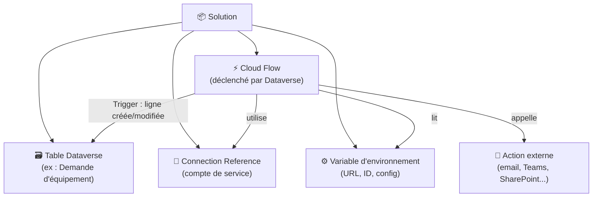

# Dataverse et flows de solution

## Objectifs pédagogiques

À l'issue de ce module, vous serez capable de :

- Distinguer un flow "de solution" d'un flow standard et expliquer pourquoi cette distinction compte en entreprise
- Créer et configurer un flow dans une solution Dataverse existante
- Utiliser les triggers et actions Dataverse natifs (Create, Update, Delete, Relate/Unrelate)
- Appliquer les bonnes pratiques de référencement des connexions pour qu'un flow survive à un déploiement inter-environnements
- Exporter et importer une solution contenant des flows sans casser les dépendances

---

## Mise en situation

Une équipe IT d'une taille intermédiaire (50 collaborateurs, 3 développeurs Power Platform) a construit une application de gestion des demandes d'équipement informatique. L'app Canvas lit et écrit dans Dataverse. Plusieurs flows ont été créés à la main directement depuis Power Automate — notifications par mail, mise à jour de statut, archivage automatique.

Six mois plus tard, quelqu'un doit déployer la solution sur l'environnement de production. Problème : les flows ne sont pas dans la solution. Ils existent dans l'environnement de développement, appartiennent à leur créateur, et n'ont aucune connexion formelle avec l'app. Certains utilisent des connexions personnelles. D'autres ont été dupliqués à la main dans le mauvais environnement. Résultat : trois jours de travail perdu, des flows qui échouent silencieusement en production, et une équipe qui comprend trop tard que "ça marche chez moi" n'est pas une stratégie ALM.

Ce module répond exactement à ce problème.

---

## Contexte et problématique

### Pourquoi les flows "hors solution" posent problème

Par défaut, quand vous créez un flow depuis Power Automate (make.powerautomate.com → "Créer"), il atterrit dans l'environnement courant mais en dehors de toute solution. C'est pratique pour tester, mais c'est une impasse pour tout ce qui ressemble à un projet réel.

Un flow hors solution :
- **n'est pas transportable** — vous ne pouvez pas l'exporter avec une solution
- **appartient à un utilisateur** — s'il quitte l'entreprise, le flow s'arrête (ce point était couvert dans le module précédent, on ne le répète pas)
- **ne peut pas être mis à jour via un pipeline ALM** — pas de déploiement automatisé possible

Un flow **dans une solution**, en revanche, fait partie d'un artefact versionnable. Il voyage avec la solution, peut être déployé via des pipelines, et ses dépendances (connexions, variables d'environnement, tables Dataverse) sont déclarées explicitement.

🧠 **Concept clé** — Une solution Dataverse est un conteneur de composants (tables, colonnes, flows, apps, pages web...). Elle ne stocke pas les données — elle décrit la structure et les automatisations. C'est l'unité de déploiement de la Power Platform.

---

## Architecture — Comment un flow de solution s'articule avec Dataverse

Avant de créer quoi que ce soit, il faut visualiser comment les pièces s'assemblent.



| Composant | Rôle dans la solution | Ce qui se passe sans lui |
|---|---|---|
| **Table Dataverse** | Source des événements (trigger) | Pas de déclencheur natif possible |
| **Cloud Flow** | Logique automatisée | L'automatisation n'existe pas |
| **Connection Reference** | Abstraction de la connexion réelle | Le flow casse au déploiement |
| **Variable d'environnement** | Config qui change entre envs | URLs et IDs hardcodés → erreurs en prod |

La **Connection Reference** mérite une attention particulière. C'est l'élément que la plupart des débutants oublient, et c'est lui qui provoque 80 % des erreurs post-déploiement.

---

## Fonctionnement des Connection References

Imaginez que vous avez un flow qui envoie un mail via Office 365. En développement, ce flow utilise votre connexion personnelle `prenom.nom@entreprise.com`. Si vous exportez la solution et l'importez dans un autre environnement, cette connexion personnelle n'existe pas là-bas. Le flow s'importe… et échoue immédiatement à l'activation.

Une **Connection Reference** résout ça en ajoutant une couche d'indirection :

- Dans la solution, le flow ne pointe plus vers une connexion directe, mais vers une Connection Reference nommée (ex : `cr_office365_serviceaccount`)
- Lors de l'import dans un nouvel environnement, l'administrateur mappe cette référence vers une connexion réelle existante dans cet environnement

```
Dev       : Connection Reference "cr_teams" → connexion de alice@dev.entreprise.com
Prod      : Connection Reference "cr_teams" → connexion du compte de service teams-bot@entreprise.com
```

Le flow est identique. Seul le mapping change à l'import.

⚠️ **Erreur fréquente** — Si vous créez un flow dans une solution mais que vous ajoutez un connecteur en utilisant une connexion directe (pas via une Connection Reference), Power Platform crée parfois une référence implicite qui n'est pas visible dans la solution. À l'import, vous vous retrouvez avec un flow qui demande une reconnexion manuelle. Vérifiez toujours que vos Connection References apparaissent bien dans les composants de la solution.

---

## Construction progressive — Du flow basique au flow production-ready

### Étape 1 — Créer un flow dans une solution (et pas ailleurs)

La règle est simple : **commencez toujours par la solution, pas par Power Automate**.

**Chemin UI :**
```
make.powerapps.com → Solutions → [votre solution] → Nouveau → Automatisation → Cloud Flow
```

Créer un flow depuis Power Automate directement (`make.powerautomate.com → Créer`) produit un flow hors solution. Ce n'est pas un bug — c'est le comportement par défaut, conçu pour l'usage personnel.

💡 **Astuce** — Si un flow existant est déjà hors solution et que vous voulez le récupérer, il est possible de l'ajouter à une solution via `Solutions → [solution] → Ajouter existant → Automatisation → Cloud Flow`. Mais attention : cette opération ne déplace pas le flow, elle crée une référence. Le flow continue d'exister en dehors. Pour un projet sérieux, il vaut mieux recréer le flow directement dans la solution.

---

### Étape 2 — Choisir le bon trigger Dataverse

Le connecteur Dataverse (et non "Common Data Service (current environment)" — l'ancien nom) propose plusieurs triggers. Voici les trois qu'on utilise vraiment en production :

| Trigger | Se déclenche quand | Cas d'usage typique |
|---|---|---|
| **When a row is added, modified or deleted** | Une ligne est créée, modifiée ou supprimée | Notification, audit, propagation de données |
| **When an action is performed** | Une action personnalisée Dataverse est appelée | Processus métier explicite (validation, escalade) |
| **When a row is selected** | Déclenché manuellement depuis une app | Bouton dans une Canvas App ou Model-Driven |

Le trigger **"When a row is added, modified or deleted"** est de loin le plus utilisé. Ses paramètres importants :

- **Table name** : la table Dataverse concernée
- **Change type** : Added / Modified / Deleted / Added or Modified
- **Scope** : Organization (toutes les lignes) ou Business Unit ou User (lignes de l'utilisateur courant)
- **Select columns** : filtrer pour ne déclencher que si certaines colonnes changent — essentiel pour éviter les boucles infinies

🧠 **Concept clé** — Le paramètre "Select columns" sur le trigger Modified est un garde-fou critique. Si votre flow modifie la même ligne qui l'a déclenché (par exemple pour mettre à jour un champ de statut), sans filtre vous créez une boucle infinie. En spécifiant uniquement les colonnes qui doivent déclencher le flow, vous brisez ce cycle.

---

### Étape 3 — Utiliser les actions Dataverse

Le connecteur Dataverse propose un ensemble d'actions cohérentes pour lire, écrire et relier des données :

| Action | Ce qu'elle fait | Remarque |
|---|---|---|
| **Add a new row** | Crée une ligne dans une table | Équivalent d'un INSERT |
| **Update a row** | Met à jour une ligne existante | Nécessite le Row ID |
| **Get a row by ID** | Récupère une ligne par son identifiant unique | Préférer ça à une liste filtrée quand l'ID est connu |
| **List rows** | Requête filtrée sur une table | Supporte OData ($filter, $orderby, $top) |
| **Delete a row** | Supprime une ligne | Irréversible — préférer un soft delete en prod |
| **Relate rows** | Crée une relation N:N entre deux lignes | Pour les tables avec junction |
| **Unrelate rows** | Supprime une relation N:N | Inverse de Relate |

Pour **List rows**, la syntaxe OData peut surprendre au début. Quelques exemples concrets :

```
// Filtre sur une colonne texte
Filter rows : cr123_statut eq 'En attente'

// Filtre sur une date
Filter rows : createdon ge 2024-01-01T00:00:00Z

// Filtre sur une relation (lookup)
Filter rows : _cr123_demandeur_value eq '<GUID_UTILISATEUR>'

// Combiner des filtres
Filter rows : cr123_statut eq 'Approuvé' and cr123_montant gt 1000
```

💡 **Astuce** — Dans "List rows", le champ "Select columns" (équivalent d'un `$select` OData) est souvent ignoré mais crucial en performance. Si votre table a 40 colonnes et que vous n'en avez besoin que de 3, ne ramenez pas les 40. Sur des flows à fort volume, ça fait une différence mesurable sur le temps d'exécution et les limites d'API Dataverse.

---

### Étape 4 — Variables d'environnement pour la config cross-env

Une variable d'environnement dans une solution Dataverse, c'est une clé de configuration dont la valeur peut changer d'un environnement à l'autre, sans toucher au flow lui-même.

**Cas d'usage typiques :**
- URL d'un site SharePoint (différent entre dev et prod)
- Adresse email d'un groupe de notification
- ID d'un canal Teams
- Seuil numérique (ex : montant au-dessus duquel escalader)

**Chemin de création :**
```
Solutions → [solution] → Nouveau → Autre → Variable d'environnement
```

Types disponibles : Texte, Nombre, Oui/Non, JSON, Source de données (pour les connexions SharePoint/Dataverse).

Dans un flow, vous référencez la variable ainsi :

```
@parameters('cr123_UrlSharePoint')
```

⚠️ **Erreur fréquente** — Les variables d'environnement de type "Source de données" nécessitent une configuration supplémentaire à l'import. Si vous oubliez de renseigner leur valeur dans l'environnement cible, les actions qui les utilisent échouent avec un message d'erreur peu explicite sur la connexion.

---

## Exporter et importer une solution avec des flows

### Export

```
make.powerapps.com → Solutions → [solution] → Exporter
```

Deux modes :
- **Non managée** (unmanaged) : pour les environnements de développement — vous pouvez modifier les composants
- **Managée** (managed) : pour les environnements de test et production — les composants sont en lecture seule, la mise à jour se fait uniquement par un nouvel import

Pour la plupart des projets, la règle est : **non managée en dev, managée partout ailleurs**.

### Import

```
make.powerapps.com → Solutions → Importer → [choisir le fichier .zip]
```

À l'import d'une solution contenant des flows, Power Platform demande de mapper :
1. Les **Connection References** → vers des connexions existantes dans l'environnement cible
2. Les **Variables d'environnement** → leurs valeurs pour cet environnement

C'est l'étape où beaucoup se précipitent. Prendre le temps de vérifier chaque mapping évite 90 % des problèmes post-déploiement.

Après l'import, vérifiez que les flows sont bien **activés** — ils peuvent être importés en état désactivé si la solution exportée les avait désactivés.

```
Solutions → [solution] → Cloud Flows → vérifier l'état (On / Off)
```

---

## Cas réel en entreprise

**Contexte :** Une ESN de 200 personnes utilise Power Platform pour gérer ses demandes de congés. La solution contient une table Dataverse `cr_demande_conge`, une Canvas App pour les employés, et des flows pour notifier les managers et mettre à jour les statuts.

**Problème initial :** Les flows avaient été créés hors solution par le développeur initial. Chaque déploiement vers la prod était manuel : le développeur recréait les flows à la main, configurait les connexions, et espérait ne rien oublier. Le taux d'erreur post-déploiement était élevé.

**Ce qui a été fait :**

1. Migration des flows dans la solution (recréation propre, pas le "ajouter existant")
2. Création de Connection References pour le connecteur Dataverse et Office 365
3. Création de variables d'environnement pour les adresses email des groupes RH (différentes entre dev et prod)
4. Paramétrage correct du trigger "Modified" avec "Select columns" limité aux colonnes de statut pour éviter les boucles
5. Mise en place d'un export managé vers un repo Git via le CLI `pac` (en dehors du scope de ce module)

**Résultats :** Le premier déploiement structuré a pris 45 minutes au lieu de 3 heures. Les déploiements suivants, moins de 15 minutes. Zéro flow cassé en production depuis 4 mois.

---

## Bonnes pratiques

**1. Toujours créer les flows depuis la solution, jamais depuis Power Automate directement.**
La discipline est simple à tenir si elle est prise dès le début. La corriger après coup est coûteux.

**2. Nommer les Connection References de façon explicite et standardisée.**
`cr_[connecteur]_[usage]` — par exemple `cr_office365_notification` ou `cr_dataverse_serviceaccount`. Ça évite de se demander quelle référence mapper à l'import.

**3. Utiliser "Select columns" sur tous les triggers Modified et toutes les actions List rows.**
Sur le trigger, c'est un garde-fou contre les boucles. Sur List rows, c'est une optimisation de performance qui devient critique sur les tables volumineuses.

**4. Ne jamais hardcoder d'URLs, d'IDs ou d'adresses email dans les flows.**
Tout ce qui change entre dev et prod → variable d'environnement. Sans exception.

**5. Désactiver les flows avant d'exporter si vous ne voulez pas qu'ils s'activent automatiquement à l'import.**
Un flow importé en état "actif" se déclenche immédiatement si les conditions sont remplies — y compris sur des données de production que vous n'aviez pas anticipées.

**6. Tester le déploiement complet (export + import) en environnement de test avant la prod.**
L'environnement de test doit être aussi proche que possible de la prod — mêmes Connection References, mêmes variables d'environnement. Un déploiement qui fonctionne en dev mais échoue en test révèle toujours un problème de config qu'il vaut mieux découvrir à ce stade.

**7. Documenter les dépendances de chaque flow dans la solution.**
Power Platform propose un onglet "Dépendances" sur chaque composant de solution — prenez l'habitude de le consulter avant d'exporter. Si une dépendance n'est pas dans la solution, elle doit l'être ou être documentée comme prérequis.

---

## Résumé

Créer des flows directement dans Power Automate, hors de toute solution, c'est la voie rapide vers un projet impossible à maintenir. La discipline de travailler dans des solutions Dataverse n'est pas une contrainte bureaucratique — c'est ce qui rend un projet déployable, transférable et gouvernable.

Les pièces clés à maîtriser : créer le flow depuis la solution (pas depuis Power Automate), utiliser les triggers Dataverse natifs avec des filtres de colonnes précis, référencer les connexions via des Connection References, et externaliser toute configuration variable dans des variables d'environnement. L'export managé + le mapping à l'import sont les deux moments où tout peut mal tourner — prendre le temps de les traiter sérieusement évite la majorité des problèmes post-déploiement.

La suite logique de ce module abordera comment aller plus loin que les connecteurs natifs, en construisant vos propres connecteurs pour appeler des APIs externes.

---

<!-- snippet
id: dataverse_solution_flow_create
type: tip
tech: Power Automate
level: intermediate
importance: high
tags: solution, dataverse, alm, flow, creation
title: Créer un flow directement dans une solution
content: Toujours créer via make.powerapps.com → Solutions → [solution] → Nouveau → Automatisation → Cloud Flow. Un flow créé depuis make.powerautomate.com → Créer est hors solution et ne peut pas être déployé via ALM.
description: Les flows créés hors solution ne sont pas exportables avec la solution et cassent tout pipeline de déploiement.
-->

<!-- snippet
id: dataverse_connection_reference_concept
type: concept
tech: Power Automate
level: intermediate
importance: high
tags: connection-reference, solution, deploiement, dataverse, connecteur
title: Connection Reference — couche d'indirection pour les connexions
content: Une Connection Reference est un composant de solution qui pointe vers une connexion réelle (ex : Office 365). En dev, elle pointe vers le compte du développeur. En prod, elle pointe vers un compte de service. Le flow lui-même ne change pas — seul le mapping change à l'import. Sans ça, le flow casse dès qu'il est importé dans un autre environnement.
description: La Connection Reference abstrait la connexion réelle — le flow est identique dans tous les environnements, seul le mapping change à l'import.
-->

<!-- snippet
id: dataverse_trigger_select_columns
type: warning
tech: Power Automate
level: intermediate
importance: high
tags: trigger, dataverse, boucle-infinie, modified, performance
title: "Select columns" sur le trigger Modified — obligatoire si le flow modifie la même ligne
content: Piège : un flow déclenché sur "Modified" qui modifie lui-même la ligne source crée une boucle infinie. Conséquence : consommation de toutes les quotas d'API Dataverse en quelques minutes. Correction : renseigner "Select columns" sur le trigger avec uniquement les colonnes qui doivent déclencher le flow (ex : cr_statut), pas la colonne mise à jour par le flow.
description: Sans filtre "Select columns" sur un trigger Modified, tout flow qui modifie la ligne déclenchante boucle indéfiniment.
-->

<!-- snippet
id: dataverse_list_rows_select
type: tip
tech: Power Automate
level: intermediate
importance: medium
tags: list-rows, odata, performance, dataverse, select
title: Limiter les colonnes dans "List rows" avec Select columns
content: Dans l'action List rows, renseigner "Select columns" avec uniquement les colonnes nécessaires (ex : cr_id,cr_statut,cr_montant). Sur une table à 40 colonnes et 10 000 lignes, cela réduit significativement la taille des réponses et le risque d'atteindre les limites d'API Dataverse (threshold : 100 000 appels/24h par flow en plan standard).
description: "Select columns" dans List rows est un $select OData — réduit la charge réseau et les risques de throttling sur les tables volumineuses.
-->

<!-- snippet
id: dataverse_odata_filter_examples
type: tip
tech: Power Automate
level: intermediate
importance: medium
tags: odata, filter, list-rows, dataverse, syntaxe
title: Syntaxe OData pour filtrer dans List rows
content: "Exemples courants : texte → cr_statut eq 'Approuvé' | nombre → cr_montant gt 1000 | date → createdon ge 2024-01-01T00:00:00Z | lookup → _cr_demandeur_value eq 'guid-ici' | combiné → cr_statut eq 'Approuvé' and cr_montant gt 1000"
description: List rows utilise le standard OData pour les filtres — les colonnes lookup s'interrogent avec le préfixe _ et le suffixe _value.
-->

<!-- snippet
id: dataverse_env_variable_usage
type: concept
tech: Power Automate
level: intermediate
importance: high
tags: variable-environnement, solution, deploiement, configuration, dataverse
title: Variable d'environnement — config qui change entre environnements
content: Une variable d'environnement est un composant de solution dont la valeur est redéfinie à chaque import (ex : URL SharePoint en dev vs prod, email du groupe RH). Dans le flow, elle se référence via @parameters('nom_variable'). Si sa valeur n'est pas renseignée dans l'environnement cible à l'import, les actions qui l'utilisent échouent sans message d'erreur explicite.
description: Les variables d'environnement externalisent toute config qui change entre dev et prod — renseigner leur valeur à l'import est obligatoire.
-->

<!-- snippet
id: dataverse_solution_export_managed
type: concept
tech: Power Platform
level: intermediate
importance: medium
tags: solution, export, managed, alm, deploiement
title: Solution managée vs non managée — règle de déploiement
content: Une solution non managée (unmanaged) permet de modifier ses composants dans l'environnement cible — utilisée uniquement en dev. Une solution managée (managed) verrouille les composants en lecture seule — utilisée en test et prod. La mise à jour d'un environnement managé se fait uniquement via un nouvel import d'une version plus récente de la solution managée.
description: Règle ALM Power Platform : non managée en dev, managée en test et prod. Modifier des composants directement en prod n'est pas possible avec une solution managée.
-->

<!-- snippet
id: dataverse_flow_import_mapping
type: warning
tech: Power Platform
level: intermediate
importance: high
tags: import, deploiement, connection-reference, variable-environnement, solution
title: À l'import : mapper les Connection References et variables d'environnement
content: Piège : se précipiter sur "Importer" sans vérifier les mappings. Conséquence : flows importés mais inactifs ou en erreur, Connection References non résolues, variables d'environnement vides. Correction : à l'écran de mapping de l'import, vérifier que chaque Connection Reference pointe vers une connexion réelle dans l'environnement cible, et que chaque variable d'environnement a une valeur renseignée.
description: L'écran de mapping à l'import est l'étape critique du déploiement — une Connection Reference non mappée rend le flow immédiatement inopérant.
-->

<!-- snippet
id: dataverse_add_existing_flow_limitation
type: warning
tech: Power Platform
level: intermediate
importance: medium
tags: solution, migration, flow, hors-solution, bonne-pratique
title: "Ajouter existant" ne déplace pas un flow hors solution
content: Piège : croire qu'ajouter un flow hors solution via "Solutions → Ajouter existant → Cloud Flow" le déplace dans la solution. Conséquence : le flow reste techniquement hors solution, la référence dans la solution peut créer des incohérences à l'export. Correction : pour tout projet ALM sérieux, recréer le flow directement dans la solution plutôt que de récupérer un flow existant hors solution.
description: "Ajouter existant" crée une référence, pas un déplacement — pour un ALM fiable, recréer le flow dans la solution.
-->
