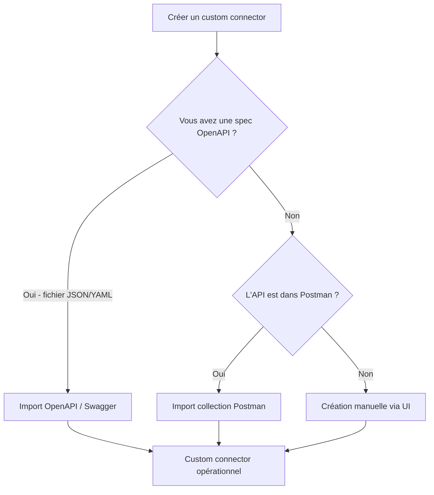

# HTTP, API REST et custom connector

## Objectifs pédagogiques

À l'issue de ce module, vous serez capable de :

1. Comprendre comment fonctionne une requête HTTP et ce que contient une réponse REST
2. Construire une action HTTP dans Power Automate pour appeler une API externe
3. Exploiter le corps JSON d'une réponse pour alimenter un flow
4. Créer un custom connector à partir d'une spécification OpenAPI ou manuellement
5. Sécuriser les appels avec les mécanismes d'authentification supportés (API Key, OAuth 2.0)
6. Décider quand l'action HTTP brute suffit et quand un custom connector s'impose

---

## Mise en situation

Votre entreprise utilise une plateforme RH tierce — disons **Factorial** ou **BambooHR** — qui ne dispose pas de connecteur natif dans Power Platform. Les managers doivent pourtant déclencher un flow d'approbation dans Teams dès qu'un nouvel employé est créé dans ce système.

La plateforme RH expose une API REST documentée. Vous avez une clé API. Le problème : comment Power Automate parle-t-il à une API qu'il ne connaît pas nativement ?

C'est exactement ce que ce module couvre. On part de zéro — une URL, une documentation API — et on arrive à un connecteur réutilisable dans tous les flows de l'organisation. En chemin, on verra aussi pourquoi ce choix n'est pas anodin : créer un custom connector représente un investissement, et il y a des situations où l'action HTTP brute est le bon outil.

---

## Contexte : pourquoi HTTP et les API REST ?

Les connecteurs natifs de Power Platform (SharePoint, Salesforce, ServiceNow...) sont pratiques, mais ils ne couvrent pas tout. Dès que vous intégrez un SaaS métier un peu spécifique, vous tombez sur une API REST et une documentation Swagger. C'est la réalité des projets réels.

Power Automate offre deux niveaux pour gérer ça :

- **L'action HTTP brute** — vous appelez directement une URL, vous gérez tout vous-même. Rapide à mettre en place, mais non réutilisable facilement.
- **Le custom connector** — vous encapsulez l'API dans un objet réutilisable, partageable, avec une interface propre dans le designer de flow. C'est l'approche professionnelle.

Les deux reposent sur les mêmes fondamentaux : HTTP et JSON. On commence par là.

---

## Ce que vous devez savoir sur HTTP et REST

### La structure d'une requête HTTP

Quand Power Automate appelle une API, il envoie un message structuré qui ressemble à ça :

```
POST https://api.monapp.com/v1/employees
Authorization: Bearer eyJhbGci...
Content-Type: application/json

{
  "firstName": "Alice",
  "lastName": "Martin",
  "department": "IT"
}
```

Ce message contient quatre éléments clés :

| Élément | Rôle | Exemple |
|---|---|---|
| **Méthode** | L'intention de l'appel | GET (lire), POST (créer), PUT/PATCH (modifier), DELETE |
| **URL** | L'adresse de la ressource | `https://api.exemple.com/v1/employees/42` |
| **Headers** | Métadonnées de la requête | `Authorization`, `Content-Type`, `Accept` |
| **Body** | Données envoyées (POST/PUT) | JSON, XML, form-data |

La réponse du serveur suit la même logique : un **code de statut** (200, 201, 400, 401, 404, 429, 500...), des headers, et un body JSON.

Le code de statut, c'est votre premier indicateur. 2xx = succès, 4xx = problème côté client (mauvaise requête, mauvais token, rate limit dépassé), 5xx = problème côté serveur. Power Automate peut agir différemment selon ce code — on abordera la gestion des erreurs dans le module suivant.

### REST : une convention, pas un protocole

REST n'est pas un protocole au sens strict. C'est un style architectural. Concrètement, une API REST vous dit :

- Les **ressources** sont des noms au pluriel dans l'URL (`/employees`, `/projects`, `/invoices`)
- Les **actions** sont exprimées par la méthode HTTP, pas par l'URL (`GET /employees/42` pour lire, pas `/getEmployee?id=42`)
- Les échanges sont **sans état** : chaque requête est indépendante, le token d'authentification est transporté à chaque appel

Comprendre REST, c'est comprendre que l'URL identifie une ressource, et la méthode HTTP exprime ce qu'on fait dessus. Cette logique guide tout le reste — y compris le fait qu'un token OAuth expiré vous renverra systématiquement un 401, peu importe l'endpoint appelé.

---

## Appeler une API avec l'action HTTP

Power Automate propose une action native appelée simplement **HTTP**. Elle est disponible dans les flows cloud, mais attention : elle nécessite une licence **Power Automate Premium** (ou un plan P1/P2). Ce n'est pas une action standard.

### Configuration de base

Dans votre flow, ajoutez l'action *HTTP* et remplissez :

- **Method** : GET, POST, PUT, PATCH, DELETE
- **URI** : l'URL complète de l'endpoint
- **Headers** : les en-têtes nécessaires (souvent `Content-Type: application/json`)
- **Body** : le JSON à envoyer (pour POST/PUT)
- **Authentication** : le mécanisme d'auth (voir plus bas)

Exemple concret — récupérer un employé par ID depuis une API fictive :

```
Method : GET
URI    : https://api.rh-system.com/v1/employees/@{triggerBody()?['employeeId']}
Headers:
  Authorization : Bearer @{variables('apiToken')}
  Accept        : application/json
```

### Parser la réponse JSON

L'action HTTP vous retourne un corps brut (une chaîne JSON). Pour utiliser les valeurs dans les étapes suivantes, ajoutez l'action **Parse JSON** immédiatement après.

Elle demande deux choses :
1. Le **Content** : `body('HTTP')` (le body de l'étape HTTP)
2. Le **Schema** : la description de la structure JSON attendue

Pour générer le schéma facilement, cliquez sur *"Generate from sample"* et collez un exemple de réponse réelle de votre API. Power Automate génère le schéma automatiquement.

```json
{
  "type": "object",
  "properties": {
    "id": { "type": "integer" },
    "firstName": { "type": "string" },
    "lastName": { "type": "string" },
    "email": { "type": "string" }
  }
}
```

Une fois parsé, les champs sont accessibles directement dans le dynamic content des étapes suivantes. Plus besoin d'expressions `body('HTTP')?['firstName']` — vous avez `firstName` directement.

⚠️ **Si la réponse peut retourner `null` sur certains champs**, le schéma généré automatiquement peut rater des cas. Ajoutez `"type": ["string", "null"]` pour les champs optionnels, sinon le Parse JSON échouera sur ces cas.

### Authentification dans l'action HTTP

L'action HTTP gère nativement plusieurs modes d'authentification, configurables dans le champ *Authentication* :

| Mode | Quand l'utiliser |
|---|---|
| **None** | API publique sans auth |
| **Basic** | Username + password (rare, à éviter si possible) |
| **API Key** | Clé dans un header ou un paramètre d'URL |
| **OAuth 2.0** | Token Bearer, flux Authorization Code ou Client Credentials |
| **Managed Identity** | Pour les APIs Azure sans exposer de secret |

Pour une API sécurisée par clé, le plus courant en pratique :

```
Authentication type : Raw
Value : Bearer @{variables('apiKey')}
```

Ou si l'API attend la clé dans un header custom :

```
Headers:
  X-API-Key : @{variables('apiKey')}
```

Ne hardcodez jamais un secret dans le flow. Stockez les clés API dans un **Azure Key Vault** et récupérez-les via le connecteur Key Vault, ou au minimum dans un environnement variable Power Platform de type *secret*. Un flow exporté ou visible dans un log exposera tout secret inscrit en clair.

---

## API Key vs OAuth 2.0 : choisir le bon mécanisme

Ce n'est pas une question de préférence — c'est une question de contexte. Comprendre la différence évite les erreurs de design.

**Une API Key** est un secret statique identifiant votre application (ou vous). Elle est simple à mettre en place, durable tant qu'elle n'est pas révoquée, et suffisante pour la majorité des intégrations service-to-service où un seul compte technique accède à l'API. Inconvénient : elle ne dit rien sur *qui* dans votre organisation effectue l'appel. Si plusieurs personnes partagent le même flow, tous les appels sont faits sous la même identité. En cas de fuite, vous révoquez une clé — et potentiellement coupez tous vos flows d'un coup.

**OAuth 2.0** est un mécanisme de délégation. L'utilisateur ou l'application obtient un token temporaire (généralement valable 1h), qui doit être renouvelé via un refresh token. C'est la norme quand :

- Le fournisseur exige que les appels soient tracés par utilisateur individuel (audit, conformité)
- L'API accède à des données personnelles liées à l'identité de l'appelant
- Le fournisseur impose OAuth dans sa documentation (Google, Microsoft Graph, Salesforce...)

Le piège pratique : un token OAuth expire. Si votre flow dure plus longtemps que la durée de vie du token (cas d'un traitement batch long), vous recevrez un 401 en plein milieu de l'exécution. Le custom connector gère ce renouvellement automatiquement via le refresh token — ce que l'action HTTP brute ne fait pas nativement.

**Règle de décision simple :**
- Intégration service-to-service, compte technique, fournisseur propose une clé → **API Key**
- Fournisseur impose OAuth, données liées à l'identité, audit requis, flows longs → **OAuth 2.0 via custom connector**

---

## Décision architecturale : HTTP brute ou custom connector ?

C'est la vraie question de ce module. Créer un custom connector prend du temps — entre 30 minutes et plusieurs heures selon la complexité de l'API. Cet investissement se justifie ou non selon le contexte.

| Critère | Action HTTP brute | Custom connector |
|---|---|---|
| Nombre d'endpoints utilisés | 1 à 2 | 3 ou plus |
| Réutilisation dans l'organisation | Flow unique | Plusieurs flows, plusieurs équipes |
| Profil des utilisateurs | Développeur autonome | Collègues non-techniques |
| Gouvernance des intégrations | Non critique | Environnement réglementé ou multi-équipe |
| Gestion OAuth (token refresh) | Manuelle | Automatique |
| Déploiement ALM | Copie manuelle | Inclus dans la solution |
| Coût de maintenance | Élevé si l'API change | Centralisé dans le connecteur |

La ligne de démarcation concrète : **si vous vous retrouvez à copier-coller la même action HTTP dans trois flows différents, c'est le signal pour créer un connecteur.** Pas avant.

Un autre indicateur : si quelqu'un d'autre que vous doit utiliser cette intégration, l'action HTTP brute avec ses URLs et ses headers JSON est une barrière. Le custom connector avec ses actions nommées ("Créer un employé", "Lister les projets") est une interface compréhensible.

---

## Le custom connector : transformer une API en connecteur réutilisable

Un custom connector, c'est un "wrapper" : vous décrivez une API une fois (ses endpoints, ses paramètres, son authentification), et Power Platform la présente comme un connecteur natif dans le designer. Vos utilisateurs voient des actions lisibles sans manipuler d'URL ni de JSON.

### Les trois façons de créer un custom connector



**L'import OpenAPI** est de loin le plus rapide. Si l'éditeur de l'API publie un fichier Swagger (souvent accessible sur `/swagger.json` ou `/openapi.yaml`), vous le téléchargez et vous l'importez directement dans Power Platform. La majeure partie de la configuration est déjà faite.

**La création manuelle** est nécessaire quand la documentation est en ligne mais qu'il n'y a pas de spec machine-readable. C'est plus laborieux mais totalement faisable.

### Création manuelle pas à pas

Accédez au custom connector depuis :
- **Power Automate** → Données → Custom connectors → Nouveau custom connector
- **Power Apps** → Données → Custom connectors

La création se fait en 5 onglets successifs :

#### 1. General

Définissez l'identité du connecteur :
- **Nom** : lisible pour les utilisateurs ("Système RH Factorial")
- **Host** : le domaine de base de l'API (`api.rh-system.com`)
- **Base URL** : le préfixe commun de tous les endpoints (`/v1`)
- Icône et couleur : ça paraît anecdotique, mais ça compte pour l'adoption

#### 2. Security

Choisissez le mécanisme d'authentification. C'est ici que vous définissez *comment le connecteur s'authentifiera*, pas les credentials eux-mêmes — ceux-ci sont renseignés lors de la création de la connexion par chaque utilisateur.

| Type | Ce qui se passe |
|---|---|
| **No authentication** | Appels anonymes |
| **API Key** | Vous définissez le nom du header ou du paramètre (`X-API-Key`) |
| **Basic authentication** | Username/password transmis en Base64 |
| **OAuth 2.0** | Vous configurez les endpoints d'auth, le scope, le client ID |

Pour OAuth 2.0, vous devrez renseigner :
- **Authorization URL** : où l'utilisateur se connecte pour donner son consentement
- **Token URL** : où le connecteur échange le code contre un access token
- **Refresh URL** : pour renouveler le token silencieusement
- **Client ID et Client Secret** : identifiants de votre "application" enregistrée chez le fournisseur OAuth

La connexion (credentials) est séparée du connecteur (définition). Un connecteur peut être partagé entre 100 utilisateurs, chacun avec sa propre connexion. C'est la distinction fondamentale entre *connector* et *connection* dans Power Platform.

#### 3. Definition

C'est le cœur du travail. Vous définissez chaque **action** (et optionnellement des **triggers**) que le connecteur expose.

Pour chaque action, vous précisez :

- **Summary** : le nom affiché dans le designer ("Créer un employé")
- **Description** : explication courte visible au survol
- **Visibility** : important (affiché par défaut), advanced, internal (caché)
- La **requête HTTP** : méthode + URL relative + paramètres

Pour définir les paramètres, cliquez sur *Import from sample* et collez un exemple de requête réelle. Power Platform extrait automatiquement les paramètres d'URL, de query string, et les champs du body.

Faites pareil pour la **réponse** : collez un exemple de réponse JSON et laissez l'outil générer le schéma. Ces schémas permettront au dynamic content de fonctionner correctement dans les flows.

⚠️ **Les paramètres marqués comme "required" dans votre connecteur bloqueront le flow si non fournis.** Pensez à distinguer les champs obligatoires des optionnels dès la définition, pas après.

#### 4. Code (optionnel)

Cet onglet permet d'injecter du **C# léger** pour transformer les requêtes ou réponses à la volée. Usage avancé — utile si l'API a des conventions inhabituelles (XML en sortie, pagination custom, headers calculés, transformation de types date retournés comme string...). Vous n'en aurez pas besoin pour 90% des cas.

#### 5. Test

Avant de sauvegarder, créez une connexion test et exécutez une vraie requête sur chaque action. C'est ici que vous vérifiez que les paramètres sont bien mappés, que l'auth fonctionne, et que la réponse est correctement parsée. C'est aussi le bon moment pour tester des réponses d'erreur si votre API permet de les provoquer facilement (un ID inexistant pour tester le 404, par exemple).

---

## Cas réel : intégrer une API météo dans un flow de notification

Voici un exemple concret qui illustre l'ensemble du pipeline. On utilise l'API **Open-Meteo** (gratuite, sans clé) pour envoyer une alerte Teams si la météo prévue dépasse 35°C sur le site d'un chantier.

**Endpoint :** `GET https://api.open-meteo.com/v1/forecast?latitude=48.85&longitude=2.35&daily=temperature_2m_max&forecast_days=1`

**Flow :**

1. **Trigger** : Recurrence — tous les jours à 7h00
2. **Action HTTP** :
   - Method : GET
   - URI : `https://api.open-meteo.com/v1/forecast?latitude=@{variables('lat')}&longitude=@{variables('lng')}&daily=temperature_2m_max&forecast_days=1`
3. **Parse JSON** : schéma généré depuis la réponse sample
4. **Condition** : `first(body('Parse_JSON')?['daily']?['temperature_2m_max'])` > 35
5. **Si vrai** : Post a message in Teams — "⚠️ Alerte chaleur : @{first(...)} °C prévus demain sur le chantier Paris-Nord"

Ce flow fonctionne bien — et illustre aussi ses propres limites. Open-Meteo est une API publique sans authentification ni rate limiting strict. Un cas de production ressemble rarement à ça.

### Ce que ce cas ne montre pas : les vrais défis de production

**Le 401 en plein flow.** Si votre API utilise OAuth et que le flow prend 90 minutes (traitement batch, attente d'approbation), le token peut expirer avant la fin. L'action HTTP brute ne renouvelle pas le token automatiquement — votre flow se termine en erreur avec un 401. Le custom connector avec OAuth gère ce refresh silencieusement.

**Le 429 : rate limiting.** Beaucoup d'APIs commerciales limitent le nombre de requêtes par minute ou par jour. Si vous bouclez sur 500 enregistrements et que l'API accepte 100 requêtes/minute, vous allez déclencher des erreurs 429 avec un header `Retry-After`. L'action HTTP brute marque le flow en échec par défaut sur tout non-2xx — sauf si vous configurez explicitement le comportement "run after" sur l'étape suivante ou un scope de retry. Ce point est couvert dans le module suivant sur la gestion d'erreur.

**La pagination.** Si l'API retourne les résultats par pages de 50 et que vous en avez 500, votre Parse JSON ne récupère que la première page. Il faut implémenter une boucle Do Until qui incrémente le paramètre `offset` ou suit le champ `nextLink` de la réponse. Ce type de logique devient vite difficile à maintenir dans des actions HTTP dupliquées — c'est précisément là qu'un custom connector avec une action dédiée simplifie les choses.

**La transformation de types.** Certaines APIs retournent des dates comme chaînes de caractères (`"2024-06-15"`), des booléens comme entiers (`0`/`1`), ou des montants comme strings (`"1234.56"`). Le schéma Parse JSON généré depuis un sample n'anticipe pas ces incohérences. L'onglet Code du custom connector permet de normaliser ces types avant que les données n'atteignent votre flow.

Pour le chantier, si demain vous devez surveiller dix sites, gérer des erreurs réseau intermittentes, et que trois collègues doivent utiliser ce même flux météo dans leurs propres automatisations — c'est là que le custom connector devient le bon outil.

---

## Bonnes pratiques

**Nommez vos actions de manière métier.** Dans un custom connector, "Créer un employé" vaut mieux que "POST /employees". Les personnes qui utiliseront ce connecteur ne lisent pas des URLs.

**Versionner les custom connectors dans les solutions.** Un connecteur en dehors d'une solution est hors ALM — impossible à déployer proprement en qualification/prod. Systématiquement, créez vos connecteurs dans une solution.

**Stockez les secrets en dehors des flows.** Azure Key Vault ou environment variables de type secret. Un flow exporté ou copié ne doit pas embarquer de credentials lisibles.

**Testez avec de vraies réponses d'erreur.** La plupart des intégrations API échouent sur les cas limites : token expiré (401), rate limiting (429), ressource non trouvée (404). Si votre API ne permet pas de provoquer ces cas en test, documentez au moins le comportement attendu et configurez vos scopes de gestion d'erreur en conséquence.

**Ne multipliez pas les actions HTTP sans règle.** Au-delà de deux ou trois endpoints distincts utilisés dans des flows différents, la dette technique augmente rapidement. Chaque changement côté API (renommage d'un header, nouveau paramètre obligatoire) doit être répercuté manuellement dans chaque action HTTP — alors qu'un connecteur centralise ce changement en un seul endroit.

**Documenter le connecteur comme une API interne.** Remplissez les champs Description de chaque action et paramètre. Votre futur collègue — ou vous-même dans six mois — vous remerciera.

---

## Résumé

| Concept | Rôle | Points clés |
|---|---|---|
| **Action HTTP** | Appel direct à une API REST depuis un flow | Premium, idéal pour 1–2 endpoints, usage ponctuel |
| **Parse JSON** | Déstructurer la réponse pour accéder aux champs | Générer le schéma depuis un sample ; gérer les champs nullables |
| **Custom connector** | Encapsuler une API en connecteur réutilisable | Justifié à partir de 3+ endpoints, multi-équipe, OAuth long |
| **Connection** | Credentials d'un utilisateur pour un connecteur | Distincte du connecteur — chaque utilisateur a la sienne |
| **API Key** | Auth statique service-to-service | Simple, suffisante hors délégation utilisateur |
| **OAuth 2.0** | Auth déléguée avec token temporaire | Obligatoire si le fournisseur l'impose ou si durée de vie du token est un enjeu |
| **OpenAPI / Swagger** | Format de description d'une API | Importable directement — génère 80% de la configuration du connecteur |

La prochaine étape naturelle après ce module : que se passe-t-il quand l'API répond 429 ou 500 ? Quand le token expire en plein flow ? La gestion des erreurs, les retry policies et les scopes de gestion d'exception — c'est précisément le sujet du module suivant.

---

<!-- snippet
id: powerautomate_http_parse_json_schema
type: tip
tech: Power Automate
level: intermediate
importance: high
tags: http, json, parse-json, schema, dynamic-content
title: Générer un schéma Parse JSON depuis un sample
content: Dans l'action Parse JSON, cliquez "Generate from sample" et collez une vraie réponse de l'API. Power Automate génère le schéma automatiquement — les champs apparaissent ensuite dans le dynamic content des étapes suivantes. Pour les champs optionnels qui peuvent être null, changez "type": "string" en "type": ["string", "null"] dans le schéma généré.
description: Sans schéma correct, les propriétés JSON n'apparaissent pas en dynamic content et le flow échoue sur les réponses avec champs null.
-->

<!-- snippet
id: powerautomate_http_secret_keyvault
type: warning
tech: Power Automate
level: intermediate
importance: high
tags: security, api-key, keyvault, credentials, http
title: Ne jamais hardcoder un secret dans une action HTTP
content: Piège : écrire une clé API directement dans le champ Authorization d'une action HTTP. Conséquence : le secret est visible dans l'historique des runs, dans les exports de solution, et par tout admin de l'environnement. Correction : stocker le secret dans Azure Key Vault et le récupérer via le connecteur Key Vault, ou utiliser une environment variable de type secret (Power Platform).
description: Un secret inscrit en dur dans un flow est exposé dans les logs d'exécution et les exports — utiliser Key Vault ou environment variables secret.
-->

<!-- snippet
id: powerautomate_custom_connector_vs_connection
type: concept
tech: Power Automate
level: intermediate
importance: high
tags: custom-connector, connection, authentication, sharing
title: Connector vs Connection — la distinction fondamentale
content: Un custom connector est la définition de l'API (endpoints, paramètres, schéma d'auth) — il est partageable entre utilisateurs et déployable via ALM. Une connection est l'instance de credentials d'un utilisateur spécifique (sa clé API, son token OAuth). Un même connecteur peut avoir 100 connections différentes. Modifier le connecteur ne modifie pas les connections existantes.
description: Le connector décrit comment parler à l'API ; la connection porte les credentials d'un utilisateur. Deux objets distincts, deux cycles de vie distincts.
-->

<!-- snippet
id: powerautomate_http_status_codes
type: concept
tech: Power Automate
level: intermediate
importance: medium
tags: http, status-code, rest, error-handling
title: Codes de statut HTTP dans les flows Power Automate
content: 2xx = succès (200 OK, 201 Created). 4xx = erreur client : 400 requête malformée, 401 non authentifié (token absent ou expiré), 403 interdit, 404 ressource inexistante, 429 rate limit dépassé (contient souvent un header Retry-After). 5xx = erreur serveur. Par défaut, Power Automate marque le flow en échec sur tout code non-2xx. Pour intercepter un 404 sans faire échouer le flow, configurer "Run after" sur l'action suivante ou utiliser un scope — couvert dans le module suivant.
description: 4xx = problème dans votre requête (token, paramètre, URL) ; 5xx = problème chez le serveur distant. Le 429 signale un rate limit : prévoir un délai avant retry.
-->

<!-- snippet
id: powerautomate_custom_connector_openapi_import
type: tip
tech: Power Automate
level: intermediate
importance: medium
tags: custom-connector, openapi, swagger, import
title: Importer un fichier OpenAPI pour créer un custom connector
content: Si l'éditeur de l'API publie un fichier Swagger (souvent accessible sur /swagger.json ou /openapi.yaml), téléchargez-le. Dans Power Automate → Custom connectors → New → Import an OpenAPI file. Toutes les actions, paramètres et schémas sont importés automatiquement. Il reste généralement à ajuster l'authentification et les descriptions des actions pour les rendre lisibles.
description: L'import OpenAPI génère 80% de la configuration du connecteur automatiquement — vérifier uniquement l'auth et les noms d'actions après import.
-->

<!-- snippet
id: powerautomate_http_rest_methods
type: concept
tech: Power Automate
level: intermediate
importance: medium
tags: http, rest, methode, crud, api
title: Méthodes HTTP et leur intention dans une API REST
content: GET = lire sans modifier (idempotent). POST = créer une ressource (non idempotent). PUT = remplacer entièrement une ressource. PATCH = modifier partiellement. DELETE = supprimer. Dans une API REST bien conçue, l'URL identifie la ressource (/employees/42) et la méthode exprime l'action — pas l'inverse. Exemple : GET /employees/42 pour lire, DELETE /employees/42 pour supprimer la même ressource.
description: L'URL = la ressource ; la méthode HTTP = l'action. Ce principe guide le choix de méthode dans toute action HTTP Power Automate.
-->

<!-- snippet
id: powerautomate_custom_connector_solution
type: tip
tech: Power Automate
level: intermediate
importance: high
tags: custom-connector, alm, solution, deployment
title: Créer le custom connector directement dans une solution
content: Un custom connector créé hors solution est non-déployable via les pipelines ALM et invisible dans les autres environnements. Toujours créer le connecteur depuis Solution Explorer → New → Automation → Custom connector. Il sera alors exportable/importable avec la solution et versionneable en source control.
description: Un connecteur hors solution ne peut pas être déployé en prod via les pipelines ALM — créer systématiquement dans une solution
