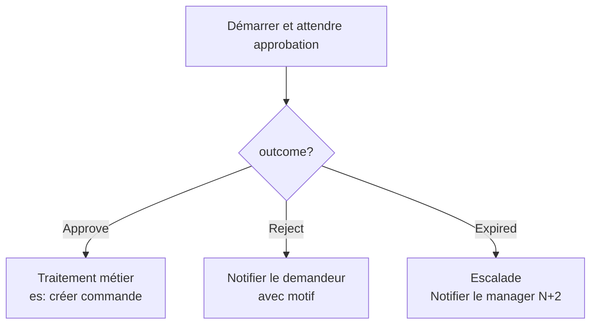
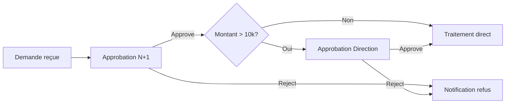
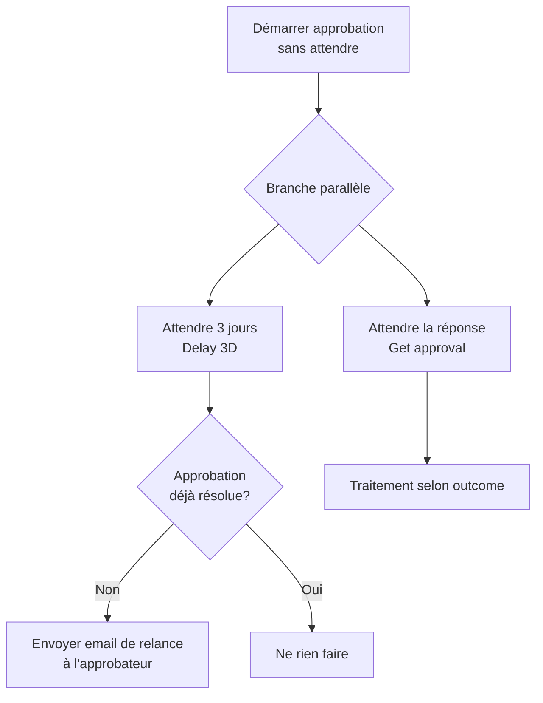

# Approbations et workflows humains

## Objectifs pédagogiques

À l'issue de ce module, vous serez capable de :

1. **Concevoir** un circuit d'approbation adapté à un besoin métier (séquentiel, parallèle, délégué)
2. **Implémenter** une action d'approbation Power Automate avec les configurations essentielles (délai, réaffectation, rappel)
3. **Gérer** les réponses d'approbation — qu'elles arrivent, tardent ou n'arrivent pas — sans bloquer le flux
4. **Distinguer** les différents types d'approbations et choisir celui qui correspond à un scénario donné
5. **Intégrer** les approbations dans Microsoft Teams via Adaptive Cards pour réduire les frictions utilisateur

---

## Mise en situation

Imaginez un processus d'achat dans une PME : un collaborateur soumet une demande, son manager doit valider, et les achats finalisent la commande. Sans automatisation, ça ressemble à une chaîne d'emails, avec des pièces jointes perdues, des relances oubliées et personne qui sait vraiment où en est la demande.

Power Automate propose un mécanisme d'approbation intégré qui orchestre ces décisions humaines comme des étapes de workflow à part entière. Le flux s'arrête, attend une réponse humaine, puis reprend — avec la décision tracée, l'historique conservé, et le demandeur notifié automatiquement.

Ce module couvre tout ce qu'il faut pour construire ces circuits de manière fiable, sans tomber dans les pièges classiques.

---

## Ce que sont les approbations Power Automate — et pourquoi elles existent

Une approbation, dans Power Automate, n'est pas un simple email avec un bouton "Oui/Non". C'est une **entité Dataverse** (`msdyn_approval`), créée au moment de l'exécution du flux, qui suspend celui-ci en attendant une ou plusieurs réponses humaines. Quand l'approbateur répond — depuis Outlook, Teams, l'app mobile ou le portail Power Automate — Dataverse met à jour l'entité, et le flux reprend.

Ce fonctionnement explique quelques comportements importants :

- Un flux avec une approbation peut rester en attente **plusieurs jours ou semaines** sans consommer de ressource en continu
- L'historique des réponses est **persistant et auditable**, même si le flux échoue après
- Les approbations survivent aux **redémarrages** et aux sessions — ce n'est pas un timer en mémoire

🧠 **Concept clé** — L'approbation suspend le flux en créant un enregistrement dans Dataverse. Le flux reprend uniquement quand cet enregistrement est mis à jour par une réponse humaine. C'est ce qui distingue les approbations des simples notifications.

---

## Les types d'approbations disponibles

Power Automate propose plusieurs configurations au sein du connecteur **Approvals** (action "Démarrer et attendre une approbation") :

| Type | Comportement | Quand l'utiliser |
|------|-------------|-----------------|
| **Approuver/Rejeter — Premier à répondre** | Plusieurs approbateurs, le premier qui répond clôt la demande | Urgence, disponibilité incertaine |
| **Approuver/Rejeter — Tous doivent répondre** | Chaque approbateur doit répondre, indépendamment | Comité de validation, conformité |
| **Réponses personnalisées** | Vous définissez vous-même les options (ex : "Approuver", "Rejeter", "Renvoyer au demandeur") | Processus métier complexe, pas binaire |

La distinction entre "Premier à répondre" et "Tous doivent répondre" est plus importante qu'elle n'y paraît. Dans un circuit RH où manager ET DRH doivent valider, le mode "premier à répondre" n'a pas de sens. Dans une équipe support où n'importe quel N+1 disponible peut approuver, c'est exactement ce qu'il faut.

⚠️ **Erreur fréquente** — Utiliser "Approuver/Rejeter — Tous doivent répondre" avec 5 approbateurs dont un est en congés. Le flux reste bloqué indéfiniment. Toujours coupler ce type avec un délai d'expiration (voir section suivante).

---

## Anatomie de l'action "Démarrer et attendre une approbation"

Voici les champs clés de l'action et ce qu'ils font concrètement :

| Champ | Rôle | Notes pratiques |
|-------|------|-----------------|
| **Titre** | Identifie la demande dans le portail et les emails | Toujours dynamique : inclure le nom du demandeur et la date |
| **Approbateurs** | Liste des emails ou UPN séparés par `;` | Accepte des expressions dynamiques |
| **Détails** | Corps du message affiché à l'approbateur | Supporte le HTML basique |
| **Lien vers l'élément** | URL vers la ressource à approuver (SharePoint, etc.) | Réduire les allers-retours |
| **Délai d'expiration** | ISO 8601 — format `P7D` (7 jours), `PT4H` (4 heures) | Optionnel mais fortement recommandé |
| **Réaffectation activée** | Permet à l'approbateur de déléguer | Utile pour les absences |

Le champ **Délai d'expiration** mérite une attention particulière. Il s'exprime en format ISO 8601 de durée, pas en date absolue. `P7D` signifie "7 jours à compter du démarrage de l'approbation". Si l'approbateur ne répond pas dans ce délai, l'approbation expire — et le flux reprend avec un statut `Expired`.

```
Exemples de durées ISO 8601 :
P1D   → 1 jour
P7D   → 7 jours
PT4H  → 4 heures
P1DT6H → 1 jour et 6 heures
```

---

## Gérer la réponse — et l'absence de réponse

Après l'action "Démarrer et attendre", le flux dispose de la variable de sortie de l'approbation. Les propriétés les plus utilisées :

| Propriété | Valeur possible | Usage |
|-----------|----------------|-------|
| `outcome` | `Approve` / `Reject` / `Expired` | Branchement conditionnel principal |
| `responses` | Tableau des réponses individuelles | Mode "tous doivent répondre" |
| `responses[0].responder.userPrincipalName` | Email de l'approbateur | Traçabilité |
| `responses[0].comments` | Commentaire saisi | Notification au demandeur |

Le branchement typique après une approbation ressemble à ça :



La branche `Expired` est souvent oubliée lors des premières implémentations. Sans elle, un flux dont l'approbation expire se termine silencieusement — ni le demandeur ni personne n'est alerté. Le processus métier est bloqué, mais personne ne le sait.

💡 **Astuce** — Dans la branche `Expired`, envoyez toujours une notification à la fois au demandeur ET à un responsable. Ajoutez l'email de l'approbateur d'origine dans le corps pour faciliter la relance manuelle.

---

## Approbations séquentielles — orchestrer une chaîne humaine

Parfois, une approbation ne suffit pas. Un processus achat peut nécessiter : manager direct → responsable budget → direction si montant > 10 000 €. Ce type de circuit séquentiel se construit en imbriquant plusieurs actions d'approbation dans des conditions.

Le principe : chaque approbation est dans un bloc conditionnel qui n'exécute la suivante que si la précédente a abouti à "Approve".



🧠 **Concept clé** — Dans un circuit séquentiel, chaque étape génère un enregistrement Dataverse distinct. L'historique complet de la chaîne est donc traçable, avec les timestamps et les commentaires de chaque intervenant.

---

## Approbations dans Teams — réduire les frictions

La friction est l'ennemi des processus d'approbation. Si un approbateur doit ouvrir un email, cliquer sur un lien, se connecter au portail Power Automate pour répondre — les délais s'allongent. L'intégration native avec Microsoft Teams résout en grande partie ce problème.

Power Automate peut publier une approbation directement dans Teams sous forme d'**Adaptive Card**, directement dans le canal ou en message personnel. L'approbateur répond sans quitter Teams, sur desktop ou mobile.

Il existe deux approches :

**1. Via le connecteur Approvals natif**
L'action "Démarrer et attendre une approbation" envoie automatiquement une notification Teams si l'approbateur a Teams. Aucune configuration supplémentaire.

**2. Via le connecteur Teams + Adaptive Cards**
Pour plus de contrôle sur le contenu affiché (inclure une image, un tableau de données, des boutons personnalisés), utilisez l'action **"Publier une carte adaptative et attendre une réponse"** du connecteur Microsoft Teams.

```
Chemin dans Power Automate :
+ Nouvelle étape → Microsoft Teams → Publier une carte adaptative et attendre une réponse
```

Cette action est plus flexible mais aussi plus technique : vous devez fournir le JSON de la carte Adaptive Card. Le [concepteur de cartes adaptatives](https://adaptivecards.io/designer/) permet de construire ce JSON visuellement.

⚠️ **Erreur fréquente** — Confondre "Publier une carte adaptative" (simple notification, pas de retour dans le flux) et "Publier une carte adaptative **et attendre une réponse**" (suspend le flux). La première ne bloque pas — le flux continue immédiatement après.

---

## Rappels et relances automatiques

Un circuit d'approbation sans relance crée des goulots d'étranglement. La bonne pratique est de prévoir une relance automatique avant l'expiration.

La technique standard dans Power Automate : **lancer l'approbation en parallèle d'un timer**. On utilise pour cela une branche **"Exécuter en parallèle"** dans le flux.



💡 **Astuce** — Pour vérifier si une approbation est déjà résolue avant d'envoyer la relance, utilisez l'action "Obtenir les détails d'une approbation" et vérifiez si `status` vaut `Completed`. Si oui, la relance est inutile et vous évitez de spammer l'approbateur qui a déjà répondu.

---

## Traçabilité et audit — ce que Dataverse stocke pour vous

Contrairement à une solution maison basée sur des emails, toutes les approbations Power Automate sont stockées dans Dataverse, dans la table `Approvals`. Cela signifie que vous pouvez :

- Requêter l'historique des approbations depuis Power Apps ou Power BI
- Déclencher d'autres automatisations sur les changements d'état
- Exporter les données pour un audit de conformité

La table contient notamment : le titre, le demandeur, les approbateurs, la décision, les commentaires, et les timestamps de création/réponse.

Pour les environnements avec des exigences de conformité strictes (RH, achat, legal), c'est un argument fort en faveur du connecteur natif Approvals plutôt qu'une solution custom.

---

## Bonnes pratiques et pièges à éviter

**Ce qui fonctionne bien :**

- Toujours renseigner un **délai d'expiration** et gérer la branche `Expired`
- Rendre le **titre dynamique** (inclure date + nom du demandeur + objet) — l'approbateur qui reçoit 20 demandes par semaine vous remerciera
- Inclure le **lien vers l'élément source** dans les détails — réduire les allers-retours
- Tester avec un compte de test avant de passer en prod — les approbations expirées ne peuvent pas être rouvertes

**Ce qui crée des problèmes :**

- Mettre une **adresse email de groupe** comme approbateur en mode "tous doivent répondre" — chaque membre du groupe devient approbateur, ce n'est pas ce que vous voulez
- Ignorer les **commentaires** dans la notification au demandeur — l'information qui explique le refus disparaît
- Créer des **circuits séquentiels de plus de 4-5 niveaux** dans un seul flux — préférer des sous-flux ou revoir le processus métier
- Utiliser des **approbations dans des boucles** sans limite — chaque itération crée un enregistrement Dataverse, les performances se dégradent vite

⚠️ **Erreur fréquente** — Déclencher un flux d'approbation sur modification d'un élément SharePoint sans filtre. Si le flux lui-même modifie l'élément (pour mettre à jour le statut), il se redéclenche. Résultat : boucle infinie d'approbations. Toujours filtrer sur un champ spécifique (ex : `Status eq 'Pending'`) ou utiliser un champ de verrouillage.

---

## Cas réel — Circuit de validation de note de frais

**Contexte :** Une entreprise de 200 personnes traite 150 notes de frais par mois via email. Le délai moyen de validation dépasse 12 jours. L'objectif : réduire à moins de 3 jours, avec traçabilité complète.

**Solution mise en place :**

1. Un formulaire Power Apps remplace l'email — les données atterrissent dans une liste SharePoint
2. Le flux Power Automate se déclenche à la création d'un nouvel élément avec `Status = 'Soumis'`
3. L'approbation est envoyée au manager (champ `Manager` récupéré depuis Azure AD via l'action "Obtenir le responsable")
4. Délai d'expiration : `P3D` (3 jours)
5. Si `Approve` → mise à jour du statut "Approuvé" + notification comptabilité
6. Si `Reject` → mise à jour "Refusé" + email au collaborateur avec les commentaires
7. Si `Expired` → escalade automatique au N+2 + relance email au manager

**Résultats après 2 mois :**
- Délai moyen de validation : 1,8 jours (vs 12 avant)
- 100% des demandes ont un statut traçable en temps réel
- Zéro demande perdue (vs ~5% avant via email)
- Le tableau de bord Power BI consomme directement la table Dataverse pour le reporting mensuel

---

## Résumé

Les approbations Power Automate sont bien plus que des boutons dans un email — elles reposent sur Dataverse, ce qui les rend persistantes, auditables et intégrables dans des tableaux de bord. Le connecteur Approvals propose trois modes (premier à répondre, tous doivent répondre, réponses personnalisées) adaptés à des circuits métier différents. Gérer correctement un flux d'approbation implique systématiquement de traiter les trois issues possibles : approuvé, rejeté, expiré. L'intégration Teams réduit la friction et accélère les délais de réponse. Pour les circuits complexes (séquentiel, conditionnel selon montant), la logique se construit en imbriquant des approbations dans des branches conditionnelles. La qualité d'un circuit d'approbation se mesure autant à sa gestion des cas limites (expiration, délégation, relance) qu'à son chemin nominal.

---

<!-- snippet
id: powerautomate_approval_expiration_iso
type: tip
tech: Power Automate
level: intermediate
importance: high
format: knowledge
tags: approbation, expiration, iso8601, delai, timeout
title: Format ISO 8601 pour le délai d'expiration des approbations
content: "Dans l'action 'Démarrer et attendre une approbation', le délai s'exprime en ISO 8601 : P7D = 7 jours, PT4H = 4 heures, P1DT6H = 1 jour + 6 heures. Sans ce délai, un approbateur absent bloque le flux indéfiniment."
description: "Le champ délai attend une durée ISO 8601, pas une date. P7D = 7 jours. Sans délai, le flux attend indéfiniment si personne ne répond."
-->

<!-- snippet
id: powerautomate_approval_expired_branch
type: warning
tech: Power Automate
level: intermediate
importance: high
format: knowledge
tags: approbation, expiration, escalade, branche, outcome
title: Ne jamais ignorer la branche Expired dans une approbation
content: "Si l'approbation expire et que le flux ne gère pas le cas 'Expired', le flux se termine silencieusement. Le demandeur n'est pas notifié, le processus est bloqué, personne ne le sait. Toujours ajouter une branche Expired avec escalade ou notification explicite."
description: "Outcome = Expired si le délai est dépassé. Sans branche dédiée, le flux se termine sans bruit et le processus métier est bloqué silencieusement."
-->

<!-- snippet
id: powerautomate_approval_types_comparison
type: concept
tech: Power Automate
level: intermediate
importance: high
format: knowledge
tags: approbation, type, premier-repondant, tous-repondants, workflow
title: Différence entre les types d'approbation Power Automate
content: "'Premier à répondre' : le premier approbateur qui clique clôt la demande, les autres ne peuvent plus répondre. 'Tous doivent répondre' : chaque approbateur doit répondre individuellement, le flux attend toutes les réponses. Utiliser 'Premier' pour les cas où la disponibilité est incertaine, 'Tous' pour les comités de validation formels — mais toujours avec un délai d'expiration."
description: "Premier à répondre = le premier clôt tout. Tous doivent répondre = chaque membre répond séparément. Le choix impacte directement les délais et les risques de blocage."
-->

<!-- snippet
id: powerautomate_approval_teams_difference
type: warning
tech: Power Automate
level: intermediate
importance: high
format: knowledge
tags: teams, adaptive-card, approbation, attendre, notification
title: Différence entre 'Publier une carte' et 'Publier et attendre' dans Teams
content: "Dans le connecteur Teams : 'Publier une carte adaptative' = notification simple, le flux continue immédiatement après. 'Publier une carte adaptative et attendre une réponse' = suspend le flux jusqu'à ce que l'utilisateur réponde dans Teams. Confondre les deux est une erreur courante qui rend le flux non fonctionnel."
description: "Sans 'attendre une réponse', le flux ne se suspend pas après la carte Teams — il continue immédiatement sans capturer la décision de l'approbateur."
-->

<!-- snippet
id: powerautomate_approval_loop_trigger
type: error
tech: Power Automate
level: intermediate
importance: high
format: knowledge
tags: approbation, boucle, sharepoint, trigger, filtre
title: Boucle infinie d'approbations sur déclencheur SharePoint
content: "Symptôme : des dizaines d'approbations identiques se créent en quelques minutes. Cause : le flux modifie l'élément SharePoint (ex : mise à jour du statut) après approbation, ce qui redéclenche le flux. Correction : ajouter une condition sur le champ Status au début du flux — ex : 'Exécuter uniquement si Status eq Soumis'. Ou utiliser un champ booléen 'FluxDéclenché' mis à true dès le début."
description: "Si le flux modifie l'élément qui le déclenche, il se redéclenche. Filtrer sur un champ spécifique dès le début du flux pour briser la boucle."
-->

<!-- snippet
id: powerautomate_approval_dataverse_storage
type: concept
tech: Power Automate
level: intermediate
importance: medium
format: knowledge
tags: approbation, dataverse, historique, audit, traçabilite
title: Les approbations sont stockées dans Dataverse
content: "Chaque approbation crée un enregistrement dans la table Dataverse 'Approvals' (msdyn_approval). Cet enregistrement contient : titre, demandeur, approbateurs, décision, commentaires, timestamps. Il persiste après la fin du flux. Cela permet de requêter l'historique depuis Power Apps ou Power BI, et de déclencher d'autres flux sur les changements d'état."
description: "Les approbations sont des entités Dataverse persistantes — auditables, requêtables depuis Power BI ou Power Apps, indépendantes du flux qui les a créées."
-->

<!-- snippet
id: powerautomate_approval_group_email_warning
type: warning
tech: Power Automate
level: intermediate
importance: medium
format: knowledge
tags: approbation, groupe, email, approbateurs, configuration
title: Ne pas utiliser un email de groupe en mode 'Tous doivent répondre'
content: "Piège : renseigner l'email d'un groupe Office 365 comme approbateur avec le mode 'Tous doivent répondre'. Power Automate résout l'adresse du groupe et crée une approbation pour chaque membre — ce qui n'est généralement pas voulu. Conséquence : 20 membres du groupe reçoivent la demande et tous doivent répondre. Correction : utiliser les UPN individuels ou le mode 'Premier à répondre' si le groupe est approprié."
description: "Email de groupe + 'Tous doivent répondre' = une approbation par membre du groupe. Utiliser les UPN individuels ou changer le mode d'approbation."
-->

<!-- snippet
id: powerautomate_approval_relance_parallel
type: tip
tech: Power Automate
level: intermediate
importance: medium
format: knowledge
tags: approbation, relance, rappel, parallele, delay
title: Implémenter une relance automatique avant expiration
content: "Technique : démarrer l'approbation sans attendre (action séparée), puis lancer deux branches parallèles — une qui attend N jours puis envoie un email de relance, une qui attend la réponse via 'Obtenir les détails de l'approbation'. Avant d'envoyer la relance, vérifier si status = 'Completed' pour éviter de notifier un approbateur qui a déjà répondu."
description: "Pour relancer avant expiration : lancer en parallèle un Delay + check status Completed. Si non résolu après N jours → envoyer relance. Évite de spammer un approbateur qui a déjà répondu."
-->

<!-- snippet
id: powerautomate_approval_dynamic_title
type: tip
tech: Power Automate
level: beginner
importance: medium
format: knowledge
tags: approbation, titre, dynamique, lisibilite, ux
title: Toujours rendre le titre d'approbation dynamique
content: "Un approbateur qui reçoit 20 demandes par semaine voit dans son portail : 'Validation note de frais' × 20. Impossible de différencier. Toujours construire le titre avec des données dynamiques : ex. 'NDF - [Nom] - [Montant]€ - [Date]'. Utiliser les expressions Power Automate : formatDateTime(utcNow(),'dd/MM/yyyy') pour la date."
description: "Un titre statique rend toutes les approbations identiques dans le portail. Inclure au minimum le nom du demandeur et la date pour permettre l'identification rapide."
-->
