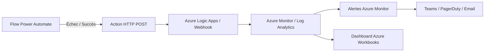
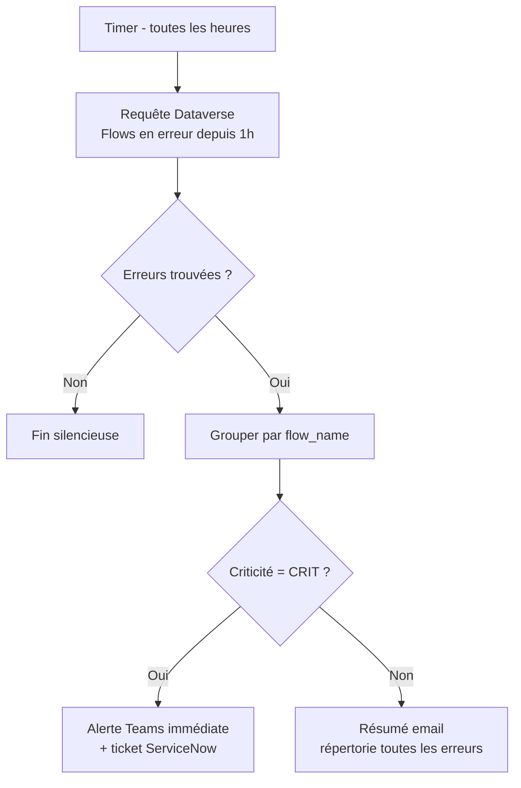

# Monitoring et observabilité des flows Power Automate

## Objectifs pédagogiques

À l'issue de ce module, vous serez capable de :

1. **Lire et interpréter** l'historique d'exécution d'un flow pour identifier précisément où et pourquoi une exécution a échoué
2. **Instrumenter** un flow avec des mécanismes de logging structuré pour rendre ses comportements observables en production
3. **Configurer des alertes** automatiques et des notifications d'échec adaptées aux exigences d'un environnement d'entreprise
4. **Diagnostiquer** les causes racines des erreurs les plus fréquentes (throttling, timeout, erreurs de connecteur, boucles infinies)
5. **Mettre en place une stratégie d'observabilité** cohérente pour un parc de flows, pas seulement flow par flow

---

## Mise en situation

Votre équipe a déployé une vingtaine de flows en production au cours des derniers mois. Les premiers — synchronisation CRM, notifications Teams, traitement de formulaires — fonctionnaient bien en dev, ont passé les tests, et ont été mis en prod sans histoires.

Deux semaines plus tard, le responsable commercial vous appelle : "Les opportunités ne se créent plus dans Salesforce depuis ce matin." Vous ouvrez Power Automate. Le flow est là, actif, statut vert. Mais il a silencieusement échoué 47 fois depuis 6h du matin.

C'est le problème central de ce module : un flow actif n'est pas un flow qui fonctionne. Sans observabilité, vous découvrez les pannes quand quelqu'un se plaint — pas quand elles surviennent. Et dans un environnement avec plusieurs dizaines de flows imbriqués, cette approche réactive devient rapidement ingérable.

Ce module part du principe que vous savez déjà construire des flows (y compris des flows complexes avec conditions, boucles, actions parallèles). L'enjeu ici est différent : comment savoir ce qui se passe réellement une fois que le flow est en prod, et comment le savoir avant que l'utilisateur s'en aperçoive.

---

## Pourquoi l'observabilité est un sujet à part entière

Il y a une asymétrie fondamentale dans Power Automate : construire un flow est visible, intuitif, guidé par l'interface. Comprendre ce qu'il fait en production, c'est une autre discipline.

Par défaut, Power Automate vous donne accès à l'historique d'exécution — c'est déjà beaucoup. Mais cet historique est conçu pour le débogage unitaire, pas pour la supervision d'un parc. Il ne vous alertera pas proactivement. Il ne vous dira pas "ce flow échoue 30% du temps les lundis matin". Il ne croisera pas ses données avec celles d'un autre flow.

L'observabilité, c'est la capacité à répondre à trois questions en permanence :

- **Est-ce que ça tourne ?** (disponibilité)
- **Est-ce que ça fait ce qu'on attend ?** (correction)
- **Pourquoi est-ce que ça a planté ?** (diagnostic)

La première question, Power Automate y répond partiellement. Les deux autres nécessitent un effort de votre part.

---

## Anatomie de l'historique d'exécution

C'est votre premier outil de diagnostic. Avant d'aller plus loin, il faut le connaître précisément — pas dans les grandes lignes, mais dans les détails qui font la différence.

### Accéder à l'historique

Depuis le portail Power Automate (`make.powerautomate.com`), sélectionnez un flow puis l'onglet **Historique des exécutions**. Vous y trouvez la liste paginée des 28 derniers jours d'exécutions (limite de rétention par défaut sur les licences standard).

> ⚠️ **Point souvent manqué** : l'historique affiché dans l'interface est limité à **50 exécutions par page**, et la rétention à **28 jours**. Au-delà, les données sont perdues sauf si vous avez mis en place une stratégie d'export. Si vous avez besoin de rejouer un incident survenu il y a 6 semaines, vous n'aurez rien.

Chaque ligne d'exécution indique :

| Champ | Ce qu'il vous dit réellement |
|---|---|
| Statut | `Succès`, `Échec`, `Annulé`, `En cours d'exécution` |
| Heure de début | Quand le trigger a été activé |
| Durée | Temps total — clé pour détecter les dérives de perf |
| Identifiant de l'exécution | GUID unique — utile pour le support Microsoft ou les logs croisés |

### Lire une exécution en détail

Cliquez sur une exécution pour ouvrir la vue détaillée. C'est ici que les choses deviennent intéressantes.

Chaque action s'affiche sous forme d'un arbre déroulable. Les actions en succès sont vertes, les actions en échec sont rouges. **Mais attention** : une action rouge n'est pas toujours la cause racine. Power Automate propage parfois le statut d'échec vers le bas — si une action parente échoue, toutes les actions enfants apparaissent aussi en rouge, même si elles n'ont pas pu s'exécuter du tout.

La vraie information est dans le **corps de la réponse** de l'action qui a échoué. Déroulez l'action rouge et inspectez :

- **Inputs** : ce que le flow a envoyé à l'action
- **Outputs** : ce que l'action a retourné (ou le message d'erreur)
- **Code d'erreur** : la clé du diagnostic (voir section dédiée plus bas)

💡 **Astuce peu connue** : dans la vue d'exécution détaillée, vous pouvez cliquer sur le bouton **"Réexécuter"** (ou "Resubmit") pour relancer l'exécution exactement avec les mêmes inputs de déclenchement. Utile pour tester un correctif sans attendre que le trigger se redéclenche naturellement.

---

## Instrumenter un flow : aller au-delà de l'historique natif

L'historique natif vous donne la structure d'une exécution. Il ne vous dit pas ce qui s'est passé dans votre logique métier. Pour ça, vous devez instrumenter votre flow vous-même.

### Logging structuré avec Dataverse

La solution la plus robuste en environnement d'entreprise : créer une table Dataverse dédiée aux logs de flows.

Structure minimale d'une table `FlowExecutionLog` :

| Colonne | Type | Rôle |
|---|---|---|
| `flow_name` | Texte | Nom du flow (ex: "Synchro-CRM-Opps") |
| `execution_id` | Texte | GUID de l'exécution (issu de `workflow().run.id`) |
| `status` | Choix | `Started`, `Success`, `Error`, `Warning` |
| `step_name` | Texte | Nom de l'étape en cours |
| `message` | Texte long | Message libre ou payload d'erreur |
| `triggered_by` | Texte | Email ou ID de l'utilisateur déclencheur |
| `created_on` | Date/heure | Horodatage automatique |

Dans le flow, vous créez une ligne de log à trois moments clés : au démarrage, à la fin (succès ou non), et dans chaque bloc `catch` de vos scopes de gestion d'erreur.

```
Expression pour récupérer l'ID d'exécution : workflow().run.id
Expression pour récupérer le nom du flow  : workflow().tags.flowDisplayName
Expression pour l'horodatage UTC           : utcNow()
```

🧠 **Concept clé** : `workflow()` est une fonction d'expression disponible dans n'importe quelle action Power Automate. Elle retourne un objet JSON qui contient des métadonnées sur l'exécution courante — notamment l'ID de run, le nom du flow, l'environnement. C'est votre point d'entrée pour une instrumentation cohérente.

### Gestion d'erreur avec les Scopes

Sans gestion d'erreur explicite, un flow qui plante s'arrête silencieusement. La mécanique correcte repose sur les **Scopes** et leurs conditions d'exécution.

```
[Scope] Bloc principal
   → toutes les actions métier

[Scope] Gestion d'erreur
   → configuré pour s'exécuter "En cas d'échec" du scope principal
   → actions : log en Dataverse + notification Teams/email
```

La configuration clé est dans les **paramètres de l'action Scope** : clic droit → "Configurer l'exécution après". Vous y définissez si ce scope s'exécute après un succès, un échec, un timeout, ou une annulation. Pour un scope de gestion d'erreur, vous cochez `a échoué` et `a expiré`.

À l'intérieur du scope de gestion d'erreur, récupérez les détails de l'erreur avec :

```
result('<Nom_du_scope_principal>')
```

Cette expression retourne un tableau avec le statut et les détails d'erreur de chaque action du scope. Filtrez sur les actions en statut `Failed` pour extraire le message d'erreur précis.

> ⚠️ **Piège classique** : si vous ne configurez pas les conditions d'exécution du scope de gestion d'erreur, il ne s'exécutera jamais en cas d'échec — Power Automate passe par défaut à "s'exécute après succès uniquement". C'est la raison numéro un pour laquelle les blocs catch ne déclenchent pas.

---

## Configurer des alertes proactives

Avoir des logs, c'est bien. Être prévenu sans aller les consulter, c'est mieux.

### Notifications Teams intégrées au flow

La solution la plus rapide : une action "Publier une carte adaptative dans un canal Teams" dans votre scope de gestion d'erreur. Construisez une carte adaptative avec les informations essentielles :

- Nom du flow
- ID d'exécution (avec lien direct vers l'exécution : `https://make.powerautomate.com/run/<RUN_ID>`)
- Étape en échec
- Message d'erreur brut
- Heure et utilisateur déclencheur

C'est suffisant pour qu'un opérateur puisse diagnostiquer sans ouvrir Power Automate.

### Centre d'administration Power Platform

Pour une supervision à l'échelle d'un environnement (pas flow par flow), le **Power Platform Admin Center** (`admin.powerplatform.microsoft.com`) propose une vue analytics :

**Chemin :** Admin Center → Environments → [votre environnement] → Analytics → Power Automate

Vous y trouvez des métriques agrégées sur 30 jours :

- Nombre d'exécutions par flow
- Taux d'échec
- Utilisation des connecteurs
- Flows les plus actifs / les plus défaillants

💡 Cette vue est particulièrement utile pour identifier les flows qui consomment disproportionnément le quota d'appels API de votre environnement — un problème invisible flow par flow mais évident en vue agrégée.

### Intégration avec Azure Monitor

Pour les environnements qui ont une culture DevOps établie et des flows critiques, l'export vers Azure Monitor est la solution la plus puissante.



Le principe : dans votre scope de gestion d'erreur (ou à chaque étape clé), vous envoyez un event JSON vers un endpoint HTTP — soit directement vers l'API d'ingestion de Log Analytics, soit via un Logic App ou Azure Function qui normalise les données.

L'URL d'ingestion Log Analytics suit ce format :

```
POST https://<WORKSPACE_ID>.ods.opinsights.azure.com/api/logs?api-version=2016-04-01
```

Avec les headers `Log-Type` (nom de votre table custom) et `Authorization` (clé primaire du workspace).

Une fois les données dans Log Analytics, vous pouvez écrire des **Kusto Query Language (KQL)** pour créer des alertes sur-mesure. Par exemple, déclencher une alerte si un flow critique échoue plus de 3 fois en 10 minutes.

> ⚠️ Cette intégration nécessite un abonnement Azure actif et des autorisations sur le workspace Log Analytics. Sur des flows non-critiques ou dans des équipes sans infrastructure Azure, la solution Teams/Dataverse suffit largement.

---

## Diagnostic des erreurs fréquentes

Voici les patterns d'erreur qui reviennent systématiquement en production, avec leur anatomie complète.

### Throttling et limites d'API

**Symptôme :** L'exécution échoue avec un code `429 Too Many Requests`, souvent de façon intermittente, principalement aux heures de pointe.

**Cause :** Chaque connecteur Power Automate a des quotas d'appels définis dans sa politique. SharePoint, par exemple, limite les appels en écriture. Si votre flow traite un fichier Excel avec 500 lignes et appelle SharePoint pour chaque ligne, vous avez 500 appels en quelques secondes.

**Correction :**
1. Activer le **retry automatique** : dans les paramètres de l'action concernée, "Stratégie de nouvelles tentatives" → `Exponentielle` avec 4 tentatives. Power Automate réessaiera avec un délai croissant.
2. Ajouter une action **Retarder** (Delay) dans vos boucles : un délai de 100ms entre chaque itération suffit souvent à rester sous les limites.
3. Réécrire la boucle pour utiliser des **actions par lots** (batch) quand le connecteur le supporte — notamment les actions "Mettre à jour plusieurs éléments" de Dataverse.

🧠 **Concept clé** : le throttling Power Automate opère à deux niveaux distincts. Le niveau **connecteur** (limites imposées par le service externe) et le niveau **tenant** (quotas Power Automate définis par votre licence). Un flow Premium a des quotas 10x supérieurs à un flow Standard. Si vous atteignez systématiquement les limites, le premier diagnostic est de vérifier quel niveau est en cause — les messages d'erreur sont différents.

### Timeout d'actions longues

**Symptôme :** Une action s'affiche en statut `TimedOut` après exactement 120 secondes (ou 2 heures pour les actions configurées en mode asynchrone).

**Cause :** Power Automate impose une limite de 120 secondes par action synchrone. Les opérations longues (export de gros fichiers, appels à des API lentes, requêtes SQL sans index) atteignent cette limite.

**Correction :**
- Pour les connecteurs qui le supportent, basculer l'action en mode **asynchrone** : paramètres de l'action → désactiver "Réponse asynchrone". L'action lancera l'opération et interrogera périodiquement son statut, contournant la limite.
- Pour les appels HTTP, cocher l'option **"Activer le modèle asynchrone"** dans les paramètres de l'action.
- Pour les opérations vraiment longues, revoir l'architecture : déclencher un traitement en arrière-plan (Azure Function, Logic App) et utiliser un flow de polling séparé pour récupérer le résultat.

### Boucles infinies sur les triggers Dataverse

**Symptôme :** Un flow qui se modifie des enregistrements Dataverse est déclenché par ses propres modifications — il tourne indéfiniment jusqu'à épuiser les quotas.

**Cause :** Le trigger "Quand une ligne est ajoutée, modifiée ou supprimée" dans Dataverse se déclenche sur toutes les modifications, y compris celles effectuées par le flow lui-même.

**Correction :**
- Utiliser le **filtre de colonnes** du trigger : ne se déclencher que si une colonne spécifique a changé (pas les colonnes que votre flow modifie).
- Ajouter une colonne booléenne `is_processed` dans la table : le flow vérifie en première étape si elle est à `true` — si oui, il s'arrête immédiatement.
- Utiliser l'option **"Déclencher uniquement sur les propriétés sélectionnées"** disponible dans les paramètres avancés du trigger Dataverse.

> ⚠️ Ce problème peut consommer l'intégralité des quotas d'exécution d'un tenant en quelques heures. C'est un des rares cas où il faut désactiver un flow manuellement en urgence plutôt que d'attendre de comprendre.

### Erreurs de connexion et secrets expirés

**Symptôme :** Un flow qui fonctionnait parfaitement tombe en erreur avec `InvalidConnectionGateway` ou `AuthenticationFailed`, sans que personne n'ait touché au flow.

**Cause :** Les connexions Power Automate sont liées à un compte utilisateur (ou service account). Si ce compte change son mot de passe, perd sa licence, ou si le token OAuth expire, toutes les connexions qui en dépendent tombent simultanément — et tous les flows qui utilisent ces connexions aussi.

**Correction :**
1. Dans Power Automate → Données → Connexions, identifier les connexions en erreur (icône rouge).
2. Re-authentifier la connexion avec les credentials appropriés.
3. **Préventivement** : utiliser des **comptes de service dédiés** (non-nominatifs) pour les connexions critiques. Un humain qui quitte l'entreprise ne doit pas faire tomber 15 flows.
4. Pour les connexions critiques, créer une alerte dans le flow lui-même : tester la connexion en début d'exécution avec une action légère (ex: récupérer une seule ligne Dataverse) et logguer si elle échoue.

---

## Stratégie d'observabilité à l'échelle d'un parc

Quand vous avez 5 flows, vous les supervisez à la main. Quand vous en avez 50, il faut une stratégie.

### Niveaux de criticité

Commencez par classer vos flows en niveaux :

| Niveau | Critères | Stratégie de monitoring |
|---|---|---|
| **Critique** | Bloque un process métier en temps réel | Alerte Teams immédiate + log Dataverse + retry automatique |
| **Important** | Impact si échec, mais pas bloquant immédiat | Alerte email + log Dataverse |
| **Standard** | Confort, notification, automatisation légère | Log Dataverse, revue hebdomadaire |

Ne pas mettre tous vos flows en "Critique" — c'est tentant mais contre-productif. Vous finirez par ignorer les alertes.

### Naming convention et organisation

Le monitoring commence à la conception. Un flow nommé `Flow1` est impossible à superviser à l'échelle. Adoptez une convention du type :

```
[CRITICITE]-[DOMAINE]-[ACTION]-[VERSION]
Exemples :
  CRIT-CRM-SynchroOpportunites-v2
  STD-HR-NotifAnniversaires-v1
  IMP-FIN-ExportFactures-v3
```

Cette convention vous permet de filtrer dans l'Admin Center, de créer des règles d'alerte par pattern de nom, et de comprendre l'impact d'une panne en une seconde.

### Flow de supervision centralisé

Une approche avancée : créer un **flow de supervision** qui s'exécute toutes les heures et interroge les logs Dataverse pour détecter des patterns anormaux.



Ce pattern découple le monitoring de l'exécution des flows individuels — même si un flow n'a pas de scope de gestion d'erreur, le flow de supervision le détecte via les logs Dataverse qu'il écrit en début et fin d'exécution.

---

## Cas réel en entreprise

**Contexte :** Une DSI industrielle avec 60 flows Power Automate en production, gérant la synchronisation entre SAP, SharePoint et une application métier custom. Pas de monitoring en place depuis 8 mois.

**Problème initial :** Deux incidents critiques en trois semaines. Des bons de commande manquants dans SAP (flow de synchro silencieusement en échec depuis 4 jours) et des notifications de sécurité non envoyées (connexion expirée, jamais alertée).

**Ce qui a été mis en place :**

1. **Audit de l'existant** via le Power Platform Admin Center → Analytics. Résultat : 12 flows avec un taux d'échec > 20%, 3 flows en échec total depuis plusieurs jours.

2. **Table Dataverse de logs** avec les colonnes décrites plus haut. Déployée comme solution non-managée, puis ajoutée aux flows par ordre de criticité.

3. **Convention de nommage** appliquée rétroactivement sur les 60 flows (renommage via l'Admin Center, export de liste et renommage en lot via PAC CLI).

4. **Scopes de gestion d'erreur** ajoutés aux 15 flows classés Critique et Important. Délai de mise en œuvre : 3 jours pour un développeur.

5. **Flow de supervision** horaire interrogeant la table de logs. Résumé quotidien automatique envoyé au responsable applicatif.

**Résultats après 6 semaines :**
- Temps moyen de détection d'incident : de 2-4 jours (signalement utilisateur) à moins de 2 heures
- 3 incidents détectés proactivement avant impact utilisateur
- Taux d'échec global réduit de 23% à 8% (correction des causes racines rendue possible par la visibilité)

---

## Bonnes pratiques

**1. Logguer en début ET en fin d'exécution, pas seulement en erreur.** Un flow qui démarre mais ne termine jamais est aussi un problème. Sans log de début, impossible de savoir si le trigger a bien fonctionné.

**2. Ne jamais mettre de credentials en dur dans les messages d'erreur.** Votre scope de gestion d'erreur va loguer des payloads — vérifiez que les inputs ne contiennent pas de mots de passe ou de tokens. Utilisez des variables intermédiaires qui masquent les valeurs sensibles avant le log.

**3. Tester le scope de gestion d'erreur explicitement.** Ajoutez temporairement une action "Terminer" avec le statut "Échec" au début du scope principal, exécutez le flow manuellement, vérifiez que le scope catch se déclenche et que le log est créé. Supprimez ensuite l'action de test. Un scope catch non testé est un scope qui ne fonctionnera probablement pas quand vous en aurez besoin.

**4. Dimensionner la rétention des logs.** 28 jours natifs ne suffisent pas pour des analyses de tendance ou des audits. Si vous utilisez Dataverse comme destination de logs, activez une politique de suppression automatique des entrées de plus de 90 jours — sinon la table grossit indéfiniment et devient un problème de stockage.

**5. Documenter le runbook de chaque flow critique.** Quand l'alerte Teams arrive à 3h du matin, la personne de garde doit savoir en 2 minutes : quelle est l'action de contournement manuelle ? qui prévient ? quel est l'impact si on laisse échouer jusqu'au lendemain matin ?

**6. Ne pas confondre "flow désactivé" et "flow en erreur".** Un flow désactivé n'apparaît pas dans les logs d'erreur. Si un collègue désactive un flow pour une opération de maintenance et oublie de le réactiver, votre monitoring ne vous avertira pas. Un audit hebdomadaire de l'état des flows critiques (actif/inactif) vaut la peine d'être automatisé.

**7. Tracer les données en transit, pas seulement les statuts.** Dans les flows critiques qui traitent des enregistrements (clients, commandes, documents), logguez l'identifiant de l'entité traitée. "Flow en erreur" est une information. "Flow en erreur sur la commande CMD-2024-4571" permet de corriger les données manuellement pendant que vous débuggez.

---

## Résumé

L'historique natif de Power Automate est un point de départ, pas une stratégie. En production, un flow sans instrumentation est une boîte noire : vous saurez qu'il a planté, mais vous ne saurez pas toujours pourquoi, ni combien de fois, ni quel impact cela a eu sur les données.

La réponse tient en trois axes complémentaires : **les scopes de gestion d'erreur** pour capturer les pannes là où elles surviennent, **le logging Dataverse structuré** pour centraliser l'observabilité, et **les alertes proactives** (Teams, email, Azure Monitor selon la maturité DevOps) pour ne plus découvrir les pannes via les utilisateurs.

Les erreurs les plus fréquentes — throttling, timeout, boucles infinies sur triggers Dataverse, connexions expirées — ont toutes des causes et des corrections documentées. La difficulté n'est pas technique, c'est la détection : sans monitoring, elles restent invisibles parfois pendant des jours.

À plus grande échelle, une convention de nommage, une classification par criticité, et un flow de supervision centralisé transforment une collection de flows individuels en un système opérable comme une vraie application de production.

Le module suivant abordera Process Mining et Process Advisor, qui vont plus loin : non seulement observer ce que font vos flows, mais analyser les processus métier sous-jacents pour identifier les goulots d'étranglement et les opportunités d'optimisation.

---

<!-- snippet
id: powerautomate_workflow_metadata
type: concept
tech: power automate
level: advanced
importance: high
format: knowledge
tags: expression,workflow,metadata,logging,execution-id
title: Métadonnées d'exécution avec workflow()
content: La fonction workflow() retourne un objet JSON avec les métadonnées de l'exécution courante. workflow().run.id donne le GUID unique de l'exécution (utile pour tracer dans les logs). workflow().tags.flowDisplayName donne le nom affiché du flow. Disponible dans n'importe quelle expression, sans action préalable.
description: Permet d'instrumenter un flow sans hardcoder son nom — essentiel pour des logs réutilisables sur plusieurs flows
-->

<!-- snippet
id: powerautomate_scope_catch_config
type: warning
tech: power automate
level: advanced
importance: high
format: knowledge
tags: scope,gestion-erreur,catch,conditions-execution,troubleshooting
title: Le scope catch ne se déclenche pas sans configuration explicite
content: Piège : un scope "Gestion d'erreur" ne s'exécute PAS automatiquement en cas d'échec. Par défaut, Power Automate configure toutes les actions sur "s'exécute après succès uniquement". Correction : clic droit sur le scope → "Configurer l'exécution après" → cocher "a échoué" et "a expiré" (décocher "a réussi").
description: Cause numéro un des blocs catch silencieux en production — configuration manuelle obligatoire sur chaque scope de gestion d'erreur
-->

<!-- snippet
id: powerautomate_result_expression
type: command
tech: power automate
level: advanced
importance: high
format: knowledge
tags: expression,result,scope,erreur,diagnostic
title: Récupérer les détails d'erreur d'un scope avec result()
command: result('<NOM_DU_SCOPE>')
example: result('Bloc_Principal')
description: Retourne un tableau avec le statut et les outputs de chaque action du scope — filtrer sur status='Failed' pour extraire le message d'erreur précis
-->

<!-- snippet
id: powerautomate_throttling_retry
type: tip
tech: power automate
level: advanced
importance: high
format: knowledge
tags: throttling,429,retry,strategie,quota
title: Configurer le retry exponentiel pour absorber les erreurs 429
content: Sur toute action susceptible de throttling (SharePoint, Dataverse en boucle) : paramètres de l'action → "Stratégie de nouvelles tentatives" → "Exponentielle", 4 tentatives. Power Automate réessaiera après 20s, 40s, 80s, 160s. Ajouter une action Delay de 100ms dans les boucles traitant plus de 50 éléments pour rester sous les limites.
description: Le retry exponentiel absorbe la majorité des 429 transitoires sans modifier la logique du flow
-->

<!-- snippet
id: powerautomate_retention_28j
