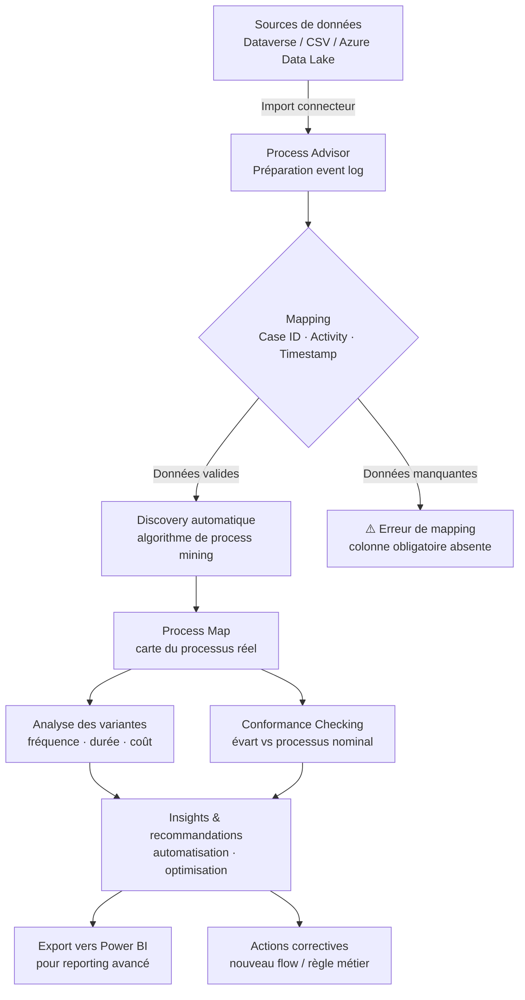

## Objectifs pédagogiques

À l'issue de ce module, vous serez capable de :

1. **Expliquer** la différence entre monitorer un flow (ce que fait le module précédent) et miner un processus — deux approches complémentaires mais fondamentalement différentes
2. **Importer et préparer** un event log depuis Dataverse ou un CSV pour une analyse Process Advisor
3. **Interpréter** une carte de processus, ses variantes et ses métriques de performance (temps de cycle, fréquence, bottlenecks)
4. **Utiliser le conformance checking** pour mesurer l'écart entre le processus théorique et ce qui se passe réellement
5. **Identifier des opportunités d'automatisation** à partir des insights Process Advisor

---

## Mise en situation

Vous travaillez chez un distributeur de pièces industrielles. L'équipe Operations a mis en place il y a 18 mois un processus de traitement des bons de commande : réception de la demande → validation manager → vérification stock → création commande fournisseur → confirmation livraison. Le flow Power Automate est en place, les logs Dataverse existent.

Le problème ? La direction dit que les commandes prennent "trop longtemps" mais personne ne sait exactement où. Le responsable supply chain estime que le problème vient de la validation manager. L'équipe IT pense que c'est la vérification stock. Les deux ont des intuitions, aucun n'a de données.

C'est exactement le problème que Process Mining résout — non pas en supposant où est le goulot d'étranglement, mais en le **prouvant avec les traces d'exécution réelles**.

---

## Contexte : pourquoi le monitoring ne suffit pas

Avant d'aller plus loin, il faut distinguer deux niveaux d'analyse qui sont souvent confondus.

Le **monitoring** (couvert dans le module précédent) répond à : "Est-ce que mon flow a échoué ? Combien de fois ? À quelle étape ?" C'est de l'observabilité opérationnelle — vous regardez l'exécution d'un flow donné, une instance à la fois, ou agrégée sur une période.

Le **process mining** répond à autre chose : "Comment mes processus se comportent-ils réellement, à l'échelle, comparés à ce que j'avais prévu ?" Vous ne regardez plus un flow individuel — vous analysez des centaines ou des milliers d'exécutions ensemble pour faire émerger des **patterns**, des **variantes** et des **anomalies structurelles**.

Pensez-y comme la différence entre regarder les logs d'un serveur (monitoring) et analyser les comportements d'utilisation de milliers d'utilisateurs pour comprendre leur parcours (analytics produit). Même si les données sources se ressemblent, la question posée est différente.

**Process Advisor** est la capacité de process mining intégrée dans Power Automate. Elle s'appuie sur deux modes :

- **Task Mining** — analyse des actions réalisées sur un poste de travail en enregistrant les interactions utilisateur (clics, saisies, applications utilisées). Utile pour identifier des tâches manuelles répétitives candidats à l'automatisation RPA.
- **Process Mining** — analyse d'event logs structurés (Dataverse, CSV, Azure Data Lake) pour cartographier et comprendre des processus bout-en-bout. C'est ce mode qui nous intéresse ici.

Ce module se concentre sur le **Process Mining** — le mode le plus puissant analytiquement, et le plus sous-utilisé.

---

## Concepts fondamentaux

### L'event log : la matière première

Tout le process mining repose sur un seul concept central : **l'event log**. Il s'agit d'une table où chaque ligne représente un événement qui s'est produit dans un processus.

Un event log minimal contient trois colonnes :

| Colonne | Rôle | Exemple |
|---|---|---|
| `Case ID` | Identifiant de l'instance du processus | Numéro de bon de commande |
| `Activity` | Nom de l'étape réalisée | "Validation manager" |
| `Timestamp` | Quand cet événement s'est produit | 2024-03-15 09:42:00 |

Des colonnes optionnelles enrichissent l'analyse : ressource (qui a fait l'action), coût, statut, données métier associées.

🧠 **Concept clé** — Un "case" est une instance du processus. Si 500 bons de commande ont été traités, vous avez 500 cases. Chaque case est une séquence d'événements. Le process mining analyse la structure de ces séquences collectivement.

La qualité de l'event log conditionne absolument tout. Un event log avec des timestamps inconsistants, des case IDs manquants ou des activités mal nommées produit une carte de processus illisible. C'est le GIGO (Garbage In, Garbage Out) du process mining.

### Variantes et fréquences

Une fois l'event log chargé, l'algorithme de discovery reconstruit le graphe des chemins réellement empruntés. Chaque chemin distinct s'appelle une **variante**.

Dans un monde idéal, tous vos cases suivent le chemin nominal : A → B → C → D → E. En réalité, vous découvrez que :
- 60% suivent A → B → C → D → E (chemin nominal)
- 18% suivent A → C → B → D → E (la validation et la vérification stock sont inversées)
- 12% suivent A → B → D → E (la vérification stock est sautée)
- 10% présentent des boucles ou retours en arrière

Ces variantes ne sont pas une anomalie dans les données — elles **révèlent** comment le processus fonctionne vraiment. Certaines variantes sont légitimes (exceptions métier documentées), d'autres sont des contournements non voulus du processus officiel.

### Bottlenecks et temps de cycle

La carte de processus affiche non seulement les chemins, mais aussi les **temps médians** entre chaque étape. C'est là que les insights les plus actionnables émergent : vous pouvez voir que la transition "Validation manager → Vérification stock" prend en médiane 4h30, alors que toutes les autres transitions prennent moins de 20 minutes. Le goulot d'étranglement se localise précisément, sans supposition.

⚠️ **Erreur fréquente** — Confondre "temps d'activité" et "temps d'attente". Si une étape prend 3 heures, ce n'est pas forcément qu'elle est complexe — c'est peut-être que la tâche attend dans une queue pendant 2h45 avant d'être traitée. Le process mining mesure le temps écoulé entre deux événements, pas le temps de travail effectif. Garder ça en tête quand vous interprétez les métriques.

---

## Architecture d'une analyse Process Mining dans Power Platform

Voici comment les composants s'articulent dans une analyse complète :



L'étape de mapping (C) est la plus critique et la plus souvent bâclée. Elle sera détaillée dans la section suivante.

---

## Workflow complet : de l'event log aux insights

### Étape 1 — Préparer les données

La préparation des données est la phase la plus longue et la plus déterminante. Dans Dataverse, vos événements de processus sont souvent éparpillés dans plusieurs tables. Avant d'aller dans Process Advisor, il faut construire une vue consolidée.

Supposons que vos données sont dans Dataverse avec deux tables : `PurchaseOrders` et `PurchaseOrderActivities`. La vue dont vous avez besoin :

```sql
-- Vue SQL dans Dataverse (ou via Power Query dans Power Automate Dataflows)
SELECT 
    poa.cr_purchase_order_id      AS CaseId,
    poa.cr_activity_name          AS Activity,
    poa.cr_completed_on           AS Timestamp,
    poa.cr_assigned_to            AS Resource,
    po.cr_total_amount            AS OrderAmount,
    po.cr_supplier                AS Supplier
FROM cr_purchaseorderactivities poa
JOIN cr_purchaseorders po 
    ON poa.cr_purchase_order_id = po.cr_purchase_orderid
WHERE poa.cr_completed_on IS NOT NULL
ORDER BY poa.cr_purchase_order_id, poa.cr_completed_on
```

💡 **Astuce** — Filtrez immédiatement les cases incomplets (commandes toujours en cours) si vous voulez analyser les temps de cycle bout-en-bout. Les cases ouverts faussent les métriques de durée. Ajoutez une condition `WHERE po.cr_status = 'Completed'` pour une première analyse, puis analysez séparément les cases en cours pour détecter les anomalies temps réel.

Les règles d'or pour un event log propre :
- Pas de timestamp null sur les événements que vous voulez analyser
- Case IDs stables (pas de renommage en cours de vie)
- Noms d'activités normalisés — "Validation Manager", "validation manager" et "Valid. mgr" seront traités comme trois activités différentes
- Au moins 20-30 cases pour que l'analyse soit statistiquement exploitable (idéalement plusieurs centaines)

### Étape 2 — Importer dans Process Advisor

Dans Power Automate, accédez à **Process Advisor** depuis le menu de gauche. Créez un nouveau processus de type "Process mining".

L'import se fait par connecteur. Les sources supportées nativement :
- **Dataverse** — connexion directe, requête configurable dans l'interface
- **CSV / Excel** — upload manuel ou depuis SharePoint
- **Azure Data Lake Storage Gen2** — pour les volumes importants
- **Connecteurs Custom** — via Power Query (même moteur que Power BI)

Une fois la source connectée, vous arrivez à l'écran de **mapping**. C'est ici que vous indiquez à Process Advisor quelles colonnes correspondent aux trois champs obligatoires (Case ID, Activity, Timestamp). Vous pouvez également mapper des attributs optionnels qui enrichiront l'analyse.

⚠️ **Erreur fréquente** — Mapper le "start timestamp" quand vous avez les deux (start et end). Process Advisor utilise le timestamp pour ordonner les événements dans un case. Si vous mappez "start", les activités longues sembleront commencer avant les courtes, ce qui peut perturber l'ordre reconstitué. Préférez le "end timestamp" (moment de complétion de l'activité) comme référence principale — c'est la convention standard en process mining.

Cliquez sur **Analyser** et laissez l'algorithme travailler. Sur quelques milliers de cases, c'est l'affaire de quelques secondes à quelques minutes selon la complexité.

### Étape 3 — Lire la carte de processus

La process map est le cœur de l'interface. Voici comment la lire efficacement :

**Les noeuds** représentent les activités. Leur taille indique la fréquence (plus c'est gros, plus c'est fréquent). La couleur indique le temps médian passé (du vert au rouge).

**Les arêtes** représentent les transitions entre activités. Leur épaisseur indique la fréquence de cette transition. Les chiffres sur les arêtes indiquent le temps médian entre les deux activités.

**Le panneau de gauche** liste toutes les variantes triées par fréquence. Cliquer sur une variante la met en évidence sur la carte.

Pour notre cas distributeur : en quelques secondes, vous voyez que la transition "Validation manager → Vérification stock" affiche une médiane de 4h12 en rouge vif, alors que le responsable supply chain l'estimait à "peut-être 45 minutes". Le panneau des variantes montre que 23% des cases passent par une boucle inattendue "Vérification stock → Validation manager" — un retour en arrière qui n'était pas dans le processus documenté.

### Étape 4 — Conformance Checking

Le conformance checking compare vos exécutions réelles à un **modèle de référence** que vous définissez. Dans Process Advisor, vous dessinez le processus nominal (ou vous l'importez depuis un fichier BPMN) et l'outil calcule un **fitness score** pour chaque case : à quel point cette exécution respecte-t-elle le modèle théorique ?

Pour configurer un conformance check :
1. Dans l'analyse, allez dans l'onglet **Conformance**
2. Définissez les activités obligatoires et leur ordre attendu
3. Définissez les transitions interdites (si applicable)
4. Lancez l'analyse de conformance

Résultats typiques :
- **Fitness global** : pourcentage de cases conformes au modèle (ex: 67%)
- **Violations par type** : activité manquée, ordre inversé, activité non prévue
- **Cases non conformes** : liste exportable pour investigation

🧠 **Concept clé** — Un fitness de 67% n'est pas forcément mauvais. Si les 33% non-conformes correspondent à des exceptions métier légitimes et documentées (commandes urgentes avec processus accéléré), c'est acceptable. Si ces non-conformités sont des contournements non documentés avec un temps de cycle deux fois plus long, c'est un problème. Le conformance checking vous donne le chiffre — l'interprétation métier reste votre responsabilité.

### Étape 5 — Identifier les opportunités d'automatisation

C'est l'objectif final dans le contexte Power Platform. Process Advisor génère des **recommandations d'automatisation** basées sur la fréquence et la durée des activités.

Les critères qui font qu'une activité est candidate à l'automatisation :
- Haute fréquence + faible variabilité (même chose faite de la même façon à chaque fois)
- Temps d'attente long pour une action humaine simple (approbation systématiquement accordée à 95%)
- Activité répétitive identifiée comme goulot d'étranglement

Dans notre cas : la validation manager a un taux d'approbation de 94% pour les commandes < 5000€. L'opportunité est évidente — un flow Power Automate peut automatiquement valider ces commandes sous seuil, réserver la validation humaine pour les montants significatifs.

---

## Cas réel : optimisation du processus de congés dans un groupe hôtelier

Un groupe hôtelier de taille intermédiaire (800 employés, 12 établissements) utilise Power Platform pour gérer les demandes de congés depuis 2 ans. Le processus officiel : demande employé → validation RH locale → validation RH centrale → mise à jour planning → notification employé.

Le DRH note que les employés se plaignent de délais, mais les managers RH pensent que le processus est fluide. Import de 14 mois d'event logs (8 400 cases) dans Process Advisor.

**Ce que l'analyse révèle :**

La durée médiane bout-en-bout est de 3,2 jours. Le processus nominal est respecté dans 71% des cases. Mais la carte de processus révèle une variante à 19% de fréquence complètement invisible dans les rapports précédents : "demande → validation RH locale → notification employé (rejet) → nouvelle demande". Ces rejections en boucle, avec recréation d'une demande, n'étaient pas comptabilisées dans les métriques — chaque nouvelle demande créait un nouveau case.

Le vrai problème n'était pas la validation RH centrale (2h de délai moyen, conforme aux attentes). C'était la validation RH locale dans 3 établissements spécifiques, avec un taux de rejet de 34% contre 6% dans les autres établissements. Cause identifiée après investigation : ces 3 établissements n'avaient pas reçu la mise à jour des règles de gestion des congés de l'an dernier.

Sans process mining, ce problème localisé aurait continué à être dilué dans les moyennes globales.

---

## Bonnes pratiques

**Sur la préparation des données**

Investissez du temps ici. Une analyse sur un event log propre avec 500 cases vaut infiniment mieux qu'une analyse sur 5 000 cases avec des timestamps inconsistants. Documentez les règles de transformation appliquées — vous allez rejouer cette préparation régulièrement.

Standardisez les noms d'activités à la source, pas dans la transformation. Si "Approbation Manager" et "Approval Manager" coexistent dans votre Dataverse, corrigez les données à la source plutôt que d'ajouter une logique de normalisation fragile.

**Sur l'analyse**

Ne vous noyez pas dans les variantes de longue traîne. Les 5-6 premières variantes couvrent en général 80-90% des cases. Analysez-les en priorité avant de chercher à comprendre la variante à 0,3%.

Filtrez les analyses par dimension métier avant de conclure. Une durée médiane de 3 jours peut cacher : 1,5 jours pour les petits montants et 8 jours pour les grandes commandes. La carte globale vous donne la vue d'ensemble, les filtres vous donnent les insights actionnables.

**Sur le conformance checking**

Définissez votre modèle de référence *avant* de regarder les données réelles. Si vous construisez votre modèle après avoir vu la carte, vous allez inconsciemment biaiser le modèle vers ce que vous avez observé, ce qui rend la mesure de conformance inutile.

**Sur la récurrence**

Process Advisor n'est pas un outil "one shot". Les processus dérivent avec le temps — de nouvelles personnes arrivent, des contournements s'installent progressivement. Planifiez une analyse trimestrielle minimum pour les processus critiques. Exportez vos métriques clés vers Power BI pour un suivi longitudinal.

💡 **Astuce** — Pour les processus à fort volume, connectez Process Advisor directement à Dataverse avec une vue pré-calculée plutôt que de faire tourner la transformation à chaque analyse. Configurez un dataflow Power Platform qui rafraîchit la vue toutes les nuits — votre analyse Process Advisor sera prête en quelques secondes.

---

## Résumé

| Concept | Définition courte | À retenir |
|---|---|---|
| Event log | Table Case ID + Activity + Timestamp | La qualité des données conditionne tout |
| Case | Une instance du processus | 1 bon de commande = 1 case |
| Variante | Chemin unique emprunté par des cases | Les variantes inattendues révèlent les vrais comportements |
| Process Map | Graphe des chemins réels avec métriques | Taille = fréquence, couleur = durée |
| Bottleneck | Étape ou transition qui ralentit le flux | Visible sur la carte via temps médian |
| Conformance Checking | Comparaison réel vs modèle nominal | Fitness score par case |
| Task Mining | Enregistrement d'actions poste de travail | Complémentaire au Process Mining |
| Process Advisor | Outil Power Platform intégrant les deux modes | Accessible depuis Power Automate |

Le process mining n'est pas une alternative au monitoring — c'est une couche d'analyse complémentaire. Là où le monitoring vous dit "quoi surveiller", le process mining vous dit "pourquoi ça dysfonctionne structurellement". Utilisés ensemble, ils couvrent les deux dimensions de l'excellence opérationnelle : la stabilité de l'existant et l'amélioration continue.

---

<!-- snippet
id: processadvisor_eventlog_columns
type: concept
tech: Process Advisor
level: intermediate
importance: high
format: knowledge
tags: process mining, event log, case id, activity, timestamp
title: Les 3 colonnes obligatoires d'un event log
content: Un event log valide pour Process Advisor requiert exactement 3 colonnes : Case ID (identifiant de l'instance du processus, ex: numéro de commande), Activity (nom de l'étape réalisée), Timestamp (moment de l'événement). Toute ligne avec un timestamp null est ignorée. Les noms d'activités sont sensibles à la casse — "Validation" et "validation" créent deux noeuds distincts sur la carte.
description: Sans ces 3 colonnes correctement mappées, l'algorithme de discovery ne peut pas reconstituer les séquences de processus.
-->

<!-- snippet
id: processadvisor_timestamp_mapping
type: warning
tech: Process Advisor
level: intermediate
importance: high
format: knowledge
tags: process mining, timestamp, event log, mapping
title: Mapper end timestamp, pas start timestamp
content: Piège : mapper le "start_time" d'une activité comme timestamp. Conséquence : les activités longues apparaissent avant les courtes dans la séquence reconstituée, créant des ordres aberrants sur la process map. Correction : utiliser le "end_time" (moment de complétion) comme timestamp de référence — c'est la convention standard en process mining. Process Advisor ordonne les événements d'un case par timestamp croissant.
description: Utiliser le timestamp de début au lieu de fin inverse l'ordre des activités dans les cases longs et fausse la carte entière.
-->

<!-- snippet
id: processadvisor_variant_analysis
type: concept
tech: Process Advisor
level: intermediate
importance: high
format: knowledge
tags: process mining, variante, process map, fréquence
title: Variantes : lire les écarts au processus nominal
content: Une variante est un chemin unique emprunté par un sous-ensemble de cases. Process Advisor liste toutes les variantes triées par fréquence. Règle pratique : les 5-6 premières variantes couvrent généralement 80-90% des cases. Les variantes basses fréquence (<2%) sont souvent du bruit ou des exceptions one-shot. Focus sur les variantes >5% pour les insights actionnables. Chaque clic sur une variante la met en évidence sur la carte — les arêtes non empruntées s'estompent.
description: Inutile d'analyser les 50 variantes — les premières couvrent l'essentiel; les autres sont souvent des exceptions sans valeur structurelle.
-->

<!-- snippet
id: processadvisor_conformance_model_first
type: tip
tech: Process Advisor
level: advanced
importance: high
format: knowledge
tags: process mining, conformance checking, biais, modèle
title: Définir le modèle de référence avant d'explorer les données
content: Définissez votre processus nominal AVANT de lancer l'analyse et de regarder la process map. Si vous construisez le modèle après avoir vu les données réelles, vous allez inconsciemment l'aligner sur ce que vous observez — ce qui rend le fitness score artificellement élevé et l'analyse de conformance inutile. Méthode : récupérez la documentation du processus (BPMN, procédure interne) et construisez le modèle de référence depuis cette source, pas depuis l'exploration.
description: Construire le modèle après observation biaise le conformance checking — le fitness sera toujours bon car le modèle reflète déjà la réalité.
-->

<!-- snippet
id: processadvisor_open_cases_filter
type: tip
tech: Process Advisor
level: intermediate
importance: medium
format: knowledge
tags: process mining, temps de cycle, filtrage, cases ouverts
title: Exclure les cases ouverts pour mesurer les temps de cycle
content: Pour analyser les durées bout-en-bout, filtrez les cases encore en cours avant l'import. Un case "en cours" a un dernier événement récent mais pas d'événement de clôture — sa durée mesurée est artificiellement courte (truncated). Dans votre requête source, ajoutez une condition sur le statut : WHERE status = 'Completed'. Analysez les cases ouverts séparément pour détecter les anomalies temps réel (cases bloqués depuis trop longtemps).
description: Les cases non terminés faussent toutes les métriques de durée vers le bas — à exclure systématiquement pour une analyse de performance fiable.
-->

<!-- snippet
id: processadvisor_activity_naming
type: warning
tech: Process Advisor
level: beginner
importance: medium
format: knowledge
tags: process mining, event log, normalisation, activités
title: Normaliser les noms d'activités à la source, pas en transformation
content: Piège : avoir "Approbation Manager", "approval manager" et "Valid. MGR" dans la colonne Activity. Conséquence : Process Advisor crée 3 noeuds distincts sur la carte au lieu d'un seul, fragmentant les statistiques et rendant la carte illisible. Correction : standardiser les valeurs dans la table source (Dataverse) avec une liste de choix ou une table de référence, pas dans une logique de transformation fragile. Un renommage d'activité dans la source met à jour automatiquement toutes les analyses futures.
description: La casse et l'orthographe des activités sont traitées littéralement — un espace de trop suffit à créer un doublon invisible sur la carte.
-->

<!-- snippet
id: processadvisor_vs_monitoring
type: concept
tech: Process Advisor
level: intermediate
importance: high
format: knowledge
tags: process mining, monitoring, observabilité, différence
title: Process Mining vs Monitoring — deux questions différentes
content: Le monitoring (logs Power Automate) répond à : "Mon flow a-t-il échoué ? Combien de fois ? À quelle étape ?" — vision par instance, opérationnelle. Le process mining répond à : "Comment mes processus se comportent-ils structurellement, à l'échelle, vs ce qui était prévu ?" — vision agrégée, analytique. Un flow qui ne tombe jamais peut quand même révéler un processus sous-optimal avec des boucles et des délais cachés. Les deux sont complémentaires, pas substituables.
description: Confondre les deux fait rater des insights structurels — un processus stable opérationnellement peut être profondément dysfonctionnel au niveau métier.
-->

<!-- snippet
id: processadvisor_automation_criteria
type: tip
tech: Process Advisor
level: advanced
importance: medium
format: knowledge
tags: process mining, automatisation, rpa, opportunité
title: 3 critères pour identifier une activité à automatiser
content: Une activité est candidate à l'automatisation Power Automate/RPA si elle cumule : (1) haute fréquence (>50% des cases y passent), (2) faible variabilité (la même action est faite de la même façon à chaque fois), (3) fort taux de validation systématique (ex: approbation accordée à >90%). Exemple concret : validation manager accordée à 94% pour les commandes <5000€ → automatisation conditionnelle sur le montant, réservant la validation humaine aux cas >5000€.
description: Ces 3 critères évitent d'automatiser des activités qui nécessitent réellement un jugement humain ou dont la logique varie trop selon le contexte.
-->

<!-- snippet
id: processadvisor_dataverse_view
type: tip
tech: Process Advisor
level: advanced
importance: medium
format: knowledge
tags: process mining, dataverse, performance, dataflow, rafraîchissement
title: Pré-calculer l'event log dans un dataflow pour les analyses répétées
content: Pour les processus à fort volume ou les analyses récurrentes, évitez de rejouer la transformation complète à chaque ouverture. Créez un dataflow Power Platform qui consolide et nettoie l'event log nuitamment dans une table Dataverse dédiée. Process Advisor se connecte ensuite à cette table pré-calculée — l'analyse se lance en quelques secondes au lieu de plusieurs minutes. Configurez le dataflow avec un rafraîchissement planifié (ex: 02h00 chaque nuit) depuis Power Platform > Dataflows.
description: Un dataflow nightly sur l'event log évite de recalculer les jointures et normalisations à chaque analyse — essentiel dès que le volume dépasse quelques milliers de cases.
-->
