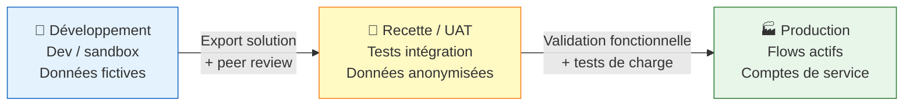
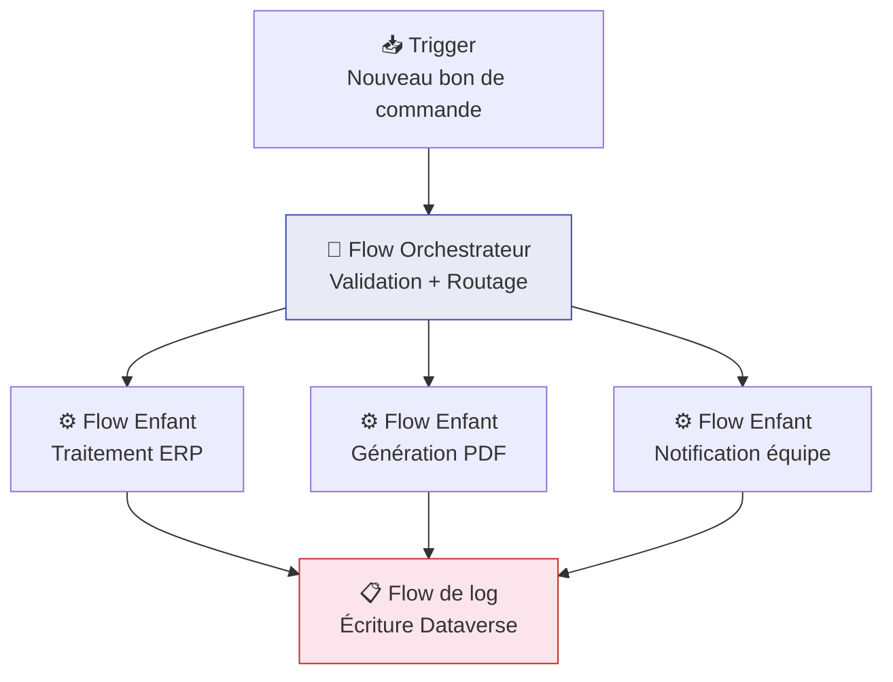
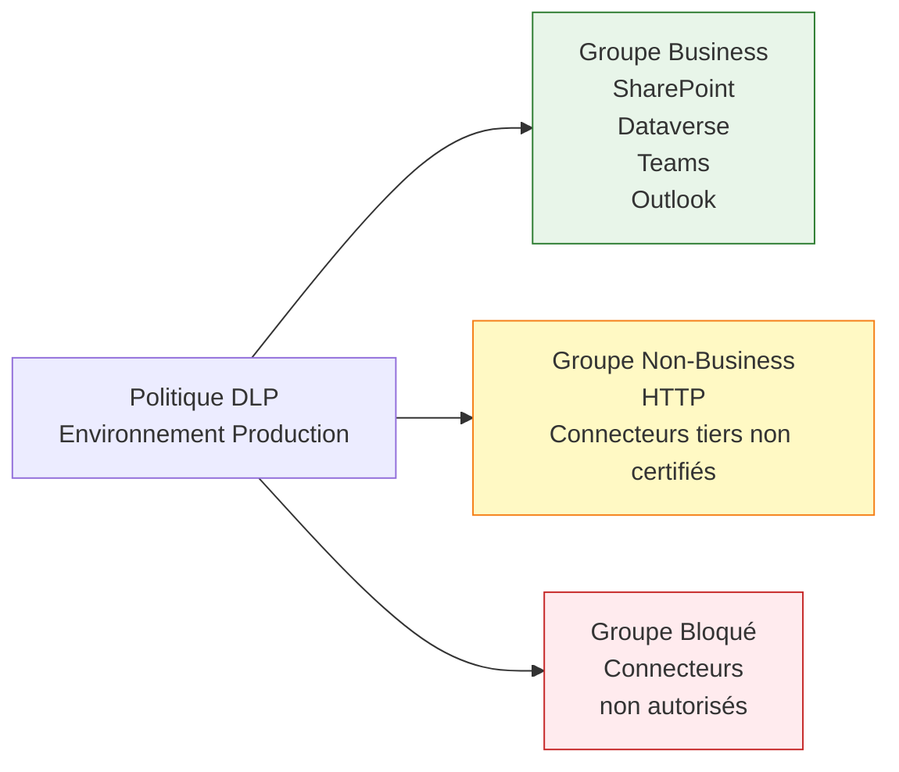
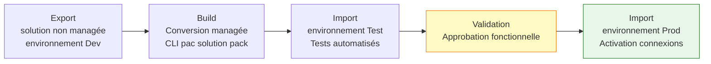

# Architecture Power Automate production

## Objectifs pédagogiques

À l'issue de ce module, vous serez capable de :

1. **Concevoir** une topologie d'environnements adaptée à un cycle de vie de flows en entreprise
2. **Identifier** les points de rupture architecturaux d'une solution Power Automate à l'échelle (limites, couplages, anti-patterns)
3. **Structurer** un flow de production selon les principes de découplage, résilience et observabilité
4. **Appliquer** les stratégies de gouvernance DLP et de gestion des identités de manière cohérente
5. **Décider** quand décomposer un flow monolithique et selon quelle topologie

---

## Mise en situation

Imaginons une équipe IT qui a livré une vingtaine de flows Power Automate en six mois. Les automatisations fonctionnent, les utilisateurs sont contents — jusqu'au jour où un consultant externe modifie un flow de traitement de factures en production, sans environnement de recette, avec ses propres credentials personnels. Le flow plante. Personne ne sait exactement où. Les logs sont épars. L'alerte arrive par email depuis une boîte partagée non consultée depuis trois jours.

Ce scénario se produit dans pratiquement chaque entreprise qui adopte Power Automate sans structure. Ce module ne traite pas de "comment créer un flow" — vous savez faire ça. Il traite de ce qui sépare un flow qui tourne d'une *solution Power Automate industrialisée* : topologie d'environnements, patterns de résilience, gouvernance des identités et des données, observabilité, et gestion du cycle de vie.

---

## Ce que signifie "production" pour Power Automate

Un flow en production, c'est un flow dont l'indisponibilité a un impact métier mesurable. Facturation bloquée, notifications critiques manquées, données non synchronisées — peu importe le domaine. Dès qu'on est dans cette situation, trois exigences émergent naturellement :

**Stabilité** : le flow doit fonctionner de manière prévisible, même quand un connecteur externe est lent, qu'un fichier SharePoint est verrouillé ou qu'un appel HTTP retourne une erreur 429.

**Traçabilité** : en cas de problème, l'équipe doit pouvoir répondre à "qu'est-ce qui a planté, quand, pour quelle donnée ?" en moins de dix minutes, sans fouiller manuellement dans les exécutions.

**Contrôlabilité** : personne ne doit pouvoir modifier un flow de production sans passer par un processus validé, et les connexions utilisées ne doivent pas dépendre d'un compte personnel.

Ces trois exigences dessinent l'architecture. On commence par la fondation.

---

## Topologie d'environnements

### Le problème de l'environnement unique

Beaucoup d'équipes démarrent avec un seul environnement Power Platform — souvent l'environnement par défaut. Tout y cohabite : les expérimentations, les flows semi-terminés, et les automatisations critiques. Un flow en cours de développement peut perturber une connexion partagée utilisée par un flow de production. Les tests modifient des données réelles. Et quand il faut promouvoir une modification, il n'existe pas de procédure — on édite directement.

### La topologie cible

En environnement professionnel, la structure minimale est trois environnements distincts, avec des politiques de promotion formalisées entre eux.



Ce n'est pas une règle arbitraire. Chaque environnement joue un rôle précis :

- **Développement** : espace libre. Les développeurs peuvent casser des choses. Les connexions pointent vers des systèmes de test ou des mocks.
- **Recette** : reproduction fidèle de la production, avec des données représentatives (mais anonymisées). C'est ici qu'on valide que le flow se comporte correctement dans des conditions proches du réel.
- **Production** : accès restreint. Les modifications directes sont interdites. Seul le pipeline ALM peut publier.

💡 Si vous gérez des solutions multimétiers avec des équipes différentes, vous pouvez avoir un environnement par domaine fonctionnel en production (Finance-Prod, RH-Prod…). Mais en dessous de dix flows critiques, trois environnements suffisent.

### Isolation des connexions par environnement

Un piège classique : utiliser le même compte de connexion dans les trois environnements. Si ce compte change son mot de passe ou est désactivé, tous les flows tombent simultanément — y compris en production. La règle est simple : chaque environnement a ses propres connexions, avec des comptes distincts.

| Environnement | Compte recommandé | Accès |
|---|---|---|
| Développement | Compte développeur nominal | Limité aux systèmes de dev |
| Recette | Compte de service dédié UAT | Données anonymisées |
| Production | Compte de service dédié PROD | Accès métier réel, géré par IT |

---

## Structure interne d'un flow de production

### Sortir du flow monolithique

Un flow monolithique fait tout dans une seule séquence : trigger → validation → transformation → appel API → écriture base de données → envoi email. C'est naturel quand on construit, mais problématique en production. Si l'appel API est lent, le timeout peut affecter l'ensemble du flow. Si la logique de transformation évolue, on doit modifier et retester tout le flow.

L'architecture de production favorise la décomposition. On distingue trois patterns courants :

**Pattern Orchestrateur / Travailleurs**

Un flow principal orchestre, des flows enfants exécutent. L'orchestrateur reçoit le déclencheur, découpe le travail, et appelle des flows enfants via "Exécuter un flux enfant" ou HTTP. Concrètement, l'orchestrateur appelle chaque flow enfant avec une action "Run a Child Flow", lui passe les paramètres nécessaires (ex. : ID du contrat, statut attendu), et récupère une réponse structurée (succès/échec + message) pour décider de la suite.



Ce pattern donne deux avantages concrets : on peut modifier un flow enfant sans toucher à l'orchestrateur, et on peut réutiliser un flow enfant depuis d'autres orchestrateurs.

**Pattern File d'attente (Queue-based)**

Pour les volumes importants ou les traitements asynchrones, on ne traite pas directement dans le trigger. On pousse dans une file (Service Bus, stockage de file d'attente Azure, ou une table Dataverse), et un flow séparé consomme la file.

⚠️ Ce pattern est souvent négligé en Power Automate parce que les flows se déclenchent facilement sur tout. Mais quand un flow reçoit 200 déclenchements simultanés, les limites de concurrence peuvent provoquer des files d'attente implicites non contrôlées. Mieux vaut une file explicite qu'une saturation invisible.

**Pattern Compensation (Saga)**

Pour les opérations multi-systèmes qui doivent être cohérentes (écriture ERP + écriture SharePoint + envoi email), Power Automate ne supporte pas les transactions distribuées natives. Le pattern Saga consiste à définir des actions compensatoires : si l'étape N échoue, on exécute les actions d'annulation des étapes 1 à N-1. La compensation n'est pas une gestion d'erreur — c'est une stratégie de cohérence. Un Try/Catch gère l'exception ; une compensation rétablit la cohérence des données entre plusieurs systèmes.

---

## Gestion des erreurs et résilience

### Les portées Try / Catch / Finally en pratique

Chaque action Power Automate expose des paramètres de configuration d'exécution (Run After). Par défaut, les actions suivantes ne s'exécutent que si la précédente a réussi. En production, on configure explicitement ces conditions pour construire des blocs équivalents à un try/catch natif.

```
Séquence standard :
[Portée "Try"]     → Contient la logique métier
[Portée "Catch"]   → RunAfter : Try a échoué OU timed out OU skipped
[Portée "Finally"] → RunAfter : Catch a réussi OU échoué (nettoyage, log)
```

Ce pattern à trois portées est la base de tout flow de production. Sans lui, une erreur dans une action peut silencieusement laisser le flow en état "failed" sans notification ni traçabilité.

Pour le décider rapidement : si votre flow interagit avec plus d'un système externe, le Try/Catch/Finally n'est pas optionnel.

### Politique de retry

Power Automate propose des politiques de retry configurables sur les actions qui appellent des services externes (HTTP, connecteurs tiers). Les valeurs par défaut sont rarement adaptées.

| Scénario | Politique recommandée |
|---|---|
| API REST externe avec rate limiting | Retry exponentiel, 4 tentatives, délai initial 20s |
| Appel Dataverse sous charge | Retry fixe, 3 tentatives, délai 5s |
| Service Bus / file d'attente | Pas de retry sur l'action — laisser la file gérer |
| Email via Exchange | Retry fixe, 2 tentatives — au-delà, alerter plutôt que réessayer |

💡 La politique exponentielle double le délai à chaque tentative. Pour une API qui renvoie du 429 (Too Many Requests), c'est presque toujours le bon choix. Une politique fixe avec délai court aggrave la situation en bombardant le service déjà saturé.

### Timeout et opérations longues

Un flow Power Automate cloud a une durée maximale d'exécution de 30 jours, mais les actions individuelles ont leurs propres limites. Un appel HTTP synchrone timeout à 120 secondes par défaut. Pour les opérations longues, le pattern "fire and forget + polling" est préférable : on déclenche l'opération, on stocke le job ID dans Dataverse, et un flow séparé poll le statut jusqu'à résolution.

---

## Observabilité

### Le problème du "flow qui a l'air de marcher"

Un flow peut exécuter 95 % de ses runs avec succès tout en ratant silencieusement les 5 % restants — souvent les cas les plus importants. Sans observabilité structurée, on découvre le problème quand un utilisateur appelle le support.

### Stratégie de logging centralisé

En production, chaque exécution significative doit écrire dans un registre centralisé. Dataverse est le choix naturel dans l'écosystème Power Platform : il est disponible, requêtable, et visible depuis Power BI ou Power Apps.

La table de log minimale contient :

| Colonne | Type | Utilité |
|---|---|---|
| FlowName | Texte | Identifier l'automatisation |
| RunId | Texte | Corréler avec l'historique natif |
| Statut | Choix (Succès/Échec/Avertissement) | Filtrage rapide |
| Message | Texte long | Détail de l'erreur ou du traitement |
| EntitéConcernée | Texte | ID de la facture, du contrat, etc. |
| Horodatage | Date/Heure | Chronologie |
| Durée | Nombre | Détection des dégradations de performance |

Le flow de log est un flow enfant appelé depuis chaque portée "Finally". Il ne doit jamais bloquer le flow parent — son appel se fait en mode fire and forget avec un délai d'expiration court.

### Alerting proactif

Les logs sans alertes ne servent à rien si personne ne les consulte. En production, on configure des alertes sur deux niveaux :

- **Alerte temps réel** : un flow de monitoring déclenché sur Dataverse envoie une notification Teams si `Statut = Échec` est détecté sur un flow critique. La condition peut inclure un seuil : plus de 3 échecs en 1h = escalade automatique.
- **Rapport quotidien** : un flow programmé à 8h envoie un récapitulatif du volume d'exécutions, du taux de succès, et des erreurs récurrentes de la veille.

⚠️ Ne jamais envoyer les alertes depuis le même compte de service que celui qui exécute les flows métier. Si le compte est bloqué, l'alerte ne part pas — exactement quand on en a le plus besoin.

---

## Gouvernance des identités et des connexions

### Connexions partagées vs. connexions de service

En développement, chaque maker utilise ses propres connexions — c'est normal. En production, ce modèle est inacceptable. Si l'employé quitte l'entreprise, ses connexions deviennent invalides et tous les flows qui en dépendent tombent.

La règle de production : **toute connexion utilisée dans un flow de production est portée par un compte de service dédié**, sans MFA interactif, géré par l'IT.

Deux mécanismes complémentaires :

**Service Principal (Azure AD App Registration)** — Pour les connecteurs qui supportent l'authentification OAuth/AAD (Dataverse, SharePoint, Teams…), on enregistre une application dans Azure AD et on l'utilise comme identité du flow. Le principal avantage : rotation des secrets sans impact sur les flows, et traçabilité des actions dans les logs AAD.

**Connexions partagées dans une solution** — Pour les connecteurs qui ne supportent pas les service principals natifs (certains connecteurs tiers), on crée la connexion avec un compte de service dédié et on l'associe à la solution. Les membres de l'équipe peuvent utiliser la connexion sans en voir les credentials.

🧠 **Concept clé** — Un flow Power Automate s'exécute toujours dans le contexte d'une identité. Si cette identité est un utilisateur nominal, le flow hérite de ses droits — et de ses contraintes (expiration de session, MFA, départ de l'entreprise). Un compte de service sans MFA interactif, avec des droits minimalistes et un cycle de vie contrôlé, est architecturalement plus robuste qu'un utilisateur nominal — et ce n'est pas contre-intuitif, c'est une exigence de production.

### Politique DLP et impact sur l'architecture

Les politiques DLP (Data Loss Prevention) définissent quels connecteurs peuvent coexister dans un même flow. Elles s'appliquent au niveau de l'environnement et sont décidées par l'administrateur Power Platform.

En pratique, une DLP mal configurée peut forcer la refactorisation d'un flow qui semblait simple. Par exemple, si votre DLP place SharePoint dans le groupe "Business" et un connecteur HTTP personnalisé dans "Non-Business", un flow qui utilise les deux sera bloqué — et il faudra le décomposer en deux flows distincts avec un mécanisme de liaison (Dataverse ou Service Bus).

La bonne approche : **designer les flows en connaissant les DLP de votre environnement cible**, pas l'inverse. Avant de commencer un développement, demandez à l'administrateur la liste des connecteurs autorisés en production.



💡 Si vous avez besoin d'un connecteur HTTP pour appeler une API interne, demandez à l'administrateur de créer un **connecteur personnalisé certifié** et de le placer dans le groupe Business. C'est plus de travail initial, mais c'est la seule façon d'appeler des APIs custom sans violer les DLP — et sans devoir refactoriser le flow après déploiement.

---

## Limites de la plateforme et stratégies d'adaptation

### Limites à connaître absolument

Power Automate est une plateforme managée — Microsoft gère l'infrastructure, mais en contrepartie, des limites s'appliquent. Les découvrir en production après avoir ignoré les signaux en développement est un classique douloureux.

| Limite | Valeur | Impact |
|---|---|---|
| Durée max d'exécution (flow cloud) | 30 jours | Flows de longue durée → préférer polling |
| Actions par exécution (plan standard) | 100 000 | Attention aux boucles sur grands volumes |
| Appels API par connexion (30 jours) | Variable selon plan / connecteur | Surveiller les flows haute fréquence |
| Concurrence par flow (cloud) | Configurable 1–50 | Défaut : 25 runs simultanés max |
| Taille du payload HTTP | 100 MB | Chunking obligatoire pour fichiers lourds |
| Taille des variables en mémoire | 256 MB | Ne pas construire de gros tableaux en mémoire |

⚠️ La limite la plus souvent ignorée est le throttling des connecteurs. SharePoint Online applique des quotas d'appels. Un flow qui traite 500 fichiers en boucle sans délai entre les appels va recevoir des 429 — et si la politique de retry est agressive, il aggrave la situation au lieu de la résoudre.

### Stratégies d'adaptation aux volumes

**Batching** : au lieu de traiter chaque élément individuellement, regrouper les appels. Dataverse supporte les opérations batch via l'action "Exécuter des modifications par lot". SharePoint supporte les requêtes batch via Graph API.

**Délais contrôlés** : introduire un `Delay` de 1 à 2 secondes entre les itérations dans les boucles qui appellent des services externes. C'est contre-intuitif (on ralentit volontairement), mais bien plus stable qu'un throttling subi qui bloque tout le flow pendant plusieurs minutes.

**Découplage par file** : pour les volumes supérieurs à quelques centaines d'éléments par déclenchement, sortir du modèle "trigger → boucle synchrone" et passer par une file de messages. Le flow de production consomme la file à un rythme contrôlé, indépendamment du volume entrant.

---

## Gestion du cycle de vie (ALM)

### Solutions managées : la règle, pas l'exception

En production, tout flow doit être packagé dans une **solution managée**. Une solution non managée en production, c'est un flow qu'on peut modifier directement — ce qui supprime toute traçabilité et contourne le processus de validation.

Les solutions managées ne peuvent pas être modifiées directement dans l'environnement cible. Pour modifier un flow, on modifie la solution non managée en développement, on exporte en managé, et on importe en production. C'est une contrainte voulue, pas un bug.

### Pipeline de promotion

Un pipeline de promotion minimal pour Power Automate ressemble à ceci :



Les outils du pipeline : **Power Platform CLI** (`pac`) pour l'export/import en ligne de commande, intégrable dans Azure DevOps ou GitHub Actions. Les variables d'environnement Power Platform permettent de configurer les URLs, IDs et paramètres qui diffèrent entre environnements sans modifier le flow lui-même.

🧠 **Concept clé** — Les variables d'environnement ne sont pas des variables de flow. Elles sont définies au niveau de la solution et injectées à l'import. Un flow qui les utilise peut être promu sans modification entre Dev, Test et Prod — seule la valeur de la variable change dans l'environnement cible. Types disponibles : texte, nombre, booléen, JSON, secret (stocké dans Azure Key Vault).

---

## Cas réel : architecture d'un flow de traitement de contrats

**Contexte** : une entreprise de services gère 300 à 500 contrats par mois. Chaque nouveau contrat déposé dans SharePoint doit être enregistré dans le CRM (Dynamics 365), notifié à l'équipe commerciale via Teams, et archivé dans Azure Blob Storage.

**Architecture initiale (anti-pattern)** : un seul flow déclenché sur SharePoint, qui fait tout séquentiellement. Problème découvert en production : si Dynamics 365 est lent lors d'une maintenance, le flow timeout, le fichier n'est pas archivé, et l'équipe commerciale reçoit la notification mais le CRM n'est pas à jour. Taux d'échec constaté : **8 %** des traitements mensuels, soit 24 à 40 contrats mal traités par mois. Temps moyen de détection (MTTR) : **3 jours**, car les erreurs n'étaient visibles que sur signalement utilisateur.

**Architecture cible** :

1. **Flow trigger** : détecte le nouveau fichier SharePoint, valide les métadonnées, pousse un message dans une table Dataverse "file d'attente contrats" avec le statut "À traiter". Durée : < 5 secondes. Ce flow ne peut pas échouer sur un problème aval — il ne fait que réceptionner.

2. **Flow orchestrateur** : déclenché sur Dataverse (nouveau contrat à traiter), appelle trois flows enfants en parallèle (Dynamics, Teams, Blob). Gère les compensations si l'un échoue — si Dynamics échoue après que Teams a notifié, une action compensatoire marque le contrat "à retraiter" et alerte l'IT.

3. **Flow monitoring** : s'exécute toutes les heures, vérifie les contrats en statut "À traiter" depuis plus de 2h, et alerte le responsable IT via Teams.

**Résultats mesurables après 60 jours** : taux d'échec réduit de **8 % à 0,3 %** (soit 1 à 2 contrats par mois au lieu de 40), MTTR passé de **3 jours à moins de 45 minutes** grâce au monitoring automatique, et coût de maintenance réduit d'environ **40 %** (une demi-journée de diagnostic mensuelle éliminée). La promotion d'une modification de la logique Dynamics n'a eu aucun impact sur le flow trigger ni sur le flow Teams — premier déploiement sans incident.

---

## Choisir le bon pattern : guide de décision

Avant d'architecturer un flow, trois questions suffisent à orienter le choix :

| Question | Si oui → Pattern |
|---|---|
| Plus de 3 systèmes impliqués ou logique réutilisable ? | Orchestrateur / Travailleurs |
| Volume > 100 éléments par déclenchement ou pics imprévus ? | File d'attente (Queue-based) |
| Opérations multi-systèmes devant rester cohérentes ? | Compensation (Saga) |

Ces patterns ne sont pas exclusifs. Le cas réel ci-dessus combine les trois : file d'attente pour absorber les pics, orchestrateur pour découpler les traitements, compensation pour gérer les incohérences entre systèmes.

---

## Bonnes pratiques et pièges à éviter

**Nommer les actions de manière explicite.** Un flow de production avec des actions nommées "Condition", "Condition 2", "Appliquer à chaque" est illisible dans les logs d'exécution. Renommer chaque action avec un nom fonctionnel ("Vérifier si contrat existe dans CRM", "Écrire log succès") n'est pas cosmétique — c'est de la traçabilité opérationnelle.

**Ne jamais stocker de secrets dans les flows.** Les expressions, variables, et même les valeurs de paramètres des actions sont visibles dans l'historique d'exécution. Les credentials, tokens et clés API doivent passer par Azure Key Vault (via un connecteur dédié) ou des variables d'environnement de type Secret.

**Tester le comportement en cas d'échec, pas seulement le chemin nominal.** Avant de passer en production, tester volontairement : que se passe-t-il si SharePoint est inaccessible ? Si Dataverse retourne une erreur 503 ? Si le payload est malformé ? Les flows de production doivent se comporter de manière déterministe même sur les chemins d'erreur.

**Documenter les dépendances.** Un flow de production dépend de connexions, de comptes de service, de tables Dataverse, et parfois d'autres flows. Cette documentation n'existe nulle part dans Power Automate — elle doit être maintenue manuellement ou générée via les outils du CoE Starter Kit.

⚠️ Le CoE Starter Kit fournit un inventaire automatique des flows, connexions et propriétaires d'un tenant. En production, c'est un outil de gouvernance indispensable — mais son déploiement et sa configuration dépassent le cadre de ce module.

---

## Résumé

Un flow Power Automate qui tourne en développement et un flow de production sont deux objets architecturalement différents. La différence ne tient pas à la complexité du flow lui-même, mais à la structure qui l'entoure : environnements isolés avec promotion formalisée, connexions portées par des comptes de service, gestion explicite des erreurs et de la compensation, observabilité centralisée, et respect des limites de la plateforme.

Les patterns clés à retenir : le modèle orchestrateur/travailleurs pour la maintenabilité, la file d'attente pour la résilience aux volumes, les portées Try/Catch/Finally pour la gestion d'erreur, et les solutions managées pour l'ALM. En creux, l'architecture Power Automate production est une discipline de découplage : découpler le trigger du traitement, le traitement de la notification, le code de la configuration, l'identité du développeur de l'identité d'exécution.

Le module suivant abordera l'architecture Power BI — qui partage plusieurs de ces principes (environnements, gouvernance des connexions, cycle de vie) mais avec des contraintes propres au reporting et à la distribution de données.

---

<!-- snippet
id: pa_environments_topology
type: concept
tech: power automate
level: advanced
importance: high
format: knowledge
tags: environnements, alm, production, gouvernance, topologie
title: Topologie d'environnements Power Automate production
content: Minimum 3 environnements distincts : Dev (données fictives, connexions dev), Test/UAT (données anonymisées, compte service UAT), Prod (accès restreint, compte service prod). Chaque environnement a ses propres connexions — un compte partagé entre envs crée un point de défaillance unique. La promotion se fait uniquement via solution managée exportée/importée, jamais par modification directe en prod.
description: Un env unique = pas de traçabilité, pas de séparation des risques. Les 3 envs + solutions managées sont la structure minimale acceptable en entreprise.
-->

<!-- snippet
id: pa_try_catch_finally
type: concept
tech: power automate
level: advanced
importance: high
format: knowledge
tags: gestion-erreur, resilience, portees, run-after
title: Pattern Try / Catch / Finally avec les portées Power Automate
content: Créer 3 portées : "Try" (logique métier), "Catch" (RunAfter Try = échoué OU timeout OU ignoré), "Finally" (RunAfter Catch = réussi OU échoué — pour logs et nettoyage). Sans ce pattern, une action en échec silencieux laisse le flow en état failed sans alerte ni compensation. Règle de décision : si le flow interagit avec plus d'un système externe, ce pattern n
