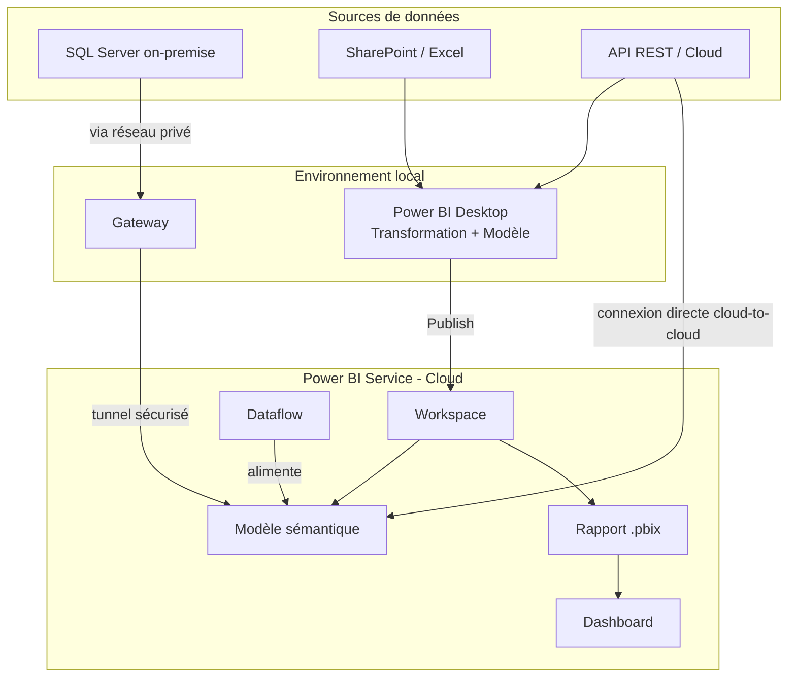

# Architecture Power BI

## Objectifs pédagogiques

À l'issue de ce module, tu seras capable de :

- Identifier les composants majeurs de l'architecture Power BI et comprendre leur rôle respectif
- Distinguer les deux modes de déploiement (Power BI Service vs Desktop) et savoir lequel est concerné à chaque étape
- Expliquer comment la donnée circule depuis sa source jusqu'au rapport final
- Comprendre pourquoi une Gateway est nécessaire et dans quels cas s'en passer est possible
- Situer Power BI dans l'écosystème Power Platform et ses points d'intégration avec Dataverse

---

## Mise en situation

Imagine que tu rejoins une équipe Data dans une entreprise mid-size. Ton responsable te demande de "connecter la base SQL on-premise aux rapports Power BI publiés sur le portail interne". Tu ouvres Power BI Desktop, tu te connectes à la base, ça marche. Tu publies. Le lendemain matin, les rapports ne se rafraîchissent plus. Les données sont figées à hier soir.

Le problème n'est pas dans ton rapport — il est dans l'architecture. Tu n'as pas configuré de Gateway. Le service cloud ne peut pas atteindre ta base SQL qui vit derrière le pare-feu de l'entreprise.

Ce scénario arrive constamment à ceux qui découvrent Power BI par l'outil (Desktop) sans avoir compris l'architecture sous-jacente. Ce module te donne la carte avant de te lancer sur le terrain.

---

## Ce que c'est et pourquoi ça existe

Power BI n'est pas un seul outil — c'est un écosystème composé de plusieurs pièces qui travaillent ensemble. La confusion vient du fait que le nom "Power BI" désigne à la fois le produit global, l'application desktop, et le service cloud. En réalité, il faut penser Power BI comme une chaîne : on **prépare** la donnée, on la **modélise**, on la **visualise**, et on la **partage**.

L'architecture existe pour une raison simple : les données vivent dans des dizaines d'endroits différents (SQL Server, Excel, SharePoint, Salesforce, API REST…), elles ont des volumes variables, et les personnes qui en ont besoin sont dispersées dans l'organisation. Power BI est conçu pour absorber cette diversité côté entrée, et produire une expérience unifiée côté consommation.

🧠 **Concept clé** — Power BI sépare volontairement la **préparation des données** (Power Query), la **modélisation** (le modèle sémantique), et la **présentation** (les rapports et dashboards). Cette séparation n'est pas arbitraire : elle permet de réutiliser un même modèle dans plusieurs rapports, sans dupliquer la logique métier.

---

## Les composants : qui fait quoi

Voici les pièces du puzzle et leur rôle réel dans la chaîne.

| Composant | Rôle | Où ça vit |
|---|---|---|
| **Power BI Desktop** | Outil auteur : connexion aux sources, transformation, modélisation, création des visuels | Machine locale |
| **Power BI Service** | Plateforme cloud de publication, partage, rafraîchissement planifié, collaboration | Cloud Microsoft (app.powerbi.com) |
| **Modèle sémantique** (ex-Dataset) | Le "cœur" : tables, relations, mesures DAX — ce qui alimente les rapports | Service (une fois publié) |
| **Dataflow** | Transformation ETL réutilisable, stockée dans le cloud — alternative à la requête locale | Service |
| **Gateway** | Passerelle entre le cloud Power BI et les sources de données on-premise ou réseau privé | Machine locale ou serveur |
| **Capacité (Premium/Fabric)** | Ressources de calcul dédiées pour les rafraîchissements lourds, la pagination, l'IA | Cloud Microsoft |
| **Workspace** | Espace de collaboration pour publier, organiser et partager le contenu | Service |

La relation entre ces composants mérite un schéma.

Ce qui est important à lire dans ce schéma : la Gateway n'est nécessaire que pour les sources **on-premise ou réseau privé**. Une source cloud (comme une API publique ou SharePoint Online) peut être interrogée directement par le Service, sans passer par ta machine.

---

## Comment la donnée circule

Suivons un trajet complet, de la source au rapport final.

**Étape 1 — Connexion et transformation (Desktop)**
Tu ouvres Power BI Desktop et tu te connectes à ta source. Power Query (le moteur de transformation) charge un aperçu de la donnée et te permet de la nettoyer, filtrer, fusionner. À ce stade, tout se passe en local. La requête est enregistrée comme une série d'étapes — elle ne s'exécute pas en continu, elle s'exécutera lors de chaque rafraîchissement.

**Étape 2 — Modélisation**
Une fois les tables chargées dans le modèle, tu crées des relations entre elles (comme une base relationnelle), tu ajoutes des mesures DAX (ex : `Chiffre d'affaires = SUM(Ventes[Montant])`), et tu organises les colonnes. C'est là que réside la vraie valeur ajoutée analytique.

**Étape 3 — Publication**
Tu publies le fichier `.pbix` vers un Workspace du Service. Power BI sépare automatiquement le **rapport** (les visuels) du **modèle sémantique** (les données et mesures). Ce sont deux objets distincts dans le Workspace — et c'est voulu : plusieurs rapports peuvent consommer le même modèle.

**Étape 4 — Rafraîchissement planifié**
Le Service a maintenant le modèle, mais pour que les données restent à jour, il faut le rafraîchir régulièrement. C'est ici qu'intervient la Gateway si la source est on-premise, ou une connexion directe si la source est cloud.

**Étape 5 — Consommation**
Les utilisateurs accèdent aux rapports depuis un navigateur, Teams, ou l'app mobile — sans jamais avoir besoin de Power BI Desktop.

💡 **Astuce** — Le fichier `.pbix` publié sur le Service **n'est pas ce que les utilisateurs voient**. Ils voient le rapport et le modèle vivants dans le Workspace. Le `.pbix` reste l'artefact de développement, à versionner dans ton dépôt Git (ou dans un projet Fabric si tu es dans cet environnement).

---

## Le modèle sémantique : la pièce centrale

Si tu ne retiens qu'une chose de ce module, c'est celle-là. Le modèle sémantique est le **cœur de l'architecture Power BI**. C'est lui qui stocke les données (en mémoire, compressées avec le moteur VertiPaq), les relations, et toutes les mesures calculées.

Pourquoi c'est important architecturalement ? Parce que la même "vérité métier" doit être partagée entre tous les rapports. Si le calcul du chiffre d'affaires est défini dans le modèle, tous les rapports qui l'utilisent auront la même valeur — pas chacun sa propre formule Excel. C'est le principe de **single source of truth** appliqué à la couche analytique.

⚠️ **Erreur fréquente** — Beaucoup de débutants créent un `.pbix` par rapport, chacun avec ses propres requêtes et mesures. Résultat : 5 rapports, 5 définitions légèrement différentes du "chiffre d'affaires". En production, cela génère des incohérences et un cauchemar de maintenance. L'approche correcte : un modèle sémantique centralisé, plusieurs rapports qui le consomment via "live connection" ou "DirectQuery to dataset".

---

## La Gateway : le pont vers l'on-premise

La Gateway est souvent présentée comme un détail technique, mais c'est en réalité un choix architectural structurant. Elle répond à un problème simple : **le cloud ne peut pas traverser ton pare-feu pour atteindre une base de données interne**. La Gateway s'installe dans ton réseau, maintient une connexion sortante vers Azure Service Bus, et joue le rôle d'intermédiaire.

Il existe deux variantes :

- **Gateway standard (Enterprise)** — installée sur un serveur dédié, supporte plusieurs utilisateurs et plusieurs sources de données, configurable via le Service. C'est celle qu'on utilise en entreprise.
- **Gateway personnelle** — installée sur la machine d'un utilisateur, pour un usage individuel uniquement. Non recommandée pour la production.

🧠 **Concept clé** — La Gateway ne transporte pas les données brutes en continu. Lors d'un rafraîchissement, le Service envoie la **requête** à la Gateway (par exemple, la requête SQL), la Gateway l'exécute contre la source, récupère les résultats, et les renvoie au Service pour mettre à jour le modèle. C'est une architecture pull-on-demand, pas un flux permanent.

---

## Modes de stockage : Import, DirectQuery, Live Connection

C'est un choix architectural qui a des conséquences directes sur les performances et la fraîcheur des données.

**Import** — Les données sont copiées et stockées dans le modèle VertiPaq en mémoire. Les rapports sont ultra-rapides parce que tout est déjà chargé. Limite : les données ne sont fraîches qu'après un rafraîchissement (au mieux toutes les 30 minutes avec une licence Pro, ou en continu avec Premium/Fabric).

**DirectQuery** — Chaque interaction avec le rapport génère une requête en temps réel vers la source. Les données sont toujours fraîches, mais les performances dépendent entièrement de la source. Inadapté aux sources lentes ou très volumineuses sans optimisation préalable.

**Live Connection** — Connexion à un modèle Analysis Services ou à un modèle sémantique Power BI déjà publié. Le rapport ne "possède" pas les données — il délègue tout au modèle central. Utile pour décorréler développement du modèle et développement du rapport.

| Critère | Import | DirectQuery | Live Connection |
|---|---|---|---|
| Fraîcheur des données | Rafraîchissement planifié | Temps réel | Temps réel (via modèle central) |
| Performances des visuels | Très élevées | Dépend de la source | Élevées |
| Taille maximale du modèle | 1 Go (Pro) / illimité (Premium) | N/A | N/A |
| Transformation Power Query | Oui | Limitée | Non (modèle déjà construit) |
| Usage recommandé | Cas général | Données volatiles, temps réel | Gouvernance centralisée du modèle |

💡 **Astuce** — Pour la grande majorité des projets en PME ou mid-market, le mode **Import avec rafraîchissement toutes les heures** est le bon choix de départ. DirectQuery se justifie si le métier a besoin de voir des données mises à jour à la minute — par exemple un tableau de bord de production industrielle.

---

## Workspaces et organisation du contenu

Dans le Service, tout le contenu est organisé en **Workspaces**. Pense à un Workspace comme à un dossier de projet partagé, avec gestion des droits.

Il existe deux types :
- **Mon espace de travail** — personnel, non partageable, pour tester et développer.
- **Workspaces partagés** — collaboratifs, avec des rôles (Admin, Membre, Contributeur, Lecteur).

En production, on n'utilise jamais "Mon espace de travail" pour publier du contenu destiné à d'autres. On crée un Workspace dédié par domaine ou par projet.

Les **Apps Power BI** permettent d'aller plus loin : tu paquètes un ensemble de rapports et dashboards depuis un Workspace, et tu le distribues à une audience large avec une interface simplifiée. Les utilisateurs finaux consomment l'App — ils ne voient pas le Workspace source.

---

## Power BI et l'écosystème Power Platform

Power BI s'intègre naturellement dans la Power Platform. Les points de contact principaux :

- **Dataverse** — Power BI se connecte nativement à Dataverse via un connecteur dédié. Les tables créées dans Power Apps sont directement interrogeables depuis un rapport Power BI.
- **Power Apps** — Un visuel Power Apps peut être embarqué dans un rapport Power BI, permettant d'agir sur la donnée directement depuis le rapport (ex : corriger une valeur, valider un enregistrement).
- **Power Automate** — Un flow peut être déclenché depuis un rapport Power BI (via le bouton d'action dans un visuel), ou planifier des actions en réaction à des alertes de données.

⚠️ **Erreur fréquente** — Power BI **n'est pas un outil de saisie de données**. Il est conçu pour lire et visualiser. Quand on voit des équipes créer des formulaires de saisie dans Power BI, c'est presque toujours un signe que Power Apps aurait dû être utilisé à la place.

---

## Cas réel : tableau de bord RH dans une entreprise de 800 salariés

**Contexte** — Le service RH veut un tableau de bord des effectifs, turnover, et absentéisme, alimenté par un SIRH on-premise (SQL Server) et des fichiers Excel stockés sur SharePoint.

**Architecture retenue :**

1. Une **Gateway Enterprise** installée sur un serveur dans la DMZ de l'entreprise, configurée pour accéder au SQL Server.
2. Un **Dataflow** dans le Service pour normaliser les exports Excel SharePoint (évite de multiplier les connexions depuis Desktop).
3. Un **modèle sémantique central** en mode Import, rafraîchi toutes les nuits à 02h00, qui consolide SQL Server (via Gateway) et le Dataflow.
4. Trois rapports distincts publiés dans un Workspace "RH Analytics" — un pour la direction, un pour les managers opérationnels, un pour les RH eux-mêmes.
5. Une **App Power BI** distribuée aux 45 managers, avec uniquement les rapports qui les concernent.

**Bénéfices mesurés :** 
- Préparation du reporting mensuel passée de 4 heures à 20 minutes
- Zéro discordance entre les chiffres présentés en CODIR et ceux utilisés par les managers
- Les RH peuvent modifier le modèle sémantique sans toucher aux rapports des managers

---

## Bonnes pratiques et pièges à éviter

**Séparer le modèle du rapport dès le départ.** Un `.pbix` qui mélange transformations complexes, modèle riche et 20 pages de visuels devient rapidement ingérable. Penser en couches : données → modèle → rapport.

**Ne jamais développer directement dans "Mon espace de travail".** Ce n'est pas un environnement de production. Tout ce qui est destiné à être partagé doit vivre dans un Workspace nommé.

**La Gateway, c'est de l'infrastructure.** Elle doit être sur un serveur stable, supervisée, et ne pas dépendre du PC d'un développeur. Si la machine s'éteint, les rafraîchissements s'arrêtent silencieusement.

**Limiter les transformations lourdes dans Desktop.** Si une transformation peut être faite en amont (dans la base de données, via une vue SQL, ou dans un Dataflow), c'est préférable. Power Query en mode Import charge tout en mémoire — plus la logique est en aval, plus le rafraîchissement est lent.

**Un modèle sémantique = une vérité.** Dès que plusieurs rapports couvrent le même périmètre métier, ils doivent partager le même modèle. Dupliquer les modèles est le début de la dette technique analytique.

---

## Résumé

Power BI est une chaîne composée de pièces distinctes : Desktop (auteur local), Service (publication et partage cloud), Gateway (pont vers les données internes), et le modèle sémantique (cœur de la vérité analytique). Comprendre cette architecture, c'est comprendre pourquoi un rapport peut être parfait en local et défaillant en production. Le mode de stockage — Import, DirectQuery ou Live Connection — est un choix architectural qui conditionne les performances et la fraîcheur des données pour toute la durée de vie du projet. Dans l'écosystème Power Platform, Power BI joue le rôle de la couche de lecture et visualisation, en complément de Dataverse pour le stockage et de Power Apps pour la saisie. Le module suivant entrera dans le détail de Power Query, le moteur de transformation qui se trouve à l'entrée de cette chaîne.

---

<!-- snippet
id: powerbi_architecture_composants
type: concept
tech: Power BI
level: beginner
importance: high
format: knowledge
tags: architecture,service,desktop,modele,workspace
title: Les 5 composants clés de l'architecture Power BI
content: Desktop (auteur local) → publie vers le Service (cloud). Le Service stocke 2 objets distincts : le modèle sémantique (données + mesures DAX) et le rapport (visuels). La Gateway fait le pont vers les sources on-premise. Les Workspaces organisent et partagent le contenu. Ces 5 pièces forment une chaîne — défaillance d'un maillon = problème en production.
description: Architecture en 5 composants : Desktop, Service, Modèle sémantique, Gateway, Workspace — chacun a un rôle précis dans la chaîne.
-->

<!-- snippet
id: powerbi_gateway_role
type: concept
tech: Power BI
level: beginner
importance: high
format: knowledge
tags: gateway,on-premise,rafraichissement,reseau
title: Comment fonctionne la Gateway Power BI
content: La Gateway s'installe dans ton réseau privé et maintient une connexion sortante vers Azure Service Bus. Lors d'un rafraîchissement, le Service envoie la requête à la Gateway, qui l'exécute contre la source on-premise, puis renvoie les résultats. C'est un mécanisme pull-on-demand — pas un flux continu. Sans Gateway configurée, les données restent figées à la dernière publication manuelle.
description: La Gateway exécute les requêtes contre les sources internes et renvoie les résultats au Service — pas de flux continu, seulement au moment du rafraîchissement.
-->

<!-- snippet
id: powerbi_mode_import_directquery
type: concept
tech: Power BI
level: beginner
importance: high
format: knowledge
tags: import,directquery,performances,fraicheur
title: Import vs DirectQuery — le bon choix par défaut
content: Import : données copiées en mémoire (VertiPaq), visuels ultra-rapides, fraîcheur limitée au dernier rafraîchissement. DirectQuery : chaque visuel génère une requête temps réel vers la source, données toujours fraîches mais performances dépendent de la source. Pour 80% des projets en entreprise, Import + rafraîchissement horaire est le bon choix de départ.
description: Import = copie en mémoire (rapide, rafraîchissement planifié). DirectQuery = requête temps réel (frais, mais lent si source sous-optimisée).
-->

<!-- snippet
id: powerbi_modele_centralise
type: warning
tech: Power BI
level: beginner
importance: high
format: knowledge
tags: modele-semantique,gouvernance,dette-technique
title: Un modèle par domaine — pas un par rapport
content: Piège : créer un .pbix par rapport, chacun avec ses propres requêtes et mesures DAX. Conséquence : 5 rapports avec 5 définitions légèrement différentes du "chiffre d'affaires" — incohérences en CODIR. Correction : centraliser la logique dans un modèle sémantique partagé, et connecter les rapports dessus via Live Connection.
description: Chaque rapport avec son propre modèle → incohérences entre rapports. Centraliser la logique métier dans un modèle sémantique unique.
-->

<!-- snippet
id: powerbi_workspace_production
type: warning
tech: Power BI
level: beginner
importance: medium
format: knowledge
tags: workspace,production,partage,gouvernance
title: Ne jamais publier en production dans "Mon espace de travail"
content: Piège : publier un rapport destiné à d'autres dans "Mon espace de travail". Conséquence : impossible à partager proprement, droits non gérables, contenu lié au compte personnel. Correction : créer un Workspace dédié par projet ou domaine métier dès que le contenu doit être partagé.
description: "Mon espace de travail" est personnel et non partageable — tout contenu destiné à une audience doit être dans un Workspace nommé.
-->

<!-- snippet
id: powerbi_gateway_type
type: tip
tech: Power BI
level: beginner
importance: medium
format: knowledge
tags: gateway,enterprise,production,infrastructure
title: Choisir la Gateway Enterprise pour la production
content: Utiliser la Gateway Enterprise (pas personnelle) dès qu'un rafraîchissement doit fonctionner sans intervention humaine. L'installer sur un serveur stable et supervisé — pas sur le PC du développeur. Si la machine s'éteint ou redémarre, les rafraîchissements s'arrêtent silencieusement sans erreur visible dans le Service.
description: Gateway Enterprise sur serveur dédié pour la production — la Gateway personnelle s'arrête avec le PC de l'utilisateur.
-->

<!-- snippet
id: powerbi_dataverse_connecteur
type: tip
tech: Power BI
level: beginner
importance: medium
format: knowledge
tags: dataverse,integration,power-apps,connecteur
title: Power BI se connecte nativement à Dataverse
content: Le connecteur Dataverse dans Power BI Desktop permet d'interroger directement les tables créées dans Power Apps ou via le portail Maker. Aucune configuration supplémentaire si tu es dans le même tenant. Utile pour croiser les données opérationnelles (Dataverse) avec des données externes dans un seul rapport.
description: Connecteur natif Dataverse dans Desktop — accès direct aux tables Power Apps sans configuration réseau, dans le même tenant M365.
-->

<!-- snippet
id: powerbi_pbix_artefact
type: tip
tech: Power BI
level: beginner
importance: medium
format: knowledge
tags: pbix,versionning,publication,artefact
title: Le .pbix est un artefact de développement, pas le rapport live
content: Après publication, les utilisateurs consomment le rapport et le modèle vivants dans le Workspace — pas le .pbix. Le fichier .pbix reste l'artefact de développement à versionner (Git ou Fabric workspace). Modifier directement dans le Service sans mettre à jour le .pbix source crée une désynchronisation dangereuse.
description: Le .pbix est la source de vérité du développeur — après publication, rapport et modèle sont des objets indépendants dans le Workspace.
-->

<!-- snippet
id: powerbi_powerbi_pas_saisie
type: warning
tech: Power BI
level: beginner
importance: medium
format: knowledge
tags: power-apps,saisie,perimetre,erreur-usage
title: Power BI est un outil de lecture, pas de saisie
content: Piège : construire des formulaires ou des workflows de validation dans Power BI parce que "les utilisateurs sont déjà là". Conséquence : contournements fragiles, maintenance complexe, UX dégradée. Correction : Power BI = visualisation et lecture. Pour toute saisie ou action sur la donnée, utiliser Power Apps — quitte à l'embarquer comme visuel dans le rapport.
description: Power BI lit et visualise — il ne modifie pas les données. Pour la saisie, Power Apps s'intègre comme visuel dans un rapport Power BI.
-->
