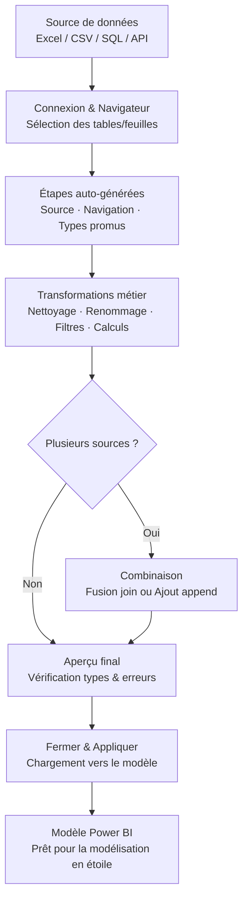

# Power Query fondamental

## Objectifs pédagogiques

À l'issue de ce module, vous serez capable de :

1. **Expliquer** le rôle de Power Query dans la chaîne de traitement des données Power BI
2. **Connecter** Power Query à une source de données (fichier Excel, CSV, base de données)
3. **Appliquer** les transformations essentielles : renommage, filtrage, types, colonnes calculées
4. **Lire et interpréter** les étapes appliquées générées automatiquement
5. **Identifier** les erreurs de chargement courantes et corriger leur cause

---

## Mise en situation

Vous rejoignez une PME de distribution qui centralise ses ventes dans trois fichiers Excel — un par région. Chaque fichier a été rempli par une équipe différente : majuscules ici, minuscules là, des dates au format "01-janv-2024" dans un fichier et "2024-01-01" dans l'autre, une colonne "Montant HT" qui s'appelle "CA net" dans le troisième.

Le responsable BI veut un rapport Power BI consolidé. Mais avant de modéliser quoi que ce soit, il faut nettoyer, harmoniser et fusionner ces données. C'est exactement là qu'intervient Power Query.

---

## Contexte : pourquoi Power Query existe

Dans l'architecture d'un rapport Power BI, il y a deux grandes phases avant d'arriver à une visualisation : préparer les données, puis les modéliser. Power Query s'occupe entièrement de la première.

Concrètement, Power Query est l'éditeur de transformation intégré à Power BI Desktop. C'est lui qui se connecte aux sources, nettoie ce qu'il faut nettoyer, et prépare un jeu de données propre que le moteur de modélisation peut ensuite exploiter. Ce que vous faites dans Power Query ne modifie jamais vos données sources — il génère un pipeline de transformations rejoué à chaque actualisation.

🧠 **Concept clé** — Power Query est un ETL visuel. ETL = Extract (se connecter à la source), Transform (nettoyer, restructurer), Load (charger vers le modèle). Vous faites les trois sans écrire une ligne de code, mais chaque action que vous faites dans l'interface génère du code M en coulisse.

Une analogie utile : imaginez une recette de cuisine enregistrée étape par étape. Chaque fois que vous recevez de nouveaux ingrédients (nouvelles données), la recette s'exécute automatiquement et vous obtenez le même plat propre en sortie.

---

## L'interface Power Query Editor

Pour ouvrir Power Query depuis Power BI Desktop : **Accueil → Transformer les données**.

L'interface se décompose en quatre zones :

```
┌──────────────────────────────────────────────────────────┐
│  Ruban (actions de transformation)                        │
├───────────────┬──────────────────────────┬───────────────┤
│               │                          │               │
│  Volet des    │   Grille de prévisua-    │  Étapes       │
│  requêtes     │   lisation des données   │  appliquées   │
│  (liste des   │   (aperçu de la table)   │  (historique  │
│  tables/      │                          │  des transf.) │
│  requêtes)    │                          │               │
│               │                          │               │
└───────────────┴──────────────────────────┴───────────────┘
│  Barre de formule (code M de l'étape sélectionnée)        │
└──────────────────────────────────────────────────────────┘
```

Le volet **Étapes appliquées** (à droite) est probablement la chose la plus importante à comprendre d'emblée. Chaque transformation que vous effectuez s'y ajoute comme une ligne. Vous pouvez cliquer sur n'importe quelle étape pour voir l'état de la table à ce moment précis. Vous pouvez supprimer une étape, la déplacer, ou la modifier — sans refaire tout le pipeline depuis le début.

💡 **Astuce** — Si une transformation produit un résultat inattendu, cliquez sur l'étape précédente pour voir l'état "avant", puis sur l'étape fautive pour comprendre ce qui a changé. C'est bien plus efficace que d'annuler tout.

---

## Se connecter à une source de données

Dans Power Query, tout commence par une connexion. **Accueil → Nouvelle source** ouvre le catalogue des connecteurs disponibles.

Pour un fichier local (Excel, CSV, JSON) : **Accueil → Nouvelle source → Fichier → Excel Workbook** (ou Texte/CSV). Vous naviguez vers le fichier, et Power Query affiche un **Navigateur** qui liste les feuilles ou tableaux disponibles. Vous cochez ce que vous voulez charger, puis cliquez sur **Transformer les données** pour ouvrir l'éditeur — ou **Charger** pour aller directement au modèle sans transformation.

> Toujours préférer "Transformer les données" — même si vous n'avez rien à nettoyer, ça vous laisse le contrôle. "Charger" directement peut créer des surprises sur les types de colonnes.

Pour une base de données SQL Server : **Nouvelle source → Base de données → SQL Server**. Vous renseignez le serveur et la base, puis vous pouvez soit importer une table entière, soit écrire une requête SQL directement dans le champ prévu.

🧠 **Concept clé** — Power Query supporte deux modes de connexion : **Import** (les données sont copiées dans le modèle Power BI, tout tourne localement) et **DirectQuery** (les requêtes sont envoyées en direct à la source à chaque interaction). En mode Import, Power Query s'exécute entièrement. En mode DirectQuery, il est limité — toutes les transformations ne sont pas disponibles. Pour débuter, travaillez en mode Import.

---

## Les transformations essentielles

Voici les opérations que vous utiliserez dans 80 % des projets. Pas besoin de toutes les mémoriser — l'interface est suffisamment explicite pour que vous les retrouviez, mais il faut savoir qu'elles existent et ce qu'elles font.

### Typage des colonnes

C'est la transformation la plus critique, et la plus souvent ratée.

Par défaut, quand Power Query charge un fichier Excel ou CSV, il **infère** les types. Il se trompe régulièrement — notamment sur les dates, les décimaux avec virgule/point, ou les identifiants numériques qu'il faut garder en texte (un code postal "01600" ne doit pas devenir l'entier 1600).

Pour changer le type d'une colonne : cliquez sur l'icône à gauche du nom de colonne dans l'en-tête. Un menu apparaît avec tous les types disponibles (Texte, Nombre entier, Nombre décimal, Date, Date/Heure, Vrai/Faux...).

⚠️ **Erreur fréquente** — Si vous changez le type d'une colonne de date alors que certaines valeurs ne correspondent pas au format attendu, Power Query remplace ces cellules par `Error`. Ces erreurs ne bloquent pas le chargement, mais elles se propagent silencieusement dans vos calculs. Toujours vérifier qu'il n'y a pas d'erreurs après un changement de type (barre en bas de l'éditeur ou clic droit sur le nom de colonne → Supprimer les erreurs / Remplacer les erreurs).

### Renommer, réorganiser, supprimer des colonnes

- **Renommer** : double-clic sur le nom de colonne
- **Supprimer** : sélection de la colonne + touche Suppr, ou clic droit → Supprimer
- **Réorganiser** : glisser-déposer dans la grille

Pour conserver uniquement certaines colonnes et supprimer toutes les autres : sélectionnez les colonnes à garder, clic droit → **Supprimer les autres colonnes**. C'est plus robuste que de supprimer une par une — si la source ajoute une colonne demain, elle sera ignorée automatiquement.

### Filtrer les lignes

Cliquez sur la flèche en bas à droite du nom de colonne — exactement comme dans Excel. Vous pouvez filtrer par valeur, par condition (contient, commence par, est null, est supérieur à...).

💡 **Astuce** — Si vous voulez supprimer les lignes entièrement vides (souvent présentes en bas des fichiers Excel), allez dans **Accueil → Supprimer les lignes → Supprimer les lignes vides**.

### Fractionner une colonne

Utile quand une colonne contient plusieurs infos collées — par exemple "Nom Prénom" ou "Paris 75001". **Clic droit sur la colonne → Fractionner la colonne → Par délimiteur**. Vous choisissez le séparateur (espace, virgule, point-virgule) et Power Query crée deux nouvelles colonnes.

### Colonnes personnalisées

Pour créer une colonne calculée à partir d'autres colonnes : **Ajouter une colonne → Colonne personnalisée**. Une boîte de dialogue s'ouvre avec un champ de formule. Les colonnes disponibles sont listées à droite — double-cliquez pour les insérer.

Exemple simple — une colonne "Montant TTC" à partir de "Montant HT" :

```
= [Montant HT] * 1.20
```

Autre exemple — concaténer nom et prénom :

```
= [Prénom] & " " & [Nom]
```

C'est du langage M. Pas besoin de le maîtriser pour débuter — l'interface génère les formules pour la plupart des cas.

### Pivoter et dépivoter

Situation classique : un fichier Excel avec les mois en colonnes et les produits en lignes. C'est lisible pour un humain, mais inutilisable pour un modèle de données. **Dépivoter** transforme ces colonnes en lignes — chaque combinaison Produit / Mois / Valeur devient une ligne distincte.

Sélectionnez les colonnes à dépivoter, puis : **Transformer → Dépivoter les colonnes** (ou "Dépivoter les autres colonnes" pour garder les colonnes d'identifiants fixes).

---

## Workflow d'un pipeline Power Query

Voici comment les étapes s'enchaînent dans un pipeline typique :



Les étapes entre C et F sont celles que vous construisez manuellement. Tout le reste est géré par Power Query.

---

## Combiner plusieurs sources

Revenons à la mise en situation : trois fichiers Excel à fusionner. Power Query propose deux mécaniques complémentaires.

**Ajouter des requêtes (Append)** — pour empiler des tables de même structure. Vous avez trois tables "Ventes" avec les mêmes colonnes ? Accueil → Ajouter des requêtes → sélectionner les trois requêtes. Power Query crée une nouvelle table qui contient toutes les lignes des trois sources. Si une colonne est présente dans l'une mais pas dans les autres, elle apparaît avec des valeurs nulles pour les lignes où elle manque.

**Fusionner des requêtes (Merge)** — pour faire l'équivalent d'un JOIN SQL. Vous avez une table "Ventes" et une table "Clients" liées par un identifiant client ? Accueil → Fusionner des requêtes, choisir les deux tables, cliquer sur la colonne commune dans chacune, choisir le type de jointure (Gauche externe, Interne...). Power Query crée une nouvelle colonne contenant la table jointe — vous l'expandez ensuite pour choisir les colonnes à importer.

⚠️ **Erreur fréquente** — Lors d'un Merge, si les identifiants ne sont pas du même type dans les deux tables (l'un est Texte, l'autre Nombre entier), la jointure ne trouvera aucune correspondance et retournera des nulls partout. Toujours vérifier que les colonnes de jointure ont le même type avant de fusionner.

---

## Construction progressive : de l'import brut au pipeline solide

### Étape 1 — Pipeline minimal : connecter et charger

L'objectif ici est juste de vérifier que la connexion fonctionne et que les données arrivent à peu près dans le bon format. On ne touche à rien, on charge, on vérifie dans le modèle que les types ont l'air cohérents. Ça prend 5 minutes et ça évite de passer une heure à transformer des données qui venaient du mauvais onglet.

### Étape 2 — Pipeline nettoyé : types, noms, filtres

On revient dans l'éditeur et on applique toutes les transformations nécessaires : typage explicite de toutes les colonnes, renommage selon une convention cohérente (snake_case ou PascalCase, à choisir et tenir), suppression des colonnes inutiles, filtrage des lignes aberrantes (dates nulles, montants négatifs impossibles...).

À ce stade, la règle d'or : **chaque colonne doit avoir un type explicitement défini par vous**, pas par l'inférence automatique de Power Query. Ajoutez toujours une étape "Type modifié" manuelle après la source.

### Étape 3 — Pipeline robuste : requêtes paramétrées et gestion des erreurs

Pour un projet en production, vous irez plus loin :

- **Paramètres** : plutôt que d'encoder le chemin d'un fichier en dur dans la requête, créez un paramètre (`Gérer les paramètres → Nouveau paramètre`). Si le fichier change d'emplacement, vous modifiez le paramètre une seule fois.
- **Requêtes de staging** : une bonne pratique est de séparer la requête de connexion brute et la requête de transformation. Vous avez une requête "Ventes_Brut" (connexion seule, chargement désactivé) et une requête "Ventes" (référence à la première + transformations). Si la source change, vous ne touchez qu'à la requête brute.
- **Gestion des erreurs** : pour les colonnes critiques, pensez à remplacer les erreurs par une valeur neutre (`Transformer → Remplacer les erreurs`) plutôt que de laisser des `Error` se propager.

---

## Cas réel : consolidation des ventes multi-régions

**Contexte** : un distributeur alimentaire avec trois régions (Nord, Sud, Ouest). Chaque commercial exporte ses ventes depuis son ERP local en Excel. Format variable selon les équipes.

**Problèmes constatés** :
- Colonne "Date" : format "jj/mm/aaaa" pour Nord et Sud, "mm-dd-yyyy" pour Ouest (équipe habituée aux outils US)
- Colonne "Montant" : virgule décimale pour Nord/Sud, point décimal pour Ouest
- En-tête de la table Ouest décalé d'une ligne (une ligne de titre "Rapport des ventes Q3" avant les en-têtes)
- Noms de colonnes différents : "CA HT" / "Montant net" / "Chiffre d'affaires"

**Solution Power Query** :

1. Créer une requête par fichier (3 requêtes de staging, chargement désactivé)
2. Pour chaque requête : supprimer la ligne de titre si présente (`Accueil → Supprimer les lignes → Supprimer les N premières lignes`), puis promouvoir la première ligne comme en-tête (`Transformer → Utiliser la première ligne comme en-tête`)
3. Renommer toutes les colonnes de manière uniforme (même nommage dans les 3 requêtes)
4. Typer explicitement les colonnes de date et montant — Power Query gère les locales : dans les paramètres de type, vous pouvez spécifier "En utilisant les paramètres régionaux → Anglais (États-Unis)" pour la requête Ouest
5. Créer une quatrième requête "Ventes_Consolidées" qui Append les 3 requêtes
6. Ajouter une colonne "Region" dans chaque requête de staging avant le Append

**Résultat** : une table unique, propre, avec des types corrects, prête pour la modélisation.

---

## Bonnes pratiques

**Nommez vos requêtes immédiatement.** Par défaut, Power Query appelle tout "Requête1", "Requête2"... Dans un projet avec 10 tables, c'est illisible. Double-cliquez sur le nom dans le volet gauche et donnez un nom explicite dès le départ.

**Désactivez le chargement des requêtes intermédiaires.** Si vous avez des requêtes de staging qui servent juste de base à d'autres, clic droit → "Activer le chargement" pour décocher. Ça évite de polluer le modèle avec des tables que vous ne voulez pas utiliser directement.

**Ne supprimez pas les étapes auto-générées sans les comprendre.** Les étapes "Source", "Navigation", "Type promu" générées automatiquement sont là pour une raison. Supprimer "Type promu" par exemple ne pose pas de problème si vous re-typez manuellement — mais supprimer "Navigation" sans savoir ce qu'il fait peut casser la requête.

**Désactivez la détection automatique des types.** Dans les options Power BI (`Fichier → Options → Chargement de données`), vous pouvez désactiver la détection automatique des types lors de la première connexion. Ainsi, c'est vous qui décidez des types, pas l'algorithme d'inférence. Recommandé dès que vous êtes à l'aise avec Power Query.

**Commentez vos étapes ambiguës.** Vous pouvez renommer une étape dans le volet "Étapes appliquées" (clic droit → Renommer). "Étape personnalisée 1" → "Calcul du montant TTC" — c'est lisible six mois plus tard.

---

## Résumé

| Concept | Définition courte | À retenir |
|---|---|---|
| Power Query | Éditeur de transformation intégré à Power BI | ETL visuel, génère du code M |
| Étapes appliquées | Historique des transformations, rejouées à chaque actualisation | Modifiables, supprimables, réordonnables |
| Type de colonne | Attribut fondamental de chaque colonne (Texte, Date, Nombre...) | Toujours typer explicitement, ne pas se fier à l'inférence |
| Append | Empilement vertical de tables de même structure | Équivalent d'un UNION SQL |
| Merge | Jointure entre deux tables sur une colonne commune | Équivalent d'un JOIN SQL |
| Paramètre | Valeur variable réutilisable dans les requêtes (chemin, date...) | Rend le pipeline adaptable sans modifier le code |
| Mode Import | Les données sont copiées dans le modèle Power BI | Toutes les transformations disponibles |
| Langage M | Langage fonctionnel généré automatiquement par Power Query | Lisible dans la barre de formule, modifiable manuellement |

Power Query est le gardien de la qualité des données dans Power BI. Ce que vous laissez passer ici se retrouvera dans vos visuels — avec des chiffres faux, des totaux qui ne correspondent pas, ou des filtres qui ne fonctionnent pas. Prendre le temps de bien typer, bien nommer, et documenter ses requêtes, c'est investir dans la maintenabilité de chaque rapport qui suivra.

---

<!-- snippet
id: powerquery_editor_etapes
type: concept
tech: Power Query
level: beginner
importance: high
format: knowledge
tags: power query, etapes appliquees, pipeline, transformation
title: Les étapes appliquées — historique rejouable des transformations
content: Chaque transformation dans Power Query ajoute une ligne dans le volet "Étapes appliquées". Ce volet est un pipeline séquentiel : cliquer sur une étape affiche l'état de la table à ce moment précis. Supprimer ou réordonner une étape modifie le résultat final. Tout est rejoué à chaque actualisation dans le même ordre.
description: Le volet Étapes appliquées est l'épine dorsale de Power Query — comprendre qu'il s'agit d'un pipeline séquentiel modifiable est fondamental avant toute autre chose.
-->

<!-- snippet
id: powerquery_type_inference
type: warning
tech: Power Query
level: beginner
importance: high
format: knowledge
tags: power query, typage, erreurs, colonnes
title: Ne jamais se fier à l'inférence automatique des types
content: Piège : Power Query infère les types à la connexion et se trompe régulièrement — dates mal parsées, codes postaux transformés en entiers ("01600" → 1600), décimaux avec mauvais séparateur. Conséquence : des erreurs silencieuses qui se propagent dans les calculs. Correction : toujours ajouter une étape "Type modifié" manuelle avec les types explicitement définis, et vérifier la barre de statut pour détecter les erreurs après chaque changement de type.
description: L'inférence auto des types génère des erreurs silencieuses — toujours typer explicitement chaque colonne après la connexion.
-->

<!-- snippet
id: powerquery_append_vs_merge
type: concept
tech: Power Query
level: beginner
importance: high
format: knowledge
tags: power query, append, merge, join, combinaison
title: Append vs Merge — empiler ou joindre
content: Append = UNION SQL → empilement vertical de tables de même structure (mêmes colonnes). Merge = JOIN SQL → jointure horizontale entre deux tables sur une colonne clé commune. Si une colonne est absente dans l'une des sources d'un Append, Power Query la crée avec des valeurs null pour les lignes manquantes. Si les types de la colonne de jointure diffèrent dans un Merge, aucune correspondance n'est trouvée — résultat : que des nulls.
description: Append empile des lignes (UNION), Merge joint des colonnes (JOIN) — les confondre ou mal typer les clés de jointure donne des résultats silencieusement vides.
-->

<!-- snippet
id: powerquery_merge_type_mismatch
type: error
tech: Power Query
level: beginner
importance: high
format: knowledge
tags: power query, merge, jointure, type, null
title: Merge retourne des nulls partout — cause probable
content: Symptôme : après un Merge, la colonne expandée contient uniquement des valeurs null. Cause : les colonnes de jointure n'ont pas le même type (ex. l'une est Texte, l'autre Nombre entier — "123" ≠ 123 pour Power Query). Correction : avant de fusionner, vérifier l'icône de type en tête de colonne dans les deux tables et harmoniser explicitement.
description: Un Merge sans aucune correspondance signifie presque toujours un mismatch de type sur la colonne de jointure — vérifier les icônes de type avant de fusionner.
-->

<!-- snippet
id: powerquery_staging_requetes
type: tip
tech: Power Query
level: beginner
importance: medium
format: knowledge
tags: power query, organisation, staging, chargement, bonne pratique
title: Séparer requête de connexion et requête de transformation
content: Créer une requête "Table_Brut" (connexion seule, chargement désactivé via clic droit → décocher Activer le chargement) et une requête "Table" qui la référence et applique les transformations. Si la source change (nouveau chemin, nouveau serveur), on ne modifie que la requête brute. Le chargement désactivé empêche aussi la table intermédiaire d'apparaître dans le modèle Power BI.
description: Séparer connexion et transformation isole les changements de source et évite de polluer le modèle avec des tables intermédiaires.
-->

<!-- snippet
id: powerquery_depivoter_colonnes
type: concept
tech: Power Query
level: beginner
importance: medium
format: knowledge
tags: power query, depivoter, unpivot, restructuration, modele
title: Dépivoter des colonnes — passer de format tabulaire à format liste
content: Un tableau avec les mois en colonnes (Jan, Fév, Mar...) est lisible par un humain mais inutilisable pour un modèle de données. Dépivoter crée une ligne par combinaison Dimension / Période / Valeur. Dans Power Query : sélectionner les colonnes à dépivoter → Transformer → Dépivoter les colonnes. Variante "Dépivoter les autres colonnes" : sélectionner les colonnes identifiants à garder fixes, puis dépivoter tout le reste.
description: Le dépivotage transforme des colonnes-valeurs en lignes — indispensable pour les tableaux Excel "larges" avant toute modélisation Power BI.
-->

<!-- snippet
id: powerquery_parametres_chemin
type: tip
tech: Power Query
level: beginner
importance: medium
format: knowledge
tags: power query, parametres, chemin, source, maintenabilite
title: Utiliser un paramètre pour le chemin de fichier source
content: Au lieu d'encoder "C:\Data\Ventes_2024.xlsx" en dur dans la requête Source, créer un paramètre : Accueil → Gérer les paramètres → Nouveau paramètre (type Texte, valeur actuelle = le chemin). Référencer ce paramètre dans l'étape Source. Quand le fichier déménage ou change de nom, on modifie le paramètre une seule fois — toutes les requêtes qui en dépendent se mettent à jour automatiquement.
description: Un paramètre de chemin évite de rechercher et modifier manuellement l'étape Source dans chaque requête quand le fichier source change de place.
-->

<!-- snippet
id: powerquery_locale_date
type: tip
tech: Power Query
level: beginner
importance: medium
format: knowledge
tags: power query, date, locale, format, internationalisation
title: Spécifier la locale pour parser les dates de format étranger
content: Pour une colonne de dates en format américain (mm/dd/yyyy) dans un fichier provenant d'une équipe US : cliquer sur l'icône de type → choisir Date → sélectionner "En utilisant les paramètres régionaux" → choisir "Anglais (États-Unis)". Power Query utilisera la locale spécifiée pour interpréter le format, sans changer les paramètres globaux du rapport.
description: Choisir "En utilisant les paramètres régionaux" lors du typage d'une colonne date permet de parser des formats étrangers sans erreur ni reconfiguration globale.
-->

<!-- snippet
id: powerquery_supprimer_autres_colonnes
type: tip
tech: Power Query
level: beginner
importance: low
format: knowledge
tags: power query, colonnes, robustesse, maintenance
title: "Supprimer les autres colonnes" plutôt que supprimer une par une
content: Sélectionner les colonnes à conserver, puis clic droit → "Supprimer les autres colonnes" (plutôt que de supprimer les colonnes indésirables une par une). Avantage : si la source ajoute de nouvelles colonnes à l'avenir, elles seront automatiquement ignorées au lieu de se retrouver dans le modèle et de provoquer des surprises.
description: "Supprimer les autres colonnes" rend le pipeline robuste aux ajouts de colonnes côté source — comportement inverse de la suppression colonne par colonne.
-->

<!-- snippet
id: powerquery_renommer_etapes
type: tip
tech: Power Query
level: beginner
importance: low
format: knowledge
tags: power query, documentation, maintenabilite, etapes
title: Renommer les étapes pour documenter le pipeline
content: Dans le volet "Étapes appliquées", clic droit sur une étape → Renommer. Remplacer "Étape personnalisée 1" par "Calcul montant TTC" ou "Filtre lignes test". Six mois plus tard (ou pour un collègue qui reprend le fichier), la lisibilité du pipeline est radicalement améliorée. Ne coûte rien, épargne beaucoup de temps de relecture.
description: Renommer les étapes Power Query dans le volet Étapes appliquées est gratuit et transforme un pipeline illisible en documentation vivante.
-->
