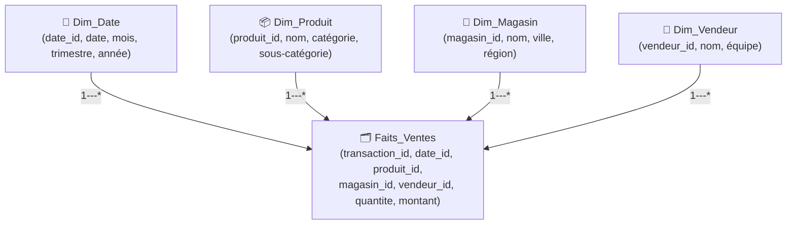
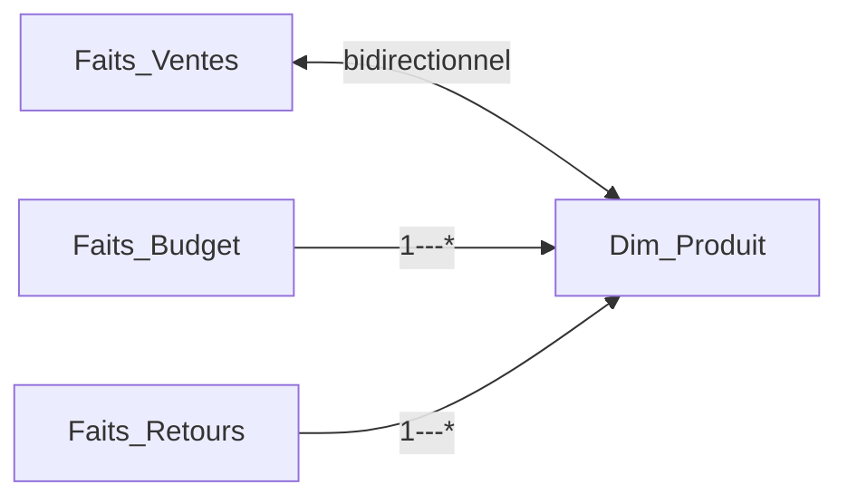
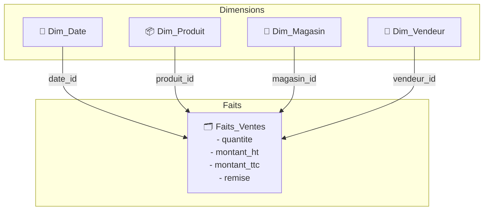

## Objectifs pédagogiques

À l'issue de ce module, vous serez capable de :

- Distinguer une table de faits d'une table de dimension et justifier ce choix
- Reconnaître un schéma en étoile et l'opposer à un modèle "à plat"
- Créer des relations correctes entre tables dans Power BI Desktop
- Identifier les pièges classiques (relations ambiguës, cardinalité inversée, tables non connectées)
- Préparer un modèle prêt à accueillir des mesures DAX

---

## Mise en situation

Vous travaillez pour une enseigne de distribution qui vend dans 80 magasins répartis sur 5 régions. Le service BI reçoit chaque matin un fichier Excel de 150 000 lignes contenant toutes les transactions de la veille : produit vendu, quantité, prix unitaire, magasin, date, vendeur.

La première version du rapport Power BI a été faite "à la va-vite" : une seule table, tout dedans. Résultat ? Le fichier pèse 45 Mo, les filtres croisés dysfonctionnent, et calculer le chiffre d'affaires par région prend trois formules imbriquées impossibles à maintenir.

C'est exactement le problème que la modélisation en étoile est conçue à résoudre.

---

## Pourquoi le modèle "à plat" ne tient pas

Quand on importe des données brutes dans Power BI sans les restructurer, on obtient souvent quelque chose comme ça :

| Date | Produit | Catégorie | Région | Magasin | Vendeur | Qté | Prix |
|------|---------|-----------|--------|---------|---------|-----|------|
| 2024-01-15 | Café 250g | Épicerie | Sud | Marseille Prado | Dupont | 3 | 2.90 |
| 2024-01-15 | Café 250g | Épicerie | Sud | Marseille Prado | Dupont | 1 | 2.90 |

"Épicerie", "Sud", "Marseille Prado" se répètent des dizaines de milliers de fois. Chaque modification du nom d'une catégorie nécessite une mise à jour massive. Et côté DAX, calculer le CA par région alors que la région est noyée dans la même table que les montants — c'est techniquement possible, mais douloureux.

🧠 **Concept clé** — La redondance dans un modèle à plat n'est pas qu'un problème de stockage. C'est surtout un problème de logique : mélanger "ce qui s'est passé" (les transactions) avec "qui ou quoi est impliqué" (les entités) rend l'analyse beaucoup plus fragile.

---

## Le schéma en étoile : l'idée de base

L'idée est simple à visualiser : une table centrale contient les **événements mesurables** (les faits), et elle est entourée de tables satellites qui décrivent **le contexte** de ces événements (les dimensions).

La table de faits ne contient que des **identifiants** (clés étrangères) et des **mesures numériques**. Elle ne stocke pas "Marseille Prado" — elle stocke `magasin_id = 7`. C'est la table `Dim_Magasin` qui sait que 7 correspond à Marseille Prado, dans la région Sud.

---

## Tables de faits vs tables de dimensions

Voici comment distinguer les deux dans la pratique :

| Critère | Table de faits | Table de dimension |
|--------|----------------|--------------------|
| Contenu principal | Mesures numériques (montants, quantités, durées) | Attributs descriptifs (noms, catégories, codes) |
| Volume | Très élevé — des millions de lignes | Réduit — quelques centaines à milliers |
| Fréquence de mise à jour | Très fréquente (quotidienne, temps réel) | Occasionnelle (ajout de produits, réorganisation) |
| Clés | Uniquement des clés étrangères | Une clé primaire unique |
| Exemple | Ligne de transaction, appel téléphonique, clic | Produit, client, point de vente, calendrier |

💡 **Astuce** — Si vous hésitez sur le statut d'une table, posez-vous cette question : *Est-ce qu'une ligne de cette table représente un événement qui s'est produit à un moment précis ?* Si oui, c'est un fait. Si c'est une description d'une entité qui existe indépendamment du temps, c'est une dimension.

---

## Les relations : ce qui donne vie au modèle

Une fois les tables créées, Power BI doit savoir comment les relier. Dans l'éditeur de modèle (vue "Modèle" dans Power BI Desktop), on relie les tables en faisant glisser la clé primaire d'une dimension vers la clé étrangère correspondante dans la table de faits.

**Cardinalité correcte dans un schéma en étoile :**
- Dimension → Faits : **1 à plusieurs** (un produit peut apparaître dans de nombreuses transactions)
- Direction du filtre : **de la dimension vers les faits** (quand on filtre sur "Épicerie", Power BI filtre les transactions correspondantes)

⚠️ **Erreur fréquente** — Créer une relation dans le mauvais sens. Si la direction de filtrage va des faits vers la dimension, vos visuels afficheront des résultats incorrects ou des totaux doublés. Vérifiez toujours que la flèche de filtre part de la dimension (côté "1") vers les faits (côté "plusieurs").

**Ce qu'il faut éviter :**

Les relations bidirectionnelles entre deux tables de faits via une dimension créent des **ambiguïtés de filtrage** (Power BI ne sait plus quel chemin emprunter). À éviter systématiquement, sauf cas très spécifiques où vous savez exactement ce que vous faites.

---

## La table de dates : un cas à part

La dimension calendrier mérite une mention spéciale. Power BI gère l'intelligence temporelle (comparaisons année sur année, cumuls mensuels, etc.) à travers une **table de dates continue et dédiée**, marquée explicitement comme telle.

Règles à respecter :
- Elle doit couvrir **toutes les dates** présentes dans les faits, sans trou
- Elle doit comporter une colonne de type `Date` avec une valeur par jour
- Elle doit être **marquée comme table de dates** dans Power BI (clic droit sur la table → Marquer comme table de dates)

💡 **Astuce** — Power BI peut générer automatiquement une table de dates cachée si vous ne le faites pas. C'est pratique pour démarrer, mais cette table automatique est limitée et ne couvre que les années présentes dans vos données. Créez toujours votre propre dimension calendrier pour avoir le contrôle.

---

## Architecture du modèle en pratique

Voici ce que ressemble un modèle complet dans Power BI Desktop pour le scénario de notre enseigne de distribution :

Ce modèle permet, sans écrire une seule mesure DAX complexe, de :
- Filtrer les ventes par région (via `Dim_Magasin`)
- Afficher un graphique mensuel (via `Dim_Date`)
- Comparer les performances par catégorie produit (via `Dim_Produit`)
- Croiser toutes ces dimensions simultanément

C'est la puissance du modèle en étoile : les relations font le travail de filtrage, DAX n'a plus qu'à calculer.

---

## Du modèle à plat au schéma en étoile : la démarche

Voici comment passer concrètement d'une table Excel unique à un modèle structuré. Le travail de nettoyage et de transformation a été fait en amont dans Power Query (module précédent) — ici on s'intéresse à la logique de structuration.

**Étape 1 — Identifier les faits**  
Quelles colonnes représentent une mesure d'un événement ? → `quantite`, `montant_ht`, `remise`

**Étape 2 — Identifier les dimensions**  
Quelles colonnes décrivent le contexte ? → Produit, Magasin, Vendeur, Date

**Étape 3 — Extraire les dimensions**  
Pour chaque dimension : créer une table distincte avec une clé primaire unique et les attributs associés. Dans Power Query, cela correspond à un "Group By" ou une suppression des doublons sur les colonnes concernées.

**Étape 4 — Remplacer les valeurs par des clés dans les faits**  
La table de faits ne garde que les identifiants, pas les libellés.

**Étape 5 — Créer les relations dans Power BI**  
Vue Modèle → glisser-déposer les clés entre tables → vérifier la cardinalité et la direction.

⚠️ **Erreur fréquente** — Garder des colonnes descriptives dans la table de faits "pour simplifier". Par exemple, laisser `nom_produit` dans `Faits_Ventes` en plus de `produit_id`. Résultat : si le nom change dans `Dim_Produit`, l'incohérence crée des résultats faux dans les visuels qui utilisent l'ancienne valeur.

---

## Schéma en étoile vs schéma en flocon

Vous entendrez parfois parler de "schéma en flocon" (*snowflake schema*). La différence ?

Dans un flocon, les dimensions sont elles-mêmes normalisées : au lieu d'avoir `catégorie` et `sous-catégorie` dans `Dim_Produit`, on crée une table `Dim_Catégorie` séparée reliée à `Dim_Produit`.

**Étoile vs Flocon pour Power BI :**

| Critère | Étoile | Flocon |
|--------|--------|--------|
| Performance des requêtes | ✅ Meilleure | ⚠️ Moins bonne (plus de jointures) |
| Facilité de maintenance | ✅ Simple | Complexe |
| Redondance des données | Légère | Minimale |
| Recommandé pour Power BI | ✅ Oui | ❌ Non, sauf cas très spécifiques |

Power BI est optimisé pour le schéma en étoile. Le moteur VertiPaq compresse très bien les colonnes redondantes dans les dimensions. Normaliser davantage n'apporte aucun bénéfice de compression et alourdit le modèle en jointures.

---

## Cas réel : retail, 2 millions de transactions/jour

Un grand distributeur alimentaire (réseau de 300 magasins) a migré son reporting d'Excel vers Power BI. Le modèle initial contenait une table de 18 millions de lignes avec 40 colonnes, incluant tous les libellés en clair.

Après restructuration en étoile :
- **Table de faits** : 18M lignes × 8 colonnes (clés + mesures)
- **4 dimensions** : Date (1 800 lignes), Produit (12 000 lignes), Magasin (300 lignes), Caissier (850 lignes)
- Taille du fichier `.pbix` : divisée par 3 (de 680 Mo à 220 Mo)
- Temps de chargement d'un visuel : de 8 secondes à moins d'1 seconde

Le gain ne vient pas d'une magie quelconque — il vient du fait que VertiPaq peut compresser `magasin_id = 7` bien plus efficacement que la chaîne `"Marseille Prado - Centre Commercial Grand Littoral"` répétée 60 000 fois.

---

## Bonnes pratiques

**Nommage** — Préfixer systématiquement vos tables : `Faits_`, `Dim_`. Ça paraît superflu au départ, mais quand le modèle atteint 15 tables, vous serez content d'avoir ce repère visuel immédiat.

**Clés de substitution** — Préférer des clés numériques entières (`1`, `2`, `3`…) aux clés métier textuelles (`"MAR-PRADO-001"`). Les entiers se comparent plus vite et occupent moins d'espace.

**Granularité cohérente** — Toutes les lignes d'une table de faits doivent représenter le même niveau de détail. Mélanger des lignes "transaction unitaire" avec des lignes "total journalier" dans la même table brise le modèle.

**Valeur inconnue** — Prévoir dans chaque dimension une ligne pour les valeurs manquantes (ex : `produit_id = -1` → `"Produit non identifié"`). Sans ça, les faits orphelins disparaissent silencieusement des rapports.

**Ne pas multiplier les tables de faits** — Deux tables de faits peuvent partager des dimensions, mais créer des relations directes entre elles est risqué. Si vous avez besoin de croiser deux tables de faits, utilisez une mesure DAX plutôt qu'une relation directe.

---

## Résumé

| Concept | Définition courte | À retenir |
|--------|-------------------|-----------|
| Table de faits | Table centrale contenant les événements mesurables | Clés étrangères + mesures numériques uniquement |
| Table de dimension | Table satellite décrivant le contexte | Clé primaire unique + attributs descriptifs |
| Schéma en étoile | Faits au centre, dimensions autour | La structure recommandée pour Power BI |
| Cardinalité 1-à-plusieurs | Une dimension pour plusieurs faits | Direction de filtrage : dimension → faits |
| Table de dates | Dimension calendrier continue et marquée | Indispensable pour l'intelligence temporelle |
| Schéma en flocon | Dimensions normalisées en sous-tables | À éviter dans Power BI — pénalise les perfs |

Un bon modèle en étoile, c'est une table de faits qui ne contient que des chiffres et des identifiants, entourée de dimensions propres et bien délimitées. Quand ce modèle est en place, les mesures DAX deviennent naturelles — c'est justement là qu'intervient le module suivant.

---

<!-- snippet
id: powerbi_etoile_concept_fait_vs_dim
type: concept
tech: Power BI
level: beginner
importance: high
format: knowledge
tags: modelisation, fait, dimension, etoile, schema
title: Table de faits vs table de dimension
content: Une table de faits contient des événements mesurables (transactions, clics, appels) avec des clés étrangères + mesures numériques. Une dimension décrit le contexte (produit, magasin, date) avec une clé primaire unique. Le moteur Power BI (VertiPaq) filtre en traversant les relations depuis les dimensions vers les faits — jamais l'inverse.
description: La distinction fait/dimension détermine la structure de tout le modèle et conditionne le bon fonctionnement des filtres DAX.
-->

<!-- snippet
id: powerbi_etoile_concept_cardinalite
type: concept
tech: Power BI
level: beginner
importance: high
format: knowledge
tags: relation, cardinalite, filtre, etoile, modelisation
title: Cardinalité et direction de filtrage dans un schéma en étoile
content: Dans un schéma en étoile, chaque relation est de type 1-à-plusieurs : côté "1" = dimension (clé primaire unique), côté "plusieurs" = faits. La direction de filtrage doit toujours aller de la dimension vers les faits. Power BI applique alors automatiquement les sélections de visuels sur la bonne table.
description: Inverser la direction de filtrage (faits vers dimension) produit des totaux faux ou des résultats inattendus dans les visuels.
-->

<!-- snippet
id: powerbi_etoile_warning_relation_inverse
type: warning
tech: Power BI
level: beginner
importance: high
format: knowledge
tags: relation, filtrage, erreur, cardinalite, modelisation
title: Relation dans le mauvais sens — visuels incorrects
content: Piège : si la direction de filtrage va des faits vers la dimension, les visuels affichent des résultats erronés (totaux doublés, filtres sans effet). Conséquence : les utilisateurs font confiance à des chiffres faux. Correction : dans la vue Modèle, double-cliquer sur la relation et vérifier que la flèche pointe de la dimension (côté 1) vers les faits (côté *).
description: Piège → résultats faux sans message d'erreur. Correction : vérifier la flèche de filtrage sur chaque relation dans la vue Modèle.
-->

<!-- snippet
id: powerbi_etoile_warning_colonnes_redondantes
type: warning
tech: Power BI
level: beginner
importance: high
format: knowledge
tags: modelisation, redondance, faits, dimension, coherence
title: Garder des libellés dans la table de faits crée des incohérences
content: Piège : laisser "nom_produit" dans Faits_Ventes en plus de produit_id. Si le nom change dans Dim_Produit, l'ancienne valeur reste dans les faits → deux libellés différents pour le même produit dans les visuels. Correction : la table de faits ne doit contenir que des clés numériques + mesures. Les libellés vivent exclusivement dans les dimensions.
description: Piège → incohérence silencieuse entre dimension et faits après mise à jour d'un libellé. Correction : supprimer tous les libellés de la table de faits.
-->

<!-- snippet
id: powerbi_etoile_tip_table_dates
type: tip
tech: Power BI
level: beginner
importance: high
format: knowledge
tags: calendrier, date, dimension, intelligence-temporelle, power-bi
title: Créer et marquer sa propre table de dates
content: Ne pas laisser Power BI générer une table de dates automatique (limitée aux années présentes, non personnalisable). Créer une table Dim_Date continue couvrant toutes les dates des faits + une colonne de type Date par ligne. Puis : clic droit sur la table dans la vue Modèle → "Marquer comme table de dates". Sans ce marquage, les fonctions DAX d'intelligence temporelle (TOTALYTD, SAMEPERIODLASTYEAR) ne fonctionnent pas correctement.
description: La table de dates doit être continue, marquée explicitement, et couvrir au minimum toutes les dates présentes dans les faits.
-->

<!-- snippet
id: powerbi_etoile_tip_prefixage_tables
type: tip
tech: Power BI
level: beginner
importance: medium
format: knowledge
tags: nommage, convention, modelisation, lisibilite, power-bi
title: Préfixer les tables Faits_ et Dim_ dès le départ
content: Nommer les tables avec des préfixes explicites : "Faits_Ventes", "Dim_Produit", "Dim_Date". Dans la vue Modèle, les tables s'affichent par ordre alphabétique — les faits et les dimensions se regroupent naturellement. Sur un modèle de 15+ tables, cette convention réduit le temps d'orientation de façon significative.
description: Convention simple à adopter dès le début, impossible à rattraper proprement sur un modèle en production.
-->

<!-- snippet
id: powerbi_etoile_warning_relation_bidirectionnelle
type: warning
tech: Power BI
level: beginner
importance: medium
format: knowledge
tags: relation, bidirectionnel, ambiguite, faits, modelisation
title: Éviter les relations bidirectionnelles entre deux tables de faits
content: Piège : activer le filtrage bidirectionnel sur une relation partagée entre deux tables de faits (ex : Faits_Ventes et Faits_Budget via Dim_Produit). Power BI ne sait plus quel chemin emprunter → résultats ambigus ou erreur DAX "ambiguous path". Correction : désactiver le bidirectionnel et gérer le croisement de faits via une mesure DAX dédiée.
description: Piège → filtres qui se "contaminent" entre tables de faits. Correction : conserver des relations unidirectionnelles et calculer les croisements en DAX.
-->

<!-- snippet
id: powerbi_etoile_concept_veritpaq_compression
type: concept
tech: Power BI
level: beginner
importance: medium
format: knowledge
tags: vertipaq, compression, performance, dimension, modelisation
title: Pourquoi VertiPaq compresse mieux un modèle en étoile
content: VertiPaq (le moteur interne de Power BI) compresse les colonnes colonne par colonne, en encodant les valeurs répétées. Une colonne magasin_id avec 300 valeurs uniques sur 18M lignes se compresse beaucoup mieux qu'une colonne texte "nom_magasin" de 40 caractères répétée 18M fois. Résultat observé : modèle en étoile 3x plus léger qu'une table à plat équivalente pour le même contenu.
description: Le gain de performance d'un schéma en étoile vient directement de la façon dont VertiPaq encode les colonnes à faible cardinalité.
-->

<!-- snippet
id: powerbi_etoile_concept_granularite
type: concept
tech: Power BI
level: beginner
importance: medium
format: knowledge
tags: granularite, faits, modelisation, coherence, agregation
title: Granularité d'une table de faits — règle fondamentale
content: Toutes les lignes d'une table de faits doivent représenter le même niveau de détail (la "granularité"). Exemple : si la table contient des transactions unitaires, on ne peut pas y ajouter des lignes de totaux journaliers. Mélanger deux granularités produit des doubles comptages invisibles dans les mesures d'agrégation (SUM, COUNT).
description: Mélanger deux niveaux de détail dans une même table de faits provoque des doubles comptages silencieux dans les mesures.
-->
