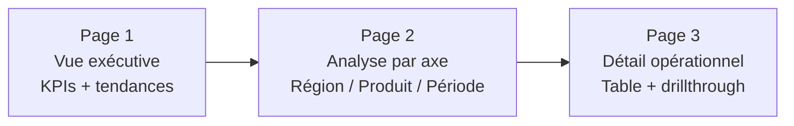

# Visualisations et storytelling dans Power BI

## Objectifs pédagogiques

À la fin de ce module, vous serez capable de :

1. **Choisir** le bon type de visuel selon la nature de la donnée et le message à transmettre
2. **Construire** un rapport lisible en structurant l'espace et la hiérarchie visuelle
3. **Configurer** les interactions entre visuels pour guider l'exploration des données
4. **Utiliser** les filtres, slicers et drillthrough pour contextualiser l'analyse
5. **Appliquer** les principes de storytelling pour rendre un rapport convaincant et utilisable

---

## Mise en situation

Vous travaillez dans une entreprise de distribution qui vend des produits dans 5 régions françaises. Le responsable commercial vous demande un rapport mensuel : il veut comprendre d'un coup d'œil où les ventes stagnent, quelles familles de produits performent, et si les objectifs trimestriels sont tenus.

Vous avez déjà vos données dans Power BI, vos relations sont posées, et vous avez calculé quelques mesures DAX simples (CA total, quantité vendue, taux de marge). Le modèle tourne. Maintenant la vraie question : **comment le présenter pour que ça serve vraiment ?**

C'est exactement ce que ce module vous apprend.

---

## Contexte : pourquoi la visualisation n'est pas un détail

Il existe une tentation courante chez les débutants Power BI : passer 80% du temps sur le modèle de données et les calculs DAX, puis "mettre quelques graphiques" en fin de projet. C'est souvent là que ça se joue — et souvent là que ça rate.

Un rapport mal construit crée trois problèmes concrets :
- L'utilisateur ne comprend pas quoi regarder en premier
- Il tire les mauvaises conclusions (mauvais visuel pour la mauvaise donnée)
- Il n'y revient pas — et le rapport finit dans les oubliettes de SharePoint

Power BI est un outil de communication autant qu'un outil d'analyse. La donnée est le fond, la visualisation est la forme — et la forme conditionne si le fond sera compris.

---

## Choisir le bon visuel : la logique avant le catalogue

### Ce que vous avez vraiment à dire

Avant de cliquer sur un visuel dans le panneau Power BI, posez-vous une seule question : **"Qu'est-ce que je veux montrer ?"**

Il y a quatre grandes intentions analytiques, et chacune appelle des visuels précis :

| Intention | Question type | Visuels adaptés |
|-----------|--------------|-----------------|
| **Comparer** | Qui performe le mieux ? | Barres groupées, colonnes, bullet chart |
| **Évoluer dans le temps** | Comment les ventes ont évolué ce trimestre ? | Courbes (line chart), aires, histogramme |
| **Répartir / Part du tout** | Quelle famille représente quelle part du CA ? | Graphique en anneau, treemap (avec précautions) |
| **Corréler / Distribuer** | Y a-t-il un lien entre remise accordée et volume vendu ? | Nuage de points (scatter), histogramme de distribution |

🧠 **Concept clé** — Le graphique circulaire (camembert) est presque toujours une mauvaise idée dès que vous avez plus de 3 ou 4 catégories. L'œil humain compare très mal des angles. Préférez une barre horizontale : comparer des longueurs est naturel.

### Les visuels les plus utilisés en pratique

**Graphique à barres / colonnes** — Le cheval de bataille. Colonnes verticales pour montrer une évolution temporelle, barres horizontales pour comparer des catégories avec des libellés longs (noms de produits, régions…).

**Courbe (Line chart)** — Indispensable dès qu'il y a une dimension temps. Montrez toujours la tendance, pas juste un point.

**Card et KPI** — Pour les chiffres clés isolés (CA total, nombre de commandes, taux de marge). Une Card affiche une valeur brute. Un visuel KPI compare une valeur à une cible et signale si l'objectif est atteint.

**Table et matrice** — Quand l'utilisateur a besoin du détail exact, pas d'une tendance. La matrice permet la hiérarchie (région → département → commercial). Ne pas en abuser : trop de chiffres bruts tue la lecture.

**Slicer** — Ce n'est pas un visuel d'analyse, c'est un contrôle de filtre. Il permet à l'utilisateur de filtrer le rapport interactivement (par année, région, famille produit…). Indispensable dans tout rapport opérationnel.

💡 **Astuce** — Le visuel **Carte géographique** (Map ou Filled Map) est tentant mais piégeux : il necessite que Power BI reconnaisse correctement vos libellés géographiques. Préférez la Filled Map pour des niveaux région/département, et vérifiez toujours que les données sont bien géocodées avant de livrer.

---

## Construire la mise en page : l'espace comme message

### La règle des 3 niveaux

Un bon rapport a une hiérarchie visuelle claire. L'utilisateur doit comprendre en 5 secondes ce que la page veut lui dire.

```
┌─────────────────────────────────────────┐
│  TITRE DE LA PAGE + KPIs principaux      │  ← Niveau 1 : vue résumée
├──────────────────┬──────────────────────┤
│  Visuel principal │  Visuel secondaire   │  ← Niveau 2 : analyse
├──────────────────┴──────────────────────┤
│  Slicers / Filtres / Table de détail     │  ← Niveau 3 : contexte / drill
└─────────────────────────────────────────┘
```

Ce découpage n'est pas une contrainte rigide — c'est une **convention de lecture**. L'œil occidental lit de haut en bas et de gauche à droite. Placez ce qui est le plus important en haut à gauche, et les détails en bas.

### Cohérence visuelle

Quelques règles simples qui font une différence visible :

- **Palette de couleurs limitée** : 2 à 3 couleurs maximum. Une couleur primaire pour vos données, une couleur d'alerte (rouge ou orange) pour les écarts, une couleur neutre pour le contexte.
- **Même police partout** : Power BI utilise Segoe UI par défaut. Ne la changez pas sans raison.
- **Alignement** : utilisez le panneau Format → Align pour aligner vos visuels. Des éléments mal alignés donnent une impression d'amateurisme instantanée.
- **Pas de surcharge** : si vous avez envie d'ajouter un 8ème graphique sur la page, c'est que vous avez besoin d'une deuxième page — pas d'un graphique de plus.

⚠️ **Erreur fréquente** — Utiliser la même couleur pour toutes les barres d'un graphique comparatif, puis une couleur différente uniquement pour "mettre en valeur" une barre sans raison analytique. Chaque variation de couleur doit porter un sens. Si toutes les régions sont comparées sur le même pied, elles doivent avoir la même couleur.

---

## Les interactions entre visuels

C'est l'une des forces de Power BI que les débutants sous-utilisent. Par défaut, quand vous cliquez sur un élément d'un visuel, **tous les autres visuels de la page se filtrent automatiquement**.

Cliquer sur "Région Sud" dans un histogramme filtre le tableau, la courbe et les KPIs sur cette région. L'utilisateur explore naturellement sans avoir à configurer quoi que ce soit.

### Modifier les interactions

Par défaut, Power BI croise tous les visuels entre eux. Mais parfois, vous ne voulez pas ça — par exemple, vous avez un visuel de contexte général (CA national) qui ne doit pas être filtré quand l'utilisateur clique sur une région.

Procédure :
1. Sélectionnez le visuel **source** (celui sur lequel l'utilisateur va cliquer)
2. Onglet **Format** → **Edit interactions**
3. Des icônes apparaissent sur chaque autre visuel : filtre, mise en surbrillance, ou aucune interaction
4. Choisissez "aucune interaction" pour les visuels que vous voulez protéger

```
[Visuel A sélectionné]
         │
         ├──→ [Visuel B] : 🔽 Filtre (défaut)
         ├──→ [Visuel C] : 🔆 Surbrillance
         └──→ [Visuel D] : ⊘  Aucune interaction
```

💡 **Astuce** — La surbrillance est souvent plus douce que le filtre : les autres catégories restent visibles mais grisées, ce qui préserve le contexte. Utile pour les graphiques en barres où on compare une sélection au reste.

---

## Filtres et slicers : donner le contrôle à l'utilisateur

### Le panneau Filtres

Power BI propose trois niveaux de filtres dans le panneau Filtres (à droite) :

| Niveau | Portée | Cas d'usage |
|--------|--------|-------------|
| **Filtre visuel** | S'applique à un seul visuel | Montrer uniquement les 10 premiers produits dans un tableau |
| **Filtre de page** | S'applique à toute la page courante | Page "Analyse Nord" → filtrer automatiquement sur la région Nord |
| **Filtre de rapport** | S'applique à toutes les pages | Filtrer sur l'année en cours dans tout le rapport |

Ces filtres peuvent être masqués aux utilisateurs finaux (option "Verrouiller" ou "Masquer" dans le panneau). Pratique pour des filtres techniques que l'utilisateur ne doit pas voir.

### Les slicers

Un slicer est un filtre **visible sur le canevas**, que l'utilisateur manipule directement. C'est l'élément interactif le plus attendu dans un rapport opérationnel.

Les formats disponibles dans le visuel Slicer :
- **Liste** — toutes les valeurs affichées, avec cases à cocher
- **Dropdown** — compact, recommandé quand la liste est longue
- **Entre (Between)** — pour les dates ou les valeurs numériques, affiche un curseur de plage
- **Après / Avant** — utile pour les filtres de date relatifs

🧠 **Concept clé** — Un slicer agit exactement comme un filtre de page, sauf qu'il est visible et contrôlé par l'utilisateur. Techniquement, il n'existe pas de différence de fond entre les deux : Power BI applique le même mécanisme de propagation de filtre dans le modèle.

### Drillthrough : aller au détail en contexte

Le drillthrough permet de naviguer vers une page de détail **en conservant un contexte de filtre**. C'est le mécanisme le plus efficace pour séparer vue résumée et vue détaillée sans surcharger la page principale.

Exemple concret : page principale avec le CA par région → clic droit sur "Région Est" → "Analyser les ventes Est" → page détaillée avec toutes les commandes de la région Est, pré-filtrée.

Configuration :
1. Créez une page de détail (ex : "Détail région")
2. Dans cette page, faites glisser le champ de contexte (ex : `Région`) dans la zone **Drillthrough** du panneau Visualisations
3. Power BI ajoute automatiquement un bouton "Retour" sur cette page
4. Sur n'importe quelle autre page, un clic droit sur un visuel contenant ce champ propose l'option de drillthrough

---

## Storytelling : raconter quelque chose, pas juste montrer

### La différence entre un tableau de bord et un rapport

Un **tableau de bord** (dashboard) est une vue synthétique, souvent statique, pour le monitoring. Un **rapport** (report) est une exploration guidée ou libre, multi-pages, avec du contexte.

Ce module traite surtout des rapports. Et un rapport réussi raconte une histoire : il y a un début (le contexte global), un développement (l'analyse), et une conclusion (les alertes, les recommandations).

### Structure narrative en 3 pages

Voici une structure qui fonctionne dans la grande majorité des cas métier :



- **Page 1** : Les décideurs s'arrêtent ici. 3 à 5 KPIs, une courbe de tendance, une alerte si objectif non atteint. Tout en un coup d'œil.
- **Page 2** : L'analyste va ici. Des visuels comparatifs par dimension, des slicers pour explorer.
- **Page 3** : Le gestionnaire opérationnel va ici via drillthrough. Le détail des lignes, les numéros de commande, les noms de clients.

### Titrer pour guider

Chaque page et chaque visuel doit avoir un titre qui dit **ce qu'on doit comprendre**, pas seulement ce que le visuel contient.

| ❌ Titre descriptif | ✅ Titre analytique |
|---------------------|---------------------|
| "Ventes par région" | "La région Sud sous-performe de 18% vs objectif" |
| "Évolution du CA" | "CA en hausse continue depuis mars" |
| "Produits" | "Top 5 produits : 3 en recul sur 30 jours" |

Ce n'est pas toujours applicable (un rapport exploratoire doit rester neutre), mais dès que le rapport est destiné à alerter ou convaincre, les titres analytiques sont bien plus efficaces.

💡 **Astuce** — Si vous ne pouvez pas écrire un titre analytique, c'est peut-être que votre visuel ne dit pas encore quelque chose de clair. C'est un bon signal pour reconsidérer ce que vous montrez.

### Annotations et zones de texte

Power BI permet d'ajouter des zones de texte libres sur le canevas. Utilisez-les avec parcimonie pour :
- Expliquer une méthodologie (ex : "Le taux de marge est calculé hors frais de port")
- Indiquer la source des données et la date de mise à jour
- Ajouter un commentaire d'analyse sur une anomalie visible

⚠️ **Erreur fréquente** — Surcharger un rapport de zones de texte explicatives. Si vous avez besoin de 5 lignes pour expliquer un graphique, le problème est le graphique, pas l'absence d'explication.

---

## Mise en pratique : construire le rapport commercial

Reprenons le scénario initial. Voici comment construire les trois pages du rapport commercial pas à pas.

### Page 1 — Vue exécutive

**Étape 1 — Les KPIs**

Ajoutez 3 visuels de type **Card** :
- Champ : `[CA Total]` — titre : "Chiffre d'affaires"
- Champ : `[Qté Vendue]` — titre : "Unités vendues"
- Champ : `[Taux de marge]` — titre : "Marge moyenne"

**Étape 2 — La tendance**

Ajoutez un **Line chart** :
- Axe X : `Date[Mois-Année]` (ou votre colonne de date formatée)
- Valeurs Y : `[CA Total]`
- Activez les **étiquettes de données** pour les points extrêmes uniquement (option dans Format → Data labels → Series)

**Étape 3 — Le slicer Année**

Ajoutez un visuel **Slicer** :
- Champ : `Date[Année]`
- Format : Dropdown
- Positionnez-le en haut à droite, de façon compacte

### Page 2 — Analyse par région et famille produit

**Visuel principal : barres horizontales CA par région**
- Axe Y : `Région`
- Valeurs : `[CA Total]`
- Activez le **tri descendant** (clic sur les "…" du visuel → Sort descending)
- Ajoutez une ligne de référence pour l'objectif si vous avez une mesure `[Objectif CA]` : Format → Analytics → Constant line

**Visuel secondaire : matrice produits × régions**
- Lignes : `Famille Produit`
- Colonnes : `Région`
- Valeurs : `[CA Total]`
- Activez les **barres de données dans la matrice** (Format → Cell elements → Data bars) pour rendre la lecture plus visuelle

**Slicer période**

Ajoutez un Slicer sur `Date[Date]` en format **Between** pour permettre la sélection d'une plage de dates.

### Page 3 — Détail opérationnel (Drillthrough)

**Configurez le drillthrough** :
1. Créez une nouvelle page "Détail région"
2. Faites glisser `Région` dans la zone **Drillthrough** du panneau Visualisations
3. Ajoutez une **Table** avec : Date, Produit, Quantité, CA, Marge
4. Ajoutez un titre dynamique : insérez une zone de texte + utilisez une mesure DAX simple pour afficher la région sélectionnée si nécessaire, ou laissez le titre statique "Détail des ventes — Région sélectionnée"

Retournez page 2, clic droit sur une barre de région → vous voyez l'option "Analyser dans Détail région". C'est en place.

---

## Bonnes pratiques

**Sur les visuels**
- Limitez-vous à 5-6 visuels par page. Au-delà, la page perd son message principal.
- Supprimez les légendes quand le visuel est auto-explicatif (un seul axe, un seul indicateur).
- Désactivez les effets 3D partout — ils déforment la perception des proportions.

**Sur la performance**
- Évitez les tables avec des milliers de lignes visibles : utilisez les options "Top N" dans les filtres visuels, ou orientez vers le drillthrough.
- Les visuels custom (hors catalogue Power BI natif) peuvent ralentir le rendu. À utiliser avec discernement.

**Sur la livraison**
- Testez toujours votre rapport avec les yeux d'un utilisateur qui ne connaît pas les données. Si vous devez expliquer oralement comment naviguer, le rapport n'est pas terminé.
- Vérifiez le comportement sur mobile si le rapport sera consulté sur tablette (Vue → Mobile layout dans Power BI Desktop).

---

## Résumé

| Concept | Définition courte | À retenir |
|---------|------------------|-----------|
| **Choix du visuel** | Sélection basée sur l'intention analytique | Comparer → barres / Temps → courbes / Part → anneau |
| **Hiérarchie visuelle** | Organisation spatiale qui guide l'œil | En haut : résumé · Au centre : analyse · En bas : détail |
| **Interactions** | Filtrage croisé entre visuels | Par défaut actif — se configure via Edit interactions |
| **Slicer** | Contrôle de filtre interactif sur le canevas | Rend l'utilisateur autonome dans l'exploration |
| **Drillthrough** | Navigation vers une page de détail en contexte | Séparer synthèse et détail sans surcharger |
| **Storytelling** | Structure narrative du rapport | 3 pages : exécutif → analyse → opérationnel |
| **Titre analytique** | Titre qui énonce la conclusion, pas le contenu | "Région Sud à -18% vs objectif" > "Ventes par région" |

Un rapport Power BI réussi n'est pas celui qui contient le plus d'informations — c'est celui qui permet à l'utilisateur de prendre une décision en moins d'une minute sur la page d'accueil, et d'aller chercher le détail quand il en a besoin.

---

<!-- snippet
id: powerbi_visuel_choix
type: concept
tech: Power BI
level: beginner
importance: high
format: knowledge
tags: visualisation, graphique, choix, débutant, storytelling
title: Choisir un visuel selon l'intention analytique
content: Avant d'ajouter un visuel, définir l'intention : Comparer → barres/colonnes. Évolution dans le temps → courbe (line chart). Part du tout → anneau (donut). Corrélation → nuage de points. Le choix du visuel précède le choix des données, pas l'inverse.
description: Chaque type de visuel correspond à une intention analytique. Choisir le visuel d'abord, la donnée ensuite.
-->

<!-- snippet
id: powerbi_camembert_piege
type: warning
tech: Power BI
level: beginner
importance: high
format: knowledge
tags: visualisation, camembert, comparaison, erreur, débutant
title: Le graphique circulaire est rarement le bon choix
content: Piège : utiliser un camembert dès qu'on a des parts. Conséquence : l'œil humain compare très mal des angles, surtout au-delà de 3 catégories. Correction : remplacer par des barres horizontales — comparer des longueurs est naturel et précis.
description: Le camembert rend la comparaison difficile dès 4+ catégories. Les barres horizontales sont presque toujours plus lisibles.
-->

<!-- snippet
id: powerbi_interactions_edit
type: tip
tech: Power BI
level: beginner
importance: high
format: knowledge
tags: interactions, filtre, slicer, rapport, configuration
title: Modifier les interactions entre visuels
content: Pour protéger un visuel du filtrage croisé : sélectionner le visuel source → onglet Format → Edit interactions → choisir l'icône "aucune interaction" (⊘) sur les visuels à protéger. Utile pour un KPI de contexte global qui ne doit pas être filtré par les clics utilisateur.
description: Edit interactions permet de choisir entre filtre, surbrillance ou aucune interaction visuel par visuel.
-->

<!-- snippet
id: powerbi_slicer_date
type: tip
tech: Power BI
level: beginner
importance: medium
format: knowledge
tags: slicer, date, filtre, interactif, rapport
title: Slicer de plage de dates avec le format Between
content: Pour une sélection de période, ajouter un Slicer sur un champ Date → dans le panneau Format → Slicer settings → Style → Between. Affiche deux curseurs de date. Recommandé pour les rapports opérationnels où l'utilisateur doit comparer des périodes librement.
description: Le format Between d'un slicer de date permet de sélectionner une plage personnalisée avec deux curseurs.
-->

<!-- snippet
id: powerbi_drillthrough_config
type: concept
tech: Power BI
level: beginner
importance: high
format: knowledge
tags: drillthrough, navigation, détail, rapport, pages
title: Configurer le drillthrough pour naviguer vers le détail
content: Mécanisme : créer une page de détail → faire glisser le champ de contexte (ex : Région) dans la zone Drillthrough du panneau Visualisations. Power BI ajoute automatiquement un bouton Retour. Sur les autres pages, clic droit sur un visuel contenant ce champ → option de navigation vers la page détail avec le filtre pré-appliqué.
description: Le drillthrough pré-filtre automatiquement la page de destination selon l'élément sur lequel l'utilisateur fait un clic droit.
-->

<!-- snippet
id: powerbi_titre_analytique
type: tip
tech: Power BI
level: beginner
importance: medium
format: knowledge
tags: storytelling, titre, communication, rapport, débutant
title: Remplacer les titres descriptifs par des titres analytiques
content: À faire : nommer un visuel avec sa conclusion ("Région Sud à -18% vs objectif") plutôt que son contenu ("Ventes par région"). Si le titre analytique est impossible à formuler, c'est souvent le signe que le visuel ne dit pas encore quelque chose de clair — à reconsidérer.
description: Un titre analytique énonce ce que le visuel prouve. Si ce titre est impossible, le visuel manque peut-être de clarté.
-->

<!-- snippet
id: powerbi_filtres_niveaux
type: concept
tech: Power BI
level: beginner
importance: medium
format: knowledge
tags: filtres, rapport, page, visuel, portée
title: Les 3 niveaux de filtres dans Power BI
content: Le panneau Filtres propose trois portées distinctes : Filtre visuel → s'applique uniquement au visuel sélectionné (ex : top 10 produits). Filtre de page → s'applique à tous les visuels de la page courante. Filtre de rapport → s'applique à toutes les pages du rapport. Les filtres de page et rapport peuvent être verrouillés ou masqués à l'utilisateur final.
description: Trois niveaux : visuel (1 seul visuel), page (toute la page), rapport (toutes les pages). Chacun peut être masqué.
-->

<!-- snippet
id: powerbi_hierarchie_page
type: concept
tech: Power BI
level: beginner
importance: medium
format: knowledge
tags: mise en page, hiérarchie, storytelling, rapport, structure
title: Structurer une page en 3 niveaux visuels
content: Convention de lecture (haut → bas, gauche → droite) : niveau 1 en haut = KPIs résumés (ce que le décideur voit). Niveau 2 au centre = visuels d'analyse (comparaisons, tendances). Niveau 3 en bas = slicers, filtres, tables de détail. Cette structure réduit le temps de compréhension à moins de 5 secondes pour la vue synthétique.
description: Placer les KPIs en haut, l'analyse au centre, les détails/filtres en bas pour respecter la lecture naturelle.
-->

<!-- snippet
id: powerbi_surcharge_visuels
type: warning
tech: Power BI
level: beginner
importance: medium
format: knowledge
tags: mise en page, lisibilité, performance, rapport, débutant
title: Limiter à 5-6 visuels par page
content: Piège : accumuler des visuels pour "montrer plus". Conséquence : la page perd son message principal, l'utilisateur ne sait plus où regarder. Correction : au-delà de 5-6 visuels, créer une deuxième page ou utiliser le drillthrough pour déporter le détail.
description: Plus de 6 visuels par page dilue le message. Préférer une page supplémentaire ou le drillthrough.
-->

<!-- snippet
id: powerbi_couleurs_coherence
type: tip
tech: Power BI
level: beginner
importance: medium
format: knowledge
tags: couleurs, design, cohérence, rapport, visualisation
title: Limiter à 2-3 couleurs et leur donner un sens
content: Règle pratique : 1 couleur primaire pour les données, 1 couleur d'alerte (rouge/orange) pour les écarts négatifs, 1 couleur neutre pour le contexte. Toute variation de couleur doit avoir une signification analytique. Une barre colorée différemment sans raison crée de la confusion, pas de la clarté.
description: Chaque couleur supplémentaire doit porter un sens analytique. Variation sans raison = confusion pour l'utilisateur.
-->
