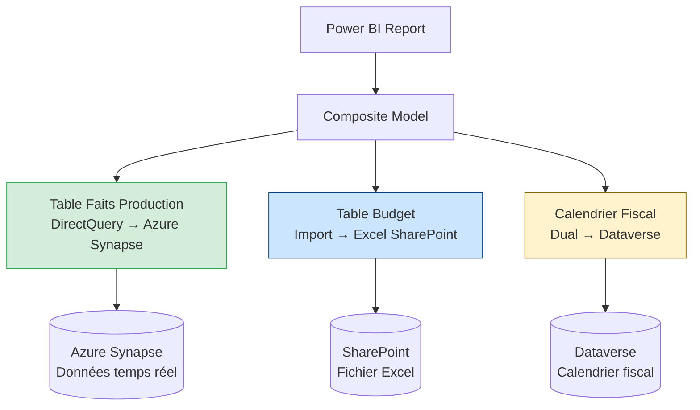

# DirectQuery et Composite Models dans Power BI

## Objectifs pédagogiques

À l'issue de ce module, tu seras capable de :

1. **Distinguer** les trois modes de stockage (Import, DirectQuery, Dual) et justifier un choix selon les contraintes métier
2. **Identifier** les situations où DirectQuery est pertinent — et celles où il est contre-productif
3. **Construire** un composite model qui combine des tables en mode Import et DirectQuery dans le même rapport
4. **Anticiper** les limitations de DirectQuery et les contourner avec les bonnes pratiques
5. **Utiliser les agrégations** pour accélérer les requêtes DirectQuery sur de gros volumes

---

## Mise en situation

Tu travailles pour une entreprise industrielle qui collecte des données de production en temps réel depuis des machines d'usine. Ces données arrivent dans un entrepôt Azure Synapse Analytics — plusieurs dizaines de millions de lignes, mises à jour toutes les 5 minutes.

Le contrôleur de gestion veut un rapport Power BI avec :
- les indicateurs de production **en quasi-temps réel** (tolérance : 10 minutes de décalage),
- des comparaisons avec les **budgets et objectifs**, stockés dans un petit fichier Excel mis à jour mensuellement,
- des **filtres temporels** utilisant un calendrier fiscal personnalisé que l'équipe BI maintient dans Dataverse.

Si tu charges tout en Import, les données de production sont périmées dès que le rapport est publié. Si tu passes tout en DirectQuery, le fichier Excel et Dataverse posent des problèmes de connexion. Il faut combiner les deux — c'est exactement le problème que les composite models résolvent.

On reviendra résoudre ce cas étape par étape à la fin du module, une fois les modes compris.

---

## Pourquoi les modes de stockage existent

Power BI doit répondre à une tension permanente : **fraîcheur des données vs performance des requêtes**.

Quand tu charges des données en mode Import, Power BI les compresse et les stocke dans son moteur in-memory (VertiPaq). Les visuels répondent en millisecondes parce que tout est en RAM. Mais ces données sont une copie — elles ont l'âge de la dernière actualisation. Sur un dataset de 500 millions de lignes, l'actualisation peut prendre des heures, et tu te heurtes aux limites de mémoire du service.

DirectQuery fonctionne à l'opposé : Power BI ne stocke rien. Chaque interaction sur un visuel génère une requête SQL envoyée à la source en temps réel. Les données sont fraîches, les volumes ne sont plus un problème côté Power BI — mais chaque clic attend la réponse de la base de données.

🧠 **Concept clé** — VertiPaq vs requête SQL à la volée : en Import, VertiPaq compresse les colonnes (souvent 10:1) et maintient des index en mémoire. En DirectQuery, Power BI traduit les interactions des visuels en requêtes SQL natives envoyées à la source — le temps de réponse dépend donc entièrement des performances de cette source.

Ces deux modes ont coexisté longtemps comme un choix binaire. Les composite models brisent cette contrainte.

---

## Les trois modes de stockage

### Import

C'est le mode par défaut et le plus performant pour les rapports analytiques classiques. Les données sont chargées dans VertiPaq lors de l'actualisation.

**Quand l'utiliser :**
- Sources lentes ou indisponibles hors horaires ouvrés (ERP on-premise, APIs à quota)
- Transformations M complexes qui ne peuvent pas être poussées à la source
- Données de référence ou de dimensions rarement modifiées

**Limites :**
- Décalage entre la réalité et le rapport (au mieux : actualisation incrémentale toutes les 30 minutes sur Power BI Premium)
- Consommation mémoire — des datasets de plusieurs dizaines de Go posent des problèmes sur les capacités partagées
- Au-delà de 100–200 millions de lignes, l'actualisation dépasse fréquemment 30 minutes : c'est le seuil à partir duquel DirectQuery ou les agrégations deviennent pertinents

### DirectQuery

Power BI génère du SQL (ou le dialecte de la source) à chaque interaction. Aucune donnée n'est stockée localement.

**Quand l'utiliser :**
- Données temps réel ou quasi-temps réel obligatoires
- Volumes trop importants pour une actualisation raisonnable
- Politique de sécurité interdisant la copie des données hors de la source (données médicales, financières réglementées)

**Limites réelles — pas juste théoriques :**
- Certaines fonctions DAX ne sont pas supportées — Power BI ne peut pas toujours les traduire en SQL
- Les colonnes calculées en DAX ne fonctionnent pas en DirectQuery
- Chaque visuel = 1 à N requêtes SQL ; un rapport avec 10 visuels sur une page peut envoyer 30+ requêtes simultanées
- Au-delà de 8 à 10 visuels denses sur une page, les temps de réponse se dégradent notablement — c'est le signal qu'il faut envisager des agrégations
- Les sources doivent supporter une charge en lecture continue (attention aux sources de prod partagées)

⚠️ **Erreur fréquente** : utiliser DirectQuery sur une source SQL Server on-premise sans gateway correctement dimensionné. Le gateway devient le goulot d'étranglement — toutes les requêtes passent par lui, et si la machine est sous-dimensionnée, les visuels "timeout" sans message d'erreur clair. Règle pratique : une machine dédiée (≥8 cœurs, ≥16 Go RAM) pour 50 à 100 utilisateurs simultanés.

### Dual (mode hybride)

C'est un mode moins connu mais très utile dans les composite models. Une table en mode **Dual** se comporte comme une table Import quand elle est interrogée seule, et comme une table DirectQuery quand elle est jointe à une table DirectQuery. Power BI choisit dynamiquement.

C'est idéal pour les **tables de dimension** partagées entre des faits Import et des faits DirectQuery.

---

## Comparaison directe

Voici la grille de décision honnête — pas une liste marketing, mais les critères qui comptent en production :

| Critère | Import | DirectQuery | Dual |
|---|---|---|---|
| Fraîcheur des données | Dépend de l'actualisation | Temps réel | Selon usage |
| Performance des visuels | Excellente (in-memory) | Variable (dépend de la source) | Bonne |
| Limites de volume | ~10 Go par dataset (partagé) | Illimité côté Power BI | Partiel |
| DAX complet | ✅ Oui | ⚠️ Partiel | Selon mode actif |
| Colonnes calculées DAX | ✅ Oui | ❌ Non | ✅ si évalué en Import |
| Mesures calculées DAX | ✅ Oui | ⚠️ Partiel | ✅ |
| Sécurité données (copie) | Copie locale | Pas de copie | Hybride |
| RLS (Row-Level Security) | ✅ | ✅ (poussé à la source) | ✅ |
| Charge sur la source | Actualisations planifiées | Continue, à chaque interaction | Mixte |
| Seuil de bascule | >100–200M lignes → risque | <100M lignes si DAX complexe → Import | Dimensions partagées |

---

## Matrice de décision — arbitrer selon les contraintes

Dans les cas simples, le choix est évident. Mais quand plusieurs critères s'affrontent — volume élevé ET fraîcheur obligatoire ET DAX complexe — il faut pondérer. Voici les combinaisons les plus fréquentes en production :

| Fraîcheur requise | Volume données | DAX complexe | Sécurité données | Mode recommandé |
|---|---|---|---|---|
| Temps réel (<10 min) | < 50M lignes | Non | Non | DirectQuery |
| Temps réel (<10 min) | > 100M lignes | Non | Non | DirectQuery + agrégations |
| Quotidienne | < 100M lignes | Oui | Non | Import |
| Quotidienne | > 200M lignes | Non | Non | Import + actualisation incrémentale |
| Quotidienne | > 200M lignes | Oui | Non | Composite : Import agrégé + DirectQuery détail |
| Temps réel | Quelconque | Oui | Strict | DirectQuery (calculs côté source) |
| Mixte selon source | Hétérogène | Mixte | Mixte | Composite model |

Quand fraîcheur et volume poussent tous les deux vers DirectQuery (ligne 2), les agrégations résolvent la tension : tu gardes DirectQuery pour le détail, et un Import pré-calculé couvre les 95% de cas d'usage courants.

Quand fraîcheur quotidienne et DAX complexe s'opposent au volume (lignes 3 et 4), l'actualisation incrémentale ou le composite model avec Import agrégé permettent de garder la puissance DAX sans tout recharger.

---

## Les Composite Models — comment ça fonctionne

Un composite model Power BI, c'est un dataset qui mélange plusieurs modes de stockage et potentiellement plusieurs sources de données. Avant leur introduction (2018, généralisé en 2020+), tu devais choisir un seul mode pour tout le dataset.



Dans le composite model de notre mise en situation :
- La table de faits de production est en **DirectQuery** vers Synapse — données fraîches, volume illimité
- Le budget est en **Import** — petit volume, pas besoin de temps réel, transformations M complexes
- Le calendrier fiscal est en **Dual** — utilisé dans des jointures avec les deux types de tables

Power BI gère les jointures cross-source en interne : si un visuel croise faits de production et budget, il envoie la requête SQL à Synapse, charge les données Import nécessaires, et fait la jointure dans le moteur Power BI.

💡 **Astuce** : les relations entre une table DirectQuery et une table Import sont possibles, mais avec une contrainte importante — la cardinalité et la direction du filtre influencent si Power BI peut "pousser" le filtre à la source ou doit tout rapatrier. Préfère les relations `Many-to-One` depuis la table de faits DirectQuery vers les dimensions Import.

---

## Configurer le storage mode dans Power BI Desktop

La configuration se fait dans le panneau **Propriétés** de chaque table, accessible via la vue Modèle.

```
Vue Modèle → clic droit sur la table → Propriétés → Storage Mode
```

Tu peux choisir Import, DirectQuery ou Dual. Power BI t'avertit si le changement est irréversible (passer de DirectQuery à Import sur une table nécessite de recharger les données).

Pour créer un composite model depuis une connexion DirectQuery existante :

1. Ouvre un rapport connecté en DirectQuery à ta source principale
2. Dans **Accueil → Obtenir des données**, ajoute une nouvelle source (Excel, Dataverse, etc.)
3. Power BI te propose de basculer le dataset en "composite model" — accepte
4. La nouvelle table arrive en Import par défaut ; ajuste si nécessaire

⚠️ **Point d'attention** : une fois qu'un dataset est composite, tu ne peux plus le publier en mode "Live Connection" vers un autre rapport Power BI Service. C'est une limitation architecturale à connaître si ton équipe utilise des rapports qui se connectent à un dataset partagé publié.

---

## Agrégations — accélérer DirectQuery sur des gros volumes

C'est la fonctionnalité qui rend DirectQuery réellement viable en production sur des milliards de lignes.

L'idée : tu crées une table agrégée (pré-calculée) en mode Import — par exemple, les faits de production agrégés par jour et par ligne de production. Quand un visuel demande des données à ce niveau de granularité, Power BI utilise la table Import (rapide). Si l'utilisateur drille jusqu'au niveau ligne individuelle, Power BI bascule automatiquement sur DirectQuery.

🧠 **Concept clé** — Cache d'agrégations dynamique : Power BI vérifie en interne si la requête du visuel peut être satisfaite par la table d'agrégation (granularité compatible, colonnes disponibles). Si oui → réponse in-memory en millisecondes. Si non → requête DirectQuery. Ce mécanisme est transparent pour l'utilisateur.

**Exemple concret :** une table de faits production contient 500 millions de lignes (horodatage à la seconde, ligne de production, quantité, coût unitaire). La table agrégée correspondante contient 365 lignes × N lignes de production — soit quelques milliers de lignes agrégées par jour. Un visuel "total de production par mois" répond en 50 ms depuis l'agrégation Import. Un utilisateur qui drille jusqu'à la ligne individuelle déclenche la requête DirectQuery et attend 3 à 5 secondes — ce qui est acceptable car c'est un cas rare.

Pour configurer des agrégations :

```
Vue Modèle → table d'agrégation → Gérer les agrégations
→ Mapper chaque colonne agrégée vers la colonne source dans la table DirectQuery
→ Définir la fonction : SUM, COUNT, MIN, MAX, GROUPBY
```

La table source (DirectQuery) doit être marquée comme **table de détail** et la table agrégée en **Import**. Power BI gère le routage automatiquement.

💡 **Astuce** : active le **Query Diagnostics** dans Power BI Desktop (Outils → Diagnostics de requête → Démarrer les diagnostics) pour vérifier si tes visuels utilisent bien la table d'agrégation ou tombent en fallback DirectQuery. Un visuel qui n'utilise jamais l'agrégation malgré ta configuration indique souvent un problème de granularité ou de colonnes non mappées.

---

## Résoudre la mise en situation — construction du composite model

Revenons au cas de départ : Synapse (temps réel, 500M lignes), Excel sur SharePoint (budget mensuel), Dataverse (calendrier fiscal). Voici comment construire le modèle étape par étape.

### Étape 1 — Analyser chaque source et choisir le mode

| Source | Contrainte principale | Mode retenu | Justification |
|---|---|---|---|
| Azure Synapse (faits production) | Temps réel, 500M lignes | **DirectQuery** | Fraîcheur obligatoire, volume incompatible avec Import |
| Excel SharePoint (budget) | Données statiques, <50K lignes | **Import** | Pas de temps réel requis, transformations M nécessaires |
| Dataverse (calendrier fiscal) | Partagé avec faits et budget | **Dual** | Jointures avec DirectQuery et Import, volume faible |

### Étape 2 — Construire le schéma en étoile

Le modèle respecte la structure en étoile : la table de faits au centre, les dimensions en périphérie.

```
[Faits Production] --(Many-to-One)--> [Calendrier Fiscal] (Dual)
[Faits Production] --(Many-to-One)--> [Lignes Production] (Import, table de référence)
[Budget] --(Many-to-One)--> [Calendrier Fiscal] (Dual)
```

Relations clés :
- `Faits Production[DateID]` → `Calendrier Fiscal[DateID]` : Many-to-One, direction filtre unique (Calendrier → Faits)
- `Budget[DateID]` → `Calendrier Fiscal[DateID]` : idem

La direction de filtre **depuis le calendrier Dual vers les faits DirectQuery** permet de filtrer les visuels par mois ou trimestre sans rapatrier toute la table de faits.

### Étape 3 — Ajouter des agrégations sur les faits Synapse

Comme la table de faits fait 500M lignes, on crée une table `Faits_Production_Agrégés` en Import contenant les totaux journaliers par ligne de production :

```
Faits_Production_Agrégés (Import)
  DateID | LigneID | Quantite_Total | Cout_Total | Nb_Lignes

← agrège Faits_Production (DirectQuery, 500M lignes)
```

Dans **Gérer les agrégations** :
- `Quantite_Total` → SUM de `Faits_Production[Quantite]`
- `Cout_Total` → SUM de `Faits_Production[Cout]`
- `Nb_Lignes` → COUNT de `Faits_Production[LigneID]`

La table `Faits_Production` (DirectQuery) est marquée masquée dans la vue Rapport.

### Étape 4 — Valider et déployer

Avant publication :
1. **Performance Analyzer** : interagir avec les visuels clés, vérifier que les agrégations sont bien utilisées (temps de réponse <500 ms pour les grains journaliers)
2. **Query Diagnostics** : confirmer que les requêtes vers Synapse ne se déclenchent que sur les drills détail
3. **Test RLS** : si un filtre utilisateur est prévu, vérifier que le `WHERE` est correctement poussé à Synapse
4. **Actualisation des tables Import** : planifier l'actualisation de Budget et des agrégations (planification nocturne suffit pour le budget mensuel ; les agrégations peuvent être actualisées toutes les heures)

---

## Prise de décision — quel mode choisir

La question n'est pas "DirectQuery ou Import ?" mais "quelles contraintes dominent dans mon contexte ?"

**Pars en Import si :**
- La fraîcheur n'est pas critique (mise à jour quotidienne ou horaire acceptable)
- Le volume tient en mémoire avec une marge raisonnable (< 100M lignes)
- Tu as besoin de toute la puissance DAX (colonnes calculées, fonctions non supportées en DirectQuery)

**Pars en DirectQuery si :**
- Les données changent en continu et le délai d'actualisation est inacceptable
- Le volume rend l'actualisation trop lente ou trop coûteuse (> 100–200M lignes)
- Les contraintes de sécurité interdisent la copie des données

**Composite model si :**
- Tu as des sources hétérogènes avec des contraintes différentes (le cas le plus fréquent en entreprise)
- Une partie du modèle a besoin de temps réel, l'autre non
- Tu veux les performances Import pour les dimensions et la fraîcheur DirectQuery pour les faits

**Ne pas aller en DirectQuery si :**
- La source ne supporte pas la charge (base de prod partagée, API avec quota)
- Tu dois faire des transformations M complexes qui ne peuvent pas être poussées
- Les utilisateurs finaux ont une connexion réseau lente ou le gateway est sous-dimensionné

---

## Limitations et pièges — intégrés au bon endroit

Quelques points qui surprennent souvent en production, organisés par mode concerné.

**DAX en DirectQuery** : les fonctions qui nécessitent un scan complet de la table ou un contexte de ligne complexe ne se traduisent pas en SQL. `RANKX`, `TOPN` sur des tables de plusieurs millions de lignes, ou des mesures avec des `FILTER` imbriqués peuvent échouer ou être extrêmement lents. Règle pratique : si ta mesure ne peut pas s'exprimer en SQL standard, elle aura du mal en DirectQuery. Déplace ces calculs côté source (vues SQL, colonnes calculées dans Synapse) ou bascule la table en Import si le volume le permet.

**Performance des composite models** : les jointures cross-source (Import ↔ DirectQuery) se font dans le moteur Power BI, pas dans la source. Power BI rapatrie parfois plus de données que nécessaire pour faire la jointure localement. Une dimension Import de 10 millions de lignes devient un problème — garde tes dimensions compactes et tes relations Many-to-One depuis les faits DirectQuery.

**Gateway en DirectQuery multi-utilisateurs** : avec 50 utilisateurs simultanés sur un rapport DirectQuery dense, plusieurs centaines de requêtes par minute transitent par le gateway. Une machine partagée avec d'autres charges (actualisations Import, autres rapports DirectQuery) amplifie le problème. Dédier une machine, surveiller les files d'attente dans les logs gateway, et considérer un cluster gateway pour les déploiements à grande échelle.

**Sécurité Row-Level Security** : en DirectQuery, le RLS défini dans Power BI est traduit en clause `WHERE` dans chaque requête SQL envoyée à la source. C'est bien — mais si la source a déjà son propre système de sécurité (SQL Server Row-Level Security natif), les deux coexistent et peuvent créer des comportements inattendus (données vides sans erreur). Documente quelle couche fait autorité et teste explicitement les cas limites.

**Actualisation des tables Import dans un composite model** : les tables Import doivent être actualisées via planification ou manuellement — elles ne bénéficient pas de la fraîcheur DirectQuery. Cela peut créer des incohérences si une table Import "budget" référence des entités créées récemment dans la source DirectQuery. Planifier les actualisations en cohérence avec les cycles de données.

---

## Bonnes pratiques

**Modéliser d'abord, choisir le mode ensuite.** Le schéma en étoile reste la base — faits au centre, dimensions en périphérie. Le storage mode est une propriété de chaque table, pas une contrainte architecturale globale.

**Dimensionner le gateway sérieusement.** En DirectQuery, chaque visuel de chaque utilisateur génère des requêtes via le gateway. Avec 50 utilisateurs simultanés sur un rapport dense, tu peux avoir plusieurs centaines de requêtes par minute. Prévoir une machine dédiée (≥8 cœurs, ≥16 Go RAM), surveiller les files d'attente dans les logs gateway.

**Mettre des agrégations dès que le volume dépasse quelques dizaines de millions de lignes.** La plupart des analyses métier se font à un grain journalier ou hebdomadaire — couvrir ces niveaux en Import permet d'offrir une expérience rapide pour 95% des cas d'usage.

**Tester avec Query Diagnostics et Performance Analyzer.** Ces outils intégrés à Desktop montrent le DAX généré, le SQL envoyé à la source, et les temps de réponse. Indispensables avant de publier un rapport DirectQuery.

**Documenter les choix de storage mode dans le dataset.** Dans un composite model complexe, il n'est pas évident de comprendre pourquoi telle table est en Dual et telle autre en Import. Un commentaire dans les propriétés de la table ou une documentation d'architecture évite les surprises six mois plus tard.

---

## Résumé

| Concept | Définition | À retenir |
|---|---|---|
| Import | Copie des données dans VertiPaq | Performant, mais données figées entre actualisations. Limites dès >100–200M lignes. |
| DirectQuery | Requêtes SQL à la volée à chaque interaction | Temps réel, mais DAX limité et charge sur la source. >8–10 visuels denses → agrégations. |
| Dual | Hybride Import/DirectQuery selon le contexte | Idéal pour les tables de dimension dans un composite model |
| Composite model | Dataset mixant plusieurs modes et/ou sources | Brise le choix binaire Import/DirectQuery |
| Agrégations | Table pré-calculée Import + fallback DirectQuery | Performance in-memory sur les grains courants, précision DirectQuery sur le détail |
| VertiPaq | Moteur in-memory columnaire de Power BI | Compression ~10:1, index automatiques, base des perfs Import |

En résumé : dans un monde réel, les données ont rarement des contraintes uniformes — certaines doivent être fraîches, d'autres sont trop volumineuses pour être importées, d'autres encore viennent de sources hétérogènes. Les composite models sont la réponse pragmatique de Power BI à cette réalité, et les agrégations permettent de ne pas sacrifier les performances quand les volumes grossissent. Le cas Synapse + Excel + Dataverse illustre exactement cette situation : trois sources, trois contraintes différentes, un seul modèle cohérent.

---

<!-- snippet
id: powerbi_import_definition
type: concept
tech: Power BI
level: intermediate
importance: high
format: knowledge
tags: import, vertipaq, storage-mode, performance
title: Mode Import — données copiées dans VertiPaq
content: En mode Import, Power BI copie les données dans son moteur in-memory VertiPaq au moment de l'actualisation. VertiPaq compresse les colonnes (~10:1) et maintient des index automatiques. Chaque visuel lit directement la mémoire → réponse en millisecondes. Inconvénient : les données ont l'âge de la dernière actualisation. Seuil pratique : au-delà de 100–200M lignes, l'actualisation dépasse fréquemment 30 minutes — c'est le signal de basculer vers DirectQuery ou les agrégations.
description: Import = copie locale compressée dans VertiPaq. Excellente perf, mais données figées entre actualisations. Seuil : ~100–200M lignes.
-->

<!-- snippet
id: powerbi_directquery_definition
type: concept
tech: Power BI
level: intermediate
importance: high
format: knowledge
tags: directquery, sql, storage-mode, temps-reel
title: DirectQuery — chaque visuel génère une requête SQL live
content: En DirectQuery, Power BI ne stocke aucune donnée. Chaque interaction d'un utilisateur (filtre, drill, hover) génère 1 à N requêtes SQL envoyées à la source en temps réel. Les données sont toujours fraîches. Contraintes : le temps de réponse dépend entièrement de la source ; les colonnes calculées DAX sont impossibles ; les fonctions RANKX, TOPN et FILTER imbriqués complexes échouent ou sont très lentes car elles ne se traduisent pas en SQL. Au-delà de 8–10 visuels denses sur une page, les perfs se dégradent — envisager des agrégations.
description: DirectQuery = requête SQL à chaque interaction. Données fraîches, mais DAX limité et charge continue sur la source.
-->

<!-- snippet
id: powerbi_dual_mode_usage
type: concept
tech: Power BI
level: intermediate
importance: medium
format: knowledge
tags: dual, storage-mode, composite-model, dimension
title: Mode Dual — comportement adaptatif selon le contexte de requête
content: Une table en mode Dual se comporte comme Import quand elle est interrogée seule (données lues depuis VertiPaq), et comme DirectQuery quand elle est jointe à une table DirectQuery (requête envoyée à la source). Power BI choisit dynamiquement. Cas d'usage typique : tables de dimension partagées entre faits Import et faits DirectQuery dans un composite model — notamment les tables de calendrier ou de référence de faible volume.
description: Dual = Import ou DirectQuery selon le contexte de jointure. Idéal pour les dimensions dans un composite model.
-->

<!-- snippet
id: powerbi_composite_model_creation
type: tip
tech: Power BI
level: intermediate
importance: high
format: knowledge
tags: composite-model, directquery, import, mixed-mode
title: Créer un composite model — quand et comment
context: À utiliser quand des sources hétérogènes imposent des contraintes différentes (ex : Synapse temps réel + Excel statique + Dataverse calendrier). Ne pas créer un composite model si une seule source couvre tous les besoins.
content: Ouvre un rapport déjà connecté en DirectQuery → Accueil → Obtenir des données → ajoute une nouvelle source (Excel, Dataverse, SQL…). Power BI propose de convertir en composite model. Accepte. La nouvelle table arrive en Import par défaut. Ajuste le storage mode via : Vue Modèle → clic droit sur la table → Propriétés → Storage Mode. Attention : un dataset composite ne peut plus être utilisé en Live Connection depuis un autre rapport Power BI Service.
description: Pour mixer Import et DirectQuery, ajoute une source dans un rapport DirectQuery existant. Choisir ce mode quand les sources ont des contraintes différentes.
-->

<!-- snippet
id: powerbi_decision_matrix_storage_mode
type: concept
tech: Power BI
level: intermediate
importance: high
format: knowledge
tags: storage-mode, decision, composite-model, directquery, import
title: Matrice de décision — choisir le bon storage mode
content: Fraîcheur temps réel + volume <50M lignes → DirectQuery. Fraîcheur temps réel + volume >100M lignes → DirectQuery + agrégations. Fraîcheur quotidienne + volume <100M lignes + DAX complexe → Import. Fraîcheur quotidienne + volume >200M lignes → Import + actualisation inc
