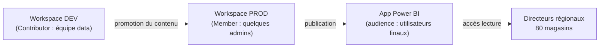
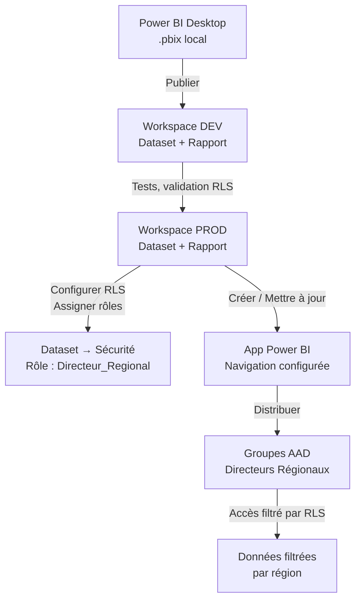

# Power BI Service, workspaces et apps

## Objectifs pédagogiques

À la fin de ce module, vous serez capable de :

- Distinguer les différents types de workspaces et choisir le bon selon le contexte
- Publier un rapport depuis Power BI Desktop vers le Service et comprendre ce qui se passe réellement
- Organiser les contenus d'un workspace en distinguant ce qui est interne (dev, test) de ce qui est distribué aux utilisateurs finaux
- Créer et publier une App Power BI pour distribuer des rapports à une audience large
- Identifier les pièges courants de permissions et de partage avant qu'ils ne deviennent des incidents en production

---

## Mise en situation

Vous venez de terminer un rapport d'analyse commerciale pour une chaîne de distribution de 80 magasins. Le fichier `.pbix` tourne bien sur votre machine. Maintenant, votre responsable veut que les directeurs régionaux puissent y accéder depuis leur navigateur, que chacun ne voie que ses magasins, et que l'équipe data puisse continuer à travailler sur le modèle sans risquer d'écraser la version en production.

Tout ce que vous allez faire dans ce module répond exactement à ce scénario.

---

## Du Desktop au Service : ce qui change vraiment

Power BI Desktop est un outil de développement local. Power BI Service (`app.powerbi.com`) est la plateforme cloud où les rapports vivent, sont partagés, actualisés et consommés. Ce ne sont pas les deux faces d'un même outil — ce sont deux environnements avec des responsabilités distinctes.

Quand vous publiez un `.pbix`, deux objets sont créés dans le workspace :

- **Un dataset** (le modèle de données, les mesures DAX, les relations)
- **Un rapport** (les pages visuelles, les interactions)

Ces deux objets sont indépendants. Vous pouvez avoir plusieurs rapports qui pointent vers le même dataset, et modifier un rapport sans toucher au dataset. C'est un point architectural important : le modèle et la visualisation sont découplés.

🧠 **Concept clé** — Le dataset est l'objet "vivant" dans le Service. Les actualisations, les permissions de données (RLS), les connexions aux sources — tout ça appartient au dataset, pas au rapport.

---

## Les workspaces : comprendre avant de cliquer

### Mon espace de travail vs. les workspaces partagés

Chaque utilisateur Power BI possède un espace personnel appelé **Mon espace de travail**. C'est pratique pour tester, mais c'est une impasse pour tout ce qui concerne la collaboration ou la production. Les contenus qui y sont publiés ne peuvent pas être partagés via une App, et d'autres membres de l'équipe ne peuvent pas les gérer.

Les **workspaces partagés** (appelés "new workspaces" depuis la v2) sont l'unité de collaboration dans Power BI Service. C'est là que les équipes travaillent ensemble sur des datasets, rapports et tableaux de bord.

### Les rôles dans un workspace

Quatre rôles définissent ce que chaque membre peut faire :

| Rôle | Ce qu'il peut faire |
|------|---------------------|
| **Admin** | Tout : gérer les membres, supprimer le workspace, publier des Apps |
| **Member** | Publier, modifier le contenu, créer des Apps (mais pas supprimer le workspace) |
| **Contributor** | Publier et modifier le contenu — ne peut pas gérer les membres ni les Apps |
| **Viewer** | Lire uniquement — ne peut PAS créer de rapport à partir des datasets |

⚠️ **Erreur fréquente** — Donner le rôle "Viewer" au workspace et croire que les utilisateurs peuvent accéder aux données. Un Viewer dans le workspace voit les rapports du workspace, pas ceux distribués via une App. Et il ne peut pas explorer les données dans un rapport "build" mode. Ces deux espaces ont des permissions séparées.

### Organiser ses workspaces en pratique

La question revient systématiquement : un workspace par projet, par équipe, par domaine métier ?

Il n'existe pas de règle universelle, mais un pattern fonctionne bien en entreprise : séparer le workspace de développement/test du workspace de production, et distribuer le contenu via une App depuis ce dernier. Ça ressemble à un pipeline ALM classique.



Cette séparation empêche qu'un développeur qui teste une nouvelle mesure DAX écrase accidentellement ce que voient les utilisateurs finaux. La promotion entre workspaces peut être manuelle ou automatisée via les pipelines de déploiement — un sujet ALM couvert dans un module ultérieur.

---

## Les Apps : la bonne façon de distribuer

Un workspace n'est pas fait pour être consommé directement par des utilisateurs finaux. C'est un espace de travail, pas un portail de diffusion. La **Power BI App** est l'objet conçu pour ça.

### Ce qu'est vraiment une App

Une App est un snapshot publié du contenu d'un workspace : vous choisissez quels rapports et tableaux de bord inclure, vous organisez une navigation, et vous publiez le tout vers une audience. Les utilisateurs accèdent à l'App via un lien ou depuis le catalogue d'apps Power BI — ils ne voient jamais le workspace lui-même.

💡 **Astuce** — L'App est une "vue" sur le workspace. Si vous modifiez un rapport dans le workspace, les changements ne sont PAS visibles dans l'App tant que vous n'avez pas republié l'App. C'est un comportement intentionnel : ça vous donne un contrôle de version minimal sans pipeline ALM complet.

### Créer et publier une App

Depuis le workspace, cliquez sur **Créer une application** (ou **Mettre à jour l'application** si elle existe déjà). Trois étapes :

1. **Configuration** — Nom, description, couleur, logo, site de support
2. **Navigation** — Choisir quels rapports / dashboards inclure, les organiser en sections, les renommer pour les utilisateurs finaux (les noms internes de dev n'ont pas à être exposés)
3. **Permissions** — Définir qui peut voir l'App : toute l'organisation, des groupes de sécurité AAD, ou des utilisateurs individuels

La granularité des permissions se fait à ce niveau — et c'est distinct des rôles du workspace. Un utilisateur peut avoir accès à l'App sans être membre du workspace.

### Permissions d'accès aux données dans l'App

Avoir accès à l'App ne suffit pas à voir les données. L'utilisateur doit aussi avoir accès au dataset sous-jacent. Il existe deux façons de gérer ça :

- **Build permission sur le dataset** — l'utilisateur peut explorer les données librement (créer ses propres rapports)
- **Read permission** — l'utilisateur voit ce que le rapport expose, rien de plus

Pour les utilisateurs finaux qui consomment uniquement, la permission "Read" est suffisante et plus sécurisée. La Build permission est réservée aux analystes qui ont besoin de créer leurs propres vues.

---

## La sécurité au niveau des lignes (RLS)

Pour revenir à notre scénario : les directeurs régionaux ne doivent voir que leurs magasins. C'est le rôle de la **Row-Level Security**.

### Principe

La RLS se configure dans Power BI Desktop (dans l'onglet Modélisation → Gérer les rôles). Vous créez un rôle et vous lui attachez un filtre DAX sur une table. Exemple sur notre cas :

```
-- Rôle : Directeur_Regional
-- Filtre sur la table Magasins :
[Region] = USERPRINCIPALNAME()
```

Cette expression filtre dynamiquement les données : quand un utilisateur se connecte, Power BI compare son email (UPN) avec la colonne `Region` de la table. Il ne voit que les lignes où les valeurs correspondent.

Après publication, vous assignez des utilisateurs ou des groupes AAD à ce rôle dans le Service : Dataset → Sécurité → sélectionner le rôle → ajouter des membres.

🧠 **Concept clé** — La RLS s'applique au dataset, pas au rapport. Si plusieurs rapports partagent le même dataset, la RLS s'applique à tous automatiquement. Pas besoin de la reconfigurer par rapport.

⚠️ **Erreur fréquente** — Oublier de tester la RLS avant de distribuer. Le créateur du dataset et les admins du workspace voient toujours tout — ils "bypassent" la RLS par défaut. Pour tester, utilisez la fonction **"Afficher en tant que"** dans le Service (Dataset → Sécurité → Tester).

---

## Tableaux de bord vs. Rapports

La distinction mérite d'être clarifiée une fois pour toutes, parce qu'elle est source de confusion.

Un **rapport** est ce que vous créez dans Desktop : des pages avec des visuels, des filtres, des interactions. Il est lié à un dataset.

Un **tableau de bord** (dashboard) n'existe que dans le Service. C'est une collection de vignettes épinglées depuis différents rapports (ou même différents datasets). Il est plat — une seule page, pas de filtres interactifs natifs, pas de slicers.

| | Rapport | Tableau de bord |
|---|---|---|
| Créé dans | Desktop ou Service | Service uniquement |
| Pages | Plusieurs | Une seule |
| Interactivité | Filtres, slicers, drillthrough | Limitée (clic → rapport source) |
| Sources | Un dataset | Plusieurs rapports/datasets |
| Inclus dans une App | ✅ | ✅ |

💡 **Astuce** — Les tableaux de bord sont utiles pour les vues exécutives consolidées (KPIs de plusieurs domaines sur une seule page). Pour tout ce qui nécessite de l'exploration et des filtres, restez sur des rapports.

---

## Flux complet : de la publication à la consommation

Mettons tout ça ensemble de bout en bout :



---

## Bonnes pratiques

**Nommage** — Adoptez une convention de nommage dès le départ : `[Domaine]_[Sujet]_[Env]`. Exemple : `Ventes_Performance_PROD`. Dans six mois, quand vous aurez 40 datasets, vous remercierez cette décision.

**Certifications** — Dans le Service, un dataset peut être "promu" ou "certifié". La promotion est faite par n'importe quel contributeur. La certification est réservée aux admins et signale que le dataset respecte les standards de l'organisation (qualité, gouvernance). Utilisez la certification pour les datasets partagés critiques — ça évite la prolifération de copies non maintenues.

**Évitez les partages directs** — Partager un rapport "à une personne" via un lien direct fonctionne, mais ne scale pas. Dès que vous avez plus de 5-10 utilisateurs, passez par une App avec des groupes AAD. C'est plus maintenable, auditables et révocable.

**Licences** — Un utilisateur sans licence Power BI Pro (ou Premium Per User) ne peut pas accéder à un workspace partagé ni à une App, sauf si le workspace est sur une capacité Premium. C'est souvent le premier blocage rencontré en production. Vérifiez les licences avant de promettre un accès.

**Audit** — Le Service conserve un journal d'activité consultable via le portail d'administration ou via l'API. Activez-le dès le début pour les workspaces sensibles : qui a consulté quoi, quand, depuis quelle IP.

---

## Résumé

| Concept | Définition courte | À retenir |
|---------|-------------------|-----------|
| Workspace | Espace collaboratif dans le Service | Séparer dev/prod — ne pas exposer directement aux utilisateurs |
| Dataset | Modèle de données publié (indépendant du rapport) | RLS, actualisations et permissions vivent sur le dataset |
| Rapport | Pages visuelles liées à un dataset | Plusieurs rapports peuvent pointer le même dataset |
| Tableau de bord | Page unique de vignettes épinglées | Utile pour synthèse executive, pas pour l'exploration |
| App | Distribution packagée d'un workspace | Interface for end users — republier pour propager les changements |
| RLS | Filtre DAX par utilisateur/rôle | S'applique au dataset, s'assigne dans le Service |
| Rôles workspace | Admin / Member / Contributor / Viewer | Viewer workspace ≠ accès App — deux espaces distincts |

Le fil conducteur de ce module : dans Power BI Service, **tout est question de séparation des responsabilités**. Le workspace pour collaborer, l'App pour distribuer, le dataset pour centraliser la sécurité et la logique. Quand ces trois couches sont bien distinctes, la maintenance devient linéaire au lieu d'exponentielle.

---

<!-- snippet
id: powerbi_workspace_roles
type: concept
tech: Power BI
level: intermediate
importance: high
format: knowledge
tags: workspace, roles, permissions, collaboration
title: Les 4 rôles d'un workspace Power BI
content: Admin > Member > Contributor > Viewer. Contributor peut publier/modifier mais pas gérer les membres ni les Apps. Viewer voit les contenus du workspace mais ne peut pas créer de rapport à partir d'un dataset ni accéder à une App — ce sont deux espaces de permissions séparés.
description: Rôle Viewer workspace ≠ accès App. Contributor ne peut pas publier une App. Admin est le seul à pouvoir supprimer le workspace.
-->

<!-- snippet
id: powerbi_publish_objects
type: concept
tech: Power BI
level: intermediate
importance: high
format: knowledge
tags: dataset, rapport, publication, desktop
title: Publication .pbix : 2 objets créés dans le Service
content: Publier un .pbix crée toujours deux objets distincts : un Dataset (modèle, mesures DAX, relations, connexions aux sources) et un Rapport (pages visuelles). Ces objets sont indépendants — plusieurs rapports peuvent pointer le même dataset. Modifier un rapport ne touche pas le dataset.
description: Le dataset est l'objet central : RLS, actualisations et permissions de données lui appartiennent, pas au rapport.
-->

<!-- snippet
id: powerbi_app_republish
type: warning
tech: Power BI
level: intermediate
importance: high
format: knowledge
tags: app, publication, mise à jour, distribution
title: Modifications workspace non visibles dans l'App sans republication
content: Piège : modifier un rapport dans un workspace ne met PAS à jour automatiquement l'App publiée. Les utilisateurs finaux continuent de voir la version précédente. Il faut explicitement cliquer "Mettre à jour l'application" depuis le workspace pour propager les changements.
description: L'App est un snapshot du workspace au moment de la publication. Toute modification nécessite une republication manuelle.
-->

<!-- snippet
id: powerbi_rls_bypass
type: warning
tech: Power BI
level: intermediate
importance: high
format: knowledge
tags: rls, sécurité, test, admin
title: Les admins workspace bypassent la RLS par défaut
content: Piège critique : les créateurs du dataset et les Admins/Members du workspace voient TOUTES les données, même si la RLS est configurée. Pour tester la RLS du point de vue d'un utilisateur réel, utiliser "Dataset → Sécurité → Tester en tant que rôle" dans le Service. Ne jamais valider la RLS depuis un compte admin.
description: Un admin de workspace ne voit jamais la RLS s'appliquer sur son compte — tester avec "Afficher en tant que" avant toute mise en production.
-->

<!-- snippet
id: powerbi_rls_dynamic
type: concept
tech: Power BI
level: intermediate
importance: high
format: knowledge
tags: rls, dax, userprincipalname, sécurité
title: RLS dynamique avec USERPRINCIPALNAME()
content: La fonction DAX USERPRINCIPALNAME() retourne l'email de l'utilisateur connecté. Utilisée dans un filtre de rôle RLS (ex: [Email_Manager] = USERPRINCIPALNAME()), elle filtre automatiquement les lignes selon l'identité du connecté. Un seul rôle couvre tous les utilisateurs — pas besoin d'un rôle par personne.
description: USERPRINCIPALNAME() est la base de la RLS dynamique : 1 rôle + 1 filtre DAX couvre N utilisateurs avec des vues différentes.
-->

<!-- snippet
id: powerbi_dataset_rls_scope
type: concept
tech: Power BI
level: intermediate
importance: medium
format: knowledge
tags: rls, dataset, rapport, portée
title: La RLS s'applique au dataset, pas au rapport
content: La RLS est configurée une fois sur le dataset dans le Service (Dataset → Sécurité). Elle s'applique automatiquement à TOUS les rapports qui utilisent ce dataset, y compris les rapports créés ultérieurement par d'autres utilisateurs. Inutile de reconfigurer la RLS rapport par rapport.
description: Centraliser la RLS sur le dataset garantit qu'aucun rapport dérivé ne peut contourner les restrictions, même créé par un tiers.
-->

<!-- snippet
id: powerbi_app_vs_workspace
type: concept
tech: Power BI
level: intermediate
importance: high
format: knowledge
tags: app, workspace, distribution, end users
title: Workspace = espace de travail / App = espace de consommation
content: Un workspace est fait pour les équipes data qui construisent. Une App est l'interface destinée aux utilisateurs finaux. Un utilisateur peut accéder à une App sans être membre du workspace. L'App permet de choisir quels rapports exposer, de les renommer, et de les organiser en sections — sans exposer l'arborescence interne du workspace.
description: Ne pas donner accès direct au workspace aux utilisateurs finaux : utiliser une App pour contrôler ce qui est visible et isoler la production du développement.
-->

<!-- snippet
id: powerbi_dashboard_vs_report
type: concept
tech: Power BI
level: intermediate
importance: medium
format: knowledge
tags: dashboard, rapport, différence, service
title: Dashboard vs. Rapport dans Power BI Service
content: Un rapport est créé dans Desktop (ou Service), multi-pages, avec slicers et filtres interactifs, lié à un seul dataset. Un tableau de bord (dashboard) n'existe que dans le Service : une seule page, des vignettes épinglées depuis plusieurs rapports ou datasets différents, sans filtres natifs. Cliquer une vignette renvoie au rapport source.
description: Dashboard = synthèse executive multi-sources (KPIs). Rapport = exploration interactive. Ne pas les confondre lors de la conception d'une App.
-->

<!-- snippet
id: powerbi_license_access
type: warning
tech: Power BI
level: intermediate
importance: high
format: knowledge
tags: licence, pro, premium, accès, workspace
title: Pas de licence Pro = pas d'accès workspace partagé ni App
content: Piège fréquent en déploiement : un utilisateur sans licence Power BI Pro (ou PPU) ne peut pas accéder à un workspace partagé ni à une App publiée depuis ce workspace. Exception : si le workspace est hébergé sur une capacité Power BI Premium, les consommateurs d'App peuvent avoir une licence gratuite. Vérifier les licences avant de distribuer.
description: L'absence de licence Pro est le premier blocage rencontré lors d'un premier déploiement — anticiper avant de promettre un accès aux utilisateurs.
-->

<!-- snippet
id: powerbi_certification_dataset
type: tip
tech: Power BI
level: intermediate
importance: medium
format: knowledge
tags: certification, gouvernance, dataset, endorsement
title: Certifier un dataset pour limiter la prolifération de copies
content: Dans le Service, un dataset peut être "Promu" (par tout contributeur) ou "Certifié" (par un admin tenant uniquement). La certification signale que le dataset respecte les standards de l'organisation. Certifier les datasets partagés critiques pousse les utilisateurs à les réutiliser plutôt qu'à dupliquer le modèle — ce qui réduit la dette technique et les incohérences de métriques.
description: Certification = label qualité administré. Promouvoir les datasets centraux certifiés évite la prolifération de copies non maintenues dans l'organisation.
-->
