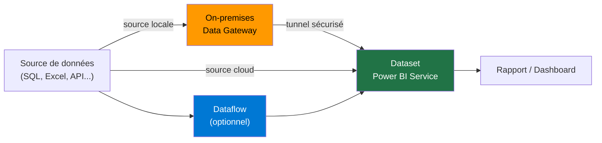
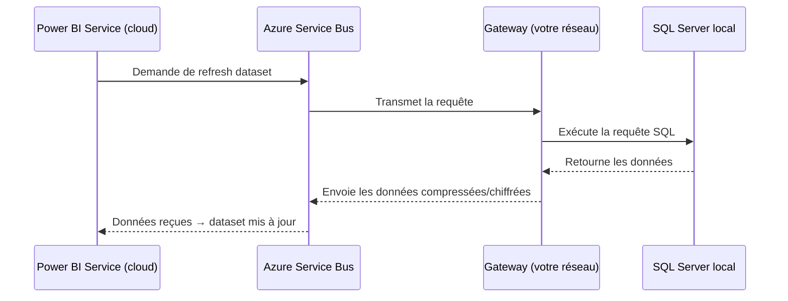

# Refresh, gateways et dataflows

## Objectifs pédagogiques

À l'issue de ce module, vous serez capable de :

1. Expliquer pourquoi un rapport Power BI peut afficher des données périmées et comment y remédier
2. Configurer une On-premises data gateway pour exposer des sources locales au service cloud
3. Paramétrer un scheduled refresh sur un dataset publié dans Power BI Service
4. Créer un dataflow Power BI pour centraliser et réutiliser une transformation M/Power Query
5. Choisir entre import, DirectQuery et dataflow selon les contraintes métier réelles — volume, fraîcheur, charge source, réutilisabilité

---

## Mise en situation

Vous venez de publier un rapport sur les ventes pour le service commercial. Accueil enthousiaste — jusqu'à ce que le responsable revienne deux jours plus tard : "Les chiffres sont figés depuis lundi, ça ne correspond plus à rien." Vous ouvrez Power BI Service et vous réalisez que le dataset n'a jamais été actualisé depuis la publication.

Derrière ce problème apparemment simple se cache une vraie question d'architecture : où vivent vos données ? Comment le cloud Power BI peut-il aller les chercher si elles sont dans un serveur SQL de votre datacenter ? Qui déclenche l'actualisation, à quelle fréquence, et comment savoir quand ça échoue ?

Ce module répond à ces questions de bout en bout — en couvrant aussi les limites concrètes qui feront la différence entre une architecture qui tient en production et une qui s'effondre à la première contrainte.

---

## Contexte et problématique

Quand vous travaillez dans Power BI Desktop, vous cliquez sur "Actualiser" et les données arrivent. Ça fonctionne parce que Desktop s'exécute sur votre machine, qui a accès au réseau local, aux fichiers, aux bases de données.

Quand vous publiez sur Power BI Service, le rapport passe dans le cloud Microsoft. Mais le cloud n'a pas accès à votre serveur SQL interne. Il ne sait même pas qu'il existe. C'est le **problème de connectivité** que la gateway résout.

Il y a un second problème distinct : même si la source est cloud-native (Azure SQL, SharePoint Online), les données importées dans le dataset sont une **photo prise au moment de la publication**. Sans refresh planifié, cette photo vieillit indéfiniment.

Les dataflows répondent à un troisième problème : quand dix rapports font les mêmes transformations Power Query sur les mêmes sources, vous avez dix fois le même code à maintenir — et inévitablement, dix versions qui divergent.

Ces trois problèmes sont liés. La suite les traite dans l'ordre.

---

## Le cycle de vie d'une donnée dans Power BI



La gateway est un relais — elle ne stocke rien. Le dataset est le conteneur de données importées. Le dataflow est une couche de transformation réutilisable, optionnelle mais souvent précieuse dès qu'une source est partagée entre plusieurs rapports.

---

## Le refresh : fonctionnement, limites et modes

### Pourquoi les données ne se mettent pas à jour seules

En mode **Import** — le plus courant — Power BI copie physiquement les données dans son moteur VertiPaq. Le dataset est autonome et rapide à interroger, mais statique. Pour le mettre à jour, il faut déclencher un refresh, qui relance la requête vers la source, ré-importe les données et recompresse le tout.

En mode **DirectQuery**, il n'y a pas de copie. Chaque interaction avec le rapport génère une requête live vers la source. Pas besoin de refresh — mais la performance dépend entièrement de la base cible, et toutes les sources ne supportent pas ce mode.

La question n'est pas "quel mode est le meilleur ?" mais "quel mode correspond à ma contrainte ?" :

- **Import** sur 50 millions de lignes bien modélisées : refresh en 3 à 8 minutes, rendu visuel en millisecondes. C'est la cible pour la majorité des rapports.
- **Import** sur 500 millions de lignes compressées : comptez 3 à 5 Go en mémoire VertiPaq et des refreshs qui durent. À ce volume, le refresh incrémentiel n'est plus optionnel.
- **DirectQuery** sur une base bien indexée avec filtres sélectifs : réponse en 1 à 3 secondes, données fraîches à chaque clic.
- **DirectQuery** sur 100 millions de lignes avec filtres non indexés : requêtes SQL de 30 secondes ou plus, timeouts, et une base de production sous pression aux heures de pic. C'est le scénario catastrophe le plus courant avec ce mode.

🧠 **Règle pratique** : Import jusqu'à quelques dizaines de millions de lignes avec des refreshs acceptables. DirectQuery uniquement si la fraîcheur est vraiment critique ET si la base source est dimensionnée pour absorber la charge des visuels en temps réel — pas la base de production partagée avec dix autres applications.

### Configurer un refresh planifié

Dans Power BI Service : dataset → **Paramètres** → **Refresh planifié**.

Les limites à connaître avant de concevoir votre architecture :

| Licence | Refreshs planifiés / jour | Refresh incrémentiel optimisé |
|---|---|---|
| **Pro** | 8 | ❌ |
| **Premium Per User (PPU)** | 48 | ✅ |
| **Premium (capacité)** | 48 | ✅ |

Un besoin de refresh toutes les 30 minutes exige PPU ou Premium — à valider dès la phase de design, pas en production.

Quelques comportements qui surprennent :

- Si un refresh échoue plusieurs fois de suite, Power BI **désactive automatiquement** le scheduled refresh et envoie un mail au propriétaire du dataset. Il faut aller le réactiver manuellement dans les paramètres.
- Le fuseau horaire du refresh est configurable — pensez-y si votre équipe est internationale ou si vous gérez des données multi-fuseaux.
- Vous pouvez déclencher un refresh à la demande via l'interface ou via l'API REST Power BI (endpoint : `POST /groups/{groupId}/datasets/{datasetId}/refreshes`) — utile pour l'orchestrer depuis Power Automate ou un pipeline.

⚠️ **Piège classique** : un refresh planifié sans gateway configurée pour une source locale échouera au premier essai, puis se désactivera automatiquement. Power BI envoie un mail, mais si personne ne le surveille, le rapport affiche des données périmées sans aucun indicateur visible côté utilisateur. Vérifiez toujours la connectivité avant de mettre en production.

### Refresh incrémentiel

Sur des tables volumineuses, ré-importer toute la table à chaque refresh est coûteux — en temps, en charge sur la source, et en ressources Power BI. Le **refresh incrémentiel** résout ça : il ne recharge que les données récentes (typiquement les derniers jours) tout en conservant l'historique.

Configuration dans Power BI Desktop : clic droit sur la table → **Refresh incrémentiel**. Vous définissez une fenêtre à archiver (ex : 3 ans) et une fenêtre à rafraîchir (ex : 7 derniers jours).

La contrainte technique absolue : la table Power Query doit utiliser deux paramètres nommés **exactement** `RangeStart` et `RangeEnd` (type Date/Time, casse respectée). Power BI les injecte automatiquement lors du refresh. Si vous les nommez autrement, Power BI ne les reconnaît pas et recharge toute la table à chaque exécution.

💡 Le partitionnement optimisé (qui rend le refresh incrémentiel vraiment efficace côté service) est réservé à Premium et PPU. En Pro, la configuration fonctionne, mais sans l'optimisation moteur.

---

## La On-premises Data Gateway

### Ce que c'est vraiment

La gateway est un logiciel Windows installé sur une machine de votre réseau local. Elle ouvre une **connexion sortante sécurisée** vers Azure Service Bus — Power BI Service n'entre jamais dans votre réseau, c'est la gateway qui sort. Aucun flux entrant depuis internet.



C'est un point généralement rassurant pour les équipes sécurité : votre pare-feu n'a besoin d'aucune règle entrante spécifique.

### Prérequis et installation

**Prérequis machine :**
- Windows 10 / Windows Server 2016 minimum
- .NET Framework 4.8
- Accès internet sortant sur les ports **443** et **5671/5672** (Azure Service Bus)
- Machine allumée en permanence — une gateway sur un poste qui se met en veille est une gateway qui tombe

**Installation :**

Téléchargez l'installeur depuis `https://aka.ms/gateway` et exécutez-le sur la machine cible. Lors de la configuration initiale, connectez-vous avec un compte Microsoft 365 — ce compte devient l'administrateur de la gateway.

Enregistrement dans Power BI Service :

```
Paramètres (⚙️) → Gérer les connexions et passerelles → + Nouveau → Passerelle de données locale
```

Vous retrouvez la gateway enregistrée. Ajoutez ensuite les **sources de données** dessus : chaque source est une connexion nommée avec ses credentials (compte SQL, credentials Windows, etc.).

**Gateway personnelle vs standard :**

| | Gateway personnelle | Gateway standard |
|---|---|---|
| Partageable | ❌ | ✅ |
| DirectQuery | ❌ | ✅ |
| Cluster HA | ❌ | ✅ |
| Usage recommandé | Tests individuels | Tout usage entreprise |

En entreprise, utilisez toujours le mode standard. La gateway personnelle crée une dépendance sur un compte nominatif — si la personne quitte l'organisation, tous ses datasets tombent.

### Gateway en cluster pour la haute disponibilité

Pour éviter qu'une machine en panne bloque tous les refreshs, regroupez plusieurs instances en cluster. Power BI distribue automatiquement les requêtes et bascule sur les membres disponibles en cas de panne.

```
Gérer les passerelles → sélectionner une gateway → Paramètres → Ajouter un membre au cluster
```

⚠️ Toutes les machines du cluster doivent avoir été installées avec la **même clé de récupération**. Cette clé est définie à la première installation. Sans elle, impossible d'ajouter un membre, impossible de récupérer la configuration après une panne. Stockez-la dans un coffre-fort (Azure Key Vault, gestionnaire d'entreprise) dès le départ — pas dans un fichier texte sur le bureau.

### Associer un dataset à une gateway

Une fois la gateway installée et les sources configurées :

```
Dataset → Paramètres → Connexion à la passerelle → sélectionner la gateway et mapper les sources
```

Si vos chaînes de connexion dans Desktop utilisaient des paramètres (nom de serveur variable, environnement), vous devrez les mapper manuellement ici.

---

## Les dataflows Power BI

### Le problème qu'ils résolvent

Cinq équipes construisent chacune leur rapport sur les données RH. Chacune a sa version de la "table des employés actifs", avec ses propres règles de filtrage, ses propres renommages. Lors du CODIR, les chiffres divergent. Chacun a raison selon sa définition — et personne ne peut trancher.

Un dataflow, c'est la réponse structurelle : une **transformation Power Query exécutée dans le cloud**, dont le résultat est stocké et peut être consommé par n'importe quel dataset du tenant. Une seule définition, un seul résultat.

### Créer et consommer un dataflow

Dans Power BI Service, sur un workspace :

```
+ Nouveau → Dataflow → Définir de nouvelles tables
```

L'éditeur Power Query en ligne s'ouvre — mêmes transformations que dans Desktop, mais exécutées côté service. Une fois enregistré, le dataflow a son propre cycle de refresh, indépendant des datasets qui le consomment.

Pour consommer ce dataflow dans un dataset, ouvrez Power BI Desktop :

```
Obtenir des données → Power Platform → Dataflows Power BI
```

Sélectionnez votre tenant, workspace, dataflow — et récupérez les tables transformées. Le dataset ne se connecte plus à la source brute, il se connecte au résultat propre du dataflow.

🧠 **L'ordre de refresh est critique** : si le dataflow et le dataset ont tous les deux un refresh planifié, le dataflow doit se rafraîchir **avant** le dataset. Planifiez le dataset 15 à 30 minutes après le dataflow. Sans cet écart, le dataset lira systématiquement les données de l'exécution précédente même si la source a changé — une erreur fréquente lors du premier déploiement.

### Limites techniques à connaître

Avant de construire une architecture sur les dataflows, quelques contraintes réelles :

- **Durée max d'un refresh de dataflow** : 3 heures (après quoi l'exécution est interrompue)
- **Nombre de refreshs simultanés** : limité selon la capacité — en Pro/PPU, les refreshs s'exécutent séquentiellement sur un workspace partagé ; en Premium capacité, plusieurs refreshs peuvent tourner en parallèle
- **Taille des tables stockées** : pas de limite documentée stricte, mais des dataflows très lourds (plusieurs centaines de millions de lignes) peuvent dépasser le timeout ou saturer la capacité

Si votre dataflow ne termine pas, commencez par réduire la volumétrie chargée (refresh incrémentiel sur le dataflow, filtres agressifs) avant d'augmenter la capacité.

### Dataflows et Dataverse

Si votre organisation utilise Dataverse, les dataflows peuvent écrire directement dans des tables Dataverse au lieu de l'Azure Data Lake par défaut. C'est un pont utile entre Power BI et les applications Power Apps / Power Automate qui s'appuient sur le même modèle de données.

```
Dataflow → Paramètres de chargement → Charger dans une entité Dataverse
```

---

## Choisir la bonne architecture : trois scénarios contrastés

Plutôt qu'une matrice abstraite, voici trois contextes réels avec les choix qui s'imposent et pourquoi.

### Scénario A — PME avec SQL Server local

**Contexte :** ERP SQL Server hébergé dans la salle serveur. 2 millions de lignes de transactions. L'équipe finance veut un tableau de bord actualisé toutes les heures en journée. Licence Pro.

**Contraintes :** Pas d'accès cloud direct à la base, 8 refreshs/jour maximum en Pro.

**Architecture :**
1. **Gateway standard** sur un serveur Windows dédié dans la salle serveur
2. **Import + scheduled refresh** toutes les heures de 7h à 20h (13 refreshs → nécessite PPU ou Premium — à arbitrer avec la DSI)
3. **Dataflow** si d'autres équipes veulent les mêmes données brutes — sinon connexion directe suffit

**Point de vigilance :** Après une coupure réseau, la gateway peut se retrouver en état "déconnecté" au redémarrage. Le service Windows de la gateway doit être configuré en démarrage automatique, et un monitoring proactif (Azure Monitor, supervision interne) doit alerter avant que le premier refresh échoue.

---

### Scénario B — Groupe multinational avec sources hétérogènes

**Contexte :** Filiales en Europe et Amérique du Nord. Sources : SAP on-premises en France, Azure SQL aux USA, fichiers Excel sur SharePoint. Besoin de consolider dans un seul modèle de reporting.

**Contraintes :** Sources disparates, fuseaux horaires différents, plusieurs équipes qui vont construire des rapports sur les mêmes données.

**Architecture :**
1. **Gateway cluster** à deux membres pour SAP on-premises (haute disponibilité)
2. **Dataflows** pour homogénéiser les formats entre SAP, Azure SQL et Excel — une table `Ventes_consolidées` unique consommée par tous les rapports
3. **Refresh ordering** : dataflow à 5h UTC, datasets à 5h30 UTC (avant l'ouverture des bureaux parisiens)
4. **Premium capacité** pour absorber les refreshs parallèles de plusieurs workspaces

**Ce qui se passerait sans dataflow :** Chaque équipe connecterait ses rapports directement aux trois sources, avec ses propres règles de consolidation. Les chiffres divergeraient à la première réunion de direction.

---

### Scénario C — Startup cloud-native

**Contexte :** Toutes les données dans Azure SQL et Azure Blob Storage. 500 000 lignes de transactions, croissance rapide. Besoin de rafraîchissement toutes les 15 minutes pour le dashboard opérationnel.

**Contraintes :** Pas de gateway nécessaire (sources cloud), mais refresh toutes les 15 minutes = 96 refreshs/jour → Premium ou PPU obligatoire.

**Architecture :**
1. **Pas de gateway** — sources cloud directement accessibles
2. **DirectQuery sur la table de transactions temps réel** — la table est bien indexée, les requêtes visuelles sont filtrées sur 30 jours maximum
3. **Import pour les tables de référence** (produits, clients) qui changent peu — performances meilleures que DirectQuery pour ces dimensions
4. **Modèle composite** Import + DirectQuery : les visuels sur les faits récents sont en DirectQuery, les agrégations historiques en Import

**Piège à éviter :** ne pas mettre toutes les tables en DirectQuery "par simplicité". Une requête sur 3 ans de transactions non filtrée en DirectQuery = timeout garanti. Tester la charge SQL avant de valider l'architecture.

---

## Dépannage courant

Les erreurs de refresh suivent des patterns très répétitifs. Voici les plus fréquentes et leur résolution directe.

### Erreur 401 — Unauthorized

**Symptôme :** Le refresh échoue avec "401 Unauthorized" ou "Credentials expired".

**Cause :** Les credentials stockés dans Power BI Service pour la source de données ont expiré ou ont été modifiés (changement de mot de passe, rotation de clé API, expiration d'un token OAuth).

**Résolution :** Dataset → Paramètres → Sources de données → **Modifier les credentials** → resaisir les credentials valides. Si la source utilise OAuth (SharePoint, par exemple), reconnecter manuellement pour renouveler le token.

---

### Refresh timeout

**Symptôme :** Le refresh démarre mais ne termine jamais, puis échoue après plusieurs heures.

**Cause possible A :** La requête Power Query charge trop de données sans filtre — toute la table est rapatriée avant transformation.

**Cause possible B :** La source est lente (requête SQL sans index, API qui throttle).

**Cause possible C :** Dataflow qui dépasse la limite de 3 heures d'exécution.

**Résolution :** Vérifier que les filtres de date sont appliqués tôt dans la requête Power Query (query folding — la source filtre côté SQL, pas Power Query côté client). Activer le refresh incrémentiel pour les grandes tables. Fractionner un dataflow lourd en plusieurs dataflows chaînés.

---

### "Source not found" / "Gateway not found"

**Symptôme :** Le refresh échoue avec "Data source not found" ou "Gateway is offline".

**Cause A — Source not found :** Le nom de la source dans Power BI Service ne correspond plus à la chaîne de connexion du dataset. Arrive après un renommage de serveur ou une migration.

**Cause B — Gateway offline :** La machine hôte de la gateway est éteinte, en veille, ou le service Windows s'est arrêté (mise à jour Windows, coupure réseau prolongée).

**Résolution Source not found :** Dataset → Paramètres → Connexion à la passerelle → remapper la source. Si la chaîne de connexion a changé, republier depuis Desktop avec la nouvelle chaîne.

**Résolution Gateway offline :** Se connecter à la machine hôte → Services Windows → vérifier que "On-premises data gateway service" est en cours d'exécution. Si arrêté, démarrer manuellement. Configurer le service en démarrage automatique pour éviter la récurrence. Mettre en place une alerte de monitoring sur l'état du service.

---

### Refresh désactivé automatiquement

**Symptôme :** Les données sont périmées, aucun refresh récent dans l'historique. L'utilisateur reçoit (ou pas) un mail Power BI.

**Cause :** Power BI a désactivé le refresh planifié après plusieurs échecs consécutifs.

**Résolution :** Dataset → Paramètres → Refresh planifié → vérifier que le toggle est actif → corriger la cause de l'échec → réactiver. **Activer systématiquement les notifications d'échec** (même section) pour ne pas découvrir le problème trois jours après.

---

## Bonnes pratiques et checklists

### Gateway : checklist de mise en service

- [ ] Machine dédiée (pas un poste utilisateur), allumée H24, service configuré en démarrage automatique
- [ ] Compte de service non nominatif pour l'administration (pas `jean.dupont@entreprise.com`)
- [ ] Clé de récupération stockée dans Azure Key Vault ou coffre-fort d'entreprise
- [ ] Ports 443 et 5671/5672 ouverts en sortant depuis la machine hôte
- [ ] Test de connectivité à chaque source validé depuis l'interface gateway *avant* de configurer les refreshs
- [ ] Cluster à deux membres si disponibilité critique
- [ ] Monitoring du service Windows (Azure Monitor, Nagios, ou équivalent)

### Refresh : checklist de configuration

- [ ] Notifications d'échec activées (Paramètres → Refresh → Envoyer des notifications)
- [ ] Fuseau horaire vérifié (surtout pour les équipes internationales)
- [ ] Refresh décalé d'au moins 15 minutes si dataset consomme un dataflow
- [ ] Refreshs de datasets multiples décalés pour éviter les pics de charge simultanés
- [ ] Refresh incrémentiel activé pour les tables > 10M lignes
- [ ] Paramètres `RangeStart` / `RangeEnd` nommés exactement ainsi dans Power Query

### Dataflows : checklists et pièges

- [ ] Tables nommées de manière explicite dans le dataflow (pas "Table1", "Query2")
- [ ] Transformations documentées dans les commentaires M pour les opérations non triviales
- [ ] Dataflow dans un workspace dédié (ne pas mélanger dev et prod)
- [ ] Refresh du dataflow planifié avant le refresh des datasets consommateurs
- [ ] Durée de refresh surveillée — si elle approche les 3 heures, anticiper une optimisation

---

## Résumé

| Concept | Rôle | Points clés |
|---|---|---|
| **Scheduled Refresh** | Maintenir le dataset à jour automatiquement | 8/jour en Pro, 48 en Premium/PPU ; se désactive sur échecs répétés |
| **On-premises Gateway** | Pont entre cloud Power BI et sources locales | Connexion sortante uniquement ; mode standard pour usage partagé |
| **Gateway cluster** | Haute disponibilité | Même clé de récupération obligatoire sur tous les membres |
| **Dataflow** | Centraliser les transformations Power Query | Refresh propre ; consommé par n'importe quel dataset du tenant ; timeout à 3h |
| **Refresh incrémentiel** | Optimiser le refresh sur grandes tables | `RangeStart`/`RangeEnd` obligatoires (casse exacte) ; partitionnement optimisé sur Premium/PPU |
| **Import** | Données en cache VertiPaq, rendu ultra-rapide | 500M lignes ≈ 3-5 Go mémoire ; refresh nécessaire |
| **DirectQuery** | Données temps réel sans import | Pas de refresh, mais requêtes SQL à chaque clic — source doit être indexée et dimensionnée |

Le module suivant aborde la sécurité des données dans Power BI : Row-Level Security, gestion des accès aux workspaces et stratégies de partage — autant de sujets qui s'appuient directement sur l'architecture de données que vous venez de configurer ici.

---

<!-- snippet
id: pbi_refresh_desactivation_auto
type: warning
tech: Power BI
level: intermediate
importance: high
format: knowledge
tags: refresh, dataset, scheduled-refresh, gouvernance
title: Refresh planifié désactivé automatiquement après échecs
content: Si un refresh planifié échoue plusieurs fois consécutives, Power BI le désactive automatiquement et envoie un mail au propriétaire du dataset. Il faut aller dans Paramètres du dataset → Refresh planifié pour le réactiver manuellement. Les données affichées dans le rapport restent périmées sans aucun indicateur visible côté utilisateur final.
description: Piège courant en prod : le refresh s'arrête silencieusement. Activer les notifications d'échec systématiquement dès la mise en production.
-->

<!-- snippet
id: pbi_gateway_connexion_sortante
type: concept
tech: Power BI
level: intermediate
importance: high
format: knowledge
tags: gateway, securite, reseau, on-premises
title: La gateway ouvre une connexion sortante — jamais entrante
content: La On-premises Data Gateway initie elle-même une connexion sortante vers Azure Service Bus (ports 443 et 5671/5672). Power BI Service ne "rentre" jamais dans votre réseau. C'est la gateway qui interroge la source locale et renvoie les données chiffrées vers le cloud. Aucune règle de pare-feu entrante n'est nécessaire.
description: Important pour les équipes sécurité : aucun flux entrant depuis internet. La machine hôte doit avoir accès sortant aux endpoints Azure Service Bus.
-->

<!-- snippet
id: pbi_gateway_cle_recuperation
type: warning
tech: Power BI
level: intermediate
importance: high
format: knowledge
tags: gateway, cluster, haute-disponibilite, administration
title: Clé de récupération gateway — à stocker impérativement
content: La clé de récupération est définie à l'installation de la gateway. Sans elle, impossible d'ajouter un membre à un cluster ni de récupérer la configuration en cas de panne ou de réinstallation. Conséquence : reconfiguration complète de la gateway et reconnexion manuelle de tous les datasets associés. Stocker dans Azure Key Vault ou gestionnaire de mots de passe d'entreprise — jamais en clair sur le serveur.
description: Perte de la clé = reconfiguration complète de la gateway et reconnexion de tous les datasets associés.
-->

<!-- snippet
id: pbi_gateway_mode_personnel_vs_standard
type: concept
tech: Power BI
level: intermediate
importance: medium
format: knowledge
tags: gateway, administration, partage, gouvernance
title: Gateway personnelle vs standard — ne pas confondre en entreprise
content: La gateway personnelle est liée à un seul compte utilisateur, ne peut pas être partagée entre collègues, ne supporte pas DirectQuery, et ne peut pas être organisée en cluster. La gateway standard est partageable entre plusieurs utilisateurs, supporte tous les modes de connexion, et peut être clusterisée pour la haute disponibilité. En entreprise, toujours utiliser le mode standard avec un compte de service non nominatif.
description: Une gateway personnelle en prod crée une dépendance sur un compte nominatif — si la personne quitte l'org, tous ses datasets tombent.
-->

<!-- snippet
id: pbi_incremental_refresh_params
type: concept
tech: Power BI
level: intermediate
importance: high
format: knowledge
tags: refresh, incremental, power-query, performance
title: Refresh incrémentiel — paramètres RangeStart et RangeEnd obligatoires
content: Le refresh incrémentiel repose sur deux paramètres Power Query nommés exactement `RangeStart` et `RangeEnd` (type Date/Time). Power BI les injecte automatiquement lors du refresh pour ne charger que la plage récente. Le nom est case-sensitive et non modifiable. Si les paramètres ont un nom différent, Power BI ne les reconnaît pas et recharge toute la table à chaque refresh. Configure dans Desktop : clic droit sur la table → Refresh incrémentiel.
description: Noms obligatoires, casse exacte. Tout autre nom = rechargement complet de la table à chaque refresh, sans avertissement.
-->

<!-- snippet
id
