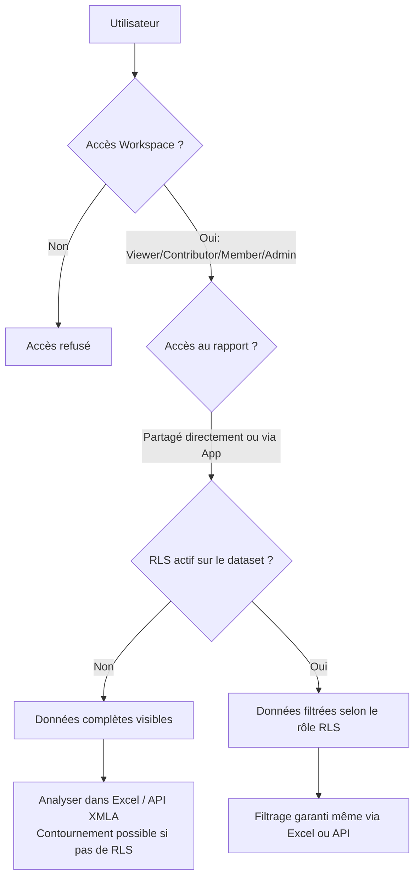
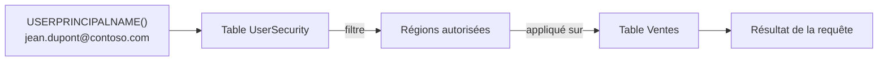

# RLS, sécurité et partage dans Power BI

## Objectifs pédagogiques

À l'issue de ce module, tu seras capable de :

1. **Configurer** des rôles RLS statiques et dynamiques dans Power BI Desktop et les publier sur le service
2. **Identifier** les configurations de partage risquées qui exposent des données au-delà du périmètre prévu
3. **Distinguer** les niveaux de contrôle d'accès disponibles (workspace, app, dataset, rapport) et leurs limites respectives
4. **Durcir** une configuration de partage pour respecter le principe de moindre privilège
5. **Tester** que les règles RLS appliquées filtrent effectivement les données pour un utilisateur donné

---

## Mise en situation

En 2022, une équipe commerciale d'une société de services financiers constate que plusieurs commerciaux peuvent voir les chiffres de vente de leurs collègues dans le rapport Power BI partagé par leur manager. Le rapport a été publié dans un workspace avec rôle **Viewer** pour tous. Le dataset ne contient aucune règle RLS. La défense naïve — "le rapport est en lecture seule, personne ne peut modifier les données" — ne protège rien : un utilisateur Viewer avec accès au dataset peut simplement se connecter depuis Excel ou Power BI Desktop via **Analyser dans Excel** et lire l'intégralité du modèle.

Ce scénario se reproduit systématiquement dès que la sécurité est pensée uniquement au niveau du rapport, et non au niveau du dataset. La distinction est fondamentale et souvent mal comprise.

---

## Anatomie du modèle de sécurité Power BI

Avant de configurer quoi que ce soit, il faut comprendre où se situe chaque couche de contrôle — et laquelle peut être contournée si elle est seule.



🧠 **Concept clé** — La sécurité au niveau rapport n'existe pas dans Power BI. Un rapport est une vue sur un dataset. Si l'accès au dataset est autorisé sans RLS, tous les outils qui se connectent directement au dataset (Excel, Tabular Editor, DAX Studio) ignorent les visuels et les filtres du rapport.

---

## Les quatre niveaux d'accès à comprendre

### 1. Workspace — le périmètre organisationnel

Un workspace contient des rapports, datasets, dataflows et tableaux de bord. Les rôles disponibles sont **Admin, Member, Contributor, Viewer**.

| Rôle | Lire rapports | Lire dataset brut | Modifier | Publier |
|---|---|---|---|---|
| Viewer | ✅ | ❌ direct, mais possible via app | ❌ | ❌ |
| Contributor | ✅ | ✅ | ✅ rapports | ❌ |
| Member | ✅ | ✅ | ✅ | ✅ |
| Admin | ✅ | ✅ | ✅ | ✅ |

⚠️ **Erreur fréquente** — Mettre toute une équipe en **Contributor** parce qu'on veut leur permettre de créer leurs propres rapports. Conséquence : ils ont un accès lecture complet au dataset, RLS ou non. Si le dataset contient des données sensibles (salaires, marges), le Contributor peut les exporter via DAX Studio. Correction : séparer les datasets sensibles dans un workspace dédié avec RLS strict, et ne donner Contributor que sur les workspaces de rapports dérivés.

### 2. Partage direct d'un rapport ou dataset

Le bouton **Partager** dans le service permet de donner accès à un rapport ou un dataset à un utilisateur spécifique. Ce mécanisme est granulaire mais difficile à auditer à l'échelle.

🔴 **Vecteur d'attaque** — Un utilisateur qui reçoit un lien de partage vers un rapport peut, si l'option **"Permettre aux destinataires de partager"** est cochée, redistribuer l'accès à des tiers sans que l'administrateur en soit informé. Le dataset sous-jacent se retrouve accessible à des utilisateurs qui n'auraient jamais dû le voir.

🔒 **Contrôle** — Lors du partage, décocher systématiquement **"Permettre aux destinataires de partager ce rapport"** et **"Permettre aux destinataires de créer du contenu avec les données associées"**. Ce dernier droit ouvre l'accès direct au dataset.

### 3. Applications Power BI — le bon vecteur de distribution

Une **App** Power BI est un package publié depuis un workspace. Elle permet de distribuer des rapports à un large public sans leur donner accès au workspace lui-même.

C'est le modèle recommandé pour la distribution à des utilisateurs finaux : ils voient les rapports via l'app, sans accès direct aux datasets. Combiné avec le RLS, c'est le seul modèle qui protège réellement la granularité des données.

💡 **Astuce** — Une app peut avoir des **audiences** différentes : tu publies la même app avec des vues différentes selon le groupe. Cela évite de multiplier les rapports pour masquer des informations — c'est le RLS qui filtre, pas le rapport.

### 4. Row-Level Security — la seule garantie sur les données

Le RLS filtre les lignes retournées par le dataset au moment de l'exécution de la requête DAX. Il s'applique **quel que soit le canal d'accès** : rapport, Excel, API XMLA, endpoint de connexion Live.

---

## Configurer le RLS — du cas statique au cas dynamique

### RLS statique

Le RLS statique consiste à créer des rôles dans Power BI Desktop avec des filtres DAX fixes.

**Dans Power BI Desktop :**
> Onglet Modélisation → Gérer les rôles → Nouveau rôle → Définir le filtre DAX sur la table cible

Exemple : filtrer la table `Ventes` pour n'afficher que la région Nord.

```
[Region] = "Nord"
```

C'est fonctionnel pour des cas très stables (par pays, par entité légale), mais ingérable dès que la liste des régions ou des utilisateurs évolue. Chaque changement implique de republier le dataset.

### RLS dynamique — le modèle scalable

Le RLS dynamique exploite la fonction DAX `USERPRINCIPALNAME()` pour filtrer les lignes selon l'identité de l'utilisateur connecté. Le modèle de données doit contenir une table de mapping `Utilisateur → Périmètre`.

**Structure recommandée :**

```
Table: UserSecurity
Colonnes: Email (text) | Region (text)
```

**Filtre DAX sur la table Ventes :**

```dax
[Region] IN 
    CALCULATETABLE(
        VALUES(UserSecurity[Region]),
        UserSecurity[Email] = USERPRINCIPALNAME()
    )
```



🧠 **Concept clé** — `USERPRINCIPALNAME()` retourne l'UPN de l'utilisateur authentifié auprès du service Power BI. En environnement Azure AD / Entra ID, c'est l'adresse email de connexion. Si un utilisateur teste dans Power BI Desktop sans être connecté, la fonction retourne l'adresse du compte Desktop local — le RLS ne filtre rien en local, ce qui est normal et attendu.

💡 **Astuce** — Si la table UserSecurity est volumineuse ou mise à jour fréquemment, la stocker dans Dataverse ou SQL Server et ne pas l'importer en mode Import. Utiliser DirectQuery ou un dataflow pour qu'elle se rafraîchisse sans republier le dataset.

### Publier et assigner les rôles

La création du rôle se fait dans Desktop. L'**assignation des utilisateurs** se fait exclusivement dans le service Power BI.

> Service Power BI → Dataset → … → Sécurité → Sélectionner le rôle → Ajouter les membres (utilisateurs ou groupes AD)

⚠️ **Erreur fréquente** — Créer le rôle dans Desktop, republier, et oublier d'assigner les utilisateurs dans le service. Résultat : le rôle existe mais personne ne lui est associé. Les utilisateurs voient toutes les données car aucun rôle RLS ne s'applique à leur identité.

---

## Tester que le RLS fonctionne réellement

Il existe deux mécanismes de test, complémentaires.

### Test dans Power BI Desktop

> Modélisation → Afficher en tant que → Sélectionner un rôle

Ce test simule l'expérience d'un membre du rôle sélectionné. Il ne simule pas un utilisateur spécifique — `USERPRINCIPALNAME()` retournera ton UPN desktop, pas celui de l'utilisateur cible.

Pour valider le RLS dynamique, ajouter temporairement une ligne dans la table UserSecurity avec ton propre email, assigner ton email à une région restreinte, et vérifier le filtrage.

### Test dans le service Power BI

> Dataset → Sécurité → Tester en tant que → [Nom du rôle]

C'est le test le plus fiable : il simule l'expérience réelle dans le service, avec le vrai contexte d'exécution DAX.

🔒 **Contrôle** — Après chaque déploiement de dataset avec RLS, tester avec au moins un compte utilisateur réel (pas admin) pour vérifier que les filtres s'appliquent. Les comptes Admin du workspace **voient toutes les données** même avec RLS actif — comportement voulu mais source de confusion lors des tests.

---

## Surface d'exposition et vecteurs de contournement

| Vecteur | Condition d'exploitation | Mitigation |
|---|---|---|
| Analyser dans Excel | Accès dataset sans RLS | Activer RLS + restreindre l'accès direct au dataset |
| DAX Studio / Tabular Editor | Endpoint XMLA activé + rôle Contributor | Désactiver XMLA pour les datasets sensibles ou restreindre au rôle Member+ |
| Partage avec droit "rebond" | Option "Permettre de partager" cochée | Décocher par défaut, auditer via Activity Log |
| Export de données visuels | Paramètre locataire "Exporter les données" | Désactiver ou restreindre aux membres internes dans les paramètres du tenant |
| Embed public (Publish to Web) | Rapport publié sans authentification | Ne jamais utiliser sur des données internes ; vérifier régulièrement la liste dans Admin Portal |

🔴 **Vecteur d'attaque — Publish to Web** : si un utilisateur (Contributor ou Member) utilise "Publier sur le web", le rapport devient accessible sans authentification depuis n'importe quel navigateur. Le RLS **n'est pas appliqué** sur les rapports publiés de cette façon. Un administrateur peut auditer et révoquer ces publications dans le portail d'administration.

> Admin Portal → Paramètres du locataire → Exporter et partager → Publier sur le web → Désactiver ou restreindre aux admins

---

## Hardening — checklist opérationnelle

Ces contrôles sont applicables sur un tenant existant, sans refonte de l'architecture.

**Au niveau tenant (Admin Portal) :**

- [ ] Désactiver **Publier sur le web** sauf cas explicitement justifiés
- [ ] Restreindre **Exporter les données** (CSV, Excel) aux groupes validés
- [ ] Restreindre **Partager des rapports avec des utilisateurs externes** si pas de besoin B2B
- [ ] Activer les **journaux d'audit** (Activity Log) — ils sont désactivés par défaut dans certains tenants

**Au niveau workspace :**

- [ ] Principe de moindre privilège : Viewer par défaut, Contributor uniquement pour les créateurs de rapports
- [ ] Ne jamais placer des datasets de production dans un workspace personnel (My Workspace)
- [ ] Séparer les datasets partagés des rapports dans des workspaces distincts si le périmètre d'accès diffère

**Au niveau dataset :**

- [ ] Activer le RLS sur tout dataset contenant des données à granularité variable par utilisateur
- [ ] Vérifier l'assignation des rôles après chaque republication
- [ ] Documenter la table de mapping UserSecurity et son processus de mise à jour

**Au niveau rapport / app :**

- [ ] Distribuer via App, pas via partage direct à l'échelle
- [ ] Décocher les droits de repartage et de création de contenu dérivé
- [ ] Auditer trimestriellement les accès via le portail Admin ou via PowerShell (`Get-PowerBIActivityEvent`)

---

## Cas réel en entreprise

Une société de retail déploie Power BI pour ses 200 responsables de magasin. Le rapport de performance est partagé depuis un workspace unique avec le rôle Viewer pour tous. Pas de RLS. Six mois après le déploiement, un manager signale qu'il peut voir les KPIs de tous les autres magasins en utilisant "Analyser dans Excel".

Investigation : le rôle Viewer donne bien accès au dataset. Sans RLS, la connexion Live depuis Excel retourne l'intégralité du modèle.

**Correction déployée :**
1. Création d'une table `MagasinSecurity` (Email, CodeMagasin) alimentée depuis le SIRH via dataflow
2. Règle RLS dynamique sur la table `Ventes` : `[CodeMagasin] IN CALCULATETABLE(VALUES(MagasinSecurity[CodeMagasin]), MagasinSecurity[Email] = USERPRINCIPALNAME())`
3. Création d'un rôle unique `ResponsableMagasin`, assigné au groupe AD correspondant
4. Migration de la distribution vers une App avec audience unique

**Impact :** zéro régression fonctionnelle, filtrage confirmé par test dans le service. Le manager ne voit plus que son magasin, que ce soit depuis le rapport, depuis Excel, ou depuis l'app mobile.

---

## Erreurs fréquentes

**1. Tester le RLS avec un compte Admin du workspace**

Configuration : test du rôle RLS avec le compte qui a publié le dataset. Les Admins du workspace contournent le RLS par design — ils voient tout. Correction : toujours tester avec un compte utilisateur final ou utiliser la fonction "Tester en tant que" dans le service.

**2. Utiliser des filtres de rapport comme substitut au RLS**

Configuration : masquer des visuels ou appliquer des filtres au niveau du rapport pour "cacher" des données. Conséquence : si l'utilisateur a accès au dataset, ces filtres sont ignorés via Excel ou l'API. Correction : le RLS est la seule couche de filtrage garantie au niveau des données.

**3. Table de mapping UserSecurity importée en mode statique**

Configuration : table UserSecurity importée en mode Import depuis un fichier Excel local. Conséquence : chaque modification de périmètre utilisateur nécessite de republier le dataset manuellement. Correction : stocker la table dans une source actualisable (SharePoint List, Dataverse, SQL) et la rafraîchir via le scheduler de dataset.

**4. RLS configuré mais aucun utilisateur assigné au rôle**

Configuration : rôle créé dans Desktop, republié, mais assignation oubliée dans le service. Conséquence : aucun filtre actif, tous les utilisateurs voient l'intégralité des données. Correction : intégrer la vérification d'assignation dans le processus de déploiement (checklist post-publish).

---

## Résumé

La sécurité des données dans Power BI repose sur deux couches distinctes : le contrôle d'accès au niveau workspace/rapport (qui peut accéder à quoi) et le RLS au niveau dataset (quelles lignes de données chaque utilisateur peut voir). Ces deux couches sont indépendantes — une sans l'autre laisse un périmètre ouvert. Le RLS dynamique via `USERPRINCIPALNAME()` est le mécanisme scalable, mais il exige une table de mapping maintenue et une assignation rigoureuse des rôles dans le service. La distribution via App (et non via partage direct) réduit la surface d'exposition en évitant l'accès direct au workspace. Trois vecteurs de contournement critiques à surveiller : Publish to Web, Analyser dans Excel sans RLS, et les droits de repartage activés par défaut. L'audit régulier via l'Activity Log reste le seul moyen de détecter des accès non anticipés.

---

<!-- snippet
id: pbi_rls_dynamic_dax
type: concept
tech: power bi
level: intermediate
importance: high
format: knowledge
tags: rls, dax, userprincipalname, sécurité, filtrage
title: RLS dynamique avec USERPRINCIPALNAME()
content: USERPRINCIPALNAME() retourne l'UPN de l'utilisateur connecté au service Power BI. Associé à une table de mapping Email→Périmètre, ce filtre DAX s'applique sur toutes les requêtes quel que soit le canal d'accès (rapport, Excel, XMLA). En local dans Desktop, retourne l'UPN du compte Windows — le RLS ne filtre pas en mode développement.
description: Mécanisme de base du RLS dynamique : la requête DAX est filtrée à l'exécution selon l'identité de l'utilisateur authentifié auprès du service.
-->

<!-- snippet
id: pbi_rls_assign_roles
type: warning
tech: power bi
level: intermediate
importance: high
format: knowledge
tags: rls, roles, déploiement, service, sécurité
title: RLS publié sans assignation = données exposées
content: Créer un rôle RLS dans Desktop et republier le dataset ne suffit pas. Si aucun utilisateur n'est assigné au rôle dans le service (Dataset → Sécurité), aucun filtre ne s'applique — tous les utilisateurs voient l'intégralité du modèle. Correction : après chaque publication, vérifier l'assignation dans le service Power BI.
description: Le rôle RLS créé dans Desktop est une coquille vide jusqu'à ce qu'un utilisateur ou groupe AD lui soit associé dans le service.
-->

<!-- snippet
id: pbi_rls_admin_bypass
type: warning
tech: power bi
level: intermediate
importance: high
format: knowledge
tags: rls, admin, test, contournement
title: Les Admins de workspace contournent le RLS par design
content: Un utilisateur avec le rôle Admin (ou Member) sur le workspace voit toutes les données du dataset, même si un rôle RLS lui est assigné. Tester le RLS avec son propre compte admin ne valide rien. Correction : utiliser "Tester en tant que → [Rôle]" dans le service, ou utiliser un compte Viewer de test.
description: Comportement voulu mais piège classique : tester le RLS avec un compte admin retourne toujours les données complètes, masquant un problème de configuration.
-->

<!-- snippet
id: pbi_publish_to_web_risk
type: warning
tech: power bi
level: intermediate
importance: high
format: knowledge
tags: publish to web, exposition, rls, tenant
title: Publish to Web désactive le RLS et expose publiquement
content: Un rapport publié via "Publier sur le web" est accessible sans authentification. Le RLS n'est pas appliqué sur ces rapports. Tout utilisateur Contributor ou Member peut déclencher cette action si le paramètre tenant n'est pas restreint. Correction : Admin Portal → Paramètres du locataire → Publier sur le web → Activer uniquement pour les administrateurs ou désactiver.
description: Vecteur d'exfiltration silencieux : un rapport interne avec données sensibles peut devenir public via un clic d'un Contributor, sans notification admin.
-->

<!-- snippet
id: pbi_analyse_excel_vector
type: warning
tech: power bi
level: intermediate
importance: high
format: knowledge
tags: excel, dataset, contournement, rls, vecteur
title: Analyser dans Excel contourne les filtres du rapport
content: "Analyser dans Excel" ouvre une connexion Live directement au dataset, ignorant tous les filtres et visuels du rapport. Si aucun RLS n'est actif, l'utilisateur accède à l'intégralité du modèle tabular. Le RLS s'applique en revanche sur les connexions Excel si le rôle est correctement configuré et assigné.
description: Les filtres rapport ne protègent pas les données — seul le RLS au niveau dataset garantit le filtrage sur tous les canaux d'accès, y compris Excel.
-->

<!-- snippet
id: pbi_rls_test_service
type: tip
tech: power bi
level: intermediate
importance: medium
format: knowledge
tags: rls, test, service, validation
title: Tester le RLS dans le service avec "Afficher en tant que"
content: Dans le service Power BI, aller sur le dataset → … → Sécurité → sélectionner un rôle → cliquer "Tester en tant que [Rôle]". Ce test simule l'expérience réelle de l'utilisateur final avec le contexte d'exécution DAX du service, incluant USERPRINCIPALNAME(). Plus fiable que le test dans Desktop.
description: Seul ce test valide le comportement réel du RLS en production — à exécuter après chaque modification du modèle ou des assignations.
-->

<!-- snippet
id: pbi_workspace_roles_least_privilege
type: tip
tech: power bi
level: intermediate
importance: medium
format: knowledge
tags: workspace, rôles, moindre privilège, contributor, sécurité
title: Contributor a un accès lecture complet au dataset
content: Le rôle Contributor permet de lire directement le dataset, de se connecter via DAX Studio et d'exporter via Excel — indépendamment du RLS. Pour les utilisateurs qui ne font que consulter, utiliser Viewer. Pour les créateurs de rapports sur données sensibles, isoler le dataset dans un workspace séparé avec accès restreint.
description: Donner Contributor pour "permettre de créer des rapports" expose le dataset à une lecture complète — dissocier workspace de publication et workspace de données si nécessaire.
-->

<!-- snippet
id: pbi_usersecurity_table_refresh
type: tip
tech: power bi
level: intermediate
importance: medium
format: knowledge
tags: rls, table mapping, dataflow, actualisation, scalabilité
title: Stocker la table UserSecurity dans une source actualisable
content: Si la table de mapping Email→Périmètre est importée depuis un fichier Excel local, chaque modification de périmètre oblige à republier le dataset. Stocker cette table dans SharePoint List, Dataverse ou SQL Server, et la connecter en Import avec un refresh planifié — ou en DirectQuery si les changements sont fréquents.
description: La maintenabilité du RLS dynamique dépend directement de la source de la table de mapping — un fichier local bloque toute mise à jour sans republication.
-->

<!-- snippet
id: pbi_share_reshare_option
type: warning
tech: power bi
level: intermediate
importance: medium
format: knowledge
tags: partage, reshare, accès, gouvernance, dataset
title: L'option "Permettre de repartager" crée une chaîne d'accès incontrôlable
content: Lors du partage d'un rapport, l'option "Permettre aux destinataires de partager ce rapport" est parfois cochée par défaut selon la version. Un destinataire peut alors redistribuer l'accès à des tiers, y compris l'accès au dataset. Correction : décocher systématiquement cette option et auditer via Admin Portal → Activity Log (opération ShareReport).
description: Chaque repartage crée un accès direct non tracé dans le workspace — la chaîne peut rapidement sortir du périmètre autorisé.
-->
