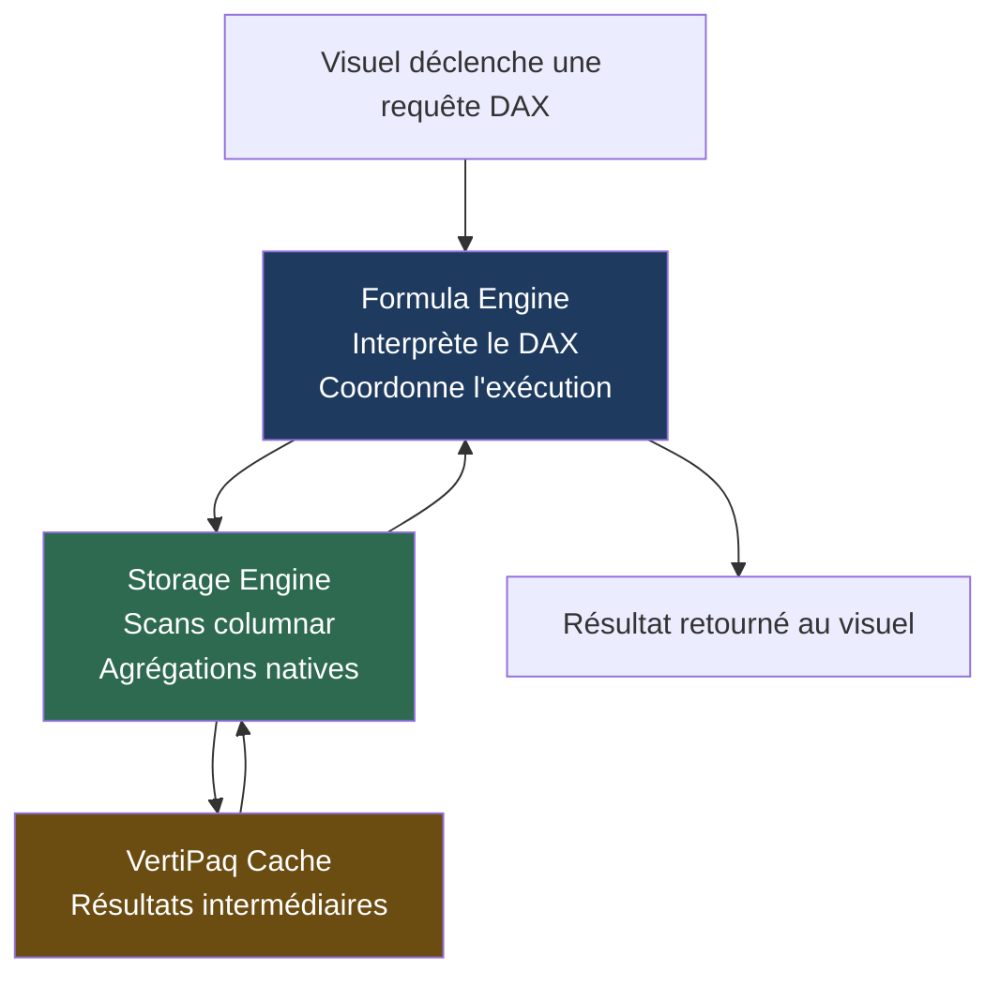
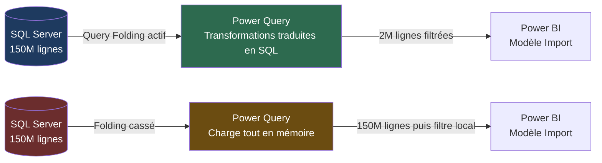
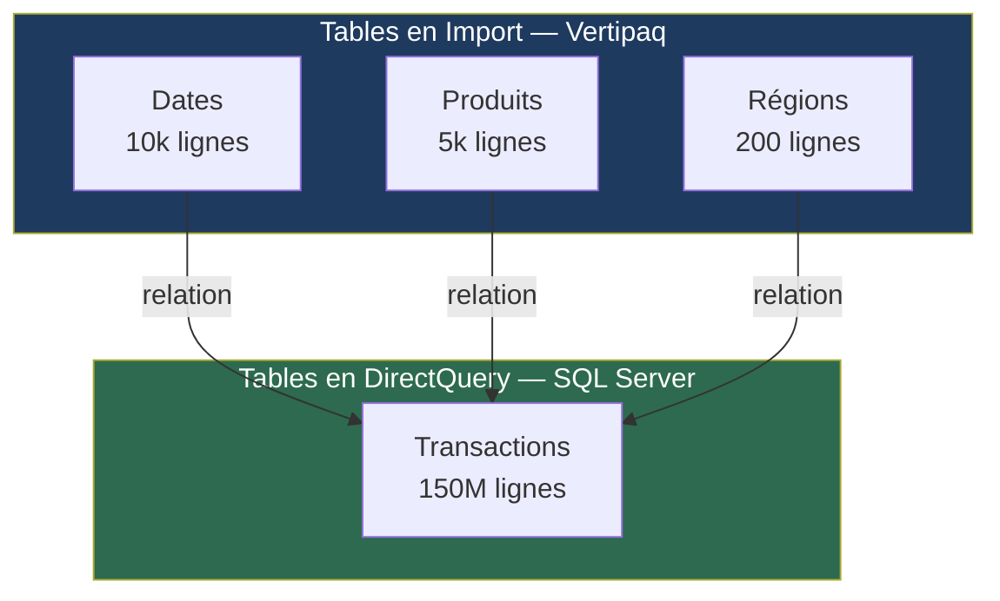

## Objectifs pédagogiques

À l'issue de ce module, tu seras capable de :

1. **Identifier** la couche responsable d'une lenteur (modèle, DAX, requête source) à l'aide des outils de diagnostic intégrés
2. **Lire** un plan de requête Vertipaq et interpréter les métriques Performance Analyzer
3. **Réécrire** une mesure DAX lente en appliquant les principes de contexte de filtre et d'évaluation moteur
4. **Configurer** le Query Folding et les aggregations pour pousser le travail au plus près de la source
5. **Décider** entre Import, DirectQuery et Composite Model en fonction des contraintes de volume et de fraîcheur

---

## Mise en situation

Tu rejoins l'équipe data d'un groupe industriel qui distribue des rapports Power BI à 400 utilisateurs. Le rapport commercial principal — une quinzaine de visuels, deux slicers de date, un filtre région — met **45 secondes à se charger**. La direction veut descendre sous les 5 secondes.

Les données viennent de deux sources : un entrepôt SQL Server (150 millions de lignes de transactions) et un fichier Excel de référentiels produit. Le modèle a été construit "à la main" il y a 18 mois par un analyste qui n'est plus là.

Tu n'as pas le droit de toucher à l'infrastructure SQL. Tu peux modifier le modèle Power BI, les mesures DAX, et les requêtes Power Query.

C'est exactement le type de situation que ce module t'apprend à traiter.

---

## Comprendre où est le problème avant de commencer à corriger

La première erreur dans ce genre de diagnostic, c'est de commencer à optimiser au hasard — réécrire des mesures DAX sans savoir si c'est là que le temps est perdu. Avant toute modification, il faut **localiser**.

Un rapport Power BI lent peut souffrir à trois endroits distincts :

```
Source de données → Power Query / Data Model → Moteur DAX → Visuel
      ↑                    ↑                       ↑           ↑
  Latence réseau       Transformations         Mesures      Rendu HTML
  Requêtes SQL         Jointures complexes     CardinalitéS  Trop de visuels
  Pas de folding       Colonnes inutiles       Contextes     Cross-filtering
```

Ces trois couches ne se débuggent pas avec les mêmes outils. Commençons par les présenter.

---

## Les outils de diagnostic

### Performance Analyzer

C'est le point d'entrée. Dans Power BI Desktop, menu **View → Performance Analyzer** → **Start recording** → actualise le rapport → **Stop**.

Chaque visuel expose trois durées :

| Métrique | Ce qu'elle mesure |
|---|---|
| **DAX query** | Temps passé dans le moteur d'analyse (formulas + storage engine) |
| **Visual display** | Rendu du composant HTML/SVG dans le canvas |
| **Other** | Tout le reste : réseau, cache, coordination |

> 💡 La règle des 80/20 s'applique brutalement ici. En général, un ou deux visuels concentrent 90 % du temps. Commence par eux.

Ce qui est précieux, c'est le bouton **"Copy query"** sur un visuel : il te donne la requête DAX exacte envoyée par ce visuel au moteur. Tu peux la coller directement dans DAX Studio pour l'analyser.

### DAX Studio

Outil externe gratuit, indispensable. Il se connecte à ton fichier `.pbix` ouvert et te permet de :

- Exécuter une requête DAX et voir le plan d'exécution
- Mesurer le temps exact par phase (formula engine vs storage engine)
- Voir les **Server Timings** : combien de fois le storage engine a été appelé, combien de lignes il a scanné

La distinction Formula Engine / Storage Engine est fondamentale — on y revient dans un instant.

### Vertipaq Analyzer / VertiPaq Analyzer (via DAX Studio)

Dans DAX Studio → **Advanced → View Metrics** — tu obtiens la taille de chaque table, colonne par colonne, avec la cardinalité et le taux de compression. C'est le diagnostic du modèle lui-même : colonnes inutiles, cardinalités explosées, tables mal configurées.

---

## Le moteur Vertipaq : ce qui se passe vraiment

Pour optimiser, tu dois avoir un modèle mental de ce qui se passe quand un visuel se rafraîchit en mode **Import**.



**Le Storage Engine (SE)** est hautement optimisé : il travaille sur des colonnes compressées, peut paralléliser, et exploite un cache. Il est rapide.

**Le Formula Engine (FE)** est mono-thread et n'a pas de cache. C'est lui qui exécute les parties du DAX que le SE ne peut pas gérer nativement — les itérateurs complexes, les CALCULATE imbriqués, les FILTER sur des tables volumineuses.

🧠 **Règle d'or :** Plus une mesure DAX sollicite le Formula Engine, plus elle est lente. L'objectif est de pousser le maximum de travail vers le Storage Engine.

---

## Diagnostiquer une mesure DAX lente

### Lire les Server Timings dans DAX Studio

Après avoir exécuté une requête, l'onglet **Server Timings** montre :

- **SE Queries** : nombre d'appels au storage engine
- **SE Rows** : lignes scannées
- **FE Duration** : temps en Formula Engine

Un signe d'alarme classique : **des centaines de SE queries pour un seul visuel**. Ça signifie que le FE boucle et interroge le SE à chaque itération — typiquement un SUMX sur une grande table sans contexte de filtre bien défini.

### Les patterns DAX qui tuent les performances

**Pattern 1 — FILTER sur une grande table**

```dax
-- ❌ Lent : FILTER parcourt toute la table Transactions
Ventes Filtrées =
CALCULATE(
    SUM(Transactions[Montant]),
    FILTER(Transactions, Transactions[Statut] = "Validé")
)

-- ✅ Rapide : filtre direct sur la colonne, le SE sait l'optimiser
Ventes Filtrées =
CALCULATE(
    SUM(Transactions[Montant]),
    Transactions[Statut] = "Validé"
)
```

La version avec `FILTER(Transactions, ...)` force le Formula Engine à matérialiser toute la table et à filtrer ligne par ligne. La syntaxe directe laisse le Storage Engine gérer avec ses index de colonnes.

**Pattern 2 — SUMX là où SUM suffit**

```dax
-- ❌ Inutilement itératif
CA Total = SUMX(Transactions, Transactions[Quantité] * Transactions[Prix])

-- ✅ Si la colonne Montant existe déjà calculée en amont
CA Total = SUM(Transactions[Montant])
```

Quand tu n'as pas le choix (la colonne n'existe pas), `SUMX` est légitime. Mais si la multiplication peut être faite dans une **colonne calculée** lors du rafraîchissement du modèle, le résultat est précompilé et le scan est instantané.

**Pattern 3 — CALCULATE avec ALLEXCEPT ou ALL mal placé**

```dax
-- ⚠️ Ce pattern peut exploser si le contexte de filtre est large
Part de Marché =
DIVIDE(
    [CA Total],
    CALCULATE([CA Total], ALL(Produits))
)
```

Ici, `ALL(Produits)` retire les filtres sur la table Produits, mais garde tous les autres contextes. Si tu as des slicers sur Dates + Régions + Segments, le CALCULATE va créer autant de sous-contextes que de combinaisons. Sur une table de faits avec 150M lignes, ça peut générer des milliers de requêtes SE.

> ⚠️ L'erreur classique : mesurer "Part de marché" avec `ALL(Produits[Catégorie])` au lieu de `ALL(Produits)` — les deux n'ont pas le même comportement quand d'autres colonnes de Produits sont dans le contexte.

### Variables DAX : pas juste une question de lisibilité

```dax
-- Sans variables : [CA Région] est évalué 3 fois dans des contextes potentiellement différents
Variation =
DIVIDE(
    [CA Région] - CALCULATE([CA Région], SAMEPERIODLASTYEAR(Dates[Date])),
    CALCULATE([CA Région], SAMEPERIODLASTYEAR(Dates[Date]))
)

-- Avec variables : évaluation unique, résultat stable
Variation =
VAR CA_Current = [CA Région]
VAR CA_Previous = CALCULATE([CA Région], SAMEPERIODLASTYEAR(Dates[Date]))
RETURN
    DIVIDE(CA_Current - CA_Previous, CA_Previous)
```

Les variables en DAX ne sont pas juste cosmétiques — elles **figent le contexte d'évaluation au moment de leur déclaration**. Cela évite des réévaluations et des comportements incohérents quand le contexte change entre deux références à la même mesure.

---

## Diagnostiquer le modèle de données

Une mesure DAX parfaite ne rattrapera jamais un mauvais modèle. Ouvre VertiPaq Analyzer et regarde colonne par colonne.

### Ce qui coûte cher en mémoire et en performance

**Cardinalité élevée sur des colonnes non nécessaires.** Une colonne `ID_Commande` de type texte dans une table de faits de 150M lignes ne peut pratiquement pas être compressée — chaque valeur est unique. Si tu n'as jamais de filtre sur cet ID dans un visuel, cette colonne ne devrait pas être dans le modèle.

**Relations many-to-many involontaires.** Si Power BI détecte une ambiguïté de cardinalité, il crée une relation many-to-many avec une table pont virtuelle. Le calcul est plus lent et les résultats peuvent être surprenants. Vérifie dans la vue modèle que tes relations ont les bons types.

**Colonnes DateTime complètes dans la table de faits.** Si tu as un champ `DateHeure` avec secondes, chaque valeur est unique → cardinalité maximale → compression nulle. **La règle standard** : sépare la date (vers une table Dates) et l'heure (si tu en as besoin), ou tronque à la journée.

### Checklist modèle rapide

| Problème | Symptôme VertiPaq | Solution |
|---|---|---|
| Colonne texte haute cardinalité | Taille élevée, ratio compression faible | Remplacer par clé entière ou supprimer |
| Table de faits avec colonnes calculées complexes | Refresh lent, mémoire élevée | Déplacer le calcul dans Power Query ou la source |
| Pas de table Dates dédiée | Relations directes sur DateTime | Créer une dimension Dates avec `CALENDARAUTO()` |
| Colonnes jamais utilisées dans des visuels | Présentes dans le modèle | Supprimer dans Power Query |

---

## Query Folding : le travail qui ne doit pas se faire dans Power BI

En mode **Import**, Power Query charge les données depuis la source. La question est : **qui fait les transformations** — Power Query localement, ou la source SQL ?

Le **Query Folding** est la capacité de Power Query à traduire tes transformations en requêtes natives (SQL, OData...) exécutées directement sur la source. Résultat : moins de données transférées, moins de mémoire utilisée, refresh beaucoup plus rapide.

### Comment vérifier si le folding est actif

Dans Power Query Editor, clique droit sur une étape dans la liste "Applied Steps" :

- **"View Native Query"** disponible et cliquable → le folding est actif jusqu'à cette étape ✅
- **"View Native Query"** grisé → le folding s'est arrêté ici ❌



### Ce qui casse le folding

Certaines transformations ne peuvent pas être traduites en SQL et forcent Power Query à tout charger localement :

- `Table.AddColumn` avec une logique complexe (conditions, texte personnalisé)
- Jointures entre sources hétérogènes (SQL + Excel par exemple)
- Fonctions M sans équivalent SQL (`List.Accumulate`, certaines opérations texte)
- **Modification de l'ordre des étapes** : si une étape qui casse le folding arrive avant un filtre, le filtre ne sera plus traduit en SQL

> 💡 **Ordre des étapes dans Power Query** : toujours mettre les filtres (sur les dates, les statuts, les régions) **avant** les transformations complexes. Le folding s'applique aux étapes initiales en séquence — dès qu'une étape casse la chaîne, toutes les suivantes s'exécutent localement.

---

## Import vs DirectQuery vs Composite Model

Tu avais peut-être vu cette distinction en surface. À ce niveau, la décision est structurante pour toute la stratégie de performance.

### La vraie question n'est pas "quel mode est le plus rapide"

Import est presque toujours plus rapide pour les requêtes utilisateur. Le Storage Engine Vertipaq est conçu pour ça. Mais Import implique une **copie des données** dans le fichier `.pbix` / le service — avec une limite de fraîcheur (au mieux 48 rafraîchissements par jour en Premium).

DirectQuery ne stocke rien : chaque visuel déclenche une requête SQL live vers la source. La fraîcheur est maximale, mais chaque interaction utilisateur génère une requête. Sur 400 utilisateurs simultanés, ça peut tuer la base source.

| Critère | Import | DirectQuery | Composite |
|---|---|---|---|
| Vitesse des visuels | ⚡⚡⚡ Très rapide | ⚡ Dépend de la source | ⚡⚡ Variable |
| Fraîcheur des données | Selon le refresh planifié | Temps réel | Mixte |
| Volume supporté | Limité par la RAM / capacity | Illimité (si source performante) | Illimité côté DQ |
| Charge sur la source | Aucune (après refresh) | Forte (N requêtes par visuel) | Modérée |
| Complexité opérationnelle | Faible | Moyenne-haute | Haute |
| Fonctionnalités DAX complètes | Oui | Non (limitations importantes) | Partiel |

### Le Composite Model : le meilleur des deux mondes, avec ses pièges

Un modèle composite mélange des tables en Import et des tables en DirectQuery dans le même rapport. L'idée : mettre en Import les petites tables de référence (produits, calendrier, régions) et laisser en DirectQuery les grosses tables de faits.



⚠️ **Le piège du Composite Model** : si une mesure DAX croise des tables Import et DirectQuery, Power BI doit envoyer des requêtes SQL qui incluent des filtres provenant des tables en Import. Ces requêtes peuvent devenir complexes et lentes si elles ne sont pas anticipées. Teste systématiquement les performances après passage en Composite.

---

## Aggregations : précomputer ce que l'utilisateur demande souvent

Les **aggregations** permettent de définir une table précalculée à un niveau de grain plus élevé, et de dire à Power BI "si la requête peut être satisfaite par cette table agrégée, utilise-la au lieu de la table de faits".

Exemple concret : au lieu de scanner 150M lignes de transactions pour calculer le CA mensuel par région, Power BI utilise une table `Transactions_Agg` de 10 000 lignes (12 mois × ~800 régions) stockée en Import — même si `Transactions` est en DirectQuery.

```dax
-- Table d'agrégation créée dans Power Query ou SQL
-- Transactions_Agg :
-- | Année | Mois | Region_ID | CA_Total | Nb_Commandes |
-- | 2024  | 1    | FR-IDF    | 245000   | 1823         |
-- | ...   | ...  | ...       | ...      | ...          |
```

La configuration se fait dans **Manage aggregations** (clic droit sur la table agrégée dans la vue modèle). Tu maps chaque colonne agrégée à la table de faits détaillée. Power BI gère ensuite automatiquement le routage : si le grain de la requête est compatible, il utilise l'agrégation ; sinon, il descend dans la table de faits.

> 💡 Les aggregations sont particulièrement puissantes en Composite Model DirectQuery. Elles permettent d'avoir des visuels de synthèse ultra-rapides (Import) tout en conservant la capacité de drill-down jusqu'au détail (DirectQuery).

---

## Cas réel : réduction de 45s à 4s

Retour à la situation initiale. Voici la séquence de diagnostic appliquée :

**Étape 1 — Performance Analyzer** : deux visuels concentrent 42 des 45 secondes. L'un est un tableau croisé avec une mesure "Part de marché glissante 12 mois", l'autre un graphique de tendance avec 5 mesures time intelligence.

**Étape 2 — DAX Studio sur la mesure lente** : Server Timings montrent 847 SE queries, FE Duration = 38 secondes. La mesure utilise `FILTER(Transactions, ...)` dans un `CALCULATE` imbriqué.

**Étape 3 — Diagnostic modèle** : VertiPaq Analyzer révèle une colonne `Description_Libre` (texte libre) dans la table Transactions — cardinalité 148M valeurs uniques, taille 2,1 Go sur 3,4 Go total. Jamais utilisée dans un visuel.

**Étape 4 — Power Query** : le filtre sur `Statut = 'Validé'` est placé après une étape `Table.AddColumn` qui casse le folding. Les 150M lignes sont chargées, puis filtrées localement.

**Actions correctives :**

1. Supprimer `Description_Libre` dans Power Query → modèle réduit de 62 %
2. Déplacer le filtre statut **avant** le `Table.AddColumn` → folding restauré, seules 18M lignes chargées
3. Réécrire la mesure "Part de marché" sans `FILTER(Transactions, ...)` → FE Duration passe de 38s à 0,4s
4. Ajouter une variable DAX pour éviter la double évaluation sur les mesures time intelligence

Résultat : **4,2 secondes** de chargement. Sans toucher à l'infrastructure SQL.

---

## Bonnes pratiques actionnables

**Sur le modèle :**
- Supprimer toute colonne absente des visuels ou des mesures. Si tu n'es pas sûr, cache-la d'abord et attends les retours.
- Utiliser des clés entières pour toutes les relations. Les jointures sur texte sont deux à cinq fois plus lentes.
- Ne jamais stocker des colonnes DateTime avec secondes dans une table de faits si le grain journalier suffit.

**Sur DAX :**
- Toujours préférer la syntaxe de filtre directe à `FILTER(Table, ...)` quand le filtre porte sur une seule colonne.
- Déclarer des variables pour toute valeur réutilisée plus d'une fois dans une mesure.
- Éviter les mesures qui appellent d'autres mesures sur 3 niveaux ou plus — le FE empile les contextes.

**Sur Power Query :**
- Vérifier le folding sur chaque étape ajoutée. Un clic droit de plus, et tu évites de charger 150M lignes inutilement.
- Filtrer en premier, transformer ensuite.
- Supprimer les colonnes le plus tôt possible dans la chaîne d'étapes — moins de données à transporter.

**Sur l'architecture globale :**
- Passer en Premium ou Fabric si tu dois servir 400 utilisateurs simultanés en DirectQuery — les capacités shared ont des limites de concurrence strictes.
- Programmer les refreshs aux heures creuses, pas toutes les heures en journée si ce n'est pas justifié par un vrai besoin métier.

---

## Résumé

| Concept | Définition courte | À retenir |
|---|---|---|
| Storage Engine (SE) | Moteur columnar Vertipaq, parallélisé, avec cache | Pousser le maximum de calcul ici |
| Formula Engine (FE) | Interpréteur DAX mono-thread, sans cache | Chaque seconde ici coûte cher |
| Query Folding | Traduction des étapes Power Query en SQL natif | Casser le folding = charger tout en mémoire |
| Performance Analyzer | Outil Desktop pour mesurer le temps par visuel | Point d'entrée obligatoire du diagnostic |
| DAX Studio Server Timings | Détail FE/SE par requête | Diagnostic fin des mesures lentes |
| VertiPaq Analyzer | Taille et cardinalité par colonne | Diagnostic du modèle |
| Composite Model | Mélange Import + DirectQuery dans un rapport | Puissant, mais tester les performances croisées |
| Aggregations | Table précalculée à grain agrégé, routage automatique | Accélérer les visuels de synthèse sans perdre le détail |

Un rapport Power BI lent, c'est rarement un seul problème. C'est presque toujours une combinaison : un modèle trop lourd, une ou deux mesures DAX qui surchargent le Formula Engine, et une chaîne Power Query qui charge plus de données qu'elle ne devrait. Le diagnostic méthodique — Analyzer → DAX Studio → VertiPaq — te donne la carte avant de commencer à creuser.

---

<!-- snippet
id: powerbi_perf_performance_analyzer
type: tip
tech: power bi
level: intermediate
importance: high
format: knowledge
tags: performance,diagnostic,visuel,desktop
title: Utiliser Performance Analyzer comme point d'entrée
content: "View → Performance Analyzer → Start recording → actualise le rapport → Stop. Chaque visuel expose DAX query, Visual display, Other. Copie la requête DAX du visuel le plus lent via 'Copy query' et colle-la dans DAX Studio pour analyse fine."
description: Identifier les visuels responsables de 90 % du temps avant toute modification — évite d'optimiser au mauvais endroit
-->

<!-- snippet
id: powerbi_vertipaq_fe_se
type: concept
tech: power bi
level: advanced
importance: high
format: knowledge
tags: vertipaq,formula-engine,storage-engine,dax
title: Formula Engine vs Storage Engine en Vertipaq
content: "Le Storage Engine (SE) travaille sur des colonnes compressées, est parallélisé et a un cache — il est rapide. Le Formula Engine (FE) est mono-thread, sans cache, et exécute ce que le SE ne peut pas faire (itérateurs complexes, CALCULATE imbriqués). Chaque seconde en FE est non récupérable. L'objectif DAX : pousser le maximum de travail vers le SE."
description: FE mono-thread sans cache = goulot d'étranglement. Mesures avec FILTER(Table,...) ou itérateurs mal écrits y restent bloquées
-->

<!-- snippet
id: powerbi_dax_filter_table
type: warning
tech: power bi
level: advanced
importance: high
format: knowledge
tags: dax,filter,formula-engine,performance
title: FILTER sur une table complète force le Formula Engine
content: "Piège : CALCULATE(SUM(T[Val]), FILTER(T, T[Col] = \"X\")) — le FE matérialise toute la table ligne par ligne. Conséquence : lenteur proportionnelle au volume. Correction : CALCULATE(SUM(T[Val]), T[Col] = \"X\") — syntaxe directe laissée au SE avec ses index de colonnes."
description: Remplacer FILTER(Table, Table[Col] = val) par la syntaxe de filtre direct réduit souvent le temps DAX de 80 %+
-->

<!-- snippet
id: powerbi_dax_variables
type: tip
tech: power bi
level: intermediate
importance: high
format: knowledge
tags: dax,variables,contexte,performance
title: Les variables DAX figent le contexte d'évaluation
content: "VAR x = [Mesure] capture la valeur ET le contexte au moment de la déclaration. Si [Mesure] est référencée deux fois sans VAR, elle est réévaluée deux fois dans des contextes potentiellement différents. Utiliser VAR évite les réévaluations et les incohérences — pas seulement une question de lisibilité."
description: Sans VAR, une mesure appelée 3 fois dans une formule est calculée 3 fois. Avec VAR, une seule évaluation
-->

<!-- snippet
id: powerbi_pq_query_folding
type: concept
tech: power bi
level: advanced
importance: high
format: knowledge
tags: power-query,query-folding,sql,refresh
title: Vérifier si le Query Folding est actif
content: "Dans Power Query Editor, clic droit sur une étape dans Applied Steps. Si 'View Native Query' est cliquable → folding actif, les transformations sont traduites en SQL et exécutées à la source. Si grisé → folding cassé ici, Power Query charge tout en mémoire et filtre localement. Conséquence d'un folding cassé sur 150M lignes : refresh de plusieurs dizaines de minutes au lieu de quelques secondes."
description: Un folding cassé = toute la table chargée en RAM avant filtrage. Vérifier à chaque étape ajoutée
-->

<!-- snippet
id: powerbi_pq_folding_order
type: tip
tech: power bi
level: advanced
importance: high
format: knowledge
tags: power-query,query-folding,ordre,optimisation
title: Toujours filtrer avant de transformer dans Power Query
content: "Le folding s'applique aux étapes en séquence depuis le début. Dès qu'une étape casse la chaîne (Table.AddColumn complexe, jointure hétérogène), toutes les étapes suivantes s'exécutent localement. Placer les filtres (date, statut, région) AVANT les transformations complexes pour qu'ils soient traduits en SQL."
description: Un filtre placé après un Table.AddColumn qui casse le folding charge 150M lignes au lieu de 2M
-->

<!-- snippet
id: powerbi_vertipaq_cardinalite
type: warning
tech: power bi
level: advanced
importance: medium
format: knowledge
tags: vertipaq,cardinalite,modele,compression
title: Haute cardinalité = compression nulle et modèle lent
content: "Piège : une colonne texte avec valeurs quasi-uniques (ID commande, description libre) dans une table de faits de 150M lignes. Vertipaq ne peut pas compresser → colonne de plusieurs Go → modèle lent en refresh et en requête. Conséquence : VertiPaq Analyzer montrera un ratio compression proche de 1 (aucun gain). Correction : supprimer si inutile, ou remplacer par une clé entière."
description: VertiPaq Analyzer (DAX Studio → Advanced → View Metrics) révèle les colonnes qui plombent la mémoire colonne par colonne
-->

<!-- snippet
id: powerbi_model_datetime
type: tip
tech: power bi
level: intermediate
importance: medium
format: knowledge
tags: modele,datetime,cardinalite,dimension-date
title: Ne jamais stocker un DateTime avec secondes
