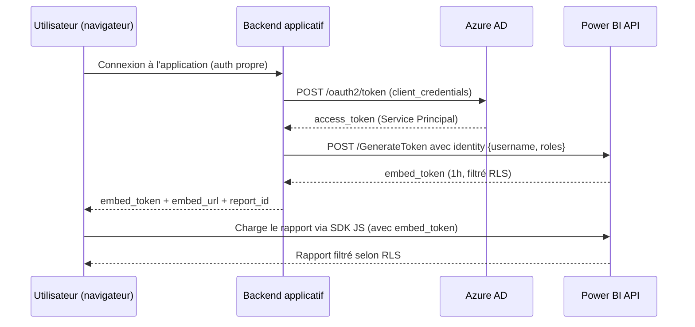

# Power BI Embedded et REST API

## Objectifs pédagogiques

À l'issue de ce module, vous serez capable de :

1. **Distinguer** les modes d'intégration Power BI Embedded (User Owns Data vs App Owns Data) et choisir le bon selon le contexte
2. **Configurer** un Service Principal pour accéder à l'API Power BI de façon programmatique et sécurisée
3. **Utiliser** la REST API Power BI pour automatiser la gestion des workspaces, datasets et rapports
4. **Intégrer** un rapport Power BI dans une application web via le SDK JavaScript (powerbi-client)
5. **Sécuriser** les intégrations avec des Embed Tokens, le Row-Level Security dynamique et une gestion robuste des erreurs

---

## Mise en situation

Vous travaillez pour un éditeur de logiciel SaaS qui développe une plateforme de gestion commerciale destinée à des PME. La direction produit veut intégrer des tableaux de bord analytiques directement dans l'interface de l'application — chaque client ne doit voir que ses propres données, sans jamais accéder à Power BI Service.

Deux contraintes immédiatement visibles : les clients n'ont pas de compte Microsoft 365, et les rapports doivent être filtrés automatiquement par identifiant client. Le modèle classique "partager un rapport Power BI" ne tient pas.

Mais ce n'est pas le seul scénario. Imaginez aussi une entreprise qui veut intégrer des rapports analytiques dans son intranet RH — les utilisateurs ont déjà tous un compte Azure AD, et vous voulez juste embarquer des visuels dans un portail existant sans dupliquer la gestion des droits. Dans ce cas, la réponse architecturale est différente.

Ces deux situations réelles — l'une ISV multi-tenant, l'autre portail interne entreprise — sont les deux faces de Power BI Embedded. Ce module couvre les deux, de l'authentification jusqu'au débogage en production.

---

## Contexte : pourquoi Power BI Embedded existe

Power BI Service est conçu pour les utilisateurs internes d'une organisation — ils se connectent avec leur compte Azure AD, accèdent aux workspaces partagés, consomment les rapports. C'est le modèle par défaut, et il couvre 80 % des besoins internes.

Mais dès que vous voulez **embarquer des visuels Power BI dans une application tierce** — votre propre application web, un portail client, un outil ISV — ce modèle s'effondre. Vous ne pouvez pas demander à vos clients de se connecter avec un compte Power BI. Vous ne voulez pas leur donner accès à votre workspace. Et vous avez besoin de contrôler finement ce qu'ils voient.

Power BI Embedded répond à ce besoin. L'idée centrale : votre application joue le rôle d'intermédiaire. Elle s'authentifie auprès de Microsoft, récupère un token d'intégration à durée limitée, et le passe au navigateur du client. Le navigateur charge le rapport directement depuis les serveurs Microsoft, sans que l'utilisateur final n'ait besoin d'un compte Power BI.

🧠 **Concept fondamental** — La séparation entre *qui s'authentifie* (votre application, côté serveur) et *qui consomme* (l'utilisateur final, côté navigateur) est l'architecture clé de Power BI Embedded. Tout le reste découle de ce principe.

---

## Les deux modèles d'intégration

Avant d'écrire une seule ligne de code, il faut clarifier un choix architectural qui conditionne tout : **qui possède les licences et qui s'authentifie ?**

### User Owns Data — portail interne

Dans ce modèle, chaque utilisateur final se connecte avec son propre compte Azure AD. Votre application délègue l'authentification à Microsoft via un flux OAuth (authorization_code ou on-behalf-of). L'utilisateur voit exactement ce qu'il verrait en se connectant directement à Power BI Service — avec les mêmes permissions, les mêmes workspaces, le même RLS basé sur son identité réelle.

C'est le bon choix pour un **intranet d'entreprise** où tous les utilisateurs ont déjà une licence Power BI Pro, et où vous voulez juste intégrer des rapports dans un portail existant sans changer la gestion des droits. La complexité d'implémentation est modérée, mais chaque utilisateur doit posséder sa propre licence.

### App Owns Data — portail ISV ou client externe

Ici, votre **application** s'authentifie avec sa propre identité (un Service Principal), génère des tokens temporaires, et les passe aux utilisateurs. Les utilisateurs finaux n'ont besoin d'aucun compte Microsoft.

C'est le modèle ISV, le modèle client, le modèle "SaaS". Votre application porte une licence **Power BI Embedded** (capacité Azure A-SKU ou Premium P-SKU), et elle gère entièrement la politique d'accès. Le RLS est dynamique — c'est votre backend qui injecte l'identité de l'utilisateur dans chaque token généré.

| Critère | User Owns Data | App Owns Data |
|---|---|---|
| Identité utilisateur | Compte Azure AD personnel | Aucune — géré par l'app |
| Licence requise par utilisateur | Power BI Pro ou Premium | Non (capacité portée par l'app) |
| Contrôle d'accès | Via permissions Power BI | Entièrement dans l'application |
| Cas d'usage typique | Portail interne entreprise | Application ISV / portail client externe |
| Flux d'authentification | OAuth authorization_code / on-behalf-of | client_credentials (Service Principal) |
| RLS dynamique | Basé sur l'identité Azure AD réelle | Basé sur les claims injectés par l'app |
| Complexité d'implémentation | Modérée | Élevée |

⚠️ **Piège classique** : beaucoup de développeurs commencent par *User Owns Data* parce que c'est plus simple, puis réalisent en phase de déploiement que leurs clients n'ont pas de compte Microsoft. Clarifiez ce point en amont — migrer d'un modèle à l'autre implique de retravailler l'authentification, les tokens et le RLS.

---

## Authentification avec un Service Principal

Pour le mode *App Owns Data*, la bonne pratique est d'utiliser un **Service Principal** — une identité applicative Azure AD, sans utilisateur humain derrière. Voici pourquoi c'est préférable à un "Master User" (un compte utilisateur dédié) : un compte utilisateur a une session qui expire, peut être bloqué par MFA, et ses credentials doivent être stockés quelque part. Un Service Principal utilise un certificat ou un secret client, tourne sans interaction humaine, et ses permissions sont auditables.

### Configurer le Service Principal

**Étape 1 — Créer l'App Registration dans Azure AD**

Portail Azure → Azure Active Directory → App registrations → New registration

Notez bien trois valeurs après création :
- `Application (client) ID` → c'est votre `client_id`
- `Directory (tenant) ID` → c'est votre `tenant_id`
- Créez un secret : Certificates & secrets → New client secret → notez la valeur immédiatement (elle disparaît après)

**Étape 2 — Activer l'accès Service Principal dans Power BI**

C'est l'étape que tout le monde oublie la première fois. Par défaut, Power BI refuse les connexions Service Principal.

Power BI Admin Portal → Tenant settings → Developer settings → **Allow service principals to use Power BI APIs** → Activez et limitez à un groupe de sécurité spécifique.

💡 **Bonne pratique** : ne jamais activer "All of the organization" pour les Service Principals — créez un groupe de sécurité dédié et n'y ajoutez que les SPs qui en ont besoin.

**Étape 3 — Donner accès au workspace**

Dans Power BI Service, ouvrez le workspace cible → Access → ajoutez le Service Principal (il apparaît sous son nom d'application) avec le rôle **Member** ou **Admin** selon les opérations nécessaires.

```
Workspace → Settings → Access → Add people or groups
→ Rechercher le nom de l'App Registration
→ Rôle : Member (lecture + embed) ou Admin (gestion complète)
```

---

## La REST API Power BI

La REST API Power BI est l'interface programmatique complète pour tout ce que vous faites normalement dans le portail. Elle est documentée sur `api.powerbi.com/v1.0/myorg/` et couvre des dizaines d'endpoints.

### Obtenir un token d'accès

Tout appel API commence par récupérer un bearer token auprès d'Azure AD. Avec un Service Principal :

```http
POST https://login.microsoftonline.com/{tenant_id}/oauth2/v2.0/token

Content-Type: application/x-www-form-urlencoded

grant_type=client_credentials
&client_id={client_id}
&client_secret={client_secret}
&scope=https://analysis.windows.net/powerbi/api/.default
```

La réponse contient un `access_token` valide 1 heure. Ce token s'utilise en header `Authorization: Bearer {access_token}` sur tous les appels suivants.

### Appels REST essentiels

**Lister les rapports d'un workspace :**

```http
GET https://api.powerbi.com/v1.0/myorg/groups/{workspace_id}/reports
Authorization: Bearer {access_token}
```

La réponse vous donne les `id` de chaque rapport — nécessaires pour générer les tokens d'embed.

**Déclencher un refresh de dataset :**

```http
POST https://api.powerbi.com/v1.0/myorg/groups/{workspace_id}/datasets/{dataset_id}/refreshes
Authorization: Bearer {access_token}
Content-Type: application/json

{}
```

**Générer un Embed Token pour un rapport :**

C'est l'appel central du mode *App Owns Data*. Votre backend l'appelle, récupère un token temporaire, et le transmet au navigateur du client.

```http
POST https://api.powerbi.com/v1.0/myorg/GenerateToken
Authorization: Bearer {access_token}
Content-Type: application/json

{
  "reports": [
    { "id": "f6bfd646-b718-40c3-a2a6-5b6e4c3b28f9" }
  ],
  "datasets": [
    { "id": "cfafbeb1-8037-4d0c-896e-a46fb27ff229" }
  ],
  "targetWorkspaces": [
    { "id": "4a1d2a3b-5678-9012-bcde-f01234567890" }
  ],
  "identities": [
    {
      "username": "client_42",
      "roles": ["ClientRole"],
      "datasets": ["cfafbeb1-8037-4d0c-896e-a46fb27ff229"]
    }
  ]
}
```

Le bloc `identities` active le **RLS dynamique**. L'Embed Token retourné a une durée de vie configurable (1 heure par défaut, maximum 1 heure) — prévoir un mécanisme de rafraîchissement côté client.

⚠️ **L'Embed Token n'est pas le token d'accès Azure AD.** Ce sont deux tokens distincts avec des durées de vie et des usages différents. Le token Azure AD (`access_token`) sert à appeler l'API côté serveur. L'Embed Token sert uniquement au SDK JavaScript côté navigateur.

---

## RLS dynamique avec les identités embarquées

Le Row-Level Security dans Power BI fonctionne sur la base de rôles définis dans le modèle de données et de règles DAX qui filtrent les lignes visibles. En mode intégration applicative, vous pouvez **injecter dynamiquement** l'identité de l'utilisateur dans l'Embed Token, sans que cet utilisateur ait de compte Power BI.

Le flux complet :



Dans votre modèle de données Power BI Desktop, vous avez défini un rôle `ClientRole` avec une règle DAX :

```
[ClientID] = USERNAME()
```

Quand vous générez l'Embed Token avec `"username": "client_42"`, Power BI évalue `USERNAME()` comme `"client_42"` et filtre les lignes correspondantes. L'utilisateur ne voit que ses données — sans jamais avoir de compte Power BI, sans jamais accéder à votre workspace.

🧠 **Concept fondamental** — `USERNAME()` dans une règle RLS en mode Embed ne retourne pas un email Azure AD. Elle retourne exactement la chaîne que vous avez passée dans le champ `username` de l'Embed Token. Vous pouvez y mettre n'importe quel identifiant : un UUID, un tenant ID, un code client.

---

## Intégration front-end avec le SDK JavaScript

Une fois que votre backend a généré l'Embed Token, le travail côté navigateur est pris en charge par la bibliothèque `powerbi-client`.

### Installation

```bash
npm install powerbi-client
# ou pour React
npm install powerbi-client-react
```

### Intégration basique (vanilla JS)

```javascript
import * as pbi from 'powerbi-client';
import { models } from 'powerbi-client';

const powerbi = new pbi.service.Service(
  pbi.factories.hpmFactory,
  pbi.factories.wpmpFactory,
  pbi.factories.routerFactory
);

const embedConfig = {
  type: 'report',
  id: reportId,            // récupéré depuis votre backend
  embedUrl: embedUrl,      // récupéré depuis votre backend
  accessToken: embedToken, // l'Embed Token, pas le token Azure AD
  tokenType: models.TokenType.Embed,
  settings: {
    filterPaneEnabled: false,
    navContentPaneEnabled: false
  }
};

const reportContainer = document.getElementById('report-container');
const report = powerbi.embed(reportContainer, embedConfig);

report.on('loaded', () => console.log('Rapport chargé'));
report.on('error', (event) => console.error(event.detail));
```

Le conteneur HTML doit avoir une taille définie — Power BI remplit son conteneur parent en 100% :

```html
<div id="report-container" style="height: 600px; width: 100%;"></div>
```

### Intégration React

```jsx
import { PowerBIEmbed } from 'powerbi-client-react';
import { models } from 'powerbi-client';

function ReportViewer({ reportId, embedUrl, embedToken }) {
  return (
    <PowerBIEmbed
      embedConfig={{
        type: 'report',
        id: reportId,
        embedUrl: embedUrl,
        accessToken: embedToken,
        tokenType: models.TokenType.Embed,
        settings: {
          filterPaneEnabled: false,
          navContentPaneEnabled: true
        }
      }}
      cssClassName="report-style-class"
      eventHandlers={
        new Map([
          ['loaded', () => console.log('Loaded')],
          ['rendered', () => console.log('Rendered')],
          ['error', (event) => console.error(event.detail)]
        ])
      }
    />
  );
}
```

### Rafraîchir le token avant expiration

L'Embed Token expire au bout d'une heure. La bonne pratique est de surveiller l'expiration et de rafraîchir le token silencieusement :

```javascript
// Approche réactive : événement déclenché à expiration
report.on('tokenExpired', async () => {
  const newToken = await fetchNewEmbedToken(); // appel vers votre backend
  await report.setAccessToken(newToken);
});

// Approche proactive recommandée : timer à 55 minutes
setTimeout(async () => {
  const newToken = await fetchNewEmbedToken();
  await report.setAccessToken(newToken);
}, 55 * 60 * 1000);
```

💡 `setAccessToken()` remplace le token sans recharger le rapport — l'utilisateur ne voit rien. C'est nettement mieux que de détruire et recréer l'embed.

---

## Appliquer des filtres programmatiques

Une des forces de l'intégration via SDK est de pouvoir contrôler les filtres depuis votre application, indépendamment des slicers visuels du rapport.

```javascript
const filter = {
  $schema: "http://powerbi.com/product/schema#basic",
  target: {
    table: "Sales",
    column: "Region"
  },
  operator: "In",
  values: ["EMEA", "APAC"],
  filterType: models.FilterType.BasicFilter
};

await report.updateFilters(models.FiltersOperations.Replace, [filter]);
```

### Filtres programmatiques vs RLS DAX — quand choisir quoi ?

Ces deux mécanismes ne s'opposent pas — ils agissent à des niveaux différents :

| Critère | Filtres programmatiques (`updateFilters`) | RLS DAX |
|---|---|---|
| Où s'applique | Côté navigateur, au moment du rendu | Côté serveur, dans le moteur de données |
| Contournable ? | Oui (via DevTools navigateur) | Non — le moteur filtre avant envoi |
| Usage typique | Synchroniser un slicer avec un état UI externe | Isolation stricte par utilisateur ou tenant |
| Exemple | Filtrer par région selon un menu déroulant | Garantir qu'un client ne voit que ses données |

**Règle pratique** : utilisez les filtres programmatiques pour l'expérience utilisateur (navigation, synchronisation avec l'UI). Utilisez le RLS DAX pour la sécurité des données — ce que l'utilisateur ne doit *jamais* voir, même en bidouillant le navigateur. En cas de doute, les deux peuvent coexister : RLS pour l'isolation de sécurité, filtres programmatiques pour la navigation contextuelle.

L'API est hiérarchique : `report → page → visual`. Chaque niveau expose `.getFilters()`, `.updateFilters()` et `.removeFilters()`.

---

## Backend complet : générer le token côté serveur

L'Embed Token doit toujours être généré côté serveur. Voici deux implémentations de référence.

### Python (Flask)

```python
import requests
from flask import Flask, jsonify, request
from functools import lru_cache
import time

app = Flask(__name__)

TENANT_ID = "your-tenant-id"
CLIENT_ID = "your-client-id"
CLIENT_SECRET = "your-client-secret"
WORKSPACE_ID = "your-workspace-id"
DATASET_ID = "your-dataset-id"
REPORT_ID = "your-report-id"

# Cache du token Azure AD (valide 1h, renouvelé à 55 min)
_token_cache = {"token": None, "expires_at": 0}

def get_access_token():
    now = time.time()
    if _token_cache["token"] and now < _token_cache["expires_at"]:
        return _token_cache["token"]

    resp = requests.post(
        f"https://login.microsoftonline.com/{TENANT_ID}/oauth2/v2.0/token",
        data={
            "grant_type": "client_credentials",
            "client_id": CLIENT_ID,
            "client_secret": CLIENT_SECRET,
            "scope": "https://analysis.windows.net/powerbi/api/.default"
        }
    )
    resp.raise_for_status()
    data = resp.json()
    _token_cache["token"] = data["access_token"]
    _token_cache["expires_at"] = now + 55 * 60  # 55 minutes
    return _token_cache["token"]

@app.route("/api/embed-token")
def get_embed_token():
    # Récupérer l'utilisateur authentifié depuis votre session/JWT
    user_id = request.headers.get("X-User-ID", "anonymous")

    access_token = get_access_token()

    resp = requests.post(
        "https://api.powerbi.com/v1.0/myorg/GenerateToken",
        headers={
            "Authorization": f"Bearer {access_token}",
            "Content-Type": "application/json"
        },
        json={
            "reports": [{"id": REPORT_ID}],
            "datasets": [{"id": DATASET_ID}],
            "targetWorkspaces": [{"id": WORKSPACE_ID}],
            "identities": [{
                "username": user_id,
                "roles": ["ClientRole"],
                "datasets": [DATASET_ID]
            }]
        }
    )
    resp.raise_for_status()
    token_data = resp.json()

    return jsonify({
        "embedToken": token_data["token"],
        "embedUrl": f"https://app.powerbi.com/reportEmbed?reportId={REPORT_ID}&groupId={WORKSPACE_ID}",
        "reportId": REPORT_ID
    })
```

### Node.js (Express)

```javascript
const express = require('express');
const axios = require('axios');
const app = express();

const config = {
  tenantId: process.env.TENANT_ID,
  clientId: process.env.CLIENT_ID,
  clientSecret: process.env.CLIENT_SECRET,
  workspaceId: process.env.WORKSPACE_ID,
  datasetId: process.env.DATASET_ID,
  reportId: process.env.REPORT_ID
};

// Cache simple en mémoire
let tokenCache = { token: null, expiresAt: 0 };

async function getAccessToken() {
  if (tokenCache.token && Date.now() < tokenCache.expiresAt) {
    return tokenCache.token;
  }
  const resp = await axios.post(
    `https://login.microsoftonline.com/${config.tenantId}/oauth2/v2.0/token`,
    new URLSearchParams({
      grant_type: 'client_credentials',
      client_id: config.clientId,
      client_secret: config.clientSecret,
      scope: 'https://analysis.windows.net/powerbi/api/.default'
    })
  );
  tokenCache = {
    token: resp.data.access_token,
    expiresAt: Date.now() + 55 * 60 * 1000
  };
  return tokenCache.token;
}

app.get('/api/embed-token', async (req, res) => {
  try {
    const userId = req.headers['x-user-id'] || 'anonymous';
    const accessToken = await getAccessToken();

    const tokenResp = await axios.post(
      'https://api.powerbi.com/v1.0/myorg/GenerateToken',
      {
        reports: [{ id: config.reportId }],
        datasets: [{ id: config.datasetId }],
        targetWorkspaces: [{ id: config.workspaceId }],
        identities: [{
          username: userId,
          roles: ['ClientRole'],
          datasets: [config.datasetId]
        }]
      },
      { headers: { Authorization: `Bearer ${accessToken}` } }
    );

    res.json({
      embedToken: tokenResp.data.token,
      embedUrl: `https://app.powerbi.com/reportEmbed?reportId=${config.reportId}&groupId=${config.workspaceId}`,
      reportId: config.reportId
    });
  } catch (err) {
    const status = err.response?.status || 500;
    res.status(status).json({ error: err.response?.data || err.message });
  }
});

app.listen(3000);
```

---

## Construction progressive d'une intégration

### Niveau 1 — Embed minimal (test local)

Objectif : vérifier que la stack d'authentification fonctionne avant de complexifier.

- Créer l'App Registration Azure AD
- Ajouter le SP au workspace avec rôle Member
- Activer les Service Principals dans l'Admin Portal Power BI
- Générer un token depuis Postman ou le script Python ci-dessus
- Coller le token dans un HTML statique avec powerbi-client

À ce stade, pas de RLS, pas de gestion d'expiration, pas de backend complet. Mais si le rapport s'affiche, votre authentification fonctionne.

### Niveau 2 — Backend sécurisé avec RLS

- Déplacer la génération de token dans une API backend (voir exemples Python/Node ci-dessus)
- Ne jamais exposer le `client_secret` ou le token Azure AD côté navigateur
- Ajouter les identités RLS dans la requête GenerateToken
- Tester que les filtres de données sont bien appliqués selon l'utilisateur connecté

### Niveau 3 — Production

- Stocker le `client_secret` dans Azure Key Vault (pas dans une variable d'environnement du serveur)
- Mettre en cache le token Azure AD (valide 1h — inutile d'en demander un nouveau à chaque requête)
- Implémenter le rafraîchissement silencieux de l'Embed Token via `setAccessToken()`
- Monitorer les erreurs embed via les event handlers
- Prévoir un fallback si Power BI Service est indisponible

---

## Automatisation avec la REST API : cas réels

### Scénario 1 — Pipeline de données déclenche le refresh

Votre pipeline ETL termine à 6h du matin. Plutôt que de configurer un schedule dans Power BI Service (qui a des limitations), vous appelez directement l'API en fin de pipeline :

```python
def refresh_dataset(tenant_id, client_id, client_secret, workspace_id, dataset_id):
    token_url = f"https://login.microsoftonline.com/{tenant_id}/oauth2/v2.0/token"
    token_resp = requests.post(token_url, data={
        "grant_type": "client_credentials",
        "client_id": client_id,
        "client_secret": client_secret,
        "scope": "https://analysis.windows.net/powerbi/api/.default"
    })
    access_token = token_resp.json()["access_token"]

    refresh_url = f"https://api.powerbi.com/v1.0/myorg/groups/{workspace_id}/datasets/{dataset_id}/refreshes"
    resp = requests.post(refresh_url, headers={"Authorization": f"Bearer {access_token}"})
    return resp.status_code == 202
```

Un code 202 signifie que le refresh est **déclenché**, pas terminé. Pour attendre la complétion :

```python
import time

def wait_for_refresh(access_token, workspace_id, dataset_id, timeout=600, interval=30):
    url = f"https://api.powerbi.com/v1.0/myorg/groups/{workspace_id}/datasets/{dataset_id}/refreshes?$top=1"
    elapsed = 0
    while elapsed < timeout:
        resp = requests.get(url, headers={"Authorization": f"Bearer {access_token}"})
        refresh = resp.json()["value"][0]
        status = refresh.get("status")
        if status == "Completed":
            return True
        if status == "Failed":
            raise Exception(f"Refresh failed: {refresh.get('serviceExceptionJson')}")
        time.sleep(interval)
        elapsed += interval
    raise TimeoutError("Refresh timeout exceeded")
```

⚠️ Un intervalle de 30 secondes entre les appels est raisonnable pour un dataset standard. Au-delà de 10 minutes, vérifiez la taille du dataset et la gateway.

### Scénario 2 — Provisionner un workspace par client

Dans une architecture multi-tenant stricte, certains ISV créent un workspace Power BI par client (isolation maximale). L'API permet de tout automatiser. Voici le flux étape par étape avec les temps d'exécution estimés :

```
1. POST /groups                                              → créer le workspace        (~2s)
2. POST /groups/{id}/users                                   → ajouter le Service Principal (~1s)
3. POST /groups/{id}/imports                                 → uploader le .pbix         (~30-120s selon taille)
4. GET  /groups/{id}/reports                                 → récupérer l'ID du rapport  (~1s)
5. POST /groups/{id}/datasets/{id}/Default.UpdateParameters  → reconfigurer la source     (~2s)
6. POST /groups/{id}/datasets/{id}/Default.TakeOver          → transférer la propriété    (~1s)
7. POST /groups/{id}/datasets/{id}/refreshes                 → premier refresh           (~30-300s selon données)
```

L'étape 3 (import du .pbix) est la plus longue et la plus susceptible d'échouer si le fichier est volumineux ou si la connexion est instable. Implémentez un polling sur `GET /groups/{id}/imports/{importId}` pour suivre l'état de l'import avant de passer à l'étape 4. Le flux complet peut s'exécuter en 2 à 5 minutes selon la taille du modèle et le volume de données au premier refresh.

---

## Gestion
