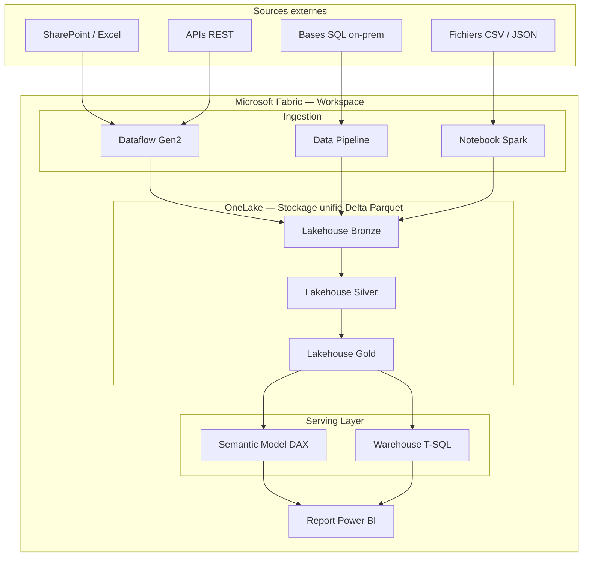
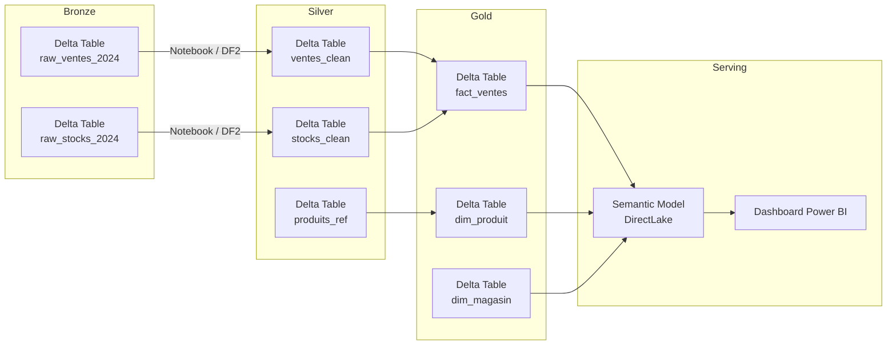

## Objectifs pédagogiques

À l'issue de ce module, vous serez capable de :

1. **Expliquer** ce que Microsoft Fabric apporte par rapport à une stack Power BI classique et pourquoi ce changement architectural est structurant
2. **Distinguer** les rôles respectifs d'OneLake, des Lakehouses, des Warehouses et des Dataflows Gen2 dans une architecture analytique
3. **Concevoir** une architecture Medallion (Bronze / Silver / Gold) sur Fabric en identifiant quel composant prend en charge chaque couche
4. **Choisir** entre Dataflow Gen2, Notebook Spark et Warehouse selon la nature de la transformation, le profil de l'équipe et les contraintes de volume
5. **Identifier** les points de friction courants lors d'une migration ou d'une adoption progressive de Fabric, y compris les bloqueurs selon la stack d'origine

---

## Mise en situation

Imaginez une DSI retail qui pilote 120 magasins. Aujourd'hui, leur stack analytique ressemble à ça : des centaines de fichiers Excel déposés chaque nuit sur SharePoint, un Power BI Gateway installé sur une VM qui tire tout ça, un dataset Premium qui tient en équilibre précaire, et trois analystes qui passent leurs matinées à "rafraîchir manuellement" quand quelque chose coince.

Le DSI a entendu parler de Microsoft Fabric dans une conférence. Il revient avec une question simple : "Est-ce qu'on peut tout migrer là-dedans ?"

La réponse honnête : oui, mais pas de la même façon pour tout le monde, et pas sans anticiper les bloqueurs. Fabric n'est pas une version améliorée de Power BI — c'est une plateforme data complète qui intègre Power BI dedans. Et Dataflows Gen2 ne sont pas non plus les Dataflows Gen1 rebaptisés. Comprendre ces distinctions, les compromis réels et les pièges de migration, c'est exactement ce que ce module couvre.

---

## Pourquoi Fabric change la donne

Pendant des années, construire une stack analytique dans l'écosystème Microsoft voulait dire assembler des briques séparées : Azure Data Factory pour l'ingestion, Azure Data Lake Storage pour le stockage, Azure Synapse ou SQL Server pour la transformation, et Power BI pour la visualisation. Chaque brique avait sa propre gestion des accès, son propre monitoring, ses propres coûts.

**Microsoft Fabric** répond à un constat simple : cette fragmentation est coûteuse en temps, en compétences et en maintenance. Fabric rassemble toutes ces fonctionnalités sous une interface unifiée, avec un modèle de capacité partagée et — point central — un **stockage unique : OneLake**.

🧠 **Concept clé** — OneLake est l'équivalent Fabric de OneDrive, mais pour la donnée structurée. Un seul lac de données par tenant, accessible par tous les workloads Fabric (Power BI, Spark, SQL, Data Factory). Pas de copie de données entre services : chaque composant lit au même endroit. Conséquence directe : les connexions inter-services à sécuriser passent de 4-5 à zéro. Les crédentiels à gérer idem.

Mais pourquoi Fabric plutôt qu'une architecture plate avec un seul ADLS et tous les services pointant dessus ? La réponse tient en trois points : **gouvernance unifiée** (un seul modèle de permissions Entra ID, un seul tenant Fabric), **facturation mutualisée** (les Fabric Units sont partagées entre workloads — un Notebook et un rapport Power BI puisent dans le même pool), et **intégration native** (un Lakehouse expose automatiquement un endpoint T-SQL sans configuration, un Semantic Model peut lire en DirectLake sans ETL supplémentaire).

Ce n'est pas une révolution de concept — le lakehouse existait avant Fabric. C'est une révolution d'intégration.

---

## Architecture de Fabric : les composants qui comptent

Avant d'aller plus loin, il faut cartographier les pièces du puzzle. Fabric expose plusieurs types d'objets dans ses workspaces, et il est facile de s'y perdre si on ne comprend pas leur rôle distinct.

| Composant | Rôle principal | Moteur sous-jacent | Profil utilisateur |
|-----------|---------------|--------------------|--------------------|
| **OneLake** | Stockage unifié (Delta Parquet) | Azure Data Lake Gen2 | Transparent — utilisé par tout |
| **Lakehouse** | Exploration + transformation de données brutes à semi-structurées | Spark + SQL Analytics Endpoint | Data Engineer, Analyste |
| **Warehouse** | Analytique relationnelle haute performance | T-SQL natif | Analyste SQL, DBA |
| **Dataflow Gen2** | ETL/ELT no-code / low-code | Power Query (M) + Staging interne | Functional Consultant, Analyste |
| **Data Pipeline** | Orchestration de flux (équivalent ADF) | Azure Data Factory engine | Data Engineer |
| **Notebook** | Transformation code-first, ML | PySpark / Scala / R | Data Scientist, Data Engineer |
| **Semantic Model** | Couche métier pour rapports Power BI | VertiPaq (Analysis Services) | Architecte BI, Développeur |
| **Report** | Visualisation | Power BI | Développeur BI, Analyste |

Le Lakehouse mérite une attention particulière. Il combine deux interfaces sur le même stockage :

1. **Files / Tables** — une vue arborescente façon explorateur de fichiers, où vous déposez des Parquet, CSV, Delta tables
2. **SQL Analytics Endpoint** — une interface T-SQL read-only générée automatiquement sur les Delta tables du Lakehouse, sans aucune configuration

C'est cette dualité qui rend le Lakehouse central dans Fabric : les ingénieurs écrivent dedans via Spark ou Dataflows, les analystes lisent via SQL ou directement via un Semantic Model.

---

## L'architecture Medallion sur Fabric

L'architecture Medallion n'est pas une invention de Microsoft — elle vient du monde Databricks. Mais Fabric en fait le pattern architectural de référence, et pour de bonnes raisons : elle correspond exactement à la façon dont les données évoluent de leur état brut vers un état consommable.

**Bronze — les données comme elles arrivent**

Ingestion fidèle à la source, sans transformation. Si la source envoie un fichier CSV avec des colonnes mal nommées et des doublons, Bronze les garde. L'idée est simple : avoir une copie immuable des données d'origine, avec horodatage d'ingestion. C'est votre filet de sécurité.

Dans Fabric, Bronze est typiquement un Lakehouse. Les fichiers arrivent dans la zone `Files`, ou sont directement écrits comme Delta tables par un Dataflow ou un Notebook.

**Silver — les données nettoyées et conformées**

C'est ici que les vraies transformations commencent : déduplication, typage, validation des contraintes métier, harmonisation des référentiels (codes magasin, SKUs, etc.). Les données Silver sont stockées en Delta tables dans un second Lakehouse.

💡 **Astuce** — En équipe mixte (data engineers + analystes Power Query), Silver est souvent la couche la plus débattue. La règle pragmatique : si la transformation implique des jointures multi-tables volumineuses, de la déduplication par fenêtre temporelle, ou des calculs d'anomalie, prenez Spark. Si c'est du nettoyage de colonnes et du filtrage sur des volumes raisonnables (<50M lignes), Dataflow Gen2 suffit.

Une question revient souvent : **faut-il toujours trois Lakehouses distincts ?** La réponse honnête : pas systématiquement. Une équipe de 2 data engineers avec 10M de lignes par jour et une logique d'agrégation stable peut fusionner Silver et Gold dans un seul Lakehouse sans douleur. Le point d'inflexion est là : dès que vous avez plusieurs équipes qui accèdent aux données (analystes métier, data scientists, développeurs d'applications), séparer les couches vous permet de définir des permissions granulaires. Un analyste métier n'a aucune raison d'accéder à Bronze. Un data scientist peut avoir besoin de Silver mais pas de reconstruire Gold lui-même.

**Gold — les données prêtes pour la consommation**

Agrégations, métriques calculées, tables de faits et dimensions pour le modèle en étoile. Gold est ce que lisent les rapports Power BI. Elle peut vivre dans un Lakehouse (lu via SQL Analytics Endpoint), dans un Warehouse, ou directement dans un Semantic Model DirectLake.

---

## Dataflows Gen2 : ce qui change vraiment par rapport à Gen1

Si vous venez de Power BI classique, vous avez peut-être déjà utilisé les Dataflows Gen1. La promesse était belle : Power Query dans le cloud, sans Gateway, réutilisable entre datasets. En pratique, ils étaient lents, difficiles à déboguer, et surtout : ils écrivaient uniquement vers une table interne Power BI, pas vers un vrai stockage.

Dataflows Gen2 change le modèle de fond en comble.

### La destination est configurable

C'est la différence la plus structurante. Un Dataflow Gen2 peut écrire vers :

- Un **Lakehouse** (Delta table) dans Fabric
- Un **Warehouse** (table SQL) dans Fabric
- Une **Azure SQL Database** externe
- Un **Azure Data Lake Storage** Gen2 externe

Plus besoin de passer par un dataset Power BI comme intermédiaire obligatoire. Le dataflow devient un vrai composant ETL, pas un patch sur un dataset.

Une question pratique pour les équipes qui migrent depuis Gen1 : **faut-il tout réécrire ?** Non systématiquement. Les transformations Power Query M compatibles Gen1 fonctionnent en Gen2 sans modification. Ce qui nécessite un ajustement : les références croisées entre requêtes qui s'appuyaient sur des tables Power BI internes comme destination intermédiaire, et les flows qui utilisaient le connecteur "Dataflows" Gen1 pour chaîner des datasets. Ces patterns doivent être repensés avec la destination Lakehouse.

### Le staging automatique

Dataflows Gen2 intègre un mécanisme de staging interne : chaque étape intermédiaire de Power Query peut être matérialisée dans un stockage Parquet temporaire avant d'être transformée à l'étape suivante. C'est invisible pour l'utilisateur, mais ça change radicalement les performances sur des volumes importants.

🧠 **Concept clé** — En Gen1, Power Query exécutait la requête M comme une chaîne de transformations en mémoire, de bout en bout. En Gen2, Fabric peut "découper" l'exécution en plusieurs passes avec matérialisation intermédiaire. Sur 50M de lignes provenant d'une source lente (API, SharePoint, base on-prem via Gateway), le gain peut atteindre un facteur 5 à 10 en temps d'exécution. Ce facteur est réel surtout quand la source elle-même est le goulot : le staging évite de la ré-interroger à chaque re-run. Sur une source rapide avec 10k lignes, le staging ajoute de la latence sans bénéfice.

### L'intégration dans les Data Pipelines

Un Dataflow Gen2 peut être appelé comme une activité dans un Data Pipeline Fabric, exactement comme une activité Copy ou un Notebook. Ça permet d'orchestrer des flux complexes avec gestion des erreurs, branchements conditionnels et retry automatique — ce qu'on ne pouvait pas faire avec Gen1.

### Ce que Dataflow Gen2 ne remplace pas

Il faut être honnête sur les limites, et surtout sur **quand elles se manifestent concrètement** :

- **Jointure entre deux tables volumineuses** : une jointure entre 200M et 50M lignes avec des filtres complexes va systématiquement atteindre le timeout Power Query (60 minutes par défaut sur Fabric). La raison : Power Query n'a pas de moteur de jointure distribué — il charge les deux tables en mémoire tampon avant de les joindre. Solution directe : Notebook PySpark avec `df.join()` et partitionnement explicite. Le même calcul passe de timeout à 20-30 minutes selon le nombre de partitions.
- **Débogage limité** : l'éditeur Power Query en ligne reste moins confortable que Power Query Desktop pour diagnostiquer des erreurs de transformation sur des jeux de données complexes.
- **Pas de contrôle fin de la parallélisation** : vous ne pouvez pas définir le nombre de partitions, la mémoire allouée, ou les stratégies de shuffle.

⚠️ **Erreur fréquente** — Essayer de remplacer tous les Notebooks Spark par des Dataflows Gen2 parce que "c'est plus simple". Gardez Dataflows Gen2 pour ce que Power Query gère naturellement : reshaping, typage, jointures sur des volumes modérés (<50M lignes), appels API paginés. Au-delà, la simplicité apparente devient un piège coûteux en temps de timeout et en ressources CU gaspillées.

---

## DirectLake : le mode de connexion qui réinvente le rafraîchissement

Un Semantic Model Power BI peut se connecter aux données de trois façons : Import (copie en mémoire), DirectQuery (requête en temps réel à la source), ou — depuis Fabric — **DirectLake**.

DirectLake lit les fichiers Delta Parquet directement depuis OneLake, sans copier les données en mémoire VertiPaq et sans passer par une requête SQL à la volée. Le moteur Analysis Services charge les colonnes demandées directement depuis le stockage objet, en mode "streaming columnar".

| Critère | Import | DirectQuery | DirectLake |
|---------|--------|-------------|------------|
| Fraîcheur des données | À la planification du refresh | Temps réel | Quasi temps réel (après commit Delta) |
| Performance requêtes | Très haute (en mémoire) | Variable (dépend de la source) | Haute (colonnes chargées à la demande) |
| Limite de volume | Capacité Premium / Fabric | Pas de limite native | Pas de limite native |
| Refresh nécessaire | Oui, planifié | Non | Non (sauf cold start) |
| Compatibilité | Toutes sources | Toutes sources | Lakehouse / Warehouse Fabric uniquement |

**Qui devrait décider entre ces trois modes ?** Ce n'est pas une décision purement technique. Import reste le bon choix si votre équipe métier a besoin de performances maximales sur un volume maîtrisé (<5-10 GB après compression) et accepte un décalage de fraîcheur. DirectQuery convient si les données changent en continu et que la latence des rapports est acceptable (et que la source supporte la charge). DirectLake est le choix cible sur Fabric dès que les données vivent dans un Lakehouse Gold et que vous voulez éliminer la gestion des refresh planifiés.

💡 **Astuce** — DirectLake tombe en "fallback DirectQuery" automatiquement si les données accédées dépassent les limites de la capacité Fabric. Sur un F2, par exemple, une table de 500M lignes force le basculement en DirectQuery — la latence des rapports peut passer de 2 secondes à 30 secondes sans aucune erreur visible dans le rapport. Ce comportement est configurable : désactivez le fallback dans les paramètres du Semantic Model pour obtenir une erreur explicite plutôt qu'une dégradation silencieuse.

---

## Raisonnement architectural : quand et pourquoi choisir quoi

C'est la question que tout architecte Fabric se pose en premier. Voici une grille de décision directement actionnables, suivie des contre-exemples qui font défaut dans la plupart des formations.

| Situation | Outil recommandé | Pourquoi |
|-----------|-----------------|----------|
| Ingestion de fichiers Excel / CSV / SharePoint récurrents | **Dataflow Gen2** | Power Query natif, connecteurs sans code, scheduling intégré |
| Appel API REST paginé avec transformation simple | **Dataflow Gen2** | Connecteur Web natif + Power Query pour le reshaping |
| Jointure entre 3 tables de moins de 50M lignes | **Dataflow Gen2** | Staging automatique couvre ce volume confortablement |
| Déduplication sur 200M lignes avec logique de fenêtre | **Notebook Spark** | `Window functions`, parallélisation native, contrôle mémoire |
| Jointure 200M × 50M avec filtres complexes | **Notebook Spark** | Dataflow Gen2 va en timeout systématique (60 min) |
| Transformation SQL pure sur tables relationnelles bien structurées | **Warehouse + T-SQL** | Lisibilité, performance, familiarité DBA |
| Orchestration multi-étapes avec conditions et retry | **Data Pipeline** | Activités, branchements, triggers, monitoring intégré |
| ML ou feature engineering | **Notebook Spark** | Spark MLlib, pandas, scikit-learn via SparkML |

**Pourquoi Medallion plutôt qu'une architecture plate ?**

La tentation est réelle : un seul Lakehouse avec toutes les tables, Power Query fait tout, on évite la complexité de trois couches. Ça fonctionne parfaitement jusqu'à un certain point — environ 50-100M lignes par table, une équipe unique, et une logique métier stable.

Les problèmes arrivent avec la croissance : vous ne pouvez plus accorder des permissions différentes par couche (l'analyste RH ne devrait pas voir les données brutes de paie non déduplicées), vous ne pouvez plus rejouer une transformation Silver sans risquer de corrompre Gold, et vous ne pouvez plus mesurer séparément la qualité de données à chaque étape.

Medallion n'est pas une obligation — c'est une réponse à ces contraintes. Si elles ne s'appliquent pas à votre contexte aujourd'hui, une architecture simplifiée est défendable. La question à se poser : "Dans 12 mois, si je dois accueillir deux équipes supplémentaires avec des périmètres de données différents, est-ce que mon architecture tient ?" Si la réponse est non, commencez avec Medallion.

---

## Guide de migration : votre stack actuelle → chemin Fabric optimal

Un des angles morts des formations Fabric est précisément celui-ci : vous ne partez pas de zéro. Voici les chemins de migration les plus courants avec leurs bloqueurs réels.

| Stack actuelle | Chemin Fabric recommandé | Bloqueurs fréquents |
|----------------|--------------------------|---------------------|
| **ADF + ADLS Gen2** | Migrer les pipelines ADF vers Data Pipelines Fabric. Les activités Copy se reprennent quasi à l'identique. | Les expressions ADF (dynamic content) n'ont pas d'équivalent direct — nécessite réécriture en expressions Pipeline Fabric |
| **Power BI + Gateway** | Remplacer le Gateway par des sources Fabric-native (Lakehouse). Migrer les datasets Import vers Semantic Models DirectLake. | Mesures DAX utilisant des fonctions Time Intelligence avec filtres complexes parfois incompatibles avec DirectLake — audit DAX obligatoire avant bascule |
| **Azure Synapse Analytics** | Notebooks Synapse → Notebooks Spark Fabric (compatibilité PySpark quasi-totale). Synapse SQL Pools → Warehouse Fabric. | Les External Tables Synapse pointant vers ADLS doivent être recréées comme Shortcuts OneLake. Les Linked Services n'existent pas dans Fabric |
| **SQL Server DW on-prem** | Créer un Warehouse Fabric, migrer les schémas ETL via Data Pipelines. Utiliser Gateway pour la phase de transition. | Le Gateway reste nécessaire pendant la coexistence on-prem / cloud. Les procédures stockées complexes peuvent nécessiter une réécriture partielle |
| **Dataflows Gen1** | Migrer vers Dataflows Gen2 en changeant la destination (Lakehouse au lieu de dataset interne). | Les requêtes qui référençaient d'autres datasets Power BI comme source doivent être refactorisées — le modèle "dataset chaîné" n'existe pas en Gen2 |

---

## Workflow de bout en bout : de la donnée brute au dashboard

Prenons le cas retail de la mise en situation et déroulons un flux réaliste.

**Situation :** 120 magasins envoient chaque nuit un export CSV des ventes de la journée. Ces fichiers atterrissent dans un SharePoint dédié. L'équipe veut un tableau de bord "ventes J-1" disponible à 7h le matin, avec possibilité de drill-down magasin / famille produit.

**Étape 1 — Ingestion Bronze** (2h)

Un Data Pipeline Fabric se déclenche à 2h. Il appelle un Dataflow Gen2 dont le seul rôle est de lire les fichiers CSV du dossier SharePoint et de les écrire tels quels dans la table `raw_ventes` du Lakehouse Bronze. Pas de transformation : même les colonnes mal nommées et les lignes vides passent.

Pourquoi ne pas transformer directement ? Parce que si la transformation plante à 3h du matin, vous voulez pouvoir rejouer depuis Bronze sans tout réingérer depuis SharePoint.

**Étape 2 — Transformation Silver** (3h30)

Le Pipeline enchaîne avec un second Dataflow Gen2 qui lit `raw_ventes` (Bronze) et applique : suppression des lignes sans identifiant magasin, typage de `date_vente` en Date, déduplication sur `(id_transaction, magasin_id)`, jointure avec `ref_magasins` pour normaliser les codes.

Résultat : table `ventes_clean` dans le Lakehouse Silver.

**Étape 3 — Agrégation Gold** (4h30)

Un Notebook Spark calcule les agrégations par jour / magasin / famille produit et écrit les résultats dans `fact_ventes_jour` et `dim_magasin` du Lakehouse Gold. Spark est choisi ici parce que les agrégations multi-niveaux avec calcul de rangs et variations J-1 / J-7 sont plus naturelles en PySpark — et parce que le volume (15M lignes par jour dans le cas retail complet) rend Dataflow Gen2 risqué sur les jointures d'agrégation.

**Étape 4 — Semantic Model DirectLake** (disponible dès 5h30)

Le Semantic Model est connecté aux tables Gold via DirectLake. Pas de refresh à planifier : dès que le Notebook Spark a commis les données dans le Delta Lake, le Semantic Model lit les nouvelles données. Le dashboard est à jour à 7h sans intervention.

**Gestion des erreurs**

Le Data Pipeline est configuré avec des activités `If Condition` : si le Dataflow Gen2 Bronze échoue (fichier corrompu, SharePoint inaccessible), une activité envoie une alerte Teams et le Pipeline s'arrête proprement. Silver et Gold ne sont pas exécutés sur des données partielles. Ce pattern évite le piège classique : une table Gold reconstruite à moitié, utilisée par des rapports sans que personne ne soit alerté.

---

## Cas réel : modernisation analytique dans la grande distribution

**Contexte :** Un distributeur européen (~3500 références, 80 entrepôts, 15M de lignes de mouvements stock par semaine) utilisait une stack Azure classique : ADF pour l'ingestion, ADLS Gen2 pour le stockage, Azure Synapse Analytics pour les transformations, Power BI Premium pour les rapports. Coût mensuel : ~18 000€ de ressources Azure, plus 2 ETP data engineers dédiés à la maintenance des pipelines ADF.

**Migration vers Fabric (6 mois, 1 200 heures équipe)**

La migration a été conduite couche par couche :

1. **Mois 1-2 :** Création des Lakehouses Bronze/Silver/Gold dans Fabric, migration des pipelines ADF les plus simples (~70% du volume) vers Data Pipelines Fabric + Dataflows Gen2. Les pipelines complexes sont restés sur ADF en parallèle.
2. **Mois 3-4 :** Migration des transformations Synapse vers Notebooks Spark Fabric pour les flux lourds, Dataflows Gen2 pour les flux légers.
3. **Mois 5-6 :** Basculement des Semantic Models de Import vers DirectLake. Suppression du Gateway. Arrêt des ressources Azure Synapse.

**Résultats mesurés :**
- Coût opérationnel réduit de ~40% : de 18 000€/mois à ~10 800€/mois sur capacité Fabric F64
- Temps de rafraîchissement des dashboards : de 45 min à quasi-temps réel (données disponibles 20 min après fermeture de caisse)
- Libération de 60% du temps des data engineers auparavant consacré à la maintenance des connexions inter-services

**Les 40% non anticipés de la migration**

Sur les 1 200 heures d'effort, environ 480 heures n'étaient pas prévues au planning initial. Répartition des surprises :

- **~200 heures sur DAX** : la migration des Semantic Models vers DirectLake a révélé des mesures DAX utilisant des fonctions Time Intelligence avec des filtres imbriqués incompatibles avec le mode DirectLake. Ces mesures fonctionnaient parfaitement en Import, silencieusement incorrectes en DirectLake. Leçon : auditer toutes les mesures DAX critiques avant de basculer le Semantic Model, pas après.
- **~150 heures sur les permissions** : les permissions SharePoint héritées utilisées par les Dataflows Gen1 ne se sont pas transposées automatiquement sur Fabric. Chaque source a dû être ré-autorisée manuellement via Entra ID.
- **~130 heures sur les pipelines ADF complexes** : les expressions dynamiques ADF (dynamic content) utilisées pour paramétrer les chemins de fichiers n'ont pas d'équivalent direct dans Data Pipelines Fabric — réécriture complète en expressions Pipeline Fabric.

**Ce que ça enseigne pour la prochaine migration :** prévoir un audit DAX dès le mois 1, cartographier toutes les sources et leurs permissions avant de commencer, et ne pas sous-estimer la dette d'expressions dynamiques ADF si votre stack en fait un usage intensif.

---

## Pièges courants et solutions

**Fallback DirectLake silencieux**

Déjà mentionné, mais ça mérite d'être répété : le fallback n'affiche aucune erreur dans le rapport. Sur un F2, une table de 500M lignes force le basculement en DirectQuery — latence de 2s à 30s, sans explication visible pour l'utilisateur. Testez systématiquement le comportement de fallback en pré-prod avec une requête DAX qui force le chargement de toutes vos colonnes volumineuses.

**Dataflow Gen2 sur volumes extrêmes**

Une jointure 200M × 50M lignes avec filtres complexes va en timeout après 60 minutes. Ce n'est pas un bug — c'est une limite architecturale de Power Query (pas de moteur distribué). La solution n'est pas d'optimiser la requête M : c'est de migrer cette transformation vers Spark. Le même calcul en PySpark avec `df.join()` et partitionnement sur la clé de jointure passe en 20-30 minutes selon la capacité Fabric.

**Permissions hérités SharePoint qui cassent la sécurité Fabric**
