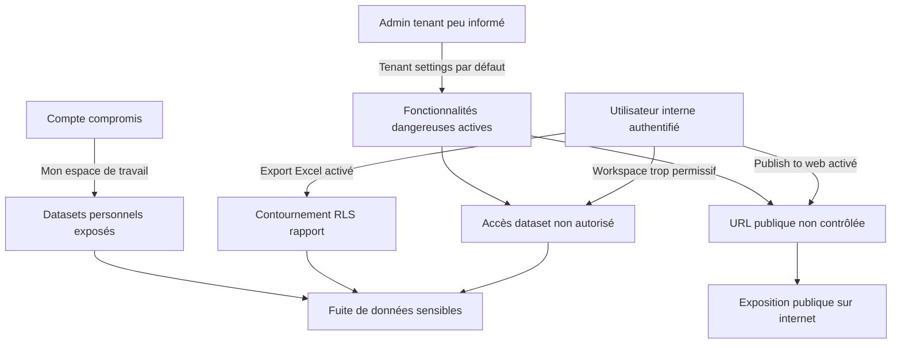
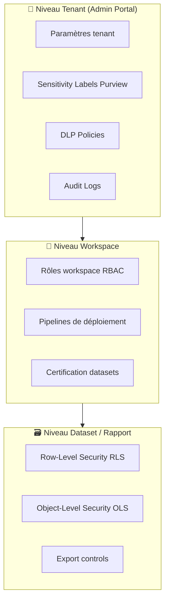
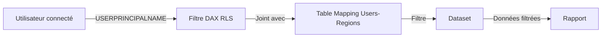
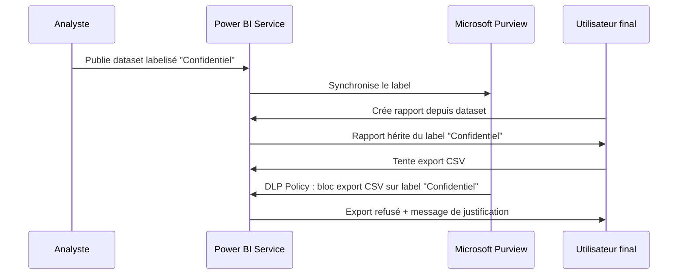
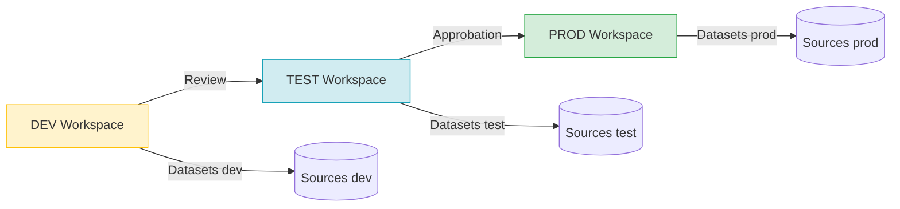

# Gouvernance Power BI

## Objectifs pédagogiques

À l'issue de ce module, vous serez capable de :

1. **Cartographier** les vecteurs d'exposition de données dans une architecture Power BI multi-équipes
2. **Configurer** les paramètres tenant, les workspaces et le RBAC pour contenir les accès au strict nécessaire
3. **Implémenter** la Row-Level Security statique et dynamique sur des modèles sémantiques partagés
4. **Déployer** une stratégie de sensitivity labels et de DLP intégrée à Microsoft Purview
5. **Concevoir** un modèle de gouvernance scalable autour des capacités Premium et des pipelines de déploiement

---

## Mise en situation

En 2022, une grande banque européenne découvre que des commerciaux de rang intermédiaire consultent depuis plusieurs mois les marges nettes par client de l'ensemble du portefeuille, y compris des comptes grands groupes qu'ils ne gèrent pas. Le vecteur : un dataset partagé dans un workspace accessible à "l'ensemble de l'organisation" — option activée par défaut par un analyste qui voulait "gagner du temps". Le rapport ne contenait aucune RLS. Les sensitivity labels n'étaient pas activées. Aucune alerte DLP n'avait été configurée.

Le coût de l'incident : audit interne de 3 mois, revue de conformité RGPD, et gel des déploiements Power BI pendant 6 semaines pendant la remédiation.

Ce scénario n'est pas exceptionnel. Power BI, déployé sans gouvernance, est une surface d'exposition massive — pas à cause d'une faille technique, mais à cause des options "pratiques" qui désactivent silencieusement les barrières d'accès.

---

## 1. Surface d'exposition dans une architecture Power BI

### Ce qui s'expose sans gouvernance explicite

| Vecteur | Exposition | Impact potentiel |
|---|---|---|
| Workspace "Mon espace de travail" | Données personnelles, datasets non maîtrisés | Fuite si le compte est compromis |
| "Partager avec toute l'organisation" | Rapport visible par tous les utilisateurs du tenant | Exposition de données sensibles à grande échelle |
| Export vers Excel / CSV activé | Contournement de toute RLS sur le rapport | Exfiltration silencieuse |
| Publish to web | URL publique, aucune authentification | Données accessibles depuis n'importe quel navigateur, sans login |
| Datasets partagés sans RLS | Tous les utilisateurs avec accès Build voient toutes les lignes | Accès non intentionnel aux données d'autres entités |
| Connexions DirectQuery avec credentials partagées | Si la source utilise des credentials stockées dans le service, toute personne avec Build peut requêter la source | Escalade vers la base de données sous-jacente |
| API REST Power BI sans restriction | Export programmatique de datasets complets | Exfiltration automatisée |

🔴 **Vecteur d'attaque — "Publish to web"** : cette fonctionnalité génère un token public non révocable automatiquement. Un rapport publié ainsi, même sur un rapport "interne", est indexable par Google si l'URL fuite dans un email ou un chat. La seule correction est la désactivation au niveau tenant.

### Ce que "Fabric" ne change pas

Le module précédent couvrait l'architecture Fabric et Dataflows Gen2. Il est important de noter que **migrer vers Fabric ne résout pas les problèmes de gouvernance Power BI** — les workspaces Fabric héritent des mêmes paramètres de partage et des mêmes règles RBAC. La gouvernance doit être conçue au niveau du service Power BI, pas de la couche de données en dessous.

---

## 2. Modèle de menace



### Acteurs de menace concrets

- **Insider non malveillant** : l'analyste qui partage le mauvais dataset parce que c'est "plus simple" — responsable de la majorité des incidents réels
- **Insider malveillant** : employé avec accès légitime qui exporte massivement avant un départ
- **Attaquant externe** : phishing d'un compte M365 avec licence Power BI Pro — l'attaquant hérite de tous les accès workspace de la victime
- **Shadow IT analytics** : équipes qui créent des workspaces non déclarés pour éviter les processus IT, sans gouvernance

### Matrice STRIDE appliquée à Power BI

| Menace STRIDE | Manifestation Power BI |
|---|---|
| Spoofing | Compte M365 compromis → accès rapports sensibles |
| Tampering | Modification d'un dataset partagé sans versioning |
| Repudiation | Aucun audit log des exports si non configuré |
| Information Disclosure | Partage non contrôlé, Publish to web, RLS absente |
| Denial of Service | Requêtes DirectQuery lourdes saturant la capacité Premium |
| Elevation of Privilege | Build access sur dataset → accès données brutes via Analyze in Excel |

---

## 3. Architecture de gouvernance : les trois niveaux

La gouvernance Power BI s'organise en trois couches qui doivent être cohérentes entre elles. Une politique tenant stricte ne sert à rien si les workspaces sont configurés de façon permissive.



### 3.1 Niveau Tenant — Paramètres critiques

Le portail d'administration (`app.powerbi.com → Admin Portal → Tenant settings`) contient une centaine de paramètres. Voici ceux qui ont un impact de sécurité direct et non évident.

⚠️ **Erreur fréquente** : les administrateurs activent des fonctionnalités pour une "période de test" en les accordant à "l'ensemble de l'organisation" et ne reviennent jamais désactiver cette portée. Six mois plus tard, Publish to web est actif pour 3 000 utilisateurs.

| Paramètre | Valeur par défaut | Recommandation | Risque si laissé par défaut |
|---|---|---|---|
| Publish to web | Activé (org entière) | Désactiver, ou restreindre à groupe sécurité dédié | Exposition publique internet |
| Export to Excel / CSV / PDF | Activé | Restreindre aux utilisateurs certifiés ou désactiver le CSV | Contournement RLS |
| Share with entire organization | Activé | Désactiver | Fuite involontaire large |
| External sharing (B2B) | Activé | Restreindre à domaines whitelistés | Partage avec partenaires non contrôlé |
| Embed codes | Activé | Désactiver si pas de portail externe | Token d'embed potentiellement exposé |
| Allow users to try Premium features | Activé | Désactiver en production si capacité non maîtrisée | Contournement des politiques de capacité |
| Service principal access | Désactivé | Activer uniquement pour groupes sécurité dédiés (pipelines CI/CD) | Attaque via service principal mal configuré |

🔒 **Contrôle de sécurité** : documenter chaque paramètre activé avec une justification métier et un groupe de sécurité nommément assigné. Un paramètre activé pour "tout le tenant" sans justification est une dette de gouvernance.

### 3.2 Niveau Workspace — RBAC et cycle de vie

#### Modèle de rôles workspace

Power BI définit cinq rôles sur les workspaces :

| Rôle | Peut créer/modifier contenu | Peut partager | Peut gérer accès | Peut voir données brutes (Analyze in Excel) |
|---|---|---|---|---|
| Viewer | ❌ | ❌ | ❌ | ❌ |
| Contributor | ✅ | ❌ | ❌ | ✅ |
| Member | ✅ | ✅ | ❌ | ✅ |
| Admin | ✅ | ✅ | ✅ | ✅ |
| Build (sur dataset) | ❌ (contenu) | ❌ | ❌ | ✅ |

🔴 **Vecteur d'attaque — rôle Build** : le rôle Build sur un dataset permet d'utiliser "Analyze in Excel" ou de créer un rapport Live Connection qui expose **toutes les colonnes** du modèle, indépendamment de la RLS configurée sur les rapports Power BI publiés. Si un dataset contient des colonnes sensibles sans OLS (Object-Level Security), le rôle Build devient un accès données brutes.

#### Stratégie de workspace recommandée

```
[DEV workspace]  →  [TEST workspace]  →  [PROD workspace]
    ↑                     ↑                    ↑
  Developers           Reviewers            Viewers
  Contributors         Members              (end users)
```

Cette séparation est implémentée via les **pipelines de déploiement Power BI** (fonctionnalité Premium/Fabric). Elle empêche un développeur de publier directement en production — le déploiement passe par un pipeline avec revue.

🧠 **Concept clé — workspace "Mon espace de travail"** : ce workspace personnel ne peut pas être géré par les administrateurs. Il n'accepte pas de RLS d'équipe, pas de sensitivity labels automatiques, et son contenu n'est pas visible dans les inventaires gouvernance. Toute donnée sensible dans "Mon espace de travail" est une donnée non gouvernée. La politique recommandée : interdire l'utilisation de "Mon espace de travail" pour tout contenu lié à des données d'entreprise, et activer une alerte sur la présence de datasources d'entreprise dans ces workspaces via le scanner d'information.

### 3.3 Niveau Dataset — RLS et OLS

#### Row-Level Security (RLS)

La RLS filtre les lignes retournées à un utilisateur selon des règles DAX. Elle existe en deux variantes :

**RLS statique** : des rôles prédéfinis avec des filtres DAX fixes.

```dax
// Rôle "Region_EMEA" — filtre statique
[Region] = "EMEA"
```

L'utilisateur est assigné manuellement au rôle dans le service Power BI. Problème à l'échelle : 50 régions = 50 rôles à maintenir, et chaque nouveau commercial doit être assigné manuellement.

**RLS dynamique** : le filtre utilise `USERPRINCIPALNAME()` pour filtrer selon l'identité de l'utilisateur connecté.

```dax
// Rôle "ByUser" — filtre dynamique sur table de mapping
[UserEmail] = USERPRINCIPALNAME()
```



🔒 **Contrôle de sécurité** : la RLS dynamique avec table de mapping est la seule approche scalable. La table de mapping doit être chargée depuis une source autoritaire (Dataverse, Active Directory, ou une table RH), pas gérée manuellement dans le modèle Power BI.

⚠️ **Erreur fréquente** : configurer la RLS sur le rapport, pas sur le dataset. La RLS sur rapport n'est pas une protection — elle ne protège pas contre l'accès direct au dataset via Analyze in Excel ou une connexion Live. La RLS doit toujours être définie sur le **dataset** (modèle sémantique).

#### Object-Level Security (OLS)

L'OLS masque des colonnes ou des tables entières pour certains rôles. Un utilisateur avec rôle OLS restreint ne peut pas voir la colonne `Salaire` même si le rapport ne l'affiche pas — elle n'existe pas dans son modèle.

OLS nécessite Tabular Editor ou SSMS via l'endpoint XMLA (Premium/Fabric). Elle ne peut pas être configurée depuis le Desktop seul.

---

## 4. Sensitivity Labels et DLP avec Microsoft Purview

### Pourquoi les labels ne sont pas juste du "étiquetage"

Un sensitivity label Power BI, quand il est correctement configuré avec Purview, fait trois choses :

1. **Classification visuelle** : indique à l'utilisateur le niveau de sensibilité du rapport
2. **Héritage automatique** : si le dataset est labellisé "Confidentiel", tout rapport créé depuis ce dataset hérite du label — sans action de l'analyste
3. **Enforcement DLP** : une politique DLP peut bloquer l'export d'un rapport "Hautement Confidentiel" vers Excel ou interdire le partage externe



### Configuration DLP Power BI dans Purview

Le chemin de configuration : `Microsoft Purview Compliance Portal → Data Loss Prevention → Policies → Create Policy → Power BI`

Une politique DLP Power BI peut cibler :
- Des workspaces spécifiques ou tous les workspaces
- Des datasets avec un label donné
- Des datasets contenant des types d'informations sensibles détectés (numéros de carte, IBAN, etc.)

Actions disponibles :
- **Alerte administrateur** sans bloquer l'utilisateur
- **Notification utilisateur** avec justification obligatoire
- **Restriction d'accès** (bloque le partage et l'export)

💡 **Astuce** : commencer avec des politiques en mode "audit uniquement" pendant 2 à 4 semaines avant de passer en mode enforcement. Les faux positifs sur les détections automatiques de données sensibles sont fréquents sur des datasets financiers légitimes.

### Héritage de labels : la règle de priorité

Quand un rapport est créé depuis plusieurs datasets avec des labels différents, Power BI applique **le label le plus restrictif**. Ce comportement est non configurable — il faut donc être cohérent dans la labellisation des datasets sources pour éviter des situations où un rapport de synthèse hérite d'un label très restrictif à cause d'un seul dataset mal labellisé.

---

## 5. Capacités Premium et gouvernance des ressources

### Le problème du voisin bruyant

Sur une capacité Premium partagée, une requête DirectQuery mal optimisée ou un refresh de dataset volumineux peut consommer la totalité des ressources de la capacité et dégrader tous les autres rapports qui s'y exécutent. Ce n'est pas un problème de sécurité au sens strict — mais c'est un vecteur de DoS interne non intentionnel.

🔴 **Vecteur d'attaque — DoS par requête** : un utilisateur avec accès Contributor peut publier un rapport avec une mesure DAX non optimisée (ex: CROSSJOIN sur deux tables larges) qui consomme la capacité entière pendant plusieurs minutes, rendant les rapports critiques indisponibles.

### Paramètres de gouvernance des capacités

Dans le portail Admin → Capacités Premium :

| Paramètre | Recommandation |
|---|---|
| Memory limit per dataset | Définir une limite (ex: 25 GB max) pour éviter qu'un dataset monopolise la mémoire |
| DirectQuery connections per second | Limiter par dataset (ex: 30 req/s) |
| Query timeout | 3 à 10 minutes selon criticité métier |
| Max offline dataset size | Limiter pour éviter les datasets trop volumineux publiés sans validation |
| Autoscale | Activer avec un plafond explicite et une alerte à 80% pour maîtriser les coûts |

🔒 **Contrôle de sécurité** : activer le **Capacity Metrics App** (application Power BI officielle Microsoft) sur chaque capacité Premium. Elle donne la consommation par workspace, par dataset, et par type d'opération. C'est le seul moyen de détecter un dataset qui monopolise les ressources avant que les utilisateurs se plaignent.

---

## 6. Audit et détection

### Logs disponibles

Power BI écrit ses événements dans **Unified Audit Log (UAL)** de Microsoft 365. Les événements clés à surveiller :

| Événement | Signal de sécurité |
|---|---|
| `ExportArtifact` | Export de données — croiser avec le label du dataset |
| `PublishToWebReport` | Création d'un embed public — toujours alerter |
| `CreateOrgApp` | Déploiement d'une app org-wide — vérifier la portée |
| `ShareReport` / `ShareDashboard` | Partage externe (vérifier domaine destinataire) |
| `ViewReport` massif sur compte | Potentiel scraping de données via l'interface |
| `DeleteDataset` | Suppression de dataset partagé — potentielle destruction de preuve |
| `UpdateDatasourceCredentials` | Changement de credentials sur une source — vecteur de pivoting |

### Requête KQL pour détecter les exports massifs

```kql
// Sentinel / Log Analytics — détection exports Power BI anormaux
OfficeActivity
| where RecordType == "PowerBIAudit"
| where Operation == "ExportArtifact"
| summarize ExportCount = count() by UserId, bin(TimeGenerated, 1h)
| where ExportCount > 20
| project TimeGenerated, UserId, ExportCount
| order by ExportCount desc
```

💡 **Astuce** : le UAL de M365 a une latence de 30 à 60 minutes. Pour une détection quasi-temps-réel des anomalies Power BI, configurer le streaming des logs vers Sentinel via le connecteur M365 Defender, pas via une ingestion batch.

### Scanner d'information Power BI

L'API Scanner (`/v1.0/myorg/admin/workspaces/getInfo`) permet d'inventorier l'ensemble des workspaces, datasets, rapports et leurs connexions à des sources de données. C'est la base d'un inventaire de gouvernance.

```
Admin Portal → Tenant Settings → Admin API Settings
→ Activer "Enhance admin APIs responses with detailed metadata"
→ Activer "Enhance admin APIs responses with DAX and mashup expressions"
```

Ces deux paramètres activés permettent au scanner de retourner les colonnes, les mesures DAX, et les expressions M des dataflows — indispensable pour détecter des datasets contenant des colonnes sensibles sans RLS.

---

## 7. Modèle de gouvernance scalable : le CoE Power BI

### Structure organisationnelle recommandée

Un déploiement Power BI à l'échelle entreprise nécessite une séparation entre les rôles suivants :

| Rôle | Responsabilités | Droits minimums |
|---|---|---|
| **Tenant Admin** | Paramètres tenant, licences, politiques DLP | Admin Power BI + Compliance Admin Purview |
| **Capacity Admin** | Gestion des capacités Premium, quotas | Capacity Admin sur les capacités dédiées |
| **Workspace Admin** | Gestion des rôles workspace, certification | Admin sur workspaces de leur périmètre |
| **Dataset Owner** | RLS, OLS, refresh, certification | Membre du workspace + Build sur les datasets dépendants |
| **Report Developer** | Création de rapports sur datasets certifiés | Contributor workspace + Build dataset |
| **Consumer** | Consultation | Viewer workspace ou app distribuée |

### Certification de datasets

La certification Power BI est le mécanisme par lequel un dataset est marqué comme "source de vérité approuvée". Seuls les Tenant Admins ou des utilisateurs explicitement autorisés peuvent certifier.

🔒 **Contrôle de sécurité** : publier une politique claire : tout rapport déployé en production doit utiliser un dataset **certifié**. Les datasets non certifiés restent utilisables en développement mais ne peuvent pas être publiés dans des workspaces de production. Ce contrôle réduit la prolifération des datasets dupliqués et incohérents.

### Pipeline de déploiement et ALM



Les pipelines de déploiement gèrent automatiquement la substitution des paramètres de connexion (source dev → source prod) via les **deployment rules**. Sans cette substitution, un rapport déployé en prod peut continuer à requêter la base de dev — fuite de données dans le sens inverse.

---

## Cas réel en entreprise

### Incident : exfiltration par Analyze in Excel — Secteur retail, 2023

**Contexte** : un retailer européen centralise ses données de ventes dans un dataset Power BI Premium partagé entre les équipes régionales. La RLS est correctement configurée sur les rapports publiés — chaque commercial ne voit que ses données.

**Ce qui s'est passé** : un manager régional, avec le rôle "Member" sur le workspace, utilise "Analyze in Excel" sur le dataset directement. La RLS sur les rapports ne s'applique pas ici — Analyze in Excel crée une connexion Live directe au dataset, et le rôle RLS configuré sur le dataset pour ce manager est "tout voir" (il avait été assigné ainsi pour débugger un problème six mois avant). Il exporte la totalité des données de ventes de toutes les régions vers Excel, puis vers un tableur personnel.

**Découverte** : l'événement `ExportArtifact` était bien dans les UAL, mais aucune alerte n'était configurée. L'incident a été détecté lors d'un audit trimestriel.

**Remédiation** :
1. Audit de tous les rôles RLS sur les datasets partagés — suppression des rôles "admin" accordés pour débogage
2. Restriction du rôle Build aux seuls développeurs certifiés
3. Alerte Sentinel sur `ExportArtifact` dépassant 5 exports par heure par utilisateur
4. Activation de l'OLS sur les colonnes de margin et de coût — même avec Analyze in Excel, ces colonnes sont invisibles

**Leçon** : la RLS sur les rapports et la RLS sur les datasets sont deux configurations distinctes. La première protège la vue. La seconde protège la donnée. Seule la seconde compte.

---

## Erreurs fréquentes

⚠️ **RLS configurée uniquement sur les rapports, pas sur les datasets**
→ Conséquence : n'importe quel utilisateur avec rôle Build peut contourner la RLS via Analyze in Excel ou une connexion XMLA
→ Correction : toujours définir la RLS dans Power BI Desktop sur le modèle, pas via les paramètres du rapport publié

⚠️ **Workspace "Mon espace de travail" utilisé pour des dashboards de production**
→ Conséquence : aucun contrôle admin possible, aucun audit structuré, aucune RLS d'équipe applicable, perte totale si l'employé quitte l'organisation
→ Correction : politique tenant interdisant les datasources d'entreprise dans les workspaces personnels, enforced via DLP ou revue régulière avec le scanner API

⚠️ **Credentials de source de données stockées en mode "partagé" (shared credentials)**
→ Conséquence : tous les utilisateurs du workspace requêtent la source avec les mêmes credentials — impossible de tracer qui a accédé à quoi au niveau base de données
→ Correction : utiliser OAuth2 / SSO ou des credentials individuelles. En mode DirectQuery avec SSO Kerberos ou AAD, chaque requête est exécutée avec l'identité de l'utilisateur Power BI

⚠️ **Sensitivity labels assignées manuellement par les utilisateurs finaux**
→ Conséquence : un analyste peut downgrader un label "Confidentiel" en "Interne" pour contourner une politique DLP, sans alerte
→ Correction : activer dans Purview la justification obligatoire pour downgrade de label + alerte admin sur toute réduction de label sur des datasets Power BI

⚠️ **Piliers de déploiement sans paramétrage des deployment rules**
→ Conséquence : un dataset déployé de DEV à PROD continue de pointer sur la base de données de développement
→ Correction : configurer les deployment rules pour chaque source de données avec les paramètres de connexion par environnement

⚠️ **RLS dynamique avec table de mapping en cache obsolète**
→ Conséquence : un utilisateur quittant l'organisation ou changeant de périmètre continue à voir les données de son ancien rôle jusqu'au prochain refresh
→ Correction : planifier le refresh de la table de mapping au minimum toutes les heures, ou utiliser DirectQuery sur la table de mapping si la source le permet

---

## Résumé

Power BI est une surface d'exposition analytique qui combine les risques des applications web (partage non contrôlé, accès non authentifié via Publish to web) et des bases de données (accès aux données brutes via Analyze in Excel, DirectQuery avec credentials partagées). La gouvernance s'organise sur trois niveaux — tenant, workspace, dataset — qui doivent être cohérents : un tenant verrouillé ne protège pas contre une RLS absente sur un dataset. La RLS doit être définie sur le modèle sémantique, pas sur le rapport. L'OLS complète la RLS pour masquer les colonnes sensibles même aux utilisateurs avec accès direct au dataset. Les sensitivity labels connectées à Purview permettent un enforcement DLP automatique sur les exports. L'audit via le Unified Audit Log est la seule source de vérité sur qui a exporté quoi — sans alertes configurées dessus, les incidents restent invisibles pendant des mois.

---

<!-- snippet
id: powerbi_rls_dynamic_dax
type: concept
tech: Power BI
level: advanced
importance: high
format: knowledge
tags: rls, security, dax, dataset, rbac
title: RLS dynamique Power BI — exemple DAX complet
context: À configurer dans Power BI Desktop via Modeling → Manage Roles. La table UserMapping doit exister dans le modèle avec les colonnes UserEmail et Region.
content: La RLS dynamique filtre les lignes selon l'identité de l'utilisateur connecté. Étape 1 — créer un rôle "ByUser" dans Desktop (Modeling → Manage Roles). Étape 2 — appliquer ce filtre DAX sur la table de faits ou la table de mapping : [UserEmail] = USERPRINCIPALNAME(). Étape 3 — la relation entre UserMapping[Region] et Sales[Region] propage le filtre vers la table de faits. Exemple complet : dans le rôle "ByUser", filtre sur la table UserMapping → FILTER(UserMapping, UserMapping[UserEmail] = USERPRINCIPALNAME()). Tester avec "View as role" dans Desktop en saisissant un UPN réel. Différence critique avec RLS statique : pas de rôle à maintenir manuellement par utilisateur. Limite : si la table UserMapping est en mode Import, elle peut être obsolète de plusieurs heures — planifier le refresh au minimum toutes les heures ou passer la table de mapping en DirectQuery.
description: RLS dynamique complète avec USERPRINCIPALNAME() et table de mapping — approche scalable, exemple DAX testable dans Desktop.
-->

<!-- snippet
id: powerbi_rls_dataset_vs_report
type: warning
tech: Power BI
level: intermediate
importance: high
format: knowledge
tags: rls, security, dataset, analyze-in-excel, contournement
title: RLS rapport vs RLS dataset — différence critique
content: RLS configurée sur le rapport publié (via les paramètres de rapport dans le service) ne protège pas
