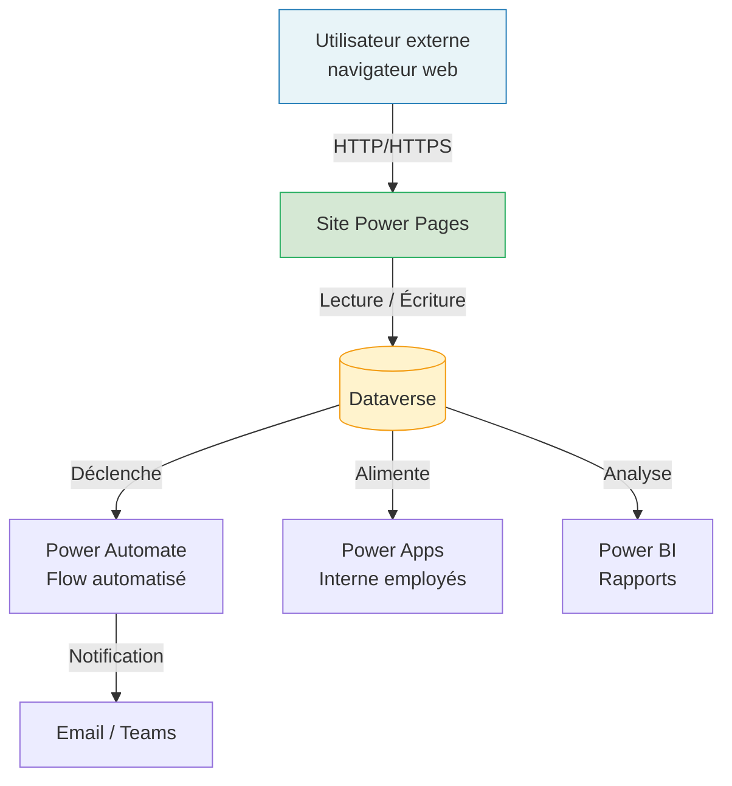

# Rôle de Power Pages

## Objectifs pédagogiques

À l'issue de ce module, vous serez capable de :

- Expliquer ce qu'est Power Pages et quel problème il résout
- Distinguer Power Pages des autres composants de la Power Platform
- Identifier les cas d'usage typiques d'un portail Power Pages
- Comprendre comment Power Pages s'articule avec Dataverse
- Décider si Power Pages est la bonne solution face à un besoin donné

---

## Mise en situation

Imaginez que votre entreprise utilise Power Apps et Power Automate en interne depuis plusieurs mois. Les employés accèdent à leurs applications via Microsoft 365, tout fonctionne bien.

Mais un jour, une nouvelle demande arrive : **permettre à des clients, des partenaires ou des fournisseurs externes de soumettre des demandes, consulter leur historique, ou remplir des formulaires** — sans qu'ils aient besoin d'un compte Microsoft, sans qu'ils aient accès à votre tenant Azure AD, et sans que votre équipe IT doive développer une application web from scratch.

Avec une Power App Canvas, c'est techniquement possible, mais vous allez vite vous heurter à un mur : la gestion des licences pour des utilisateurs externes, les limitations de l'authentification, et l'absence d'une vraie expérience "site web public". Ce besoin-là, c'est exactement ce que Power Pages adresse.

---

## Ce que c'est — et pourquoi ça existe

Power Pages est le composant de la Power Platform conçu pour créer des **sites web accessibles à des utilisateurs externes**. Contrairement à Power Apps, qui cible principalement les collaborateurs internes d'une organisation, Power Pages ouvre une interface web vers l'extérieur : clients, partenaires, citoyens, fournisseurs.

La vraie rupture par rapport au reste de la plateforme, c'est la notion d'**utilisateur anonyme ou authentifié sans compte entreprise**. Quelqu'un peut accéder à votre portail avec un compte Google, un compte local créé pour l'occasion, ou même sans s'identifier du tout — selon ce que vous décidez.

🧠 **Concept clé** — Power Pages n'est pas "une Power App dans un navigateur". C'est une plateforme de portails web à part entière, avec son propre système d'authentification, ses propres contrôles d'accès aux données, et son propre environnement de design.

Historiquement, Power Pages s'appelait **Power Apps Portals**. Il a été renommé et repositionné en 2022 pour lui donner plus de visibilité en tant que produit autonome. Ce changement de nom reflète une montée en maturité : aujourd'hui, c'est un studio de création de sites web low-code, pas un simple add-on.

---

## Ce que Power Pages sait faire concrètement

Pour bien comprendre le rôle de Power Pages, le plus simple est de partir des fonctionnalités qu'il offre nativement, regroupées autour de trois axes :

**1. Un site web sans code serveur**
Power Pages génère des pages web responsive — accessibles depuis un navigateur, sur mobile comme sur desktop. Vous construisez ces pages dans un studio visuel, en glissant-déposant des composants : formulaires, listes, images, sections de texte, boutons. Pas besoin d'écrire du HTML/CSS pour démarrer, même si c'est possible si vous en avez besoin.

**2. Une connexion directe à Dataverse**
Ici, c'est là où la magie opère. Les données que vous exposez sur votre portail viennent directement de Dataverse — la base de données commune de la Power Platform. Un visiteur soumet un formulaire ? Les données atterrissent dans une table Dataverse. Il consulte ses commandes passées ? Elles sont lues depuis Dataverse, avec les permissions que vous avez définies.

```
Visiteur du site → Power Pages → Dataverse → Vos autres apps / Flows / Power BI
```

Ce point est fondamental : Power Pages n'est pas une île. Il s'intègre naturellement dans tout l'écosystème que vous avez déjà construit.

**3. Une gestion de l'identité externe**
Power Pages intègre un système d'authentification flexible. Un utilisateur externe peut créer un compte local sur votre portail, se connecter via Azure AD B2C, ou utiliser un fournisseur social (Google, LinkedIn, Facebook). Vous décidez ce que chaque type d'utilisateur peut voir ou modifier.

---

## Comment Power Pages s'articule avec le reste de la plateforme

Voici comment les flux d'information circulent dans un scénario typique :



Ce diagramme illustre un point clé : **Power Pages n'est qu'une porte d'entrée**. Ce qui se passe derrière — automatisations, analyses, traitements — continue de reposer sur les outils que vous connaissez déjà.

Un exemple concret : un fournisseur soumet une facture sur votre portail Power Pages → les données s'enregistrent dans Dataverse → un Flow Power Automate envoie une notification à l'équipe comptable → un employé traite la demande depuis une Power App interne → le statut mis à jour est immédiatement visible par le fournisseur sur le portail.

---

## Les cas d'usage typiques

Power Pages s'impose naturellement dans un périmètre assez bien délimité. Voici les scénarios où il est systématiquement la bonne réponse :

| Cas d'usage | Description rapide |
|-------------|-------------------|
| **Portail de self-service client** | Consulter des commandes, ouvrir des tickets, suivre des demandes |
| **Portail partenaires / fournisseurs** | Soumettre des documents, consulter des catalogues, valider des informations |
| **Formulaires publics** | Inscriptions à des événements, demandes de contact, candidatures |
| **Portail citoyen** | Dépôt de dossiers administratifs, suivi de demandes auprès d'une collectivité |
| **Extranet** | Partager des ressources avec des partenaires identifiés, sans leur donner accès à l'intranet |

Ce qui leur est commun : des **utilisateurs qui ne sont pas dans votre organisation**, qui ont besoin d'interagir avec vos données, mais que vous ne voulez pas gérer comme des employés dans Azure AD.

⚠️ **Erreur fréquente** — Beaucoup d'équipes débutantes essaient de couvrir ce besoin avec une Power App Canvas partagée en externe. C'est techniquement faisable, mais coûteux en licences (chaque utilisateur externe doit être licencié), limité en termes d'URL propre et de personnalisation visuelle, et peu adapté à des volumes importants. Power Pages est conçu précisément pour ce contexte.

---

## Ce que Power Pages n'est pas

Autant être clair sur les limites dès le départ — ça vous évitera de partir dans la mauvaise direction.

**Power Pages n'est pas un CMS généraliste.** Si vous cherchez à gérer un blog, un site vitrine avec des dizaines de pages éditoriales, des SEO avancés et des workflows de publication complexes, SharePoint ou un vrai CMS (WordPress, Strapi…) sera plus adapté. Power Pages brille quand il y a des **données dynamiques et des interactions utilisateur**, pas quand le contenu est principalement statique et éditorial.

**Power Pages n'est pas une application SaaS.** Il ne remplace pas une application métier complexe avec une logique front-end riche, des interactions temps réel, ou des traitements lourds côté client. Pour ce genre de besoins, on regarde du côté du développement web classique ou d'une Power App Canvas bien architecturée.

**Power Pages n'est pas gratuit pour les utilisateurs externes.** Les utilisateurs authentifiés sur un portail Power Pages sont licenciés à la session ou au login. C'est un point à intégrer dans votre modèle de coût dès la conception.

💡 **Astuce** — Les utilisateurs anonymes (non connectés) ne consomment pas de licences individuelles. Si votre besoin se limite à un formulaire public sans authentification, le coût de licence est beaucoup plus faible.

---

## Cas réel : portail de gestion des sous-traitants

Une entreprise du secteur BTP gère environ 150 sous-traitants actifs. Avant Power Pages, le processus ressemblait à ceci : emails en cascade, pièces jointes perdues, relances manuelles, données saisies deux fois (côté sous-traitant, puis ressaisie en interne).

**Ce qu'ils ont construit avec Power Pages :**
- Un portail accessible via URL publique, authentification par compte local
- Un formulaire d'onboarding pour les nouveaux sous-traitants (données entreprise, certifications, RIB)
- Une page de suivi des missions en cours avec statuts temps réel
- Un espace de dépôt de factures avec validation côté interne via Power Automate

**Résultat :** Le délai moyen d'onboarding d'un nouveau sous-traitant est passé de 5 jours à moins de 24 heures. Les relances manuelles ont quasi disparu, remplacées par des notifications automatiques. L'équipe interne n'a pas touché à une seule ligne de code — le portail a été construit et maintenu par une consultante fonctionnelle.

---

## Bonnes pratiques avant de démarrer

Avant même d'ouvrir le studio Power Pages, quelques points méritent réflexion :

**Cartographiez vos utilisateurs externes avant tout.** Qui va se connecter ? Combien ? Avec quel fournisseur d'identité ? Ces réponses conditionnent directement votre modèle de licence et votre configuration d'authentification.

**Pensez permissions Dataverse dès le début.** Power Pages expose des données Dataverse à des utilisateurs qui n'ont aucune raison d'accéder à tout. Le système de rôles (Table Permissions) est puissant, mais il demande d'être configuré explicitement. Par défaut, **un utilisateur externe ne voit rien** — c'est vous qui ouvrez les accès. C'est une bonne nouvelle pour la sécurité, mais ça surprend souvent les débutants qui se demandent pourquoi leurs données n'apparaissent pas.

**Anticipez la gouvernance des URL et des domaines.** Un portail Power Pages a une URL par défaut en `powerappsportals.com`. Pour un usage professionnel, vous voudrez un domaine personnalisé. C'est faisable, mais ça nécessite une coordination avec votre équipe réseau.

💡 **Astuce** — Commencez toujours par un portail en mode "Restricted" (non accessible publiquement) pendant la phase de développement. Vous l'ouvrez au monde uniquement quand il est prêt. Le bouton est dans les paramètres du portail, section "Site Visibility".

---

## Résumé

Power Pages est le composant de la Power Platform dédié aux **portails web à destination des utilisateurs externes** — clients, partenaires, fournisseurs — qui n'ont pas de compte dans votre organisation Microsoft 365.

Son principal atout : il s'appuie directement sur Dataverse, ce qui le connecte naturellement à tout l'écosystème Power Platform déjà en place. Un utilisateur externe soumet un formulaire, les données arrivent dans Dataverse, et vos flows, apps et rapports continuent de fonctionner sans rupture.

Il n'est ni un CMS généraliste, ni une application web complexe — il occupe un espace précis : des **interactions structurées avec des utilisateurs non-internes, autour de données métier**. Dans ce périmètre, c'est l'outil le plus rapide et le plus cohérent de l'écosystème Microsoft.

La prochaine étape logique : mettre les mains dedans et créer votre premier portail.

---

<!-- snippet
id: powerpages_role_concept
type: concept
tech: power pages
level: beginner
importance: high
format: knowledge
tags: power pages, portail, utilisateurs externes, dataverse
title: Ce que Power Pages fait concrètement
content: Power Pages génère un site web accessible dans un navigateur, connecté directement à Dataverse. Les données soumises via un formulaire public atterrissent dans une table Dataverse — accessible immédiatement par vos Power Apps, Flows et rapports Power BI. Contrairement à une Power App, Power Pages gère des utilisateurs sans compte Microsoft 365.
description: Power Pages = portail web externe + lecture/écriture Dataverse + identité sans Azure AD interne
-->

<!-- snippet
id: powerpages_vs_powerapp_warning
type: warning
tech: power pages
level: beginner
importance: high
format: knowledge
tags: power pages, power apps, licence, utilisateurs externes
title: Ne pas remplacer Power Pages par une Power App partagée en externe
content: Piège : partager une Power App Canvas à des utilisateurs externes pour éviter Power Pages. Conséquence : chaque utilisateur externe doit avoir une licence Power Apps (coût élevé à volume), pas d'URL propre, personnalisation limitée. Correction : utiliser Power Pages dès que des utilisateurs non-internes doivent interagir avec vos données.
description: Couvrir un besoin de portail externe avec une Canvas App coûte plus cher et scale moins bien que Power Pages
-->

<!-- snippet
id: powerpages_anonymous_tip
type: tip
tech: power pages
level: beginner
importance: medium
format: knowledge
tags: power pages, licence, utilisateurs anonymes, formulaire public
title: Utilisateurs anonymes = pas de licence individuelle
content: Les visiteurs non authentifiés (anonymes) sur un portail Power Pages ne consomment pas de licence par utilisateur. Si votre besoin est un formulaire public sans connexion requise (inscription événement, prise de contact), le modèle de coût est significativement plus bas. La facturation par session/login ne s'applique qu'aux utilisateurs qui se connectent.
description: Formulaire public sans auth → pas de coût de licence individuelle, contrairement aux utilisateurs connectés
-->

<!-- snippet
id: powerpages_permissions_dataverse_warning
type: warning
tech: power pages
level: beginner
importance: high
format: knowledge
tags: power pages, dataverse, permissions, table permissions, sécurité
title: Par défaut, un utilisateur externe ne voit aucune donnée Dataverse
content: Piège classique : créer un portail Power Pages, lier une table Dataverse, et ne voir aucune donnée à l'affichage. Cause : Power Pages applique le principe du moindre privilège — sans Table Permission configurée explicitement, les données sont invisibles pour les utilisateurs externes. Correction : créer une Table Permission sur chaque table exposée, avec le scope et les droits appropriés (Global, Contact, Account…).
description: Données invisibles sur le portail = Table Permissions manquantes dans Dataverse, pas un bug d'affichage
-->

<!-- snippet
id: powerpages_site_visibility_tip
type: tip
tech: power pages
level: beginner
importance: medium
format: knowledge
tags: power pages, gouvernance, développement, site visibility
title: Garder le portail en mode Restricted pendant le développement
content: Pendant la construction du portail, activer le mode "Private" (Site Visibility → Private) dans les paramètres Power Pages. Le site n'est accessible qu'aux utilisateurs authentifiés dans votre organisation. Passer en "Public" uniquement au moment de la mise en production. Chemin : Power Pages Studio → Set up → Site Visibility.
description: Mode Private dans Site Visibility = portail non accessible publiquement, idéal pour développer sans exposer un site incomplet
-->

<!-- snippet
id: powerpages_not_cms_concept
type: concept
tech: power pages
level: beginner
importance: medium
format: knowledge
tags: power pages, cms, limites, cas usage
title: Power Pages n'est pas un CMS généraliste
content: Power Pages est optimisé pour des données dynamiques et des interactions utilisateur (formulaires, listes, suivi de dossiers). Pour du contenu éditorial statique avec workflows de publication, SEO avancé et gestion de pages à grande échelle, SharePoint ou un CMS dédié (Strapi, WordPress) sera plus adapté. Le critère de décision : y a-t-il des données Dataverse à exposer ? Si oui → Power Pages. Si non → CMS.
description: Choisir Power Pages quand il y a des données Dataverse à exposer ; préférer un CMS pour du contenu purement éditorial
-->

<!-- snippet
id: powerpages_dataverse_integration_concept
type: concept
tech: power pages
level: beginner
importance: high
format: knowledge
tags: power pages, dataverse, intégration, écosystème
title: Power Pages comme porte d'entrée vers Dataverse
content: Power Pages lit et écrit dans Dataverse en temps réel. Une donnée soumise via un formulaire portail est immédiatement disponible dans Dataverse — donc accessible par vos Power Apps internes, vos Flows Power Automate, et vos rapports Power BI, sans synchronisation ni export. C'est le même enregistrement Dataverse, pas une copie.
description: Les données Power Pages vivent dans Dataverse — disponibles instantanément pour toute l'écosystème Power Platform sans synchro
-->
