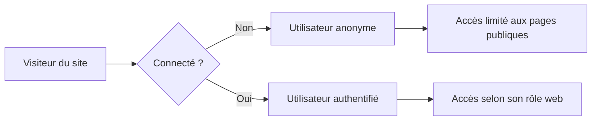

# Premier site Power Pages

## Objectifs pédagogiques

À l'issue de ce module, vous serez capables de :

1. **Créer** un site Power Pages depuis le portail maker et choisir un template adapté
2. **Naviguer** dans l'interface Studio pour repérer les zones de travail clés
3. **Modifier** une page existante : texte, image, section
4. **Configurer** les permissions de base pour contrôler qui voit quoi
5. **Publier** un site et comprendre la différence entre aperçu et mise en production

---

## Mise en situation

Votre équipe RH doit ouvrir un portail de candidature externe. Les candidats doivent pouvoir soumettre un formulaire, consulter les offres publiées et recevoir un accusé de réception automatique. Problème : vous n'avez pas d'équipe web, pas de serveur à configurer, et le projet doit être en ligne dans la semaine.

C'est exactement ce scénario pour lequel Power Pages a été conçu. Mais avant de brancher des formulaires Dataverse ou de gérer des flux Automate (ce que vous verrez dans le module suivant), il faut déjà savoir tenir debout : créer un site, comprendre où tout se passe, modifier une page, et appuyer sur "Publier" avec confiance.

Ce module couvre exactement ça — rien de plus, rien de moins.

---

## Créer son premier site : le point de départ

Tout commence sur [make.powerpages.microsoft.com](https://make.powerpages.microsoft.com). C'est le hub central de Power Pages, distinct de make.powerapps.com — ne pas les confondre.

À l'arrivée, vous voyez vos sites existants (ou aucun si c'est la première fois). Cliquez sur **+ Créer un site**. Power Pages vous propose alors deux voies :

**Les templates** — une dizaine de modèles préconstruits (portail d'employés, site associatif, portail de service client, etc.). Chaque template embarque une structure de pages, un thème visuel et parfois des composants Dataverse préconfigurés. Pour démarrer, c'est le choix le plus rapide.

**Site vide** — une page blanche avec les fondations minimales. À préférer si vous savez exactement ce que vous construisez et que vous ne voulez pas désassembler un template.

💡 Pour un premier projet, choisissez un template proche de votre besoin, même imparfait. Modifier un template existant est bien plus rapide que de construire from scratch — et vous apprenez l'interface en même temps.

Après avoir choisi votre template, Power Pages vous demande :

- **Un nom** pour le site (visible en interne)
- **Une URL** sous la forme `monsite.powerappsportals.com` (modifiable plus tard avec un domaine custom)
- **L'environnement Dataverse** cible — c'est ici que les données du site seront stockées

Le provisionnement prend environ 2 à 5 minutes. Power Pages crée automatiquement un ensemble de tables Dataverse de support, des rôles web, et une structure de navigation. Vous n'avez rien à faire pendant ce temps.

---

## L'interface Studio : s'y retrouver rapidement

Une fois le site créé, vous atterrissez dans le **Power Pages Studio**. C'est votre environnement de travail principal — pensez-y comme un éditeur de site web visuel, mais avec Dataverse en arrière-plan.

```
┌─────────────────────────────────────────────────────────┐
│  BARRE DU HAUT   [Pages] [Style] [Données] [Set up] ... │
├──────────┬──────────────────────────────────────────────┤
│          │                                              │
│  Panneau │         Zone d'aperçu / édition             │
│  gauche  │         (canvas de la page active)          │
│          │                                              │
│  (arbre  │                                              │
│  de nav) │                                              │
├──────────┴──────────────────────────────────────────────┤
│  [Aperçu]  [Sync config]  [Publier]                     │
└─────────────────────────────────────────────────────────┘
```

Voici les zones qui comptent vraiment au départ :

| Zone | À quoi elle sert | Ce qu'on y fait |
|---|---|---|
| **Pages** (onglet haut) | Gérer la structure du site | Ajouter, renommer, réordonner des pages |
| **Style** (onglet haut) | Thème visuel global | Couleurs, polices, boutons — tout le site d'un coup |
| **Set up** (onglet haut) | Configuration technique | Domaine, authentification, permissions |
| **Panneau gauche** | Arbre de navigation | Sélectionner la page à éditer |
| **Canvas central** | Édition visuelle | Cliquer sur un composant pour le modifier |
| **Bouton Publier** | Mise en ligne | Rend les modifications visibles aux visiteurs |

⚠️ Le bouton **Aperçu** et le bouton **Publier** ne font pas la même chose. L'aperçu vous montre le rendu dans votre navigateur, mais le site reste inchangé pour vos visiteurs. Publier, c'est la vraie mise en ligne. Ne confondez pas les deux en démo.

---

## Modifier une page : le b.a.-ba

Cliquez sur une page dans le panneau gauche — par exemple "Accueil". Le canvas affiche son contenu actuel. Pour modifier quoi que ce soit, cliquez directement dessus.

Power Pages structure les pages en **sections**, et chaque section contient des **composants** (texte, image, bouton, formulaire, liste...). L'analogie avec des blocs Lego est exacte : on empile des sections, on glisse des composants dedans.

### Modifier du texte

Cliquez sur un bloc de texte → il devient éditable directement. Un petit menu contextuel apparaît pour le formatage de base (gras, lien, alignement). Rien de surprenant si vous avez déjà utilisé un éditeur de page web.

### Ajouter une section

En bas de chaque section ou en haut de page, un bouton **+** permet d'insérer une nouvelle section. Vous choisissez une mise en page (1 colonne, 2 colonnes, bannière...) et vous la peuplez ensuite.

### Ajouter un composant

À l'intérieur d'une section, cliquez sur **+ Ajouter un composant**. Un panneau s'ouvre avec les types disponibles :

- Texte, image, bouton → composants simples
- Formulaire, liste → liés à Dataverse (module suivant)
- iFrame, code HTML → pour les cas avancés

💡 Si vous déplacez un composant d'une section à une autre par glisser-déposer et que ça ne fonctionne pas, essayez de le supprimer et de le recréer à l'emplacement voulu. Le drag-and-drop entre sections peut être capricieux.

### Modifier le thème visuel

Plutôt que de changer les couleurs composant par composant, allez dans l'onglet **Style**. Vous y définissez une palette de couleurs primaire/secondaire et une typographie qui s'appliquent à tout le site instantanément. C'est le bon endroit pour personnaliser l'identité visuelle — pas le canvas.

---

## Gérer les pages et la navigation

Un site, c'est rarement une seule page. Dans l'onglet **Pages**, vous voyez l'arbre complet de votre site. Quelques manipulations essentielles :

**Ajouter une page** — cliquez sur **+ Nouvelle page**. Vous pouvez partir d'un template de page (qui propose des mises en page prêtes) ou d'une page vide.

**Hiérarchiser les pages** — vous pouvez créer des sous-pages (page enfant sous une page parente). La navigation principale du site reflète automatiquement cette hiérarchie.

**Masquer une page** — utile si vous préparez une page sans la rendre visible. Dans les propriétés de la page (icône engrenage), décochez "Visible dans la navigation". La page existe mais n'apparaît pas dans le menu.

**Page d'accueil** — une seule page peut être désignée comme page d'accueil. Clic droit → "Définir comme page d'accueil".

---

## Les permissions : qui peut voir quoi

C'est le sujet que les débutants évitent et qui cause ensuite des problèmes. Prenez 5 minutes pour comprendre le modèle maintenant.

Power Pages distingue deux types d'utilisateurs :



**Utilisateur anonyme** — non connecté. Par défaut, il ne voit que les pages marquées comme publiques. Si votre portail est entièrement public (blog, vitrine), c'est suffisant.

**Utilisateur authentifié** — connecté via un fournisseur d'identité (Azure AD, LinkedIn, compte local...). Son accès est contrôlé par les **rôles web** (Web Roles).

### Les rôles web

Un rôle web est un groupe de permissions. Par défaut, deux rôles existent :

- **Anonymous Users** — ce que voient les visiteurs non connectés
- **Authenticated Users** — ce que voient les utilisateurs connectés (quel que soit leur profil)

Pour contrôler l'accès à une page, allez dans les **propriétés de la page** → onglet **Permissions**. Vous pouvez restreindre l'accès à un ou plusieurs rôles web.

🧠 À ce stade, retenez simplement que chaque page a des permissions, et que la page est soit publique, soit réservée aux connectés. Les rôles personnalisés (pour différencier les types d'utilisateurs connectés) sont une étape suivante — ne pas s'y attarder maintenant.

⚠️ Par défaut, une nouvelle page créée depuis un template peut être visible de tous. Vérifiez toujours les permissions d'une page avant de publier, surtout si elle contient des données sensibles.

---

## Publier le site

Vous avez modifié des pages, ajusté le thème, configuré la navigation. Maintenant vous voulez que vos utilisateurs voient le résultat.

Cliquez sur **Publier** en haut à droite du Studio. Une confirmation apparaît. Après quelques secondes, vos modifications sont en ligne.

Quelques points importants :

- **La publication est globale** — elle publie toutes les modifications en attente sur le site, pas seulement la page courante. Il n'y a pas de publication page par page.
- **L'URL de production** est celle en `.powerappsportals.com` (ou votre domaine custom si configuré). C'est cette URL que vous partagez à vos utilisateurs.
- **Pas de rollback automatique** — si vous publiez une erreur, vous devez la corriger dans le Studio et republier. Il n'y a pas de bouton "annuler la dernière publication".

💡 Pour tester avant de publier, utilisez le bouton **Aperçu** (l'icône œil). Il ouvre le site dans votre navigateur avec vos modifications non publiées, dans une session isolée. Vos utilisateurs ne voient pas cet aperçu.

---

## Cas réel : portail RH en 30 minutes

Voici comment ce module se traduit en pratique sur le scénario RH mentionné au départ.

**Étape 1 — Création (5 min)**
Sur make.powerpages.microsoft.com → Nouveau site → Template "Portail d'entreprise" → Nom "Portail RH Candidatures" → URL `rh-candidatures` → Environnement Production RH → Créer.

**Étape 2 — Structure des pages (10 min)**
Dans Pages : renommer "Home" en "Accueil", "About" en "Nos offres", supprimer les pages non pertinentes. Ajouter une page "Postuler" (vide pour l'instant). Réordonner : Accueil → Nos offres → Postuler.

**Étape 3 — Contenu de la page d'accueil (10 min)**
Cliquer sur la section bannière → modifier le titre en "Rejoignez notre équipe" → modifier le sous-titre → remplacer l'image par une photo corporate. Ajouter une section 2 colonnes avec un texte de présentation et les valeurs de l'entreprise.

**Étape 4 — Thème et identité visuelle (5 min)**
Onglet Style → appliquer les couleurs de la charte graphique de l'entreprise (hex primaire, secondaire) → choisir la police corporate.

**Étape 5 — Permissions (3 min)**
Page "Postuler" → Propriétés → Permissions : accès Tous (public). Page "Nos offres" → accès Tous (public). Pas de page restreinte pour l'instant.

**Étape 6 — Aperçu + Publication (2 min)**
Aperçu → vérification visuelle → Publier → partager l'URL à l'équipe RH pour validation.

Résultat : un site fonctionnel, en ligne, zéro infrastructure. La partie formulaire (pour "Postuler") sera traitée dans le module suivant.

---

## Bonnes pratiques

**Nommez vos pages de façon significative dès le début.** "Page 1", "Nouveau", "Test" deviennent illisibles quand vous avez 15 pages. Prenez l'habitude de donner des noms fonctionnels immédiatement.

**Ne publiez pas à chaque petite modification.** Accumulez vos changements, vérifiez en aperçu, puis publiez une fois. Moins de risques d'exposer un état intermédiaire.

**Le thème global avant les styles locaux.** Si vous commencez à changer les couleurs composant par composant et qu'on vous demande ensuite de changer la charte, vous allez souffrir. Définissez le thème en premier, touchez aux styles locaux en dernier recours.

**Vérifiez les permissions de chaque nouvelle page.** Réflexe simple : après avoir créé une page, ouvrez ses propriétés et confirmez que les permissions correspondent à l'intention. 30 secondes qui évitent des fuites de données.

**Testez sur mobile.** L'aperçu Studio est sur desktop. Les templates Power Pages sont responsive, mais certaines personnalisations peuvent casser l'affichage mobile. Ouvrez l'URL d'aperçu sur votre téléphone avant de publier.

---

## Résumé

Power Pages permet de créer un site web professionnel connecté à Dataverse sans écrire une ligne de code serveur. Depuis make.powerpages.microsoft.com, on choisit un template, on nomme le site et on le rattache à un environnement Dataverse — le provisionnement prend moins de 5 minutes. Le Studio offre trois zones principales : les pages (structure), le style (thème global) et le canvas (édition visuelle directe). Chaque page est composée de sections et de composants modifiables par clic. Les permissions contrôlent l'accès page par page, avec une distinction fondamentale entre utilisateurs anonymes et authentifiés. La publication est globale et immédiate, sans rollback — d'où l'importance de valider en aperçu avant. À ce stade, le site est une coquille structurée et publiée ; l'étape suivante consiste à y brancher des données réelles via les formulaires et listes Dataverse.

---

<!-- snippet
id: powerpages_site_creation
type: tip
tech: power-pages
level: beginner
importance: high
format: knowledge
tags: power-pages, creation, template, environnement, dataverse
title: Créer un site Power Pages depuis le hub maker
content: "Sur make.powerpages.microsoft.com → + Créer un site → choisir un template ou site vide → saisir un nom, une URL et sélectionner l'environnement Dataverse cible → provisionnement automatique en 2 à 5 min. L'environnement choisi détermine où les données du site seront stockées — il ne peut pas être changé après création."
description: "Le hub Power Pages est distinct de make.powerapps.com. L'environnement Dataverse est fixé à la création — choisir le bon dès le départ."
-->

<!-- snippet
id: powerpages_apercu_vs_publication
type: warning
tech: power-pages
level: beginner
importance: high
format: knowledge
tags: power-pages, publication, apercu, studio
title: Aperçu ≠ Publication dans Power Pages Studio
content: "Piège : cliquer sur Aperçu (icône œil) ouvre le site dans le navigateur avec vos modifications, mais vos visiteurs ne voient rien. Seul le bouton Publier rend les changements visibles en production. La publication est globale : elle pousse toutes les modifications en attente, pas seulement la page courante."
description: "Confondre aperçu et publication est l'erreur #1 en démo. Le bouton Publier est irréversible — pas de rollback automatique."
-->

<!-- snippet
id: powerpages_permissions_page
type: concept
tech: power-pages
level: beginner
importance: high
format: knowledge
tags: power-pages, permissions, roles, securite, anonymous
title: Modèle de permissions Power Pages : anonyme vs authentifié
content: "Chaque page a ses propres permissions. Deux rôles existent par défaut : 'Anonymous Users' (visiteurs non connectés) et 'Authenticated Users' (connectés). Pour restreindre une page : Propriétés de la page → onglet Permissions → décocher 'Anonymous Users'. Une nouvelle page créée depuis un template peut être publique par défaut — toujours vérifier avant de publier."
description: "Les permissions sont par page, pas par site. Une page non restreinte est accessible à tous, même sans connexion."
-->

<!-- snippet
id: powerpages_theme_global
type: tip
tech: power-pages
level: beginner
importance: medium
format: knowledge
tags: power-pages, style, theme, design, charte
title: Définir le thème visuel global avant tout style local
content: "Dans Power Pages Studio, onglet Style permet de définir couleurs (hex primaire/secondaire) et polices pour tout le site en une fois. À faire en premier, avant toute personnalisation composant par composant. Si vous customisez les couleurs localement puis changez la charte ensuite, chaque composant sera à reprendre manuellement."
description: "Le thème global s'applique instantanément à tous les composants. Les styles locaux écrasent le thème — les utiliser en dernier recours seulement."
-->

<!-- snippet
id: powerpages_page_masquee
type: tip
tech: power-pages
level: beginner
importance: medium
format: knowledge
tags: power-pages, navigation, page, visibilite, menu
title: Masquer une page de la navigation sans la supprimer
content: "Pour préparer une page sans la rendre visible dans le menu : dans l'arbre Pages, clic sur l'icône engrenage de la page → décocher 'Visible dans la navigation'. La page existe, est accessible via son URL directe, mais n'apparaît pas dans le menu du site. Utile pour des pages en cours de construction ou des pages d'atterrissage cachées."
description: "Une page masquée de la navigation reste accessible par URL directe. Ce n'est pas une mesure de sécurité — utiliser les permissions pour ça."
-->

<!-- snippet
id: powerpages_publication_globale
type: warning
tech: power-pages
level: beginner
importance: high
format: knowledge
tags: power-pages, publication, workflow, production
title: La publication Power Pages est globale et sans rollback
content: "Piège : il n'existe pas de publication page par page. Publier pousse toutes les modifications en attente sur l'ensemble du site. Il n'y a pas de bouton 'annuler la dernière publication' — pour corriger, il faut modifier dans le Studio et republier. Bonne pratique : accumuler les changements, valider en aperçu, puis publier une seule fois."
description: "Chaque publication expose immédiatement l'état complet du site. Toujours passer par l'aperçu avant de publier en production."
-->

<!-- snippet
id: powerpages_structure_section_composant
type: concept
tech: power-pages
level: beginner
importance: medium
format: knowledge
tags: power-pages, studio, section, composant, canvas
title: Structure d'une page Power Pages : sections et composants
content: "Une page Power Pages est composée de sections (blocs de mise en page : 1 colonne, 2 colonnes, bannière...) qui contiennent des composants (texte, image, bouton, formulaire, liste...). Pour ajouter : cliquer sur le + entre deux sections pour une nouvelle section, puis + Ajouter un composant à l'intérieur. Le drag-and-drop entre sections peut être instable — préférer supprimer/recréer si ça bloque."
description: "Section = conteneur de mise en page. Composant = élément de contenu. Impossible d'ajouter un composant hors d'une section."
-->

<!-- snippet
id: powerpages_url_provisioning
type: concept
tech: power-pages
level: beginner
importance: low
format: knowledge
tags: power-pages, url, domaine, environnement, creation
title: URL par défaut et domaine custom dans Power Pages
content: "À la création, l'URL du site est de la forme monsite.powerappsportals.com. Cette URL est fonctionnelle immédiatement. Un domaine personnalisé (ex: portail.monentreprise.com) peut être configuré après coup dans Set up → Domaine personnalisé. L'URL .powerappsportals.com reste active en parallèle sauf désactivation manuelle."
description: "L'URL .powerappsportals.com est permanente même après ajout d'un domaine custom. Penser à la désactiver si vous ne voulez pas deux points d'entrée."
-->
