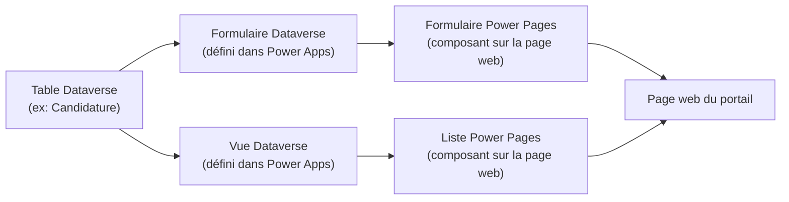
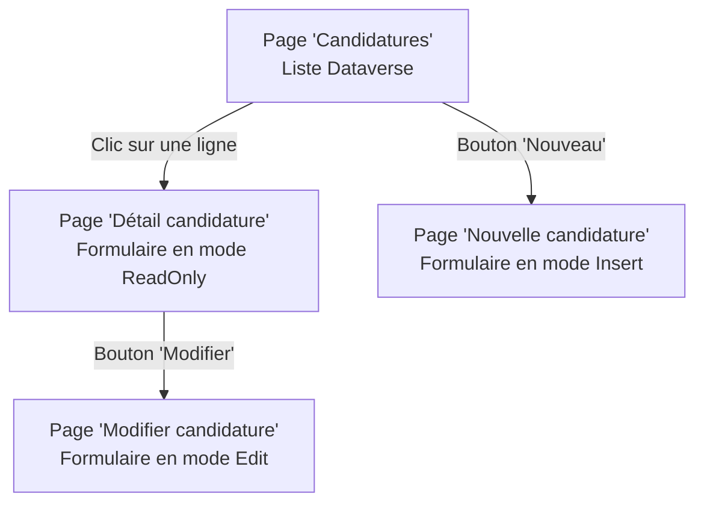

## Objectifs pédagogiques

À l'issue de ce module, vous serez capable de :

1. **Distinguer** un formulaire Dataverse d'une liste Dataverse dans le contexte d'un portail Power Pages
2. **Ajouter** un formulaire sur une page web pour permettre à un visiteur de créer ou modifier un enregistrement
3. **Configurer** une liste pour afficher des données Dataverse sous forme tabulaire sur un portail
4. **Paramétrer** les options essentielles (colonnes visibles, filtres, actions disponibles) sans toucher au code
5. **Identifier** les erreurs de configuration les plus courantes et savoir les corriger

---

## Mise en situation

Vous travaillez pour une association qui gère des demandes de bénévolat. Jusqu'ici, les candidats remplissaient un formulaire Google Forms, les données atterrissaient dans un tableur, et quelqu'un recopiait manuellement tout ça dans Dataverse chaque semaine.

L'objectif : créer un portail Power Pages où les candidats s'inscrivent directement, leurs données vont dans Dataverse en temps réel, et les responsables voient la liste des candidatures depuis le même portail.

Deux composants vous permettent de faire ça sans écrire une seule ligne de code backend : les **formulaires Dataverse** et les **listes Dataverse**.

---

## Pourquoi ces deux composants existent

Dans le module précédent, vous avez créé votre premier site Power Pages et compris comment structurer des pages. Maintenant, il faut relier ces pages à vos données.

Power Pages ne stocke pas de données en propre. Il affiche et collecte des données qui vivent dans **Dataverse** — la base de données de la Power Platform. Pour exposer ces données sur une page web, vous avez deux outils complémentaires :

| Composant | Ce qu'il fait | Cas d'usage typique |
|---|---|---|
| **Formulaire Dataverse** | Affiche un formulaire lié à une table Dataverse | Créer ou modifier un enregistrement |
| **Liste Dataverse** | Affiche les enregistrements d'une table sous forme de tableau | Consulter, filtrer, naviguer dans des données |

Ce n'est pas l'un ou l'autre — dans la plupart des scénarios réels, vous les utilisez ensemble. La liste affiche les candidatures existantes, le formulaire permet d'en créer une nouvelle ou d'en modifier une.

🧠 **Concept clé** — Ces composants s'appuient sur les **formulaires et vues** que vous avez définis dans Dataverse (via Power Apps). Power Pages ne recrée pas ses propres structures : il réutilise ce qui existe déjà. Si vous n'avez pas configuré de formulaire côté Dataverse, vous ne pourrez pas l'exposer dans le portail.

---

## Comprendre la dépendance à Dataverse

Avant de manipuler quoi que ce soit dans Power Pages Studio, il faut avoir en tête cette chaîne :

Un **formulaire Power Pages** pointe vers un formulaire Dataverse existant. Une **liste Power Pages** pointe vers une vue Dataverse existante. Ces éléments côté Dataverse (formulaires et vues) se configurent dans Power Apps Maker Portal — pas dans Power Pages.

💡 **Astuce** — Si vous partez de zéro, commencez par créer votre table Dataverse, définissez au moins un formulaire et une vue dans Power Apps, *puis* venez dans Power Pages. Essayer de faire l'inverse crée de la frustration inutile.

---

## Ajouter un formulaire sur une page

### Sélectionner le composant

Dans Power Pages Studio, ouvrez la page où vous voulez ajouter le formulaire. Cliquez sur le signe **+** dans la zone de contenu, puis choisissez **Form** dans la liste des composants disponibles.

Un panneau de configuration s'ouvre sur la droite. C'est ici que tout se joue.

### Configurer le formulaire étape par étape

**1. Choisir la table**
Sélectionnez la table Dataverse concernée (ex : `cr123_candidature`). Power Pages liste toutes les tables auxquelles il a accès dans votre environnement.

**2. Choisir le formulaire Dataverse**
Une fois la table sélectionnée, vous choisissez quel formulaire utiliser. Si votre table a plusieurs formulaires (un pour la création, un pour la consultation), vous choisissez celui adapté à votre page.

**3. Définir le mode**
C'est probablement le paramètre le plus important :

| Mode | Comportement |
|---|---|
| **Insert** | Le formulaire crée un nouvel enregistrement |
| **Edit** | Le formulaire modifie un enregistrement existant (nécessite un ID) |
| **ReadOnly** | Le formulaire affiche un enregistrement sans permettre de modification |

Pour un formulaire d'inscription public, vous utiliserez **Insert**.

**4. Configurer la redirection après soumission**
Une fois le formulaire soumis, vers où va l'utilisateur ? Vous pouvez rediriger vers une autre page du portail (ex : une page "Merci pour votre candidature") ou afficher un message de confirmation directement.

⚠️ **Erreur fréquente** — Laisser la redirection vide. Sans redirection configurée, après soumission le formulaire reste affiché avec les données effacées, ce qui désoriente l'utilisateur et l'incite à re-soumettre. Configurez toujours une action post-soumission explicite.

### Ce que vous voyez dans le rendu

Le formulaire affiché sur la page reprend la mise en forme définie dans le formulaire Dataverse : ordre des champs, libellés, champs obligatoires. Vous ne redéfinissez pas tout ça dans Power Pages — vous héritez de ce qui a été configuré dans Dataverse.

---

## Ajouter une liste sur une page

### Le concept d'une liste

Une liste Power Pages, c'est un tableau de données connecté en direct à Dataverse. Elle affiche les enregistrements d'une vue Dataverse — avec les colonnes que cette vue expose, dans l'ordre où elles sont définies.

Contrairement au formulaire, la liste ne s'adresse pas à un seul enregistrement. Elle donne une vision d'ensemble, et peut proposer des actions sur chaque ligne (voir le détail, modifier, supprimer).

### Ajouter et configurer

Depuis la page cible dans Power Pages Studio : **+** → **List**.

Le panneau de configuration vous demande :

**La table et la vue**
Choisissez la même table que votre formulaire, puis sélectionnez la vue Dataverse à utiliser. La vue détermine quelles colonnes sont affichées et dans quel ordre. Si vous voulez moins de colonnes qu'il n'en apparaît, modifiez la vue côté Dataverse — pas côté Power Pages.

**Les actions disponibles**
Vous pouvez activer plusieurs types d'actions sur la liste :

| Action | Effet |
|---|---|
| **Create** | Affiche un bouton "Nouveau" qui ouvre un formulaire de création |
| **View** | Permet de cliquer sur une ligne pour voir le détail |
| **Edit** | Permet de cliquer sur une ligne pour la modifier |
| **Delete** | Ajoute une option de suppression par ligne |

Pour une liste publique en lecture seule (ex : agenda d'événements), activez uniquement **View**. Pour un espace de gestion interne, vous activerez **Edit** et **Delete**.

**La pagination**
Vous pouvez définir le nombre de lignes par page (10, 25, 50…). Au-delà du nombre défini, des boutons de navigation apparaissent automatiquement.

### Lier liste et formulaire

Quand vous activez **View** ou **Edit** sur la liste, Power Pages vous demande vers quel formulaire diriger l'utilisateur. C'est là que vous créez le lien entre les deux composants : la liste affiche les données en survol, le formulaire prend le relais pour le détail ou la modification.

Cette navigation se configure entièrement dans les paramètres de la liste, sans code.

---

## Construction progressive

### Version 1 — Fonctionnel minimal

Pour valider que le circuit fonctionne :

1. Une table Dataverse avec 3-4 colonnes simples (Nom, Prénom, Email, Date)
2. Un formulaire Dataverse en mode **Insert** sur une page `/inscription`
3. Une liste Dataverse sur une page `/candidatures` avec seulement **View** activé

À ce stade, n'importe qui peut s'inscrire et voir la liste. La sécurité n'est pas encore en place — c'est volontaire pour cette version de test.

### Version 2 — Expérience utilisateur soignée

- Ajouter une page de confirmation après soumission du formulaire
- Configurer la pagination à 25 lignes sur la liste
- Ajouter un filtre sur la vue Dataverse (ex : n'afficher que les candidatures de l'année en cours)
- Activer **Edit** sur la liste pour que les responsables puissent corriger des données

💡 **Astuce** — Pour filtrer les données affichées dans une liste, modifiez les critères de filtrage dans la **vue Dataverse** plutôt que de chercher une option de filtre dans Power Pages. Power Pages affiche exactement ce que la vue Dataverse lui donne.

### Version 3 — Prête pour la production

La sécurité (qui peut voir quoi, qui peut modifier) est traitée dans le module suivant via les web roles et les table permissions. À ce stade, c'est ce qui transforme un formulaire accessible à tous en un formulaire accessible aux bonnes personnes uniquement.

---

## Cas réel — Gestion de tickets support

Une entreprise de distribution utilise Power Pages pour son portail clients. Les clients peuvent y déposer des tickets de support directement depuis leur espace.

**Setup mis en place :**
- Table Dataverse `Ticket` avec colonnes : Objet, Description, Priorité, Statut, Client (lookup vers la table Contact)
- Formulaire en mode **Insert** sur la page `/nouveau-ticket`
- Formulaire en mode **ReadOnly** sur la page `/detail-ticket`
- Liste sur la page `/mes-tickets` affichant uniquement les tickets du client connecté (via filtrage sur la vue Dataverse)

Le résultat : les tickets créés via le portail apparaissent instantanément dans Dataverse, où les agents support les traitent via une application Power Apps. Le client voit l'avancement en temps réel sur la liste, sans que personne n'ait besoin de synchroniser quoi que ce soit manuellement.

---

## Bonnes pratiques

**Côté structure**
- Créez une page dédiée par formulaire. Evitez de mettre deux formulaires sur la même page — la gestion de la redirection devient vite confuse.
- Nommez vos formulaires Dataverse de façon explicite dès le début (`Formulaire inscription public`, `Formulaire modification admin`). Quand vous en avez cinq, vous êtes content de ne pas avoir à ouvrir chacun pour savoir lequel utiliser.

**Côté données**
- Ne jamais exposer une vue Dataverse qui contient plus de colonnes que nécessaire. Chaque colonne visible est une information potentiellement visible par un utilisateur non autorisé.
- Testez toujours en mode navigation privée pour simuler l'expérience d'un utilisateur non connecté.

**Côté formulaires**
- Définissez les champs obligatoires côté Dataverse (au niveau de la colonne), pas seulement côté formulaire. Ça garantit l'intégrité des données même si quelqu'un contourne le formulaire web.
- Pour les formulaires en mode **Edit**, vérifiez que l'enregistrement cible est bien passé en paramètre d'URL. Sans ça, le formulaire ne sait pas quoi charger et affiche une erreur.

---

## Résumé

| Concept | Définition courte | À retenir |
|---|---|---|
| Formulaire Dataverse (Power Pages) | Composant qui expose un formulaire Dataverse sur une page web | Pointe vers un formulaire existant dans Dataverse, pas une création from scratch |
| Liste Dataverse (Power Pages) | Composant qui affiche les enregistrements d'une vue Dataverse | La mise en forme (colonnes, filtres) se contrôle côté vue Dataverse |
| Mode Insert | Le formulaire crée un nouvel enregistrement | Cas standard pour les formulaires publics d'inscription |
| Mode Edit | Le formulaire modifie un enregistrement existant | Requiert que l'ID de l'enregistrement soit passé en paramètre |
| Mode ReadOnly | Le formulaire affiche sans permettre la modification | Idéal pour les pages de détail |
| Vue Dataverse | Définition des colonnes et filtres utilisée par la liste | C'est ici que vous contrôlez ce qui est affiché, pas dans Power Pages |

**En une phrase :** les formulaires et listes Power Pages ne sont pas des composants autonomes — ils sont des fenêtres sur vos formulaires et vues Dataverse, et c'est là que se configure l'essentiel de leur comportement.

---

<!-- snippet
id: powerpages_form_modes_concept
type: concept
tech: Power Pages
level: beginner
importance: high
format: knowledge
tags: power pages, dataverse, formulaire, mode, insert
title: Les 3 modes d'un formulaire Dataverse dans Power Pages
content: Un formulaire Power Pages fonctionne dans 3 modes exclusifs : Insert (crée un nouvel enregistrement), Edit (modifie un enregistrement existant — l'ID doit être passé en paramètre d'URL), ReadOnly (affiche sans modification possible). Le mode se choisit dans la configuration du composant et détermine le comportement complet du formulaire.
description: Le mode Insert est le cas public standard. Edit requiert un ID en paramètre. ReadOnly pour les pages de détail. Un mauvais choix de mode est l'erreur de config la plus fréquente.
-->

<!-- snippet
id: powerpages_form_redirect_warning
type: warning
tech: Power Pages
level: beginner
importance: high
format: knowledge
tags: power pages, formulaire, soumission, redirection, ux
title: Toujours configurer une redirection après soumission de formulaire
content: Piège : laisser la redirection vide après soumission. Conséquence : le formulaire se réaffiche vide après envoi, l'utilisateur croit que ça n'a pas fonctionné et re-soumet — vous obtenez des doublons dans Dataverse. Correction : configurez systématiquement une page de confirmation ou un message explicite dans les paramètres du composant Form.
description: Sans redirection post-soumission, les utilisateurs re-soumettent et créent des doublons dans Dataverse. Toujours configurer une action explicite après envoi.
-->

<!-- snippet
id: powerpages_list_view_source
type: concept
tech: Power Pages
level: beginner
importance: high
format: knowledge
tags: power pages, liste, vue dataverse, colonnes, filtre
title: Une liste Power Pages affiche exactement ce que la vue Dataverse lui donne
content: Les colonnes affichées, leur ordre et les filtres actifs d'une liste Power Pages sont définis dans la vue Dataverse correspondante — pas dans Power Pages Studio. Pour modifier ce qui apparaît dans la liste, il faut modifier la vue côté Power Apps Maker Portal. Power Pages n'a pas d'option pour masquer des colonnes ou ajouter des filtres indépendamment de la vue source.
description: Modifier les colonnes ou filtres d'une liste = modifier la vue Dataverse dans Power Apps. Power Pages affiche exactement ce que la vue lui transmet, sans configuration supplémentaire possible.
-->

<!-- snippet
id: powerpages_form_list_dependency
type: concept
tech: Power Pages
level: beginner
importance: high
format: knowledge
tags: power pages, dataverse, formulaire, vue, dépendance
title: Formulaires et listes Power Pages dépendent de Dataverse en amont
content: Un formulaire Power Pages requiert un formulaire Dataverse existant (configuré dans Power Apps). Une liste Power Pages requiert une vue Dataverse existante. Ces éléments doivent être créés côté Dataverse avant d'être exposés dans Power Pages. Tenter d'ajouter le composant sans la source Dataverse correspondante provoque une liste vide de sélection dans le configurateur.
description: Toujours créer le formulaire ou la vue dans Dataverse/Power Apps avant d'ajouter le composant dans Power Pages Studio. L'ordre compte.
-->

<!-- snippet
id: powerpages_list_actions_config
type: tip
tech: Power Pages
level: beginner
importance: medium
format: knowledge
tags: power pages, liste, actions, create, edit, delete
title: Activer uniquement les actions nécessaires sur une liste Power Pages
content: Dans la config d'une liste, activez uniquement les actions utiles : Create (ajoute un bouton Nouveau), View (clic sur ligne → détail), Edit (clic sur ligne → modification), Delete (suppression par ligne). Pour une liste publique en lecture seule, n'activez que View. Activer Edit ou Delete sans sécurité en place expose toutes les données à modification par n'importe quel visiteur.
description: Chaque action activée sur une liste augmente l'exposition des données. N'activer Create/Edit/Delete qu'après avoir configuré les permissions (module suivant).
-->

<!-- snippet
id: powerpages_mandatory_fields_dataverse
type: tip
tech: Power Pages
level: beginner
importance: medium
format: knowledge
tags: power pages, dataverse, champs obligatoires, intégrité, validation
title: Définir les champs obligatoires au niveau de la colonne Dataverse, pas du formulaire
content: La validation "champ requis" peut être définie dans le formulaire Dataverse OU au niveau de la colonne Dataverse (propriété Required). Préférez la colonne : cette contrainte s'applique quelle que soit la voie d'entrée des données (portail, API, Power Apps). Une validation uniquement dans le formulaire Power Pages peut être contournée par un appel direct à l'API Dataverse.
description: Champs obligatoires = les définir sur la colonne Dataverse, pas seulement dans le formulaire Power Pages. Garantit l'intégrité des données indépendamment de l'interface utilisée.
-->

<!-- snippet
id: powerpages_edit_form_id_param
type: warning
tech: Power Pages
level: beginner
importance: high
format: knowledge
tags: power pages, formulaire, mode edit, paramètre url, id
title: Formulaire en mode Edit — l'ID de l'enregistrement doit être passé en paramètre URL
content: Piège : configurer un formulaire en mode Edit sans mécanisme pour transmettre l'ID de l'enregistrement à modifier. Conséquence : le formulaire se charge vide ou en erreur car il ne sait pas quel enregistrement cibler. Correction : utiliser le lien "Edit" depuis une liste Power Pages (qui passe automatiquement l'ID), ou construire manuellement l'URL avec le paramètre ?id={recordId}.
description: Un formulaire en mode Edit sans ID passé en paramètre d'URL s'affiche vide ou en erreur. L'ID doit transiter via la liste ou l'URL de navigation.
-->

<!-- snippet
id: powerpages_private_navigation_test
type: tip
tech: Power Pages
level: beginner
importance: medium
format: knowledge
tags: power pages, test, navigation privée, permissions, utilisateur anonyme
title: Tester un portail Power Pages en navigation privée pour simuler un anonyme
content: Pour vérifier ce qu'un visiteur non connecté voit réellement sur votre portail, ouvrez l'URL du site en navigation privée (Ctrl+Shift+N sur Chrome/Edge). Vous simulez exactement l'expérience d'un utilisateur sans session active. Tester depuis votre session normale vous affiche potentiellement plus de données que prévu car vous êtes authentifié en tant qu'administrateur.
description: Navigation privée = seul moyen fiable de tester l'expérience visiteur anonyme sur Power Pages. La session admin cache les restrictions de permissions.
-->
