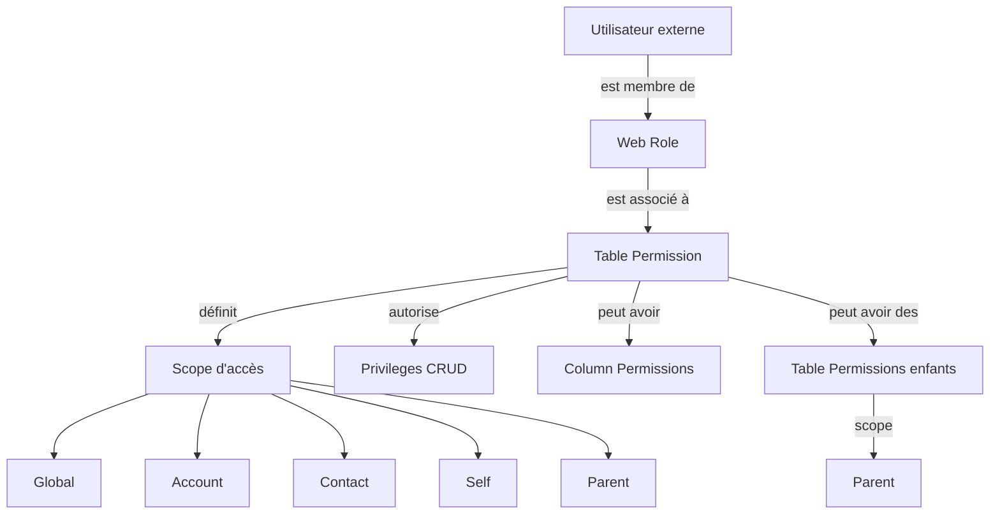

# Sécurité Power Pages : web roles et table permissions

## Objectifs pédagogiques

À l'issue de ce module, vous serez capable de :

1. **Identifier** les configurations d'accès aux données qui exposent un portail Power Pages à une fuite de données
2. **Diagnostiquer** une chaîne de permissions cassée entre web roles, table permissions et column permissions
3. **Analyser** l'impact d'un accès anonyme mal configuré sur des tables Dataverse sensibles
4. **Détecter** les erreurs fréquentes de configuration qui laissent des enregistrements accessibles sans authentification
5. **Valider** qu'une configuration de table permissions respecte le principe de moindre privilège

---

## Mise en situation

En 2023, un cabinet de conseil déploie un portail partenaire sur Power Pages pour permettre à ses clients externes de consulter leurs devis et contrats. Le portail est livré rapidement. Deux semaines après le go-live, un partenaire remarque qu'en modifiant manuellement un GUID dans l'URL de consultation d'un devis, il accède aux devis d'un autre client.

Le diagnostic révèle la configuration suivante : la table `Devis` dispose d'une table permission de type **Global Access** attachée au web role `Authenticated Users`. Résultat : tout utilisateur authentifié peut lire l'intégralité des enregistrements de la table, quel que soit le propriétaire ou le compte associé. Le portail n'avait pas de test de sécurité — l'équipe avait vérifié que les boutons "Créer" et "Modifier" étaient invisibles pour les mauvais profils, mais avait oublié que la visibilité UI ne remplace pas une restriction de données.

Ce module traite exactement ce scénario : comment le modèle de permissions Power Pages fonctionne, où il casse, et comment le diagnostiquer.

---

## Surface d'attaque

Power Pages expose des données Dataverse à des utilisateurs externes — authentifiés ou non. La surface d'attaque n'est pas l'interface graphique du portail, c'est le moteur de données derrière.

| Vecteur | Exposition | Impact potentiel |
|---|---|---|
| Table permission manquante | La table est accessible en lecture/écriture à tous par défaut | Lecture ou modification de tous les enregistrements |
| Scope `Global Access` sur rôle authenticated | Tout utilisateur connecté accède à tous les enregistrements de la table | Accès croisé entre comptes (IDOR) |
| Accès anonyme activé sans restriction de scope | Tout visiteur non authentifié lit les données | Fuite publique sans authentification |
| Column permission absente | Les colonnes sensibles (IBAN, contrat signé, SSN) remontent dans les réponses API | Exfiltration sélective de données |
| Web role manquant sur une liste ou un formulaire | Le composant renvoie des données car la table permission autorise le rôle parent | Contournement du contrôle UI |
| API OData du portail accessible directement | Les endpoints `/_api/` sont interrogeables sans passer par les pages | Extraction en masse via script |

🧠 **Concept clé** — La sécurité Power Pages est **additive** par défaut côté table permissions : sans permission configurée, l'accès est refusé. Mais dès qu'une permission trop large est créée, elle s'applique à tous les utilisateurs porteurs du web role concerné, sans distinction d'enregistrement.

---

## Mécanisme d'attaque

### Comment un attaquant raisonne face à un portail Power Pages

Un portail Power Pages expose nativement une API OData sur le chemin `/_api/` (anciennement `/_odata/`). Ce endpoint est la même surface que celle utilisée par les listes et formulaires pour charger les données — il n'est pas réservé aux développeurs.

Un attaquant authentifié sur le portail (parfois avec un compte créé librement si l'inscription est ouverte) peut tenter :

```
GET https://monportail.powerappsportals.com/_api/devis
```

Si la table permission est configurée avec un scope **Global Access**, la réponse retourne tous les enregistrements de la table `Devis` sous forme JSON. Aucune manipulation sophistiquée — juste un appel HTTP direct avec le cookie de session.

L'étape suivante consiste à énumérer les colonnes disponibles, identifier celles qui contiennent des données sensibles, et filtrer :

```
GET /_api/devis?$select=montant,nomclient,statut&$top=1000
```

🔴 **Vecteur d'attaque** — Le portail est un proxy vers Dataverse. Si les table permissions autorisent un scope trop large, l'API OData devient un extracteur de données en masse. Aucun outil spécialisé requis — un navigateur suffit pour les premières requêtes, Postman ou un script Python pour l'extraction.

---

## Architecture du modèle de sécurité

### Les trois couches à comprendre



Ces trois couches sont **indépendantes et cumulatives** — une erreur sur l'une d'elles suffit à ouvrir l'accès.

### Web Roles

Un web role est un groupe logique assigné aux contacts du portail. Deux web roles existent par défaut :

- **Anonymous Users** — tout visiteur non authentifié
- **Authenticated Users** — tout utilisateur connecté, quel que soit son compte

⚠️ **Erreur fréquente** — Beaucoup de configurations accordent des table permissions directement au rôle `Authenticated Users`. C'est la bonne approche pour des données publiques à tous les inscrits, mais catastrophique pour des données cloisonnées par compte ou par contact.

Vous pouvez créer des web roles personnalisés (ex. : `Partenaire Gold`, `Revendeur`, `Employé interne`) et les assigner manuellement ou via un flow Power Automate lors de l'inscription.

### Table Permissions

Une table permission connecte un web role à une table Dataverse et définit :

1. **Le scope** — qui peut accéder à quels enregistrements
2. **Les privileges** — lecture, création, mise à jour, suppression, ajout (append/appendTo)

Les scopes disponibles :

| Scope | Qui peut lire quoi |
|---|---|
| **Global** | Tous les enregistrements de la table, sans filtre |
| **Account** | Enregistrements liés au compte (Account) de l'utilisateur connecté |
| **Contact** | Enregistrements liés au contact de l'utilisateur connecté |
| **Self** | Uniquement l'enregistrement contact de l'utilisateur lui-même |
| **Parent** | Enregistrements liés à un enregistrement parent (table permissions enfant) |

🧠 **Concept clé** — Le scope `Global` est légitime pour des tables de référence (pays, catégories de produits). Il est dangereux pour toute table contenant des données métier cloisonnées par client.

---

## Diagnostic : identifier une configuration vulnérable

### Checklist de diagnostic

Voici la séquence de vérification à appliquer sur tout portail Power Pages avant mise en production ou audit.

**Étape 1 — Inventaire des table permissions actives**

Dans le portail [Power Pages Management](https://make.powerpages.microsoft.com), accédez à :

```
Security → Table Permissions
```

Pour chaque permission listée, noter : la table, le web role associé, le scope, et les privileges cochés.

**Étape 2 — Identifier les permissions à scope Global**

Filtrer sur `Access Type = Global`. Chaque entrée est un candidat à la fuite de données si le web role associé est `Authenticated Users` ou `Anonymous Users`.

```
Table Permissions → Filter by Access Type: Global
→ Vérifier : Web Role = Authenticated Users ou Anonymous Users ?
→ Si oui et table métier → risque IDOR confirmé
```

**Étape 3 — Vérifier les permissions Anonymous**

Toute table permission associée au rôle `Anonymous Users` est accessible sans authentification. Acceptable uniquement pour des données publiques (ex. : catalogue produits public, FAQ).

**Étape 4 — Vérifier la hiérarchie Parent**

Les table permissions enfants héritent du scope de leur parent. Une permission enfant avec scope `Parent` et privilege `Read` donne accès à tous les enregistrements enfants liés à l'enregistrement parent auquel l'utilisateur a accès. Si le parent a un scope `Global`, les enfants le suivent.

**Étape 5 — Tester l'API OData directement**

Après s'être connecté avec un compte test, effectuer une requête GET sur l'API du portail :

```
GET https://<PORTAIL>.powerappsportals.com/_api/<NOM_TABLE_LOGIQUE>
Authorization: (cookie de session du navigateur)
```

Si la réponse contient des enregistrements d'autres comptes → scope trop large confirmé.

💡 **Astuce** — Pour récupérer le nom logique d'une table Dataverse, aller dans `make.powerapps.com → Tables → [table] → Paramètres → Nom logique`. Le nom logique est celui utilisé dans les URL OData.

---

## Contrôles de détection

### Ce que les logs révèlent

Power Pages n'expose pas de logs de sécurité granulaires nativement dans l'interface. Les vecteurs de détection disponibles :

**Azure Application Insights** (si configuré sur le portail) :

- Surveiller les requêtes `/_api/` avec un nombre de résultats élevé (`$top=1000` ou absence de `$filter`)
- Détecter les patterns d'énumération : mêmes paramètres GET répétés avec des GUIDs différents
- Alerter sur les appels API depuis des IP inattendues

**Dataverse Audit Logs** :

```
Power Platform Admin Center → Environments → [env] → Audit → Audit Logs
→ Filtrer : Action = Read, Entity = [table sensible]
→ Identifier : volumes anormaux, users inhabituels
```

🔒 **Contrôle de sécurité** — Activer l'audit Dataverse sur toutes les tables exposées par le portail. Le coût en stockage est marginal ; la visibilité sur les accès en lecture est la seule façon de détecter une extraction silencieuse.

**Microsoft Sentinel** (si déployé) :

Les logs Dataverse sont intégrables via le connecteur Microsoft Sentinel pour Power Platform. Une règle d'alerte sur un volume de lectures anormal par un même contact portal en moins de 5 minutes est un signal de détection réaliste.

---

## Tests de sécurité

### Valider la configuration avant go-live

Ces tests sont à exécuter avec deux comptes distincts sur le portail : `contact_A` (appartenant au compte `Compte_Alpha`) et `contact_B` (appartenant au compte `Compte_Beta`).

**Test 1 — Isolation des enregistrements (anti-IDOR)**

1. Connecté en tant que `contact_A`, créer un enregistrement (ex. : une demande)
2. Récupérer le GUID de cet enregistrement (visible dans l'URL ou via `/_api/`)
3. Se connecter en tant que `contact_B`
4. Appeler directement :

```
GET /_api/<table>(<GUID_ENREGISTREMENT_A>)
```

- ✅ Attendu : réponse `403 Forbidden` ou `404 Not Found`
- ❌ Problème : réponse `200 OK` avec les données → IDOR confirmé, scope trop large

**Test 2 — Accès anonyme aux tables métier**

Sans être connecté (mode navigation privée), appeler :

```
GET https://<PORTAIL>.powerappsportals.com/_api/<table_sensible>
```

- ✅ Attendu : `403 Forbidden`
- ❌ Problème : données retournées → table permission Anonymous trop large

**Test 3 — Colonnes sensibles dans les réponses**

Connecté en tant qu'utilisateur standard, appeler l'API sans `$select` :

```
GET /_api/<table>?$top=1
```

Inspecter la réponse JSON : est-ce que des colonnes non nécessaires (montants, identifiants tiers, champs internes) remontent ? Si oui → column permissions à configurer.

**Test 4 — Élévation de privilege via web role**

Vérifier qu'un utilisateur sans web role personnalisé ne peut pas accéder aux fonctionnalités réservées :

1. Créer un contact sans web role `Partenaire Gold`
2. Naviguer vers les pages réservées à ce rôle
3. Tenter d'appeler directement l'API des tables protégées par ce rôle

---

## Cas réel en entreprise

### Portail de self-service RH — accès croisé entre employés

Une entreprise industrielle déploie un portail Power Pages pour permettre à ses 2 000 employés de consulter leurs bulletins de paie dématérialisés. Les bulletins sont stockés dans une table Dataverse `Bulletin` avec une colonne de lookup vers la table `Contact`.

La configuration initiale :

- Web role : `Authenticated Users`
- Table permission : `Bulletin` → Access Type **Global** → Privilege : **Read**

Résultat : chaque employé peut appeler `/_api/Bulletin` et lire les bulletins de tous ses collègues. La fuite est découverte lors d'un audit interne — un employé du service IT avait, pendant un test, listé les bulletins de son manager.

**Correction appliquée** :

1. Supprimer la table permission `Global` sur `Bulletin`
2. Créer une table permission avec scope **Contact** (l'enregistrement `Bulletin` doit avoir un lookup vers `Contact` pointant vers l'utilisateur connecté)
3. Vérifier que la colonne de lookup est bien `cr_contact_id` et non une lookup vers `Account`
4. Ajouter une column permission pour masquer les colonnes de paie brute aux extractions API non filtrées

**Durée de l'incident** : 3 semaines entre le go-live et la découverte. Aucun log d'accès n'était configuré — impossible de savoir si des données avaient été exfiltrées.

---

## Erreurs fréquentes

### Les configurations qui passent les tests fonctionnels mais échouent les tests de sécurité

**Erreur 1 — Masquer un bouton au lieu de restreindre la permission**

Configuration dangereuse : l'équipe retire le bouton "Modifier" du formulaire pour les utilisateurs sans rôle admin, mais laisse une table permission avec privilege `Write` sur le rôle `Authenticated Users`.

Conséquence : un utilisateur peut envoyer une requête PATCH directe sur `/_api/<table>(<GUID>)` et modifier l'enregistrement sans passer par l'interface.

Correction : retirer le privilege `Write` de la table permission. L'interface suit automatiquement — le bouton n'a pas besoin d'être caché si l'action est interdite côté données.

---

**Erreur 2 — Oublier les table permissions enfants**

Configuration dangereuse : la table `Commande` a un scope `Contact` correct. Mais la table `LigneCommande` (enfant) a une permission `Global` sur `Authenticated Users` pour "simplifier".

Conséquence : les lignes de commande de tous les clients sont accessibles, même si les commandes parentes sont correctement cloisonnées.

Correction : configurer une table permission enfant sur `LigneCommande` avec scope `Parent`, liée à la permission parent `Commande`. Le moteur restreint automatiquement l'accès aux lignes appartenant aux commandes accessibles.

---

**Erreur 3 — Activer "Global" pour les tables de référence sans vérifier le contenu**

Configuration dangereuse : la table `Tarif` est déclarée comme table de référence et reçoit un scope `Global` sur `Authenticated Users`. L'équipe ne remarque pas que la table `Tarif` contient une colonne `marge_interne` utilisée par les commerciaux.

Conséquence : les partenaires externes voient les marges commerciales de l'entreprise via l'API.

Correction : utiliser les **column permissions** pour masquer les colonnes sensibles, ou créer une vue Dataverse filtrée et restreindre l'accès à cette vue depuis le portail.

---

**Erreur 4 — Ne pas tester avec le rôle Anonymous**

⚠️ **Erreur fréquente** — Les équipes testent toujours en étant connectées. Le rôle `Anonymous Users` est rarement testé explicitement.

Vérification rapide : ouvrir le portail en navigation privée sans se connecter et appeler :

```
GET https://<PORTAIL>.powerappsportals.com/_api/<NOM_TABLE>
```

Si une réponse JSON avec des données revient → table permission Anonymous non intentionnelle.

---

## Résumé

Le modèle de sécurité Power Pages repose sur trois couches indépendantes : les web roles définissent qui, les table permissions définissent quoi et selon quel scope, les column permissions affinent les champs exposés. La principale source d'incident n'est pas une faille du produit mais une mauvaise configuration du scope — particulièrement `Global Access` attribué à `Authenticated Users` sur des tables métier. L'API OData exposée nativement par le portail permet à tout utilisateur connecté (ou anonyme) d'exploiter une permission trop large sans manipulation technique. La détection repose sur l'audit Dataverse et Application Insights — sans ces outils activés, une exfiltration silencieuse est indétectable. La validation avant mise en production doit systématiquement inclure un test d'isolation inter-comptes (anti-IDOR) et un test d'accès anonyme via l'API directe, en plus des tests fonctionnels habituels.

---

<!-- snippet
id: powerpages_scope_global_risk
type: warning
tech: Power Pages
level: intermediate
importance: high
format: knowledge
tags: power pages, table permissions, scope, idor, dataverse
title: Scope Global sur Authenticated Users = IDOR garanti
content: "Table permission Access Type=Global + Web Role=Authenticated Users : tout utilisateur connecté peut appeler /_api/<table> et lire tous les enregistrements, quels que soient le compte ou le propriétaire. Correction : remplacer par scope Contact ou Account avec un lookup vers l'utilisateur connecté."
description: "Le scope Global ne filtre aucun enregistrement — tout utilisateur du rôle accède à la table entière via l'API OData du portail."
-->

<!-- snippet
id: powerpages_api_odata_test
type: command
tech: Power Pages
level: intermediate
importance: high
format: knowledge
tags: power pages, odata, api, test, diagnostic
title: Tester l'accès OData direct sur un portail Power Pages
command: GET https://<PORTAIL>.powerappsportals.com/_api/<NOM_TABLE_LOGIQUE>
example: GET https://monportail.powerappsportals.com/_api/cr7a2_commandes
description: "Exécuter avec le cookie de session d'un compte test. Si des enregistrements d'autres comptes apparaissent dans la réponse → scope table permission trop large confirmé."
-->

<!-- snippet
id: powerpages_anonymous_test
type: tip
tech: Power Pages
level: intermediate
importance: high
format: knowledge
tags: power pages, anonymous, accès non authentifié, test, diagnostic
title: Tester l'accès anonyme aux tables via navigation privée
content: "Ouvrir le portail en navigation privée (non connecté) et appeler GET https://<portail>.powerappsportals.com/_api/<table>. Une réponse 200 avec des données confirme une table permission Anonymous trop large. Attendu : 403 Forbidden."
description: "Les équipes testent rarement le rôle Anonymous Users explicitement — c'est le vecteur de fuite publique le plus fréquent et le plus évitable."
-->

<!-- snippet
id: powerpages_webrole_authenticated_danger
type: concept
tech: Power Pages
level: intermediate
importance: high
format: knowledge
tags: power pages, web roles, authenticated users, sécurité, cloisonnement
title: Web role Authenticated Users — portée et danger
content: "Le web role Authenticated Users inclut automatiquement tout contact connecté au portail, sans distinction de compte ou de profil. Une table permission attachée à ce rôle s'applique à 100% des utilisateurs inscrits. Pour du cloisonnement par client : créer des web roles personnalisés assignés conditionnellement, ou utiliser scope Contact/Account."
description: "Authenticated Users est équivalent à 'tout le monde connecté' — ne jamais lui attacher une permission sur des données cloisonnées par compte."
-->

<!-- snippet
id: powerpages_child_table_scope_parent
type: concept
tech: Power Pages
level: intermediate
importance: medium
format: knowledge
tags: power pages, table permissions, parent, enfant, hiérarchie
title: Scope Parent pour les tables enfants dans Power Pages
content: "Une table permission enfant avec scope=Parent donne accès uniquement aux enregistrements liés à un enregistrement parent que l'utilisateur peut déjà lire. Si la table parent est cloisonnée par Contact, les enfants le sont aussi. Erreur fréquente : attribuer Global aux enfants 'pour simplifier', ce qui annule le cloisonnement du parent."
description: "Le scope Parent est le seul moyen de cascader correctement le cloisonnement d'une table parente vers ses tables liées."
-->

<!-- snippet
id: powerpages_idor_test_cross_account
type: tip
tech: Power Pages
level: intermediate
importance: high
format: knowledge
tags: power pages, idor, test, isolation, diagnostic
title: Test anti-IDOR inter-comptes sur portail Power Pages
content: "1. Connecté en tant que contact_A, créer un enregistrement et noter son GUID. 2. Se connecter en tant que contact_B (autre compte). 3. Appeler GET /_api/<table>(<GUID_DE_A>). Résultat attendu : 403 ou 404. Si 200 avec les données → IDOR confirmé, scope Global ou mauvais lookup de cloisonnement."
description: "Ce test de 5 minutes détecte les fuites inter-comptes que les tests fonctionnels standard ne couvrent jamais."
-->

<!-- snippet
id: powerpages_column_permissions
type: concept
tech: Power Pages
level: intermediate
importance: medium
format: knowledge
tags: power pages, column permissions, colonnes sensibles, api, filtrage
title: Column permissions — masquer les colonnes sensibles dans l'API
content: "Sans column permissions, l'API OData retourne toutes les colonnes autorisées par la table permission, y compris les champs internes. Configurer une column permission sur une colonne la masque dans les réponses API pour les rôles non autorisés. Chemin : Power Pages Management → Security → Column Permissions → associer à une table permission."
description: "Les column permissions empêchent l'exfiltration de champs sensibles (marges, données RH) même si la table permission globale autorise la lecture."
-->

<!-- snippet
id: powerpages_audit_dataverse_activation
type: tip
tech: Power Pages
level: intermediate
importance: medium
format: knowledge
tags: power pages, audit, dataverse, logs, détection
title: Activer les audit logs Dataverse pour les tables exposées par le portail
content: "Power Platform Admin Center → Environments → [env] → Settings → Audit and logs → Entity and field level auditing → activer Read sur les tables exposées. Sans cet audit, une extraction silencieuse via l'API OData est indétectable après coup."
description: "L'audit en lecture Dataverse est le seul moyen de détecter une exfiltration passée sur un portail Power Pages — à activer avant le go-live, pas après l'incident."
-->

<!-- snippet
id: powerpages_ui_vs_data_permission
type: warning
tech: Power Pages
level: intermediate
importance: high
format: knowledge
tags: power pages, sécurité, formulaire, permission, contournement
title: Masquer un bouton UI ne remplace pas une table permission
content: "Retirer un bouton 'Modifier' du formulaire Power Pages sans supprimer le privilege Write de la table permission laisse l'action accessible via PATCH direct sur /_api/<table>(<GUID>). Correction : retirer le privilege Write de la table permission — l'interface devient cohérente automatiquement."
description: "La sécurité par l'interface est contournable en 30 secondes avec Postman. Seules les table permissions bloquent réellement l'action côté données."
-->
