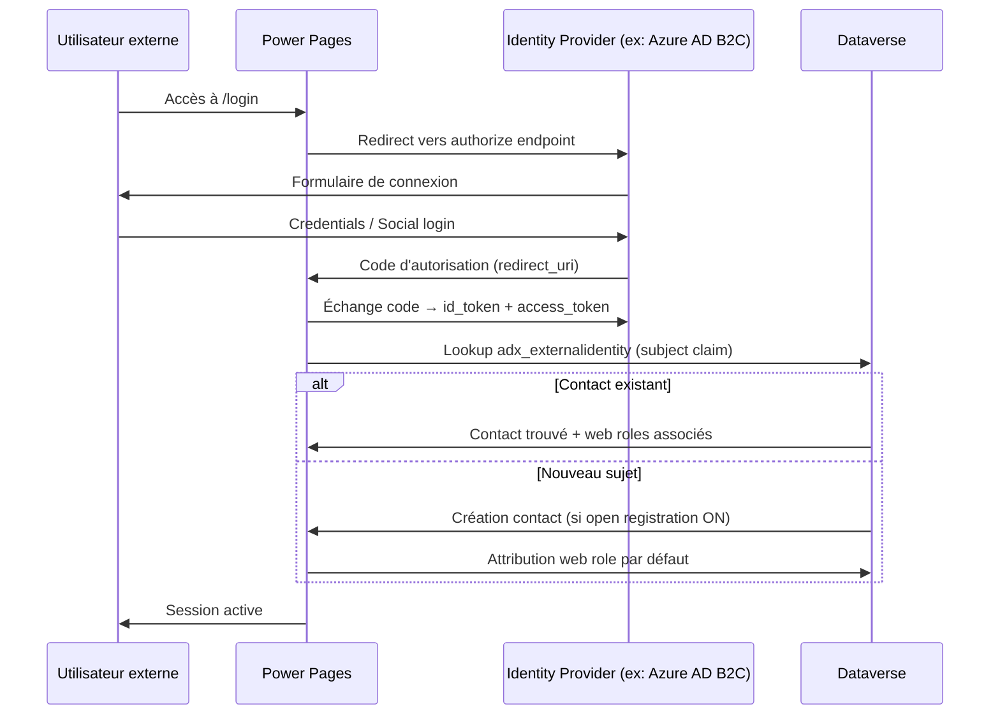

# Authentification et identité externe dans Power Pages

## Objectifs pédagogiques

À l'issue de ce module, vous serez capable de :

1. **Identifier** les fournisseurs d'identité supportés par Power Pages et les différences de sécurité entre eux
2. **Configurer** un provider OAuth2/OIDC externe (Azure AD B2C, Google, LinkedIn) dans le portail
3. **Contrôler** la surface d'attaque liée à l'enregistrement et à la connexion des utilisateurs externes
4. **Diagnostiquer** une mauvaise configuration d'identity provider susceptible d'être exploitée
5. **Appliquer** le principe de moindre privilège à la liaison entre identité externe et contact Dataverse

---

## Mise en situation

En 2022, plusieurs portails Power Pages d'organisations du secteur public ont été exposés par une combinaison de deux configurations par défaut : **l'inscription ouverte activée** et **l'absence de validation du domaine email**. Un acteur externe — pas même un attaquant sophistiqué — s'est inscrit avec une adresse Gmail quelconque, a obtenu un contact Dataverse automatiquement créé, et a pu accéder à des tables avec des permissions lues trop larges héritées du rôle "Authenticated Users".

Le problème n'était pas dans le fournisseur d'identité lui-même. Microsoft n'a pas été compromis. Le vecteur était uniquement dans la **configuration du portail** : qui peut s'inscrire, comment le contact est créé, et quels web roles sont attribués par défaut.

Ce module couvre exactement ça : pas la théorie OAuth, mais les décisions de configuration qui séparent un portail sécurisé d'un portail ouvert par défaut.

---

## Surface d'attaque spécifique à Power Pages

Power Pages expose plusieurs points d'entrée liés à l'identité :

| Vecteur | Exposition | Impact potentiel |
|---|---|---|
| Inscription ouverte (open registration) | Toute personne peut créer un compte | Création de contacts Dataverse non maîtrisés, accès aux permissions du rôle Authenticated Users |
| Provider local (username/password) | Endpoint `/register` et `/login` actifs | Brute-force, credential stuffing, pas de MFA natif |
| Redirect URI mal configuré | Paramètre `redirect_uri` non validé | Open redirect, vol de code d'autorisation OAuth |
| Invitation par lien | Token d'invitation sans expiration ou réutilisable | Accès non autorisé si le lien est intercepté ou partagé |
| Auto-création de contact | Un login externe crée automatiquement un contact | Pollution Dataverse, contournement des règles de validation métier |
| Provider obsolète (Facebook OAuth v1) | Endpoints dépréciés toujours configurés | Tokens à durée de vie longue, absence de revocation |

🔴 **Vecteur d'attaque** — Le flux d'inscription est la surface la plus exposée. Un attaquant n'a pas besoin d'exploiter OAuth : il suffit que l'inscription soit ouverte et que le rôle par défaut donne trop de permissions. Les modules précédents ont couvert les web roles et table permissions — ici, on s'attaque à ce qui permet d'entrer dans ce système de permissions.

---

## Comment fonctionne l'identité externe dans Power Pages

### Le modèle interne : Contact Dataverse comme identité

Power Pages ne gère pas les identités de façon autonome. Chaque utilisateur authentifié est représenté par un enregistrement **Contact** dans Dataverse. La table système `adx_externalidentity` fait le lien entre un identifiant externe (email ou subject claim d'un provider OIDC) et ce contact.



Le `subject` claim (ou `sub`) du token OIDC est l'identifiant stable qui lie un provider externe à un contact. Si deux providers différents retournent le même email mais des `sub` distincts, Power Pages peut créer deux contacts séparés pour la même personne réelle. C'est une source classique de doublons — et une source d'incohérences de permissions.

Pour illustrer le problème concrètement, voici ce que retournent deux tokens OIDC pour la même adresse email selon deux providers différents :

**Token A — Google**
```json
{
  "sub": "108234567890123456789",
  "email": "alice@example.com",
  "email_verified": true,
  "name": "Alice Martin"
}
```

**Token B — Azure AD B2C**
```json
{
  "sub": "b2c_alice_9f3a2c1d-4e8b-4a7f-9c2d-1e3b5a6f7d8e",
  "email": "alice@example.com",
  "email_verified": true,
  "name": "Alice Martin"
}
```

Même email, deux `sub` distincts → Power Pages crée deux enregistrements dans `adx_externalidentity`, potentiellement deux contacts distincts dans Dataverse. Alice a maintenant deux identités dans le portail, avec des permissions potentiellement différentes selon le contact auquel chaque identité est liée.

### Providers supportés

Power Pages supporte plusieurs catégories de providers :

**Protocoles standards (recommandés en prod) :**
- OpenID Connect (OIDC) — Azure AD, Azure AD B2C, Okta, Auth0, PingIdentity
- OAuth 2.0 — Microsoft, Google, LinkedIn, Twitter/X, Facebook

**Provider local (à éviter en prod exposée) :**
- Authentification par email/mot de passe hébergée par Power Pages elle-même, sans MFA intégré, sans politique de complexité configurable depuis l'interface

**Provider Microsoft interne :**
- Azure AD (pour les utilisateurs internes — distinct du cas externe)

---

## Configuration d'un provider OIDC externe

### Azure AD B2C — le cas d'usage le plus courant

Azure AD B2C est le choix standard pour les portails grand public ou B2B : il supporte le social login (Google, Facebook), les flux personnalisés (inscription avec validation email, MFA conditionnel), et s'intègre nativement à Power Pages.

**Étape 1 — Créer l'application dans Azure AD B2C**

Dans le tenant B2C :

```
Azure Portal → Azure AD B2C → App registrations → New registration
  Name            : <NOM_APP>-powerpage
  Supported types : Accounts in any identity provider
  Redirect URI    : https://<PORTAL_URL>/signin-<PROVIDER_NAME>
```

> ⚠️ La redirect URI doit correspondre exactement à ce que Power Pages génère — sensible à la casse, au slash final, et au nom du provider tel que saisi dans le portail.

**Étape 2 — Valider les métadonnées OIDC**

Avant de configurer le provider dans Power Pages, vérifier que l'URL de métadonnées B2C est accessible et retourne les bons endpoints. Le format de l'URL est :

```
https://<TENANT>.b2clogin.com/<TENANT>.onmicrosoft.com/<POLICY_NAME>/v2.0/.well-known/openid-configuration
```

Remplacer `<POLICY_NAME>` par le nom du user flow (ex: `B2C_1_signupsignin`). Une réponse valide ressemble à :

```json
{
  "issuer": "https://<TENANT>.b2clogin.com/<TENANT_ID>/v2.0/",
  "authorization_endpoint": "https://<TENANT>.b2clogin.com/<TENANT>.onmicrosoft.com/<POLICY>/oauth2/v2.0/authorize",
  "token_endpoint": "https://<TENANT>.b2clogin.com/<TENANT>.onmicrosoft.com/<POLICY>/oauth2/v2.0/token",
  "jwks_uri": "https://<TENANT>.b2clogin.com/<TENANT>.onmicrosoft.com/<POLICY>/discovery/v2.0/keys",
  "response_types_supported": ["code", "id_token", "token"],
  "subject_types_supported": ["pairwise"]
}
```

Si cette URL retourne une erreur 404 ou un JSON malformé, la configuration du provider dans Power Pages échouera silencieusement — l'erreur de connexion côté utilisateur sera cryptique. Valider ce point avant d'aller plus loin.

**Étape 3 — Configurer le provider dans Power Pages**

```
Power Pages Studio → Security → Identity providers → Add provider
  Provider type        : Other (OpenID Connect)
  Provider name        : <PROVIDER_NAME>    ← identique au slug dans redirect URI
  Metadata address     : <URL_OPENID_CONFIG>
  Client ID            : <APPLICATION_ID>
  Client secret        : <CLIENT_SECRET>
  Default roles        : [laisser vide — à attribuer manuellement]
```

💡 **Astuce** — Ne pas renseigner "Default roles" à cette étape. L'attribution automatique de web roles à l'inscription est précisément le vecteur décrit en mise en situation. Laisser vide et gérer les rôles via un flow Power Automate déclenché sur la création du contact.

**Étape 4 — Contrôler l'inscription**

```
Power Pages Studio → Security → Identity providers → <PROVIDER> → Settings
  Allow new registrations  : OFF (par défaut → ON, à désactiver si pas d'auto-inscription)
  Email confirmation       : ON
  Contact auto-creation    : via workflow de validation → pas en automatique
```

---

## Contrôler qui peut s'authentifier

### Trois modèles d'accès

**Modèle 1 — Invitation only**

L'accès est conditionné à une invitation générée côté back-office. Un contact est créé manuellement (ou via un flow), et un lien d'invitation est envoyé. L'utilisateur ne peut pas s'inscrire de lui-même.

🔒 **Contrôle de sécurité** — C'est le modèle le plus sûr pour des portails RH, fournisseurs ou partenaires. Le contact existe avant la première connexion : pas de création automatique non contrôlée.

**Modèle 2 — Inscription avec validation**

L'inscription est ouverte, mais la création du contact et l'attribution du rôle passent par un workflow de validation (approbation manageur, vérification domaine email, etc.).

Configuration type avec Power Automate :

```
Trigger       : When a record is created (Contact, Dataverse)
Condition     : emailaddress1 ends with @<DOMAINE_AUTORISE>
Action (true) : Add user to web role "Authenticated External"
Action (false): Send rejection email + Delete contact
```

**Modèle 3 — Inscription ouverte (à éviter)**

Toute personne avec un compte du provider peut s'inscrire et obtient immédiatement le rôle par défaut. Acceptable uniquement si les table permissions du rôle "Authenticated Users" sont strictement restreintes à des données non sensibles.

⚠️ **Erreur fréquente** — Activer Google ou LinkedIn comme provider social sans désactiver l'inscription ouverte. N'importe quel compte Google peut alors créer un contact et obtenir les permissions du rôle "Authenticated Users". Si ce rôle donne accès en lecture à une table de données métier, la surface d'exposition est immédiate.

---

## Sécuriser la liaison identité ↔ contact

### Le risque de l'account linking automatique

Par défaut, Power Pages peut lier automatiquement un nouveau login externe à un contact existant si l'email correspond. Ce comportement, appelé **account linking**, semble pratique mais introduit un vecteur de prise de contrôle de compte :

1. L'attaquant connaît l'email de la victime (ex: trouvé dans un leak ou un formulaire public)
2. Il crée un compte Google avec cet email
3. Il se connecte au portail via Google
4. Power Pages détecte un contact existant avec le même email et lie les deux identités
5. L'attaquant hérite des permissions et données du contact original

🔴 **Vecteur d'attaque** — Ce n'est pas un scénario théorique. La CVE-2023-24929 (Microsoft Dynamics 365 portals) documentait un comportement similaire. Le mécanisme n'est pas un bug OAuth, c'est une décision de design de l'account linking.

**Configuration défensive :**

```
Power Pages Studio → Security → General → Account linking
  Enabled : OFF
```

Si le business nécessite le linking, le conditionner à une confirmation explicite de l'utilisateur déjà authentifié — pas en silencieux à la première connexion.

### Valider les claims reçus du provider

Power Pages permet de mapper des claims OIDC vers des champs du contact. Cette fonctionnalité est utile mais peut introduire une injection de données si les claims ne sont pas validés.

⚠️ **Erreur fréquente** — Mapper le claim `roles` ou `groups` du provider directement vers un champ Dataverse utilisé par une logique applicative. Un provider mal sécurisé (ou un utilisateur qui contrôle son propre provider OIDC) peut injecter n'importe quelle valeur dans ce claim.

🔒 **Contrôle de sécurité** — Ne mapper que des claims à faible risque (prénom, nom, email). L'attribution des web roles doit rester sous contrôle de l'application (flow ou plugin), jamais déléguée à un claim externe.

---

## Hardening : checklist opérationnelle

Ces configurations couvrent les points de durcissement actionnables après ce module :

| Configuration | Valeur sécurisée | Risque si ignoré |
|---|---|---|
| Open registration | `OFF` sauf si portail grand public avec données non sensibles | Création de contacts non contrôlés |
| Provider local (email/password) | Désactiver si un provider OIDC externe est disponible | Brute-force sans MFA |
| Account linking automatique | `OFF` | Prise de contrôle de compte par email spoofing |
| Default roles à l'inscription | Aucun rôle par défaut | Attribution trop large aux nouveaux inscrits |
| Email confirmation | `ON` pour provider local | Comptes créés avec emails invalides ou usurpés |
| Expiration des tokens d'invitation | 24-48h maximum | Liens d'invitation réutilisables ou partagés |
| Mapping de claims sensibles | Interdire `roles`, `groups`, `admin` | Injection de données via token forgé |
| Redirect URI stricte | Validation exacte côté Azure AD B2C | Open redirect, vol de code authorization |
| Client secret | Expiration 12 mois + alerte + rotation documentée | Secret compromis = usurpation d'application côté IDP |
| Logout endpoint | Configuré + `post_logout_redirect_uri` testé | Session IDP active après déconnexion portail |

---

## Tests de sécurité : vérifier la configuration en prod

**Vérifier que l'inscription ouverte est désactivée :**

```
GET https://<PORTAL_URL>/register
→ Attendu : 302 redirect vers /login ou page d'erreur
→ Problème si : formulaire d'inscription s'affiche sans invitation
```

Pour confirmer que le blocage est appliqué côté serveur et pas seulement masqué côté UI, tester également une soumission directe :

```
POST https://<PORTAL_URL>/register
Content-Type: application/x-www-form-urlencoded
Body: EmailAddress=test@test.com&Password=Test1234!

→ Attendu : 403 ou redirect vers /login
→ Problème si : enregistrement créé dans Dataverse malgré l'absence de formulaire
```

Vérifier dans Dataverse → Contacts que aucun contact avec `test@test.com` n'a été créé après ce test.

**Tester l'account linking :**

```
1. Créer un contact manuellement dans Dataverse avec email test@example.com
2. Créer un compte Google/Microsoft avec test@example.com
3. Tenter de se connecter au portail avec ce compte social
→ Attendu : nouveau contact créé séparé, ou erreur d'inscription refusée
→ Problème si : connexion aboutit et hérite des données du contact original
```

**Tester le logout et la fermeture de session IDP :**

```
1. Se connecter au portail via le provider OIDC
2. Cliquer sur Déconnexion dans le portail
3. Sans rouvrir de session, accéder directement à l'authorize endpoint du provider
→ Attendu : formulaire de connexion affiché (session IDP fermée)
→ Problème si : reconnexion automatique sans credentials (session IDP encore active)
```

Ce test est particulièrement critique sur les postes partagés. Si `post_logout_redirect_uri` n'est pas configuré, la session Power Pages se termine mais la session Azure AD B2C reste active — un autre utilisateur peut se reconnecter sans credentials.

**Vérifier les redirect URIs autorisées dans Azure AD B2C :**

```
Azure Portal → Azure AD B2C → App registrations → <APP> → Authentication
→ Vérifier que seul https://<PORTAL_URL>/signin-<PROVIDER> est listé
→ Supprimer les URIs de dev/test (http://localhost) en production
```

**Vérifier l'absence de provider local actif non souhaité :**

```
GET https://<PORTAL_URL>/signin
→ Inspecter les providers listés dans la page de login
→ Si "Local" apparaît alors qu'il ne devrait pas, vérifier :
   Power Pages Studio → Security → Identity providers → Local → désactiver
```

**Audit post-déploiement — vérifier les providers actifs via Power Automate :**

```
Trigger  : Manuel ou scheduled (hebdomadaire)
Action 1 : HTTP GET https://<PORTAL_URL>/signin
Action 2 : Parse HTML response → extraire les providers listés
Action 3 : Condition → si "Local" dans providers ET environnement = Production
Action 4 (true) : Send Teams alert "Provider local détecté en production sur <PORTAL_URL>"
```

Ce flow ne remplace pas un audit manuel mais détecte une réactivation accidentelle du provider local — fréquente après une mise à jour de configuration ou une restauration de solution.

---

## Cas réel en entreprise

Une ESN française a déployé un portail Power Pages pour le suivi de dossiers clients. Le portail était configuré avec Azure AD B2C comme provider principal — correctement. Mais lors de la migration depuis l'ancien portail Dynamics 365, le provider local (email/password) n'avait pas été désactivé : il avait été gardé "en attente de migration complète".

Six mois après la mise en prod, un audit de sécurité a découvert :

- **47 comptes créés via le provider local**, dont une dizaine avec des emails génériques (`test@test.com`, `admin@portail.fr`)
- Le rôle "Authenticated Users" donnait accès en lecture à la table des dossiers clients (**7 200 enregistrements**)
- **Aucune alerte** configurée sur la création de nouveaux contacts
- Parmi les 47 comptes, au moins 3 avaient consulté entre 50 et 300 dossiers chacun d'après les logs d'activité Power Pages — soit potentiellement **900 dossiers clients consultés par des comptes non légitimes**

La remédiation a pris 4 heures (désactivation provider local + audit des contacts + restriction des table permissions). Le vrai coût a été l'audit rétrospectif pour déterminer si des données avaient été consultées — **3 jours de travail** sans logs d'accès aux enregistrements individuels, avec un rapport de notification RGPD à préparer faute de certitude.

**Leçon** : les providers non utilisés restent actifs et exposés jusqu'à désactivation explicite. Il n'y a pas de "mode dormant" automatique. Et sans monitoring, l'ampleur d'une exposition ne se découvre qu'après coup — quand le coût d'investigation dépasse largement celui de la configuration initiale.

---

## Erreurs fréquentes

⚠️ **Garder le provider local actif en production**
Configuration dangereuse : provider local activé par défaut, jamais désactivé après passage à OIDC.
Conséquence : endpoint `/register` et `/login` actifs, sans MFA, sans politique de mot de passe.
Correction : `Power Pages Studio → Security → Identity providers → Local → Disable`

⚠️ **Mapper le claim `email` comme identifiant unique**
Configuration dangereuse : utiliser l'email comme clé de liaison entre provider et contact.
Conséquence : un attaquant contrôlant un provider OIDC peut forger un email pour se lier à n'importe quel contact.
Correction : utiliser le `sub` claim (immuable et spécifique au provider) comme identifiant dans `adx_externalidentity`.

⚠️ **Ne pas tester le flux de déconnexion**
Configuration dangereuse : configurer la connexion sans vérifier le `post_logout_redirect_uri`.
Conséquence : la session Power Pages se termine mais la session IDP reste active — un autre utilisateur sur la même machine peut se reconnecter sans credentials.
Correction : configurer le logout endpoint dans les métadonnées OIDC et tester sur navigateur partagé.

⚠️ **Utiliser un Client Secret sans rotation**
Configuration dangereuse : client secret Azure AD B2C sans date d'expiration, jamais roté.
Conséquence : si le secret est compromis (leak dans un repo, log d'erreur), l'attaquant peut usurper l'application côté IDP.
Correction : secret avec durée de vie 12 mois maximum + alerte sur expiration dans Azure AD B2C.

---

## Résumé

Power Pages délègue l'authentification à des providers externes (OIDC, OAuth2) mais reste propriétaire de l'attribution des permissions via les contacts Dataverse et les web roles. Les vecteurs d'attaque ne sont pas dans les protocoles OAuth eux-mêmes — ils sont dans les décisions de configuration : inscription ouverte, account linking automatique, provider local non désactivé, mapping de claims non contrôlé.

La bonne posture est de traiter chaque provider actif comme une porte d'entrée physique : elle doit être fermée par défaut, ouverte explicitement, et auditée régulièrement. L'attribution des web roles ne doit jamais être automatique ni déléguée à un claim externe — elle doit rester un acte applicatif contrôlé.

Ce qui reste à surveiller : les tokens d'invitation sans expiration, les redirections post-logout, et la croissance non maîtrisée des contacts Dataverse créés par des inscriptions non validées. Le module suivant couvre les Liquid templates — la couche de rendu dynamique qui s'appuie sur l'identité configurée ici pour afficher les données Dataverse selon le contexte utilisateur.

---

<!-- snippet
id: powerpages_openreg_disable
type: concept
tech: Power Pages
level: intermediate
importance: high
format: knowledge
tags: power-pages, inscription, open-registration, securite, identite-externe
title: Inscription ouverte activée par défaut dans Power Pages
content: "Open registration est ON par défaut. Tout utilisateur avec un compte du provider peut créer un contact Dataverse et hériter du rôle Authenticated Users. Correction : Power Pages Studio → Security → Identity providers → <PROVIDER> → Settings → Allow new registrations : OFF. Gérer les inscriptions via invitation ou workflow de validation."
description: "L'inscription ouverte crée des contacts Dataverse non contrôlés avec les permissions du rôle par défaut — à désactiver sauf portail grand public à données non sensibles."
-->

<!-- snippet
id: powerpages_account_linking_risk
type: concept
tech: Power Pages
level: intermediate
importance: high
format: knowledge
tags: power-pages, account-linking, usurpation, oidc, contact-dataverse
title: Risque de prise de compte via account linking automatique
content: "Power Pages peut lier un login externe à un contact existant si l'email correspond — sans confirmation de l'utilisateur. Un attaquant connaissant l'email d'un contact existant peut créer un compte Google avec cet email et hériter de ses permissions. Mécanisme : la table adx_externalidentity est mise à jour silencieusement à la connexion. Correction : Account linking → OFF dans Security → General."
description: "L'account linking automatique par email permet à un attaquant de prendre le contrôle d'un contact existant en créant un compte social avec le même email."
-->

<!-- snippet
id: powerpages_local_provider_disable
type: warning
tech: Power Pages
level: intermediate
importance: high
format: knowledge
tags: power-pages, provider-local, brute-force, mfa, authentification
title: Provider local actif sans MFA en production
content: "Le provider local (email/password) n'a pas de MFA natif ni de politique de mot de passe configurable. Les endpoints /register et /login restent actifs même si un provider OIDC est configuré. Configuration dangereuse : laisser le provider local actif 'en attente de migration'. Conséquence : brute-force, credential stuffing. Correction : Power Pages Studio → Security → Identity providers → Local → Disable."
description: "Le provider local Power Pages n'a pas de MFA — à désactiver explicitement dès qu'un provider OIDC est en place, il ne se désactive pas automatiquement."
-->

<!-- snippet
id: powerpages_sub_claim_identifier
type: concept
tech: Power Pages
level: intermediate
importance: high
format: knowledge
tags: power-pages, oidc, sub-claim, adx-externalidentity, identite
title: Utiliser sub et non email comme identifiant OIDC
context: Deux providers OIDC différents (Google et Azure AD B2C) pour la même adresse email retournent des sub distincts — Power Pages crée deux contacts séparés si l'identifiant de liaison est l'email.
content: "Power Pages utilise adx_externalidentity pour lier un claim du provider à un contact Dataverse. Exemple concret : Google retourne sub=108234567890123456789 pour alice@example.com, Azure AD B2C retourne sub=b2c_alice_9f3a2c1d-4e8b pour le même email — deux sub distincts créent deux contacts séparés. Si l'identifiant de liaison est l'email (et non le sub), un attaquant contrôlant un provider OIDC peut forger un email arbitraire et se lier à n'importe quel contact existant. Le claim sub est immuable, propre à chaque provider, et ne peut pas être forgé sans compromettre le provider lui-même."
description: "Utiliser le claim sub (et non email) comme clé dans adx_externalidentity — même email, sub différent selon provider = deux contacts distincts, et l'email peut être forgé."
-->

<!-- snippet
id: powerpages_oidc_metadata_validation
type: tip
tech: Power Pages
level: intermediate
importance: high
format: knowledge
tags: power-pages, oidc, well-known, metadata, diagnostic
title: Valider les métadonnées OIDC avant de configurer le provider
context: À exécuter avant l'étape de configuration du provider dans Power Pages Studio — une URL de métadonnées inaccessible provoque des erreurs de connexion cryptiques côté utilisateur.
command: curl -s "https://<TENANT>.b2clogin.com/<TENANT>.onmicrosoft.com/<POLICY>/.well-known/openid-configuration" | python -m json.tool
example: curl -s "https://contoso.b2clogin.com/contoso.onmicrosoft.com/B2C_1_signupsignin/v2.0/.well-known/openid-configuration" | python -m json.tool
description: "Vérifier que l'URL .well-known retourne un JSON valide avec authorization_endpoint, token_endpoint et jwks_uri avant de configurer le provider — évite les erreurs silencieuses."
-->

<!-- snippet
id: powerpages_redirect_uri_test
type: tip
tech: Power Pages
level: intermediate
importance: medium
format: knowledge
tags: power-pages, oauth2, redirect-uri, open-redirect, azure-ad-b2c
title: Vérifier les redirect URIs autorisées dans Azure AD B2C
content: "Dans Azure AD B2C → App registrations → <APP> → Authentication : vérifier que seul https://<PORTAL_URL>/signin-<PROVIDER_NAME> est listé. Supprimer toute URI http://localhost ou de domaine de test. Une URI de redirect non restreinte permet à un attaquant de construire une URL authorize?redirect_uri=https://evil.com et de capturer le code d'autorisation OAuth."
description: "Les URIs de redirect non nettoyées (localhost, domaines de dev) en prod permettent de capturer des codes OAuth par open redirect — à vérifier après chaque déploiement."
-->

<!-- snippet
id: powerpages_claim_mapping_risk
type: warning
tech: Power Pages
level: intermediate
importance: high
format: knowledge
tags: power-pages, claim-mapping, injection, oidc, web-roles
title: Ne pas mapper les claims roles ou groups vers Dataverse
context: Exemple de payload
