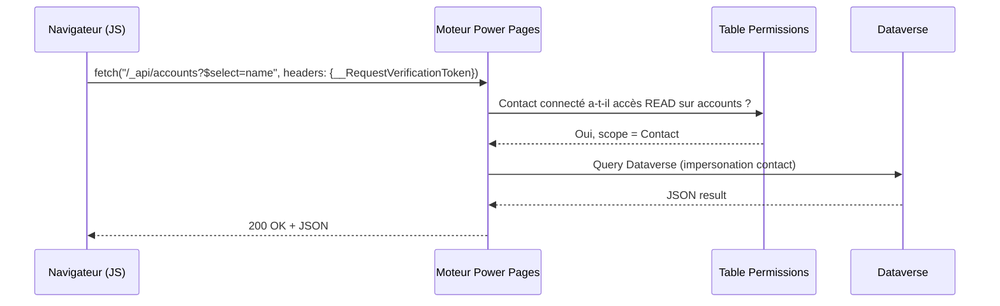

# Portals Web API

## Objectifs pédagogiques

À l'issue de ce module, tu seras capable de :

1. **Expliquer** comment la Portals Web API s'intercale entre le navigateur et Dataverse, sans passer par Power Automate
2. **Configurer** les prérequis site settings et table permissions pour autoriser les opérations CRUD via l'API
3. **Écrire** des appels fetch JavaScript valides pour lire, créer, modifier et supprimer des enregistrements Dataverse
4. **Protéger** les appels API contre les abus courants (CSRF, surexposition de données)
5. **Diagnostiquer** les erreurs 403 et 400 les plus fréquentes sur les portails Power Pages

---

## Mise en situation

Tu travailles sur un portail partenaires pour une entreprise industrielle. Le portail existe déjà — les pages Liquid sont en place, les web templates fonctionnent. Mais le product owner arrive avec une nouvelle exigence : **les partenaires doivent pouvoir soumettre et modifier leurs propres demandes de support directement depuis une page du portail**, sans rechargement de page, avec une UX fluide type SPA.

Passer par un Power Automate déclenché depuis un formulaire classique introduit de la latence et des limitations. Ce qu'il te faut, c'est écrire en JavaScript depuis le navigateur et interagir directement avec Dataverse — c'est exactement ce que permet la **Portals Web API**.

---

## Contexte et problématique

Les portails Power Pages sont des applications web rendues côté serveur, principalement via Liquid. Cette approche couvre bien les lectures passives (afficher une liste de commandes, un profil), mais elle atteint ses limites dès qu'on veut de l'interactivité côté client : validation en temps réel, sauvegarde partielle, chargement dynamique de données sans rechargement complet.

La **Portals Web API** est une surface REST exposée nativement par le moteur Power Pages. Elle permet au code JavaScript s'exécutant dans le navigateur d'un utilisateur authentifié (ou anonyme si configuré) d'appeler directement Dataverse : lire des enregistrements, en créer, en modifier, en supprimer — le tout dans le respect des **table permissions** configurées sur le portail.

Ce n'est pas la même chose que l'API Dataverse standard (celle que tu appellerais depuis Postman avec un token Azure AD). La Portals Web API :
- est **scoped au contexte du portail** — elle utilise la session du contact connecté
- **respecte les table permissions** (Entity Permissions) définies dans le portail
- **ne nécessite pas de token OAuth** côté client — l'authentification passe par le cookie de session
- expose uniquement les tables et colonnes que tu as explicitement autorisées

💡 **Point clé** — La Portals Web API n'est pas un raccourci vers Dataverse entier. Elle est intentionnellement limitée aux surfaces que tu as ouvertes. C'est un avantage de sécurité, pas une contrainte.

---

## Architecture et flux d'appel

Avant d'écrire la première ligne de JavaScript, il faut comprendre ce qui se passe réellement quand le navigateur envoie une requête.



Quelques points importants dans ce flux :

**Le portail est l'intermédiaire.** La requête ne va jamais directement à Dataverse depuis le navigateur. Le moteur Power Pages intercepte, vérifie les permissions, puis exécute la requête avec le contexte sécurisé du contact.

**Le token anti-CSRF est obligatoire** pour toutes les opérations d'écriture (POST, PATCH, DELETE). Sans lui, le portail retourne un 400 ou 403 immédiat. Il est injecté dans la page par le moteur Liquid et doit être lu depuis le DOM.

**L'impersonation contact** signifie que Dataverse verra l'opération comme effectuée par le contact connecté (ou par l'utilisateur système du portail pour les accès anonymes). Les champs `createdby` / `modifiedby` reflètent cela.

---

## Prérequis : activer et configurer l'API

### Site Settings indispensables

La Portals Web API est désactivée par défaut. Tu dois créer deux Site Settings dans le portail :

| Nom du Site Setting | Valeur | Effet |
|---|---|---|
| `Webapi/<nom_table>/enabled` | `true` | Active l'API pour cette table |
| `Webapi/<nom_table>/fields` | `champ1,champ2` ou `*` | Expose uniquement ces colonnes |

Par exemple, pour exposer la table `incident` avec les champs `title`, `description` et `statuscode` :

```
Webapi/incident/enabled    → true
Webapi/incident/fields     → title,description,statuscode
```

⚠️ **Piège classique** — Mettre `*` pour `fields` expose **toutes** les colonnes de la table, y compris des métadonnées internes ou des données sensibles. En production, liste toujours les colonnes explicitement. C'est l'équivalent d'un `SELECT *` dans une API publique.

### Table Permissions

Activer le Site Setting ne suffit pas. Si les **table permissions** ne couvrent pas l'opération demandée, l'appel retourne un `403 Forbidden` — sans message d'erreur explicite la plupart du temps.

Les permissions à configurer correspondent aux opérations CRUD :

| Privilege | Opération API |
|---|---|
| Read | GET |
| Create | POST |
| Write | PATCH |
| Delete | DELETE |
| Append / Append To | Relations many-to-many |

Le **scope** de la permission est critique :
- **Global** : le contact voit tous les enregistrements de la table
- **Contact** : le contact voit uniquement les enregistrements liés à son enregistrement contact (`contactid`)
- **Account** : le contact voit les enregistrements liés au compte de son organisation
- **Self** : uniquement pour la table contact elle-même

Pour le cas partenaire décrit en mise en situation, le scope `Contact` est le bon choix — chaque partenaire voit et modifie uniquement ses propres tickets.

🧠 **Concept fondamental** — Les table permissions ne sont pas additives de manière automatique. Si tu as une permission `Read` en scope `Contact` et une autre `Read` en scope `Global` sur le même web role, c'est la plus large qui s'applique. Tester avec un compte de test avec les bons web roles, jamais avec l'admin du portail.

---

## Écrire les appels JavaScript

### Lire des enregistrements (GET)

La syntaxe est proche d'OData v4 — si tu as déjà utilisé l'API Dataverse classique, tu seras à l'aise. Si non, l'essentiel est que les paramètres de filtrage, tri et sélection de colonnes s'écrivent directement dans l'URL.

```javascript
fetch("/_api/incidents?$select=title,statuscode&$filter=statuscode eq 1&$orderby=createdon desc", {
  headers: {
    "Content-Type": "application/json"
  }
})
.then(response => response.json())
.then(data => {
  console.log(data.value); // tableau d'enregistrements
});
```

Quelques opérateurs OData fréquents dans ce contexte :

| Opérateur | Usage | Exemple |
|---|---|---|
| `$select` | Colonnes à retourner | `$select=title,createdon` |
| `$filter` | Filtrer les résultats | `$filter=statuscode eq 1` |
| `$orderby` | Tri | `$orderby=createdon desc` |
| `$top` | Limiter le nombre | `$top=50` |
| `$expand` | Inclure une relation | `$expand=customerid_account($select=name)` |

💡 **Point clé** — La réponse est toujours un objet JSON avec une propriété `value` contenant le tableau d'enregistrements, même s'il n'y en a qu'un seul. Pour un enregistrement unique par GUID, la réponse est directement l'objet (sans `value`).

### Récupérer un enregistrement par GUID

```javascript
const recordId = "a1b2c3d4-...";
fetch(`/_api/incidents(${recordId})?$select=title,description,statuscode`)
  .then(r => r.json())
  .then(record => console.log(record.title));
```

### Créer un enregistrement (POST)

C'est ici que le token anti-CSRF entre en jeu. Il est présent dans le DOM de chaque page Power Pages sous forme d'un champ caché ou d'un cookie.

```javascript
// Récupérer le token depuis le formulaire Liquid ou le cookie
const token = document.querySelector('[name=__RequestVerificationToken]')?.value
           || document.cookie.match(/ARRAffinity=[^;]+/)?.[0]; // fallback

fetch("/_api/incidents", {
  method: "POST",
  headers: {
    "Content-Type": "application/json",
    "__RequestVerificationToken": token
  },
  body: JSON.stringify({
    title: "Problème de livraison - commande #45892",
    description: "Le colis n'a pas été réceptionné.",
    statuscode: 1
  })
})
.then(response => {
  if (response.ok) {
    // 204 No Content = succès, l'ID est dans le header Location
    const location = response.headers.get("OData-EntityId");
    console.log("Créé :", location);
  }
});
```

⚠️ **Comportement contre-intuitif** — Une création réussie retourne un `204 No Content`, pas un `200`. L'identifiant du nouvel enregistrement est dans le header `OData-EntityId`, pas dans le body. Si tu attends un body JSON, tu obtiens `null` et tu crois que ça a échoué.

### Modifier un enregistrement (PATCH)

```javascript
const recordId = "a1b2c3d4-...";

fetch(`/_api/incidents(${recordId})`, {
  method: "PATCH",
  headers: {
    "Content-Type": "application/json",
    "__RequestVerificationToken": token
  },
  body: JSON.stringify({
    description: "Colis finalement reçu, fermeture du ticket."
  })
});
// Retourne également 204 No Content en cas de succès
```

Tu n'envoies que les champs à modifier — pas besoin de renvoyer l'objet complet. Les champs non mentionnés dans le body ne sont pas touchés.

### Supprimer un enregistrement (DELETE)

```javascript
fetch(`/_api/incidents(${recordId})`, {
  method: "DELETE",
  headers: {
    "__RequestVerificationToken": token
  }
});
```

### Lire le token anti-CSRF proprement

Le token peut se trouver à plusieurs endroits selon la configuration de la page. La façon la plus robuste est d'utiliser la fonction JavaScript exposée par le portail :

```javascript
// Méthode recommandée — injectée par le moteur Power Pages
shell.getTokenDeferred().done(function(token) {
  // utiliser token ici
});

// Alternative si shell n'est pas disponible
const token = document.querySelector('input[name="__RequestVerificationToken"]')?.value;
```

🧠 **Concept fondamental** — `shell.getTokenDeferred()` retourne un objet Deferred jQuery (pas une Promise native). Si tu travailles avec `async/await`, tu dois l'envelopper dans une `new Promise()`. Le moteur Power Pages injecte jQuery sur toutes les pages — tu peux en dépendre.

---

## Gestion des erreurs

Les codes HTTP retournés par la Portals Web API sont directs, mais les messages d'erreur dans le body peuvent être cryptiques. Voici les cas les plus fréquents :

| Code | Cause probable | Correction |
|---|---|---|
| `400 Bad Request` | Token CSRF manquant ou expiré | Relire le token depuis le DOM, recharger la page si session expirée |
| `403 Forbidden` | Table permission manquante ou mauvais web role | Vérifier les table permissions + web roles assignés au contact de test |
| `404 Not Found` | GUID inexistant ou table non activée dans Site Settings | Vérifier `Webapi/<table>/enabled = true` |
| `405 Method Not Allowed` | Opération non autorisée (ex: DELETE sans privilege Delete) | Ajouter le privilege manquant dans la table permission |
| `412 Precondition Failed` | Conflit de concurrence (ETag) | Utiliser `If-Match: *` pour forcer ou gérer le conflit |

Pour récupérer le message d'erreur :

```javascript
fetch("/_api/incidents", { method: "POST", headers: { ... }, body: JSON.stringify({...}) })
  .then(async response => {
    if (!response.ok) {
      const error = await response.json();
      console.error(error.error?.message); // "Principal user is missing prvCreate..."
    }
  });
```

---

## Sécurité

La surface d'exposition est réelle — n'importe qui peut ouvrir DevTools sur ton portail et regarder les appels. Quelques points non négociables :

**Ne jamais exposer de colonnes sensibles dans `Webapi/<table>/fields`.** Les champs financiers, les numéros de sécurité sociale, les identifiants internes de l'ERP n'ont rien à faire dans cette liste sauf nécessité absolue avec des permissions étroites.

**Le scope des table permissions est ta première ligne de défense.** Un scope `Global` sur une opération `Read` signifie que tout contact authentifié peut lire tous les enregistrements de la table — même ceux des autres clients. Teste toujours avec un compte de test sans droits admin portail.

**Le token CSRF protège contre les attaques cross-site**, pas contre un attaquant qui a accès au navigateur de l'utilisateur. Ce n'est pas un mécanisme d'authentification — c'est une protection contre le CSRF classique.

**Les appels anonymes sont possibles** si tu assignes une table permission à un web role "Unauthenticated Users". À utiliser uniquement pour des données vraiment publiques (catalogue de produits, FAQ) — jamais pour des données de gestion.

⚠️ **Piège production** — Il est tentant de mettre une permission `Read Global` pour simplifier le développement. En faisant ça sur une table comme `account` ou `contact`, tu exposes potentiellement la liste de tous tes clients à n'importe quel partenaire authentifié. Ce type d'erreur passe souvent les tests fonctionnels (le testeur voit ses données) et ne se voit qu'en audit de sécurité.

---

## Cas réel : soumettre un ticket de support

Voici un exemple complet et fonctionnel, réaliste pour le scénario partenaires décrit en introduction. Ce code s'intègre dans un web template Power Pages.

```javascript
(function() {
  const form = document.getElementById("support-form");
  if (!form) return;

  form.addEventListener("submit", async function(e) {
    e.preventDefault();

    // Récupération du token CSRF
    let token;
    try {
      token = await new Promise((resolve, reject) => {
        shell.getTokenDeferred().done(resolve).fail(reject);
      });
    } catch {
      token = document.querySelector('input[name="__RequestVerificationToken"]')?.value;
    }

    if (!token) {
      alert("Session expirée. Veuillez recharger la page.");
      return;
    }

    const payload = {
      title: document.getElementById("ticket-title").value,
      description: document.getElementById("ticket-desc").value,
      // Lier au contact connecté — récupéré via Liquid dans un champ caché
      "customerid_contact@odata.bind": `/contacts(${document.getElementById("contact-id").value})`
    };

    const response = await fetch("/_api/incidents", {
      method: "POST",
      headers: {
        "Content-Type": "application/json",
        "__RequestVerificationToken": token
      },
      body: JSON.stringify(payload)
    });

    if (response.status === 204) {
      const entityId = response.headers.get("OData-EntityId");
      const guid = entityId.match(/\(([^)]+)\)/)?.[1];
      document.getElementById("success-msg").textContent = `Ticket créé (ID: ${guid})`;
    } else {
      const err = await response.json();
      document.getElementById("error-msg").textContent = err.error?.message || "Erreur inconnue";
    }
  });
})();
```

Notations importantes dans ce code :
- La syntaxe `@odata.bind` permet d'associer une relation lookup — c'est la façon standard de lier un enregistrement à un autre en OData
- Le GUID de contact est injecté dans le HTML côté serveur via Liquid (`{{ user.id }}` dans un champ caché) — jamais calculé côté client
- Le code est enveloppé dans une IIFE pour éviter les pollutions de scope global

---

## Bonnes pratiques

**Toujours spécifier `$select`** dans tes requêtes GET, même si la table permissions limite déjà les colonnes via le Site Setting. C'est une défense en profondeur et ça réduit la taille des payloads.

**Versionne tes Site Settings** dans ton projet ALM. Un déploiement qui oublie de recréer `Webapi/incident/enabled = true` sur l'environnement cible cassera silencieusement toutes les opérations d'écriture (le GET peut parfois fonctionner partiellement selon la configuration).

**Utilise des comptes de test avec des web roles représentatifs** — jamais le compte administrateur du portail pour valider les permissions. L'admin bypasse certaines vérifications et donne une fausse impression que tout fonctionne.

**Centralise la logique d'appel** dans un module JS dédié plutôt que de dupliquer les fetch partout. Ça simplifie la gestion du token et la centralisation de la gestion d'erreurs — particulièrement utile quand une session expire.

**Pour les opérations en masse** (créer plusieurs enregistrements), envisage une solution côté serveur (Power Automate ou plugin Dataverse) plutôt que des boucles de fetch côté client. La Portals Web API n'est pas conçue pour l'ingestion de volumes.

---

## Résumé

| Concept | Rôle | Points clés |
|---|---|---|
| Portals Web API | Surface REST exposée par Power Pages pour appels JS côté client | Scoped au portail, pas d'OAuth côté client, session cookie |
| Site Settings `Webapi/*` | Activer l'API et définir les colonnes exposées | Toujours lister les colonnes explicitement, jamais `*` en prod |
| Table Permissions | Contrôler qui peut faire quoi sur quelle donnée | Le scope détermine le périmètre de données visible |
| Token CSRF | Protéger les opérations d'écriture | Lire via `shell.getTokenDeferred()` ou le DOM |
| `@odata.bind` | Créer des relations lookup dans un POST | Syntaxe : `"champ@odata.bind": "/table(guid)"` |
| Code 204 | Succès d'une création/modification/suppression | L'ID créé est dans le header `OData-EntityId`, pas dans le body |

La Portals Web API est l'outil qui transforme un portail Power Pages de site "vitrine interactive" en véritable application web. Elle te donne le contrôle total de l'UX côté client — à condition de comprendre que la sécurité repose entièrement sur une configuration correcte des table permissions et des Site Settings. Un appel qui fonctionne en dev sur ton compte admin peut silencieusement échouer ou surexposer des données en production si le modèle de permission n'a pas été pensé correctement.

Le module suivant abordera comment Power Automate et Copilot Studio s'intègrent dans cet écosystème — notamment pour les scénarios où la logique métier est trop complexe pour rester côté client.

---

<!-- snippet
id: portals_webapi_enable_settings
type: concept
tech: Power Pages
level: advanced
importance: high
format: knowledge
tags: portals, web api, site settings, configuration, dataverse
title: Activer la Portals Web API pour une table
content: Deux Site Settings sont requis : `Webapi/<table>/enabled = true` pour activer l'API, et `Webapi/<table>/fields = col1,col2` pour définir les colonnes exposées. Sans ces settings, tous les appels retournent 404. En production, ne jamais mettre `*` dans fields — lister les colonnes explicitement.
description: L'API est désactivée par défaut. Le setting fields contrôle quelles colonnes sont accessibles — `*` expose tout, y compris les données sensibles.
-->

<!-- snippet
id: portals_webapi_csrf_token
type: concept
tech: Power Pages
level: advanced
importance: high
format: knowledge
tags: portals, web api, csrf, securite, javascript
title: Lire le token CSRF pour les opérations d'écriture
content: Utiliser `shell.getTokenDeferred().done(function(token) { ... })` — c'est un Deferred jQuery, pas une Promise native. Pour async/await, l'envelopper dans `new Promise((resolve, reject) => shell.getTokenDeferred().done(resolve).fail(reject))`. Le token doit être passé dans le header `__RequestVerificationToken` de chaque POST/PATCH/DELETE.
description: Sans ce header sur les opérations d'écriture, le portail retourne 400 ou 403. Le token est régénéré à chaque session.
-->

<!-- snippet
id: portals_webapi_post_204
type: warning
tech: Power Pages
level: advanced
importance: high
format: knowledge
tags: portals, web api, post, creation, odata
title: POST réussi = 204, pas 200 — l'ID est dans le header
content: Piège : un POST de création réussi retourne 204 No Content (body vide). L'identifiant du nouvel enregistrement est dans le header HTTP `OData-EntityId` sous la forme `https://.../incidents(guid)`. Extraire le GUID avec `response.headers.get("OData-EntityId").match(/\(([^)]+)\)/)?.[1]`.
description: Attendre un body JSON sur un POST = null. Le 204 est un succès, pas une erreur. L'ID se récupère dans OData-EntityId.
-->

<!-- snippet
id: portals_webapi_odata_bind
type: tip
tech: Power Pages
level: advanced
importance: high
format: knowledge
tags: portals, web api, odata, lookup, relation
title: Créer une relation lookup dans un POST avec @odata.bind
content: Pour associer un enregistrement à une relation lookup lors d'un POST, utiliser la syntaxe `"champ_lookup@odata.bind": "/nom_table_pluriel(guid)"`. Exemple : `"customerid_contact@odata.bind": "/contacts(a1b2c3-...)"`. Le nom de la table dans l'URL est le nom logique au pluriel (anglais), pas le display name.
description: Sans @odata.bind, le champ lookup reste vide même si tu passes un GUID en valeur directe — c'est la seule syntaxe acceptée par OData pour les relations.
-->

<!-- snippet
id: portals_webapi_403_diagnostic
type: error
tech: Power Pages
level: advanced
importance: high
format: knowledge
tags: portals, web api, erreur, 403, table permissions
title: 403 sur un appel API — diagnostic table permissions
content: Symptôme : fetch retourne 403. Causes possibles dans l'ordre : (1) Table permission manquante pour l'opération (Read/Write/Create/Delete), (2) Web role non assigné au contact, (3) Scope trop restrictif (Contact scope mais l'enregistrement n'est pas lié au contact). Toujours tester avec un compte sans droits admin portail — l'admin bypasse certaines vérifications.
description: Le 403 Portals Web API indique une table permission manquante ou un web role absent — pas un problème d'authentification.
-->

<!-- snippet
id: portals_webapi_scope_global_risk
type: warning
tech: Power Pages
level: advanced
importance: high
format: knowledge
tags: portals, web api, securite, scope, table permissions
title: Scope Global = tous les contacts voient tous les enregistrements
content: Piège sécurité : une table permission Read avec scope Global sur une table comme `account` ou `contact` expose TOUS les enregistrements à n'importe quel contact authentifié. Ce n'est pas visible en test si on teste avec un seul compte. Utiliser le scope Contact pour limiter la visibilité à l'enregistrement lié au contact connecté. Auditer les scopes avant mise en production.
description: Le scope Global est souvent posé en dev pour simplifier et oublié en prod — résultat : tous les clients voient les données de tous les autres.
-->

<!-- snippet
id: portals_webapi_select_mandatory
type: tip
tech: Power Pages
level: advanced
importance: medium
format: knowledge
tags: portals, web api, odata, performance, securite
title: Toujours spécifier $select dans les requêtes GET
content: Même si Webapi/<table>/fields limite déjà les colonnes, ajouter `$select=col1,col2` dans l'URL réduit la taille du payload et constitue une défense en profondeur. Exemple : `/_api/incidents?$select=title,statuscode&$top=50`. Sans $select, toutes les colonnes autorisées sont retournées — inutile et potentiellement lourd.
description: $select réduit le payload réseau et évite d'exposer des colonnes autorisées mais non nécessaires dans le contexte de la page.
-->

<!-- snippet
id: portals_webapi_anonymous_risk
type: warning
tech: Power Pages
level: advanced
importance: medium
format: knowledge
tags: portals, web api, anonyme, securite, web role
title: Appels anonymes via web role "Unauthenticated Users"
content: Piège : assigner une table permission à un web role "Unauthenticated Users" rend les données accessibles SANS authentification. À réserver uniquement aux données vraiment publiques (catalogue produit, FAQ statique). Ne jamais faire ça sur des tables contenant des données clients, des prix personnalisés ou des informations de gestion.
description: Une table permission sur Unauthenticated Users = endpoint API public. N'importe qui peut appeler /_api/<table> sans se connecter.
-->

<!-- snippet
id: portals_webapi_patch_partial
type: concept
tech: Power Pages
level: advanced
importance: medium
format: knowledge
tags: portals, web api, patch, modification, odata
title: PATCH ne modifie que les champs envoyés
content: Un appel PATCH sur `/_api/incidents(guid)` ne touche que les champs présents dans le body JSON — les autres colonnes sont inchangées. Comportement inverse d'un PUT (qui remplacerait l'enregistrement entier). En pratique : envoyer uniquement `{ "description": "nouvelle valeur" }` modifie uniquement description. Retourne 204 No Content en cas de succès.
description: PATCH = mise à jour partielle. Inutile de renvoyer tout l'objet — seuls les champs du body sont mis à jour.
-->
