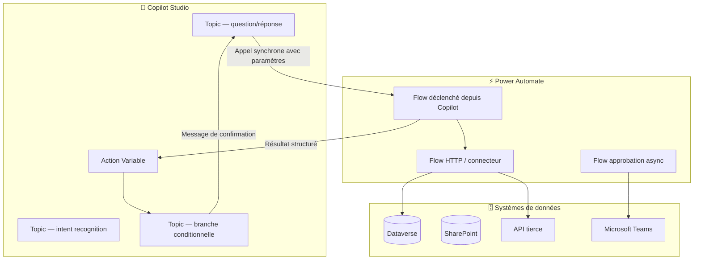
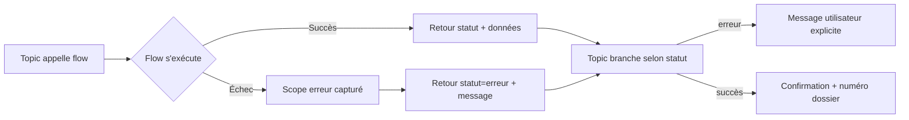

# Intégration Power Automate et Copilot Studio

## Objectifs pédagogiques

À l'issue de ce module, vous serez capable de :

- **Concevoir** une architecture d'intégration entre un agent Copilot Studio et des flows Power Automate, en choisissant le bon point d'articulation selon le besoin
- **Distinguer** les trois modes d'invocation d'un flow depuis Copilot Studio et décider lequel utiliser selon le contexte (synchrone, asynchrone, événementiel)
- **Modéliser** le passage de paramètres entre un topic conversationnel et un flow, en gérant correctement les types, les erreurs et les boucles de retry
- **Identifier** les limites d'architecture de chaque approche et les signaux qui doivent vous faire choisir une solution hybride
- **Appliquer** les bonnes pratiques de gouvernance sur une intégration en production (ALM, testabilité, observabilité)

---

## Mise en situation

Vous êtes architecte sur un projet pour une société de services B2B. L'équipe métier a construit un agent Copilot Studio pour les demandes internes RH — congés, attestations, accès IT. Le bot fonctionne. Il pose des questions, il comprend l'intention. Mais là, il s'arrête. Il répond avec des textes statiques parce que personne n'a encore branché le back-end.

Le responsable RH veut que l'agent puisse réellement soumettre une demande de congés, interroger le solde dans Dataverse, envoyer une notification Teams au manager, et renvoyer une confirmation avec le numéro de dossier. Tout ça dans la même conversation, sans rupture d'expérience.

La tentation immédiate : "on n'a qu'à mettre le code dans le topic". Ce serait une erreur. Les topics Copilot Studio ne sont pas conçus pour orchestrer de la logique métier. Ils gèrent la conversation — le tour de parole, les branches, les entités. Dès que vous avez besoin d'écrire dans une base, d'appeler une API tierce, ou d'envoyer un mail, vous sortez du périmètre du topic et vous entrez dans celui de Power Automate.

C'est exactement ce que ce module va construire : la frontière claire entre les deux outils, les patterns d'intégration, et les décisions d'architecture que vous devrez justifier.

---

## Pourquoi cette intégration existe — et ce qu'elle n'est pas

Copilot Studio et Power Automate ne sont pas redondants. Ils sont complémentaires sur des axes orthogonaux.

Copilot Studio gère **le dialogue** : il comprend l'intention, maintient le contexte de la conversation, pose des questions de clarification, gère les branches conditionnelles selon les réponses. C'est son domaine exclusif.

Power Automate gère **l'orchestration de processus** : il appelle des APIs, lit et écrit dans des systèmes, envoie des notifications, transforme des données, gère des approbations. Il ne sait pas tenir une conversation.

L'intégration entre les deux résout un problème précis : **déclencher une action métier au bon moment dans une conversation**, puis **ramener le résultat dans le fil conversationnel**.

Ce que cette intégration n'est *pas* : un moyen de contourner les limites de Copilot Studio en déportant la logique de dialogue dans un flow. Si vous vous retrouvez à émuler un tour de parole dans Power Automate, vous avez inversé les responsabilités — et vous allez souffrir.

---

## Architecture — Les trois couches et leurs frontières

Avant de descendre dans les patterns techniques, il faut poser le modèle mental. Une intégration Copilot Studio / Power Automate s'organise en trois couches distinctes.



**La couche dialogue** (Copilot Studio) : topics, variables de session, gestion des entités, branches. Rien d'autre.

**La couche orchestration** (Power Automate) : logique métier, appels système, transformations de données, approbations. Le flow ne sait pas dans quelle conversation il s'exécute — il reçoit des paramètres, il retourne un résultat, point.

**La couche données** : Dataverse, SharePoint, APIs tierces. Ces systèmes sont rarement appelés directement depuis un topic — ils passent presque toujours par un flow.

| Composant | Responsabilité | Ce qu'il ne doit PAS faire |
|---|---|---|
| Topic Copilot Studio | Dialogue, branches, collecte d'entités | Appeler directement une API REST, écrire en base |
| Flow Power Automate | Orchestration métier, intégrations | Gérer un tour de parole, maintenir un état conversationnel |
| Variable de topic | Transporter le résultat du flow vers le dialogue | Stocker de la logique métier |
| Connecteur Dataverse | Opérations CRUD sur les entités | — |

---

## Les trois modes d'invocation — Choisir avant de coder

Il existe trois façons distinctes d'articuler Copilot Studio et Power Automate. Ce n'est pas une question de préférence, c'est une question d'architecture : chaque mode répond à un besoin différent et a des implications sur l'expérience utilisateur.

### Mode 1 — Action synchrone dans un topic

C'est le pattern principal, le plus courant, celui que vous utiliserez dans 80% des cas. Le topic invoque un flow, **attend sa réponse**, puis continue le dialogue avec le résultat.

Le flow est de type **"Instant cloud flow"** avec le déclencheur `When a topic calls a flow (V2)`. Il reçoit des paramètres en entrée et retourne des valeurs structurées. Du point de vue de l'utilisateur, tout se passe dans la même conversation — il ne voit pas le flow s'exécuter.

```
Déclencheur : When a topic calls a flow (V2)
Inputs reçus : prenom (text), date_debut (text), nb_jours (number)
Outputs retournés : statut (text), numero_dossier (text), solde_restant (number)
```

⚠️ **Limite critique** : le timeout d'un appel synchrone depuis Copilot Studio est de **100 secondes**. Tout flow qui prend plus longtemps — approbation humaine, traitement batch, appel à un système lent — fera échouer l'interaction. Ce n'est pas un bug, c'est une contrainte d'architecture à anticiper.

### Mode 2 — Appel HTTP depuis Copilot Studio (Power Automate comme endpoint)

Moins courant mais utile quand vous avez besoin d'un contrôle fin sur le contrat d'interface. Le flow expose un endpoint HTTP (`When an HTTP request is received`) et le topic l'appelle via une action HTTP dans Copilot Studio.

Ce mode est pertinent quand vous souhaitez que le même flow soit réutilisable par plusieurs canaux (un portail Power Pages, une autre app Canvas, et un agent Copilot) sans dupliquer la logique. Le flow devient une micro-API.

🧠 **Concept clé** — Dans ce mode, la sécurité change : le token d'appel n'est plus géré automatiquement par la plateforme. Vous devez soit utiliser l'authentification Azure AD configurée sur le flow HTTP, soit accepter que l'URL soit un secret à protéger. Ne jamais laisser un flow HTTP accessible sans authentification en production.

### Mode 3 — Déclenchement événementiel (Copilot comme récepteur)

Ici, le sens s'inverse : c'est Power Automate qui déclenche une action *dans* Copilot Studio, par exemple pour notifier l'utilisateur d'un changement d'état asynchrone. Ce pattern utilise les **canaux Proactive Messages** ou l'intégration via Teams Bot Framework.

Ce mode répond au scénario suivant : un utilisateur demande une approbation via le bot, le bot lui dit "votre demande est en cours", et 2 heures plus tard quand le manager a approuvé, un flow relance le bot pour lui envoyer la confirmation. Ce n'est pas une conversation continue — c'est une notification différée.

---

## Construction progressive — Du prototype à l'architecture production

### v1 — Le flow minimal fonctionnel

L'objectif est de vérifier que le canal d'invocation fonctionne avant d'y mettre de la logique. Créez un flow avec le déclencheur `When a topic calls a flow (V2)`, ajoutez un seul step `Compose` qui retourne une valeur fixe, et connectez-le depuis un topic.

```
Topic → [Appel flow] → Flow retourne : { "statut": "OK", "message": "test réussi" }
         ↓
Variable topic : statut = "OK"
         ↓
Message : "Le flow a répondu : {statut}"
```

Ce n'est pas du code de production, mais ça répond à une question précise : est-ce que le binding entre le topic et le flow est correctement configuré ? En résoudre les problèmes à ce stade (permissions, environnement, solution) vous évitera de debugger le flow et l'invocation en même temps.

💡 **Astuce** : Créez toujours le flow depuis l'éditeur du topic ("Ajouter une action → Appeler une action → Créer un flow"), pas depuis Power Automate directement. Cela garantit que le flow est créé dans le bon environnement avec le bon déclencheur, et évite les erreurs de binding fréquentes quand on fait l'inverse.

### v2 — Passage de paramètres typés et retour structuré

La v1 valide le canal. La v2 fait le vrai travail : on passe les variables collectées dans le topic comme paramètres d'entrée du flow, et on récupère un objet structuré en sortie.

Le contrat d'interface est ce qui compte ici. Définissez-le explicitement, par écrit, avant de coder :

```
INPUTS du flow :
  - employeeId : string (GUID de l'employé connecté)
  - dateDebut  : string (format ISO 8601 : "2024-09-01")
  - nbJours    : number (entier positif)

OUTPUTS du flow :
  - statut         : string ("approuve", "refuse", "en_attente")
  - numeroDossier  : string (nullable)
  - soldeRestant   : number
  - messageErreur  : string (nullable, rempli si statut = "erreur")
```

Dans le topic, vous mappez les variables de session sur ces inputs. Dans le flow, vous retournez un `Response` step avec ce JSON exact. Côté topic, vous utilisez les outputs pour alimenter des variables, puis vous brancherez selon la valeur de `statut`.

⚠️ **Erreur classique** : passer des dates sous forme de texte sans normaliser le format. Copilot Studio collecte les dates en langue naturelle ("le 3 septembre") et les convertit selon la locale configurée dans l'agent. Si votre flow attend du ISO 8601 et que Copilot envoie "September 3, 2024", votre parsing va échouer silencieusement. Normalisez côté flow avec `formatDateTime()`, pas côté topic.

### v3 — Architecture production : gestion d'erreurs, observabilité, ALM

En production, trois axes supplémentaires sont non-négociables.

**Gestion d'erreurs structurée** : le flow doit toujours retourner un résultat, y compris en cas d'échec. Ne laissez jamais un flow échouer silencieusement — Copilot Studio interprétera une absence de réponse comme un timeout et affichera un message d'erreur générique à l'utilisateur. Encapsulez chaque étape critique dans un bloc `Scope` avec un gestionnaire `Run After` configuré sur `has failed`. En cas d'erreur, retournez `{ "statut": "erreur", "messageErreur": "..." }` et traitez-le dans le topic.



**Observabilité** : ajoutez un step `Application Insights` ou un log vers Dataverse dans chaque flow qui touche un processus métier. Minimum : timestamp, userId, action demandée, statut de sortie, durée d'exécution. Sans ça, quand quelque chose se passe mal en production (et ça arrivera), vous n'avez aucun moyen de savoir ce qui s'est passé.

**ALM** : le flow et l'agent Copilot Studio doivent être dans la **même solution non gérée** en développement. Le déploiement via solution gérée garantit que les références entre le topic et le flow sont maintenues à travers les environnements. Si vous déployez le flow et l'agent séparément, vous allez casser les bindings et passer une matinée à les reconfigurer manuellement en recette.

---

## Fonctionnement interne — Ce qui se passe entre les deux outils

Quand un topic invoque un flow, voici ce qui se passe réellement sous la surface, et pourquoi c'est important pour déboguer.

Copilot Studio génère un appel **HTTPS POST** vers le runtime Power Automate, en incluant les paramètres d'entrée sérialisés en JSON et un token d'authentification Azure AD lié à l'identité de la connexion configurée. Ce n'est pas un appel anonyme — il y a un principal de service sous-jacent.

Le flow s'exécute dans le contexte de l'**environnement Power Platform** où il a été créé. C'est crucial : si votre agent est dans l'environnement "Production" mais que votre flow est dans "Dev", l'invocation va échouer avec une erreur d'autorisation. Ce n'est pas évident à diagnostiquer si on ne connaît pas ce mécanisme.

Le résultat est renvoyé en JSON dans le corps de la réponse HTTP. Copilot Studio parse ce JSON et mappe les champs sur les variables de sortie déclarées dans le binding. Si le JSON retourné ne correspond pas exactement au schéma déclaré — un champ manquant, un type différent —, le mapping échoue silencieusement : la variable reste à null sans erreur visible dans la conversation.

🧠 **Concept clé** — Le déclencheur `When a topic calls a flow (V2)` est différent du déclencheur legacy `When Power Virtual Agents calls a flow`. Le V2 supporte les types complexes (objets, tableaux) en entrée et sortie, et est requis pour les agents créés avec le nouveau canvas Copilot Studio (post-2023). Si vous voyez des erreurs de type lors du binding, vérifiez que votre flow utilise bien le déclencheur V2.

---

## Prise de décision — Quand l'intégration directe atteint ses limites

L'intégration topic → flow couvre la majorité des scénarios, mais certains signaux doivent vous alerter que vous approchez des limites de ce pattern.

**Signal 1 : Le flow dure plus de 60 secondes.** La limite de timeout est 100 secondes, mais une bonne expérience utilisateur ne supporte pas 60 secondes d'attente sans feedback. Si votre flow fait une approbation humaine ou un traitement long, passez au pattern asynchrone : le flow est déclenché, le bot répond "votre demande est en cours", et une notification proactive est envoyée quand le résultat arrive.

**Signal 2 : Vous avez besoin du contexte de la conversation dans le flow.** Power Automate ne connaît pas l'historique du dialogue. Si votre logique métier dépend de ce qui s'est dit avant, c'est à Copilot Studio de synthétiser l'information avant de l'envoyer au flow — pas au flow d'aller chercher le contexte. Revoir le contrat d'interface plutôt que de tenter d'accéder à l'état conversationnel depuis le flow.

**Signal 3 : Le même flow est appelé depuis 4 topics différents avec de légères variations.** C'est le moment de paramétrer davantage le flow plutôt que de dupliquer. Un flow bien paramétré avec un champ `action_type` en input peut remplacer 4 flows presque identiques.

**Signal 4 : Vous avez besoin d'une logique de retry sophistiquée.** Le mécanisme d'invocation depuis Copilot ne gère pas nativement les retry avec backoff exponentiel. Si votre système cible est flaky, implémentez la logique de retry à l'intérieur du flow avec une boucle `Do Until` plutôt que de compter sur le topic pour relancer.

| Scénario | Pattern recommandé | Pourquoi pas l'autre |
|---|---|---|
| Vérifier le solde de congés en temps réel | Synchrone topic → flow | Rapide, résultat immédiat nécessaire |
| Approbation manager avant confirmation | Async + notification proactive | Peut durer des heures |
| Même logique appelée depuis 3 agents différents | Flow HTTP exposé comme micro-API | Évite la duplication, versionnable |
| Mise à jour d'un record Dataverse simple | Action native Dataverse dans topic | Pas besoin d'un flow pour du CRUD basique |
| Transformation complexe de données avant écriture | Flow synchrone | Power FX dans topic pas adapté |

La dernière ligne du tableau mérite une attention particulière : Copilot Studio permet d'accéder directement à Dataverse via des **actions natives** (Power Fx-based) sans passer par un flow. Pour du CRUD simple sur une entité, c'est plus rapide à développer et plus facile à maintenir. Réservez Power Automate pour ce qu'il sait faire mieux : l'orchestration multi-systèmes, les transformations complexes, et les intégrations hors Dataverse.

---

## Cas réel en entreprise

**Contexte** : Entreprise de distribution, 800 employés. L'équipe IT a déployé un agent Copilot Studio sur Teams pour les demandes d'accès aux applications internes. Avant le projet, chaque demande passait par un formulaire email envoyé à une boîte générique, traité manuellement en 3 à 5 jours.

**Architecture déployée** :

1. L'agent collecte via le dialogue : identité de l'employé (récupérée automatiquement via l'authentification Teams), application demandée (entité Copilot liée à une table Dataverse), justification métier.

2. Un flow synchrone vérifie en temps réel si une demande identique est déjà en cours pour cet employé (requête Dataverse) et retourne immédiatement "demande déjà existante" le cas échéant.

3. Si la demande est nouvelle, un second flow asynchrone crée le ticket dans Dataverse, déclenche une approbation Teams auprès du manager N+1 (connecteur Teams Approval), et envoie une confirmation à l'employé via message proactif quand l'approbation est traitée.

4. Le flow de provisioning (appel API vers l'AD Azure) est déclenché uniquement après approbation, via un flow séparé pour maintenir l'isolation des responsabilités.

**Résultats mesurables** : délai moyen de traitement passé de 3,5 jours à 4 heures (temps d'approbation manager), taux d'erreurs de saisie réduit de 40% (formulaire structuré vs email libre), 0 demande perdue depuis le déploiement (vs ~5% de perte sur la boîte email).

**Ce qui a failli mal tourner** : l'équipe avait initialement tout mis dans un seul flow synchrone, y compris l'étape d'approbation. Le premier test a révélé que le timeout de 100 secondes était régulièrement dépassé. La séparation en flow synchrone (vérification instantanée) + flow asynchrone (approbation) a été faite en jour 3 du projet, avant la mise en production.

---

## Bonnes pratiques

**1. Toujours déclarer un contrat d'interface explicite avant de coder.** Les inputs et outputs du flow doivent être documentés dans la solution avant que quiconque ouvre Power Automate. Ça prend 10 minutes et ça évite les malentendus entre le développeur du flow et celui du topic.

**2. Ne jamais laisser un flow retourner une erreur non gérée vers Copilot.** L'utilisateur final doit toujours recevoir un message intelligible, pas un "Une erreur s'est produite". Encapsulez, capturez, retournez un statut d'erreur explicite.

**3. Nommer les flows avec une convention prévisible.** Un pattern comme `[NomAgent]_[Verbe]_[Objet]` — par exemple `RH_Soumettre_DemandeConges` — rend les flows trouvables dans un tenant qui en contient des centaines. Un flow nommé "Flow 3" ou "Copie de flow congés" est un problème de gouvernance.

**4. Tester le flow indépendamment avant de le connecter au topic.** Power Automate permet de déclencher manuellement un flow avec des inputs de test. Utilisez ça systématiquement — vous identifiez les bugs de logique métier sans avoir à naviguer dans une conversation de test.

**5. Mettre les deux dans la même solution, dès le premier jour.** Pas après. Ajouter un flow existant à une solution ne le migre pas automatiquement — les références restent parfois liées à l'ancien contexte. Travailler dans la solution dès la création évite des heures de migration.

**6. Versionner le contrat d'interface.** Si vous changez les inputs ou outputs d'un flow qui est utilisé par plusieurs topics ou plusieurs agents, vous risquez de casser des intégrations existantes. Créez un nouveau flow versionné (`V2`) plutôt que de modifier l'interface en place.

**7. Monitorer les exécutions de flows en lien avec les sessions Copilot.** Ajoutez le `conversationId` comme variable de corrélation dans vos logs. Sans ça, quand un utilisateur dit "mon bot n'a pas répondu hier à 14h", vous ne pouvez pas retrouver l'exécution du flow correspondant dans les 500 runs de la journée.

---

## Résumé

Ce module a posé l'architecture d'intégration entre Copilot Studio et Power Automate comme une séparation de responsabilités claire : le topic gère le dialogue, le flow gère l'orchestration métier. Les trois modes d'invocation — synchrone, HTTP/micro-API, et événementiel asynchrone — répondent à des besoins distincts, et choisir le mauvais mode tôt dans le projet génère des problèmes d'architecture difficiles à corriger.

Les points critiques à retenir : le timeout de 100 secondes sur les appels synchrones, le fait que le flow ne connaît pas le contexte conversationnel, et l'importance du contrat d'interface comme document de référence partagé. En production, la gestion d'erreurs structurée et la corrélation des logs sont non-négociables — sans elles, le diagnostic d'incidents devient une opération de déduction.

La suite logique de ce parcours — performance et SEO des portails — s'inscrit dans une dynamique similaire : comprendre les limites de la plateforme pour les anticiper dans les choix d'architecture, plutôt que les découvrir en production.

---

<!-- snippet
id: copilot_flow_invocation_trigger
type: concept
tech: power automate
level: advanced
importance: high
format: knowledge
tags: copilot-studio, power-automate, trigger, integration, v2
title: Déclencheur correct pour un flow appelé depuis Copilot Studio
content: Utiliser "When a topic calls a flow (V2)" — pas la version legacy PVA. Le V2 supporte les types complexes (objets, tableaux) en entrée et sortie. Si le topic et le flow sont dans des environnements différents, l'appel échoue avec une erreur d'autorisation sans message explicite.
description: Le déclencheur V2 est requis pour les agents Copilot Studio post-2023. Un mauvais environnement provoque un échec silencieux d'autorisation.
-->

<!-- snippet
id: copilot_flow_timeout_limit
type: warning
tech: copilot studio
level: advanced
importance: high
format: knowledge
tags: copilot-studio, timeout, architecture, async, synchrone
title: Timeout de 100s sur les appels synchrones topic → flow
content: Piège : tout flow invoqué synchroniquement depuis un topic Copilot Studio doit répondre en moins de 100 secondes. Conséquence : un flow avec approbation humaine ou traitement long fait échouer l'interaction et affiche une erreur générique à l'utilisateur. Correction : séparer en flow synchrone court (vérification, création) + flow asynchrone (approbation, provisioning) avec notification proactive.
description: 100s max en synchrone — au-delà, l'interaction échoue. Approbations humaines et traitements longs → pattern asynchrone obligatoire.
-->

<!-- snippet
id: copilot_flow_error_handling
type: tip
tech: power automate
level: advanced
importance: high
format: knowledge
tags: power-automate, error-handling, scope, copilot-studio, production
title: Toujours retourner un résultat structuré même en cas d'échec
content: Encapsuler chaque étape critique dans un bloc Scope avec un gestionnaire "Run After → has failed". En cas d'erreur, retourner explicitement { "statut": "erreur", "messageErreur": "..." } vers le topic. Sans ça, l'absence de réponse est interprétée comme un timeout et l'utilisateur voit un message d'erreur générique non actionnable.
description: Un flow qui échoue silencieusement donne un message générique à l'utilisateur. Scope + Run After → retour JSON d'erreur explicite.
-->

<!-- snippet
id: copilot_flow_date_format
type: warning
tech: copilot studio
level: intermediate
importance: high
format: knowledge
tags: copilot-studio, power-automate, date, parsing, locale
title: Normaliser les dates côté flow, pas côté topic
content: Piège : Copilot Studio collecte les dates en langue naturelle et les convertit selon la locale de l'agent ("September 3, 2024", "3 sept.", etc.). Conséquence : si le flow attend du ISO 8601 et reçoit un format localisé, le parsing échoue silencieusement et la variable reste null. Correction : appliquer formatDateTime() dans le flow, pas dans le topic.
description: Les dates collectées par Copilot sont localisées. Normaliser avec formatDateTime() dans le flow — jamais compter sur le format d'entrée.
-->

<!-- snippet
id: copilot_flow_interface_contract
type: tip
tech: power automate
level: advanced
importance: high
format: knowledge
tags: power-automate, copilot-studio, architecture, governance, contrat
title: Documenter le contrat d'interface avant de coder le flow
content: Définir par écrit avant tout développement : liste des inputs (nom, type, nullable), liste des outputs (nom, type, nullable, valeurs possibles pour les champs statut). Ce document partagé entre le dev du flow et le dev du topic évite les désalignements de type qui échouent silencieusement au mapping. Stocker dans la solution sous forme de note ou wiki.
description: Inputs/outputs définis avant le code — évite les bugs de mapping silencieux entre topic et flow. 10 minutes de doc = heures de debug économisées.
-->

<!-- snippet
id: copilot_flow_solution_first
type: tip
tech: power automate
level: advanced
importance: high
format: knowledge
tags: power-automate, copilot-studio, alm, solution, gouvernance
title: Créer le flow depuis l'éditeur de topic, pas depuis Power Automate
content: Dans Copilot Studio : Ajouter une action → Appeler une action → Créer un flow. Cette méthode garantit que le flow est créé dans le bon environnement, avec le bon déclencheur V2, et automatiquement inclus dans la même solution que l'agent. Créer le flow d'abord dans Power Automate puis le connecter génère fréquemment des erreurs de binding et d'environnement.
description: Créer le flow depuis l'éditeur topic garantit le bon déclencheur, le bon environnement et l'inclusion automatique dans la solution.
-->

<!-- snippet
id: copilot_flow_correlation_id
type
