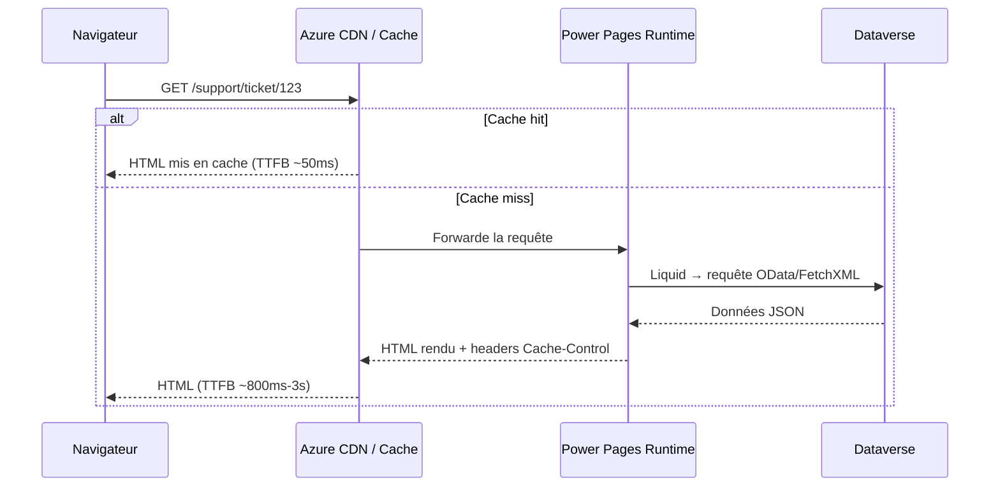

# Performance, SEO et exploitation — Diagnostiquer et optimiser vos solutions Power Pages

## Objectifs pédagogiques

À l'issue de ce module, vous serez capable de :

1. **Identifier** les goulots d'étranglement de performance dans un portail Power Pages via des outils de diagnostic standards
2. **Interpréter** les métriques Web Vitals (LCP, CLS, INP) dans le contexte d'un portail Power Pages
3. **Appliquer** les leviers de cache, CDN et rendu côté serveur disponibles nativement dans Power Pages
4. **Configurer** les métadonnées SEO critiques (balises, sitemap, robots.txt) depuis l'interface de gestion
5. **Construire** une stratégie de monitoring exploitable en production

---

## Mise en situation

Vous venez de livrer un portail de support client sur Power Pages. L'authentification, les flux Power Automate, la sécurité Dataverse — tout fonctionne. Vos tests en dev sont concluants.

Deux semaines après le go-live, les retours terrain arrivent : "La page d'accueil met 6 secondes à s'afficher", "Le portail n'apparaît pas dans Google", "Sur mobile c'est inutilisable". Le produit est bon, mais personne n'en profite vraiment.

C'est le problème classique du "ça marche, mais ça ne performe pas". Ce module vous donne les outils pour poser le bon diagnostic, puis actionner les bons leviers — sans réécrire l'architecture que vous avez déjà validée.

---

## Ce que vous devez avoir en tête avant de commencer

Power Pages est un portail web *managé* : vous ne contrôlez pas l'infrastructure sous-jacente (Nginx, IIS, Azure CDN). Cela change radicalement l'angle d'optimisation. Vous ne pouvez pas tuner le serveur. En revanche, vous avez une surface de configuration significative sur le *contenu*, le *cache*, les *métadonnées* et le *comportement des requêtes Dataverse*.

La conséquence directe : 80% des problèmes de performance sur Power Pages viennent soit des requêtes Dataverse mal structurées, soit du rendu de composants Liquid non optimisés, soit de ressources statiques non cachées. Rarement de l'infrastructure elle-même.

---

## Comprendre le cycle de rendu d'une page Power Pages

Avant de diagnostiquer, il faut savoir *ce qui se passe* entre le clic de l'utilisateur et l'affichage de la page.



Ce diagramme dit l'essentiel : la latence perçue dépend en grande partie de si la page est en cache ou non. Et si elle ne l'est pas, c'est le temps de traitement Liquid + aller-retour Dataverse qui domine.

🧠 **Concept clé** — Le TTFB (Time To First Byte) sur Power Pages oscille typiquement entre 50ms (cache CDN) et 2-3s (rendu complet avec Dataverse). C'est le premier indicateur à surveiller.

---

## Diagnostic : poser les bons outils avant de corriger

### L'audit Lighthouse comme point de départ

Lighthouse (intégré à Chrome DevTools, onglet *Lighthouse*) produit un score composite sur 4 axes : Performance, Accessibilité, Bonnes pratiques, SEO. Sur Power Pages, ce qui intéresse en priorité c'est la section **Performance** et ses métriques sous-jacentes.

Les trois métriques Web Vitals qui comptent vraiment :

| Métrique | Ce qu'elle mesure | Seuil "bon" | Causes fréquentes sur PP |
|---|---|---|---|
| **LCP** (Largest Contentful Paint) | Temps d'affichage du plus grand élément visible | < 2,5s | Image hero non compressée, TTFB élevé, CSS bloquant |
| **CLS** (Cumulative Layout Shift) | Stabilité visuelle pendant le chargement | < 0,1 | Fonts chargées tard, composants PCF sans dimensions déclarées |
| **INP** (Interaction to Next Paint) | Réactivité aux clics/saisies | < 200ms | JS lourd, EventListeners mal gérés sur des listes Liquid |

⚠️ **Erreur fréquente** — Beaucoup d'équipes mesurent les performances en étant connectées au portail. Or, Power Pages applique un comportement de cache différent selon que l'utilisateur est authentifié ou anonyme. **Toujours auditer en navigation privée** pour représenter le cas le plus fréquent (visiteur anonyme ou premier chargement).

### Inspecter le réseau : ce qui bloque vraiment

Dans l'onglet *Network* de Chrome DevTools, activez le *waterfall* et cherchez :

1. **Les requêtes en cascade** — une ressource qui attend la précédente avant de se charger (souvent des scripts synchrones dans le `<head>`)
2. **Les appels `/_api/`** — ce sont des appels OData directs depuis le front (Power Pages les génère pour certains composants). Un appel qui prend > 1s signale souvent une requête Dataverse sans filtre ou sur une table volumineuse
3. **Le header `X-Cache`** — s'il vaut `MISS`, la page n'est pas servie depuis le CDN. S'il vaut `HIT`, le cache fonctionne

💡 **Astuce** — Filtrez le réseau par `Fetch/XHR` pour isoler uniquement les appels API. Sur une page bien optimisée, vous ne devriez pas voir plus de 2-3 appels côté client au chargement initial.

---

## Les leviers de performance actionnables

### 1. Cache côté portail

Power Pages propose un cache de sortie configurable au niveau des pages et des entités web. Il se configure dans le portail d'administration via **Paramètres du portail → Cache du portail**.

Le comportement par défaut est conservateur : les pages authentifiées ne sont jamais mises en cache, les pages anonymes le sont avec un TTL court (15 minutes). Vous pouvez ajuster cela par page en modifiant l'attribut `Cache-Control` dans les en-têtes de réponse de la *Web Page*.

```
Settings → Content → Web Pages → [Page cible] → Advanced → Custom HTTP Headers
→ Ajouter : Cache-Control: public, max-age=3600
```

⚠️ **Erreur fréquente** — Mettre en cache des pages qui contiennent des données utilisateur (profil, historique de tickets). Le cache ne discrimine pas les utilisateurs sur les pages anonymes. Si votre page Liquid utilise ``, assurez-vous que cette section n'est pas incluse dans le fragment mis en cache.

### 2. Optimisation des requêtes Liquid/Dataverse

C'est généralement là que se jouent les gains les plus importants. Liquid est un langage de templating qui s'exécute côté serveur au moment du rendu — chaque `` ou `` déclenche une requête vers Dataverse.

Les règles d'or :

**Limiter les colonnes récupérées.** Une requête FetchXML qui ramène toutes les colonnes d'une table avec 50 attributs est massivement plus lente qu'une requête avec 4 colonnes ciblées.

```xml
<!-- ❌ Récupère tout, lent sur tables volumineuses -->

  <fetch>
    <entity name="incident">
    </entity>
  </fetch>


<!-- ✅ Ciblé, rapide -->

  <fetch top="10">
    <entity name="incident">
      <attribute name="title" />
      <attribute name="ticketnumber" />
      <attribute name="statecode" />
      <filter>
        <condition attribute="statecode" operator="eq" value="0" />
      </filter>
    </entity>
  </fetch>

```

**Éviter les boucles Liquid qui génèrent des requêtes imbriquées.** Un `` qui contient lui-même un `` produit N requêtes Dataverse pour N éléments de la liste. C'est l'équivalent d'un problème N+1 en ORM.

🧠 **Concept clé** — Power Pages exécute Liquid de manière synchrone et séquentielle. Il n'y a pas de parallélisation des requêtes Dataverse dans le moteur de rendu. Deux `` successifs = deux aller-retours séquentiels vers Dataverse.

### 3. Ressources statiques : images et scripts

Les images sont souvent le premier poste de gagnants rapides. Power Pages sert les fichiers uploadés depuis le *Content Repository* du portail, mais sans compression automatique.

Actions concrètes :
- Convertir les images en **WebP** avant upload (gain moyen : 30-50% sur le poids)
- Déclarer explicitement les dimensions `width` et `height` sur les balises `` dans vos templates Liquid — cela élimine le CLS causé par les images qui "poussent" le contenu pendant le chargement
- Pour les scripts tiers (analytics, chat, etc.), utiliser les attributs `async` ou `defer` dans le bloc *Footer* du portail pour éviter qu'ils bloquent le rendu

```html
<!-- Dans Content Snippets → Footer (ou Bottom Scripts) -->
<script defer src="https://votre-analytics.example.com/script.js"></script>
```

---

## SEO : ce que Power Pages gère, ce que vous devez configurer

### Ce qui est géré automatiquement

Power Pages génère automatiquement un **sitemap XML** à l'URL `/sitemap.xml`. Ce sitemap inclut toutes les pages publiées dont la visibilité est "Public". Vous n'avez rien à faire pour l'activer — mais vous devez vérifier que les pages que vous voulez indexer ont bien ce paramètre, et que celles que vous ne voulez *pas* indexer sont en "Private" ou portent la balise `<meta name="robots" content="noindex">`.

Le **robots.txt** est accessible à `/robots.txt` et peut être personnalisé depuis :

```
Portail d'administration → SEO → robots.txt
```

Par défaut, il autorise l'indexation de toutes les pages publiques. Ajoutez manuellement les règles `Disallow` pour vos routes d'API internes ou vos pages de processus.

### Métadonnées SEO par page

Chaque *Web Page* dans Power Pages expose trois champs SEO directement dans l'interface :

| Champ | Emplacement | Longueur recommandée |
|---|---|---|
| **Meta Title** | Advanced → SEO | 50-60 caractères |
| **Meta Description** | Advanced → SEO | 150-160 caractères |
| **Meta Keywords** | Advanced → SEO | Peu d'impact aujourd'hui, mais respecter quand même |

💡 **Astuce** — Si vous gérez un portail avec des centaines de pages générées dynamiquement (ex : une fiche produit par enregistrement Dataverse), vous ne pouvez pas renseigner ces champs manuellement. Utilisez Liquid dans le template de page pour injecter les métadonnées depuis les données de l'enregistrement :

```liquid

<title>{{ product.name }} — Mon Portail Support</title>
<meta name="description" content="{{ product.description | truncate: 155 }}" />
```

### Open Graph et partage social

Power Pages ne génère pas les balises Open Graph par défaut. Si votre portail doit être partageable sur LinkedIn ou Teams, ajoutez ces balises dans le *Header* de vos templates :

```html
<meta property="og:title" content="{{ page.title }}" />
<meta property="og:description" content="{{ page.description }}" />
<meta property="og:url" content="{{ request.url }}" />
<meta property="og:image" content="https://votre-portail.powerappsportals.com/og-image.jpg" />
```

---

## Monitoring en production : ne pas piloter à l'aveugle

### Application Insights

Power Pages s'intègre nativement avec Azure Application Insights. Une fois la clé d'instrumentation configurée dans les paramètres du portail, vous récupérez automatiquement :

- Les durées de chargement de pages (par URL)
- Les exceptions JavaScript côté client
- Les échecs de requêtes vers l'API Dataverse (`/_api/`)

La configuration se fait depuis :

```
Portail d'administration → Diagnostic → Application Insights → [Clé d'instrumentation]
```

Une fois connecté, la requête KQL suivante dans Log Analytics vous donne les pages les plus lentes :

```kusto
pageViews
| where timestamp > ago(7d)
| summarize avg(duration), count() by name
| order by avg_duration desc
| take 20
```

### Alertes à mettre en place dès le go-live

Ne pas attendre les retours utilisateurs pour détecter une dégradation. Configurez au minimum :

- **Alerte sur TTFB moyen > 2s** sur les 5 dernières minutes (Application Insights → Alerts)
- **Alerte sur taux d'erreur HTTP 5xx > 1%** — signale un problème Dataverse ou un timeout de flux
- **Alerte sur disponibilité** via un *Availability Test* Application Insights qui ping `/` toutes les 5 minutes depuis 3 régions

⚠️ **Erreur fréquente** — Configurer des alertes uniquement sur la disponibilité (up/down). Une page qui répond en 8 secondes est techniquement "disponible" mais inutilisable. Les métriques de latence sont tout aussi critiques.

---

## Anti-patterns fréquents et comment les corriger

Ce sont les erreurs que l'on retrouve sur presque tous les portails Power Pages en production. Pas parce que les équipes manquent de compétences, mais parce que ces pièges ne sont pas évidents au moment du développement.

**Anti-pattern 1 — Tout mettre dans une seule page Liquid avec 10 fetchxml**

Le symptôme : une page d'accueil qui "fait tout" — actualités, tickets ouverts, KPIs, liens rapides — et qui met 4 secondes à charger. Chaque section est un `fetchxml` supplémentaire.

La correction : fragmenter en composants chargés de manière asynchrone via des appels `fetch()` JavaScript côté client vers l'API Dataverse, ou utiliser des *Basic Forms* et *List Components* qui bénéficient du cache natif Power Pages.

**Anti-pattern 2 — Désactiver le cache "pour être sûr"**

On voit régulièrement des équipes qui ajoutent `Cache-Control: no-cache, no-store` sur toutes les pages pendant le développement... et oublient de revenir en arrière en production. Le portail devient 40 à 60 fois plus lent que ce qu'il pourrait être.

La correction : auditer les headers de réponse de chaque page clé avec `curl -I https://votre-portail.powerappsportals.com/` et vérifier que `X-Cache: HIT` apparaît sur le second appel pour les pages anonymes.

**Anti-pattern 3 — Ignorer le mobile**

Lighthouse donne deux scores distincts : desktop et mobile. Les portails Power Pages sont souvent conçus sur écran large et testés sur desktop. Le score mobile est régulièrement 20 à 30 points plus bas, notamment à cause de scripts tiers non optimisés et d'images surdimensionnées.

La correction : passer systématiquement en mode *Mobile* dans Lighthouse avant toute mise en production. C'est souvent là que les vrais problèmes se révèlent.

---

## Cas réel : audit et remédiation d'un portail RH

**Contexte** — Portail Power Pages de gestion des demandes RH (~2000 utilisateurs internes). Après 3 mois en production, les équipes support remontent des plaintes sur la lenteur de la page "Mes demandes".

**Diagnostic initial**

Score Lighthouse Desktop : 61/100 (Performance). LCP : 4,2s. Le waterfall réseau révèle trois appels `/_api/` successifs au chargement de la page, dont un qui prend 2,1 secondes à lui seul.

En inspectant le template Liquid de la page, on trouve :

```liquid

<fetch>
  <entity name="rh_demande">
    <!-- Aucun filtre, aucune limite de colonnes -->
  </entity>
</fetch>

```

La table `rh_demande` contient 45 000 enregistrements. Sans filtre, Dataverse renvoie tout.

**Remédiations appliquées**

1. Ajout d'un filtre sur `ownerid` (l'utilisateur courant) et limitation à 20 enregistrements avec `top="20"` → la requête passe de 2,1s à 180ms
2. Réduction des colonnes FetchXML à 6 attributs nécessaires à l'affichage
3. Activation du cache pour les ressources statiques (CSS, JS) via headers `Cache-Control: public, max-age=86400`
4. Compression et conversion en WebP des 4 images de la page d'accueil (gain : 1,2 MB → 340 KB)

**Résultats après correction**

Score Lighthouse Desktop : 88/100. LCP : 1,9s. Retours utilisateurs : plaintes supprimées en 2 semaines.

🧠 **À retenir** — Dans ce cas, 85% du gain de performance venait d'une seule ligne Liquid mal écrite. Pas d'infrastructure, pas de CDN supplémentaire, pas de refonte. Juste un fetchxml sans filtre.

---

## Résumé

Performance et SEO sur Power Pages ne se jouent pas au niveau de l'infrastructure — vous n'y avez pas accès. Les vrais leviers sont dans votre code Liquid, vos requêtes Dataverse et la configuration des métadonnées.

Le diagnostic doit toujours commencer par Lighthouse en navigation privée, suivi d'une inspection du waterfall réseau pour isoler les appels `/_api/` lents. Dans 80% des cas, le problème se résout en ajoutant des filtres et des limites de colonnes dans les `fetchxml`.

Pour le SEO, Power Pages génère le sitemap et le robots.txt automatiquement, mais les métadonnées par page doivent être renseignées manuellement ou injectées via Liquid pour les pages dynamiques. Le monitoring via Application Insights est indispensable — configurer les alertes de latence dès le go-live, pas uniquement la disponibilité.

Le principal piège à éviter : optimiser en développement et supprimer les optimisations "pour tester", puis oublier de les réactiver. Traiter le cache et les headers HTTP comme du code — les inclure dans votre ALM, pas en dehors.

---

<!-- snippet
id: powerpages_fetchxml_filter
type: warning
tech: Power Pages
level: intermediate
importance: high
format: knowledge
tags: liquid, fetchxml, dataverse, performance, requete
title: FetchXML sans filtre ni top — piège majeur de performance
content: Un  sans clause <filter> ni attribut top="" interroge TOUS les enregistrements de la table. Sur une table de 10 000+ lignes, cela génère un TTFB de plusieurs secondes. Toujours ajouter top="20" (ou la limite métier) et un filtre sur ownerid ou statecode minimum.
description: Sans top ni filter, Dataverse renvoie toute la table — premier responsable des pages Power Pages à 3-5s de chargement.
-->

<!-- snippet
id: powerpages_xcache_header
type: tip
tech: Power Pages
level: intermediate
importance: high
format: knowledge
tags: cache, cdn, performance, headers, diagnostic
title: Vérifier si le CDN Power Pages sert depuis son cache
content: Exécuter `curl -I https://votre-portail.powerappsportals.com/` deux fois. Si le header X-Cache vaut HIT sur le second appel, la page est servie depuis le CDN Azure (~50ms TTFB). Si MISS, le rendu est complet côté serveur (~800ms-3s). Première chose à vérifier lors d'un diagnostic de lenteur.
description: X-Cache: HIT = CDN actif (~50ms). X-Cache: MISS = rendu serveur complet (~800ms-3s). Diagnostique immédiat de l'état du cache.
-->

<!-- snippet
id: powerpages_lighthouse_anonymous
type: warning
tech: Power Pages
level: intermediate
importance: high
format: knowledge
tags: lighthouse, performance, audit, cache, diagnostic
title: Toujours auditer Power Pages en navigation privée
content: Power Pages applique un cache différent pour les utilisateurs authentifiés (pas de cache) et anonymes (cache CDN). Auditer en étant connecté donne un score artificiel qui ne représente pas la majorité des utilisateurs. Toujours lancer Lighthouse en navigation privée, déconnecté du portail.
description: Audit en session connectée = cache désactivé = score faussement bas. La navigation privée représente le cas réel de l'utilisateur anonyme ou premier chargement.
-->

<!-- snippet
id: powerpages_liquid_nplus1
type: error
tech: Power Pages
level: advanced
importance: high
format: knowledge
tags: liquid, fetchxml, performance, nplus1, boucle
title: Problème N+1 dans les boucles Liquid Power Pages
content: Symptôme : page lente avec N éléments dans une liste. Cause : un  imbriqué dans un  génère N requêtes Dataverse séquentielles (Liquid est synchrone, sans parallélisation). Correction : récupérer toutes les données en une seule requête FetchXML avant la boucle, puis filtrer côté Liquid avec .
description: Fetchxml dans une boucle for = N requêtes Dataverse séquentielles. Extraire la requête hors de la boucle et filtrer en Liquid.
-->

<!-- snippet
id: powerpages_seo_dynamic_meta
type: tip
tech: Power Pages
level: intermediate
importance: medium
format: knowledge
tags: seo, liquid, metadata, open-graph, template
title: Injecter des métadonnées SEO dynamiques depuis Dataverse en Liquid
content: Pour les pages générées dynamiquement (fiche produit, article), utiliser Liquid dans le template head pour injecter title et description depuis l'enregistrement Dataverse : ` <title>{{ item.name }}</title> <meta name="description" content="{{ item.description | truncate: 155 }}" />`. Évite de renseigner manuellement N pages dans l'interface.
description: Sans cela, toutes vos pages dynamiques partagent le même title/description générique — catastrophique pour le SEO et le partage social.
-->

<!-- snippet
id: powerpages_appinsights_slowpages
type: tip
tech: Power Pages
level: advanced
importance: medium
format: knowledge
tags: application-insights, monitoring, kql, performance, production
title: Requête KQL pour identifier les pages les plus lentes en production
content: Dans Log Analytics lié à Application Insights : `pageViews | where timestamp > ago(7d) | summarize avg(duration), count() by name | order by avg_duration desc | take 20`. Donne le top 20 des pages par durée moyenne sur 7 jours. À exécuter en premier lors d'un audit post go-live.
description: Remplace les retours utilisateurs subjectifs par des données objectives sur les pages réellement lentes — classées par durée moyenne.
-->

<!-- snippet
id: powerpages_cache_authenticated
type: warning
tech: Power Pages
level: intermediate
importance: high
format: knowledge
tags: cache, securite, authentification, donnees-utilisateur, liquid
title: Ne jamais cacher une page contenant des données utilisateur personnalisées
content: Le cache Power Pages ne discrimine pas les utilisateurs sur les pages anonymes. Si votre template Liquid utilise `` ou affiche des données liées à l'utilisateur connecté, ne pas activer Cache-Control: public sur cette page — tous les visiteurs recevraient le contenu mis en cache du premier utilisateur.
description: Cache-Control: public sur une page avec  = risque de fuite de données entre utilisateurs. Réserver le cache aux pages strictement anonymes.
-->

<!-- snippet
id: powerpages_webvitals_cls_images
type: tip
tech: Power Pages
level: intermediate
importance: medium
format: knowledge
tags: cls, webvitals, images, performance, liquid
title: Éliminer le CLS causé par les images en déclarant leurs dimensions
content: Dans les templates Liquid, toujours déclarer width et height sur les balises img : ``. Sans dimensions déclarées, le navigateur réserve 0px puis "pousse" le contenu quand l'image charge — CLS élevé garanti. Gain typique : CLS passe de 0,25 à < 0,05.
description: Dimensions manquantes sur img = le layout saute pendant le chargement (CLS). Déclarer width/height permet au navigateur de réserver l'espace avant le chargement.
-->

<!-- snippet
id: powerpages_sitemap_visibility
type: tip
tech: Power Pages
level: beginner
importance: medium
format: knowledge
tags: seo, sitemap, visibilite, indexation, configuration
title: Le sitemap Power Pages n'inclut que les pages en visibilité "Public"
content: Power Pages génère /sitemap.xml automatiquement, mais uniquement pour les Web Pages dont la visibilité est définie sur "Public". Vérifier dans le portail d'administration → Content → Web Pages → [Page] → Visibility. Une page "Private" ou "Authenticated" n'apparaît pas dans le sitemap et ne sera pas indexée par les moteurs de recherche.
description: Vérification à faire systématiquement : les pages importantes du portail sont-elles bien en visibilité Public dans les paramètres de la Web Page ?
-->

<!-- snippet
id: powerpages_scripts_defer
type: tip
tech: Power Pages
level: intermediate
importance: medium
format: knowledge
tags: performance, javascript, rendu, scripts-tiers, defer
title: Charger les scripts tiers avec defer dans le footer Power Pages
content: Ajouter les scripts analytics, chat et tracking dans Content Snippets → Bottom Scripts (ou Footer) avec l'attribut defer : `<script defer src="https://analytics.example.com/script.js"></script>`. Sans defer, un script dans le head bloque tout le rendu HTML — LCP et FCP dégradés de 500ms à 2s selon la taille du script.
description: Scripts tiers dans le head sans defer = rendu bloqué jusqu'au chargement complet du script. defer les exécute après le parsing HTML sans bloquer l'affichage.
-->
