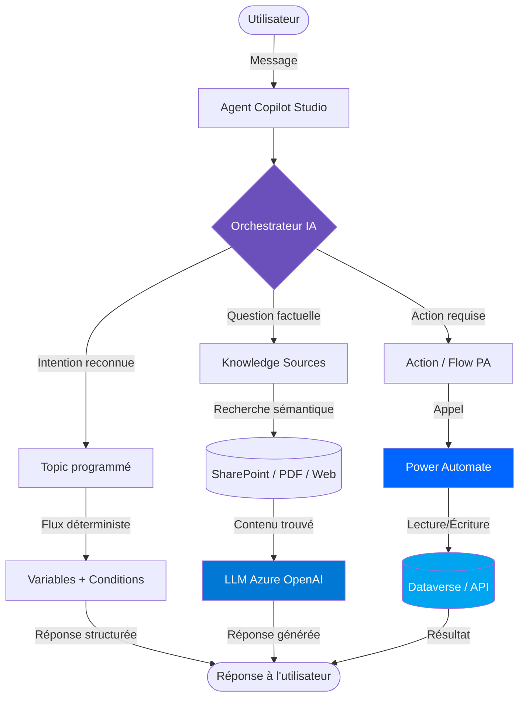

# Concepts Copilot Studio

## Objectifs pédagogiques

À l'issue de ce module, vous serez capable de :

- Expliquer ce qu'est Copilot Studio et pourquoi il existe dans l'écosystème Power Platform
- Distinguer un agent, un topic, une action et un knowledge source — et comprendre comment ces quatre briques s'articulent
- Décrire le rôle du LLM dans Copilot Studio par rapport à la logique de conversation programmée
- Identifier les cas d'usage adaptés à Copilot Studio vs ceux qui ne le sont pas
- Lire le schéma d'une conversation et situer où intervient l'IA générative vs le flux déterministe

---

## Mise en situation

Votre entreprise vient de déployer un portail RH sur Power Pages. Les collaborateurs peuvent y consulter leurs fiches de paie, poser des congés, et accéder aux politiques internes. Mais depuis l'ouverture du portail, le service RH reçoit encore 200 mails par semaine — des questions du type : *"Combien de jours de RTT me reste-t-il ?"*, *"Comment poser un congé exceptionnel ?"*, ou *"Où se trouve le formulaire de remboursement de frais ?"*

La réponse à 80 % de ces questions est déjà disponible quelque part : dans un document SharePoint, dans une page du portail, dans Dataverse. Le problème, c'est que les utilisateurs ne savent pas où chercher.

C'est exactement le type de problème que Copilot Studio est conçu à résoudre. Pas en remplaçant un vrai système de gestion, mais en ajoutant une couche conversationnelle qui guide les utilisateurs, répond aux questions fréquentes, et déclenche des actions simples — sans que le service RH ait à intervenir.

---

## Contexte — Pourquoi Copilot Studio dans Power Platform ?

Pendant longtemps, si vous vouliez intégrer un chatbot dans une solution Microsoft, vous deviez passer par Azure Bot Service, écrire du code C#, gérer des endpoints REST, et vous battre avec LUIS pour la reconnaissance d'intention. C'était puissant, mais hors de portée pour la plupart des équipes fonctionnelles.

Copilot Studio (anciennement *Power Virtual Agents*, racheté et refondu) change la donne : c'est un outil no-code/low-code qui permet de créer des agents conversationnels en quelques heures, directement dans le portail Power Platform. Et depuis 2023-2024, il est profondément enrichi avec l'IA générative de Microsoft — c'est-à-dire GPT-4 via Azure OpenAI Service.

Ce qui le rend intéressant dans l'écosystème Power Platform, c'est qu'il n'est pas isolé. Un agent Copilot Studio peut appeler un flow Power Automate, lire des données Dataverse, s'intégrer dans Teams ou un portail Power Pages, et exploiter les mêmes connecteurs que le reste de la plateforme. C'est la même logique de convergence qu'on retrouve partout dans Power Platform : un socle commun, des outils qui parlent entre eux.

---

## Concepts fondamentaux

### Ce qu'est réellement un "agent"

Dans Copilot Studio, on ne parle plus de "chatbot" mais d'**agent**. La nuance n'est pas que cosmétique. Un chatbot classique répond à des messages. Un agent, lui, peut raisonner, consulter des sources, déclencher des actions et maintenir un fil de conversation cohérent sur plusieurs tours.

🧠 **Concept clé** — Un agent dans Copilot Studio est une combinaison de trois choses : une logique de conversation (les topics), des sources de connaissance (documents, sites, Dataverse), et des capacités d'action (appels à Power Automate ou à des API). Le LLM est le liant qui rend tout ça cohérent du point de vue de l'utilisateur.

Concrètement, quand un utilisateur envoie un message, l'agent doit décider quoi faire. Est-ce une question à laquelle une règle programmée répond ? Est-ce quelque chose qu'il peut trouver dans un document ? Doit-il déclencher une action ? Ce raisonnement — choisir la bonne brique à activer — c'est là qu'intervient l'IA générative.

---

### Les quatre briques constitutives

Voici les quatre concepts sur lesquels tout le reste est construit. On les voit ensemble ici pour comprendre leur relation, même si chacun fera l'objet de modules dédiés plus loin.

#### Topics — la logique de conversation programmée

Un **topic** est un scénario conversationnel que vous avez explicitement défini. Il se déclenche quand l'utilisateur exprime une intention particulière (*"Je veux poser un congé"*, *"Quel est mon solde de RTT ?"*) et suit un flux que vous avez dessiné : poser des questions, brancher des conditions, appeler une action, retourner une réponse.

C'est la partie **déterministe** de l'agent. Vous contrôlez exactement ce qui se passe.

#### Knowledge — les sources de connaissance

Un agent peut être connecté à des **sources de connaissance** : documents SharePoint, sites web publics, bases Dataverse, fichiers PDF uploadés directement. Quand l'utilisateur pose une question qui ne correspond à aucun topic programmé, l'agent interroge ces sources et génère une réponse grâce au LLM.

C'est la partie **générative** de l'agent. Vous ne contrôlez pas mot pour mot la réponse, mais vous contrôlez les sources sur lesquelles elle s'appuie.

#### Actions — ce que l'agent peut faire

Les **actions** permettent à l'agent de ne pas se limiter à répondre — il peut agir. Concrètement, il peut appeler un flow Power Automate (qui lui-même peut créer un enregistrement Dataverse, envoyer un mail, mettre à jour une liste SharePoint…), interroger un connecteur, ou appeler une API HTTP. C'est ce qui transforme un chatbot informatif en assistant opérationnel.

#### Variables — la mémoire du contexte

Les **variables** permettent de stocker des informations au fil de la conversation — le nom de l'utilisateur, le type de demande, un choix fait à l'étape précédente — et de les réutiliser dans les étapes suivantes ou dans les actions. Sans variables, chaque tour de conversation est amnésique.

---

### LLM vs flux déterministe — comprendre la tension

C'est la subtilité centrale de Copilot Studio. La plupart des outils IA vous donnent soit un LLM libre (puissant mais imprévisible), soit un arbre de décision rigide (prévisible mais limité). Copilot Studio tente de combiner les deux.

Pensez-y comme un GPS avec une option "mode manuel". Normalement, le GPS (le LLM) choisit la route. Mais sur certains tronçons critiques, vous avez planté des panneaux de direction obligatoires (les topics) que le GPS doit suivre, peu importe ce qu'il "penserait" faire. Vous gardez le contrôle sur ce qui compte, et vous laissez l'IA gérer le reste.

⚠️ **Erreur fréquente** — Beaucoup de débutants pensent que plus on programme de topics, mieux c'est. En réalité, sur-programmer des topics rigides empêche l'agent d'exploiter l'IA générative là où elle serait plus efficace. L'équilibre entre déterminisme et génératif est une décision d'architecture, pas un paramètre de performance.

---

## Architecture d'un agent — vue d'ensemble

Ce schéma illustre une vérité simple : quand un message arrive, c'est l'**orchestrateur IA** qui décide du chemin. Il peut aller vers un topic (logique programmée), vers les sources de connaissance (LLM générative), ou vers une action externe. Ces chemins ne sont pas exclusifs — une conversation peut emprunter les trois sur des tours différents.

---

## Les canaux de déploiement

Un agent Copilot Studio ne vit pas en isolation. Une fois créé, vous pouvez le publier sur plusieurs canaux selon où se trouvent vos utilisateurs :

- **Microsoft Teams** — le canal le plus fréquent en entreprise. L'agent apparaît comme un contact ou un bot dans une équipe.
- **Power Pages** — pour intégrer l'agent directement dans un portail web, via un widget de chat.
- **Site web personnalisé** — via un snippet de code iFrame ou JavaScript que vous intégrez dans n'importe quelle page.
- **Sharepoint** — intégration native dans des pages SharePoint.
- **API directe** — pour les développeurs qui veulent appeler l'agent depuis une application custom.

💡 **Astuce** — Le canal Teams est le plus simple à configurer et il bénéficie d'une authentification automatique via Azure AD. Vous n'avez pas à programmer de logique de connexion : l'agent connaît déjà l'identité de l'utilisateur.

---

## Ce que Copilot Studio n'est pas

Avant d'aller plus loin, quelques clarifications utiles sur ce qu'on ne fait *pas* avec Copilot Studio :

**Ce n'est pas un moteur de workflow.** Pour automatiser un processus métier complexe avec des branchements, des approbations humaines, des boucles et des intégrations multi-systèmes, Power Automate est l'outil. Copilot Studio appelle des flows, il ne les remplace pas.

**Ce n'est pas une base de connaissance.** Copilot Studio consomme des sources de connaissance existantes — il ne gère pas, ne structure pas, ne versionne pas ces documents. SharePoint, Dataverse ou un wiki restent la source de vérité.

**Ce n'est pas un LLM souverain.** Copilot Studio utilise Azure OpenAI Service en coulisse. Vous ne choisissez pas le modèle, vous ne faites pas de fine-tuning, vous ne contrôlez pas les paramètres de génération au niveau bas. C'est une couche d'orchestration, pas une plateforme ML.

---

## Cas d'usage adaptés vs inadaptés

Tous les problèmes ne méritent pas un agent conversationnel. Voici une lecture honnête :

| Situation | Copilot Studio adapté ? | Pourquoi |
|---|---|---|
| FAQ interne RH/IT avec 50-200 questions fréquentes | ✅ Oui | Knowledge + LLM gèrent très bien ce volume |
| Qualification de leads entrants sur un site | ✅ Oui | Topics structurés + collecte de variables |
| Prise de rendez-vous avec vérification dispo | ✅ Oui | Action → flow → calendrier |
| Processus d'approbation multi-niveaux | ❌ Non | Power Automate est plus adapté |
| Analyse de données complexe | ❌ Non | Power BI + Copilot pour Analytics |
| Génération de documents longs et structurés | ⚠️ Partiel | Possible via flow, mais ce n'est pas le point fort |
| Support client avec escalade à un humain | ✅ Oui | Fonctionnalité de handoff humain intégrée |

---

## Le rôle de Dataverse dans l'agent

Dataverse joue deux rôles distincts ici. D'abord, il peut être une **source de connaissance** : l'agent peut y chercher des informations pour répondre à des questions (*"Quel est le statut de ma demande ?"*). Ensuite, via Power Automate, il peut être une **cible d'action** : l'agent peut créer, modifier ou supprimer des enregistrements (*"Créer une demande de congé pour le 15 juillet"*).

🧠 **Concept clé** — Dataverse n'est pas directement "branché" à l'agent comme une base SQL qu'on interrogerait librement. L'accès se fait soit via le connecteur Knowledge (pour la recherche), soit via un flow Power Automate (pour les opérations CRUD). Cette indirection est importante : elle signifie que la sécurité Dataverse (rôles, colonnes masquées, règles métier) reste intacte.

---

## Résumé

Copilot Studio est la brique conversationnelle de Power Platform — conçue pour créer des agents qui répondent à des questions, guident des utilisateurs et déclenchent des actions, sans écrire une ligne de code back-end. Sa force vient de la combinaison entre deux modes : des topics déterministes que vous programmez pour les scénarios critiques, et un moteur génératif (LLM Azure OpenAI) qui prend le relais pour les questions ouvertes en s'appuyant sur vos sources de connaissance. Les quatre briques à retenir — topics, knowledge, actions, variables — s'articulent autour d'un orchestrateur IA qui choisit le bon chemin à chaque tour de conversation. Le déploiement sur Teams, Power Pages ou un site web se fait sans développement supplémentaire. Ce que Copilot Studio ne remplace pas : Power Automate pour les workflows complexes, Dataverse pour la gestion des données, Power BI pour l'analyse. Il complète l'écosystème, il ne le substitue pas.

---

<!-- snippet
id: copilot_studio_concept_agent
type: concept
tech: Copilot Studio
level: beginner
importance: high
format: knowledge
tags: agent, topic, knowledge, action, orchestration
title: Ce qu'est un agent dans Copilot Studio
content: Un agent Copilot Studio combine trois briques : des topics (flux déterministes que vous programmez), des knowledge sources (documents/SharePoint/Dataverse interrogés par le LLM), et des actions (appels à Power Automate ou des API). L'orchestrateur IA choisit à chaque message laquelle de ces briques activer. Ce n'est pas un chatbot à arbre de décision pur, ni un LLM libre : c'est une combinaison contrôlée des deux.
description: L'agent n'est pas le LLM — le LLM est l'une des trois briques. L'orchestrateur décide du chemin à chaque tour.
-->

<!-- snippet
id: copilot_studio_concept_topic_vs_llm
type: concept
tech: Copilot Studio
level: beginner
importance: high
format: knowledge
tags: topic, llm, deterministe, generatif, orchestration
title: Topic déterministe vs réponse générative — la distinction clé
content: Un topic est un flux que vous avez entièrement programmé : quand l'intention est reconnue, l'agent suit ce chemin précisément. La réponse générative intervient quand aucun topic ne correspond : l'agent cherche dans ses knowledge sources et le LLM formule une réponse. Vous contrôlez les sources, pas la formulation exacte. Ces deux modes coexistent dans le même agent et sur des tours de conversation différents.
description: Sur-programmer des topics bloque l'IA générative là où elle serait plus efficace. L'équilibre est une décision d'architecture.
-->

<!-- snippet
id: copilot_studio_warning_topics_surplus
type: warning
tech: Copilot Studio
level: beginner
importance: high
format: knowledge
tags: topic, architecture, generatif, erreur-frequente
title: Trop de topics rigides nuit à la qualité de l'agent
content: Piège : vouloir programmer un topic pour chaque question possible → l'agent devient un arbre de décision rigide qui ne répond qu'aux formulations exactes prévues. Conséquence : les questions légèrement reformulées échouent ou tombent dans un topic par défaut. Correction : définir des topics uniquement pour les scénarios critiques ou transactionnels (poser un congé, escalader un ticket), et laisser le knowledge + LLM gérer les questions informatives.
description: Piège → sur-programmation → questions non prévues échouent. Correction : topics pour les actions, LLM pour les questions informatives.
-->

<!-- snippet
id: copilot_studio_concept_knowledge_source
type: concept
tech: Copilot Studio
level: beginner
importance: high
format: knowledge
tags: knowledge, sharepoint, dataverse, llm, recherche-semantique
title: Comment fonctionne une Knowledge Source dans Copilot Studio
content: Quand une question ne déclenche aucun topic, l'agent effectue une recherche sémantique dans les sources connectées (SharePoint, sites web, PDF, Dataverse). Le LLM (Azure OpenAI en coulisse) lit les passages pertinents trouvés et génère une réponse en langage naturel. Vous ne contrôlez pas la formulation exacte, mais vous contrôlez les sources. Si la source est incorrecte ou incomplète, la réponse l'est aussi — garbage in, garbage out.
description: Le LLM répond en se basant sur vos documents, pas sur ses données d'entraînement. Qualité de la réponse = qualité de la source.
-->

<!-- snippet
id: copilot_studio_concept_dataverse_acces
type: concept
tech: Copilot Studio
level: beginner
importance: medium
format: knowledge
tags: dataverse, action, power-automate, securite, acces
title: Comment l'agent accède à Dataverse — pas en direct
content: Copilot Studio n'interroge pas Dataverse comme une requête SQL directe. L'accès se fait par deux chemins : via le connecteur Knowledge (recherche en lecture pour répondre à des questions), ou via un flow Power Automate déclenché par une Action (pour créer, modifier, supprimer des enregistrements). Cette indirection préserve la sécurité Dataverse : les rôles, colonnes masquées et règles métier restent appliqués.
description: L'agent passe par un flow PA pour toute opération CRUD sur Dataverse. Les permissions Dataverse ne sont pas contournées.
-->

<!-- snippet
id: copilot_studio_tip_teams_auth
type: tip
tech: Copilot Studio
level: beginner
importance: medium
format: knowledge
tags: teams, authentification, azure-ad, deploiement, canal
title: Teams : l'authentification utilisateur est automatique
content: Déployer l'agent sur Teams (Paramètres → Canaux → Microsoft Teams) donne accès à l'identité de l'utilisateur via Azure AD sans aucune configuration d'authentification supplémentaire. La variable système `System.User.DisplayName` et `System.User.Email` sont disponibles nativement dans les topics. Pour les portails web ou iFrame, l'authentification doit être configurée manuellement.
description: Sur Teams, pas besoin de programmer la connexion : l'agent connaît déjà qui parle. Sur web, l'auth est à configurer explicitement.
-->

<!-- snippet
id: copilot_studio_concept_variable
type: concept
tech: Copilot Studio
level: beginner
importance: medium
format: knowledge
tags: variable, contexte, conversation, memoire
title: Les variables maintiennent le contexte entre les tours
content: Une variable dans Copilot Studio stocke une valeur collectée pendant la conversation (texte, nombre, choix, enregistrement Dataverse) et la rend réutilisable dans les étapes suivantes ou dans les actions. Sans variables, chaque message est traité indépendamment — l'agent oublie ce qui a été dit. Il existe trois portées : Topic (locale au topic), Conversation (persiste sur toute la session), Global (persiste entre sessions pour le même utilisateur).
description: Portée Variable : Topic = disparaît en fin de topic. Conversation = dure toute la session. Global = persiste entre sessions.
-->

<!-- snippet
id: copilot_studio_warning_pas_workflow
type: warning
tech: Copilot Studio
level: beginner
importance: medium
format: knowledge
tags: perimetre, workflow, power-automate, limite
title: Copilot Studio n'est pas un moteur de workflow
content: Piège : vouloir modéliser un processus métier complet (approbation multi-niveaux, boucles, délais, rappels) directement dans les topics. Conséquence : logique impossible ou fragile à maintenir. Correction : Copilot Studio déclenche une Action → Power Automate gère le workflow. L'agent collecte les informations et lance le flow ; c'est Power Automate qui orchestre le processus dans le temps.
description: Piège → modéliser un workflow dans les topics → limites rapides. Correction : topics pour la conversation, Power Automate pour le processus.
-->
