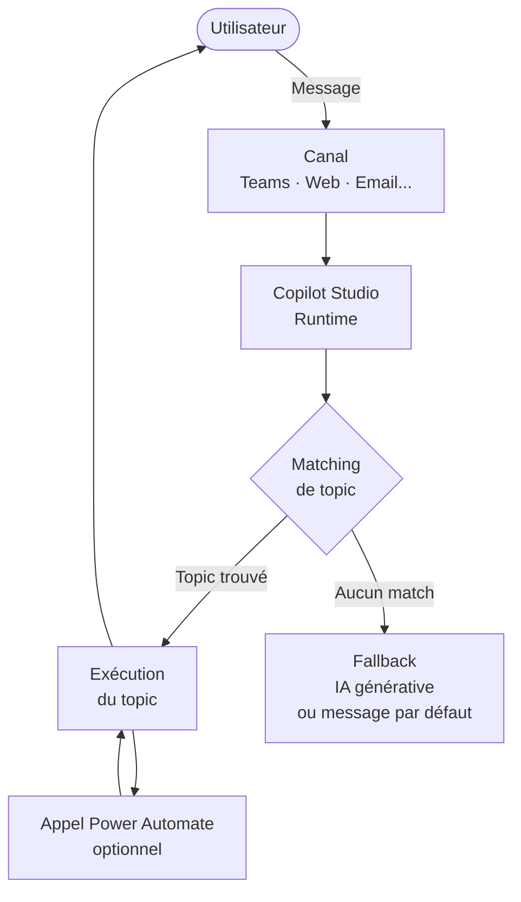

# Premier agent Copilot Studio

## Objectifs pédagogiques

À l'issue de ce module, vous serez capable de :

- Créer un agent depuis zéro dans Copilot Studio en configurant ses paramètres fondamentaux
- Construire un topic avec ses phrases déclencheuses et une séquence de messages
- Tester votre agent dans le volet de test intégré avant toute publication
- Publier un agent et le connecter à un canal de diffusion
- Comprendre où l'agent se bloque et comment en diagnostiquer la cause rapidement

---

## Mise en situation

Imaginez qu'un service RH reçoit chaque semaine les mêmes 50 questions par email : congés, notes de frais, badge, mutuelle. Un consultant vient de rejoindre l'équipe et sa première mission est de construire un agent conversationnel qui intercepte ces questions courantes et répond automatiquement — sans code, sans budget IA externe, en moins d'une journée.

C'est exactement ce que ce module vous apprend à faire. Pas un prototype académique : un agent fonctionnel, testé, publié, connecté à un vrai canal.

---

## Contexte — pourquoi Copilot Studio, pourquoi maintenant

Avant Copilot Studio (anciennement Power Virtual Agents), construire un chatbot d'entreprise impliquait soit du développement custom (Bot Framework, Azure), soit des outils SaaS coûteux difficiles à intégrer dans l'écosystème Microsoft. Le fossé entre "chatbot basique" et "chatbot intégré à Dataverse, Teams et Power Automate" était énorme.

Copilot Studio comble ce fossé. Il est pensé pour des utilisateurs qui connaissent leur métier mais ne veulent pas écrire du middleware. L'outil gère nativement l'intégration avec Microsoft 365, propose une IA générative en option, et s'inscrit dans la même gouvernance que le reste de la Power Platform.

Ce module se place juste après la découverte des concepts (topics, entités, triggers) — vous savez ce que c'est, maintenant vous allez construire.

---

## Architecture d'un agent Copilot Studio

Avant de cliquer sur "Créer", prenez trente secondes pour comprendre ce qui se passe sous le capot quand un utilisateur envoie un message.



| Composant | Rôle | Ce que vous configurez |
|---|---|---|
| **Canal** | Point d'entrée utilisateur | Teams, site web, custom... |
| **Runtime** | Moteur qui reçoit et route les messages | Géré par Microsoft |
| **Topic matching** | Associe le message à un topic via les phrases déclencheuses | Vos trigger phrases |
| **Topic** | Séquence de nœuds qui produit la réponse | Vos nœuds Message, Question, Action |
| **Fallback** | Réponse quand aucun topic ne matche | Topic système "Escalate" / IA générative |
| **Power Automate** | Logique externe, données, appels API | Flows déclenchés depuis un nœud Action |

🧠 **Concept clé** — Un agent Copilot Studio n'est pas un modèle de langage qui "comprend" librement. C'est un système de routage : le message de l'utilisateur est comparé aux phrases déclencheuses de tous vos topics, et le topic avec le meilleur score gagne. L'IA générative peut prendre le relais si aucun topic ne convient, mais la logique principale reste déterministe.

---

## Construction progressive — de zéro à un agent publié

### Étape 1 — Créer l'agent

Rendez-vous sur [copilotstudio.microsoft.com](https://copilotstudio.microsoft.com). Si vous avez déjà travaillé dans Power Apps ou Power Automate, vous retrouvez la même barre de navigation latérale et le même sélecteur d'environnement en haut à droite.

**Chemin :** `Accueil → Créer → Nouvel agent`

Renseignez trois choses :

- **Nom** : visible par les utilisateurs finaux, choisissez quelque chose de métier (ex. "Assistant RH")
- **Description** : utilisée par le moteur IA pour orienter les réponses génératives — soyez précis
- **Instructions** : le "ton" et les règles de l'agent (ex. "Réponds uniquement sur les sujets RH, en français, de manière concise")

💡 **Astuce** — La description et les instructions ne sont pas cosmétiques. Elles alimentent le prompt système de la couche IA générative. Un agent sans description précise aura tendance à répondre à n'importe quelle question hors-sujet.

Laissez les paramètres avancés (langue, icône) pour plus tard. Cliquez sur **Créer**.

---

### Étape 2 — Comprendre l'interface avant de toucher quoi que ce soit

Vous atterrissez sur le canvas de l'agent. Prenez deux minutes pour repérer :

- **Panneau gauche** : navigation entre Topics, Entités, Actions, Canaux, Analytics
- **Zone centrale** : canvas d'édition du topic sélectionné
- **Panneau droit** : propriétés du nœud sélectionné
- **Icône de test (bulle)** : volet de test en direct, accessible à tout moment

⚠️ **Erreur fréquente** — Beaucoup de débutants commencent à modifier les topics système (Greeting, Fallback, Escalate) sans les avoir lus. Ces topics sont déclenchés automatiquement dans des situations spécifiques. Les casser produit des comportements étranges très difficiles à diagnostiquer. Lisez-les avant d'y toucher.

---

### Étape 3 — Créer votre premier topic

Un topic = une intention utilisateur + la réponse que vous lui apportez.

**Chemin :** `Topics → + Ajouter → Topic → À partir de zéro`

Donnez-lui un nom métier clair : "Demande de solde de congés".

Vous arrivez sur le canvas avec deux éléments déjà en place :
- Un nœud **Déclencheur** (Trigger) avec un champ pour les phrases
- Un nœud **Message** vide

**Renseignez les phrases déclencheuses.** Ce sont les formulations qu'un utilisateur pourrait taper. Visez la diversité, pas la quantité :

```
Combien de jours de congés il me reste ?
Mon solde de congés
J'ai combien de RTT ?
Solde de congés restants
Puis-je poser des vacances ?
```

Cinq à dix phrases bien choisies valent mieux que vingt variantes trop proches. Le moteur de NLU (Natural Language Understanding) de Copilot Studio généralise — il n'a pas besoin de toutes les formulations possibles.

🧠 **Concept clé** — Le matching n'est pas une comparaison mot à mot. Copilot Studio utilise un modèle NLU qui calcule la similarité sémantique entre le message et les phrases déclencheuses. "J'ai combien de jours off ?" peut très bien déclencher votre topic même si vous n'avez pas listé cette formulation exacte.

---

### Étape 4 — Construire la séquence de nœuds

Cliquez sur le `+` sous le nœud déclencheur pour ajouter un nœud **Message**. Tapez votre réponse dans le champ texte. Vous pouvez utiliser la mise en forme (gras, liste, lien) — elle sera rendue dans Teams et dans le canal web.

Pour l'instant, construisons un topic simple avec deux nœuds :

**Nœud 1 — Message**
> Pour connaître votre solde de congés exact, connectez-vous à l'espace RH sur l'intranet : [lien intranet]. Votre solde est mis à jour chaque nuit.

**Nœud 2 — Message de fin**
> Est-ce que j'ai répondu à votre question ? 😊

Cliquez sur `+` puis **Fin de conversation** pour fermer proprement le topic.

💡 **Astuce** — Ne terminez jamais un topic sans nœud de fin explicite. Si vous laissez le flux "ouvert", l'agent reste en attente d'un prochain message sans contexte — ce qui provoque des comportements incohérents sur les messages suivants.

---

### Étape 5 — Tester avant de publier

Le volet de test (icône bulle en bas à gauche) est votre meilleur ami. Il simule une vraie conversation sans toucher à la version publiée.

Cliquez sur **Actualiser** pour charger les dernières modifications, puis tapez une phrase proche de vos triggers :

```
combien de jours de congés j'ai ?
```

Observez deux choses :
1. Le nom du topic qui s'est déclenché apparaît dans le volet (en bas du chat)
2. La réponse correspond bien à votre nœud Message

Si le mauvais topic se déclenche, la cause est presque toujours un conflit de phrases déclencheuses entre deux topics — l'une de vos phrases ressemble trop à une phrase d'un autre topic.

⚠️ **Erreur fréquente** — Tester uniquement avec la phrase exacte que vous avez tapée dans le trigger. Testez avec des reformulations, des fautes de frappe, des phrases courtes. Un topic qui fonctionne sur sa phrase exacte peut échouer sur "congé" tout seul — et c'est souvent ce que les utilisateurs tapent.

---

### Étape 6 — Publier l'agent

Tant que l'agent n'est pas publié, il n'existe que dans votre environnement d'édition. La publication crée une version "live" que les canaux peuvent consommer.

**Chemin :** `Publier → Publier` (bouton en haut à droite)

La publication prend quelques secondes. Chaque modification ultérieure nécessite une nouvelle publication pour être visible par les utilisateurs finaux.

---

### Étape 7 — Connecter un canal

Un agent sans canal n'est accessible à personne. Copilot Studio propose plusieurs canaux natifs.

**Chemin :** `Canaux → sélectionnez un canal`

Les deux plus courants en entreprise :

**Teams** — Le canal le plus simple à configurer. Quelques clics, l'agent apparaît comme une application Teams que vous pouvez déployer via le centre d'administration M365.

**Site web (Widget)** — Copilot Studio génère un snippet HTML. Vous ou votre équipe web collez ce snippet dans n'importe quelle page pour intégrer le chat. Utile pour un intranet SharePoint ou une page Power Pages.

```html
<!-- Exemple de snippet généré par Copilot Studio -->
<script
  src="https://webchat.botframework.com/..."
  data-bot-id="VOTRE_BOT_ID">
</script>
```

💡 **Astuce** — Pour un premier déploiement, utilisez Teams. La configuration prend moins de cinq minutes, les permissions sont gérées par Azure AD, et vous avez immédiatement accès aux analytics d'utilisation sans infrastructure supplémentaire.

---

## Diagnostic rapide — quand ça ne marche pas

Voici les trois problèmes les plus fréquents sur un premier agent, avec leur cause réelle.

| Symptôme | Cause probable | Correction |
|---|---|---|
| Le topic ne se déclenche jamais | Phrases trop proches d'un topic système (ex. "Bonjour" → capturé par Greeting) | Vérifier les topics système, diversifier les phrases |
| L'agent répond avec le fallback sur tout | L'agent n'a pas été republié après modification | Cliquer sur Publier |
| Le topic se déclenche mais s'arrête | Nœud sans connexion de sortie (flux ouvert) | Ajouter un nœud Fin de conversation |
| Mauvais topic déclenché | Conflit de phrases entre deux topics | Inspecter les phrases déclencheuses des deux topics, supprimer les doublons |

---

## Bonnes pratiques

Quelques réflexes à adopter dès le premier agent pour ne pas avoir à tout réécrire plus tard.

**Nommez vos topics avec une intention claire.** "Topic 1", "Nouveau topic" — c'est illisible après dix topics. Utilisez le format `Verbe + Sujet` : "Demander solde congés", "Signaler problème badge", "Connaître politique télétravail".

**Gardez chaque topic focalisé sur une seule intention.** La tentation est de créer un méga-topic "Congés" qui gère les soldes, les demandes, les refus, les règles. Résistez. Chaque intention = un topic. C'est plus facile à maintenir et le matching est plus précis.

**Testez avec de vrais utilisateurs dès que possible.** Vous ne savez pas comment vos collègues formulent leurs questions. Donnez l'accès au canal Teams à cinq personnes de l'équipe RH avant de déployer à tout l'étage — les analytics vous montreront exactement ce qu'ils ont tapé et ce qui n'a pas matché.

**Regardez les sessions non résolues.** Dans `Analytics → Sessions`, filtrez sur les conversations terminées sur le Fallback. C'est une liste de topics à créer.

---

## Résumé

Un agent Copilot Studio repose sur un mécanisme de routage par topics : chaque message utilisateur est comparé aux phrases déclencheuses de tous les topics, et le meilleur match gagne. La construction suit un chemin clair — créer l'agent, définir ses instructions, construire les topics avec leurs phrases et leurs nœuds, tester dans le volet intégré, puis publier et connecter un canal.

Les deux pièges principaux d'un premier agent sont les topics sans nœud de fin (flux ouvert) et les phrases déclencheuses en conflit avec les topics système. Le diagnostic passe par le volet de test et les analytics de sessions.

Ce premier agent est intentionnellement simple — pas de variables, pas de branchements conditionnels, pas d'appels à des données externes. Ces mécanismes arrivent dans le module suivant, et vous verrez que la structure que vous venez de construire les supporte nativement.

---

<!-- snippet
id: copilotstudio_agent_creation_path
type: command
tech: Copilot Studio
level: beginner
importance: high
format: knowledge
tags: copilot studio, agent, creation, interface
title: Créer un nouvel agent dans Copilot Studio
command: copilotstudio.microsoft.com → Accueil → Créer → Nouvel agent
example: Nom: "Assistant RH" · Description: "Répond aux questions RH des employés" · Instructions: "Réponds uniquement en français sur les sujets RH"
description: Description et instructions alimentent le prompt système IA — ne pas laisser vides, elles influencent les réponses génératives hors-topic
-->

<!-- snippet
id: copilotstudio_topic_trigger_nlu
type: concept
tech: Copilot Studio
level: beginner
importance: high
format: knowledge
tags: copilot studio, topic, trigger, nlu, matching
title: Comment fonctionne le matching de topic
content: Copilot Studio calcule une similarité sémantique entre le message utilisateur et les phrases déclencheuses de chaque topic via un modèle NLU. Ce n'est pas une comparaison mot à mot — "j'ai combien de jours off ?" peut déclencher un topic dont aucune phrase ne contient "off". Le topic avec le score le plus élevé gagne. En cas d'égalité ou de score trop faible, le Fallback s'active.
description: 5 à 10 phrases diversifiées suffisent — le NLU généralise. Inutile de lister toutes les reformulations possibles.
-->

<!-- snippet
id: copilotstudio_topic_end_node
type: warning
tech: Copilot Studio
level: beginner
importance: high
format: knowledge
tags: copilot studio, topic, fin de conversation, nœud
title: Toujours terminer un topic avec un nœud de fin
content: Piège : laisser un topic sans nœud "Fin de conversation" → l'agent reste en attente de message dans le même contexte après la réponse. Conséquence : le prochain message de l'utilisateur est interprété dans ce topic au lieu de déclencher un nouveau matching. Correction : ajouter explicitement un nœud "Fin de conversation" à chaque branche terminale.
description: Un topic sans fin explicite crée des conversations bloquées — les messages suivants ne déclenchent plus de nouveau topic.
-->

<!-- snippet
id: copilotstudio_publish_required
type: warning
tech: Copilot Studio
level: beginner
importance: high
format: knowledge
tags: copilot studio, publication, déploiement, canal
title: Les modifications ne sont visibles qu'après republication
content: Piège : modifier un topic et tester via le canal (Teams, web) sans republier. Conséquence : les utilisateurs voient l'ancienne version, le développeur voit la nouvelle dans le volet de test — diagnostic impossible. Correction : après chaque modification significative, cliquer sur Publier avant de tester sur un canal réel.
description: Le volet de test intégré reflète les changements en temps réel — les canaux déployés ne voient que la dernière version publiée.
-->

<!-- snippet
id: copilotstudio_channel_teams_first
type: tip
tech: Copilot Studio
level: beginner
importance: medium
format: knowledge
tags: copilot studio, canal, teams, déploiement
title: Commencer par le canal Teams pour un premier déploiement
content: Choisir Teams comme premier canal : configuration en moins de 5 minutes, permissions héritées d'Azure AD (pas de gestion manuelle des accès), analytics d'utilisation disponibles immédiatement dans Copilot Studio → Analytics → Sessions. Alternative web : snippet HTML à coller dans SharePoint ou Power Pages, utile si Teams n'est pas le point d'entrée cible.
description: Teams est le canal le plus rapide à déployer — idéal pour un test utilisateur réel avant un déploiement large.
-->

<!-- snippet
id: copilotstudio_topic_naming_convention
type: tip
tech: Copilot Studio
level: beginner
importance: medium
format: knowledge
tags: copilot studio, topic, nommage, organisation
title: Nommer les topics avec le format Verbe + Sujet
content: Utiliser "Demander solde congés", "Signaler problème badge" plutôt que "Topic 1" ou "Congés". Un agent en production contient souvent 20 à 50 topics — un nom vague rend la maintenance impossible. Chaque topic doit aussi couvrir une seule intention : un méga-topic "Congés" qui gère soldes + demandes + règles devient ingérable et dégrade la précision du matching.
description: Format recommandé : "Verbe + Sujet métier" — 1 topic = 1 intention = lisible par quelqu'un qui n'a pas construit l'agent.
-->

<!-- snippet
id: copilotstudio_fallback_diagnostic
type: tip
tech: Copilot Studio
level: beginner
importance: medium
format: knowledge
tags: copilot studio, analytics, fallback, diagnostic, sessions
title: Utiliser Analytics → Sessions pour trouver les topics manquants
content: Après un premier déploiement, aller dans Analytics → Sessions et filtrer les conversations terminées sur le topic Fallback ou Escalate. Chaque session non résolue contient les messages exacts des utilisateurs qui n'ont trouvé aucun topic. C'est la source la plus fiable pour identifier les topics à créer en priorité.
description: Les sessions Fallback révèlent les intentions réelles des utilisateurs — plus fiable que les suppositions lors de la conception initiale.
-->

<!-- snippet
id: copilotstudio_system_topics_warning
type: warning
tech: Copilot Studio
level: beginner
importance: high
format: knowledge
tags: copilot studio, topics système, greeting, fallback, escalate
title: Ne pas modifier les topics système sans les avoir lus
content: Piège : modifier Greeting, Fallback ou Escalate sans comprendre leurs conditions de déclenchement. Conséquence : comportements erratiques difficiles à diagnostiquer (l'agent salue en boucle, n'escalade plus jamais, répond au fallback sur des questions valides). Correction : lire chaque topic système avant toute modification — ils contiennent des conditions et variables prédéfinies qui structurent le comportement global de l'agent.
description: Les topics système sont déclenchés automatiquement par des événements internes — les casser impacte toutes les conversations, pas seulement un scénario.
-->
