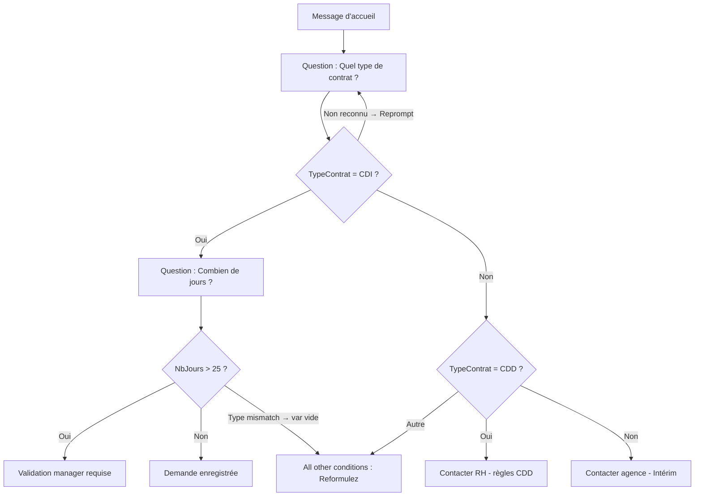

# Variables, branches et entités dans Copilot Studio

## Objectifs pédagogiques

À l'issue de ce module, tu seras capable de :

1. **Créer et utiliser des variables** pour stocker les informations collectées pendant une conversation
2. **Configurer des entités** pour extraire automatiquement des données structurées depuis les messages de l'utilisateur
3. **Construire des branches conditionnelles** pour adapter la réponse de l'agent au contexte
4. **Combiner variables, entités et conditions** dans un topic complet, testé et fonctionnel
5. **Diagnostiquer et corriger** les erreurs classiques de portée, de typage et de branches manquantes

---

## Mise en situation

Tu viens de créer un premier agent qui répond à des questions courantes sur un service RH. Il fonctionne — les topics se déclenchent, les réponses s'affichent. Mais très vite, tu te heurtes à un problème concret : **l'agent ne "se souvient" de rien**. Il ne sait pas si l'utilisateur a déjà donné son nom, il ne sait pas quel type de contrat il a, et il ne peut pas personnaliser ses réponses.

C'est exactement ce que ce module règle. Les variables permettent à l'agent de mémoriser. Les entités lui permettent de comprendre ce que l'utilisateur dit. Et les branches lui permettent de réagir différemment selon les situations.

Et pour que ce soit concret jusqu'au bout, tu vas construire un topic complet de A à Z — une demande de congés avec plusieurs cas, relance, et gestion d'erreur — puis tu apprendras à le tester et à le déboguer quand ça ne fonctionne pas comme prévu.

---

## Contexte — Pourquoi ces trois mécanismes vont toujours ensemble

Quand un utilisateur tape "Je voudrais poser des congés du 15 au 22 juillet", l'agent doit faire trois choses :

1. **Comprendre** qu'il s'agit de dates (entités)
2. **Mémoriser** ces dates pour les utiliser plus tard dans la conversation (variables)
3. **Réagir différemment** selon si l'utilisateur est en CDI, CDD ou intérimaire (branches)

Ces trois mécanismes sont indissociables dans la pratique. Les expliquer séparément est pédagogique — les utiliser ensemble, c'est ce qui donne un agent réellement utile.

---

## Les variables — donner une mémoire à l'agent

### Ce qu'est une variable dans Copilot Studio

Une variable, c'est simplement une case mémoire nommée. Elle stocke une valeur pendant la durée d'une conversation (ou au-delà, selon la portée), et tu peux la lire ou la modifier à n'importe quel moment dans un topic.

La différence avec une variable de code classique : tu ne l'initialises pas manuellement avec `x = 0`. La plupart du temps, **elle est alimentée automatiquement** quand l'agent pose une question à l'utilisateur via un nœud "Ask a question".

### Créer une variable via une question

Dans un topic, quand tu ajoutes un nœud **Ask a question**, Copilot Studio te propose de stocker la réponse dans une variable. C'est là que tout commence.

> **Chemin :** Dans le canvas du topic → `+` → **Ask a question** → champ "Save response as" → nommer la variable

Par défaut, une variable créée ici a une portée **Topic** : elle existe uniquement dans le topic courant. Si tu as besoin de la partager entre plusieurs topics, tu la convertis en variable **Global**.

🧠 **Concept clé — Portée des variables**

| Portée | Accès | Durée de vie | Usage typique |
|--------|-------|--------------|---------------|
| **Topic** | Topic courant uniquement | Durée du topic | Stocker une réponse intermédiaire |
| **Global** | Tous les topics | Durée de la session | Nom de l'utilisateur, type de contrat, langue préférée |

Pour convertir une variable Topic en Global : clic sur la variable dans le canvas → **"Convert to global"**. Elle sera préfixée `Global.` dans le code de référence.

### Lire et réutiliser une variable

Une fois stockée, la variable est disponible partout dans le topic. Pour l'insérer dans un message texte :

> Dans le nœud "Message" → clique dans le champ texte → icône `{x}` → sélectionne ta variable

Résultat : l'agent affiche `"Bonjour Julien !"` au lieu de `"Bonjour {x} !"` — la substitution est automatique à l'exécution.

💡 **Astuce** — Si tu veux tester la valeur d'une variable pendant le développement, utilise le panneau de test intégré : les valeurs des variables sont visibles en temps réel dans le volet droit de la fenêtre de test.

### Les types de variables

Copilot Studio gère un typage simple mais suffisant pour un agent opérationnel :

| Type | Exemples | Notes |
|------|----------|-------|
| `String` | "Julien", "Paris" | Le plus courant, texte libre |
| `Number` | 42, 3.14 | Entier ou décimal |
| `Boolean` | true / false | Utile pour les branches |
| `Table` | Liste de valeurs | Pour des entités multi-valeurs |
| `Record` | Objet structuré | Retour d'une action externe |

Le type est généralement inféré automatiquement depuis le type d'entité associé à la question. Si tu demandes un nombre, la variable sera de type `Number`.

⚠️ **Erreur fréquente** — Utiliser une variable de type `String` dans une condition numérique. Si tu stockes "42" (chaîne) et que tu la compares à `> 40`, la condition retourne toujours `False` sans aucun message d'erreur. Le module "Débogage et diagnostic" plus bas détaille exactement comment repérer ce cas.

---

## Les entités — comprendre ce que l'utilisateur dit vraiment

### Le problème sans entités

Sans entité, si tu demandes "Quel est votre âge ?", l'agent stocke littéralement ce que l'utilisateur tape — "j'ai 32 ans", "32 ans", "trente-deux". Tu te retrouves avec une chaîne de caractères imprévisible au lieu d'un nombre.

Les entités règlent ça : elles **extraient automatiquement** la valeur structurée depuis un message en langage naturel.

### Les entités prédéfinies

Copilot Studio embarque des entités prêtes à l'emploi pour les types courants. Tu les retrouves dans le menu déroulant "Identify" du nœud "Ask a question" :

| Entité prédéfinie | Extrait | Exemple d'input utilisateur |
|-------------------|---------|------------------------------|
| `Age` | Un nombre d'années | "j'ai 32 ans", "32" |
| `Email` | Une adresse email valide | "mon mail c'est j@corp.com" |
| `Date and time` | Une date/heure | "le 15 juillet", "demain à 14h" |
| `Number` | Un nombre | "environ 500", "5 000 euros" |
| `City` | Une ville reconnue | "je suis à Lyon" |
| `Boolean` (Yes/No) | Oui / Non | "oui", "non merci", "bien sûr" |

🧠 **Concept clé** — Une entité n'est pas un filtre de validation. C'est un **extracteur**. Si l'utilisateur dit "je partirai vers le 15 ou le 16 juillet", l'entité `Date and time` peut extraire les deux dates. Ce n'est pas une erreur — c'est son comportement normal. À toi de gérer ce cas dans la logique en aval.

### Les entités personnalisées

Quand les entités prédéfinies ne couvrent pas ton besoin métier, tu crées une entité personnalisée. Deux modes :

**Liste fermée** — l'utilisateur doit choisir parmi des valeurs que tu définis. Parfait pour les types de contrat ("CDI", "CDD", "Intérim"), les catégories de tickets, les départements d'une entreprise.

**Expression régulière** — tu fournis un pattern. Utile pour des codes internes type "RH-2024-001" ou des numéros de commande.

> **Chemin :** Menu latéral → **Entities** → **+ New entity** → choisir "Closed list" ou "Regular expression"

Pour une liste fermée, tu peux aussi ajouter des **synonymes** : si un utilisateur tape "temps plein" et que ta liste contient "CDI", tu associes "temps plein" comme synonyme de "CDI". L'agent comprend les deux.

💡 **Astuce** — Pour un agent RH ou support, investis du temps sur tes entités personnalisées dès le début. Un utilisateur qui tape "j'ai un contrat à durée indéterminée" ne déclenche rien si ton entité ne contient pas ce synonyme. Un bon glossaire de synonymes réduit drastiquement les incompréhensions.

---

## Les branches — adapter le comportement à la situation

### La logique conditionnelle dans un topic

Une fois que l'agent a collecté des informations et les a stockées dans des variables, il peut prendre des décisions. C'est le rôle des nœuds de **condition**.

> **Chemin :** Dans le canvas → `+` → **Add a condition**

Un nœud condition crée deux branches : une pour quand la condition est vraie (`True`), une pour quand elle est fausse (`False`). Tu peux enchaîner plusieurs conditions pour créer autant de chemins que nécessaire.

### Anatomie d'une condition

Une condition dans Copilot Studio se construit en trois parties :

```
[Variable]  [Opérateur]  [Valeur]
```

Exemples concrets :

| Variable | Opérateur | Valeur | Signification |
|----------|-----------|--------|---------------|
| `Topic.TypeContrat` | `is equal to` | `CDI` | L'utilisateur est en CDI |
| `Topic.NbJours` | `is greater than` | `25` | Plus de 25 jours demandés |
| `Global.EstConnecte` | `is equal to` | `true` | L'utilisateur est authentifié |
| `Topic.Email` | `is not blank` | | Un email a bien été fourni |

⚠️ **Erreur fréquente** — Oublier de gérer le cas "aucune condition ne correspond". Si l'utilisateur donne une valeur inattendue et qu'aucune branche ne correspond, la conversation s'arrête sans message. Ajoute toujours une branche **"All other conditions"** (équivalent d'un `else`) avec un message de fallback. Sans elle, l'impasse est silencieuse — impossible à détecter sans ouvrir les logs.

---

## Cas réel — construire un topic de demande de congés de A à Z

C'est ici que les trois mécanismes s'assemblent. On part d'un canvas vide et on construit un topic complet qui gère une demande de congés selon le type de contrat, avec relance si la réponse n'est pas reconnue et gestion des cas limites.

### Ce que le topic doit faire

- Collecter le type de contrat de l'utilisateur (CDI / CDD / Intérim)
- Si CDI : demander le nombre de jours et conditionner selon le seuil de 25 jours
- Si CDD : informer que les congés sont limités et inviter à contacter le RH
- Si Intérim : rediriger vers l'agence
- Si réponse non reconnue : relancer avec un message d'aide
- Si plus de 25 jours (CDI) : informer que la validation manager est requise

### Étape 1 — Créer l'entité TypeContrat

Avant de toucher au canvas, crée l'entité qui va extraire le type de contrat depuis le message de l'utilisateur.

> **Chemin :** Menu latéral → **Entities** → **+ New entity** → "Closed list"

Ajoute ces valeurs avec leurs synonymes :

| Valeur principale | Synonymes à ajouter |
|-------------------|---------------------|
| `CDI` | temps plein, durée indéterminée, permanent |
| `CDD` | durée déterminée, temporaire, contrat limité |
| `Intérim` | mission, intérimaire, agence, temporaire agence |

Sauvegarde sous le nom `TypeContrat`.

### Étape 2 — Construire les nœuds dans le canvas

Voici la séquence complète des nœuds à créer dans l'ordre :

> **Nœud 1 — Message d'accueil**
> Texte : "Bonjour ! Je vais vous aider avec votre demande de congés."

> **Nœud 2 — Ask a question**
> Texte : "Quel est votre type de contrat ?"
> Identify : entité personnalisée `TypeContrat`
> Save response as : `Topic.TypeContrat`
> Reprompt activé (panneau de propriétés → section "Reprompt" → toggle ON → message : "Je n'ai pas reconnu votre type de contrat. Merci d'indiquer CDI, CDD ou Intérim.")

> **Nœud 3 — Condition principale**
> `Topic.TypeContrat` is equal to `CDI`
> → Branche True : continuer vers nœud 4
> → Branche False : continuer vers nœud 5

> **Nœud 4 — Ask a question (branche CDI)**
> Texte : "Combien de jours souhaitez-vous poser ?"
> Identify : entité prédéfinie `Number`
> Save response as : `Topic.NbJours`

> **Nœud 4b — Condition sur le nombre de jours**
> `Topic.NbJours` is greater than `25`
> → Branche True → Message : "Votre demande dépasse 25 jours. Une validation de votre manager est requise avant enregistrement."
> → Branche False → Message : "Votre demande de {Topic.NbJours} jours a bien été enregistrée. Vous recevrez une confirmation par email."

> **Nœud 5 — Condition secondaire (suite branche False de nœud 3)**
> `Topic.TypeContrat` is equal to `CDD`
> → Branche True → Message : "Les congés en CDD sont soumis à des règles spécifiques. Merci de contacter directement le service RH."
> → Branche False → Message : "Pour les missions intérimaires, les congés sont gérés par votre agence. Veuillez les contacter directement."

> **Sur chaque branche finale — Ajouter une branche "All other conditions"**
> Si une valeur inattendue arrive : Message "Je n'ai pas pu traiter votre demande. Pouvez-vous reformuler ou contacter le RH directement ?"

### Vue d'ensemble du flux



Ce flux couvre : entité personnalisée, reprompt natif, deux niveaux de condition imbriqués, branche fallback, et un cas de type mismatch géré proprement.

---

## Débogage et diagnostic — quand le topic ne fonctionne pas

C'est la partie qu'aucun tutoriel ne montre assez tôt. Voici les cinq situations les plus fréquentes, comment les reconnaître, et quoi faire.

### Comment utiliser le panneau de test

> **Chemin :** Bouton **Test your agent** en haut à droite du canvas → panneau droit → champ de message en bas

Dans ce panneau, pendant une conversation de test :
- Les valeurs des variables sont visibles dans l'onglet **Variables** du panneau de test (onglet au-dessus du champ message)
- Chaque nœud exécuté est mis en surbrillance dans le canvas en temps réel
- Les nœuds non exécutés restent grisés — c'est visuellement immédiat

C'est ton outil de débogage principal. Prends l'habitude de l'ouvrir dès que quelque chose ne se comporte pas comme prévu.

### Diagnostic des 5 problèmes classiques

**Problème 1 — La branche "All other conditions" s'exécute toujours**

Tu configures `Topic.TypeContrat is equal to CDI` et pourtant, même en tapant "CDI", la branche False est systématiquement choisie.

Causes possibles dans l'ordre à vérifier :

| Vérification | Comment faire | Ce que tu cherches |
|---|---|---|
| La variable est-elle bien remplie ? | Panneau test → onglet Variables → valeur de `Topic.TypeContrat` | La variable doit afficher `CDI`, pas `null` ou vide |
| L'entité est-elle associée à la question ? | Canvas → nœud "Ask a question" → champ "Identify" | Doit pointer vers l'entité `TypeContrat`, pas "Text" ou vide |
| La valeur de la liste fermée est-elle exactement `CDI` ? | Menu latéral → Entities → TypeContrat → vérifier la casse | `CDI` ≠ `cdi` ≠ `Cdi` — la comparaison est sensible |
| La condition compare-t-elle la bonne variable ? | Canvas → nœud Condition → champ gauche | Vérifier qu'on lit bien `Topic.TypeContrat` et non une autre variable |

**Problème 2 — Variable vide malgré une réponse de l'utilisateur**

L'utilisateur tape "CDI" mais `Topic.TypeContrat` reste vide dans le panneau Variables.

Causes et solutions :

| Cause | Solution |
|---|---|
| L'entité ne reconnaît pas la valeur saisie | Ajouter le terme exact comme synonyme dans la liste fermée |
| Le champ "Identify" du nœud question est vide ou sur "Text" | Ouvrir le nœud → "Identify" → sélectionner l'entité `TypeContrat` |
| L'utilisateur a fourni une réponse ambiguë (ex: "je suis en CDI depuis 2 ans") | L'entité extrait quand même si le synonyme existe — vérifier les synonymes |
| La variable a une portée Topic mais on la lit depuis un autre topic | Convertir en Global si usage multi-topics |

**Problème 3 — Condition numérique toujours False (`NbJours > 25` ne fonctionne pas)**

C'est le piège de type le plus fréquent. Voici le scénario exact :

- Tu crées le nœud "Ask a question" pour le nombre de jours
- Tu laisses "Identify" sur **Text** ou **User's entire response** au lieu de **Number**
- La variable `Topic.NbJours` est créée avec le type `String`
- Tu configures la condition `Topic.NbJours is greater than 25`
- Résultat : la condition retourne toujours `False`, même si l'utilisateur tape "30"

**Correction :**
> Nœud "Ask a question" → champ "Identify" → sélectionner l'entité prédéfinie **Number**
> Vérifier dans le panneau Variables que `Topic.NbJours` affiche bien `30` (Number) et non `"30"` (String)

Avant / après dans le panneau test :

| Situation | Valeur visible dans Variables | Résultat de `> 25` |
|---|---|---|
| Type String (incorrect) | `"30"` avec guillemets | `False` |
| Type Number (correct) | `30` sans guillemets | `True` |

**Problème 4 — La relance ne se déclenche pas (Reprompt)**

Tu as activé le Reprompt sur le nœud question mais l'agent ne relance pas quand l'utilisateur tape quelque chose d'incompréhensible.

Vérifications :
> Canvas → nœud "Ask a question" → panneau de propriétés (volet droit) → section **"Reprompt"** → vérifier que le toggle est bien sur **ON** et que le message de relance est renseigné

Si le toggle est ON mais la relance ne s'affiche pas : vérifier que l'entité est bien configurée. Si "Identify" est sur "User's entire response", tout input est accepté comme valide — le reprompt ne se déclenche jamais car techniquement la réponse est "reconnue".

**Problème 5 — La variable Global est vide dans un topic secondaire**

`Global.TypeContrat` a été remplie dans le topic d'accueil mais apparaît vide dans un topic de suivi.

Cause la plus fréquente : la variable a été créée en Topic dans le premier topic et jamais convertie. Le préfixe `Global.` dans le nom n'est pas suffisant — il faut la conversion explicite.

> **Vérification :** Canvas du topic d'accueil → clic sur la variable → si le panneau affiche "Topic variable" avec un bouton "Convert to global", elle n'a pas encore été convertie. Cliquer sur le bouton.

---

## Bonnes pratiques — avec les conséquences concrètes

**Nommer avec intention.** `Var1` ne t'aidera pas à déboguer dans trois semaines. La conséquence concrète : tu reviens modifier un topic de 8 nœuds avec des variables `Reponse1`, `Reponse2`, `Rep3` — impossible de savoir laquelle est le type de contrat sans ouvrir chaque nœud. Préfère `Topic.TypeContrat`, `Global.NomUtilisateur`, `Topic.NbJoursConges`.

**Ne crée pas de variables pour tout.** Si une valeur n'est utilisée qu'une seule fois et ne conditionne aucune branche, un nœud de message direct suffit. Les variables servent à persister et à décider.

**Teste chaque branche explicitement.** Dans le panneau de test, joue chaque chemin une fois. Note les valeurs de test — tu en auras besoin quand tu modifieras le topic. Une branche non testée finit toujours par surprendre en production.

**Limite les entités personnalisées à ce qui est vraiment métier.** Si tu as besoin de reconnaître une ville française, l'entité prédéfinie `City` le fait déjà mieux que ta liste fermée.

**Active le Reprompt natif avant de construire une boucle manuelle.** Une boucle manuelle (condition "is blank" → redirect vers le topic) est plus fragile et trois fois plus longue à maintenir.

---

## Défi — Construire et tester ton propre topic

**Objectif :** créer un topic "Demande d'équipement informatique" qui :

1. Demande le type d'équipement (Laptop / Écran / Périphérique / Autre) — entité liste fermée avec synonymes
2. Si Laptop : demande la justification métier (variable `Topic.Justification`, type Text)
3. Si Écran : enregistrer directement sans justification
4. Si Périphérique : enregistrer directement
5. Si Autre : demander de contacter le service IT par email
6. Sur Laptop avec justification remplie : message de confirmation avec la justification affichée
7. Sur Laptop avec justification vide : relancer une fois via Reprompt, puis escalader

**Tester les 5 cas suivants dans le panneau de test :**

| Input utilisateur | Comportement attendu |
|---|---|
| "j'ai besoin d'un ordinateur" | Reconnaît "Laptop" via synonyme, demande justification |
| "un écran supplémentaire" | Reconnaît "Écran", enregistre directement |
| "clavier sans fil" | Reconnaît "Périphérique", enregistre directement |
| "j'ai besoin d'un truc spécial" | Branche "Autre", redirection IT |
| Laptop → réponse vide à la justification | Reprompt déclenché, puis escalade si toujours vide |

---

## Résumé

Les variables donnent à l'agent une mémoire de conversation : elles stockent ce que l'utilisateur dit et permettent de le réutiliser à tout moment. Les entités sont le mécanisme qui extrait automatiquement une valeur structurée depuis un message en langage naturel — sans elles, tu collectes du texte brut imprévisible. Les branches conditionnelles exploitent ensuite ces variables pour orienter la conversation vers le bon chemin selon le contexte.

En pratique, ces trois éléments forment un seul pipeline : poser une question avec une entité → stocker dans une variable → conditionner sur cette variable. La portée des variables (Topic vs Global) est le paramètre le plus important à maîtriser dès qu'un agent gagne en complexité. Le piège de typage (String comparée comme Number) est le bug silencieux le plus fréquent chez les débutants — le panneau de test et son onglet Variables te permettent de l'identifier en secondes. Le module suivant s'appuie directement sur ce socle pour déclencher des flux Power Automate depuis ces mêmes variables.

---

<!-- snippet
id: copilot_variable_portee
type: concept
tech: Copilot Studio
level: beginner
importance: high
format: knowledge
tags: variable, portee, topic, global, copilot-studio
title: Portée des variables Topic vs Global
content: Une variable Topic existe uniquement dans le topic où elle est créée et disparaît dès qu'il se termine. Une variable Global persiste toute la session et est accessible dans tous les topics. Conversion : canvas → clic sur la variable → "Convert to global" → préfixe Global. ajouté automatiquement. Vérification : si le panneau affiche "Topic variable" avec le bouton de conversion, elle n'est pas encore globale.
description: Mal choisir la portée est la cause principale des variables "vides" dans un topic qui essaie de lire une info saisie dans un autre topic.
-->

<!-- snippet
id: copilot_entite_extracteur
type: concept
tech: Copilot Studio
level: beginner
importance: high
format: knowledge
tags: entite, extraction, langage-naturel, copilot-studio
title: Une entité extrait, elle ne filtre pas
content: Une entité analyse le message de l'utilisateur et en extrait la valeur structurée. "j'ai 32 ans" → entité Age extrait 32 (Number). Si plusieurs valeurs correspondent (ex: deux dates dans un même message), toutes sont extraites dans une Table. Ce n'est pas une erreur — c'est le comportement normal. Un message sans valeur reconnue renvoie une variable vide, pas une erreur.
description: Confondre extraction et validation conduit à des branches mal gérées quand la variable est vide ou contient plusieurs valeurs.
-->

<!-- snippet
id: copilot_entite_liste_fermee
type: tip
tech: Copilot Studio
level: beginner
importance: high
format: knowledge
tags: entite, liste-fermee, synonymes, copilot-studio
title: Ajouter des synonymes à une entité liste fermée
content: Entities → ta liste fermée → chaque valeur accepte des synonymes. Ajoute les variantes réelles : "temps plein" → CDI, "durée déterminée" → CDD, "mission" → Intérim. Sans synonymes, un utilisateur qui ne tape pas exactement la valeur de la liste déclenche une variable vide — le reprompt se déclenche alors inutilement même si l'intention était claire.
description: Les synonymes sont la première chose à enrichir après création d'une entité métier — leur absence est responsable de la plupart des non-reconnaissances.
-->

<!-- snippet
id: copilot_condition_fallback
type: warning
tech: Copilot Studio
level: beginner
importance: high
format: knowledge
tags: condition, branche, fallback, copilot-studio
title: Toujours prévoir une branche "All other conditions"
content: Sans branche "All other conditions", si aucune condition ne correspond (valeur inattendue, variable vide, cas non prévu), la conversation s'arrête silencieusement sans message pour l'utilisateur. L'impasse est indétectable sans ouvrir les logs. Correct : sur chaque nœud condition → "+ New condition" → "All other conditions" → message "Je n'ai pas pu traiter votre demande — pouvez-vous reformuler ?" ou redirection vers le topic de fallback global.
description: Un topic sans branche par défaut crée des conversations mortes — le symptôme côté utilisateur est un agent qui ne répond plus.
-->

<!-- snippet
id: copilot_variable_naming
type: tip
tech: Copilot Studio
level: beginner
importance: medium
format: knowledge
tags: variable, nommage, lisibilite, copilot-studio
title: Convention de nommage des variables Copilot Studio
content: Adopte le schéma Portée
