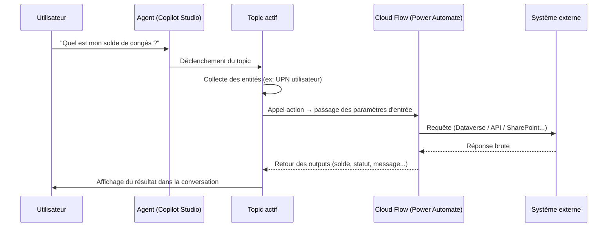

# Actions Power Automate depuis un agent

## Objectifs pédagogiques

À l'issue de ce module, vous serez capable de :

- Comprendre pourquoi et quand déclencher un flow Power Automate depuis un agent Copilot Studio
- Créer un Cloud Flow configuré pour être appelé par un agent, avec les bons paramètres d'entrée et de sortie
- Connecter ce flow à une action dans un topic et exploiter les valeurs retournées
- Gérer les erreurs de flux dans la conversation sans bloquer l'utilisateur
- Identifier les bonnes pratiques de performance et de sécurité pour les actions en production

---

## Mise en situation

Vous développez un agent interne pour une équipe RH. L'agent répond aux questions fréquentes, mais les collaborateurs lui demandent aussi des choses plus dynamiques : "Quel est mon solde de congés ?" ou "Peux-tu créer un ticket d'incident pour moi ?"

Ces données ne sont pas statiques. Elles vivent dans Dataverse, dans ServiceNow, dans une API REST interne. Copilot Studio seul ne peut pas les atteindre — c'est exactement là que Power Automate entre en jeu. Le flow devient le bras armé de l'agent : il exécute des opérations dans des systèmes externes et remonte le résultat dans la conversation.

Ce scénario est représentatif d'une grande majorité des agents en production : la conversation orchestre, Power Automate exécute.

---

## Pourquoi Power Automate et pas autre chose ?

Copilot Studio dispose de connecteurs natifs pour Dataverse et d'appels HTTP basiques — mais dès qu'on touche à de la logique conditionnelle, plusieurs systèmes, ou des opérations à enchaîner, un flow est infiniment plus maintenable.

L'autre raison, plus pratique : Power Automate partage le même tenant, les mêmes connexions authentifiées, et le même modèle de sécurité que le reste de la Power Platform. Pas besoin de gérer des tokens supplémentaires pour appeler SharePoint, Teams, ou Dataverse depuis l'agent — les connexions du flow s'en chargent.

Il y a trois façons d'étendre les capacités d'un agent :

| Mécanisme | Cas d'usage | Complexité |
|---|---|---|
| Action → Cloud Flow | Logique métier, appels multi-systèmes | Faible à modérée |
| Connecteur HTTP (action externe) | API REST tierce directe | Modérée |
| Plugin (code) | Logique avancée, transformations complexes | Élevée |

Ce module couvre le premier mécanisme — le plus fréquent en pratique.

---

## Architecture : ce qui se passe sous le capot

Quand un agent appelle un Cloud Flow, voici ce qui se produit réellement :



Le point important : l'appel est **synchrone** du point de vue du topic. L'agent attend la réponse avant de continuer. Si le flow prend 10 secondes, la conversation marque une pause de 10 secondes — c'est pour ça que la performance du flow compte.

🧠 **Concept clé** — Le déclencheur du flow n'est pas un déclencheur HTTP générique. C'est un déclencheur spécial "When an agent calls a flow" (`When a flow is run from Copilot Studio`) qui expose une interface structurée d'inputs/outputs. Sans ce déclencheur, le flow n'apparaît pas dans la liste des actions disponibles dans l'agent.

---

## Construction pas à pas

### Étape 1 — Créer le Cloud Flow avec le bon déclencheur

Dans Power Automate, créez un nouveau Cloud Flow "Instantané". Au moment de choisir le déclencheur, sélectionnez :

> **When an agent calls a flow** *(également libellé "Run a flow from Copilot" selon la version)*

Ce déclencheur est dans la catégorie **Microsoft Copilot Studio**.

Une fois sélectionné, vous obtenez un canevas avec deux blocs spéciaux :
- Le déclencheur en haut — là où vous déclarez les **inputs**
- Un bloc "Return value(s) to the agent" en bas — là où vous déclarez les **outputs**

💡 Ces deux blocs définissent le contrat entre l'agent et le flow. Pensez-les comme la signature d'une fonction : ce que vous donnez, ce que vous recevez.

### Étape 2 — Déclarer les paramètres d'entrée

Dans le déclencheur, cliquez sur **+ Add an input**. Vous pouvez déclarer :

| Type Power Automate | Cas typique |
|---|---|
| Text | Identifiant, nom, question libre |
| Number | Quantité, durée, ID numérique |
| Boolean | Oui/Non passé depuis l'agent |
| Date | Date collectée via une entité |
| File | Fichier binaire (rare depuis agent) |
| Table | Collection structurée (avancé) |

Nommez les paramètres avec des noms explicites et stables — le nom que vous donnez ici est celui que vous retrouverez dans le topic pour mapper les variables.

**Exemple concret** : pour un flow qui récupère un solde de congés, déclarez :
- `userEmail` (Text) — l'adresse UPN de l'utilisateur

### Étape 3 — Construire la logique du flow

C'est ici que Power Automate fait son travail. Quelques patterns courants :

**Pattern 1 — Lecture Dataverse**
```
Get a row by ID (Dataverse) → table ciblée, filtre sur userEmail
→ Extraire le champ "nb_conges_restants"
```

**Pattern 2 — Appel API REST**
```
HTTP → méthode GET, URL de l'API interne
→ Parse JSON avec le schéma de réponse
→ Extraire les champs utiles
```

**Pattern 3 — Écriture + confirmation**
```
Add a new row (Dataverse) ou Create item (SharePoint)
→ Récupérer l'ID généré
→ Retourner l'ID et un message de confirmation
```

⚠️ **Erreur fréquente** — Utiliser une action Dataverse avec un filtre qui peut retourner 0 résultats sans gérer ce cas. En l'absence de gestion d'erreur, le flow retourne une réponse vide ou plante, et l'agent affiche un message d'erreur générique incompréhensible pour l'utilisateur. Ajoutez toujours une condition "si résultat vide → retourner un message explicite".

### Étape 4 — Déclarer les valeurs de retour

Dans le bloc "Return value(s) to the agent", ajoutez les outputs. Les types disponibles sont les mêmes qu'à l'entrée.

Pour notre exemple :
- `soldeConges` (Number) — le nombre de jours restants
- `statutMessage` (Text) — message lisible si erreur ou cas particulier

Assignez les valeurs avec les expressions dynamiques Power Automate (`outputs('Get_a_row')?['nb_conges_restants']` par exemple).

💡 **Bonne pratique** : toujours inclure un output texte du type `statusMessage` ou `errorMessage` en plus des données métier. Ça permet à l'agent de gérer proprement les cas d'erreur sans planter.

### Étape 5 — Enregistrer et tester le flow seul

Avant de le connecter à l'agent, testez le flow indépendamment. Dans Power Automate, utilisez la fonction **Test** → "Manuellement" → fournissez des valeurs fictives pour les inputs. Vérifiez que les outputs sont bien peuplés dans le résumé d'exécution.

Un flow qui fonctionne seul mais échoue depuis l'agent est souvent un problème de connexions ou de permissions — pas de logique.

---

### Étape 6 — Ajouter l'action dans le topic Copilot Studio

Dans Copilot Studio, ouvrez le topic concerné. Au point où vous voulez appeler le flow, cliquez sur le **+** pour ajouter un nœud, puis :

> **Add an action → Call an action → (onglet) Power Automate flows**

La liste affiche tous les flows de votre environnement qui utilisent le déclencheur Copilot Studio. Sélectionnez le vôtre.

Un nœud d'action apparaît avec deux zones :
- **Inputs** : mappez les variables du topic vers les paramètres d'entrée du flow
- **Outputs** : les valeurs retournées sont automatiquement créées comme variables dans le topic

```
[Nœud action — Récupérer solde congés]
  ├── Input :  userEmail  ← System.User.PrincipalName
  └── Output : soldeConges → stocker dans Variable.SoldeConges
               statutMessage → stocker dans Variable.StatutMessage
```

🧠 **Concept clé** — La variable `System.User.PrincipalName` est automatiquement disponible dans les agents connectés à un tenant M365. C'est l'UPN de l'utilisateur authentifié. Pas besoin de le demander — l'agent le connaît déjà.

### Étape 7 — Utiliser les outputs dans la conversation

Après le nœud d'action, ajoutez une condition pour traiter les deux cas :

```
Si Variable.StatutMessage est vide
  → Afficher : "Il vous reste {Variable.SoldeConges} jours de congés."
Sinon
  → Afficher : Variable.StatutMessage
```

C'est ce pattern simple qui rend l'agent robuste. L'utilisateur ne voit jamais une erreur technique — il voit un message compréhensible.

---

## Gestion des erreurs et timeouts

Les flows peuvent échouer pour des raisons que vous ne contrôlez pas toujours : API tierce indisponible, timeout Dataverse, problème réseau. Par défaut, si un flow échoue, Copilot Studio peut afficher un message d'erreur générique.

Pour éviter ça, deux niveaux de protection :

**Niveau flow** — Dans Power Automate, activez le "Configure run after" sur les actions critiques pour intercepter les échecs et retourner un `errorMessage` structuré plutôt qu'une exception brute.

**Niveau topic** — Dans Copilot Studio, vous pouvez configurer le comportement du nœud d'action en cas d'échec via l'onglet **Error handling** du nœud. Options disponibles :
- Laisser l'agent gérer l'erreur globalement (topic système `Error`)
- Rediriger vers un topic spécifique
- Afficher un message inline

⚠️ Le timeout par défaut d'un appel de flow depuis Copilot Studio est de **100 secondes**. Au-delà, l'action est considérée comme échouée. Les flows lourds (lots, exports, traitements longs) ne sont pas adaptés à ce pattern — préférez un déclenchement asynchrone avec une notification ultérieure.

---

## Bonnes pratiques pour la production

**Performances**
Évitez les flows qui enchaînent 10 appels Dataverse en séquence. Préférez des requêtes ciblées, des vues filtrées, ou des tables virtuelles. Un flow bien conçu répond en moins de 3 secondes dans la grande majorité des cas.

**Connexions et sécurité**
Les connexions utilisées par le flow s'exécutent sous l'identité de leur propriétaire (le compte qui a créé le flow). En production, utilisez un compte de service dédié, pas le compte personnel d'un développeur. Si le développeur quitte l'entreprise, les flows cassent.

💡 Pour les flows qui agissent au nom de l'utilisateur (créer une demande, soumettre un formulaire), envisagez les **connexions déléguées** ou les patterns avec le UPN passé en paramètre + vérification côté Dataverse.

**Versioning**
Un flow appelé par un agent est couplé à lui par nom. Si vous renommez le flow ou modifiez ses inputs/outputs, le nœud dans le topic sera invalide. Traitez le contrat inputs/outputs comme une API publique — faites évoluer par ajout, pas par modification.

**Observabilité**
Activez l'historique des exécutions dans Power Automate (il est actif par défaut). En cas de signalement d'un problème dans la conversation, vous pouvez retrouver l'exécution par timestamp et inspecter chaque étape.

---

## Résumé

Un agent Copilot Studio gagne ses capacités opérationnelles via des Cloud Flows Power Automate. Le déclencheur "When an agent calls a flow" crée un contrat structuré d'inputs/outputs entre l'agent et le flow. Côté Copilot Studio, le nœud d'action mappe les variables du topic vers ce contrat et récupère les résultats comme nouvelles variables exploitables dans la conversation.

La robustesse repose sur deux principes : toujours retourner un message explicite en cas d'erreur (côté flow), et toujours brancher sur ce message dans le topic pour protéger l'utilisateur. Les flows en production doivent être construits sur des connexions de service dédiées, rester sous le seuil de 100 secondes, et exposer un contrat inputs/outputs stable.

Ce pattern couvre l'immense majorité des besoins d'un agent métier : lectures Dataverse, appels API, créations d'enregistrements, envois de notifications.

---

<!-- snippet
id: copilot_flow_trigger
type: concept
tech: Copilot Studio
level: intermediate
importance: high
format: knowledge
tags: power automate, declencheur, agent, copilot studio
title: Déclencheur requis pour appeler un flow depuis un agent
content: Pour qu'un Cloud Flow soit visible depuis un agent Copilot Studio, il doit utiliser le déclencheur "When an agent calls a flow" (catégorie Microsoft Copilot Studio). Un déclencheur HTTP classique ou manuel ne s'affiche pas dans la liste des actions disponibles dans le topic.
description: Sans ce déclencheur spécifique, le flow est invisible dans l'interface de sélection d'actions de Copilot Studio.
-->

<!-- snippet
id: copilot_flow_timeout
type: warning
tech: Copilot Studio
level: intermediate
importance: high
format: knowledge
tags: timeout, performance, flow, agent
title: Timeout de 100 secondes sur les appels de flow
content: Piège : un flow qui dépasse 100 secondes est automatiquement considéré comme échoué par Copilot Studio. Conséquence : message d'erreur générique dans la conversation. Correction : optimiser les requêtes Dataverse, limiter les appels en séquence, ou repenser les traitements longs comme des processus asynchrones avec notification différée.
description: Le timeout de 100s est fixe et non configurable — tout flow lent doit être restructuré avant mise en production.
-->

<!-- snippet
id: copilot_flow_outputs_error
type: tip
tech: Copilot Studio
level: intermediate
importance: high
format: knowledge
tags: gestion erreurs, outputs, robustesse, flow
title: Toujours inclure un output "statusMessage" dans le flow
content: Ajoutez systématiquement un output Text nommé statusMessage (ou errorMessage) dans le bloc "Return value(s) to the agent". En cas d'erreur ou de résultat vide, peuplez ce champ avec un message lisible. Dans le topic, branchez une condition sur ce champ pour afficher un message propre à l'utilisateur plutôt qu'une erreur technique.
description: Ce pattern évite que l'agent affiche une erreur brute — l'utilisateur reçoit toujours un message compréhensible.
-->

<!-- snippet
id: copilot_flow_user_upn
type: tip
tech: Copilot Studio
level: intermediate
importance: medium
format: knowledge
tags: utilisateur, upn, identite, dataverse
title: Utiliser System.User.PrincipalName sans le demander à l'utilisateur
content: Dans un topic, la variable système System.User.PrincipalName contient l'UPN de l'utilisateur authentifié M365. Passez-la directement comme input au flow pour filtrer des données personnelles (congés, tickets, profil) sans demander l'email — c'est plus fluide et plus sécurisé.
description: Disponible automatiquement dans les agents déployés sur un tenant M365 authentifié, sans configuration supplémentaire.
-->

<!-- snippet
id: copilot_flow_connexion_service
type: warning
tech: Power Automate
level: intermediate
importance: high
format: knowledge
tags: connexions, securite, compte service, production
title: Ne jamais utiliser un compte personnel pour les connexions de flow en prod
content: Piège : les connexions Power Automate s'exécutent sous l'identité du créateur du flow. Conséquence : si ce compte est désactivé ou supprimé, tous les flows utilisant ces connexions cassent silencieusement. Correction : créer un compte de service dédié, lui assigner les connexions, et en faire le propriétaire des flows en production.
description: En production, un flow avec des connexions sur un compte nominatif est une bombe à retardement lors des départs d'équipe.
-->

<!-- snippet
id: copilot_flow_contrat_stable
type: warning
tech: Copilot Studio
level: intermediate
importance: medium
format: knowledge
tags: versioning, inputs, outputs, maintenabilite
title: Modifier les inputs/outputs d'un flow invalide le nœud dans le topic
content: Piège : renommer un paramètre d'entrée ou supprimer un output dans le flow casse le nœud d'action dans Copilot Studio sans avertissement visible. Conséquence : l'agent échoue en production. Correction : traiter le contrat inputs/outputs comme une API publique — ajouter des champs plutôt que modifier les existants, et tester le topic après chaque évolution du flow.
description: Le couplage par nom entre topic et flow exige une discipline de versioning rigoureuse dès la mise en production.
-->

<!-- snippet
id: copilot_flow_test_independant
type: tip
tech: Power Automate
level: intermediate
importance: medium
format: knowledge
tags: test, debug, flow, validation
title: Tester le flow seul avant de le connecter à l'agent
content: Dans Power Automate, utilisez Test → Manuellement pour exécuter le flow avec des valeurs fictives avant de le câbler dans un topic. Si le flow fonctionne seul mais échoue depuis l'agent, le problème est quasi systématiquement lié aux connexions ou aux permissions — pas à la logique du flow.
description: Cette étape de validation isole les bugs de logique (flow) des bugs d'intégration (agent ↔ flow) et accélère le diagnostic.
-->

<!-- snippet
id: copilot_flow_resultat_vide
type: error
tech: Power Automate
level: intermediate
importance: high
format: knowledge
tags: dataverse, erreur, gestion cas vide, robustesse
title: Flow qui plante sur résultat Dataverse vide
content: Symptôme : l'agent affiche une erreur générique quand une requête Dataverse ne retourne aucun résultat. Cause : l'action "Get a row" ou "List rows" retourne un tableau vide et la suite du flow tente d'accéder à un champ inexistant. Correction : ajouter une condition après la requête — si "value" est vide, retourner un statusMessage explicite plutôt que de continuer le flow.
description: Un résultat vide est un cas métier normal, pas une exception — le flow doit le traiter explicitement.
-->
