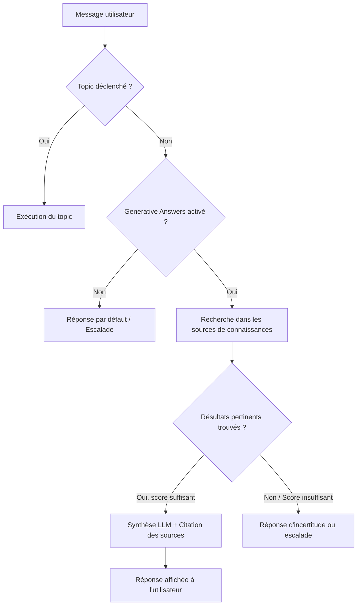
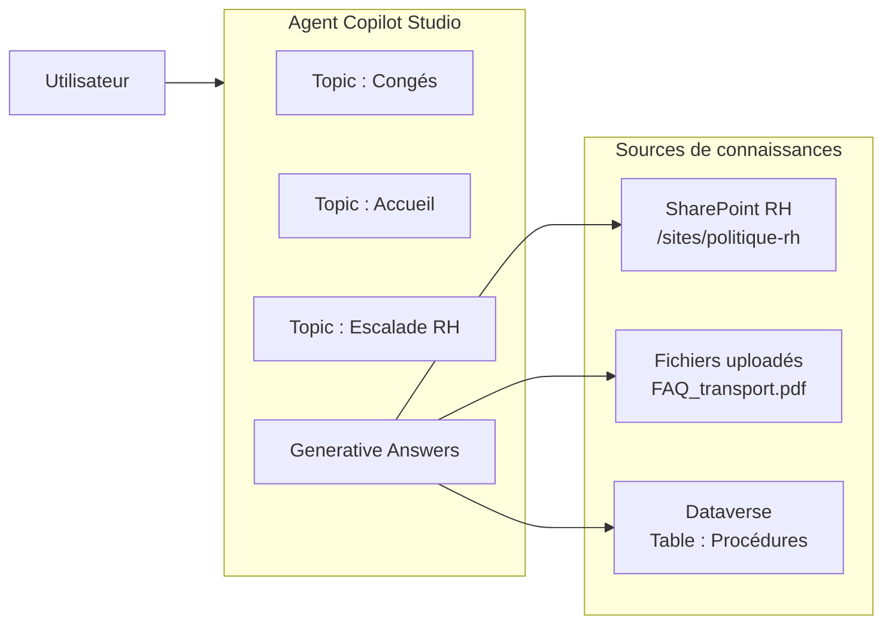

# Sources de connaissances et réponses génératives dans Copilot Studio

## Objectifs pédagogiques

À l'issue de ce module, vous serez capable de :

1. **Distinguer** les différentes sources de connaissances disponibles dans Copilot Studio et choisir la bonne selon le contexte
2. **Configurer** une ou plusieurs sources (SharePoint, site web, Dataverse, fichiers) dans un agent
3. **Comprendre** le mécanisme de Generative Answers et ses conditions de déclenchement
4. **Contrôler** la qualité et la confiance des réponses générées
5. **Identifier** les limites et les pièges courants de l'approche RAG dans Copilot Studio

---

## Mise en situation

Imaginez que vous construisez un agent interne pour le service RH d'une entreprise de 2 000 personnes. Les employés posent quotidiennement des questions comme *"Combien de jours de congé me reste-t-il ?"*, *"Quelle est la politique de remboursement des frais de déplacement ?"* ou *"Comment déclarer un arrêt maladie ?"*.

Le premier réflexe serait d'écrire un topic pour chaque question. Sauf qu'il y a 140 pages de politique interne réparties sur SharePoint, une FAQ intranet, et des mises à jour trimestrielles. Écrire et maintenir des topics pour chaque cas serait ingérable.

C'est précisément là que les **sources de connaissances et les réponses génératives** entrent en jeu : l'agent va chercher lui-même dans la documentation, formuler une réponse cohérente, et citer ses sources — sans qu'on ait écrit une seule règle explicite pour ces cas.

---

## Contexte : pourquoi ce sujet maintenant ?

Copilot Studio a longtemps fonctionné sur un modèle purement déclaratif : vous définissez des topics, des déclencheurs, des branches. C'est robuste, prévisible, mais rigide. Dès qu'une question sort du périmètre des topics, l'agent répond qu'il ne comprend pas.

Depuis l'intégration des LLM dans Copilot Studio (disponible à partir de fin 2023 / début 2024 selon les tenants), l'agent peut répondre à des questions **hors topics** en s'appuyant sur des sources documentaires. C'est ce qu'on appelle les **Generative Answers** — une forme de RAG (Retrieval-Augmented Generation) accessible sans écrire une ligne de code.

🧠 **Concept clé** — Le terme RAG (Retrieval-Augmented Generation) désigne le pattern où un LLM ne génère pas une réponse "de mémoire" mais en récupérant d'abord des passages pertinents dans une base documentaire, puis en les synthétisant. Copilot Studio implémente ce pattern de manière transparente via ses sources de connaissances.

---

## Comment fonctionne le mécanisme de Generative Answers

Avant de configurer quoi que ce soit, il faut comprendre **quand** et **comment** ce mécanisme se déclenche — parce que beaucoup de comportements inattendus viennent d'une mauvaise compréhension de l'ordre de priorité.

### L'ordre de traitement d'une question



Ce qui est essentiel ici : les topics ont **toujours la priorité**. Les Generative Answers ne se déclenchent que si aucun topic ne matche. Ce n'est pas un comportement configurable — c'est l'architecture du système.

💡 **Astuce** — Si un topic existant "vole" des questions que vous voudriez traiter via Generative Answers, c'est souvent un topic trop large dans ses phrases déclencheuses. Affinez les triggers du topic plutôt que de chercher à modifier la priorité.

### Ce qui se passe dans les coulisses

Quand une question arrive sans topic correspondant, Copilot Studio :

1. Envoie la question à un moteur de recherche (semantic search) sur chaque source configurée
2. Récupère les passages les plus pertinents selon un score de confiance
3. Passe ces passages + la question au LLM pour générer une réponse synthétique
4. Ajoute des références aux sources (optionnel mais activé par défaut)

Le score de confiance est le point de contrôle principal : en dessous d'un seuil, l'agent ne répond pas pour ne pas "halluciner". Ce seuil est configurable.

---

## Les sources de connaissances disponibles

Copilot Studio propose plusieurs types de sources. Elles ne sont pas interchangeables — chacune a ses conditions d'usage, ses contraintes et ses limites pratiques.

### Sites web et pages publiques

La source la plus simple à configurer : vous donnez une URL et Copilot Studio va indexer le contenu accessible publiquement.

**Ce que ça supporte :** sites publics, documentation en ligne, intranet public, pages HTML standards  
**Ce que ça ne supporte pas :** contenu derrière une authentification, SPA JavaScript lourd (le crawler indexe le HTML brut), PDFs hébergés sur un site web (accès limité)

> ⚠️ **Erreur fréquente** — Ajouter l'URL d'un SharePoint interne comme source "site web" ne fonctionnera pas si l'authentification Microsoft 365 est requise. Pour SharePoint, il faut utiliser la source dédiée SharePoint / OneDrive.

### SharePoint et OneDrive

C'est la source de choix pour les entreprises déjà sur M365. Vous pointez vers un site SharePoint ou une bibliothèque de documents et l'agent indexe les fichiers : Word, PowerPoint, PDF, pages SharePoint.

La recherche est sécurisée : l'agent accède aux documents en utilisant l'identité de l'utilisateur (si l'authentification est configurée sur le canal) ou via une connexion de service. Un utilisateur ne verra pas dans les réponses du contenu auquel il n'a pas accès — ce point est important pour la conformité.

💡 **Astuce** — Pour un agent interne, pointez vers le site SharePoint racine ou une bibliothèque de documents dédiée "Base de connaissances" plutôt que vers l'ensemble du tenant. Indexer tout le SharePoint de l'entreprise génère du bruit et des réponses moins précises.

### Fichiers uploadés directement

Vous pouvez charger des fichiers PDF, Word ou PowerPoint directement dans Copilot Studio. Pratique pour une FAQ, une charte, un guide pratique.

**Limite réelle :** les fichiers sont indexés au moment de l'upload. Si le document source est mis à jour, vous devez re-uploader. Pas adapté à des contenus qui changent souvent — utilisez SharePoint dans ce cas.

### Dataverse (tables de données)

Cette source est différente des précédentes : on ne cherche pas dans des documents texte, mais dans des enregistrements structurés. L'agent peut interroger des tables Dataverse et formuler des réponses à partir des données.

Cas d'usage typique : un catalogue produit, une liste de procédures, un référentiel de contacts internes.

🧠 **Concept clé** — Avec Dataverse comme source, le LLM n'exécute pas de requête SQL. Il fait une recherche sémantique sur les colonnes textuelles indexées. Si votre table contient des colonnes de codes, d'IDs ou de données purement numériques sans libellé textuel, la qualité de la recherche sera médiocre.

### Autres connecteurs et sources personnalisées

Via Power Automate ou des connecteurs, il est possible d'alimenter dynamiquement le contexte d'une réponse — mais ça sort du périmètre des Generative Answers "natives" et relève plutôt des actions, traitées dans le module précédent.

---

## Architecture d'un agent avec sources de connaissances

Voici comment se structure un agent qui combine topics explicites et Generative Answers :



| Composant | Rôle | Configuration clé |
|---|---|---|
| Topics explicites | Cas structurés, collecte de données, actions | Triggers précis, ne pas surcharger |
| Generative Answers | Questions ouvertes, hors topics | Sources, seuil de confiance, comportement si pas de réponse |
| SharePoint | Documents RH, politiques, guides | URL du site ou bibliothèque |
| Fichiers uploadés | Documents stables (FAQ, chartes) | Re-upload si mise à jour |
| Dataverse | Données structurées interrogeables | Colonnes textuelles bien renseignées |

---

## Configuration pas à pas

### Activer les Generative Answers

Dans Copilot Studio, les Generative Answers s'activent au niveau de l'agent :

```
Settings → Generative AI → Generative Answers → Activé
```

Deux modes sont disponibles :
- **Classic** : l'agent répond uniquement via les topics déclarés
- **Generative** : l'agent peut répondre via les sources de connaissances hors topics

⚠️ **Erreur fréquente** — Activer le mode Generative sans configurer de sources de connaissances revient à laisser le LLM répondre avec ses connaissances générales. C'est rarement ce qu'on veut dans un contexte d'entreprise. Configurez vos sources avant d'activer le mode.

### Ajouter une source SharePoint

```
Knowledge → Add knowledge → SharePoint
→ Entrer l'URL : https://contoso.sharepoint.com/sites/politique-rh
→ Valider les permissions
→ Enregistrer
```

L'indexation prend quelques minutes selon la taille du site. Un indicateur de statut vous informe quand la source est prête.

### Contrôler le seuil de confiance

C'est le paramètre le plus important pour la qualité des réponses :

```
Settings → Generative AI → Content moderation
```

Trois niveaux prédéfinis :
- **Low** : l'agent répond même avec peu de confiance. Plus de réponses, mais risque de contenu imprécis
- **Medium** (défaut recommandé) : équilibre entre couverture et précision
- **High** : l'agent refuse de répondre si les sources ne sont pas suffisamment pertinentes

💡 **Astuce** — Pour un agent interne RH ou juridique, préférez le niveau High : mieux vaut une réponse "Je n'ai pas trouvé d'information précise sur ce sujet" qu'une réponse approximative sur une politique de congés.

### Personnaliser le comportement quand aucune réponse n'est trouvée

Par défaut, quand aucune source ne permet de répondre, l'agent bascule sur son comportement de fallback système. Vous pouvez personnaliser ce comportement dans le topic système **"Escalate"** ou **"No match"** pour proposer une redirection vers un humain ou un canal alternatif.

---

## Contrôle éditorial des réponses générées

Un point souvent sous-estimé : vous avez du contrôle sur ce que le LLM peut et ne peut pas dire.

### Instructions système (System Prompt de l'agent)

Dans les paramètres de l'agent, vous pouvez définir des instructions qui guident le comportement du LLM :

```
Settings → Generative AI → Instructions
```

Exemples d'instructions utiles :
- *"Réponds uniquement en te basant sur les documents fournis. Si tu n'as pas l'information, dis-le clairement."*
- *"Ne donne jamais de conseil médical ou juridique. Oriente toujours vers un spécialiste."*
- *"Réponds en français, même si les documents sources sont en anglais."*

🧠 **Concept clé** — Ces instructions ne sont pas des règles hard-coded — elles sont injectées dans le prompt système envoyé au LLM. Le LLM les suit généralement, mais il n'y a pas de garantie absolue. Pour les contraintes critiques (données sensibles, conformité), un topic explicite avec validation reste plus sûr.

### Citations de sources

Par défaut, les Generative Answers incluent des références aux documents utilisés pour construire la réponse. C'est configurable :

```
Settings → Generative AI → Show sources in responses → On/Off
```

Garder les sources activées est recommandé : ça permet à l'utilisateur de vérifier l'information et augmente la confiance dans l'agent.

---

## Limites et pièges à connaître

### Volume de documents et fraîcheur de l'index

L'index n'est pas temps réel. Selon les sources, la mise à jour peut prendre de quelques minutes (fichiers uploadés re-uploadés) à plusieurs heures (SharePoint). Pour des informations qui changent quotidiennement (ex : prix, stocks), les Generative Answers ne sont pas le bon outil — une action Power Automate interrogeant une API en temps réel sera plus fiable.

### Conflits entre documents sources

Si deux documents SharePoint contiennent des informations contradictoires, le LLM va tenter une synthèse — et parfois produire une réponse incohérente ou erronée. La qualité de votre base documentaire impacte directement la qualité des réponses.

⚠️ **Erreur fréquente** — Indexer des documents obsolètes avec des documents à jour. L'agent ne sait pas qu'un document a été remplacé. Gérez une politique d'archivage claire sur votre SharePoint avant de l'utiliser comme source.

### Langues et contenu multilingue

Copilot Studio gère relativement bien les questions dans une langue et les documents dans une autre, mais ce n'est pas parfait. Pour des agents en production dans plusieurs langues, testez explicitement les cas multilingues.

### Taille des documents

Les très longs documents (plusieurs centaines de pages) sont indexés mais la qualité de la recherche sur des passages spécifiques peut baisser. Préférez des documents bien structurés avec des titres clairs — le moteur de recherche sémantique se base aussi sur la structure du document.

---

## Bonnes pratiques en production

**Structurer vos sources avant de les indexer.** Un SharePoint bien organisé avec des documents titrés, datés et classés donnera de meilleures réponses qu'un dépôt documentaire en vrac.

**Combiner topics explicites et Generative Answers avec intention.** Les topics sont meilleurs pour les flux structurés (collecte de données, intégrations, décisions conditionnelles). Les Generative Answers sont meilleures pour les questions ouvertes sur un corpus documentaire.

**Tester avec des questions réelles.** Avant de déployer, testez avec des questions que vos vrais utilisateurs posent — pas des questions parfaites. Les formulations imprécises, les fautes d'orthographe, les questions ambiguës révèlent les faiblesses de la configuration.

**Monitorer les "No answer"**. Dans les analytics de Copilot Studio, les sessions où l'agent n'a pas trouvé de réponse sont précieuses : elles indiquent les lacunes de vos sources ou des topics manquants.

**Ne pas surcharger les sources.** Plus vous ajoutez de sources hétérogènes, plus le risque de réponses bruitées augmente. Commencez avec 2-3 sources ciblées et ajoutez en fonction des besoins réels.

---

## Résumé

Les sources de connaissances dans Copilot Studio permettent de passer d'un agent purement déclaratif à un agent capable de répondre à des questions ouvertes sur un corpus documentaire, sans créer de topics pour chaque cas. Le mécanisme repose sur un RAG intégré : recherche sémantique dans les sources configurées, puis synthèse LLM des passages pertinents.

Les topics gardent toujours la priorité — les Generative Answers ne se déclenchent que sur les questions sans topic correspondant. Les sources disponibles sont SharePoint/OneDrive, sites web publics, fichiers uploadés et Dataverse, chacun avec ses contraintes propres. Le seuil de confiance est le levier principal pour contrôler la qualité : en environnement sensible, préférez un seuil élevé qui refuse de répondre plutôt qu'une réponse approximative.

La qualité des réponses est directement corrélée à la qualité des documents sources : des documents obsolètes, contradictoires ou mal structurés produisent des réponses médiocres. Gérer votre base documentaire est aussi important que configurer l'agent.

---

<!-- snippet
id: copilot_genai_activation
type: tip
tech: copilot-studio
level: intermediate
importance: high
format: knowledge
tags: copilot-studio, generative-answers, configuration, sources
title: Activer Generative Answers dans Copilot Studio
content: "Settings → Generative AI → Generative Answers → Activé. Toujours configurer au moins une source de connaissances AVANT d'activer : sans source, le LLM répond avec ses connaissances générales, ce qui est rarement souhaitable en contexte entreprise."
description: Activer sans source = réponses LLM génériques. Configurez SharePoint ou un fichier d'abord.
-->

<!-- snippet
id: copilot_rag_priorite_topics
type: concept
tech: copilot-studio
level: intermediate
importance: high
format: knowledge
tags: copilot-studio, generative-answers, topics, priorite
title: Priorité topics vs Generative Answers
content: "Les topics ont toujours la priorité dans Copilot Studio. Le mécanisme Generative Answers ne se déclenche que si aucun topic ne matche la question. Ce comportement n'est pas configurable : c'est l'architecture du système. Si un topic trop large 'vole' des questions, affinez ses triggers."
description: Generative Answers = fallback des topics, pas un concurrent. L'ordre est fixe et non configurable.
-->

<!-- snippet
id: copilot_confidence_threshold
type: tip
tech: copilot-studio
level: intermediate
importance: high
format: knowledge
tags: copilot-studio, confiance, qualite, generative-answers
title: Seuil de confiance : choisir Medium ou High en prod
content: "Settings → Generative AI → Content moderation. Pour un agent RH, juridique ou financier : choisir High — l'agent refuse de répondre si les sources ne sont pas assez pertinentes. Mieux vaut 'Je n'ai pas l'information' qu'une réponse approximative sur une politique de congés ou un contrat."
description: En contexte sensible, préférez High : un refus explicite est plus fiable qu'une réponse incertaine.
-->

<!-- snippet
id: copilot_sharepoint_source_perimetre
type: tip
tech: copilot-studio
level: intermediate
importance: medium
format: knowledge
tags: copilot-studio, sharepoint, sources, indexation
title: Pointer vers une bibliothèque ciblée, pas tout le SharePoint
content: "Indexer l'ensemble du SharePoint tenant génère du bruit et réduit la précision des réponses. Pointez vers un site ou une bibliothèque dédiée (ex : /sites/politique-rh/Documents partagés) et gérez une politique d'archivage pour éviter des documents obsolètes dans l'index."
description: Source trop large = réponses bruitées. Ciblez une bibliothèque documentaire propre et à jour.
-->

<!-- snippet
id: copilot_sharepoint_vs_url_web
type: warning
tech: copilot-studio
level: intermediate
importance: high
format: knowledge
tags: copilot-studio, sharepoint, authentification, sources
title: Ne pas confondre source SharePoint et source URL web
content: "Piège : ajouter un SharePoint interne comme source 'site web' (URL). Conséquence : l'indexation échoue silencieusement car le crawler ne peut pas s'authentifier. Correction : utiliser la source dédiée Knowledge → Add knowledge → SharePoint qui gère l'authentification M365."
description: Un SharePoint interne derrière auth M365 doit passer par la source SharePoint dédiée, pas URL web.
-->

<!-- snippet
id: copilot_fichiers_upload_limite
type: warning
tech: copilot-studio
level: intermediate
importance: medium
format: knowledge
tags: copilot-studio, fichiers, indexation, mise-a-jour
title: Fichiers uploadés : pas de synchro automatique
content: "Piège : uploader un PDF puis modifier le document source. Conséquence : l'index reste sur l'ancienne version. Correction : re-uploader le fichier à chaque mise à jour. Pour des contenus qui changent souvent, utilisez SharePoint comme source à la place."
description: Les fichiers uploadés sont indexés une fois. Toute mise à jour nécessite un re-upload manuel.
-->

<!-- snippet
id: copilot_instructions_systeme
type: concept
tech: copilot-studio
level: intermediate
importance: medium
format: knowledge
tags: copilot-studio, system-prompt, llm, instructions
title: Instructions système de l'agent (System Prompt)
content: "Settings → Generative AI → Instructions. Ces instructions sont injectées dans le prompt système envoyé au LLM à chaque réponse générative. Exemples utiles : 'Réponds uniquement à partir des documents fournis', 'Ne donne pas de conseil médical'. Attention : ce ne sont pas des règles hard-coded — le LLM les suit généralement mais sans garantie absolue pour les contraintes critiques."
description: Les instructions guident le LLM mais ne sont pas des gardes-fous absolus. Pour les contraintes critiques, utilisez des topics explicites.
-->

<!-- snippet
id: copilot_dataverse_source_colonnes
type: tip
tech: copilot-studio
level: intermediate
importance: medium
format: knowledge
tags: copilot-studio, dataverse, sources, recherche-semantique
title: Dataverse comme source : les colonnes textuelles comptent
content: "Le LLM ne fait pas de requête SQL sur Dataverse : il effectue une recherche sémantique sur les colonnes textuelles indexées. Si votre table ne contient que des codes, IDs ou valeurs numériques sans libellé textuel, la qualité de la recherche sera médiocre. Assurez-vous que les colonnes 'nom', 'description' ou 'libellé' sont bien renseignées."
description: Recherche sémantique Dataverse = qualité dépend des colonnes textuelles. Codes seuls → résultats médiocres.
-->

<!-- snippet
id: copilot_citations_sources
type: tip
tech: copilot-studio
level: beginner
importance: medium
format: knowledge
tags: copilot-studio, citations, transparence, generative-answers
title: Garder les citations sources activées
content: "Settings → Generative AI → Show sources in responses → On (recommandé). Les citations permettent à l'utilisateur de vérifier l'information dans le document source. Désactiver les citations rend les réponses plus fluides mais réduit la confiance et la traçabilité — à éviter sur des agents RH, juridiques ou financiers."
description: Citations activées = traçabilité et confiance utilisateur. Ne désactivez pas sur les agents à enjeu sensible.
-->

<!-- snippet
id: copilot_documents_contradictoires
type: warning
tech: copilot-studio
level: intermediate
importance: high
format: knowledge
tags: copilot-studio, qualite, documents, hallucination
title: Documents contradictoires dans les sources
content: "Piège : deux documents SharePoint contenant des informations contradictoires (ex : ancienne et nouvelle version d'une politique). Conséquence : le LLM tente une synthèse et produit une réponse incohérente ou erronée. Correction : archiver les anciens documents hors du périmètre indexé avant d'ajouter la source."
description: Sources contradictoires → synthèse LLM incohérente. Archivez les versions obsolètes avant indexation.
-->
