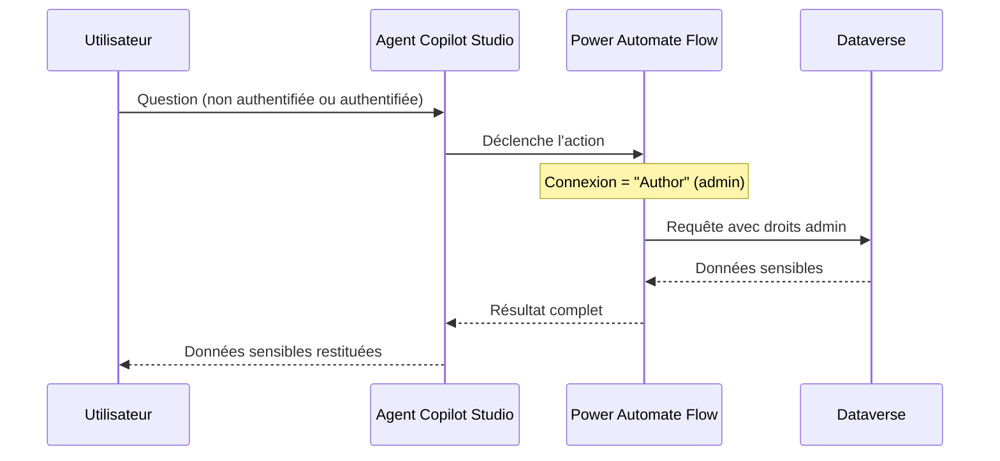
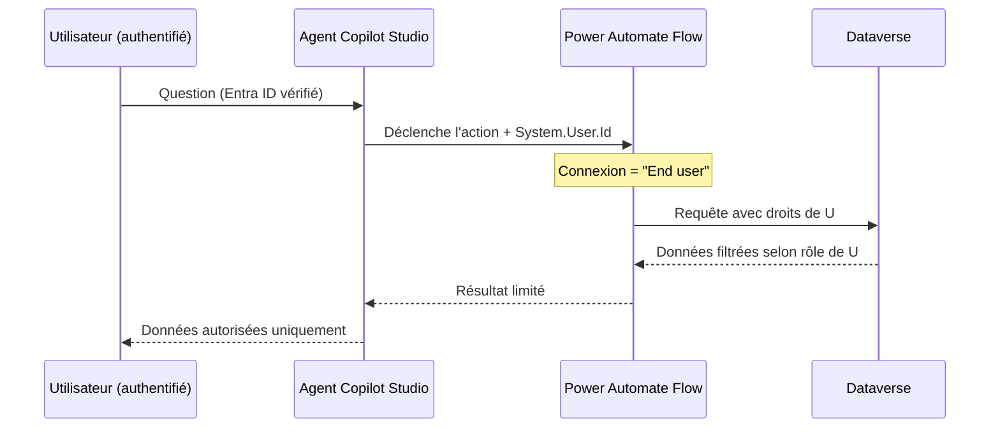

# Authentification et sécurité des agents Copilot Studio

## Objectifs pédagogiques

À l'issue de ce module, vous serez capable de :

1. **Identifier** les vecteurs d'attaque spécifiques aux agents conversationnels exposés sur le web ou dans Teams
2. **Configurer** l'authentification Entra ID (OAuth 2.0) sur un agent Copilot Studio pour restreindre l'accès
3. **Durcir** les paramètres de canal et de partage d'un agent contre les accès non autorisés
4. **Appliquer** le principe de moindre privilège aux connexions et aux actions que l'agent peut déclencher
5. **Détecter** les configurations risquées via les outils d'audit disponibles dans le Power Platform Admin Center

---

## Mise en situation

En mars 2024, une entreprise du secteur financier déploie un agent Copilot Studio en accès public — le bot est censé répondre aux questions générales sur les produits. Pas d'authentification configurée, car "les données utilisées sont publiques". Sauf que l'agent est connecté à une action Power Automate qui interroge Dataverse. L'action ne filtre pas sur l'identité de l'appelant : elle utilise une connexion implicite avec le compte du créateur du flow.

Résultat : n'importe qui, via l'URL de canal web, peut poser des questions qui déclenchent l'action, récupérer des données clients de Dataverse, et l'agent les restitue fidèlement — il fait son travail.

Ce scénario n'est pas hypothétique. Il est la conséquence directe d'un malentendu fréquent : **"les données de la base de connaissances sont publiques" ne signifie pas que les actions connectées à l'agent le sont aussi**. Et dans Copilot Studio, les deux sont couplés dans le même agent.

La défense naïve — "on mettra un mot de passe sur le site" — ne protège pas le canal direct. Le canal web d'un agent a sa propre URL, indépendante du portail qui l'héberge.

---

## Surface d'attaque d'un agent Copilot Studio

Avant de configurer quoi que ce soit, il faut savoir ce qui est effectivement exposé.

| Vecteur | Exposition | Impact potentiel |
|---|---|---|
| Canal web sans authentification | URL publique accessible sans compte | Exfiltration de données via actions connectées |
| Connexions implicites ("use creator's connection") | Le flow s'exécute avec les droits du créateur | Escalade de privilèges indirecte |
| Canal Teams mal scoped | Bot partagé avec "Everyone in the org" par défaut | Accès à des fonctionnalités réservées à un groupe |
| Variables de session non cloisonnées | Une variable globale persiste entre utilisateurs dans certains modes | Fuite de données inter-session |
| Actions sans validation d'entrée | L'agent transmet les inputs utilisateur directement à un flow | Injection via le prompt (prompt injection) |
| Secrets dans les topics | Hard-coding d'une clé API dans un message ou une variable | Exposition de credentials dans les logs de conversation |
| Partage de l'agent avec "Anyone can use" | Configuration par défaut pour certains canaux | Accès non authentifié à des capacités métier |

🧠 **Concept clé** — Dans Copilot Studio, l'agent et ses actions ne forment pas un seul périmètre de sécurité. L'authentification de l'agent (qui peut parler au bot) est distincte de l'authentification des actions (quels droits les appels déclenchés ont). Les deux doivent être configurés indépendamment.

---

## Authentification de l'agent : les trois modes

Copilot Studio propose trois configurations d'authentification, accessibles dans **Settings → Security → Authentication**.

### Mode 1 — No authentication

L'agent répond à toute requête sans vérifier l'identité. Utilisable uniquement si :
- L'agent n'a accès à aucune donnée personnelle ou métier
- Toutes les actions connectées utilisent des sources publiques
- Le canal est délibérément public (FAQ produit statique)

🔴 **Vecteur d'attaque** — Un agent en mode "No authentication" dont une action appelle un connecteur (SharePoint, Dataverse, HTTP) avec une connexion implicite est exploitable par n'importe qui connaissant l'URL du canal. La conversation n'est pas authentifiée mais l'action en arrière-plan, elle, s'exécute avec des droits réels.

### Mode 2 — Authenticate with Microsoft (Entra ID, recommandé)

L'utilisateur doit se connecter avec son compte Microsoft 365 avant de pouvoir interagir. Copilot Studio gère le flux OAuth 2.0 PKCE en coulisses.

```
Settings → Security → Authentication
→ Authenticate with Microsoft
→ Require users to sign in : ON
```

Ce mode expose deux variables système dans les topics :
- `System.User.DisplayName` — nom de l'utilisateur connecté
- `System.User.Id` — identifiant Entra ID (GUID)
- `System.User.IsLoggedIn` — booléen

Ces variables permettent de conditionner des branches dans les topics selon l'identité, et surtout de les passer aux actions Power Automate pour filtrer les données côté flow.

### Mode 3 — Manual (OAuth 2.0 custom)

Pour des scénarios où l'IdP n'est pas Entra ID (Okta, Auth0, Ping Identity). Requiert de configurer manuellement les endpoints OAuth, le client ID, le client secret et les scopes. Réservé aux cas où le mode 2 est architecturalement impossible.

⚠️ **Erreur fréquente** — Configurer l'authentification sur l'agent mais laisser le canal Teams en accès "Anyone in the org" sans vérifier que le groupe cible est correct. Dans Teams, l'authentification de l'agent et la politique de distribution du bot sont deux contrôles distincts. Un utilisateur peut ne pas avoir le droit d'utiliser le bot fonctionnellement mais y avoir accès techniquement si la distribution n'est pas restreinte.

---

## Connexions et actions : le vrai risque de privilèges

C'est ici que réside le risque le plus sous-estimé.

Quand un topic déclenche une action Power Automate, la question est : **avec quelle identité ce flow s'exécute-t-il ?**

Copilot Studio propose deux comportements pour les connexions dans les actions :

| Mode de connexion | Comportement | Risque |
|---|---|---|
| **Use the signed-in user's connection** | Le flow s'exécute avec les droits de l'utilisateur qui parle au bot | ✅ Recommandé — respecte le moindre privilège |
| **Use the bot author's connection** | Le flow s'exécute avec les droits du créateur de l'agent | 🔴 Dangereux — l'utilisateur hérite des droits du créateur |

```
Dans l'éditeur de topic → Action → Call an action
→ Sélectionner le flow
→ Connection settings → "End user" (pas "Author")
```

🔴 **Vecteur d'attaque concret** — Si le créateur de l'agent est un admin Dataverse et que le flow utilise sa connexion, tout utilisateur qui interagit avec l'agent peut indirectement lire (ou modifier, si le flow le permet) des données auxquelles il n'a pas accès directement. L'agent devient un proxy de privilèges.

### Ce que ça donne dans l'architecture



Avec la configuration correcte :



---

## Durcissement des canaux

Chaque canal de publication a ses propres paramètres de sécurité. Le fait qu'un agent soit configuré avec authentification ne signifie pas que tous ses canaux héritent automatiquement de cette contrainte.

### Canal web

```
Publish → Channels → Custom website
→ Security → Allowed origins : <DOMAINE_AUTORISÉ>
```

🔒 **Contrôle de sécurité** — Restreindre les origines CORS du canal web empêche qu'une autre page web intègre l'agent via iframe ou JavaScript et l'utilise hors contexte. Sans cette restriction, l'URL du canal est exploitable depuis n'importe quel site.

```
Allowed origins :
  https://monportail.entreprise.com
  (pas de * en production)
```

### Canal Teams

```
Admin Center Teams → Apps → Manage apps → <NOM_AGENT>
→ Permissions → Limit availability to specific groups
```

💡 **Astuce** — Pour les agents internes, toujours restreindre la disponibilité Teams à un groupe de sécurité Entra ID, pas à "Everyone". Même si l'agent requiert une authentification, un utilisateur hors scope ne devrait pas voir le bot dans Teams du tout — defense in depth.

### Canal SharePoint / Sites Power Pages

Si l'agent est embarqué dans Power Pages, l'authentification de Power Pages (contacts authentifiés vs visiteurs anonymes) s'applique à la page, mais **pas automatiquement à l'agent**. Il faut configurer les deux indépendamment.

⚠️ **Erreur fréquente** — Déployer un agent sur Power Pages en mode "authenticated users only" côté portail, mais laisser l'agent lui-même en "No authentication". Un attaquant qui connaît l'URL directe du canal web peut contourner le portail et accéder à l'agent directement.

---

## Principe de moindre privilège sur les topics et variables

### Cloisonnement des variables

Les variables dans Copilot Studio ont trois portées :

| Portée | Durée de vie | Risque si mal utilisée |
|---|---|---|
| `Topic` | Durée du topic uniquement | Faible |
| `Global` | Toute la session | Moyenne — peut être lue dans un autre topic |
| `Session` | Durée de la conversation | Acceptable si données non sensibles |

🔴 **Vecteur d'attaque** — Si une variable globale contient des données utilisateur (ex. : résultat d'une requête Dataverse avec des infos personnelles) et qu'un topic non sécurisé peut lire cette variable, un utilisateur peut potentiellement rediriger la conversation vers ce topic et exfiltrer la valeur.

**Règle** : stocker les données sensibles dans des variables de portée `Topic`, les effacer explicitement en fin de topic avec `Clear variable value`, ne jamais persister un token ou un résultat de requête en variable globale.

### Validation des entrées utilisateur

Les agents transmettent les messages utilisateur aux flows et aux recherches de base de connaissances. La **prompt injection** est un vecteur réel sur les agents LLM : un utilisateur peut insérer des instructions dans son message pour tenter de modifier le comportement de l'agent ou d'exfiltrer le system prompt.

🔒 **Contrôle de sécurité** — Dans les actions Power Automate appelées par l'agent, ne jamais concaténer directement l'input utilisateur dans une requête OData ou SQL sans validation. Utiliser les paramètres typés du connecteur Dataverse plutôt qu'une requête construite dynamiquement :

```
❌ /api/data/v9.2/contacts?$filter=contains(fullname,'<INPUT_UTILISATEUR>')
   → Risque d'injection via l'input

✅ Utiliser le connecteur Dataverse "List rows" avec le champ "Filter rows"
   et passer la valeur comme paramètre typé — le connecteur gère l'échappement
```

---

## Secrets et credentials dans les agents

🔴 **Vecteur d'attaque** — Il est techniquement possible d'inclure une clé API ou un mot de passe dans un message de topic, une variable initialisée en dur, ou un corps de requête HTTP dans un flow. Ces valeurs apparaissent en clair dans :
- Les transcriptions de conversation (accessibles dans l'admin center)
- Les logs du flow Power Automate
- L'export du bot si le projet est partagé

**Ce qu'il ne faut jamais faire :**
```
❌ Set variable "apiKey" to "sk-proj-xxxxxxxxxxxxxxxxxxx"
❌ HTTP action body : { "token": "Bearer eyJhbGc..." }
```

**Ce qu'il faut faire :**
- Stocker les secrets dans **Azure Key Vault** et y accéder depuis Power Automate via le connecteur Key Vault
- Utiliser les **Environment Variables** de type Secret dans Power Platform (preview disponible, GA en cours)
- Pour les connexions authentifiées, utiliser les connexions OAuth du connecteur — le token n'est jamais visible dans le flow

```
Power Automate → Connexions → New connection → [Service cible]
→ OAuth 2.0 → Le token est géré par la plateforme, non exposé dans le flow
```

💡 **Astuce** — Les transcriptions de conversation sont activées par défaut. Si l'agent traite des données sensibles, vérifier la politique de rétention dans **Settings → Advanced → Data retention** et envisager de désactiver les transcriptions si elles ne sont pas nécessaires pour le support.

---

## Contrôles de détection et audit

### Où regarder en cas d'incident

| Source | Ce qu'on y trouve | Chemin d'accès |
|---|---|---|
| Transcriptions de conversation | Historique complet des échanges utilisateur/agent | Copilot Studio → Analytics → Conversations |
| Logs Power Automate | Exécutions des flows déclenchés par l'agent, inputs/outputs | Power Automate → My Flows → Run history |
| Audit log M365 | Événements de création, modification, publication de l'agent | Compliance Center → Audit → Search |
| Power Platform Admin Center | Utilisation des agents par environnement, ressources consommées | PPAC → Analytics → Copilot Studio |
| Entra ID Sign-in logs | Connexions OAuth de l'agent, échecs d'authentification | Entra ID → Monitoring → Sign-in logs |

### Ce qu'il faut surveiller activement

🔒 **Contrôle de sécurité** — Configurer une alerte dans le **M365 Compliance Center** sur les événements `BotFramework` liés à l'agent pour détecter :
- Pics d'utilisation anormaux (scraping via le canal web)
- Erreurs d'authentification répétées (tentatives de bypass)
- Modifications non prévues de la configuration de l'agent

```
Compliance Center → Audit → New search
→ Activities : "Bot Framework" + "PowerVirtualAgents"
→ Date range : selon politique de rétention
→ Export → Analyser les volumes et les IPs sources
```

---

## Erreurs fréquentes

### 1. Agent en production avec "No authentication" et actions connectées

**Configuration dangereuse :** Agent publié sans authentification, avec une ou plusieurs actions Power Automate utilisant la connexion du créateur.

**Conséquence :** Tout internaute connaissant l'URL du canal peut déclencher les actions avec les droits du créateur.

**Correction :** Activer "Authenticate with Microsoft" + passer en connexion "End user" sur toutes les actions.

---

### 2. Partage de l'agent avec "Everyone" dans l'organisation

**Configuration dangereuse :**
```
Share → Add people or groups → Everyone in <TENANT>
```

**Conséquence :** Tous les employés, y compris comptes de service, comptes de test, prestataires avec accès invité, peuvent interagir avec l'agent.

**Correction :** Restreindre à un groupe de sécurité Entra ID dédié. Même pour un agent "interne général", créer un groupe de sécurité explicite est une bonne pratique — ça permet de révoquer l'accès rapidement.

---

### 3. Authentification configurée mais non vérifiée dans les topics

**Configuration dangereuse :** L'authentification est activée dans les settings, mais aucun topic ne vérifie `System.User.IsLoggedIn` avant d'exécuter une action sensible.

**Conséquence :** Si le canal permet d'atteindre le topic sans passer par le trigger d'authentification (redirection de topic manuelle, deep link), l'action s'exécute sans utilisateur authentifié vérifié.

**Correction :** Ajouter en début de chaque topic sensible une condition :
```
Condition : System.User.IsLoggedIn = true
  → Branch : True → continuer
  → Branch : False → message d'erreur + End conversation
```

---

### 4. Variables globales utilisées pour des données personnelles

**Configuration dangereuse :** Résultat d'une requête contenant des données utilisateur stocké dans une variable globale pour "faciliter la navigation entre topics".

**Conséquence :** Si un autre topic (accessible sans restriction) lit cette variable, les données peuvent être exposées hors contexte.

**Correction :** Portée `Topic` pour toute donnée sensible. Passer les valeurs nécessaires en paramètres entre topics plutôt qu'en variable globale.

---

## Cas réel en entreprise

Une DSI déploie un agent RH interne pour répondre aux questions des employés sur les congés, la paie et les avantages. L'agent est connecté à Dataverse (table Employee) et à SharePoint (documents RH).

**Configuration initiale :**
- Authentification : "Authenticate with Microsoft" ✅
- Connexion des actions : "Author's connection" ❌
- Partage Teams : "Everyone in org" ❌
- Variables : données salariales en variable globale ❌

**Incident :** Un employé du helpdesk IT, en testant le bot pour un rapport de bug, constate qu'en posant des questions spécifiques sur un collègue nommément, l'agent restitue des informations salariales. Il n'a aucun droit RH dans Dataverse.

**Cause racine :** La connexion "Author" appartient au responsable RH qui a créé l'agent. Toute requête Dataverse s'exécute avec ses droits, sans filtre sur l'identité de l'employé connecté. L'authentification de l'agent valide qui peut parler au bot, pas ce que le bot peut restituer.

**Correction déployée en urgence :**
1. Passage de toutes les actions en connexion "End user"
2. Restriction du partage Teams au groupe de sécurité "Employés RH + Managers"
3. Ajout d'un filtre OData dans le flow : `employeeId eq '<SYSTEM_USER_ID>'` pour que chaque employé ne voie que ses propres données
4. Variables salariales passées en portée Topic avec effacement explicite

**Leçon :** L'authentification de l'agent est une porte d'entrée, pas une garantie sur ce que l'agent peut faire une fois à l'intérieur. La sécurité des données dépend des droits avec lesquels les actions s'exécutent.

---

## Résumé

Un agent Copilot Studio mal configuré n'est pas juste un bot trop bavard — c'est un proxy d'accès aux données et aux actions de la plateforme. Le vecteur d'attaque le plus courant n'est pas une faille technique dans Copilot Studio lui-même, mais une combinaison de deux mauvaises décisions de configuration : l'absence d'authentification sur le canal et l'utilisation de la connexion du créateur pour les actions. Ces deux erreurs ensemble donnent à n'importe qui les droits d'un admin sur les ressources connectées. La défense repose sur trois contrôles concrets : activer l'authentification Entra ID, passer les actions en connexion "End user", et restreindre la distribution par groupe de sécurité. Côté détection, les transcriptions et les logs Power Automate sont les premières sources à consulter. Ce qui reste à surveiller en opération : les pics d'utilisation anormaux sur le canal web, les flows déclenchés avec des inputs inattendus, et les variables qui persistent des données sensibles au-delà de leur topic d'origine.

---

<!-- snippet
id: copilot_auth_mode_config
type: concept
tech: Copilot Studio
level: intermediate
importance: high
format: knowledge
tags: authentification, copilot studio, entra id, oauth, sécurité
title: Les trois modes d'authentification d'un agent Copilot Studio
content: Copilot Studio propose "No authentication" (accès public total), "Authenticate with Microsoft" (OAuth 2.0 PKCE via Entra ID, recommandé pour tous les agents internes) et "Manual" (OAuth custom pour IdP tiers). Le mode "No authentication" n'empêche pas les actions connectées de s'exécuter avec les droits du créateur en arrière-plan.
description: Le mode d'authentification de l'agent contrôle QUI peut parler au bot — pas avec quels droits les actions s'exécutent. Les deux sont indépendants.
-->

<!-- snippet
id: copilot_connection_author_risk
type: warning
tech: Copilot Studio
level: intermediate
importance: high
format: knowledge
tags: connexion, privilèges, escalade, power automate, copilot studio
title: Connexion "Author" dans les actions = escalade de privilèges silencieuse
content: Si une action Power Automate déclenchée par l'agent utilise la connexion du créateur (mode "Author"), tout utilisateur du bot s'exécute avec les droits de ce créateur sur Dataverse, SharePoint, etc. Un utilisateur sans accès RH peut exfiltrer des données salariales si le créateur est RH admin. Correction : passer en "End user" dans les Connection settings de chaque action.
description: "Author's connection" fait du bot un proxy de privilèges — l'utilisateur hérite des droits du créateur sur toutes les ressources connectées.
-->

<!-- snippet
id: copilot_enduser_connection_path
type: tip
tech: Copilot Studio
level: intermediate
importance: high
format: knowledge
tags: connexion, moindre privilège, action, configuration, copilot studio
title: Forcer la connexion "End user" sur les actions Copilot Studio
content: Dans l'éditeur de topic, sélectionner l'action → Call an action → Connection settings → choisir "End user" (et non "Author"). Cette option n'est disponible que si le mode d'authentification de l'agent est "Authenticate with Microsoft" ou "Manual". Sans authentification activée, seule la connexion Author est disponible — raison supplémentaire d'activer l'auth.
description: Le mode "End user" force le flow à s'exécuter avec les droits de l'utilisateur connecté, respectant les permissions Dataverse/SharePoint de chaque individu.
-->

<!-- snippet
id: copilot_cors_canal_web
type: warning
tech: Copilot Studio
level: intermediate
importance: medium
format: knowledge
tags: cors, canal web, exposition, configuration, copilot studio
title: Canal web sans restriction CORS = agent intégrable depuis n'importe quel site
content: Sans configuration d'Allowed Origins, l'URL du canal web d'un agent peut être intégrée dans n'importe quelle page externe via iframe ou JS. Même si le portail officiel est sécurisé, le canal direct reste accessible. Correction : Publish → Channels → Custom website → Security → Allowed origins → lister les domaines autorisés explicitement, jamais *.
description: L'URL de canal web est indépendante du portail qui héberge l'agent. CORS non restreint = contournement de la sécurité du portail.
-->

<!-- snippet
id: copilot_variable_scope_sensitive
type: warning
tech: Copilot Studio
level: intermediate
importance: medium
format: knowledge
tags: variables, portée, fuite données, global, copilot studio
title: Variables globales avec données sensibles — fuite inter-topic
content: Une variable Global persiste toute la session et est lisible par n'importe quel topic, y compris ceux sans vérification d'identité. Si une requête Dataverse stocke un résultat en variable globale, un topic secondaire (accessible par redirection ou deep link) peut lire et restituer ces données. Correction : portée Topic pour les données sensibles, effacement explicite en fin de topic avec "Clear variable value".
description: Portée Global = lisible partout dans la session. Toute donnée personnelle ou métier doit rester en portée Topic et être effacée après usage.
-->

<!-- snippet
id: copilot_isloggedin_check
type: tip
tech: Copilot Studio
level: intermediate
importance: high
format: knowledge
tags: authentification, topic, condition, sécurité, copilot studio
title: Vérifier System.User.IsLoggedIn en début de chaque topic sensible
content: Activer l'authentification dans Settings ne suffit pas si les topics ne vérifient pas explicitement que l'utilisateur est connecté. Ajouter en début de topic : Condition → System.User.IsLoggedIn = true → Branch True : continuer / Branch False : message d'erreur + End conversation. Sans ce contrôle, une redirection directe vers le topic contourne la vérification globale.
description: L'authentification configure la porte — la vérification dans le topic vérifie que quelqu'un a bien passé cette porte avant d'accéder au contenu.
-->

<!-- snippet
id: copilot_dataverse_filter_userid
type: tip
tech: Power Automate
level: intermediate
importance: high
format: knowledge
tags: dataverse, filtre, identité, odata, moindre privilège
title: Filtrer les requêtes Dataverse sur l'identité de l'utilisateur connecté
content: Dans un flow déclenché par un agent avec connexion "End user", passer System.User.Id comme paramètre et l'utiliser dans le filtre OData du connecteur Dataverse List rows. Exemple : Filter rows → cr_employeeid eq '<SYSTEM_USER_ID>'. Cela garantit que chaque utilisateur ne voit que ses propres données, même si la table contient des données de tous les employés.
description: Sans filtre sur l'identité, une connexion "End user" avec droits en lecture sur toute la table reste exploitable pour lire les données des autres.
-->

<!-- snippet
id: copilot_secret_keyvault
type: warning
tech: Power Automate
level: intermediate
importance: high
format: knowledge
tags: secrets, key vault, credentials, hardcoding, sécurité
title: Ne jamais stocker une clé API dans une variable ou un message de topic
content: Les valeurs en dur dans les variables Copilot Studio apparaissent en clair dans les transcriptions de conversation et dans l'export du bot. Les tokens dans les corps de requête HTTP des flows apparaissent dans le Run history. Correction : stocker dans Azure Key Vault, accéder via le connecteur Key Vault dans Power Automate, ou utiliser des connexions OAuth gérées par la plateforme.
description: Transcriptions + Run history + export du bot = trois surfaces d'exposition pour tout secret codé en dur dans un agent ou un flow associé.
-->

<!-- snippet
id: copilot_audit_search_path
type: tip
tech: Microsoft 365
level: intermediate
importance: medium
format: knowledge
tags: audit, logs, détection, compliance, copilot studio
title: Rechercher les événements d'un agent dans l'audit M365
content: Compliance Center → Audit → New search → Activities : filtrer sur "PowerVirtualAgents" et "BotFramework" → sélectionner la plage de dates → Export. Permet de détecter pics d'utilisation, modifications de configuration non prévues, et tentatives d'accès depuis des IPs inhabituelles.
description: Les événements Copilot Studio dans l'audit M365 couvrent création, publication, modification et utilisation — première source pour un audit ou un incident.
-->

<!-- snippet
id: copilot_teams_distribution_group
type: tip
tech: Copilot Studio
level: intermediate
importance: medium
format: knowledge
tags: teams, distribution, groupe sécurité, accès, copilot studio
title: Restreindre la distribution Teams d'un agent à un groupe de sécurité Entra ID
content: Dans Teams Admin Center → Apps → Manage apps → [Agent] → Permissions → Limit availability to specific users and groups → sélectionner le groupe de sécurité Entra ID dédié. Éviter "Everyone in the organization" même pour les agents "généraux" — un groupe explicite permet une révocation rapide et un audit clair de qui a accès.
description: La distribution Teams est indépendante de l'authentification de l'agent. Les deux contrôles doivent être configurés pour une défense en profondeur.
-->
