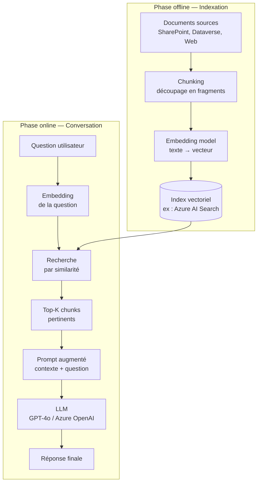
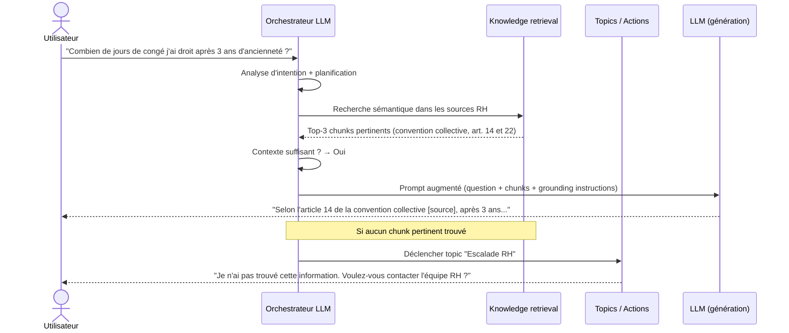

# RAG et orchestration générative

## Objectifs pédagogiques

À l'issue de ce module, vous serez capable de :

1. **Expliquer** le mécanisme de Retrieval-Augmented Generation et pourquoi il résout les limites intrinsèques d'un LLM statique
2. **Concevoir** l'architecture d'un pipeline RAG dans Copilot Studio, en identifiant le rôle de chaque composant
3. **Distinguer** les stratégies d'orchestration (generative, classic) et choisir la bonne selon les contraintes métier
4. **Connecter** des sources de connaissance hétérogènes (SharePoint, Dataverse, sites web, fichiers) à un agent
5. **Diagnostiquer** les cas où le RAG dégrade la qualité de réponse et appliquer les mitigations adaptées

---

## Mise en situation

Vous rejoignez une équipe qui a déployé un agent Copilot Studio pour le support RH. L'agent répond aux questions des collaborateurs sur les congés, les avantages et les procédures internes. Pendant les six premiers mois, ça marche bien — le modèle a été configuré avec une base de connaissance statique. Puis la convention collective est mise à jour, les règles de télétravail changent, et une nouvelle offre de mutuelle entre en vigueur.

Résultat : l'agent continue de donner des réponses précises... mais sur l'ancienne version des règles.

Le problème n'est pas la qualité du LLM. C'est que le LLM ne sait que ce qu'on lui a donné au moment de la configuration, et rien de ce qui a changé depuis. C'est exactement le problème que RAG résout — et comprendre pourquoi est le point de départ de ce module.

---

## Pourquoi un LLM seul ne suffit pas

Un Large Language Model a été entraîné sur un corpus figé à une date donnée. Son savoir est encyclopédique mais statique. Quand vous lui posez une question sur les procédures internes de votre entreprise, sur le contenu d'un document SharePoint mis à jour hier, ou sur une donnée Dataverse créée ce matin — il ne sait pas. Il va soit admettre son ignorance, soit, et c'est le vrai danger, **halluciner** une réponse vraisemblable mais fausse.

La solution naive est de tout mettre dans le prompt : "Voici les 200 pages du règlement intérieur, maintenant réponds à ma question." Ça fonctionne parfois, mais ça a des limites sévères. D'abord la fenêtre de contexte : même les modèles récents avec 128K tokens atteignent leurs limites sur des corpus documentaires réels. Ensuite le coût : chaque token injecté est facturé. Et enfin la qualité : noyer le modèle dans du texte non pertinent dégrade sa précision, un phénomène qu'on appelle **context pollution**.

RAG adopte une approche différente : plutôt que de tout envoyer, on **récupère uniquement les fragments pertinents** pour la question posée, et on les injecte dans le contexte du LLM au moment de la génération.

---

## Architecture du système RAG

Un pipeline RAG complet se décompose en deux phases distinctes qui ne s'exécutent pas au même moment.

### Phase offline : indexation

C'est la phase de préparation, qui s'exécute en dehors du cycle de conversation. Les documents sources sont découpés en **chunks** (fragments de taille contrôlée), chaque chunk est converti en **vecteur d'embedding** (une représentation numérique de son sens sémantique), et ces vecteurs sont stockés dans un **index vectoriel**.

### Phase online : retrieval + generation

Au moment où l'utilisateur pose une question, la question est elle aussi convertie en vecteur, une **recherche par similarité cosinus** identifie les chunks les plus proches sémantiquement, ces chunks sont injectés dans le prompt, et le LLM génère une réponse en s'appuyant sur ce contexte augmenté.



Le tableau ci-dessous récapitule le rôle de chaque composant dans Copilot Studio :

| Composant | Rôle | Implémentation dans Copilot Studio |
|---|---|---|
| Source de connaissance | Fournit le corpus documentaire brut | SharePoint, Dataverse, URL publiques, fichiers uploadés |
| Chunking | Découpe les documents en fragments interrogeables | Géré automatiquement par la plateforme |
| Embedding model | Convertit texte → vecteur sémantique | Azure OpenAI `text-embedding-ada-002` (interne) |
| Index vectoriel | Stocke et recherche les vecteurs | Azure AI Search (interne, géré) |
| Orchestrateur | Décide quand et comment déclencher le retrieval | Moteur generative de Copilot Studio |
| LLM | Génère la réponse à partir du contexte augmenté | GPT-4o via Azure OpenAI |
| Grounding instructions | Cadre le comportement du LLM sur les sources | Champ "Instructions" de l'agent |

---

## Orchestration générative vs classique

C'est ici que Copilot Studio introduit un choix architectural important. Quand un utilisateur pose une question, l'agent doit décider **comment y répondre**. Il y a deux modes d'orchestration.

### Mode classique

L'agent suit un arbre de décision explicite : topics déclenchés par des phrases-clés, flux configurés manuellement, réponses prédéfinies. C'est déterministe, prévisible, et adapté aux parcours fortement structurés (formulaires, processus métier séquentiels). Mais il ne gère pas bien les questions imprévues ou formulées différemment de ce qui a été anticipé.

### Mode generative (orchestration générative)

L'agent délègue la décision au LLM lui-même. À chaque tour de conversation, le modèle analyse l'intention de l'utilisateur, décide quelles sources de connaissance interroger, quels topics ou actions déclencher, et comment formuler la réponse. C'est le mode qui s'appuie directement sur RAG.

🧠 **Concept clé** — En orchestration générative, le LLM joue le rôle d'un **planificateur** : il décompose la demande, sélectionne les outils disponibles (sources, actions, topics), les exécute dans l'ordre logique, et synthétise le résultat. Ce pattern est souvent appelé *ReAct* (Reason + Act) dans la littérature sur les agents LLM.

Le choix entre les deux modes n'est pas binaire. Une architecture mature **combine les deux** : l'orchestration générative gère les questions ouvertes et la navigation dans la connaissance, tandis que des topics classiques prennent le relais pour les flux critiques qui doivent être déterministes (validation d'une commande, escalade vers un humain, envoi d'un email).

---

## Configuration des sources de connaissance dans Copilot Studio

### Types de sources supportées

Copilot Studio distingue deux niveaux de configuration des sources de connaissance.

**Au niveau de l'agent** (sources globales, disponibles pour toutes les conversations) :

- **Sites SharePoint / OneDrive** — l'agent indexe les bibliothèques de documents accessibles via les permissions du service principal
- **Sites web publics** — Copilot Studio crawle et indexe le contenu (limité à quelques centaines de pages par source)
- **Fichiers uploadés directement** — PDF, Word, texte brut (taille limitée par source)
- **Dataverse** — tables spécifiques exposées comme source de connaissance structurée

**Au niveau d'un topic** (sources contextuelles, déclenchées dans un flux précis) :

- Actions Power Automate qui récupèrent des données à la volée
- Appels HTTP vers des API externes
- Connecteurs vers des systèmes tiers (ServiceNow, SAP via connecteur certifié, etc.)

### Configurer une source SharePoint

Dans Copilot Studio, la navigation est la suivante :

```
Copilot Studio → [Votre agent] → Settings → Generative AI → Add knowledge
→ SharePoint → Coller l'URL de la bibliothèque ou du site
```

💡 **Astuce** — L'agent hérite des permissions de l'utilisateur connecté pour les sources SharePoint quand l'authentification SSO est active. Si l'agent est configuré pour fonctionner de manière anonyme (authentification désactivée), il utilise les permissions du service principal d'application. Vérifiez que ce compte a bien accès aux bibliothèques indexées, sinon le retrieval retournera silencieusement zéro résultat.

### Grounding instructions

Une fois les sources connectées, le comportement du LLM sur ces sources se contrôle via les **grounding instructions** — un champ texte libre dans les paramètres généraux de l'agent. C'est l'équivalent d'un system prompt orienté RAG.

Exemple de grounding instructions efficaces :

```
Tu es l'assistant RH de Contoso. Tu réponds uniquement à partir des documents 
de la base de connaissance fournie. 

Si la réponse n'est pas dans les documents disponibles, dis clairement que tu 
ne trouves pas l'information et invite l'utilisateur à contacter l'équipe RH 
à l'adresse rh@contoso.com.

Ne jamais inventer de chiffres, de dates ou de règles qui ne figurent pas 
explicitement dans les sources. Si plusieurs documents se contredisent, 
mentionne les deux versions et indique les dates de publication respectives.
```

⚠️ **Erreur fréquente** — Laisser les grounding instructions vides en pensant que "le modèle saura". Sans instruction explicite, le LLM peut compléter les trous avec ses connaissances générales d'entraînement — ce qui est exactement le comportement qu'on cherche à éviter dans un contexte d'entreprise.

---

## Workflow d'une requête en orchestration générative

Suivre le chemin exact d'une question de l'entrée à la réponse aide à comprendre où les décisions sont prises — et où les choses peuvent mal tourner.



Quelques points de décision critiques dans ce workflow :

**Le seuil de pertinence** — L'orchestrateur ne retourne pas tous les chunks dont le score de similarité est positif. Il applique un seuil minimal. Si aucun chunk ne dépasse ce seuil, l'agent peut soit répondre qu'il n't trouve pas l'information, soit — si le mode n'est pas correctement contraint — tenter de répondre depuis ses connaissances générales. D'où l'importance des grounding instructions.

**La fenêtre de contexte injectée** — Par défaut, Copilot Studio injecte les top-3 à top-5 chunks. Augmenter ce nombre améliore le recall mais augmente le coût par token et peut diluer la précision si les chunks supplémentaires sont peu pertinents.

**La citation des sources** — En mode generative, le modèle peut être instruit de citer explicitement les sources. Copilot Studio gère cela nativement : les sources utilisées sont affichées comme références cliquables dans l'interface de chat, ce qui améliore la traçabilité et la confiance des utilisateurs.

---

## Stratégies de chunking et leurs implications

Copilot Studio gère le chunking automatiquement pour la plupart des sources, mais comprendre ses mécanismes aide à optimiser la qualité du retrieval.

Le **chunking fixe** découpe le document à intervalles réguliers (ex : tous les 512 tokens). Simple, mais il coupe parfois une idée au milieu d'une phrase.

Le **chunking sémantique** essaie de respecter les frontières naturelles du texte (paragraphes, sections, titres). C'est ce que Copilot Studio applique par défaut sur les documents Word et PDF bien structurés.

Le **chunking hiérarchique** conserve une représentation à plusieurs granularités : un résumé de section pour le retrieval initial, et le texte complet pour l'injection dans le prompt. Ce pattern améliore le recall sans exploser le contexte.

💡 **Astuce** — La qualité du chunking dépend directement de la qualité de la structure du document source. Un PDF scanné sans OCR, un document Word sans titres balisés, ou une page SharePoint en texte brut non structuré produiront des chunks de mauvaise qualité. Investir dans la structuration des sources est souvent plus rentable qu'optimiser les paramètres du pipeline.

---

## Limites du RAG et comment les adresser

RAG n'est pas une solution universelle. Il a des angles morts précis, et les ignorer conduit à des architectures qui fonctionnent en démo mais déçoivent en production.

**Limite 1 : Le retrieval rate manque la bonne source**

*Symptôme :* L'agent dit qu'il ne trouve pas l'information, alors que le document existe bien dans la base de connaissance.
*Cause :* La question de l'utilisateur est formulée avec un vocabulaire différent de celui du document (synonymes, acronymes, langues mixtes). La similarité cosinus est forte sur la forme, pas sur le sens profond.
*Mitigation :* Ajouter une étape de **reformulation de requête** (HyDE — Hypothetical Document Embedding, ou query expansion) — le LLM génère d'abord une version idéale du document qui répondrait à la question, et c'est ce texte hypothétique qu'on vectorise pour la recherche. Copilot Studio ne l'expose pas nativement, mais c'est implémentable via un topic + action Power Automate + Azure AI Search direct.

**Limite 2 : Réponses synthétiques sur des données tabulaires**

*Symptôme :* L'agent donne des réponses approximatives sur des données structurées (tableaux, listes de prix, inventaires).
*Cause :* RAG est conçu pour du texte non structuré. Une table de 500 lignes produira des chunks incohérents qui perdent le contexte des colonnes.
*Mitigation :* Pour les données structurées, utiliser une action Dataverse ou une API dédiée plutôt que d'indexer la table comme document. L'orchestrateur générative peut décider d'appeler cette action plutôt que de faire du retrieval.

**Limite 3 : Dérive sur les documents contradictoires**

*Symptôme :* Deux documents dans la base de connaissance donnent des informations contradictoires sur le même sujet. L'agent choisit l'un ou l'autre de manière imprévisible.
*Cause :* L'orchestrateur n'a pas de logique de résolution de conflits. Il injecte les chunks sans hiérarchie.
*Mitigation :* Structurer les sources avec des métadonnées de priorité et de date. Les grounding instructions peuvent inclure une règle explicite : "En cas de conflit entre deux sources, utiliser la plus récente et signaler la contradiction à l'utilisateur."

**Limite 4 : Coût non maîtrisé**

*Symptôme :* Les coûts de messages augmentent de manière non linéaire avec l'usage.
*Cause :* En mode generative, chaque tour de conversation peut déclencher plusieurs appels LLM (analyse d'intention, retrieval, génération, vérification). Le nombre de tokens injectés augmente avec la taille des chunks et leur nombre.
*Mitigation :* Limiter le nombre de sources actives par agent. Utiliser des topics classiques pour les flux très fréquents et prévisibles — réserver l'orchestration générative aux cas complexes. Monitorer le taux d'utilisation des messages dans le Centre d'administration Power Platform.

---

## Bonnes pratiques

**Sur la conception des sources**

Organiser les documents par domaine et par audience avant de les connecter. Un agent de support IT et un agent RH ne devraient pas partager la même base de connaissance — les chunks croisés génèrent du bruit dans les résultats.

Nommer les fichiers et les sections de manière explicite. L'embedding du titre d'une section contribue au score de pertinence. "Politique de remboursement des frais de déplacement 2024" retrouvera mieux qu'un fichier nommé "doc_final_v3_bis.pdf".

**Sur les grounding instructions**

Toujours définir explicitement ce que l'agent doit faire quand il ne trouve pas l'information. L'absence de fallback est la cause principale des hallucinations en production.

Tester les instructions avec des questions aux limites : questions hors périmètre, questions dans une langue inattendue, questions volontairement ambiguës.

**Sur l'orchestration**

Ne pas activer l'orchestration générative sur un agent dont tous les flux sont déterministes. Le mode classique sera plus fiable et moins coûteux.

Utiliser les **topics de fallback** comme filet de sécurité. En mode generative, si l'orchestrateur échoue à planifier une réponse, le topic de fallback prend le relais — configurer un message utile, pas juste "Je n'ai pas compris".

**Sur l'évaluation**

Créer un jeu de questions de référence couvrant les sujets clés de la base de connaissance, avec les réponses attendues. Rejouer ce benchmark après chaque mise à jour des sources pour détecter les régressions.

---

## Résumé

RAG résout le problème fondamental du LLM statique en lui injectant dynamiquement les fragments documentaires les plus pertinents au moment de la génération. Dans Copilot Studio, ce pipeline est largement automatisé : l'indexation vectorielle, le retrieval par similarité et l'injection dans le contexte se configurent en connectant des sources de connaissance. Le vrai levier architectural reste le choix du mode d'orchestration — générative pour les agents ouverts et conversationnels, classique pour les flux critiques et déterministes — et leur combinaison intelligente. Les limites du RAG ne viennent pas du mécanisme lui-même mais de la qualité des sources, de l'absence d'instructions de grounding, et de données structurées mal adaptées à ce paradigme. Un pipeline RAG robuste en production repose sur trois piliers : des sources bien structurées et maintenues, des instructions de grounding explicites, et un mécanisme de fallback qui évite toute hallucination face à l'inconnu.

---

<!-- snippet
id: copilot_rag_grounding_instructions
type: concept
tech: Copilot Studio
level: advanced
importance: high
format: knowledge
tags: rag, grounding, llm, hallucination, copilot-studio
title: Grounding instructions — rôle et fonctionnement
content: Les grounding instructions sont un system prompt injecté avant chaque tour de conversation. Elles cadrent le comportement du LLM sur les sources récupérées par RAG. Sans elles, le modèle comble les lacunes avec ses connaissances d'entraînement → risque d'hallucination. Se configurent dans Settings → Generative AI de l'agent.
description: Équivalent du system prompt RAG dans Copilot Studio — contrôle ce que le modèle fait quand il ne trouve pas l'information dans les sources
-->

<!-- snippet
id: copilot_rag_orchestration_modes
type: concept
tech: Copilot Studio
level: advanced
importance: high
format: knowledge
tags: orchestration, generative, classic, copilot-studio, agent
title: Orchestration générative vs classique — quand choisir
content: Mode classique = arbre de décision explicite, déterministe, adapté aux flux structurés. Mode generative = le LLM planifie lui-même (intention → outils → réponse), adapté aux questions ouvertes et au RAG. Une architecture mature combine les deux : generative pour la navigation documentaire, classique pour les flux critiques (validation, escalade).
description: Le mode generative délègue la planification au LLM (pattern ReAct) ; le classique suit un arbre de topics configuré manuellement
-->

<!-- snippet
id: copilot_rag_source_sharepoint
type: tip
tech: Copilot Studio
level: advanced
importance: high
format: knowledge
tags: sharepoint, knowledge, permissions, rag, copilot-studio
title: Source SharePoint — piège des permissions silencieuses
content: Si l'agent fonctionne sans SSO (auth désactivée), le retrieval utilise le service principal d'application. Si ce compte n'a pas accès à la bibliothèque indexée, le retrieval retourne 0 résultat sans erreur visible. Vérifier les permissions du service principal dans les paramètres du site SharePoint avant tout test de qualité RAG.
description: Un retrieval retournant 0 résultat silencieusement est souvent un problème de permissions sur le service principal, pas de pertinence documentaire
-->

<!-- snippet
id: copilot_rag_structured_data_limit
type: warning
tech: Copilot Studio
level: advanced
importance: high
format: knowledge
tags: rag, dataverse, structured-data, chunking, limitation
title: RAG et données tabulaires — incompatibilité structurelle
content: Piège : indexer une table Dataverse ou un fichier Excel comme source de connaissance RAG. Le chunking fragmente les lignes et perd le contexte des colonnes → réponses approximatives ou fausses sur les données chiffrées. Correction : exposer les données structurées via une action Power Automate ou un appel API, pas via le pipeline RAG.
description: RAG est conçu pour le texte non structuré — une table de 500 lignes produit des chunks incohérents qui perdent la signification des colonnes
-->

<!-- snippet
id: copilot_rag_chunking_quality
type: tip
tech: Copilot Studio
level: advanced
importance: medium
format: knowledge
tags: chunking, document-quality, rag, sharepoint, structuration
title: Qualité du chunking dépend de la structure du document source
content: Copilot Studio applique un chunking sémantique (basé sur les frontières naturelles du texte). Un PDF scanné sans OCR, un Word sans titres balisés H1/H2, ou une page SharePoint en texte brut produisent des chunks dégradés. Structurer les documents avec des titres explicites et des sections logiques améliore le retrieval plus efficacement que tout réglage de pipeline.
description: Investir dans la structure des documents sources (titres, sections, nommage explicite) est le levier RAG le plus rentable avant d'optimiser les paramètres
-->

<!-- snippet
id: copilot_rag_fallback_topic
type: tip
tech: Copilot Studio
level: advanced
importance: high
format: knowledge
tags: fallback, orchestration, generative, copilot-studio, production
title: Configurer un topic de fallback en mode generative
content: En orchestration générative, si le LLM échoue à planifier une réponse (aucun chunk pertinent, intention non reconnue), le topic de fallback prend le relais. Configurer ce topic avec un message d'escalade utile (email de contact, numéro, lien formulaire) plutôt que le message par défaut "Je n'ai pas compris". C'est le seul filet de sécurité contre les réponses vides en production.
description: Le topic de fallback est le seul garde-fou quand l'orchestrateur generative ne trouve ni source pertinente ni topic applicable
-->

<!-- snippet
id: copilot_rag_contradiction_mitigation
type: warning
tech: Copilot Studio
level: advanced
importance: medium
format: knowledge
tags: rag, contradiction, sources, grounding, quality
title: Documents contradictoires — comportement imprévisible du RAG
content: Piège : deux documents dans la base de connaissance donnent des règles contradictoires. Le retrieval peut retourner les deux chunks ; le LLM choisit sans logique de priorité. Correction : ajouter dans les grounding instructions une règle explicite ("En cas de conflit, utiliser la source la plus récente et signaler la contradiction") et maintenir des métadonnées de date sur les documents.
description: Sans règle de résolution dans les grounding instructions, le LLM choisit arbitrairement entre sources contradictoires — comportement non déterministe en production
-->

<!-- snippet
id: copilot_rag_cost_control
type: tip
tech: Copilot Studio
level: advanced
importance: medium
format: knowledge
tags: cost, messages, orchestration, copilot-studio, production
title: Maîtriser les coûts en orchestration générative
content: En mode generative, chaque tour de conversation peut déclencher 2 à 4 appels LLM (intention, retrieval, génération, vérification). Pour les flux fréquents et prévisibles (FAQ structurée, formulaires), utiliser des topics classiques → 1 seul appel LLM. Réserver l'orchestration générative aux questions ouvertes. Monitorer dans le Centre d'administration Power Platform → Analytics → Copilot.
description: L'orchestration générative multiplie les appels LLM par tour — migrer les flux fréquents vers des topics classiques réduit significativement la consommation de messages
-->

<!-- snippet
id: copilot_rag_hyde_pattern
type: concept
tech: Copilot Studio
level: advanced
importance: medium
format: knowledge
tags: rag, hyde, query-expansion, retrieval, azure-ai-search
title: HyDE — améliorer le retrieval par document hypothétique
content: HyDE (Hypothetical Document Embedding) : au lieu de vectoriser la question directement, on demande au LLM de générer le texte idéal qui répondrait à la question, puis on vectorise ce texte hypothétique pour la recherche. La similarité est plus forte car on compare deux textes de même registre (document vs document) plutôt que question vs document. Non natif dans Copilot Studio — implémentable via topic + action Power Automate + Azure AI Search REST API.
description: HyDE améliore le recall quand le vocabulaire de la question diffère du corpus documentaire — génère d'abord un document hypothétique avant de vectoriser
-->
