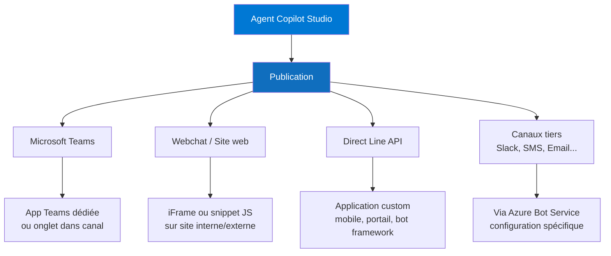

# Canaux, publication et monitoring

## Objectifs pédagogiques

À l'issue de ce module, vous serez capable de :

- Publier un agent Copilot Studio sur plusieurs canaux simultanément et comprendre ce que cette publication déclenche réellement
- Identifier les contraintes spécifiques à chaque canal (Teams, Webchat, API directe, canaux tiers) et adapter la configuration en conséquence
- Configurer Application Insights pour centraliser la télémétrie d'un agent en production
- Lire et interpréter les métriques natives de Copilot Studio pour diagnostiquer une baisse de qualité
- Distinguer un problème de canal d'un problème de contenu ou d'orchestration

---

## Mise en situation

Votre équipe vient de finaliser un agent conversationnel pour le support RH d'une entreprise de 8 000 collaborateurs. L'agent couvre les congés, la paie, les avantages sociaux — avec une architecture RAG branchée sur SharePoint, des topics structurés et quelques appels Power Automate pour des actions transactionnelles.

La démonstration en sandbox a convaincu tout le monde. Maintenant vient la vraie question : **comment on déploie ça à grande échelle, et comment on sait si ça marche ?**

Les questions techniques qui se posent immédiatement :
- Est-ce qu'on publie sur Teams directement ou via le portail admin M365 ?
- Le webchat intégré sur l'intranet SharePoint — même configuration ou pas ?
- Si l'agent répond n'importe quoi à 14h un mardi, comment on le sait avant que le CHRO appelle ?
- Comment on mesure le taux d'escalade vers un agent humain ? Le taux de résolution ?

Ce module répond à ces questions dans l'ordre où elles se posent en production.

---

## Ce que "publier" veut vraiment dire dans Copilot Studio

Il y a une confusion fréquente ici, et elle a des conséquences concrètes. Dans Copilot Studio, il existe **deux actions distinctes** que beaucoup de gens confondent :

**Sauvegarder / tester** : les modifications sont visibles uniquement dans l'environnement de test interne. Personne d'autre ne les voit.

**Publier** : un snapshot de l'agent est packagé et poussé vers tous les canaux actifs. C'est un déploiement synchrone — après publication, tous vos canaux reçoivent la même version simultanément.

🧠 **Concept clé** — La publication Copilot Studio n'est pas continue. C'est un acte délibéré qui crée une version immuable de l'agent. Si vous modifiez un topic sans republier, les utilisateurs finaux continuent d'utiliser l'ancienne version. Le panneau de test interne, lui, reflète toujours l'état courant non publié.

Concrètement, le bouton **Publish** dans l'interface déclenche :
1. Compilation de tous les topics, entités et configurations actifs
2. Mise à jour du manifeste de l'agent sur chaque canal activé
3. Invalidation du cache de l'ancienne version (sans coupure de service)

Il n'existe pas de système de versions avec rollback natif — si une publication introduit une régression, la correction passe par une nouvelle publication. C'est un point à intégrer dans votre processus de validation avant déploiement.

---

## Les canaux : anatomie et contraintes

Copilot Studio supporte une dizaine de canaux, mais en pratique trois dominent les déploiements enterprise.



### Microsoft Teams — le canal favori des déploiements enterprise

Teams est le canal le plus simple à activer et le plus utilisé en contexte M365. Mais "simple à activer" ne veut pas dire "sans subtilités".

**Mode App Teams** : l'agent devient une application Teams installable depuis le store interne. Vous pouvez la pré-installer pour tout un tenant via les stratégies d'application Teams (admin center M365 → Teams apps → Setup policies). C'est le mode le plus contrôlé.

**Mode onglet dans un canal** : l'agent est ajouté comme onglet dans un canal Teams spécifique. Pratique pour un déploiement ciblé (équipe support, canal IT), mais l'agent n'est accessible qu'aux membres de ce canal.

⚠️ **Point critique sur l'authentification Teams** : quand un utilisateur interagit avec l'agent via Teams, son identité M365 est automatiquement transmise si vous avez activé l'authentification dans les paramètres du canal. L'agent peut donc accéder à `System.User.DisplayName`, `System.User.Email` et d'autres variables système sans que l'utilisateur ait à se ré-authentifier. C'est puissant, mais ça implique que votre agent doit traiter ces données conformément à votre politique de confidentialité.

### Webchat — flexibilité maximale, configuration à soigner

Le canal Webchat génère un snippet JavaScript ou une URL iFrame que vous intégrez sur n'importe quelle page web. Il sert typiquement pour les intranets SharePoint, les portails clients ou les sites e-commerce.

```html
<!-- Snippet d'intégration webchat (exemple généré par Copilot Studio) -->
<script
  src="https://cdn.botframework.com/botframework-webchat/latest/webchat.js">
</script>
<div id="webchat" role="main"></div>
<script>
  window.WebChat.renderWebChat(
    {
      directLine: window.WebChat.createDirectLine({
        token: '<VOTRE_TOKEN_DIRECT_LINE>'
      }),
      userID: 'user-id-unique',
      locale: 'fr-FR'
    },
    document.getElementById('webchat')
  );
</script>
```

💡 **Le token Direct Line a une durée de vie limitée** (par défaut 60 minutes). Pour une intégration production sur un site avec authentification, il faut implémenter un endpoint côté serveur qui génère un token frais à la demande, plutôt que d'exposer la clé secrète dans le HTML. Copilot Studio propose la génération de tokens via l'API Regional Settings — à wrapper dans une Azure Function ou un endpoint Power Pages.

L'autre paramètre important : **l'authentification sur le canal Webchat est optionnelle**, contrairement à Teams. Si votre agent accède à des données personnelles ou réalise des actions transactionnelles, vous devez implémenter un flux OAuth explicite ou passer l'identité de l'utilisateur via le token Direct Line enrichi. Ne pas le faire revient à servir des données sensibles à un utilisateur anonyme.

### Direct Line API — pour les intégrations custom

Direct Line est le protocole bas niveau sur lequel tous les autres canaux s'appuient. Il vous donne un accès direct aux messages en JSON (format Bot Framework Activity). Utile si vous construisez une application mobile custom, un portail métier spécifique, ou si vous avez besoin de gérer le cycle de conversation de manière programmatique.

La configuration est minimale dans Copilot Studio (activer le canal, récupérer la clé), mais le travail se déplace entièrement côté application consommatrice.

### Canaux tiers via Azure Bot Service

Slack, Facebook Messenger, SMS via Azure Communication Services, email — ces canaux passent par Azure Bot Service comme couche d'adaptation. La configuration se fait en deux étapes : activer Azure Bot Service dans les paramètres du canal Copilot Studio, puis configurer le canal cible dans le portail Azure.

💡 **Erreur fréquente** : supposer que les Adaptive Cards fonctionnent partout. Les Adaptive Cards sont supportées nativement dans Teams et Webchat — sur Slack, elles se dégradent en texte brut. Sur SMS, il n'y a évidemment que du texte. Si votre agent utilise des Adaptive Cards pour des formulaires ou des choix structurés, vous devez tester explicitement chaque canal et prévoir des fallbacks texte.

---

## Stratégie de déploiement multi-canal

Avant de tout activer d'un coup, quelques questions méritent une réponse explicite.

**Tous les canaux ont-ils les mêmes besoins d'authentification ?** Non. Teams bénéficie du SSO M365, le Webchat nécessite un flux OAuth si les données sont sensibles, Direct Line délègue tout à l'application consommatrice.

**L'expérience conversationnelle est-elle identique sur tous les canaux ?** Rarement. Les Adaptive Cards, les suggestions de réponses rapides (Quick Replies), les fichiers joints — tout ça se comporte différemment selon le canal. Un topic conçu avec des cards riches peut dégrader l'expérience sur un canal texte seul.

Une approche raisonnable en contexte enterprise :

| Phase | Canal activé | Validation attendue |
|-------|-------------|---------------------|
| P1 | Teams uniquement | Test utilisateurs pilotes (50 à 200 personnes) — métriques sur 1 à 2 semaines |
| P2 | + Webchat intranet | Test navigation, authentification, responsive mobile |
| P3 | + Canaux tiers si besoin métier avéré | Validation expérience spécifique par canal, fallback Adaptive Cards |

Déployer en vague permet d'isoler les problèmes par canal et d'éviter un effet "tout casse en même temps". Chaque nouveau canal est une nouvelle surface de test — l'activer progressivement vous permet d'attribuer les problèmes au bon endroit sans investigation croisée.

---

## Monitoring natif : lire les métriques Copilot Studio

Copilot Studio intègre un tableau de bord analytique accessible depuis **Analytics** dans le menu de l'agent. Voici ce qu'il faut savoir lire — et surtout ce qu'il faut éviter de mal interpréter.

### Les métriques qui comptent vraiment

**Session Outcomes** — C'est la métrique centrale. Une session peut se terminer de quatre façons :
- **Resolved** : l'utilisateur a confirmé que sa question était traitée (via le topic de fin de session)
- **Escalated** : transfert vers un agent humain déclenché explicitement
- **Abandoned** : la session s'est terminée sans confirmation (timeout ou fermeture)
- **Unresolved** : le bot a proposé une escalade mais l'utilisateur a refusé

Le ratio Resolved / (Resolved + Escalated + Unresolved) vous donne un taux de résolution autonome. En dessous de 60% sur un sujet métier couvert, c'est un signal d'alarme.

**Escalation Rate** — Plus précis que le taux de résolution pour identifier des zones de faiblesse. Si un topic spécifique génère systématiquement des escalades, c'est là que vous intervenez en premier.

**CSAT (Customer Satisfaction)** — Copilot Studio peut intégrer un sondage court en fin de session (activable dans les paramètres). Les scores CSAT corrélés avec les topics permettent d'identifier les sujets mal couverts versus bien couverts.

💡 **Le taux d'abandon est souvent sous-estimé** : une session abandonnée peut indiquer soit un utilisateur satisfait qui est parti sans confirmer, soit un utilisateur frustré qui a renoncé. Vous ne pouvez pas les distinguer sans contexte supplémentaire (durée de session, nombre de tours). Une session de 2 échanges abandonnée est probablement un échec. Une session de 12 échanges abandonnée est probablement une satisfaction non confirmée.

### Ce que le dashboard natif ne vous dit pas

Le dashboard Copilot Studio agrège bien, mais il a des limites structurelles :

- Pas de drill-down sur les messages exacts échangés (pour des raisons de confidentialité)
- Pas d'alertes configurables (vous ne pouvez pas recevoir un email si le taux d'escalade dépasse 40%)
- Rétention limitée à 30 jours par défaut
- Pas de segmentation par canal dans toutes les vues

Pour aller plus loin, il faut brancher Application Insights.

---

## Application Insights : télémétrie avancée

### Pourquoi brancher Application Insights

Application Insights transforme votre agent d'une boîte noire en système observable. Vous y centralisez les événements de conversation, les erreurs, les métriques custom — et vous pouvez requêter tout ça avec Kusto Query Language (KQL).

La connexion se configure dans Copilot Studio → **Settings** → **Advanced** → **Azure Application Insights**. Vous renseignez la clé d'instrumentation (ou la connection string pour les ressources récentes) de votre instance App Insights.

```
# Chemin de configuration dans Copilot Studio
Settings → Advanced → Azure Application Insights
→ Instrumentation Key : <VOTRE_INSTRUMENTATION_KEY>
```

Une fois connecté, Copilot Studio envoie automatiquement des événements télémétrie pour chaque tour de conversation, chaque déclenchement de topic, chaque escalade.

### Structure des événements customDimensions

Avant d'écrire des requêtes KQL, il faut connaître la structure des événements envoyés par Copilot Studio. Chaque événement porte un ensemble de `customDimensions` qui contient le contexte métier :

```json
// Exemple d'événement BotMessageSend tel qu'il apparaît dans App Insights
{
  "name": "BotMessageSend",
  "timestamp": "2024-11-14T14:23:11.482Z",
  "customDimensions": {
    "TopicName": "Demande de congés",
    "ConversationOutcome": "Escalated",
    "Channel": "msteams",
    "ConversationId": "29:1abc...",
    "TurnDuration": "1823",
    "BotId": "cop-agent-rh-prod",
    "SessionId": "session-abc123"
  }
}
```

Les champs les plus utiles pour le diagnostic : `TopicName`, `ConversationOutcome`, `Channel`, `TurnDuration`. Le champ `Channel` prend notamment les valeurs `msteams`, `webchat`, `directline` — ce qui permet de segmenter vos métriques par canal dans toutes vos requêtes.

### Requêtes KQL pour diagnostiquer un agent

**Taux d'escalade par topic sur les 7 derniers jours**

```kusto
customEvents
| where timestamp > ago(7d)
| where name == "BotMessageSend"
| extend topicName = tostring(customDimensions["TopicName"])
| extend outcome = tostring(customDimensions["ConversationOutcome"])
| summarize
    total = count(),
    escalated = countif(outcome == "Escalated")
    by topicName
| extend escalationRate = round(100.0 * escalated / total, 1)
| where total > 10  // filtrer les topics rares
| order by escalationRate desc
```

Résultat attendu (exemple) :

| topicName | total | escalated | escalationRate |
|-----------|-------|-----------|----------------|
| Demande de congés | 342 | 187 | 54.7 |
| Question paie | 215 | 48 | 22.3 |
| Avantages sociaux | 98 | 11 | 11.2 |

**Sessions sans résolution segmentées par canal — dernières 24h**

```kusto
customEvents
| where timestamp > ago(24h)
| where name == "SessionInfo"
| extend outcome = tostring(customDimensions["SessionOutcome"])
| extend channel = tostring(customDimensions["Channel"])
| summarize count() by outcome, channel
| order by count_ desc
```

**Durée de traitement par topic — identifier les topics lents**

```kusto
customEvents
| where timestamp > ago(7d)
| where name == "BotMessageSend"
| extend topicName = tostring(customDimensions["TopicName"])
| extend turnDuration = todouble(customDimensions["TurnDuration"])
| summarize
    avgDuration = round(avg(turnDuration), 0),
    p95Duration = round(percentile(turnDuration, 95), 0),
    sampleCount = count()
    by topicName
| where sampleCount > 5
| order by p95Duration desc
```

**Détection d'erreurs dans les flows Power Automate appelés par l'agent**

```kusto
customEvents
| where timestamp > ago(24h)
| where name == "ActionError"
| extend actionName = tostring(customDimensions["ActionName"])
| extend errorMessage = tostring(customDimensions["ErrorMessage"])
| summarize errorCount = count() by actionName, errorMessage
| order by errorCount desc
```

🧠 **Concept clé** — Copilot Studio envoie des événements custom nommés (`BotMessageReceived`, `BotMessageSend`, `SessionInfo`, `ActionError`…) avec des `customDimensions` qui portent le contexte métier (topic, canal, outcome). La structure de ces événements est documentée dans la référence Microsoft — la connaître vous permet de construire des dashboards Workbooks dans Azure Monitor sans dépendre du dashboard natif.

### Construire une alerte sur le taux d'escalade

Dans Azure Monitor → Alerts → Create alert rule :

```
# Configuration d'une alerte sur Application Insights
Scope    : votre ressource App Insights
Condition: Custom log search (KQL)
Query    :
  customEvents
  | where timestamp > ago(1h)
  | where name == "SessionInfo"
  | extend outcome = tostring(customDimensions["SessionOutcome"])
  | summarize
      total = count(),
      escalated = countif(outcome == "Escalated")
  | extend rate = 100.0 * escalated / total
  | where rate > 40

Threshold     : count > 0  (la requête ne renvoie des lignes que si le seuil est dépassé)
Evaluation    : toutes les 15 minutes, sur la fenêtre de 1h
Action group  : email + Teams webhook vers canal #alerts-copilot
```

### Segmenter les alertes par canal

Toutes les métriques ne se lisent pas de la même façon selon le canal. Un taux d'abandon à 40% sur Webchat public est inquiétant ; le même taux sur Teams interne peut refléter des utilisateurs qui trouvent la réponse sans confirmer.

| Canal | Métrique prioritaire | Seuil d'alerte recommandé | Outil |
|-------|---------------------|--------------------------|-------|
| Teams (interne) | Escalation Rate | > 40% sur 1h | App Insights |
| Webchat (public) | Abandon Rate + CSAT | Abandon > 50%, CSAT < 3 | Dashboard natif + App Insights |
| Direct Line (app custom) | TurnDuration p95 | > 5 000 ms | App Insights KQL |
| SMS / Slack | Error Rate | > 10% ActionError | App Insights |

Filtrer vos requêtes KQL sur `channel == "msteams"` ou `channel == "webchat"` permet de construire des alertes indépendantes par surface, évitant les faux positifs croisés.

---

## Diagnostic des problèmes courants en production

Le monitoring vous dit qu'il y a un problème. Le diagnostic vous dit lequel. Voici les patterns les plus fréquents.

### "Le taux d'escalade a doublé du jour au lendemain"

Première question : est-ce qu'une publication a eu lieu dans les 24h précédentes ? Si oui, le problème vient probablement d'un topic modifié. Comparez les taux d'escalade par topic avant/après la publication — la requête KQL ci-dessus y répond en 30 secondes.

Si aucune publication récente, regardez côté données : est-ce qu'une source SharePoint du RAG a changé de structure ou de permissions ? Est-ce qu'un flow Power Automate appelé retourne des erreurs ? Les `ActionError` dans App Insights répondent à cette deuxième question.

### "L'agent ne répond plus correctement sur Teams mais fonctionne sur Webchat"

Problème de canal isolé — les causes probables par ordre de fréquence :
1. Un topic utilise une fonctionnalité non supportée sur Teams (authentification OAuth non configurée pour Teams)
2. Une Adaptive Card renvoie une erreur de rendu Teams-spécifique
3. Un changement de politique d'application Teams dans l'admin center M365 bloque l'accès

Pour isoler : filtrez les événements App Insights sur `customDimensions["Channel"] == "msteams"` et comparez les taux d'erreur avec ceux du canal `webchat` sur la même fenêtre temporelle.

### "Les utilisateurs signalent des réponses lentes"

La latence d'un agent Copilot Studio se décompose :

```
Latence totale = latence réseau canal
              + traitement NLU (classification du topic)
              + appels Power Automate / connecteurs externes
              + appel LLM si générative answer activée
              + rendu de la réponse
```

Dans App Insights, la durée de chaque tour est loguée dans `customDimensions["TurnDuration"]`. Utilisez la requête de durée par topic ci-dessus — si le p95 d'un topic dépasse 4 à 5 secondes et que ce topic déclenche un flow, le flow est le coupable probable.

⚠️ **Erreur fréquente** : attribuer la lenteur au LLM alors que 80% du temps est passé dans un flow Power Automate qui appelle une API legacy en timeout. Mesurez avant d'optimiser.

### "Le topic X est déclenché alors que l'utilisateur voulait Y"

Problème de classification NLU. Les causes possibles :
- Overlap entre les phrases déclencheuses (trigger phrases) de deux topics
- Un topic trop générique capte des intentions qui devraient aller ailleurs
- Les generative answers "cannibalisent" des topics structurés si le routing n'est pas configuré correctement

Dans App Insights, filtrez sur `TopicName` pour identifier les topics effectivement déclenchés et comparez avec ce que les utilisateurs demandaient (visible dans `BotMessageReceived` → `customDimensions["Text"]` si vous avez activé le logging des messages, en respectant votre politique de confidentialité).

---

## Bonnes pratiques opérationnelles

**Versioning des publications** : Copilot Studio ne versione pas nativement. Adoptez une convention manuelle : notez dans votre outil de suivi (Azure DevOps, Jira) le contenu de chaque publication avec une date et un responsable. En cas de régression, vous saurez exactement ce qui a changé.

**Fenêtres de publication** : évitez de publier le vendredi après-midi ou avant un pic d'utilisation prévu (lancement produit, période de paie pour un agent RH). Une publication introduit un risque — minimisez-le en choisissant des créneaux à faible trafic.

**Canaux de test avant production** : Copilot Studio ne propose pas d'environnement de staging par canal nativement. La bonne pratique est d'avoir un agent dédié au test (copie de l'agent de prod) avec ses propres canaux activés vers un Teams de test ou une page de test interne.

**Séparation des alertes** : toutes les alertes ne méritent pas la même urgence. Configurez au moins deux niveaux : alerte haute (taux d'escalade > 50% sur 15 minutes → PagerDuty ou astreinte) et alerte basse (taux d'escalade > 30% sur 1h → Slack ou email d'équipe).

**RGPD et logs de conversation** : si vous activez le logging des messages utilisateurs dans App Insights, vous stockez potentiellement des données à caractère personnel. Trois actions obligatoires : définir une rétention explicite dans les paramètres App Insights (30 ou 90 jours selon votre DPA), restreindre l'accès à la ressource App Insights aux seules personnes habilitées (IAM Azure), et documenter dans votre registre de traitements que cette collecte existe avec sa finalité (diagnostic qualité agent) et sa base légale.

---

## Résumé

La publication dans Copilot Studio est un acte délibéré qui déploie simultanément une version figée de l'agent sur tous les canaux actifs — pas un pipeline continu. Chaque canal (Teams, Webchat, Direct Line, canaux tiers) a ses propres contraintes d'authentification, de rendu et de capacités — ce qui fonctionne sur Teams ne fonctionne pas nécessairement sur SMS.

Pour un déploiement enterprise solide, la stratégie de rollout par vagues (Teams d'abord, puis Webchat, puis tiers) permet d'isoler les problèmes par canal. Le monitoring natif Copilot Studio couvre les métriques essentielles (résolution, escalade, CSAT) mais ses limites — pas d'alertes, rétention courte, pas de drill-down sur les messages — justifient systématiquement une intégration Application Insights en production.

Application Insights, interrogé en KQL, permet de détecter les régressions post-publication, d'identifier les topics problématiques, de mesurer la latence par topic, de segmenter les métriques par canal et de configurer des alertes actionnables. La structure des `customDimensions` (TopicName, ConversationOutcome, Channel, TurnDuration) est le vocabulaire commun de toutes ces requêtes. Le diagnostic d'un agent dégradé suit toujours le même ordre : publication récente ? → données sources ? → flows appelés ? → classification NLU ?

Le prochain module aborde la gouvernance Copilot Studio — contrôle des droits de création, stratégies de déploiement à l'échelle du tenant, et intégration dans un CoE Power Platform.

---

<!-- snippet
id: copilot_publish_snapshot
type: concept
tech: Copilot Studio
level: intermediate
importance: high
format: knowledge
tags: publication, canaux, versioning, deploiement
title: Publication Copilot Studio = snapshot synchrone sur tous les canaux
content: Le bouton Publish crée une version figée de l'agent et la pousse simultanément sur tous les canaux activés. Les modifications non publiées sont visibles uniquement dans le panneau de test interne. Il n'y a pas de rollback natif — une régression se corrige par une nouvelle publication.
description: La publication n'est pas continue : sauvegarder ≠ déployer. Sans republication, les canaux gardent l'ancienne version indéfiniment.
-->

<!-- snippet
id: copilot_teams_sso
type: tip
tech: Copilot Studio
level: advanced
importance: high
format: knowledge
tags: teams, authentification, sso, identite, variables-systeme
title: Teams transmet automatiquement l'identité M365 si l'auth est activée
content: Sur le canal Teams avec authentification activée, l'agent reçoit System.User.DisplayName et System.User.Email sans que l'utilisateur ait à se ré-authentifier. Exemple d'usage dans un topic : définir une variable varUserEmail = System.User.Email puis l'utiliser pour filtrer les données Dataverse ou personnaliser la réponse. Activer dans Settings → Security → Authentication → Authenticate with Microsoft. À traiter sous RGPD comme toute donnée personnelle.
description: Le SSO Teams évite un flux OAuth explicite, mais implique de traiter des données personnelles conformément à votre DPA.
-->

<!-- snippet
id: copilot_webchat_token
type: tip
tech: Copilot Studio
level: advanced
importance: high
format: knowledge
tags: webchat, direct-line, token, securite, authentification
title: Ne jamais exposer la clé Direct Line dans le HTML client
content: Piège classique : coller la clé secrète Direct Line directement dans le snippet JS de la page. N'importe qui peut lire la clé dans le code source et usurper l'identité de l'agent ou consommer votre quota. La correction passe par un endpoint serveur (Azure Function ou Power Pages custom API) qui appelle l'API Direct Line Token pour générer un token éphémère (durée de vie 60 min) et ne renvoyer que ce token au client JavaScript. La clé secrète reste côté serveur, hors de portée du navigateur.
description: La clé Direct Line dans le HTML = faille de sécurité publique. Toujours générer un token éphémère côté serveur et ne transmettre que lui au client.
-->

<!-- snippet
id: copilot_adaptive_cards_fallback
type: tip
tech: Copilot Studio
level: intermediate
importance: medium
format: knowledge
tags: adaptive-cards, canaux, compatibilite, fallback, slack
title: Prévoir un fallback texte pour les canaux sans support Adaptive Cards
content: Les Adaptive Cards s'affichent correctement sur Teams et Webchat. Sur Slack elles se dégradent en texte brut illisible ; sur SMS elles disparaissent. Pour un topic qui utilise une card (formulaire, sélection structurée), ajouter une branche conditionnelle : si System.Channel est "slack" ou "sms", rediriger vers une branche texte alternative avec questions successives. Tester chaque canal activé explicitement avant la mise en production.
description: Adaptive Cards = Teams + Webchat uniquement. Pour tout autre canal, une branche texte alternative dans le topic est obligatoire.
-->

<!-- snippet
id: copilot_appinsights_connection
type: command
tech: Cop
