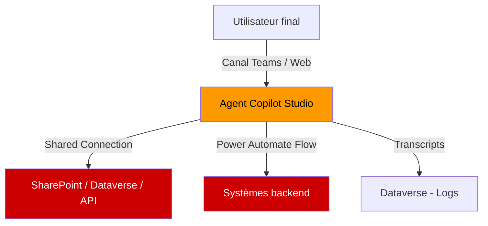
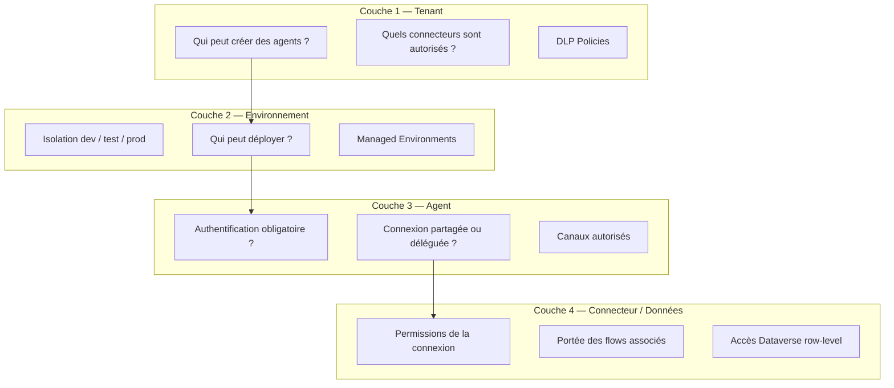
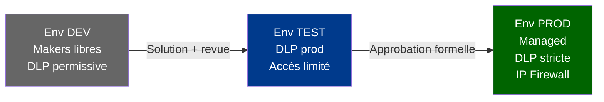

# Gouvernance Copilot Studio

## Objectifs pédagogiques

À l'issue de ce module, vous serez capable de :

1. **Cartographier** la surface de risque spécifique à Copilot Studio dans un tenant M365
2. **Concevoir** une architecture de gouvernance multi-couches (DLP, RBAC, environnements, connecteurs)
3. **Identifier** les configurations dangereuses par défaut qui permettent l'exfiltration de données ou le contournement de contrôles
4. **Décider** du bon niveau d'isolation entre agents internes et agents exposés en externe
5. **Auditer** un environnement existant avec les outils Power Platform Admin et le CoE Starter Kit

---

## Mise en situation

Décembre 2023. Une entreprise du secteur financier déploie Copilot Studio pour automatiser la réponse aux demandes RH internes. L'agent est connecté à SharePoint, à une API REST interne, et à un connecteur personnalisé qui accède à l'annuaire LDAP. Publication : canal Teams, accès authentifié.

Six semaines plus tard, un consultant externe remarque que l'agent répond à des questions sur la structure salariale de l'entreprise. En cause : le connecteur SharePoint est configuré avec une connexion partagée (shared connection) — les credentials du développeur qui a créé l'agent. N'importe quel utilisateur Teams authentifié interroge SharePoint avec les droits de cet administrateur.

La configuration "shared connection" est le comportement **par défaut** dans Copilot Studio. Personne n'avait explicitement choisi ce mode — personne ne l'avait changé non plus.

Ce n'est pas une CVE. C'est une mauvaise compréhension du modèle de sécurité de la plateforme, amplifiée par des valeurs par défaut permissives et une absence de processus de revue avant publication.

Ce module couvre exactement ce type de risque : pas des exploits exotiques, mais des décisions d'architecture qui, sans cadre de gouvernance, deviennent des vecteurs de fuite.

---

## 1. Modèle de menace — Ce qui est réellement exposé

Copilot Studio n'est pas une application traditionnelle. C'est un orchestrateur : il agrège des sources de données, exécute de la logique, et expose une interface conversationnelle. Les vecteurs de risque ne sont pas les mêmes qu'une API REST.

### 1.1 Actifs à protéger

| Actif | Niveau de sensibilité | Vecteur de compromission typique |
|---|---|---|
| Connexions aux sources de données | Critique | Shared connection → privilege escalation implicite |
| Contenu des topics et prompts | Élevé | Extraction de logique métier, reverse engineering de règles |
| Données transitant dans la session | Élevé | Logging non maîtrisé, transcripts non chiffrés |
| Identité de l'appelant (end-user) | Moyen | Agent anonyme exposé publiquement, pas de vérification |
| Environnement de déploiement | Moyen | Agent de prod déployé depuis un env de dev sans lifecycle |

### 1.2 Acteurs de menace réalistes

En entreprise, les acteurs les plus probables ne sont pas des attaquants externes : ce sont des **utilisateurs internes qui testent les limites**, des **développeurs qui publient sans revue**, et des **connecteurs mal configurés** qui élèvent les droits silencieusement.

L'attaquant externe n'arrive que si l'agent est publié sur un canal public (site web, Teams externe) sans authentification.

### 1.3 STRIDE appliqué à Copilot Studio



| Menace STRIDE | Scénario concret dans Copilot Studio |
|---|---|
| **Spoofing** | Agent publié en anonyme → impossible de vérifier qui parle |
| **Tampering** | Topic modifié en dev sans validation → comportement altéré en prod |
| **Repudiation** | Transcripts désactivés → pas de trace de ce que l'agent a dit ou fait |
| **Information Disclosure** | Shared connection → accès aux données du créateur, pas de l'appelant |
| **Denial of Service** | Boucle infinie dans un topic récursif → consommation de capacité |
| **Elevation of Privilege** | Connecteur custom avec permissions larges, accessible à tous les agents de l'env |

---

## 2. Architecture de gouvernance — Les quatre couches

La gouvernance de Copilot Studio ne se traite pas dans un seul panneau d'administration. Elle se construit en quatre couches qui se renforcent mutuellement. En l'absence de l'une d'elles, les trois autres ne suffisent pas.



### 2.1 Couche Tenant — Contrôler qui peut créer quoi

Par défaut, **tout utilisateur M365 licencié peut créer un agent Copilot Studio** dans l'environnement Default. C'est la configuration la plus dangereuse possible en entreprise, parce que l'environnement Default est partagé et qu'il n'existe aucune isolation par rapport aux autres ressources Power Platform.

🔒 **Contrôle fondamental — Désactiver la création dans l'environnement Default**

```
Power Platform Admin Center
→ Settings → Tenant settings
→ "Users can create and manage their own apps in the default environment"
→ Désactiver
```

Ce paramètre ne supprime pas la capacité de créer des agents, il force à utiliser un environnement dédié avec un propriétaire identifié.

🔒 **Contrôle complémentaire — Restreindre la création de nouveaux environnements**

```
Power Platform Admin Center
→ Settings → Tenant settings
→ "Who can create production and sandbox environments"
→ Restreindre aux admins uniquement
```

Sans cette restriction, un développeur peut créer son propre environnement de prod, y déployer un agent, et contourner l'ensemble des contrôles pensés pour l'environnement officiel.

### 2.2 Couche DLP — Le seul contrôle qui bloque réellement les connecteurs

Les Data Loss Prevention policies de Power Platform sont le mécanisme le plus puissant — et le plus souvent mal configuré — pour contrôler ce qu'un agent peut faire.

🧠 **Concept clé — Comment les DLP fonctionnent sur Copilot Studio**

Une DLP policy classe les connecteurs en trois groupes :
- **Business** : données sensibles autorisées
- **Non-Business** : données non sensibles, isolation forcée
- **Blocked** : connecteur inutilisable dans tous les flows et agents de l'environnement

La règle fondamentale : **deux connecteurs dans des groupes différents ne peuvent pas coexister dans le même flow ou agent**. Un agent qui utilise SharePoint (Business) ne peut pas, dans la même session, appeler Twitter (Non-Business).

⚠️ **Erreur fréquente — DLP trop permissive parce qu'elle est construite par exclusion**

La plupart des équipes créent une DLP en bloquant les connecteurs qu'elles connaissent (Facebook, Twitter). Les 900+ autres connecteurs restent dans "Non-Business" et peuvent s'interconnecter librement. La bonne approche est **inverse** : tout en Blocked par défaut, whitelist explicite des connecteurs approuvés dans Business.

```
Power Platform Admin Center
→ Policies → Data Policies → New Policy
→ Scope : environnement(s) de production
→ Connecteurs : déplacer TOUS vers Blocked
→ Réintégrer explicitement : SharePoint, Dataverse, Teams, Azure AD
→ Appliquer
```

🔴 **Vecteur d'attaque — Connecteur custom comme exfiltration channel**

Un développeur malveillant (ou négligent) crée un Custom Connector pointant vers `https://webhook.site/xxxx`. Ce connecteur n'est dans aucune DLP existante — les custom connectors sont dans "Non-Business" par défaut. L'agent peut POST n'importe quelle donnée vers cette URL sans restriction.

Mitigation : activer le contrôle **HTTP connector restriction** et classifier les custom connectors explicitement dans la DLP.

### 2.3 Couche Environnement — Isolation du cycle de vie

Un agent en production ne doit pas coexister avec des agents en développement dans le même environnement. Ce n'est pas une recommandation théorique : en environnement partagé, une modification de connecteur partagé ou de variable d'environnement affecte tous les agents simultanément.

🧠 **Concept clé — Managed Environments**

Les Managed Environments (disponibles avec Power Platform Premium ou via licences spécifiques) activent des contrôles supplémentaires qui n'existent pas dans les environnements standard :

| Contrôle | Environnement standard | Managed Environment |
|---|---|---|
| Solution Checker obligatoire | Non | Configurable |
| Sharing limits (Power Apps) | Illimité | Configurable |
| Weekly digest admin | Non | Oui |
| Pipelines ALM intégrés | Limité | Complet |
| IP Firewall | Non | Oui |

Pour Copilot Studio spécifiquement, l'IP Firewall d'un Managed Environment permet de restreindre les appels entrants vers les agents à des plages d'IP connues — utile pour les agents exposés via API sans couche d'authentification forte.



### 2.4 Couche Agent — Authentification et connexions

C'est la couche la plus souvent négligée, parce qu'elle nécessite des décisions au niveau de chaque agent, pas au niveau de l'administration centrale.

#### Authentification de l'agent

Copilot Studio propose trois modes d'authentification pour identifier l'utilisateur final :

| Mode | Cas d'usage | Risque |
|---|---|---|
| **No authentication** | Demo, agent public informationnel | N'importe qui peut interagir — ne jamais utiliser pour des données internes |
| **Only for Teams and Power Apps** | Agent interne Microsoft 365 | Le contexte SSO est passé automatiquement — recommandé pour usage interne |
| **Authenticate with Microsoft** (ou IdP custom) | Agent multi-canal avec authentification | Nécessite une app registration Azure AD — le plus flexible et le plus sécurisé |

⚠️ **Erreur fréquente — Laisser "No authentication" après avoir changé le canal**

Un agent créé pour Teams (authentifié via SSO) est ensuite publié sur un site web. Le canal web ne bénéficie pas du SSO Teams. Si le mode d'authentification n'est pas explicitement reconfiguré, l'agent tourne en anonyme sur le web avec accès aux mêmes connecteurs que la version Teams interne.

#### Connexions partagées vs. connexions déléguées

C'est le cœur du scénario d'introduction.

🧠 **Concept clé — Shared vs. End-user connection**

- **Shared connection** : les credentials stockés dans la connexion appartiennent au créateur de l'agent. Tous les utilisateurs finaux appellent la source de données avec ces credentials. L'appelant ne peut pas accéder à plus que ce que ses propres droits autorisent — **sauf si la connexion partagée a des droits supérieurs à lui**.
- **End-user connection (User authentication)** : chaque utilisateur final s'authentifie avec ses propres credentials via OAuth. L'accès est limité à ce que cet utilisateur peut réellement voir dans la source de données.

```
Agent → Connexion d'un topic → "Edit" sur le connecteur
→ "Connection" → choisir "User's own connection (sign-in required)"
→ L'utilisateur sera invité à s'authentifier lors de la première utilisation
```

🔒 **Règle d'architecture** : toute connexion donnant accès à des données métier sensibles (SharePoint, Dataverse, API interne) doit utiliser l'authentification déléguée. La connexion partagée n'est acceptable que pour des sources publiques ou non sensibles (météo, actualités).

---

## 3. Hardening — Ce qu'il faut configurer avant toute publication

### 3.1 Checklist pré-publication pour un agent interne

| Contrôle | Chemin de configuration | Valeur recommandée |
|---|---|---|
| Authentification agent | Agent → Settings → Security → Authentication | "Only for Teams and Power Apps" ou "Authenticate with Microsoft" |
| Transcripts activés | Agent → Settings → Advanced → Conversation transcripts | Activé, rétention 30 jours minimum |
| Canal de publication restreint | Agent → Channels | Uniquement les canaux approuvés, pas "Custom website" par défaut |
| Connexions déléguées | Topic → Action → Connection | User authentication sur toutes les connexions sensibles |
| DLP appliquée à l'environnement | Admin Center → Policies | Policy stricte couvrant l'environnement de prod |
| Propriétaire de l'agent identifié | Solution → Agent properties | Propriétaire nominatif, pas un compte de service générique |

### 3.2 Gestion du contenu généré et des topics systèmes

Copilot Studio génère automatiquement des topics systèmes (Greeting, Fallback, Escalate, End of Conversation). Ces topics sont souvent ignorés lors des revues de sécurité, mais ils peuvent contenir des informations de configuration exposées si le développeur a ajouté des messages de debug.

💡 **Astuce** : en environnement de prod, auditer tous les topics système et vérifier que les messages d'erreur ne retournent pas de stack traces ou d'informations techniques internes. Le topic "Error" en particulier peut exposer des détails sur la connexion en cas de failure du connecteur.

### 3.3 Isolation des secrets dans les connecteurs

Les connecteurs custom nécessitent souvent des clés API ou des tokens. Ces credentials ne doivent jamais être hardcodés dans la définition du connecteur.

🔒 **Architecture recommandée pour les secrets**

```
Custom Connector → Authentication → API Key
→ Stocker la clé dans Azure Key Vault
→ Référencer via un environnement variable de type "Secret"
→ Power Platform → Environment Variables → Type: Secret → Linked to Azure Key Vault
```

Les Environment Variables de type Secret sont disponibles depuis 2023 et permettent de stocker des références vers Key Vault sans jamais exposer la valeur dans l'interface Power Platform.

⚠️ **Ce qu'il ne faut jamais faire** : stocker un token ou une clé API dans une variable d'environnement de type texte simple, ou pire, dans la description ou le titre d'un topic.

---

## 4. Modèle RBAC — Qui peut faire quoi

### 4.1 Rôles dans l'environnement

Les rôles Power Platform dans un environnement contrôlent l'accès aux ressources, dont les agents.

| Rôle | Peut créer des agents | Peut modifier des agents existants | Peut publier | Peut voir les transcripts |
|---|---|---|---|---|
| **System Administrator** | Oui | Oui | Oui | Oui |
| **System Customizer** | Oui | Oui | Non (sans rôle additionnel) | Oui |
| **Basic User** | Non | Non | Non | Non |
| **Environment Maker** | Oui | Oui (sur les siens) | Oui (sur les siens) | Non |

🔒 **Règle opérationnelle** : en production, seul un pipeline ALM (service principal) ou un administrateur désigné doit avoir le droit de publier. Les développeurs ont le rôle Environment Maker dans DEV uniquement.

### 4.2 Copilot Studio — Rôles spécifiques à l'agent

Au niveau de chaque agent, des permissions supplémentaires peuvent être configurées :

```
Agent → Settings → Security → Agent access
→ "Who can chat with the bot" → Specific users or groups (recommandé pour usage interne)
→ "Bot content authors" → Liste restreinte de makers autorisés à modifier le contenu
```

💡 **Astuce** : utiliser des groupes de sécurité M365 pour gérer l'accès, pas des utilisateurs individuels. La rotation d'équipe ne doit pas nécessiter de reconfigurer l'agent.

### 4.3 Dataverse Row-Level Security pour les transcripts

Les transcripts de conversation sont stockés dans Dataverse (table `ConversationTranscript`). Par défaut, les administrateurs de l'environnement peuvent lire tous les transcripts. En fonction de la sensibilité des conversations (RH, légal, finance), il peut être nécessaire d'appliquer une Column Security ou un accès restreint sur cette table.

```
Power Platform Admin Center → Environments → [Env] → Settings
→ Users + permissions → Column security profiles
→ Créer un profil sur ConversationTranscript limitant la lecture à un rôle DPO
```

---

## 5. Audit et observabilité — Ce qu'il faut surveiller

### 5.1 Audit log M365 — Ce qui est tracé

Les actions Copilot Studio génèrent des événements dans le journal d'audit M365 (Purview Audit). Les événements clés à surveiller :

| Événement | Signification | Niveau de criticité |
|---|---|---|
| `CopilotStudioAgentPublished` | Agent publié en production | Élevé — déclencheur de revue |
| `CopilotStudioAgentModified` | Modification d'un agent existant | Moyen |
| `CopilotStudioConnectorAdded` | Nouveau connecteur ajouté à un agent | Élevé — vérifier la DLP |
| `PowerPlatformDlpPolicyModified` | DLP modifiée | Critique — alerte immédiate |
| `PowerPlatformEnvironmentCreated` | Nouvel environnement créé | Moyen — vérifier l'auteur |

```
Microsoft Purview → Audit → New search
→ Activities: CopilotStudio* + PowerPlatformDlp*
→ Date range: 7 derniers jours
→ Export CSV pour analyse ou intégration SIEM
```

### 5.2 CoE Starter Kit — Inventaire des agents

Le Center of Excellence Starter Kit (solution Power Platform gratuite de Microsoft) fournit un inventaire automatisé de tous les agents du tenant, avec :

- Propriétaire, date de création, date de dernière modification
- Canaux actifs (Teams, web, custom)
- Environnement de déploiement
- Détection des agents sans propriétaire (orphan bots)

Les agents orphelins sont particulièrement risqués : plus personne ne surveille leur comportement, mais ils continuent d'être accessibles et d'utiliser des connexions qui peuvent avoir des permissions étendues.

🔒 **Processus recommandé** : revue mensuelle des agents orphelins via le CoE Starter Kit → notification automatique via Power Automate → archivage ou transfert de propriété sous 30 jours, sinon désactivation automatique.

### 5.3 Transcripts comme source de détection

Les transcripts ne sont pas seulement une trace de conformité — ils sont un signal de détection.

💡 **Pattern d'anomalie à détecter** : un utilisateur qui pose systématiquement des questions hors scope (ex: demander des données RH via un agent support IT) peut indiquer soit un abus intentionnel, soit un topic mal configuré qui répond à des requêtes qu'il ne devrait pas traiter.

```
Dataverse → Table: ConversationTranscript → Column: Content
→ Power BI report sur la fréquence des topics déclenchés par utilisateur
→ Alerter si un topic sensible est déclenché par un utilisateur n'appartenant pas au groupe autorisé
```

---

## 6. Décisions d'architecture — Matrices de choix

### 6.1 Agent interne vs. agent externe — Matrice de contrôles

| Contrôle | Agent interne (Teams) | Agent externe (site web public) |
|---|---|---|
| Authentification | SSO M365 obligatoire | OAuth externe ou anonyme acceptable (données publiques uniquement) |
| Connexions | User authentication | Shared connection sur données publiques uniquement |
| DLP | Standard entreprise | DLP isolée — aucun connecteur vers données internes |
| Environnement | Shared prod interne | Environnement dédié, isolé du tenant principal si possible |
| Transcripts | Dataverse interne | Attention RGPD — données personnelles des visiteurs |
| Canal | Teams uniquement | Custom Website ou canal dédié |

### 6.2 Quand utiliser un agent Copilot Studio vs. un chatbot codé

🧠 **Concept clé — Limites du modèle de sécurité Copilot Studio**

Copilot Studio est conçu pour des scénarios où les créateurs sont des makers, pas des développeurs. La plateforme abstrait une grande partie de la sécurité — ce qui est à la fois son atout et sa limite.

Utiliser Copilot Studio quand :
- Les auteurs de contenu ne sont pas développeurs
- Les sources de données sont M365 / Dataverse (intégration native)
- Le besoin de customisation sécurité est limité aux contrôles plateforme

Considérer une solution codée (Azure Bot Service + Azure OpenAI) quand :
- Des exigences de sécurité spécifiques dépassent les contrôles plateforme (chiffrement custom, audit granulaire)
- L'agent doit s'intégrer à un système d'identité non M365
- Le volume de sessions justifie un contrôle fin des coûts et de la scalabilité

---

## 7. Cas réel en entreprise — Anatomie d'un déploiement mal gouverné

Un groupe industriel (2 000 collaborateurs) déploie trois agents Copilot Studio en six mois :
1. Un agent RH (questions sur les congés, accès à SharePoint RH)
2. Un agent support IT (redirection vers la CMDB, accès ServiceNow)
3. Un agent procurement (recherche dans le catalogue fournisseurs, accès ERP)

Tous trois sont déployés dans le même environnement de production Default. Même DLP. Même connecteurs.

Six mois après, lors d'un audit interne, les constats sont :
- L'agent RH utilise une shared connection avec les credentials du DRH — tous les employés peuvent obtenir des informations sur les autres via des requêtes SharePoint bien formulées
- L'agent support IT a un connecteur vers ServiceNow configuré avec un compte de service ayant des droits admin sur la CMDB — un utilisateur peut déclencher la création de tickets au nom d'autres utilisateurs
- Les trois agents partagent le même environnement : une modification de variable d'environnement pour l'un affecte les trois

La correction nécessite :
1. Migration vers trois environnements dédiés (3 semaines de travail)
2. Reconfiguration de toutes les connexions en user authentication (1 semaine + tests utilisateurs)
3. Création de DLP spécifiques par environnement (2 jours)

**Coût de la remédiation : environ 40 jours-ingénieur**. Coût d'une gouvernance dès le départ : environ 5 jours.

---

## 8. Erreurs fréquentes

⚠️ **Shared connection sur un connecteur Dataverse**
Configuration dangereuse : l'agent utilise une connection Dataverse avec les credentials du System Administrator qui a créé le connecteur. Tout utilisateur peut lire n'importe quel enregistrement, contournant le row-level security de Dataverse.
Correction : passer en "User's own connection" → chaque utilisateur accède uniquement aux données que son rôle Dataverse autorise.

⚠️ **DLP construite par exclusion (blocklist)**
Configuration dangereuse : la DLP bloque 20 connecteurs connus "à risque" mais laisse 900+ connecteurs en Non-Business interopérables. Un custom connector non référencé est utilisable sans restriction.
Correction : déplacer tous les connecteurs en Blocked, créer une whitelist explicite des connecteurs approuvés.

⚠️ **Agent publié depuis l'environnement Default**
Configuration dangereuse : l'agent de production est dans Default, accessible à tous les makers du tenant, sans isolation, sans pipeline de validation.
Correction : créer un environnement dédié, restreindre l'accès via System Administrator et System Customizer, supprimer l'agent de Default.

⚠️ **Transcripts désactivés pour "raisons de confidentialité"**
Configuration dangereuse : sans transcripts, impossible de détecter les abus, de déboguer les incidents, ou de démontrer la conformité lors d'un audit.
Correction : activer les transcripts, appliquer une Column Security sur la table Dataverse pour restreindre la lecture aux rôles autorisés (DPO, responsable sécurité), définir une politique de rétention.

⚠️ **Aucun propriétaire nominatif sur un agent de production**
Configuration dangereuse : l'agent appartient au compte de l'ex-consultant qui l'a créé. Son départ de l'entreprise n'a pas déclenché de transfert de propriété. Plus personne ne surveille les mises à jour de connecteurs ou les alertes.
Correction : script CoE mensuel → détection des agents orphelins → workflow de réattribution automatique.

---

## Résumé

La gouvernance de Copilot Studio repose sur quatre couches indissociables : contrôle au niveau tenant (qui peut créer), DLP (quels connecteurs sont accessibles), isolation par environnement (cycle de vie ALM), et configuration de chaque agent (authentification, type de connexion). Les risques les plus fréquents ne viennent pas de vulnérabilités techniques mais de valeurs par défaut permissives — la shared connection, l'environnement Default, la DLP par exclusion. Les Managed Environments apportent des contrôles supplémentaires indispensables pour la production (IP Firewall, pipelines, solution checker). L'audit passe par le journal M365 Purview et le CoE Starter Kit. La décision architecture centrale est simple : tout agent accédant à des données internes sensibles doit fonctionner avec l'authentification déléguée de l'utilisateur final — jamais avec les credentials du créateur.

---

<!-- snippet
id: copilot_shared_connection_risk
type: warning
tech: Copilot Studio
level: advanced
importance: high
format: knowledge
tags: connexion, rbac, dataverse, privilege-escalation, gouvernance
title: Shared connection = privilege escalation implicite
content: Par défaut, les connecteurs d'un agent Copilot Studio utilisent les credentials du créateur (shared connection). Tout utilisateur final interagit avec la source de données avec les droits de ce créateur — y compris s'il est System Admin. Correction : passer en "User's own connection" dans chaque action de topic → l'utilisateur s'authentifie avec ses propres droits.
description: Comportement par défaut dans Copilot Studio : la connexion partagée élève implicitement les droits de tous les utilisateurs au niveau du créateur.
-->

<!-- snippet
id: copilot_dlp_blocklist_fail
type: warning
tech: Power Platform
level: advanced
importance: high
format: knowledge
tags: dlp, connecteur, gouvernance, exfiltration, whitelist
title: DLP par blocklist laisse 900+ connecteurs accessibles
content: Construire une DLP en bloquant les connecteurs connus à risque laisse tous les autres en Non-Business interopérables, y compris les custom connectors. Un webhook custom peut exfiltrer des données sans restriction. Correction : déplacer TOUS les connecteurs en Blocked, puis whitelister explicitement les connecteurs approuvés dans Business.
description: Une DLP par exclusion crée une fausse sécurité — les connecteurs non référencés (custom, nouveaux) restent utilisables sans restriction.
-->

<!-- snippet
id: copilot_auth_mode_channels
type: concept
tech: Copilot Studio
level: advanced
importance: high
format: knowledge
tags: authentification, canal, sso, anonyme, securite
title: Authentification Copilot Studio — 3 modes et leurs risques
content: "No authentication" → accès anonyme total, jam
