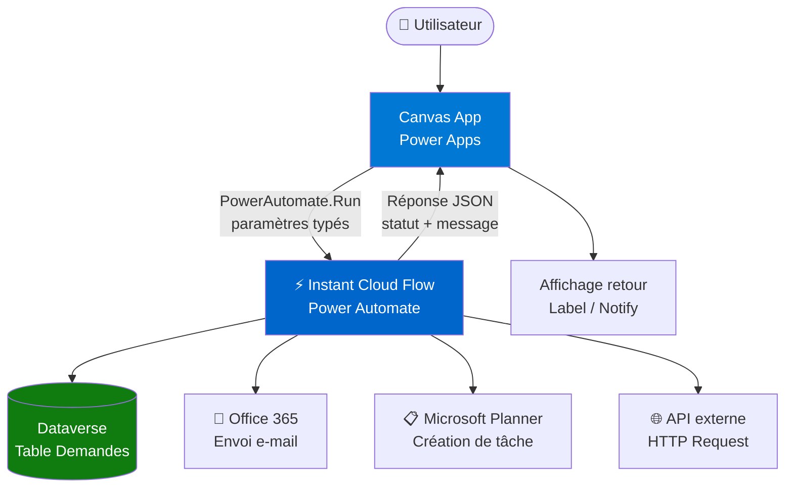

# Scénario A — Canvas App avec flows déclenchés depuis Power Apps

## Objectifs pédagogiques

À l'issue de ce module, vous serez capable de :

1. **Identifier** les cas où déclencher un flow depuis une Canvas App est le bon choix architectural, par opposition à traiter la logique directement dans la formule Power Apps
2. **Concevoir** le contrat d'interface entre une Canvas App et un cloud flow (paramètres entrants, réponse retournée)
3. **Câbler** un flow déclenché instantanément (instant cloud flow) depuis un bouton ou un événement applicatif dans Power Apps
4. **Gérer** les états d'attente, les erreurs et les retours asynchrones sans bloquer l'expérience utilisateur
5. **Appliquer** les bonnes pratiques d'architecture sur la séparation des responsabilités entre la couche présentation et la couche traitement

---

## Mise en situation

Imaginez une équipe RH d'une centaine de collaborateurs. Elle utilise une Canvas App pour saisir des demandes de congés. Au départ, l'app enregistre directement dans Dataverse — et ça suffit. Mais un jour, les exigences changent : l'application doit désormais envoyer un e-mail récapitulatif au manager, créer une tâche dans Planner, et déclencher une vérification de quota dans un système tiers via API REST.

La tentation naturelle, c'est d'empiler ces appels dans la formule `OnSelect` du bouton. Patch ici, une connexion Office 365 là, une requête HTTP directe… Au bout de quelques semaines, le bouton fait 80 lignes de formules imbriquées, personne ne comprend l'ordre d'exécution, et le moindre changement métier demande une heure de debug.

C'est exactement le scénario pour lequel l'intégration Canvas App + Cloud Flow a été pensée : **externaliser la logique de traitement dans un flow réutilisable et testable**, en laissant l'app se concentrer sur ce qu'elle sait faire — présenter, collecter, afficher.

---

## Pourquoi séparer présentation et traitement ?

La règle de base est simple : une Canvas App excelle à **collecter et afficher**. Power Automate excelle à **orchestrer et intégrer**. Mélanger les deux dans la couche formule, c'est comme écrire du SQL dans une feuille Excel — ça fonctionne jusqu'au moment où ça ne fonctionne plus, et personne ne sait pourquoi.

Concrètement, voici ce que cette séparation vous apporte :

- Le flow peut être modifié, testé et réexécuté indépendamment de l'application
- Les erreurs sont loggées dans Power Automate avec leur historique complet — pas perdues dans un `Notify` silencieux
- Le flow est réutilisable depuis d'autres surfaces (un portail Power Pages, un autre trigger planifié, une API)
- La Canvas App reste lisible : le bouton appelle `RunFlow()`, point

Ce n'est pas une règle absolue — si une action est purement locale (filtrer une galerie, naviguer vers un écran), inutile de la déléguer à un flow. Le critère réel est : **est-ce que cette logique interagit avec un système externe ou avec plusieurs étapes conditionnelles ?** Si oui, le flow est probablement le bon endroit.

---

## Architecture du scénario

Voici comment s'articulent les composants dans ce type de solution :



| Composant | Rôle dans l'architecture | Point d'attention |
|-----------|--------------------------|-------------------|
| **Canvas App** | Surface utilisateur, collecte des données, affichage du retour | Ne contient aucune logique métier complexe |
| **Instant Cloud Flow (Power Apps trigger)** | Reçoit les paramètres, orchestre le traitement, renvoie une réponse | Doit avoir l'action "Respond to a Power App or flow" en sortie |
| **Dataverse** | Persistance des données métier | Lecture et écriture peuvent être faites côté flow OU côté app selon le cas |
| **Connecteurs (Mail, Planner, HTTP)** | Intégrations tierces déclenchées par le flow | La gestion des erreurs se fait dans le flow, pas dans l'app |
| **Réponse JSON** | Résultat renvoyé à l'app après traitement | Typée explicitement dans le flow pour que Power Apps puisse l'exploiter |

---

## Comment fonctionne le déclencheur Power Apps

Quand vous créez un cloud flow avec le déclencheur **"Power Apps (V2)"**, vous définissez explicitement les paramètres que l'application peut lui passer. C'est un contrat : l'app ne peut envoyer que ce que le flow a déclaré accepter.

Ce déclencheur génère une action nommée `PowerApps` dans le flow, et chaque paramètre devient accessible dans les étapes suivantes via la syntaxe `triggerBody()?['<nom_paramètre>']` — ou plus simplement via le sélecteur de contenu dynamique dans le designer.

🧠 **Concept clé** — Le déclencheur "Power Apps (V2)" est fondamentalement différent d'un déclencheur HTTP. Il ne crée pas d'endpoint public : il est lié à un environment Power Platform et accessible uniquement aux apps et flows du même environnement (ou avec les permissions adéquates). Cela simplifie la sécurité, mais cela signifie aussi qu'on ne peut pas l'appeler depuis un script externe.

Du côté de la Canvas App, l'appel se fait ainsi :

```plaintext
// OnSelect d'un bouton
Set(
    varRetourFlow,
    NomDuFlow.Run(
        txtNom.Text,
        txtMotif.Text,
        datePicker.SelectedDate
    )
);

Notify(varRetourFlow.message, NotificationType.Success);
```

La ligne `NomDuFlow.Run(...)` est synchrone du point de vue de Power Apps : l'app attend la réponse avant de continuer l'exécution. C'est important à comprendre pour la gestion de l'expérience utilisateur.

---

## Construction progressive : de la version minimale à la version robuste

### Version 1 — Le câblage minimal

L'objectif ici est de valider que le tuyau fonctionne. Un flow qui reçoit un paramètre, fait une action, renvoie un statut. Pas de gestion d'erreur, pas de logique conditionnelle.

**Côté flow :**
1. Déclencheur : `Power Apps (V2)` — déclarer un paramètre `texte` de type string
2. Action : `Create item` dans Dataverse avec le texte reçu
3. Action : `Respond to a Power App or flow` — renvoyer `{ "statut": "ok" }`

**Côté app :**
```plaintext
Set(varReponse, MonFlow.Run(txtInput.Text));
Label_Statut.Text = varReponse.statut
```

C'est suffisant pour valider l'intégration de bout en bout. Ne passez pas directement à la version complexe sans avoir confirmé que ce câblage de base fonctionne.

---

### Version 2 — Paramètres multiples et retour enrichi

On étend le contrat : le flow reçoit plusieurs champs typés, effectue plusieurs actions en séquence, et renvoie un retour structuré que l'app peut exploiter proprement.

**Paramètres déclarés dans le déclencheur :**

| Nom | Type | Description |
|-----|------|-------------|
| `employe_id` | string | Identifiant de l'employé |
| `date_debut` | string | Date au format ISO 8601 |
| `date_fin` | string | Date au format ISO 8601 |
| `motif` | string | Motif de la demande |

⚠️ **Erreur fréquente** — Power Apps transmet les dates en tant que chaînes. Si vous avez besoin d'une date réelle dans votre flow, convertissez-la avec `formatDateTime()` côté Automate. Tenter de passer un objet date directement depuis Power Apps provoque souvent des erreurs silencieuses ou des valeurs nulles.

**Côté flow — structure des actions :**

```plaintext
1. Trigger : Power Apps (V2)
   └── Paramètres : employe_id, date_debut, date_fin, motif

2. Créer la demande dans Dataverse
   └── Table : cr_demandes_conges
   └── Champs mappés depuis les paramètres du trigger

3. Récupérer le manager de l'employé (Dataverse lookup ou Office 365)

4. Envoyer un e-mail au manager (Office 365 Outlook)

5. Créer une tâche Planner

6. Respond to a Power App or flow
   └── statut : "success"
   └── demande_id : <ID créé à l'étape 2>
   └── message : "Demande enregistrée et manager notifié"
```

**Côté app — exploiter le retour :**

```plaintext
Set(
    varReponse,
    FlowDemandeConges.Run(
        User().Email,           // employe_id
        Text(dateDebut.Value, "yyyy-mm-dd"),
        Text(dateFin.Value, "yyyy-mm-dd"),
        txtMotif.Text
    )
);

If(
    varReponse.statut = "success",
    Navigate(
        EcranConfirmation,
        ScreenTransition.Fade,
        { demandeId: varReponse.demande_id }
    ),
    Notify("Une erreur est survenue : " & varReponse.message, NotificationType.Error)
);
```

💡 **Astuce** — Utilisez `Set(varChargement, true)` avant l'appel au flow et `Set(varChargement, false)` après, puis liez la propriété `Visible` d'un spinner à `varChargement`. L'appel étant synchrone, l'utilisateur verra clairement que quelque chose se passe — c'est bien meilleur qu'un bouton qui semble figé pendant 3 secondes.

---

### Version 3 — Gestion des erreurs et résilience

C'est là que la plupart des projets font l'impasse — et le regrettent en production.

**Dans le flow**, encapsulez les actions critiques dans des blocs avec configuration `"Configure run after"` pour gérer les branches d'échec :

```plaintext
Action "Créer demande Dataverse"
    └── En succès → suite normale
    └── En échec → action "Respond" avec statut "error" + message d'erreur

Action "Envoyer e-mail"
    └── Configurer "run after" sur : succeeded, failed, skipped
    └── En échec → logger l'erreur mais ne pas bloquer le flux principal
```

La règle d'or : **distinguer les erreurs bloquantes des erreurs non-bloquantes**. Si l'enregistrement Dataverse échoue, la demande n'existe pas — c'est bloquant, on renvoie une erreur à l'app. Si l'e-mail échoue mais que la demande est créée, on peut continuer et notifier l'échec de manière secondaire (log, alerte admin).

**Dans l'app**, ne pas supposer que le flow a réussi parce qu'il a répondu :

```plaintext
If(
    varReponse.statut = "error",
    Notify(
        "Erreur : " & varReponse.message,
        NotificationType.Error
    )
    // Ne pas naviguer, laisser l'utilisateur corriger
);
```

---

## Cas réel en entreprise

**Contexte :** Une DSI industrielle de 1 200 personnes devait moderniser son processus de demande de matériel IT — jusque-là géré par e-mails et une feuille SharePoint.

**Solution déployée :**
- Canvas App sur mobile et desktop pour la saisie des demandes
- Un instant cloud flow centralisé pour orchestrer : création dans Dataverse, notification Teams au responsable IT, création d'un ticket dans ServiceNow via HTTP, mise à jour du statut en retour

**Résultat clé :** Le flow a été modifié 4 fois en 6 mois (changement de template e-mail, ajout d'un connecteur ServiceNow supplémentaire, modification du routage selon la catégorie de matériel). À chaque fois, **zéro modification de l'application**. L'équipe a pu itérer sur la logique métier sans toucher à la surface utilisateur — ce qui a réduit les cycles de test de moitié.

Le point de friction principal identifié : la gestion des timeouts. Pour des flows qui dépassent 2 minutes (appels API lents), l'appel synchrone depuis Power Apps peut échouer côté app même si le flow continue de s'exécuter côté serveur. La solution adoptée : décorréler les étapes longues via un flow asynchrone déclenché en cascade, et interroger le statut depuis l'app via un timer et une lookup Dataverse.

---

## Bonnes pratiques

**1. Nommer le flow de manière explicite et stable**
Le nom du flow dans Power Apps correspond à son nom d'affichage. Si vous le renommez après l'avoir ajouté à l'app, la référence est cassée. Adoptez une convention dès le départ : `PA_[NomApp]_[Action]` (ex : `PA_Conges_SoumettreDemandeV1`).

**2. Typer explicitement tous les paramètres dans le déclencheur V2**
Le déclencheur V2 est précisément là pour ça. Ne faites pas passer tout en `string` pour simplifier — ça crée des conversions implicites et des bugs difficiles à repérer.

**3. Toujours implémenter l'action "Respond to a Power App or flow"**
Sans cette action en fin de flow, Power Apps ne reçoit rien — et la formule `Run()` retourne un objet vide. Votre app doit toujours savoir ce qui s'est passé.

**4. Tester le flow indépendamment de l'app**
Dans Power Automate, vous pouvez tester un instant flow manuellement en saisissant les paramètres à la main. Faites-le systématiquement avant de tester depuis l'app. Ça divise par deux le temps de debug.

**5. Gérer le cas d'erreur côté app, pas seulement côté flow**
Le flow peut répondre `statut: "error"` correctement, mais si l'app ne vérifie pas ce champ, l'utilisateur verra une interface incohérente. La gestion d'erreur se fait aux deux extrémités du tuyau.

**6. Ne pas appeler le flow depuis `OnVisible` sans précaution**
Un flow appelé à chaque affichage d'écran peut rapidement générer des exécutions non voulues (retour en arrière, navigation rapide). Préférez un déclenchement explicite via bouton ou une variable de garde (`If(!varDejaCharge, ...)`).

**7. Anticiper les limites de l'appel synchrone**
Au-delà de 2 minutes d'exécution, le timeout de Power Apps peut tronquer la réponse. Pour les traitements longs, envisagez un pattern asynchrone : le flow enregistre le statut dans Dataverse, l'app le consulte en polling.

---

## Résumé

Ce module couvre l'un des patterns d'intégration les plus courants de la Power Platform : **une Canvas App qui délègue la logique de traitement à un cloud flow**, récupère une réponse structurée et adapte son comportement en conséquence.

La clé architecturale est la **séparation des responsabilités** : l'app gère l'expérience utilisateur, le flow orchestre les interactions avec les systèmes. Ce découplage rend la solution plus maintenable, plus testable, et plus résiliente face aux évolutions métier.

Le contrat entre les deux composants — paramètres typés côté déclencheur, réponse JSON explicite via "Respond to a Power App or flow" — doit être défini rigoureusement dès le départ. Les erreurs les plus fréquentes viennent d'un typage approximatif des paramètres (notamment les dates) ou d'une absence de gestion du cas d'échec.

Dans le module suivant, on applique une logique similaire mais dans un contexte différent : un portail Power Pages alimenté par Dataverse et des notifications déclenchées par Automate — une architecture orientée portail public plutôt qu'application interne.

---

<!-- snippet
id: powerapps_flow_trigger_v2
type: concept
tech: power-automate
level: intermediate
importance: high
format: knowledge
tags: power-apps,power-automate,trigger,instant-flow,integration
title: Déclencheur "Power Apps (V2)" — contrat typé
content: Le déclencheur "Power Apps (V2)" définit un contrat explicite : chaque paramètre déclaré (nom + type) devient accessible dans le flow via le contenu dynamique, et visible dans Power Apps comme argument de la méthode Run(). Ce trigger ne crée pas d'endpoint HTTP public — il est lié à l'environnement Power Platform et accessible uniquement aux apps du même environnement.
description: Contrairement au trigger HTTP, ce déclencheur est privé à l'environnement. Typage obligatoire pour éviter les conversions implicites silencieuses.
-->

<!-- snippet
id: powerapps_flow_run_syntax
type: command
tech: power-apps
level: intermediate
importance: high
format: knowledge
tags: power-apps,canvas-app,flow,formule,run
title: Appeler un cloud flow depuis une Canvas App
command: Set(varReponse, <NomDuFlow>.Run(<param1>, <param2>))
example: Set(varReponse, PA_Conges_SoumettreDemandeV1.Run(txtNom.Text, Text(datePicker.Value,"yyyy-mm-dd"), txtMotif.Text))
description: L'appel est synchrone — Power Apps attend la réponse avant de continuer. Le résultat est un objet dont les champs correspondent à ce que le flow renvoie via "Respond to a Power App or flow".
-->

<!-- snippet
id: powerapps_flow_respond_action
type: concept
tech: power-automate
level: intermediate
importance: high
format: knowledge
tags: power-automate,respond,canvas-app,retour,json
title: Action "Respond to a Power App or flow" — obligatoire
content: Sans cette action en fin de flow, Power Apps reçoit un objet vide — la méthode Run() ne plante pas mais aucun champ n'est accessible. Cette action définit les champs de la réponse (nom + type), qui deviennent les propriétés de l'objet retourné par Run() dans la formule Power Apps.
description: Sans cette action, varReponse retourné par Run() est vide. Toujours l'ajouter, même si on ne renvoie qu'un statut simple.
-->

<!-- snippet
id: powerapps_flow_date_param
type: warning
tech: power-apps
level: intermediate
importance: high
format: knowledge
tags: power-apps,power-automate,date,conversion,bug
title: Dates Power Apps → flow : toujours passer en string ISO
content: Piège : Power Apps n'a pas de type date natif compatible avec le déclencheur Power Apps V2. Si vous passez une date sans conversion, le flow reçoit une valeur nulle ou un format non interprétable. Correction : convertir côté app avec Text(maDate, "yyyy-mm-dd") avant le Run(), puis utiliser formatDateTime() côté flow si nécessaire.
description: Passer une date directement depuis un DatePicker sans Text() → valeur nulle côté flow. Toujours convertir en string ISO 8601 avant Run().
-->

<!-- snippet
id: powerapps_flow_spinner_ux
type: tip
tech: power-apps
level: intermediate
importance: medium
format: knowledge
tags: power-apps,ux,chargement,spinner,variable
title: Afficher un spinner pendant l'exécution d'un flow
content: Avant Run() : Set(varChargement, true). Après Run() : Set(varChargement, false). Liez la propriété Visible d'un contrôle de chargement (icône, rectangle semi-transparent) à varChargement. L'appel étant synchrone, l'app est bloquée pendant l'exécution — sans indicateur visuel, l'utilisateur pense que l'app est figée.
description: Set(varChargement, true) avant Run(), false après. Lier Visible du spinner à varChargement pour éviter l'effet "bouton mort".
-->

<!-- snippet
id: powerapps_flow_error_handling
type: tip
tech: power-automate
level: intermediate
importance: high
format: knowledge
tags: power-automate,erreur,configure-run-after,resilience,flow
title: Gérer les branches d'échec avec "Configure run after"
content: Dans Power Automate, cliquez sur "..." d'une action → "Configure run after" pour définir si l'action suivante s'exécute après un succès, un échec, un timeout ou une annulation. Stratégie recommandée : pour les erreurs bloquantes (ex : écriture Dataverse), rediriger vers une action "Respond" avec statut "error". Pour les erreurs non-bloquantes (ex : envoi e-mail), logger et continuer.
description: "Configure run after" permet de gérer les branches d'échec action par action. Distinguer erreurs bloquantes (→ retour erreur à l'app) et non-bloquantes (→ log + continuation).
-->

<!-- snippet
id: powerapps_flow_naming_convention
type: tip
tech: power-automate
level: intermediate
importance: medium
format: knowledge
tags: power-automate,nommage,convention,canvas-app,maintenance
title: Convention de nommage des flows liés à une Canvas App
content: Utilisez le format PA_[NomApp]_[Action] (ex : PA_Conges_SoumettreDemandeV1). Raison : le nom du flow apparaît tel quel dans la liste Run() de Power Apps. Si vous renommez le flow après l'avoir ajouté à l'app, la référence est cassée et doit être re-ajoutée manuellement. Figer le nom dès le départ évite ce problème.
description: Renommer un flow après ajout à une app casse la référence. Adoptez PA_[App]_[Action] dès le départ et ne renommez plus.
-->

<!-- snippet
id: powerapps_flow_async_timeout
type: warning
tech: power-automate
level: intermediate
importance: medium
format: knowledge
tags: power-automate,timeout,asynchrone,performance,canvas-app
title: Timeout de 2 min sur les flows synchrones appelés depuis Power Apps
content: Piège : si un flow dépasse ~2 minutes d'exécution, Power Apps peut recevoir une erreur côté app même si le flow continue de s'exécuter côté serveur. Conséquence : la variable varReponse est vide ou l'app affiche une erreur sans que le traitement ait échoué. Correction : pour les traitements longs, décorréler en pattern asynchrone — le flow enregistre le statut dans Dataverse, l'app le consulte par polling ou Timer.
description: Au-delà de ~2 min, l'app timeout mais le flow continue. Pour les traitements longs, passer en mode asynchrone avec statut Dataverse + polling côté app.
-->

<!-- snippet
id: powerapps_flow_test_independent
type: tip
tech: power-automate
level: intermediate
importance: medium
format: knowledge
tags: power-automate,test,debug,instant-flow,methode
title: Tester un instant flow sans passer par la Canvas App
content: Dans Power Automate → page du flow → bouton "Test" → "Manually" → saisir les valeurs des paramètres manuellement. Cette méthode permet de valider le flow indépendamment de l'app, avec accès à l'historique d'exécution complet et aux valeurs de chaque étape. À faire systématiquement avant de tester depuis l'app — ça divise le temps de debug par deux.
description: Power Automate → Test → Manually → saisir les params. Valider le flow seul avant de tester depuis l'app, pour isoler rapidement la source d'une erreur.
-->
