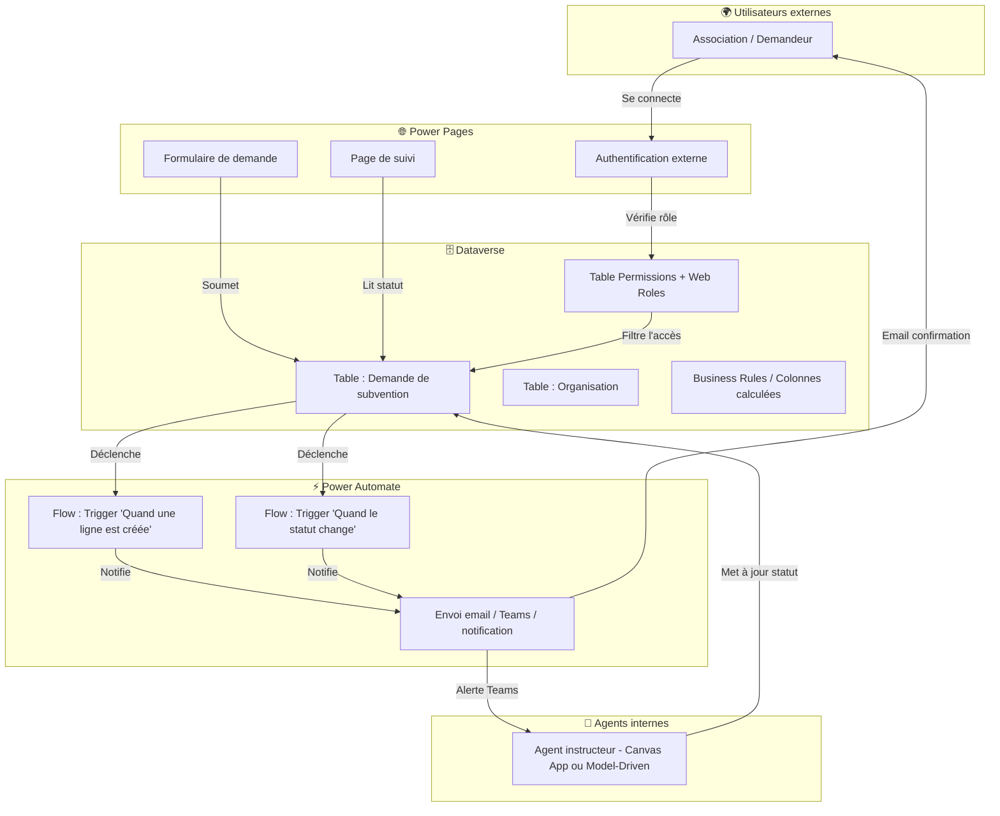

# Scénario B — Portail Power Pages alimenté par Dataverse + notifications Automate

## Objectifs pédagogiques

À l'issue de ce module, vous serez capable de :

1. **Expliquer** comment Power Pages s'appuie sur Dataverse pour exposer des données à des utilisateurs externes
2. **Identifier** les couches de sécurité spécifiques à un portail (table permissions, web roles, column-level security)
3. **Concevoir** l'architecture d'un portail connecté à Dataverse avec des flows de notification déclenchés par des changements de données
4. **Distinguer** ce qui se passe côté portail, côté Dataverse et côté Automate — et comprendre qui déclenche quoi
5. **Anticiper** les points de friction typiques d'une architecture portail en production (authentification, performance, gouvernance des notifications, limites de scaling)

---

## Mise en situation

Une collectivité territoriale gère des demandes de subventions pour ses associations locales. Jusqu'ici, le processus fonctionnait par email : l'association envoie un formulaire Word, un agent l'archive dans un dossier partagé, puis répond manuellement semaines plus tard.

Le problème est prévisible : les emails se perdent, l'état d'avancement est opaque pour les demandeurs, et les agents passent plus de temps à répondre à des "où en est mon dossier ?" qu'à instruire les dossiers eux-mêmes.

L'équipe Power Platform doit livrer une solution en 6 semaines. La contrainte principale : **les associations ne sont pas dans l'Active Directory de la collectivité**. Elles ne peuvent pas avoir de licence Microsoft 365. Il faut donc un accès public authentifié, pas une Canvas App interne.

C'est exactement le cas d'usage pour lequel Power Pages existe.

---

## Pourquoi Power Pages et pas une Canvas App externe ?

Le module précédent a couvert la Canvas App avec flows déclenchés — un modèle parfait quand vos utilisateurs sont internes, avec un compte Microsoft 365. Dès que vous franchissez la frontière de votre tenant, ce modèle ne tient plus.

Power Pages est conçu pour exposer des données Dataverse à des utilisateurs **non-Microsoft**, authentifiés via des mécanismes d'identité externe (compte local, Azure AD B2C, LinkedIn, Google, etc.). C'est un portail web à part entière, hébergé et sécurisé par Microsoft, mais dont le contenu et la logique métier restent entièrement dans votre environnement Dataverse.

La distinction fondamentale :

| Dimension | Canvas App | Power Pages |
|---|---|---|
| Utilisateurs cibles | Internes (M365) | Externes ou mixtes |
| Authentification | Azure AD / compte Microsoft | Identity providers configurables |
| Interface | App mobile/desktop | Site web responsive |
| Accès aux données | Connecteurs + Dataverse direct | Dataverse via Table Permissions |
| Déclenchement de flows | Power Automate explicitement lié | Triggers Dataverse (automatique) |

---

## Architecture générale

Voici comment les trois couches s'articulent dans ce scénario :



La lecture de ce schéma est importante : **Dataverse est le centre de gravité**. Power Pages écrit dedans, Power Automate en lit les changements, les agents internes le modifient via leur propre interface. Personne ne parle à personne directement — tout transite par les données.

C'est la force (et la contrainte) de cette architecture.

---

## Fonctionnement interne — les trois couches en détail

### Couche 1 : Power Pages et Dataverse

Power Pages n'est pas un frontend générique connecté à une API. Il a une relation **native** avec Dataverse : les formulaires d'un portail sont liés directement à des tables Dataverse, sans écrire une ligne de code d'intégration.

Quand une association remplit le formulaire "Nouvelle demande de subvention" sur le portail, voici ce qui se passe concrètement :

1. Power Pages valide les champs côté client (règles de formulaire)
2. À la soumission, il crée une **ligne dans la table Dataverse** correspondante
3. Cette écriture se fait sous l'identité du **service account du portail**, pas de l'utilisateur externe — c'est pour ça que les Table Permissions sont critiques

🧠 **Concept clé — Table Permissions** : contrairement à une Canvas App où vous contrôlez les données par formule, dans Power Pages, l'accès est gouverné par des règles déclaratives attachées à des **Web Roles**. Un utilisateur anonyme peut avoir accès en lecture à certaines tables, un utilisateur authentifié à d'autres. Sans permission configurée, la table est simplement invisible du portail — pas d'erreur, pas de données.

La relation entre Web Roles et Table Permissions ressemble à ceci :

| Web Role | Table | Accès accordé | Filtre éventuel |
|---|---|---|---|
| Utilisateur anonyme | Actualités | Lecture globale | — |
| Demandeur authentifié | Demande de subvention | Lecture + Création | Ses propres lignes uniquement |
| Demandeur authentifié | Organisation | Lecture | Son organisation uniquement |
| Administrateur portail | Toutes | Lecture + Écriture | — |

Le filtre "ses propres lignes uniquement" est géré par un mécanisme appelé **scope** (Self, Account, Contact, Global). En pratique, vous liez le compte du portail (Contact dans Dataverse) à ses demandes — et Power Pages ne renvoie que les lignes qui lui appartiennent.

⚠️ **Erreur fréquente** : créer un portail, y connecter une table, et s'étonner que rien n'apparaît. La cause est presque toujours l'absence de Table Permission. Ce n'est pas un bug — c'est le comportement par défaut sécurisé.

### Couche 2 : Dataverse comme source de vérité

Dataverse ne se contente pas de stocker des lignes. Dans cette architecture, il porte aussi une partie de la logique métier :

- **Business Rules** : validation côté serveur indépendante du portail (ex : le montant demandé ne peut pas dépasser le plafond de la catégorie)
- **Colonnes calculées** : un champ "Délai de traitement" calculé automatiquement depuis la date de soumission
- **Statut et raison du statut** : des champs système qui tracent le cycle de vie de chaque demande — c'est sur ces champs que Power Automate se branche

💡 **Astuce** : modélisez le cycle de vie de vos demandes avec les champs natifs `statecode` (Actif/Inactif) et `statuscode` (Raison du statut personnalisable). Power Automate peut filtrer ses triggers sur ces valeurs précisément, ce qui évite de créer des colonnes supplémentaires pour piloter vos flows.

#### Limites Dataverse à connaître

Dataverse est robuste, mais il n'est pas illimité. En production, deux limites sont à surveiller activement :

**Throttling** : Dataverse applique des limites d'API par service principal et par environnement. Au-delà de ces seuils, les requêtes retournent une erreur `429 Too Many Requests` et sont mises en file d'attente. Dans une architecture portail avec de nombreux utilisateurs simultanés et des flows qui écrivent fréquemment, vous pouvez atteindre ces limites sans vous y attendre.

Les seuils documentés par Microsoft pour les environnements standard :

| Type de limite | Valeur indicative |
|---|---|
| Requêtes API par utilisateur / 5 min | 6 000 |
| Requêtes API service principal / 5 min | 6 000 |
| Taille max d'un enregistrement | 8 Mo (hors pièces jointes) |
| Pièces jointes (Notes) | 128 Mo par fichier par défaut |

**Comportement offline** : Dataverse ne dispose pas de mode hors-ligne natif pour les portails Power Pages. Si l'environnement est indisponible ou en maintenance, le portail est inaccessible. Pour des scénarios critiques, prévoyez une page de maintenance et communiquez les plages de maintenance aux utilisateurs.

### Couche 3 : Power Automate comme réacteur d'événements

Dans le scénario A (Canvas App), les flows étaient déclenchés explicitement depuis l'app, par un bouton. Ici, **personne n'appelle les flows directement** — c'est Dataverse qui les déclenche, automatiquement, quand les données changent.

Les deux triggers Dataverse les plus utiles dans ce contexte :

| Trigger | Quand il se déclenche | Cas d'usage typique |
|---|---|---|
| `When a row is added` | Création d'une nouvelle ligne | Accusé de réception à l'association |
| `When a row is modified` | Modification d'une ligne existante | Notification de changement de statut |

La puissance de cette approche : **peu importe qui a modifié la donnée**. Que ce soit le portail, un agent via une Model-Driven App, un autre flow ou même une importation en masse — si la ligne change, le flow se déclenche. Vous n'avez pas à prévoir tous les points d'entrée.

---

## Construction progressive — de la V1 au niveau production

Le tableau suivant donne une lecture d'ensemble avant d'entrer dans le détail de chaque palier :

| Palier | Nouveau composant | Pourquoi l'ajouter |
|---|---|---|
| **V1** | Portail + formulaire + authentification locale + flow accusé de réception | Couvrir le cas de base : dépôt et confirmation |
| **V2** | Flow notification statut + Model-Driven App agent + pièces jointes Notes | Apporter la traçabilité temps réel et une interface agent propre |
| **V3** | Azure AD B2C + column-level security + alertes Teams + audit + déduplication | Passer en production réelle avec sécurité, conformité et résilience |

### V1 — Le portail minimaliste

La version de départ couvre l'essentiel : un formulaire de dépôt et une page de consultation.

**Ce qui existe :**
- Une table `cr_demande_subvention` dans Dataverse avec les colonnes essentielles (nom de l'asso, montant demandé, statut, date)
- Un portail Power Pages avec authentification locale (email + mot de passe)
- Un formulaire lié à la table pour la création
- Une galerie filtrée sur les demandes du contact connecté
- Un flow `[SUBV] Notification - Accusé réception v1` déclenché sur création → email de confirmation à l'association

**Ce qui manque en V1 :**
- Aucune notification de mise à jour de statut
- L'agent instruit les dossiers directement dans Dataverse Studio (pas d'interface dédiée)
- Pas de gestion des pièces jointes

C'est suffisant pour un pilote, mais fragile en production.

### V2 — Notifications et interface agent

On ajoute la vraie valeur métier : la traçabilité en temps réel.

**Ajouts :**
- Un second flow `[SUBV] Notification - Changement statut v1` sur modification du `statuscode` → email à l'association avec message personnalisé selon la valeur
- Une Model-Driven App pour les agents (exploitation directe des vues et formulaires Dataverse, sans développement)
- Gestion des pièces jointes via les **Notes** Dataverse (liées nativement aux lignes) — Power Pages supporte l'upload vers les Notes en natif

Le flow de notification sur changement de statut mérite qu'on s'y attarde. Voici sa structure réelle dans Power Automate, telle qu'elle se configure en production :

```
Trigger : Microsoft Dataverse — When a row is modified
  Table name     : cr_demandes_subventions
  Filter columns : statuscode
  Scope          : Organization

Get row by ID (optionnel — pour récupérer email du Contact lié)
  Table name     : Contacts
  Row ID         : triggerOutputs()?['body/_cr_contact_value']

Switch — triggerOutputs()?['body/statuscode@OData.Community.Display.V1.FormattedValue']
  Case "Approuvée"
    └─ Send an email (V2)
         To      : outputs('Get_row_by_ID')?['body/emailaddress1']
         Subject : Votre demande de subvention a été approuvée
         Body    : Bonjour, nous avons le plaisir de vous informer...
  Case "Refusée"
    └─ Send an email (V2)
         To      : outputs('Get_row_by_ID')?['body/emailaddress1']
         Subject : Suite à votre demande de subvention
         Body    : Votre demande n'a pas été retenue. Motif : ...
  Default
    └─ Send an email (V2)
         To      : outputs('Get_row_by_ID')?['body/emailaddress1']
         Subject : Mise à jour de votre dossier
         Body    : Votre dossier est en cours d'instruction...
```

💡 **Astuce** : utilisez `Filter columns` dans le trigger Dataverse pour ne déclencher le flow que si `statuscode` a changé. Sans ce filtre, le flow se lance à chaque modification de la ligne — y compris si un agent corrige une faute de frappe dans un commentaire.

### V3 — Niveau production

**Ajouts :**
- Azure AD B2C en tant qu'identity provider (remplace l'authentification locale, permet SSO avec d'autres services publics)
- Column-level security sur les colonnes sensibles (montants, décisions)
- Alertes Teams pour les agents via le connecteur Teams dans Automate (canal dédié "Nouvelles demandes")
- Logs d'audit Dataverse activés sur la table principale
- Déduplication des notifications : une colonne `cr_derniere_notification` (DateTime) sur la table, vérifiée au début de chaque flow avant envoi

---

## Points de friction à anticiper

Cette architecture est robuste, mais elle a des angles morts que vous croiserez en production.

### Diagnostic des pièges courants

| Symptôme | Cause probable | Solution |
|---|---|---|
| Liste vide sur le portail | Table Permission absente ou mal configurée | Vérifier Power Pages Studio → Sécurité → Table Permissions, scope et Web Role associé |
| Formulaire soumis mais aucune ligne créée dans Dataverse | Table Permission en lecture seule, ou accès Création non accordé | Ajouter le droit "Create" sur la Table Permission du rôle Demandeur |
| Flow déclenché 3–4 fois pour une seule modification | `Filter columns` absent sur le trigger | Activer Filter columns → `statuscode` uniquement dans les paramètres avancés du trigger |
| Demandes sans organisation liée | Contact créé à l'inscription non rattaché à une table Organisation | Créer un flow de bienvenue "When a contact is created" pour détecter et lier l'organisation |
| Page portail très lente sur une table volumineuse | Liste sans filtre FetchXML — Dataverse charge tout en arrière-plan | Configurer un filtre FetchXML ou OData dans les paramètres de la liste |
| Email reçu deux fois à quelques secondes d'intervalle | Modification multi-champs déclenchant le flow en double | Ajouter colonne `cr_derniere_notification` et condition de déduplication au début du flow |
| Erreur 429 sur les appels Dataverse | Throttling API dépassé (flux concurrent élevé) | Réduire la concurrence des flows, activer le retry policy, ou passer en capacité supérieure |

### Synchronisation d'identité externe

Quand une association crée un compte sur le portail, Power Pages crée automatiquement un enregistrement **Contact** dans Dataverse. Ce Contact doit être lié à une table `Organisation` ou `Compte` existante si vous gérez déjà un référentiel d'associations. Sans cette liaison, les demandes ne sont pas rattachées à une organisation — les vues filtrées côté agents et les rapports agrégés donnent des résultats incorrects.

La solution : un flow `[SUBV] Setup - Liaison contact organisation v1` déclenché sur la création d'un Contact, qui recherche une Organisation existante via l'email ou un identifiant externe et crée la relation.

### Gouvernance des flows et des environnements

Trois points souvent négligés qui deviennent critiques à l'échelle :

**Versionning des flows** : sans convention, un flow renommé en cours de projet devient introuvable 6 mois plus tard. Convention recommandée : `[DOMAINE] Type - Description courte vN` — par exemple `[SUBV] Notification - Changement statut v2`. La version dans le nom permet de maintenir l'ancienne version active pendant la transition.

**Cycle de vie des environnements** : les flows développés dans Default ne doivent pas partir directement en production. Utilisez au minimum un environnement Dev et un environnement Prod, avec des connection references et des environment variables pour gérer les URLs, les identifiants et les adresses email sans toucher au code du flow.

**Gestion des secrets** : les clés API, mots de passe ou tokens utilisés dans les connexions Power Automate ne doivent jamais être codés en dur dans un flow. Utilisez les **connections** du connecteur concerné (gérées par l'owner de la connexion) et les **environment variables** de type Secret pour les valeurs sensibles configurables par environnement.

---

## Cas réel — ce que ça donne en chiffres

Dans une implémentation comparable (guichet de demandes d'aide d'urgence, ~400 demandes/mois, 8 agents instructeurs) :

- **Délai moyen de traitement** : passé de 22 jours à 11 jours — principalement grâce à la visibilité en temps réel pour les agents (plus de traitement "en aveugle")
- **Emails entrants "où en est ma demande ?"** : réduits de 73 % — les demandeurs consultent directement le portail
- **Temps de configuration initial** : 3 semaines pour la V1 (1 développeur Power Platform à temps partiel)
- **Flows actifs en production** : 4 (accusé de réception, changement de statut, alerte agent Teams, rappel automatique si dossier sans mouvement depuis 15 jours)

---

## Bonnes pratiques

**Modélisez Dataverse d'abord, le portail ensuite.** Le portail est un reflet de vos tables — si la structure de données est mauvaise, le portail le sera aussi. Prenez le temps de définir votre modèle de données avant d'ouvrir Power Pages Studio.

**Nommez vos Web Roles de façon métier.** Plutôt que "Authenticated Users" et "Anonymous Users" (les rôles par défaut), créez "Demandeur - Association", "Agent instructeur", "Superviseur". Ça facilite la gestion des permissions quand vous avez plusieurs profils et réduit les erreurs d'attribution.

**Nommez vos flows avec une convention dès le départ.** Format recommandé : `[DOMAINE] Type - Description courte vN` — par exemple `[SUBV] Notification - Changement statut v2`. Dans un environnement partagé avec plusieurs projets, c'est la seule façon de retrouver un flow sans chercher 20 minutes.

**Testez la sécurité en navigation privée.** Pour vérifier ce qu'un utilisateur anonyme ou authentifié voit réellement, ouvrez le portail en navigation privée sans être connecté en tant qu'admin. La vue admin du portail contourne certaines restrictions — seule la navigation privée reflète l'expérience réelle.

**Activez l'audit Dataverse dès la V1.** Une fois en production, vous aurez besoin de savoir qui a changé quoi et quand. L'audit se configure au niveau de l'environnement et de chaque table — il ne peut pas être activé rétroactivement sur les données passées.

**Limitez les colonnes dans vos Table Permissions.** Plutôt que d'accorder un accès global à une table, utilisez les **Column security profiles** pour cacher les colonnes sensibles aux utilisateurs du portail — même si leur rôle leur donne accès à la table.

**Testez vos flows avec le trigger "manuel" avant de brancher Dataverse.** Pendant le développement, utilisez le déclencheur manuel pour simuler un payload et valider la logique du flow. Brancher Dataverse trop tôt impose de créer des vraies lignes à chaque test.

---

## Résumé

Ce scénario illustre une architecture tripartite où Power Pages sert de point d'entrée pour des utilisateurs externes, Dataverse porte la logique métier et la sécurité, et Power Automate réagit aux changements de données pour orchestrer les notifications. Le principe clé : **Dataverse comme centre de gravité** — tout ce qui se passe dans le système finit par transiter par les données, ce qui découple proprement les canaux d'entrée (portail, app interne, import) des réactions (notifications, alertes, escalades).

La sécurité dans ce modèle n'est pas optionnelle ni ajoutée en fin de projet — elle est structurelle, portée par les Web Roles et les Table Permissions qui définissent ce que chaque utilisateur peut voir et faire. Les points de vigilance en production concernent la gestion des identités externes, les doublons de notifications, la performance des vues non filtrées et le throttling Dataverse sous charge.

Le module suivant explorera une autre dimension de l'architecture intégrée : l'embarquement de rapports Power BI dans une Canvas App, pour fermer la boucle entre l'action et la visualisation des données.

---

<!-- snippet
id: powerpages_tablepermissions_concept
type: concept
tech: power-pages
level: intermediate
importance: high
format: knowledge
tags: power-pages, dataverse, securite, portail, table-permissions
title: Table Permissions — mécanisme de sécurité natif Power Pages
content: Sans Table Permission configurée, aucune donnée Dataverse n'est visible depuis le portail — pas d'erreur affichée, juste une liste vide. Le scope contrôle quelles lignes sont accessibles : Self (propres lignes liées au Contact connecté), Account (toutes les lignes de son compte), Global (toutes les lignes). Se configure dans Power Pages Studio → Sécurité → Table Permissions, puis associé à un Web Role. C'est un mécanisme incontournable — toute table sans permission explicite est bloquée par défaut.
description: Par défaut, toutes les tables sont bloquées côté portail. L'absence de Table Permission ne provoque pas d'erreur — elle rend les données invisibles.
-->

<!-- snippet
id: powerpages_webrole_naming
type: tip
tech: power-pages
level: intermediate
importance: medium
format: knowledge
tags: power-pages, gouvernance, securite, web-roles, nommage
title: Nommer les Web Roles par profil métier, pas par niveau technique
content: Renommez les rôles par défaut en profils métier explicites : "Demandeur - Association", "Agent instructeur", "Superviseur". Dans Power Pages Studio → Sécurité → Web Roles, créez un rôle par profil. Ça simplifie l'audit des permissions et évite d'attribuer le mauvais rôle à un utilisateur 6 mois après la mise en production.
description: Les rôles "Authenticated Users" et "Anonymous Users" par défaut deviennent vite ingérables dès que vous avez plusieurs profils utilisateurs distincts.
-->

<!-- snippet
id: automate_dataverse_filter_columns
type: tip
tech: power-automate
level: intermediate
importance: high
format: knowledge
tags: power-automate, dataverse, trigger, optimisation, notifications
title: Filter columns dans le trigger Dataverse pour éviter les déclenchements parasites
content: Dans le trigger "When a row is modified", activez l'option "Filter columns" et listez uniquement les colonnes pertinentes (ex : statuscode). Sans ce filtre, le flow se déclenche à chaque modification de la ligne — y compris une correction orthographique dans un commentaire. Se configure dans les paramètres avancés du trigger dans Power Automate.
description: Sans Filter columns, un flow de notification sur changement de statut peut s'exécuter sur chaque mise à jour mineure de la ligne, multipliant les emails inutiles.
-->

<!-- snippet
id: automate_dataverse_trigger_types
type: concept
tech: power-automate
level: intermediate
importance: high
format: knowledge
tags: power-automate, dataverse, trigger, architecture, evenements
title: Triggers Dataverse — déclenchement automatique sans appel explicite
context: Flow déclenché par Dataverse dans une architecture portail Power Pages
content: Contrairement aux flows déclenchés par un bouton dans une Canvas App, les triggers Dataverse ("When a row is added", "When a row is modified") se déclenchent automatiquement quelle que soit la source de la modification — portail, app interne, autre flow, import. Exemple de nommage production : "[SUBV] Notification - Changement statut v1" avec Filter columns = statuscode et Scope = Organization.
description: Le trigger Dataverse réagit à l'état des données, pas à qui les a modifiées — ce qui rend l'architecture indépendante des canaux d'entrée.
-->

<!-- snippet
id: automate_notification_flow_structure
type: concept
tech: power-automate
level: intermediate
importance: high
format: knowledge
tags: power-automate, dataverse, notifications, flow, statut
title: Structure réelle d'un flow de notification sur changement de statut
context: Flow Power Automate pour notifier une association lors d'un changement de statut de demande
content: Structure de production : Trigger "When a row is modified" (table cr_demandes_subventions, Filter columns: statuscode, Scope: Organization) → Get row by ID sur Contacts pour récupérer l'email → Switch sur statuscode@OData.Community.Display.V1.FormattedValue → Case "Approuvée" : Send email confirmation → Case "Refusée" : Send email refus avec motif → Default : Send email "en cours d'instruction". Le Switch sur la valeur formatée OData évite de gérer les codes numériques internes de Dataverse.
description: Un flow de notification bien structuré récupère l'email du Contact lié, puis branche sur la valeur lisible du statut via OData pour personnaliser le message.
-->

<!-- snippet
id: powerpages_anonymous_test
type: tip
tech: power-pages
level: intermediate
importance: medium
format: knowledge
tags: power-pages, test, securite, portail, navigation-privee
title: Tester la sécurité du portail en navigation privée
content: Pour vérifier exactement ce qu'un utilisateur anonyme ou fraîchement connecté voit, ouvrez le portail en fenêtre de navigation privée sans être admin. L'interface Power Pages Studio affiche une vue "admin" qui contourne certaines restrictions — seule la navigation privée reflète l'expérience réelle.
description: La vue admin du portail ne respecte pas les Table Permissions comme le ferait un vrai utilisateur externe — tester en navigation privée est la seule vérification fiable.
-->

<!-- snippet
id: dataverse_audit_activation
type: tip
tech: dataverse
level: intermediate
importance: medium
format: knowledge
tags: dataverse, audit, gouvernance, production, traçabilite
title: Activer l'audit Dataverse dès la mise en place, pas après
content: L'audit Dataverse se configure dans Admin Center → Environments → [votre env] → Audit and logs, puis table par table dans les paramètres de chaque table (colonne "Enable auditing"). Il ne s'applique pas rétroactivement : les modifications antérieures à l'activation ne sont pas tracées. À activer dès la V1, particulièrement sur les tables portant des données sensibles ou réglementées.
description: L'audit Dataverse n'est pas rétroactif — une table sans audit depuis le début de production aura un historique incomplet, impossible à reconstituer.
-->

<!-- snippet
id: powerpages_contact_sync
type: concept
tech: power-pages
level: intermediate
importance: high
format: knowledge
tags: power-pages, dataverse, contact, identite, portail, inscription
title: Mécanisme de liaison Contact / Organisation à l'inscription portail
context: Architecture Power Pages avec table Organisation déjà existante dans Dataverse
content: À l'inscription, Power Pages crée automat
