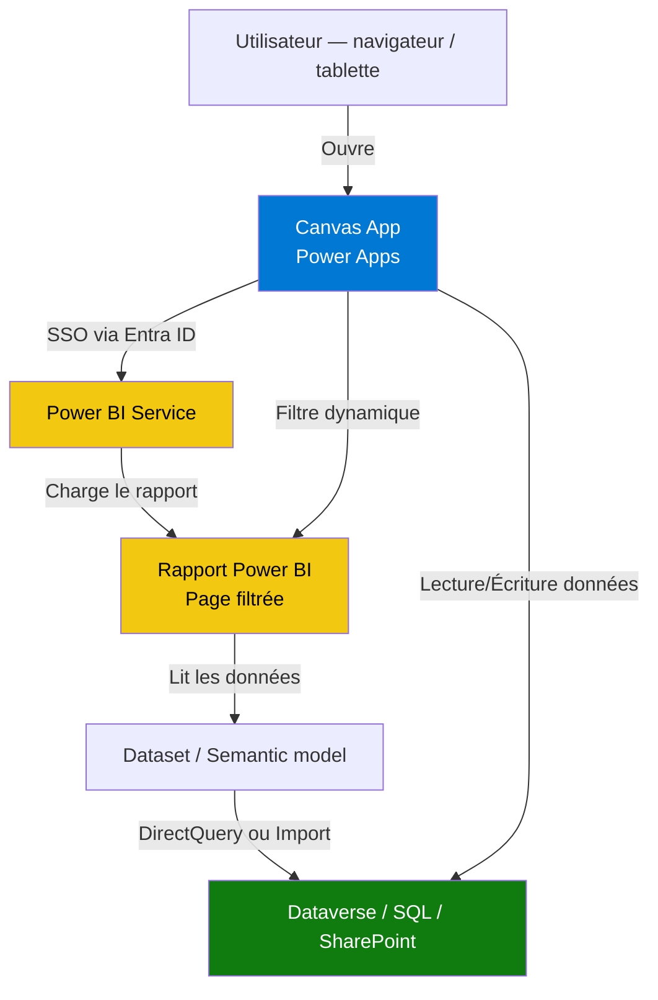

# Scénario C — Dashboard Power BI embarqué dans une Canvas App

## Objectifs pédagogiques

À l'issue de ce module, vous serez capable de :

1. **Expliquer** pourquoi et quand intégrer un rapport Power BI dans une Canvas App plutôt que de les utiliser séparément — et quand ne pas le faire
2. **Décrire** l'architecture technique du composant Power BI dans Power Apps et les flux de données associés
3. **Identifier** les contraintes de licence, de sécurité et de contexte qui conditionnent cette intégration
4. **Concevoir** une architecture combinant interaction utilisateur et analyse, en choisissant le bon mode de données (Import vs DirectQuery) et la bonne stratégie RLS
5. **Diagnostiquer** les erreurs les plus fréquentes : filtre silencieusement inactif, RLS manquante, licence absente, données en retard

---

## Mise en situation

Imaginez une équipe commerciale d'une entreprise de distribution. Deux outils, deux onglets : une Canvas App sur tablette pour saisir les visites clients, et un dashboard Power BI partagé pour suivre les performances. Les managers demandent régulièrement "pourquoi les chiffres ne correspondent pas à ce qu'ils voient dans l'app". Les commerciaux, eux, ont simplement arrêté d'ouvrir le rapport.

La solution naïve : lier les deux par un lien URL. Ça fonctionne jusqu'au jour où vous avez besoin que le rapport se filtre automatiquement sur le commercial connecté, ou que le tableau de bord réagisse à une sélection dans la liste des clients affichée dans l'app. À ce moment-là, le simple lien ne suffit plus.

Ce scénario explore comment construire une **expérience unifiée** : interface opérationnelle dans Power Apps, analytique contextuelle avec Power BI — sans forcer l'utilisateur à changer d'outil. Et comment éviter que ce choix d'architecture devienne un piège en production.

---

## Pourquoi embarquer Power BI dans une Canvas App ?

La séparation entre "outil de saisie / action" et "outil de visualisation / analyse" est techniquement légitime. Mais du point de vue utilisateur, c'est une friction. Un commercial qui vient de saisir une visite veut voir l'impact sur ses KPIs — pas ouvrir un autre onglet.

Il y a trois cas où cette intégration apporte une vraie valeur :

**Contexte opérationnel enrichi.** L'utilisateur agit dans l'app (valider une commande, clôturer un ticket) et a besoin d'un aperçu analytique au même endroit pour prendre sa décision. Le rapport n'est pas là pour être exploré : il est là pour contextualiser une action.

**Filtrage dynamique piloté par l'app.** Le rapport Power BI doit se mettre à jour en fonction de ce que l'utilisateur sélectionne dans l'app. Si je clique sur "Client Dupont SA" dans ma liste, le rapport ne doit montrer que les données de ce client. Ce comportement n'est pas possible avec un simple lien.

**Gouvernance et accès centralisés.** Plutôt que de gérer des licences et des partages séparés pour l'app et le rapport, l'intégration permet une seule interface, un seul point d'accès, une politique de sécurité unifiée.

Et un quatrième cas, souvent oublié : **quand ne pas le faire**. Si le rapport est très lourd (10+ visuels, fort volume de données), si l'équipe BI et l'équipe app fonctionnent en silo avec des cycles de release distincts, ou si la latence directQuery est inacceptable sur mobile, l'intégration crée plus de problèmes qu'elle n'en résout. Un lien externe bien positionné dans l'app reste parfois la meilleure solution.

---

## Architecture : les composants en jeu

Avant de regarder comment les pièces s'assemblent, voici les acteurs principaux :

| Composant | Rôle dans l'architecture | Remarque |
|---|---|---|
| **Canvas App** | Interface principale — actions, formulaires, navigation | Héberge le composant Power BI |
| **Composant Power BI (tile)** | Contrôle natif Power Apps qui charge un rapport ou une page | Disponible via la bibliothèque de composants |
| **Rapport Power BI** | Fichier `.pbix` publié dans un workspace Power BI Service | Doit être dans un workspace accessible |
| **Dataset / Semantic model** | Source de données du rapport — Dataverse, SQL, SharePoint… | Supporte DirectQuery ou Import |
| **Dataverse (optionnel)** | Source commune si l'app et le rapport lisent les mêmes données | Évite les désynchronisations |
| **Power BI Service** | Plateforme de publication et d'hébergement | Requis pour l'embedding — pas de local |
| **Entra ID** | Gère l'authentification SSO entre Power Apps et Power BI | Token utilisateur transmis automatiquement |

Le flux général : l'utilisateur ouvre la Canvas App, son identité est transmise via SSO à Power BI Service, le composant charge le rapport filtré selon le contexte, et chaque interaction dans l'app peut pousser de nouveaux filtres vers le rapport.



Ce qui est important dans ce schéma : **Dataverse peut être la source partagée**. L'app écrit des données, le rapport les lit. Si le semantic model pointe sur le même Dataverse que l'app, vous avez une cohérence naturelle — à condition de bien gérer les délais de rafraîchissement.

---

## Le composant Power BI dans Power Apps — fonctionnement réel

Le contrôle Power BI est un composant natif disponible dans l'éditeur Canvas App. Il se comporte comme n'importe quel autre contrôle — vous pouvez le redimensionner, le placer dans un écran, le rendre visible ou non selon une condition.

Sous le capot, il fait trois choses :

1. **Il récupère un token d'accès** pour l'utilisateur connecté via Entra ID. Pas de saisie de mot de passe, pas de jeton à gérer manuellement.
2. **Il charge le rapport spécifié** (par son WorkspaceId et son ReportId) dans un iframe sécurisé.
3. **Il peut recevoir des filtres** depuis l'app via ses propriétés — le filtre est reconstruit dynamiquement à chaque changement de contexte dans l'app.

La configuration de base dans Power Apps Studio :

```
// Propriétés du contrôle Power BI Tile
WorkspaceId   : "xxxxxxxx-xxxx-xxxx-xxxx-xxxxxxxxxxxx"
ReportId      : "yyyyyyyy-yyyy-yyyy-yyyy-yyyyyyyyyyyy"
```

Ces deux identifiants se lisent directement dans l'URL du rapport sur Power BI Service :
`https://app.powerbi.com/groups/<WorkspaceId>/reports/<ReportId>`

💡 **Astuce** — Stocker ces IDs dans une table de configuration Dataverse plutôt qu'en dur dans l'app. Quand vous promouvez de Dev vers Prod, vous changez les valeurs dans Dataverse — pas besoin de republier l'app.

---

## Le filtrage dynamique : le vrai apport de l'intégration

C'est là que l'intégration dépasse le simple "afficher un rapport". Le contrôle Power BI accepte une propriété de filtre construite en syntaxe d'URL Power BI. Prenons un exemple concret : l'utilisateur sélectionne un client dans une Gallery, et le rapport se filtre automatiquement sur ce client.

```
// Dans la propriété Filter du contrôle Power BI
// Syntaxe : Table/Champ eq 'Valeur'
"Clients/NomClient eq '" & Gallery1.Selected.NomClient & "'"
```

À chaque changement de sélection dans la Gallery, Power Apps reconstruit cette chaîne et la passe au composant — qui recharge le rapport filtré côté Power BI Service.

⚠️ **Erreur fréquente** — Le nom de la table et du champ dans le filtre doivent correspondre exactement aux noms **dans le dataset Power BI**, pas dans Dataverse ou la source d'origine. Si votre table s'appelle `dim_clients` dans le dataset mais `Clients` dans Dataverse, c'est `dim_clients/NomClient` qu'il faut utiliser. Une casse incorrecte ou un espace mal géré rend le filtre **silencieusement inactif** — le rapport se charge, aucun filtre ne s'applique, aucun message d'erreur.

Vous pouvez combiner plusieurs filtres :

```
"Clients/NomClient eq '" & Gallery1.Selected.NomClient & "' and 
 Vendeurs/RegionID eq " & User().Region
```

🧠 **Concept clé** — Les filtres passés depuis Power Apps sont des **filtres de présentation** : ils contrôlent ce que le rapport affiche par défaut, pas ce à quoi l'utilisateur peut accéder. Pour une vraie restriction d'accès aux données, c'est la **Row Level Security (RLS)** du dataset qu'il faut configurer.

---

## Sécurité et RLS : ne pas confondre filtre et contrôle d'accès

C'est probablement le point d'architecture le plus important de ce scénario — et celui qui cause les incidents de sécurité les plus fréquents.

Quand le composant Power BI charge un rapport dans la Canvas App, il utilise l'identité de l'utilisateur connecté. Power BI Service applique les règles RLS définies dans le dataset pour cet utilisateur — exactement comme si l'utilisateur ouvrait le rapport directement dans Power BI Service.

**Ce qui se passe sans RLS :** imaginons que "Commercial A" ouvre l'app. Vous avez correctement configuré un filtre Power Apps qui lui montre uniquement ses clients. Mais si un utilisateur averti désactive le filtre côté URL, ou s'il ouvre le rapport directement dans Power BI Service, il voit **toutes les données de tous les commerciaux**. Le filtre Power Apps ne protège rien — il ne fait que présélectionner.

**Ce qui se passe avec RLS :** même scénario, mais le dataset a une règle `[Email] = USERPRINCIPALNAME()`. Peu importe comment l'utilisateur accède au rapport — via l'app, via Power BI Service, via un lien partagé — il ne voit que ses propres données. La RLS est appliquée par le moteur Power BI, pas par l'interface.

Architecture recommandée :

```
RLS (dataset)       → contrôle QUI voit QUELLES données (sécurité)
Filtre Power Apps   → contrôle CE QUI est affiché par défaut (UX)
```

Les deux sont complémentaires. L'un sans l'autre crée soit un risque de sécurité (filtres sans RLS), soit une mauvaise expérience utilisateur (RLS sans pré-filtrage contextuel).

---

## Matrice de décision d'architecture

Avant de construire, trois questions d'architecture structurantes méritent une réponse explicite. Les réponses ont des implications directes sur la performance, le coût et la complexité.

### Import vs DirectQuery

| Critère | Import (snapshot) | DirectQuery (temps-réel) |
|---|---|---|
| **Latence des données** | Retard = fréquence de refresh (min 30 min en Pro) | Quasi temps-réel — requête à chaque chargement |
| **Performance rapport** | Rapide — données en mémoire | Plus lent — requête à la source à chaque interaction |
| **Impact sur la source** | Aucun à l'usage | Charge sur la base de données source |
| **Cas recommandé** | Volume important, latence acceptable | Données critiques, besoin temps-réel, faible volume |
| **Coût** | Refresh planifié inclus en Pro | DirectQuery sur Dataverse = requêtes API facturées |

**Signal pour passer en DirectQuery :** l'utilisateur saisit une donnée dans l'app et s'attend à la voir dans le rapport dans les secondes qui suivent. Si un refresh toutes les 30 minutes est acceptable, restez en Import.

### RLS obligatoire ou optionnelle ?

| Situation | RLS obligatoire ? |
|---|---|
| Rapport partagé entre plusieurs utilisateurs avec données sensibles (chiffres commerciaux, données RH) | **Oui — obligatoire** |
| Rapport dans une app accessible à toute l'entreprise, données non confidentielles | Optionnelle — mais recommandée |
| Rapport dans une app mono-utilisateur (manager qui voit tout) | Non nécessaire |
| Rapport partagé via Power BI Service en parallèle de l'app | **Oui — obligatoire** (la RLS s'applique dans les deux contextes) |

**Règle simple :** si vous ne pouvez pas garantir que chaque utilisateur qui ouvre le rapport n'a accès qu'à ses propres données, la RLS est obligatoire.

### Stratégie de refresh

| Besoin | Solution | Contrainte |
|---|---|---|
| Données fraîches après saisie dans l'app | Refresh déclenché via Power Automate (connecteur Power BI) | 8 refreshes manuels/jour en Pro, illimité en Premium |
| Refresh régulier suffisant | Refresh planifié (30 min minimum en Pro) | Latence acceptable à définir avec les utilisateurs |
| Temps-réel strict | DirectQuery | Performance plus lente, charge sur la source |

---

## Construction progressive : du basique au production-ready

### Version 1 — Rapport embarqué statique

**Quand c'est suffisant :** l'objectif est simplement d'avoir le rapport accessible depuis l'app, sans interaction entre les deux. 80% des cas de départ.

- Activer le composant Power BI dans Power Apps Studio (`Insert → Power BI tile`)
- Renseigner `WorkspaceId` et `ReportId` en dur
- Vérifier que l'utilisateur a accès au rapport dans Power BI Service (rôle Viewer minimum)
- Tester sur différents comptes pour valider que la RLS s'applique bien

**Signal pour passer à V2 :** les utilisateurs demandent que le rapport se filtre automatiquement sur leur contexte (leur client, leur région, leur commande en cours).

### Version 2 — Filtrage contextuel

**Quand c'est nécessaire :** l'app pilote ce que montre le rapport, pas l'utilisateur.

- Identifier les champs de jonction entre l'app et le dataset (ID client, code région, date…)
- Construire la propriété `Filter` du composant dynamiquement
- Gérer le cas "rien de sélectionné" pour éviter un filtre vide ou invalide :

```
// Éviter un filtre cassé quand aucun élément n'est sélectionné
If(
    IsBlank(Gallery1.Selected.ClientID),
    "",
    "Clients/ClientID eq " & Gallery1.Selected.ClientID
)
```

- Tester aux cas limites : valeur nulle, caractères spéciaux, changement rapide de sélection

**Signal pour passer à V3 :** l'app sort du périmètre d'une équipe, les données sont sensibles, le refresh planifié est insuffisant, ou vous devez déployer sur plusieurs environnements.

### Version 3 — Production avec gouvernance

À ce stade, plusieurs questions d'architecture se posent simultanément. Voici ce qui change réellement — et pourquoi.

**Licences.** Chaque utilisateur qui ouvre la Canvas App avec un composant Power BI doit avoir une licence Power BI Pro ou PPU — ou le rapport doit être dans une capacité Premium / Fabric. Sans ça, le composant affiche une erreur d'accès. Ce n'est pas un problème de configuration corrigeable après coup : c'est une décision budgétaire à prendre avant le déploiement. **Le coût peut être significatif** : 10 € / utilisateur / mois en Pro, multiplié par le nombre d'utilisateurs de l'app. Premium per Capacity résout le problème de licensing pour les utilisateurs en lecture seule, mais ajoute un coût fixe (~5 000 €/mois pour une P1). Si votre app a 200 utilisateurs en lecture, Premium est souvent moins cher que 200 licences Pro.

**Rafraîchissement.** Si le dataset est en Import, un utilisateur qui vient de saisir une commande ne la verra pas dans le rapport avant le prochain refresh. La décision Import vs DirectQuery doit être prise ici, pas lors des remontées utilisateurs post-go-live.

**Environnements.** L'app vit dans un environnement Power Platform (Dev / Test / Prod). Le rapport vit dans un workspace Power BI. Ces deux mondes ont des cycles de déploiement distincts. WorkspaceId et ReportId changent entre les environnements — il faut documenter les dépendances et s'assurer que les IDs sont mis à jour dans chaque contexte. Stocker les IDs dans Dataverse est la solution standard (voir snippet).

---

## Guide de diagnostic : quand quelque chose ne fonctionne pas

En production, les problèmes les plus fréquents ne génèrent pas de messages d'erreur clairs. Voici comment les identifier.

### Le filtre ne s'applique pas

Le rapport se charge mais ignore la sélection dans l'app. Causes possibles dans cet ordre :

1. **Le nom de la table ou du champ est incorrect.** Vérifiez dans Power BI Desktop → vue Données → nom exact de la table et de la colonne dans le dataset. Ce n'est pas le nom dans Dataverse, c'est le nom dans le modèle Power BI.
2. **La casse est incorrecte.** `Clients/NomClient` ≠ `clients/nomclient`. Le filtre est sensible à la casse.
3. **La valeur est nulle ou vide.** Ajoutez un label temporaire dans l'app pour afficher la chaîne de filtre construite. Si elle est vide, l'origine est dans la logique Power Fx, pas dans Power BI.
4. **Le champ est de type texte mais la valeur n'est pas entre guillemets.** `"Clients/ClientID eq " & Text(Gallery1.Selected.ClientID)` vs `"Clients/NomClient eq '" & Gallery1.Selected.NomClient & "'"` — les guillemets simples sont obligatoires pour les chaînes.

**Pattern de debug recommandé :**
```
// Ajouter temporairement un Label dans l'app
// Text de ce label = la chaîne de filtre construite
"Clients/NomClient eq '" & Gallery1.Selected.NomClient & "'"
```
Si le label affiche la bonne valeur et que le filtre ne s'applique toujours pas, le problème est dans le dataset (nom de champ, casse).

### Le composant affiche une erreur d'accès

Causes possibles :
1. **Licence manquante.** L'utilisateur n'a pas de licence Power BI Pro / PPU et le workspace n'est pas en capacité Premium. → Vérifier les licences dans le portail M365 Admin.
2. **Rôle insuffisant dans le workspace.** L'utilisateur doit avoir au minimum le rôle Viewer dans le workspace Power BI. → Vérifier dans Power BI Service → Workspace → Access.
3. **RLS bloque toutes les données.** Si la règle RLS ne correspond à aucune donnée pour cet utilisateur (ex : l'email dans le dataset ne matche pas l'UPN Entra ID), le rapport s'affiche vide ou en erreur. → Tester via Power BI Desktop → Modélisation → Afficher en tant que → saisir l'UPN de l'utilisateur.

### Les données sont en retard

L'utilisateur a saisi une commande dans l'app, il ne la voit pas dans le rapport.
- En mode Import : normal — les données ne se mettent à jour qu'au prochain refresh. Solution : déclencher un refresh via Power Automate après l'écriture (voir snippet).
- En mode DirectQuery : vérifier que le cache Power BI n'est pas actif. DirectQuery a un cache côté service configurable.
- Vérifier si Power Automate déclenche bien le refresh : ouvrir l'historique du flow, vérifier que l'action "Refresh a dataset" s'est exécutée sans erreur.

---

## Cas réel en entreprise

**Contexte :** Un groupe retail (300 points de vente) utilise une Canvas App pour que les responsables de magasin gèrent les réceptions de marchandises et les inventaires. L'équipe BI maintient un rapport Power BI sur les niveaux de stock, les ruptures et les rotations.

**Problème initial :** les responsables ouvraient l'app pour valider les réceptions, puis ouvraient Power BI séparément pour voir l'impact sur le stock. Rapport pas filtré sur leur magasin, données en décalage, pas d'adoption.

**Architecture mise en place :**
- Le rapport Power BI est embarqué dans un écran dédié de la Canvas App
- La RLS du dataset filtre automatiquement sur le `StoreID` de l'utilisateur connecté
- Quand un responsable sélectionne un article dans l'app, le rapport se filtre sur cet article
- Power Automate déclenche un refresh du dataset après chaque validation de réception (via l'API Power BI)

**Résultats :** adoption du rapport multipliée par 4 en 2 mois (mesure via les logs Power BI), réduction des demandes support liées aux "chiffres qui ne correspondent pas" (-60%), suppression d'un rapport Excel parallèle maintenu manuellement.

**Ce qui a failli mal tourner :** les deux premières semaines post-go-live, le refresh déclenché par Automate échouait silencieusement sur 20% des magasins. Cause : les credentials du connecteur Power BI dans Automate étaient liés à un compte de service qui n'avait pas accès à tous les workspaces. Détecté via les logs Automate, corrigé en changeant le compte de service. Sans monitoring des flows, ce problème aurait duré des semaines.

**Ce qui a évolué après :** l'équipe BI a renommé deux colonnes dans le dataset six semaines après le go-live. Les filtres Power Apps ont cessé de fonctionner silencieusement sur 3 des 5 écrans. Correction : établir un contrat d'interface entre l'équipe app et l'équipe BI — les noms de colonnes utilisés comme clés de filtre ne peuvent pas changer sans notification et test. Documenter ces dépendances dans une page Confluence partagée entre les deux équipes.

---

## Limites et points de vigilance

**Le composant n'est pas bidirectionnel.** Vous pouvez passer des filtres depuis Power Apps vers Power BI, mais vous ne pouvez pas récupérer dans Power Apps une sélection faite à l'intérieur du rapport (clic sur un visuel, sélection de segment). Si vous avez besoin d'interactions bidirectionnelles, il faut repenser l'architecture : déporter la logique de sélection entièrement dans l'app, et utiliser le rapport uniquement en lecture. Autre option : construire les visuels directement dans Power Apps avec les contrôles graphiques natifs (plus limité, mais bidirectionnel).

**Mobile et performances.** Le composant charge un iframe complet avec le moteur de rendu Power BI. Sur mobile bas de gamme ou connexion lente, ça peut être perçu comme lourd. Tester sur les appareils cibles avant de livrer — ne pas se fier aux tests sur poste de travail.

**Customisation visuelle limitée.** Vous ne pouvez pas intervenir sur le style interne du rapport depuis Power Apps. Les couleurs, polices et dispositions restent ceux définis dans Power BI Desktop. Vous pouvez masquer la barre de navigation ou les filtres natifs via les paramètres du composant, mais pas aller plus loin.

**Gouvernance des rapports.** Si l'équipe BI renomme des champs ou change le dataset, les filtres passés depuis l'app peuvent silencieusement cesser de fonctionner. Ce risque est souvent sous-estimé dans les projets où les équipes app et BI fonctionnent en silo.

---

## Bonnes pratiques

**Séparer la logique de filtre dans une variable.** Plutôt qu'écrire la chaîne de filtre directement dans la propriété du composant, construisez-la dans une variable via `Set` ou `UpdateContext`. Pendant le développement, affichez cette variable dans un label — c'est votre outil de debug le plus rapide.

**Toujours gérer le cas "pas de sélection".** Un filtre vide ou mal formé provoque une erreur silencieuse. Protégez systématiquement avec `IsBlank()` ou `IsEmpty()` avant de construire la chaîne de filtre.

**Ne pas exposer les IDs de workspace en clair dans l'app.** Stocker les IDs dans une table de configuration Dataverse accessible en lecture seule est plus propre et facilite les changements d'environnement sans republication.

**Documenter le contrat d'interface app ↔ rapport.** Quels champs de filtre ? Quel type (texte / numérique) ? Quelle version du dataset est attendue ? Cette documentation — même une simple page partagée — évite qu'une modification du rapport casse l'app sans que l'équipe BI en soit consciente.

**Planifier la stratégie de refresh dès la conception.** La question "les données sont-elles suffisamment fraîches pour les utilisateurs ?" doit être posée avant de construire, pas après la livraison. Définissez une latence acceptable avec les utilisateurs métier, puis choisissez le mode en conséquence.

**Tester la RLS avec des comptes de test réels.** Créez des comptes test avec des profils RLS différents et testez explicitement que la restriction fonctionne dans le contexte de l'app embarquée — pas seulement dans Power BI Desktop en mode "Afficher en tant que".

---

## Résumé

Ce scénario répond à un besoin concret : permettre à des utilisateurs de travailler dans une seule interface sans perdre l'accès à leurs indicateurs analytiques. Le composant Power BI dans Power Apps rend ça possible techniquement, mais l'architecture mérite d'être pensée avant de construire.

Les pièces clés sont le composant Power BI (pont entre les deux outils), la RLS du dataset (sécurité réelle des données, pas les filtres Power Apps), le filtrage dynamique (contextualisation par l'app), et la stratégie de refresh (cohérence des données). La décision Import vs DirectQuery a des implications sur la performance, le coût et la fraîcheur des données — elle se prend en amont, pas en réaction aux retours utilisateurs.

Côté exploitation, les deux problèmes les plus fréquents post-go-live sont les filtres silencieusement cassés après modification du dataset, et le refresh qui échoue sans alerter. Les deux se préviennent par un contrat d'interface documenté entre les équipes et un monitoring des flows Automate.

Le prochain scénario pousse l'intégration dans une autre direction : Copilot Studio pour créer un agent conversationnel dans Teams, avec des actions pilotées par Power Automate.

---

<!-- snippet
id: powerbi_canvas_composant_config
type: command
tech: power apps
level: intermediate
importance: high
format: knowledge
tags: power bi, canvas app, embedding, workspace, report
title: Configurer le composant Power BI dans une Canvas App
context: Dans Power Apps Studio, après avoir inséré le contrôle "Power BI tile" via Insert
command: WorkspaceId : "<WORKSPACE_ID>" / ReportId : "<REPORT_ID>"
example: WorkspaceId : "a3f5c2d1-0011-4abc-8def-123456789abc" / ReportId : "b9e7f3a2-ccdd-4123-9abc-987654321def"
description: Les deux IDs se lisent directement dans l'URL du rapport sur Power BI Service : /groups/<WorkspaceId>/reports/<ReportId>
-->

<!-- snippet
id: powerbi_canvas_filtre_dynamique
type: command
tech: power apps
level: intermediate
importance: high
format: knowledge
tags: power bi, canvas app, filtre, dynamique, gallery
title: Passer un filtre dynamique au rapport Power BI depuis l'app
context: Dans la propriété Filter du contrôle Power BI tile, reliée à une Gallery
command: "Table/Champ eq '" & <GALLERY>.Selected.<CHAMP> & "'"
example: "Clients/NomClient eq '" & Gallery1.Selected.NomClient & "'"
description: Le nom Table/Champ doit correspondre aux noms dans le dataset Power BI, pas dans Dataverse. Casse incorrecte = filtre silencieusement inactif, aucun message d'erreur.
-->

<!-- snippet
id: powerbi_canvas_filtre_debug
type: tip
tech: power apps
level: intermediate
importance: high
format: knowledge
tags: power bi, canvas app, filtre, debug, diagnostic
title: Déboguer un filtre Power BI silencie
