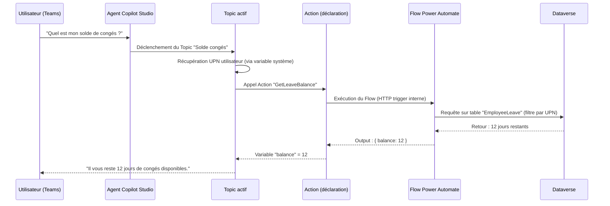

# Scénario D — Agent Copilot Studio dans Teams avec actions Automate

## Objectifs pédagogiques

À l'issue de ce module, vous serez capable de :

1. **Décrire** l'architecture d'un agent Copilot Studio déployé dans Microsoft Teams et identifier le rôle de chaque composant
2. **Distinguer** les Topics, les Actions et les Flows dans la chaîne de traitement d'une conversation
3. **Expliquer** comment un agent délègue une tâche métier à Power Automate via une Action et récupère un résultat
4. **Identifier** les points de décision architecturaux : authentification, périmètre des données, gestion des erreurs conversationnelles
5. **Évaluer** quand ce pattern est approprié versus une approche Canvas App ou un Flow déclenché manuellement

---

## Mise en situation

Votre équipe RH reçoit chaque semaine des dizaines de demandes répétitives dans Teams : "Quel est mon solde de congés ?", "Comment soumettre une note de frais ?", "Qui est mon RH référent ?". Ces demandes arrivent par messages directs, emails, ou tickets ServiceNow — sans cohérence.

L'objectif est de déployer un **agent conversationnel dans Teams** qui répond à ces questions en langage naturel, en allant chercher les données réelles dans Dataverse (solde de congés, référent RH) et en déclenchant des processus existants dans Power Automate (soumission de formulaire, notification à un manager).

Ce scénario représente exactement ce que Copilot Studio + Power Automate est conçu pour faire. Mais pour que ça tienne en production — sans que l'agent réponde n'importe quoi ou échoue silencieusement —, il faut comprendre comment les pièces s'assemblent.

---

## Contexte : pourquoi ce pattern existe

Avant Copilot Studio (anciennement Power Virtual Agents), créer un chatbot d'entreprise exigeait soit un développement bot framework complet, soit des outils externes souvent hors écosystème M365. L'intégration Teams était complexe, la connexion à Dataverse manuelle, et la surface d'administration séparée du reste de la Power Platform.

Copilot Studio change ça en intégrant trois choses dans un seul outil : la logique conversationnelle (Topics), la connexion aux données et processus (Actions via Automate), et le déploiement natif dans Teams. L'agent n'est pas un simple FAQ statique — il peut agir, pas seulement répondre.

Ce qui rend ce pattern particulièrement pertinent dans un contexte intermédiaire, c'est qu'il **orchestre des composants que vous connaissez déjà** (Dataverse, Automate, Teams) d'une façon que vous n'avez peut-être pas encore vue : à travers le prisme d'une conversation.

---

## Architecture du système

### Vue d'ensemble des composants

| Composant | Rôle | Outil / Emplacement |
|---|---|---|
| **Agent Copilot Studio** | Point d'entrée conversationnel, gère le dialogue | Copilot Studio (make.powerapps.com ou teams.microsoft.com) |
| **Topic** | Unité logique de conversation : déclencheur → nœuds → réponse | Éditeur graphique Copilot Studio |
| **Action (Automate)** | Pont entre l'agent et un Flow Power Automate | Déclaration dans Copilot Studio → Flow dédié |
| **Flow Power Automate** | Exécute la logique métier : lecture Dataverse, appel API, envoi mail | Power Automate (déclenché "When an agent calls a flow") |
| **Dataverse** | Source de données principale (congés, employés, référents) | Tables Dataverse de l'environnement |
| **Microsoft Teams** | Canal de diffusion de l'agent, interface utilisateur finale | Teams App — onglet ou chat direct avec le bot |
| **Authentification (SSO)** | Identifie l'utilisateur dans Teams pour personnaliser les réponses | Azure AD / Entra ID, configuré dans les paramètres de l'agent |

### Flux d'exécution — de la question à la réponse

Ce diagramme montre ce qui se passe en ~2 secondes côté utilisateur. L'important à retenir : **l'agent ne requête jamais Dataverse directement**. Il délègue systématiquement à un Flow, ce qui garde la logique métier centralisée et modifiable sans toucher à l'agent.

---

## Les trois niveaux de logique : Topic, Action, Flow

C'est le point d'architecture le plus important à comprendre, et aussi celui sur lequel les erreurs de conception sont les plus fréquentes.

### Le Topic : la conversation

Un Topic est une conversation atomique. Il a un **déclencheur** (les phrases qui l'activent), une **séquence de nœuds** (questions, conditions, messages, appels d'actions), et une **fin** (message de clôture ou transfert).

Le Topic contient la logique de dialogue : "Si l'utilisateur dit X, demande Y. Si la réponse à Y est Z, appelle telle action. Sinon, propose autre chose." Il ne contient **pas** de logique métier — il ne sait pas comment calculer un solde de congés, il sait juste quand et comment demander ce calcul.

🧠 **Concept clé** — Un Topic est un gestionnaire de flux conversationnel, pas un exécuteur de logique métier. Sa responsabilité s'arrête à "quand appeler quoi et comment présenter le résultat".

### L'Action : le pont déclaratif

Une Action dans Copilot Studio est une déclaration : "Il existe un processus appelable nommé `GetLeaveBalance`, qui accepte ces paramètres en entrée et retourne ces variables en sortie." L'Action est définie dans Copilot Studio mais **son implémentation vit dans Power Automate**.

Concrètement, dans l'éditeur, vous ajoutez une Action à un Topic en sélectionnant un Flow existant. Copilot Studio lit automatiquement les inputs/outputs du Flow et les expose comme des variables dans le Topic.

💡 **Astuce** — Le Flow doit utiliser le déclencheur spécifique **"When an agent calls a flow"** (anciennement "When a Power Virtual Agents flow is invoked"). Sans ce déclencheur exact, le Flow n'apparaît pas dans la liste des Actions disponibles dans Copilot Studio.

### Le Flow : l'exécuteur

Le Flow Power Automate reçoit les paramètres de l'agent, exécute la logique (requêtes Dataverse, appels API externes, transformations de données), et retourne un résultat structuré. Il est ignorant de la conversation — il ne sait pas qu'il est appelé depuis un agent. Il reçoit des inputs, retourne des outputs. Point.

Cette séparation nette est une force architecturale : vous pouvez modifier la logique métier dans le Flow sans rouvrir l'agent, et vous pouvez tester le Flow indépendamment.

---

## Authentification et personnalisation

C'est le deuxième pilier architectural du scénario. Un agent générique qui répond "voici les congés de l'entreprise" est utile. Un agent qui répond "voici **vos** congés" est ce que les utilisateurs attendent.

Pour y arriver, l'agent doit connaître l'identité de l'utilisateur courant. Dans Teams, c'est possible via le **SSO (Single Sign-On) avec Azure AD / Entra ID**.

Une fois configuré, Copilot Studio expose des **variables système** dans chaque Topic :
- `System.User.DisplayName` — le nom affiché de l'utilisateur
- `System.User.PrincipalName` — l'UPN (ex. `paul.dupont@contoso.com`)
- `System.User.Id` — l'ID Azure AD de l'utilisateur

Ces variables peuvent être passées comme paramètres d'une Action, ce qui permet au Flow de filtrer Dataverse sur l'UPN de l'utilisateur connecté plutôt que de retourner toutes les données.

⚠️ **Erreur fréquente** — Configurer l'authentification dans Copilot Studio mais oublier de la **tester depuis Teams**. Dans le Studio, l'aperçu utilise votre compte de test et l'authentification semble fonctionner. En production dans Teams, si le SSO n'est pas correctement configuré dans l'app Teams associée au bot, les variables `System.User.*` reviennent vides — et vos Flows filtrent sur une chaîne vide, retournant 0 résultat.

---

## Workflow de construction — du squelette au déploiement Teams

La construction d'un tel agent suit une progression logique. Ne pas brûler les étapes évite de déboguer deux systèmes en parallèle (l'agent ET le Flow) quand quelque chose ne fonctionne pas.

### Étape 1 — Créer le Flow Power Automate en premier

Avant d'ouvrir Copilot Studio, construisez et testez le Flow de façon autonome.

1. Créer un nouveau Flow avec le déclencheur **"When an agent calls a flow"**
2. Déclarer les inputs (ex. `userUPN` de type Text)
3. Ajouter une action **"List rows"** sur la table Dataverse `EmployeeLeave` avec un filtre `UPN eq '<userUPN>'`
4. Ajouter un nœud **"Return value(s) to the virtual agent"** avec les outputs (ex. `balance` de type Number)
5. Tester le Flow manuellement via le bouton Test → saisir un UPN réel → vérifier le retour

> À cette étape, l'agent n'existe pas encore. Vous validez uniquement la logique métier.

### Étape 2 — Créer l'agent et configurer l'authentification

Dans Copilot Studio (`make.powerapps.com` → Copilot Studio) :

1. Créer un nouvel agent, choisir la langue, donner un nom ("HR Assistant")
2. Dans **Settings → Security → Authentication**, sélectionner **"Authenticate with Microsoft"** (mode Teams SSO)
3. Configurer l'App Registration Azure AD associée si ce n'est pas fait automatiquement

### Étape 3 — Créer le Topic et brancher l'Action

1. Créer un Topic "Solde de congés"
2. Ajouter les phrases déclencheuses : "solde congés", "jours de congés", "combien de congés", etc.
3. Dans le canvas du Topic, ajouter un nœud **"Call an action"** → sélectionner le Flow créé à l'étape 1
4. Mapper l'input `userUPN` → `System.User.PrincipalName`
5. Stocker l'output `balance` dans une variable de Topic (ex. `VarBalance`)
6. Ajouter un nœud **"Message"** : `"Il vous reste {VarBalance} jours de congés."`

### Étape 4 — Tester dans le panneau de prévisualisation

L'éditeur Copilot Studio intègre un chat de test. À ce stade, testez le Topic complet : déclenchez-le avec une phrase naturelle, vérifiez que l'Action s'exécute et que la variable est bien peuplée.

💡 **Astuce** — Le panneau de test affiche les variables et leur valeur à chaque étape du Topic. C'est votre premier outil de débogage avant même d'aller dans Teams.

### Étape 5 — Déployer dans Teams

1. Dans Copilot Studio → **Publish** → publier l'agent
2. Aller dans **Channels → Microsoft Teams** → "Turn on Teams"
3. Copilot Studio génère un lien d'installation ou un fichier de manifeste `.zip` pour Teams Admin Center
4. L'agent apparaît comme une application Teams que les utilisateurs peuvent épingler et ouvrir en chat

---

## Gestion des erreurs conversationnelles

Un aspect souvent négligé dans les architectures d'agents : **que se passe-t-il quand le Flow échoue ?**

Par défaut, si le Flow Power Automate retourne une erreur (timeout Dataverse, permission manquante, données introuvables), Copilot Studio affiche un message générique peu utile. Pour une expérience production acceptable, il faut traiter les erreurs à deux niveaux.

**Au niveau du Flow** : utiliser un bloc "Try-Catch" (scope + configure run after) pour capturer les erreurs et retourner un output dédié — par exemple un champ `errorMessage` en plus de `balance`. Si `errorMessage` n'est pas vide, le Topic peut afficher un message adapté au lieu d'un crash silencieux.

**Au niveau du Topic** : Copilot Studio dispose d'un Topic système appelé **"Error"** qui se déclenche en cas d'échec non géré. Personnalisez ce Topic pour proposer à l'utilisateur de contacter le support ou de reformuler sa demande.

⚠️ **Erreur fréquente** — Laisser le Topic "Fallback" et le Topic "Error" dans leur état par défaut (messages générés automatiquement en anglais). En production, ces Topics sont ceux que les utilisateurs voient le plus souvent aux premières semaines de déploiement — ils méritent autant d'attention que les Topics principaux.

---

## Limites et points de vigilance

Ce pattern est puissant mais il a des contraintes concrètes à connaître avant de s'y engager.

**Latence des Actions** : chaque appel à un Flow Power Automate ajoute une latence de 1 à 3 secondes dans la conversation. Si un Topic enchaîne 3 Actions successives (données profil → solde congés → politique RH), l'utilisateur attend 5 à 10 secondes entre sa question et la réponse. Il faut concevoir les Topics pour minimiser le nombre d'appels — un seul Flow qui retourne plusieurs données vaut mieux que trois Flows séquentiels.

**Quota et throttling** : Power Automate a des limites d'appels selon la licence. Un agent Teams déployé à 500 utilisateurs qui font 10 requêtes/jour génère 5 000 exécutions de Flow quotidiennes. Vérifiez que la licence de l'environnement couvre ce volume avant le déploiement.

**Données sensibles dans la conversation** : les messages de l'agent apparaissent dans l'historique de chat Teams. Ne jamais afficher dans un message conversationnel des données ultra-sensibles (numéro de sécurité sociale, données de santé). Les afficher dans une Adaptive Card avec "expiration" ou rediriger l'utilisateur vers une app dédiée.

**Versionning de l'agent** : Copilot Studio n'a pas de système de branches comme Git. En environnement multi-développeurs, deux personnes ne peuvent pas travailler en parallèle sur le même agent sans risque de conflit. La bonne pratique est de maintenir un agent par environnement (dev / test / prod) et d'utiliser les solutions Power Platform pour promouvoir.

🧠 **Concept clé** — Copilot Studio est inclus dans la solution ALM de la Power Platform : un agent peut être exporté dans une solution, versionné et déployé via pipeline comme n'importe quel autre composant. Ce point sera traité dans le module suivant (Scénario E).

---

## Bonnes pratiques

**Nommez vos Topics de façon intentionnelle.** Un Topic nommé "Topic 3" dans 6 mois sera incompréhensible. Utilisez le format `[Domaine] - [Intention]` : "RH - Solde congés", "IT - Réinitialisation mot de passe".

**Externalisez toute logique métier dans les Flows.** Si vous vous retrouvez à mettre des conditions complexes directement dans le canvas du Topic (5 branches, calculs), c'est un signal que cette logique appartient à un Flow. Le Topic doit rester lisible en 30 secondes.

**Utilisez les Adaptive Cards pour les réponses riches.** Un message texte `"Vous avez 12 jours de congés, dont 5 reportés de l'année précédente et 7 acquis cette année"` est lisible. La même information dans une Adaptive Card avec des champs labellisés est bien plus claire. Copilot Studio supporte nativement les Adaptive Cards dans les nœuds de message.

**Testez toujours depuis Teams, pas seulement depuis le Studio.** L'authentification, le rendu des Adaptive Cards et la gestion des espaces de noms de variables se comportent légèrement différemment selon le canal. Ce qui marche dans le panneau de test peut ne pas marcher dans Teams si le SSO n'est pas correctement configuré.

**Séparez les Flows "agent" des Flows "processus".** Un Flow créé pour être appelé par un agent ne devrait faire qu'une chose : préparer et retourner des données à l'agent. La logique de notification, d'approbation ou d'écriture complexe devrait être déléguée à un second Flow appelé depuis le premier. Cela facilite la maintenance et le test indépendant.

---

## Résumé

Un agent Copilot Studio dans Teams s'articule autour de trois composants distincts : les **Topics** gèrent le dialogue, les **Actions** déclarent les ponts vers Power Automate, et les **Flows** exécutent la logique métier. Cette séparation n'est pas arbitraire — elle permet de modifier la logique sans rouvrir l'agent, et de tester chaque couche indépendamment.

L'authentification SSO avec Entra ID est le mécanisme qui transforme un agent générique en assistant personnalisé : les variables `System.User.*` permettent de filtrer les données sur l'utilisateur connecté sans qu'il ait besoin de se réidentifier.

Les principales limites à anticiper sont la latence des Actions (minimiser les appels séquentiels), le quota d'exécutions Automate, et la gestion des erreurs conversationnelles — qui mérite autant de soin que les Topics nominaux.

Ce pattern est le bon choix quand le besoin est un accès conversationnel à des données ou processus existants pour un large groupe d'utilisateurs Teams. Il ne remplace pas une Canvas App quand l'interaction est complexe (formulaires longs, navigation multi-écrans), ni un Flow planifié quand la tâche n'est pas déclenchée par un utilisateur.

---

<!-- snippet
id: copilot_flow_trigger_agent
type: concept
tech: copilot studio
level: intermediate
importance: high
format: knowledge
tags: copilot studio, power automate, action, trigger, flow
title: Déclencheur obligatoire pour un Flow appelé depuis un agent
content: Un Flow Power Automate n'est visible comme Action dans Copilot Studio que s'il utilise le déclencheur "When an agent calls a flow". Sans ce déclencheur précis, le Flow n'apparaît pas dans la liste des Actions disponibles lors de la configuration d'un Topic. Ce déclencheur déclare automatiquement les inputs/outputs exposables à l'agent.
description: Sans ce déclencheur spécifique, le Flow est invisible dans Copilot Studio — aucun message d'erreur explicite.
-->

<!-- snippet
id: copilot_sso_variables_system
type: concept
tech: copilot studio
level: intermediate
importance: high
format: knowledge
tags: copilot studio, authentification, sso, teams, variables
title: Variables système SSO disponibles dans un Topic
content: Quand l'authentification "Authenticate with Microsoft" est activée, Copilot Studio expose trois variables système utilisables dans tout Topic : System.User.DisplayName (nom affiché), System.User.PrincipalName (UPN, ex. paul.dupont@contoso.com), System.User.Id (Azure AD Object ID). Ces valeurs sont passables comme paramètres d'une Action pour filtrer Dataverse sur l'utilisateur courant.
description: Ces variables permettent de personnaliser les réponses sans demander à l'utilisateur de s'identifier manuellement.
-->

<!-- snippet
id: copilot_sso_teams_empty_var
type: warning
tech: copilot studio
level: intermediate
importance: high
format: knowledge
tags: copilot studio, sso, teams, debug, authentification
title: SSO fonctionnel en Studio mais variables vides dans Teams
content: Piège : l'authentification SSO semble fonctionner dans le panneau de test Copilot Studio (votre session dev est utilisée), mais en production Teams les variables System.User.* reviennent vides. Cause : l'App Registration Azure AD associée à l'agent n'est pas correctement liée à l'application Teams déployée. Correction : vérifier dans Azure AD que l'URI de redirection de l'app bot correspond à l'agent, et re-publier l'application Teams après toute modification de l'App Registration.
description: Symptôme silencieux — l'agent répond mais sans données personnalisées, car le filtre Dataverse porte sur une chaîne vide.
-->

<!-- snippet
id: copilot_action_latency_pattern
type: tip
tech: copilot studio
level: intermediate
importance: medium
format: knowledge
tags: copilot studio, performance, action, flow, latence
title: Regrouper les données dans un seul Flow pour réduire la latence
content: Chaque appel à une Action (Flow) ajoute 1 à 3 secondes de latence. Pour un Topic qui a besoin de 3 données distinctes (profil, solde congés, référent RH), créer un seul Flow "GetEmployeeContext" qui retourne les trois valeurs en une exécution, plutôt que 3 Flows séquentiels. Résultat : 2-3 secondes de latence totale au lieu de 5-9 secondes.
description: Concevoir les Flows d'agent autour de "contextes" (tout ce qu'on sait d'un utilisateur) plutôt que de données unitaires.
-->

<!-- snippet
id: copilot_topic_naming_convention
type: tip
tech: copilot studio
level: intermediate
importance: medium
format: knowledge
tags: copilot studio, topic, organisation, nommage
title: Convention de nommage des Topics par domaine et intention
content: Nommer les Topics avec le format "[Domaine] - [Intention]" (ex. "RH - Solde congés", "IT - Réinitialisation MDP"). Dans un agent avec 20+ Topics, ce nommage permet de retrouver un Topic en 10 secondes et de comprendre sa responsabilité sans l'ouvrir. Copilot Studio ne propose pas de dossiers — la convention de nommage est le seul outil d'organisation disponible.
description: Sans convention, les noms générés automatiquement ("Topic 1", "Topic 2") deviennent ingérables dès que l'agent grossit.
-->

<!-- snippet
id: copilot_error_topic_default
type: warning
tech: copilot studio
level: intermediate
importance: high
format: knowledge
tags: copilot studio, erreur, fallback, topic systeme, ux
title: Topics système Error et Fallback non personnalisés en production
content: Piège : les Topics système "Error" et "Fallback" sont livrés avec des messages génériques en anglais. Ces Topics sont déclenchés lors de tout échec d'Action ou de toute phrase non reconnue — c'est ce que les utilisateurs voient le plus souvent en phase de démarrage. Correction : personnaliser immédiatement ces deux Topics avec des messages en français, une invitation à reformuler, et un lien vers le support.
description: Ne pas personnaliser ces Topics = première impression dégradée lors de chaque erreur ou incompréhension.
-->

<!-- snippet
id: copilot_flow_separation_concern
type: concept
tech: copilot studio
level: intermediate
importance: medium
format: knowledge
tags: copilot studio, power automate, architecture, separation, flow
title: Séparation des responsabilités entre Topic, Action et Flow
content: Architecture en 3 couches : le Topic gère uniquement le dialogue (quand poser une question, quoi afficher), l'Action est une déclaration de pont (ce Flow existe et retourne ces variables), le Flow exécute la logique métier (requête Dataverse, appel API, calcul). Un Flow "agent" ne doit faire qu'une chose : préparer des données pour l'agent. Les effets de bord (notifications, approbations) vont dans un Flow distinct appelé en chaîne.
description: Cette séparation permet de modifier la logique métier sans rouvrir l'agent et de tester chaque couche indépendamment.
-->

<!-- snippet
id: copilot_teams_deploy_channel
type: concept
tech: copilot studio
level: intermediate
importance: medium
format: knowledge
tags: copilot studio, teams, déploiement, channel, publication
title: Séquence de déploiement d'un agent vers Teams
content: Séquence obligatoire : 1) Publier l'agent dans Copilot Studio (bouton Publish — sans cette étape, les changements ne sont pas visibles en dehors du Studio). 2) Activer le canal Teams dans Channels → Microsoft Teams. 3) Récupérer le lien d'installation direct ou exporter le manifeste .zip pour déploiement via Teams Admin Center. Un agent non publié peut être testé dans le Studio mais n'est pas accessible dans Teams.
description: Oublier l'étape "Publish" est l'erreur la plus fréquente lors du premier déploiement Teams.
-->

<!-- snippet
id: copilot_adaptive_card_richness
type: tip
tech: copilot studio
level: intermediate
importance: low
format: knowledge
tags: copilot studio, adaptive card, ux, teams, message
title: Utiliser les Adaptive Cards pour les réponses structurées multi-champs
content: Pour une réponse avec plusieurs champs (ex. solde congés : acquis, reportés, pris), utiliser une Adaptive Card dans le nœud Message plutôt qu'une longue phrase texte. Copilot Studio intègre un éditeur Adaptive Card natif. Bénéfice concret : l'utilisateur voit des champs labellisés, pas une phrase à analyser. Les Adaptive Cards supportent aussi des boutons d'action pour déclencher un Topic suivant directement depuis la carte.
description: Les Adaptive Cards sont plus lisibles et permettent des CTA (boutons) sans que l'utilisateur tape une nouvelle phrase.
-->
