# Scénario E — Pipeline CI/CD PAC CLI pour solution multi-composants

## Objectifs pédagogiques

À l'issue de ce module, vous serez capable de :

1. **Décrire** le rôle de PAC CLI dans une chaîne ALM Power Platform et ce qu'il remplace concrètement
2. **Concevoir** la structure d'un référentiel Git adapté à une solution multi-composants (apps, flows, tables, plugins)
3. **Construire** un pipeline CI qui extrait, décompresse et valide une solution non gérée depuis un environnement de développement
4. **Construire** un pipeline CD qui empaquète et déploie une solution gérée vers les environnements cible
5. **Identifier** les pièges classiques liés aux connexions, aux variables d'environnement et à la gestion des secrets dans ce contexte

---

## Mise en situation

Vous intégrez une équipe de quatre développeurs qui travaille sur une solution Power Platform baptisée **CRM Interne**. Elle regroupe une Canvas App, cinq Power Automate flows dont deux appellent des connecteurs HTTP, deux tables Dataverse personnalisées, un plugin C# enregistré sur Dataverse, et quelques variables d'environnement pour gérer les URLs selon l'environnement.

Pendant trois mois, le déploiement a été manuel : export depuis le portail, import dans l'environnement de test, rebelote pour la production. Résultat ? Des "oublis" réguliers — un flow désactivé qui part en prod, une variable d'environnement mal renseignée, une collision entre deux personnes qui exportent simultanément des versions différentes. Et surtout, aucune traçabilité : impossible de savoir exactement ce qui a changé entre deux déploiements.

La solution naïve — partager le fichier `.zip` par email ou Teams — ne tient pas à l'échelle. L'équipe a besoin d'un pipeline reproductible, versionné et automatisé. C'est exactement ce que ce module construit.

---

## Pourquoi PAC CLI plutôt que le portail

Le portail Power Platform permet d'exporter et d'importer des solutions, mais il le fait en boîte noire : vous récupérez un fichier `.zip` opaque, impossible à versionner proprement avec Git. Deux exports successifs de la même solution produisent des archives dont les différences sont illisibles pour un outil de diff classique.

**PAC CLI** (Power Apps CLI / Power Platform CLI) casse ce verrou. En utilisant la commande `pac solution unpack`, il décompresse la solution en une arborescence de fichiers XML, JSON et autres sources lisibles — chaque composant dans son propre fichier. Cette arborescence peut être commitée, reviewée en pull request, et comparée entre deux versions comme n'importe quel code source.

C'est le pivot central de l'ALM Power Platform : pas de pipeline sérieux sans PAC CLI.

🧠 **Concept clé** — La distinction solution gérée / non gérée est fondamentale ici. En développement, on travaille avec une solution **non gérée** (on peut modifier les composants librement). En test et production, on déploie une solution **gérée** (les composants sont verrouillés, les suppressions sont contrôlées). Le pipeline CI exporte la non gérée, le pipeline CD déploie la gérée.

---

## Architecture du pipeline

Avant de regarder les commandes, voici comment les environnements et les étapes s'articulent.

```mermaid
flowchart LR
    DEV["🛠️ Env DEV\n(non géré)"]
    GIT["📦 Git Repository\n(solution unpackée)"]
    CI["🔄 Pipeline CI\nExport · Unpack · Commit"]
    CD["🚀 Pipeline CD\nPack · Deploy"]
    TEST["🧪 Env TEST\n(géré)"]
    PROD["🏭 Env PROD\n(géré)"]

    DEV -->|pac solution export| CI
    CI -->|pac solution unpack| GIT
    GIT -->|trigger on merge main| CD
    CD -->|pac solution pack --managed| TEST
    TEST -->|approbation manuelle| PROD
```



Ce schéma traduit une règle simple : **le développement s'exporte, la production s'importe**. Personne ne touche directement à l'environnement de test ou de production — tout passe par le pipeline.

### Composants en jeu

| Composant | Rôle dans la chaîne | Remarque |
|---|---|---|
| PAC CLI | Outil en ligne de commande pour export/unpack/pack/import | S'installe comme outil .NET global |
| Azure DevOps (ou GitHub Actions) | Moteur d'orchestration du pipeline | Les deux sont supportés nativement |
| Service Principal / Application ID | Authentification non-interactive vers Dataverse | Obligatoire pour les pipelines sans intervention humaine |
| Solution non gérée | Sortie de l'environnement de développement | Contient tous les composants dans leur état éditable |
| Solution gérée | Artéfact déployé en test/prod | Produit par le pipeline CD à partir des sources Git |
| Variables d'environnement PP | Paramètres qui changent selon l'env (URLs, etc.) | Gérées séparément via un fichier de valeurs |
| Connection References | Liens abstraits vers les connecteurs dans les flows | Doivent être reconfigurées à chaque déploiement |

---

## Structure du référentiel Git

Une organisation claire du dépôt évite la majorité des problèmes. Voici une structure éprouvée :

```
/CRMInterne
├── src/
│   └── CRMInterne/          ← solution unpackée par PAC CLI
│       ├── CanvasApps/
│       ├── Workflows/
│       ├── Entities/
│       ├── PluginAssemblies/
│       └── [Content_Types].xml
├── config/
│   ├── connection-references.json   ← mapping des connexions par env
│   └── env-vars-test.json           ← valeurs des variables d'env pour TEST
│   └── env-vars-prod.json           ← valeurs des variables d'env pour PROD
├── pipelines/
│   ├── ci-export.yml
│   └── cd-deploy.yml
└── README.md
```

Le dossier `src/CRMInterne/` est entièrement géré par PAC CLI — ne l'éditez jamais à la main. Le dossier `config/` est lui édité manuellement par l'équipe quand une connexion ou une URL change.

⚠️ **Erreur fréquente** — Ne jamais committer le dossier `.pac/` ni les fichiers d'authentification locaux (`.token.json`). Ajoutez-les au `.gitignore` immédiatement.

---

## Construction progressive du pipeline

### Étape 1 — Authentification non-interactive

Le pipeline tourne sans intervention humaine. Il faut donc un **Service Principal** (une application Enregistrée dans Azure AD) avec les droits nécessaires sur les environnements Dataverse.

```bash
# Créer un profil d'authentification PAC CLI avec un Service Principal
pac auth create \
  --name <NOM_PROFIL> \
  --kind ServicePrincipal \
  --applicationId <APP_ID> \
  --clientSecret <CLIENT_SECRET> \
  --tenant <TENANT_ID> \
  --environment <ENV_URL>
```

Dans Azure DevOps, les valeurs `APP_ID`, `CLIENT_SECRET` et `TENANT_ID` viennent d'un **Variable Group** lié à Azure Key Vault — jamais en clair dans le YAML du pipeline.

💡 **Astuce** — Créez un Service Principal distinct par environnement (un pour DEV, un pour TEST, un pour PROD). Cela limite la surface d'attaque et vous permet de tracer précisément quel pipeline a fait quoi dans les logs Dataverse.

---

### Étape 2 — Pipeline CI : export et unpack

Le pipeline CI se déclenche typiquement sur une branche feature ou à intervalle régulier. Il exporte la solution depuis DEV, la décompresse, et ouvre une Pull Request vers `main`.

```yaml
# pipelines/ci-export.yml (Azure DevOps)
trigger:
  branches:
    include:
      - feature/*

pool:
  vmImage: ubuntu-latest

steps:
  - task: PowerShell@2
    displayName: "Install PAC CLI"
    inputs:
      targetType: inline
      script: dotnet tool install --global Microsoft.PowerApps.CLI.Tool

  - task: PowerShell@2
    displayName: "Authenticate"
    inputs:
      targetType: inline
      script: |
        pac auth create \
          --kind ServicePrincipal \
          --applicationId $(APP_ID) \
          --clientSecret $(CLIENT_SECRET) \
          --tenant $(TENANT_ID) \
          --environment $(DEV_ENV_URL)

  - task: PowerShell@2
    displayName: "Export solution (unmanaged)"
    inputs:
      targetType: inline
      script: |
        pac solution export \
          --name CRMInterne \
          --path $(Build.ArtifactStagingDirectory)/CRMInterne.zip \
          --managed false \
          --overwrite

  - task: PowerShell@2
    displayName: "Unpack solution"
    inputs:
      targetType: inline
      script: |
        pac solution unpack \
          --zipfile $(Build.ArtifactStagingDirectory)/CRMInterne.zip \
          --folder src/CRMInterne \
          --packagetype Unmanaged

  - task: PublishPipelineArtifact@1
    inputs:
      targetPath: src/CRMInterne
      artifactName: solution-source
```

> Le `pac solution unpack` produit les fichiers XML/JSON que Git peut comparer proprement. C'est ce diff qui sera reviewé dans la Pull Request.

---

### Étape 3 — Pipeline CD : pack et déploiement

Le pipeline CD se déclenche quand un merge atterrit sur `main`. Il repackage la solution en version gérée, puis la déploie sur TEST. Le déploiement sur PROD nécessite une approbation manuelle.

```yaml
# pipelines/cd-deploy.yml (Azure DevOps)
trigger:
  branches:
    include:
      - main

stages:
  - stage: DeployTest
    displayName: "Deploy to TEST"
    jobs:
      - job: PackAndDeploy
        pool:
          vmImage: ubuntu-latest
        steps:
          - task: PowerShell@2
            displayName: "Install PAC CLI"
            inputs:
              targetType: inline
              script: dotnet tool install --global Microsoft.PowerApps.CLI.Tool

          - task: PowerShell@2
            displayName: "Pack solution (managed)"
            inputs:
              targetType: inline
              script: |
                pac solution pack \
                  --zipfile $(Build.ArtifactStagingDirectory)/CRMInterne_managed.zip \
                  --folder src/CRMInterne \
                  --packagetype Managed

          - task: PowerShell@2
            displayName: "Authenticate to TEST"
            inputs:
              targetType: inline
              script: |
                pac auth create \
                  --kind ServicePrincipal \
                  --applicationId $(APP_ID) \
                  --clientSecret $(CLIENT_SECRET_TEST) \
                  --tenant $(TENANT_ID) \
                  --environment $(TEST_ENV_URL)

          - task: PowerShell@2
            displayName: "Import to TEST"
            inputs:
              targetType: inline
              script: |
                pac solution import \
                  --path $(Build.ArtifactStagingDirectory)/CRMInterne_managed.zip \
                  --activate-plugins true \
                  --force-overwrite \
                  --publish-changes

  - stage: DeployProd
    displayName: "Deploy to PROD"
    dependsOn: DeployTest
    condition: succeeded()
    jobs:
      - deployment: ProdApproval
        environment: "Production"        # ← gate d'approbation Azure DevOps
        strategy:
          runOnce:
            deploy:
              steps:
                - task: PowerShell@2
                  displayName: "Import to PROD"
                  inputs:
                    targetType: inline
                    script: |
                      pac auth create \
                        --applicationId $(APP_ID) \
                        --clientSecret $(CLIENT_SECRET_PROD) \
                        --tenant $(TENANT_ID) \
                        --environment $(PROD_ENV_URL)
                      pac solution import \
                        --path $(Pipeline.Workspace)/CRMInterne_managed.zip \
                        --activate-plugins true \
                        --force-overwrite \
                        --publish-changes
```

---

### Étape 4 — Gérer les variables d'environnement et les connection references

C'est souvent là que les pipelines naïfs échouent. Une solution qui fonctionne en DEV peut arriver cassée en TEST si les connexions ne sont pas reconfigurées.

**Variables d'environnement Power Platform** — Elles stockent des valeurs qui diffèrent par environnement (URL d'une API, chemin d'un fichier SharePoint, etc.). Après import, vous devez les alimenter avec les bonnes valeurs :

```bash
# Mettre à jour une variable d'environnement après import
pac env update-var \
  --name my_api_url \
  --value "https://api.test.monentreprise.com"
```

En pratique, ce bloc s'exécute depuis un fichier JSON de configuration (`env-vars-test.json`) parsé dans le pipeline, pour éviter de dupliquer les commandes.

**Connection References** — Les flows Power Automate référencent des connexions de manière abstraite via des "connection references". Au déploiement, chaque référence doit être mappée à une connexion existante dans l'environnement cible. Ce mapping se fait dans un fichier JSON passé à la commande d'import :

```bash
pac solution import \
  --path CRMInterne_managed.zip \
  --connectionReferencesSuffix _test \
  --settings config/connection-references.json
```

⚠️ **Erreur fréquente** — Si les connection references ne sont pas renseignées lors de l'import, les flows arrivent en état désactivé sans message d'erreur explicite. Vérifiez systématiquement l'état des flows dans l'environnement cible après chaque déploiement.

---

## Diagnostic — Erreurs fréquentes

| Symptôme | Cause probable | Correction |
|---|---|---|
| `pac solution import` échoue avec 401 | Le Service Principal n'a pas le rôle System Administrator sur l'environnement cible | Ajouter le SP comme Application User dans l'environnement via le portail |
| Flows désactivés après import | Connection references non mappées | Fournir le fichier de mapping au moment de l'import |
| Diff Git inexploitable après unpack | `pac solution unpack` pas utilisé, on versionne le `.zip` | Toujours unpack avant commit, jamais versionner le `.zip` |
| Plugin non activé en prod | `--activate-plugins` omis à l'import | Ajouter le flag à la commande `pac solution import` |
| Variables d'environnement vides en TEST | Pas d'étape post-import pour les alimenter | Ajouter une étape dédiée avec `pac env update-var` ou via Power Platform Build Tools |
| Export échoue sur un flow avec connexion premium | Connecteur premium non licencié sur le SP | Utiliser un compte de service avec les licences appropriées |

---

## Bonnes pratiques

**1. Ne stockez jamais de secrets dans le YAML du pipeline.** Utilisez des Variable Groups Azure DevOps liés à Azure Key Vault. Le YAML ne contient que des références (`$(CLIENT_SECRET_TEST)`), jamais les valeurs.

**2. Versionnez la solution avec un numéro de build automatique.** Configurez le numéro de version de la solution pour inclure l'ID de build Azure DevOps — ça permet de savoir exactement quelle version du pipeline a produit ce qui tourne en prod.

**3. Séparez clairement les profils d'authentification PAC par environnement.** `pac auth list` doit montrer un profil nommé et distinct pour DEV, TEST et PROD. Ne réutilisez pas le même Service Principal partout.

**4. Publiez les customizations à l'import.** L'option `--publish-changes` sur `pac solution import` évite d'avoir à le faire manuellement après déploiement. Sans elle, certains composants (notamment les model-driven apps) ne seront pas à jour.

**5. Ajoutez une étape de vérification post-déploiement.** Après l'import, appelez `pac solution list` pour confirmer que la version attendue est bien présente. C'est cinq lignes de PowerShell qui vous évitent de découvrir un échec silencieux lors du premier test manuel.

**6. Gérez les dépendances entre solutions.** Si votre solution dépend d'une solution de base (par exemple, une solution de configuration partagée), importez les dépendances en premier dans le pipeline CD — dans le bon ordre.

**7. Ne modifiez jamais directement l'environnement de test ou de production.** Toute modification passe par DEV → Git → pipeline. Cette règle est plus importante que n'importe quelle commande de ce module.

---

## Cas réel en entreprise

Une équipe d'une ESN travaillant pour un client retail a mis en place ce pipeline sur une solution Power Platform couvrant la gestion des retours produits — environ 15 composants (Canvas App, 8 flows, 3 tables Dataverse, un plugin de calcul de frais).

Avant le pipeline, chaque déploiement prenait 45 minutes et produisait régulièrement des régressions (flow oublié, variable manquante). Avec le pipeline PAC CLI sur Azure DevOps :

- Durée de déploiement ramenée à **8 minutes** (CI compris)
- **Zéro régression liée au processus** sur les trois mois suivants (les bugs restants étaient dans le code, pas dans le déploiement)
- Pull Requests avec diff lisible — les revues de code sont devenues possibles là où elles étaient inexistantes
- Traçabilité complète : chaque déploiement en prod est lié à un commit Git et à un ID de build

Le seul point de friction résiduel était la gestion des connection references, qui a nécessité un fichier de mapping maintenu à la main par l'équipe pour chaque environnement.

---

## Résumé

Ce module a construit une chaîne ALM complète pour une solution Power Platform multi-composants. L'outil central est **PAC CLI**, qui transforme une solution opaque en arborescence de fichiers versionnables. Le pipeline CI extrait et décompresse la solution depuis l'environnement de développement pour alimenter Git ; le pipeline CD repackage ces sources en solution gérée et la déploie vers test puis production. Les deux points de fragilité classiques — les **connection references** et les **variables d'environnement** — nécessitent un traitement explicite après l'import, sous peine d'avoir des flows silencieusement désactivés. L'authentification non-interactive repose sur des Service Principals distincts par environnement, dont les secrets transitent exclusivement par Azure Key Vault. La suite logique de ce travail est de poser la gouvernance à l'échelle : inventorier les environnements, appliquer des politiques DLP et surveiller l'ensemble du tenant — c'est l'objet du module suivant.

---

<!-- snippet
id: pac_solution_export_unmanaged
type: command
tech: pac-cli
level: intermediate
importance: high
format: knowledge
tags: pac-cli, solution, export, alm, ci
title: Exporter une solution non gérée depuis un environnement
command: pac solution export --name <SOLUTION_NAME> --path <OUTPUT_PATH>.zip --managed false --overwrite
example: pac solution export --name CRMInterne --path ./artifacts/CRMInterne.zip --managed false --overwrite
description: Exporte la solution non gérée depuis l'environnement authentifié. --managed false obligatoire pour CI — la version gérée est produite par pack, jamais exportée.
-->

<!-- snippet
id: pac_solution_unpack_git
type: command
tech: pac-cli
level: intermediate
importance: high
format: knowledge
tags: pac-cli, solution, unpack, git, versionning
title: Décompresser une solution pour la versionner dans Git
command: pac solution unpack --zipfile <ZIP_PATH> --folder <DESTINATION_FOLDER> --packagetype Unmanaged
example: pac solution unpack --zipfile ./artifacts/CRMInterne.zip --folder src/CRMInterne --packagetype Unmanaged
description: Décompresse la solution en arborescence XML/JSON lisible par Git. Sans cette étape, le .zip est un binaire — aucun diff exploitable entre deux versions.
-->

<!-- snippet
id: pac_solution_pack_managed
type: command
tech: pac-cli
level: intermediate
importance: high
format: knowledge
tags: pac-cli, solution, pack, managed, cd
title: Repackager les sources en solution gérée pour le déploiement
command: pac solution pack --zipfile <OUTPUT_MANAGED>.zip --folder <SOURCE_FOLDER> --packagetype Managed
example: pac solution pack --zipfile ./artifacts/CRMInterne_managed.zip --folder src/CRMInterne --packagetype Managed
description: Produit la solution gérée à partir des sources Git. C'est cet artefact qui part en TEST et PROD — jamais l'export direct de DEV.
-->

<!-- snippet
id: pac_solution_import_prod
type: command
tech: pac-cli
level: intermediate
importance: high
format: knowledge
tags: pac-cli, solution, import, deploy, pipeline
title: Importer une solution gérée dans un environnement cible
command: pac solution import --path <MANAGED_ZIP> --activate-plugins true --force-overwrite --publish-changes
example: pac solution import --path ./artifacts/CRMInterne_managed.zip --activate-plugins true --force-overwrite --publish-changes
description: --activate-plugins active les plugins après import, --publish-changes évite une étape manuelle. Sans --publish-changes, certains composants (model-driven apps) peuvent ne pas être à jour.
-->

<!-- snippet
id: pac_auth_service_principal
type: command
tech: pac-cli
level: intermediate
importance: high
format: knowledge
tags: pac-cli, authentification, service-principal, pipeline, security
title: Authentification non-interactive PAC CLI via Service Principal
command: pac auth create --kind ServicePrincipal --applicationId <APP_ID> --clientSecret <CLIENT_SECRET> --tenant <TENANT_ID> --environment <ENV_URL>
example: pac auth create --kind ServicePrincipal --applicationId "a1b2c3d4-..." --clientSecret "$(CLIENT_SECRET_TEST)" --tenant "mytenant.onmicrosoft.com" --environment "https://myorg.crm.dynamics.com"
description: Crée un profil d'auth PAC sans interaction humaine. CLIENT_SECRET doit venir d'un Variable Group Azure DevOps lié à Key Vault — jamais en clair dans le YAML.
-->

<!-- snippet
id: pac_managed_vs_unmanaged
type: concept
tech: pac-cli
level: intermediate
importance: high
format: knowledge
tags: pac-cli, solution, alm, managed, unmanaged
title: Différence solution gérée vs non gérée dans le pipeline ALM
content: Solution non gérée = développement uniquement. Les composants sont modifiables librement dans l'environnement. Solution gérée = ce qui est déployé en test/prod. Les composants sont verrouillés et les suppressions sont contrôlées par les métadonnées. Règle pipeline : on exporte toujours la non gérée depuis DEV, on reconstruit la gérée par `pac solution pack` depuis Git.
description: La gérée n'est jamais exportée directement — elle est reconstruite par le pipeline depuis les sources versionnées. Clé pour garantir la cohérence entre Git et prod.
-->

<!-- snippet
id: pac_connection_references_silent_fail
type: warning
tech: pac-cli
level: intermediate
importance: high
format: knowledge
tags: pac-cli, connection-references, flows, import, piège
title: Connection references non mappées → flows désactivés silencieusement
content: Piège : si les connection references ne sont pas fournies au moment de l'import, les flows arrivent désactivés dans l'environnement cible sans message d'erreur explicite dans les logs du pipeline. Correction : passer un fichier de mapping avec --settings config/connection-references.json sur la commande pac solution import. Vérifier l'état des flows après chaque déploiement.
description: L'import réussit avec code 0 même si les flows sont désactivés. Toujours valider l'état des flows post-déploiement, pas seulement le code retour du pipeline.
-->

<!-- snippet
id: pac_env_update_var
type: command
tech: pac-cli
level: intermediate
importance: medium
format: knowledge
tags: pac-cli, variables-environnement, post-import, configuration
title: Mettre à jour une variable d'environnement PP après import
command: pac env update-var --name <VAR_NAME> --value "<VAR_VALUE>"
example: pac env update-var --name my_api_url --value "https://api.test.monentreprise.com"
description: À exécuter après pac solution import pour alimenter les variables d'environnement PP avec les valeurs propres à chaque cible. Sans cette étape, les variables héritent des valeurs de DEV ou restent vides.
-->

<!-- snippet
id: pac_gitignore_auth_files
type: warning
tech: pac-cli
level: intermediate
importance: medium
format: knowledge
tags: pac-cli, git, sécurité, authentification, gitignore
title: Ne jamais versionner les fichiers d'authentification PAC CLI
content: Piège : PAC CLI stocke les tokens localement dans .pac/ et peut produire des fichiers .token.json dans le répertoire de travail. Si ces fichiers sont commités, les credentials du Service Principal sont exposés dans l'historique Git. Correction : ajouter .pac/ et *.token.json au .gitignore avant le premier commit.
description: Un .gitignore manquant expose les credentials SP dans l'historique Git — même après suppression du fichier, ils restent dans les commits précédents.
-->

<!-- snippet
id: pac_sp_par_environnement
type: tip
tech: pac-cli
level: intermediate
importance: medium
format: knowledge
tags: pac-cli, service-principal, sécurité, devops, gouvernance
title: Créer un Service Principal distinct par environnement cible
content: Créer un SP dédié pour DEV, un pour TEST, un pour PROD plutôt qu'un SP unique partagé. Résultat concret : dans les logs d'audit Dataverse, chaque import est attribué à un compte distinct — on sait précisément quel pipeline a modifié quoi. En cas de compromission d'un secret, seul un environnement est exposé. La rotation des secrets n'impacte qu'un seul pipeline stage.
description: Un SP par environnement limite la surface d'attaque et garantit la traçabilité des imports dans les logs d'audit Dataverse.
-->
